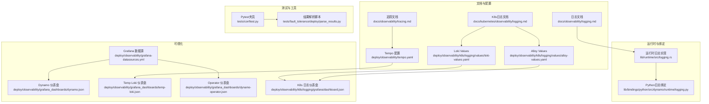
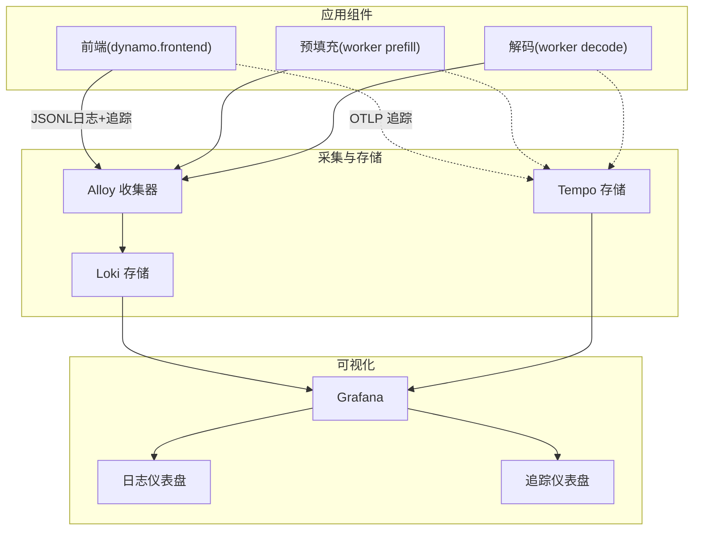
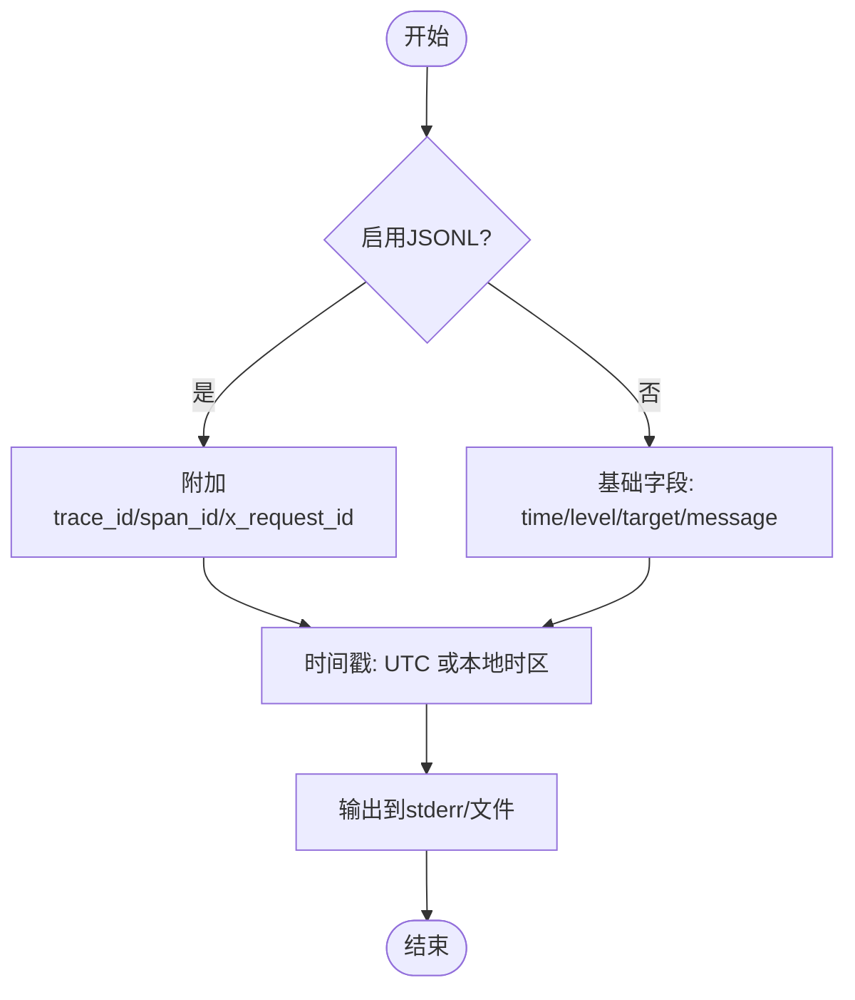
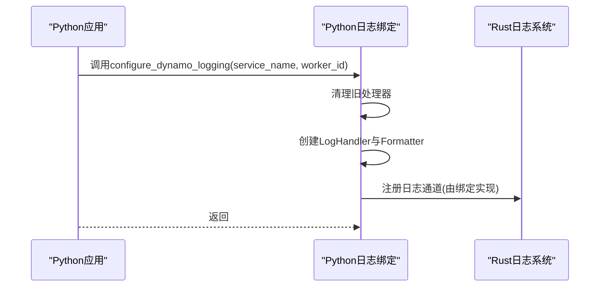
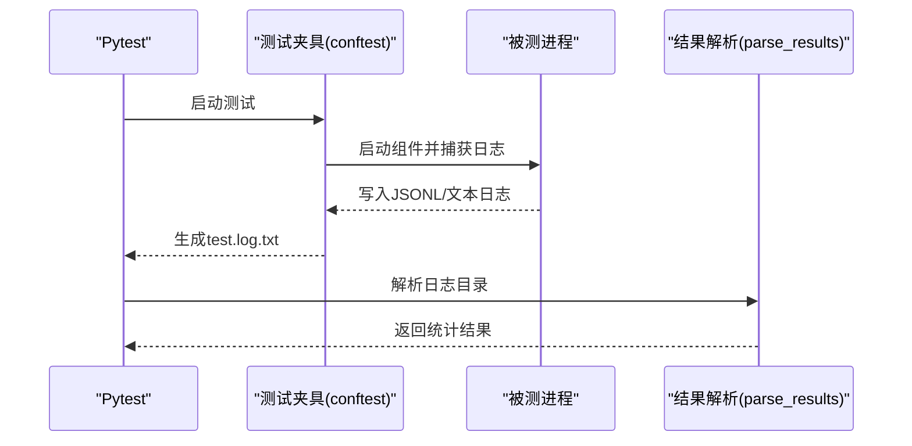
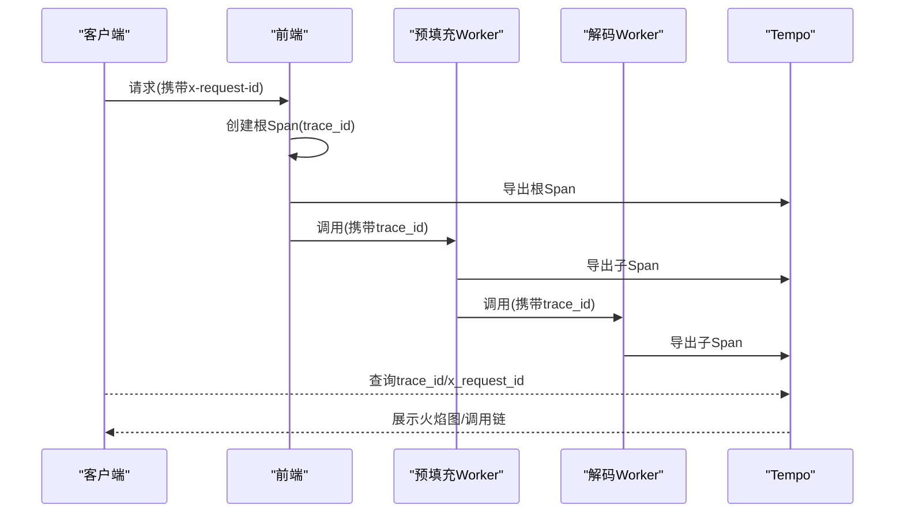
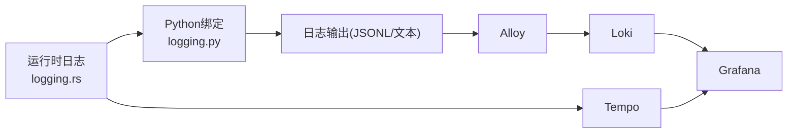

# 日志分析与调试

<cite>
**本文引用的文件**
- [docs/observability/logging.md](file://docs/observability/logging.md)
- [docs/kubernetes/observability/logging.md](file://docs/kubernetes/observability/logging.md)
- [docs/observability/tracing.md](file://docs/observability/tracing.md)
- [lib/runtime/src/logging.rs](file://lib/runtime/src/logging.rs)
- [lib/bindings/python/src/dynamo/runtime/logging.py](file://lib/bindings/python/src/dynamo/runtime/logging.py)
- [components/src/dynamo/common/config_dump/config_dumper.py](file://components/src/dynamo/common/config_dump/config_dumper.py)
- [lib/runtime/src/metrics.rs](file://lib/runtime/src/metrics.rs)
- [tests/conftest.py](file://tests/conftest.py)
- [tests/fault_tolerance/deploy/parse_results.py](file://tests/fault_tolerance/deploy/parse_results.py)
- [deploy/observability/grafana-datasources.yml](file://deploy/observability/grafana-datasources.yml)
- [deploy/observability/grafana_dashboards/dynamo.json](file://deploy/observability/grafana_dashboards/dynamo.json)
- [deploy/observability/grafana_dashboards/temp-loki.json](file://deploy/observability/grafana_dashboards/temp-loki.json)
- [deploy/observability/grafana_dashboards/dynamo-operator.json](file://deploy/observability/grafana_dashboards/dynamo-operator.json)
- [deploy/observability/k8s/logging/grafana/dashboard.json](file://deploy/observability/k8s/logging/grafana/dashboard.json)
- [deploy/observability/tempo.yaml](file://deploy/observability/tempo.yaml)
- [deploy/observability/k8s/logging/values/alloy-values.yaml](file://deploy/observability/k8s/logging/values/alloy-values.yaml)
- [deploy/observability/k8s/logging/values/loki-values.yaml](file://deploy/observability/k8s/logging/values/loki-values.yaml)
- [deploy/observability/k8s/logging/grafana/loki-datasource.yaml](file://deploy/observability/k8s/logging/grafana/loki-datasource.yaml)
- [deploy/observability/k8s/logging/grafana/logging-dashboard.yaml](file://deploy/observability/k8s/logging/grafana/logging-dashboard.yaml)
- [lib/runtime/examples/rust-toolchain.toml](file://lib/runtime/examples/rust-toolchain.toml)
</cite>

## 目录
1. [简介](#简介)
2. [项目结构](#项目结构)
3. [核心组件](#核心组件)
4. [架构总览](#架构总览)
5. [详细组件分析](#详细组件分析)
6. [依赖关系分析](#依赖关系分析)
7. [性能考量](#性能考量)
8. [故障排查指南](#故障排查指南)
9. [结论](#结论)
10. [附录](#附录)

## 简介
本指南面向Dynamo平台的开发者与运维工程师，系统讲解日志结构与格式、日志级别与字段语义、时间序列分析方法；深入解析错误日志的识别技巧（常见错误模式、堆栈跟踪分析、根因定位）；介绍调试工具与技术（断点调试、性能剖析、内存泄漏检测）；提供日志聚合与搜索实践（ELK/OTel栈、日志过滤与告警）；解释如何结合分布式追踪进行端到端问题排查；并给出调试环境搭建、测试用例编写与问题复现的实操建议。

## 项目结构
围绕日志与可观测性，Dynamo在多处提供支撑：
- 文档层：提供日志与追踪的使用说明、变量配置、示例请求与可视化入口
- 运行时层：实现结构化日志（文本/JSONL）、时间戳与时区控制、可选Span事件、OpenTelemetry集成
- Python绑定：统一Python侧日志配置，确保与Rust运行时一致
- 测试与工具：测试夹具自动收集日志、解析结果脚本支持JSONL时间戳提取
- 可视化与采集：Grafana Loki/Aloym/Tempo配置与仪表盘

图表来源
- [docs/observability/logging.md](file://docs/observability/logging.md#L1-L263)
- [docs/kubernetes/observability/logging.md](file://docs/kubernetes/observability/logging.md#L1-L155)
- [docs/observability/tracing.md](file://docs/observability/tracing.md#L1-L215)
- [lib/runtime/src/logging.rs](file://lib/runtime/src/logging.rs#L1015-L1114)
- [lib/bindings/python/src/dynamo/runtime/logging.py](file://lib/bindings/python/src/dynamo/runtime/logging.py#L47-L89)
- [tests/conftest.py](file://tests/conftest.py#L190-L202)
- [tests/fault_tolerance/deploy/parse_results.py](file://tests/fault_tolerance/deploy/parse_results.py#L159-L176)
- [deploy/observability/grafana-datasources.yml](file://deploy/observability/grafana-datasources.yml#L18-L24)
- [deploy/observability/grafana_dashboards/dynamo.json](file://deploy/observability/grafana_dashboards/dynamo.json#L1-L53)
- [deploy/observability/grafana_dashboards/temp-loki.json](file://deploy/observability/grafana_dashboards/temp-loki.json#L1-L57)
- [deploy/observability/grafana_dashboards/dynamo-operator.json](file://deploy/observability/grafana_dashboards/dynamo-operator.json#L1-L56)
- [deploy/observability/k8s/logging/grafana/dashboard.json](file://deploy/observability/k8s/logging/grafana/dashboard.json#L1-L57)
- [deploy/observability/tempo.yaml](file://deploy/observability/tempo.yaml#L1-L37)
- [deploy/observability/k8s/logging/values/alloy-values.yaml](file://deploy/observability/k8s/logging/values/alloy-values.yaml#L85-L113)
- [deploy/observability/k8s/logging/values/loki-values.yaml](file://deploy/observability/k8s/logging/values/loki-values.yaml)

章节来源
- [docs/observability/logging.md](file://docs/observability/logging.md#L1-L263)
- [docs/kubernetes/observability/logging.md](file://docs/kubernetes/observability/logging.md#L1-L155)
- [docs/observability/tracing.md](file://docs/observability/tracing.md#L1-L215)

## 核心组件
- 结构化日志与级别
  - 支持文本与JSONL两种输出格式，JSONL包含trace_id、span_id等追踪上下文字段
  - 日志级别从低到高为：ERROR、WARN、INFO、DEBUG、TRACE
  - 时间戳可选择UTC或本地时区
- 运行时日志实现
  - 提供按模块路径的细粒度日志级别控制
  - 可选开启Span事件（如SPAN_FIRST_ENTRY、SPAN_CLOSED）
  - 支持从外部加载自定义TOML配置
- Python日志绑定
  - 统一配置Python侧Logger，避免重复处理器
  - 支持服务名与工作线程标识前缀
- 配置转储
  - 在DEBUG级别或指定路径下输出完整配置快照，便于排障
- 指标与监控
  - Prometheus指标封装，支持自动标签注入与直方图桶自定义
- 测试与解析
  - Pytest夹具自动写入测试日志文件
  - 解析脚本可从JSONL中抽取时间戳与关键字段辅助分析

章节来源
- [lib/runtime/src/logging.rs](file://lib/runtime/src/logging.rs#L1015-L1114)
- [lib/bindings/python/src/dynamo/runtime/logging.py](file://lib/bindings/python/src/dynamo/runtime/logging.py#L47-L89)
- [components/src/dynamo/common/config_dump/config_dumper.py](file://components/src/dynamo/common/config_dump/config_dumper.py#L98-L130)
- [lib/runtime/src/metrics.rs](file://lib/runtime/src/metrics.rs#L198-L485)
- [tests/conftest.py](file://tests/conftest.py#L190-L202)
- [tests/fault_tolerance/deploy/parse_results.py](file://tests/fault_tolerance/deploy/parse_results.py#L159-L176)

## 架构总览
Dynamo的日志与追踪链路如下：
- 组件启动时根据环境变量初始化日志与追踪
- JSONL格式日志包含trace_id、span_id、x_request_id等字段
- Grafana Loki通过Alloy采集日志并标注标签
- Grafana Tempo接收OTLP追踪数据，与日志中的trace_id关联
- 仪表盘提供日志与追踪的可视化查询

图表来源
- [docs/observability/logging.md](file://docs/observability/logging.md#L97-L118)
- [docs/observability/tracing.md](file://docs/observability/tracing.md#L18-L26)
- [deploy/observability/k8s/logging/values/alloy-values.yaml](file://deploy/observability/k8s/logging/values/alloy-values.yaml#L85-L113)
- [deploy/observability/tempo.yaml](file://deploy/observability/tempo.yaml#L1-L37)
- [deploy/observability/k8s/logging/grafana/dashboard.json](file://deploy/observability/k8s/logging/grafana/dashboard.json#L1-L57)
- [deploy/observability/grafana_dashboards/temp-loki.json](file://deploy/observability/grafana_dashboards/temp-loki.json#L1-L57)

## 详细组件分析

### 日志结构与格式
- 文本格式
  - 包含时间戳、级别、模块路径与消息体
  - 示例展示在非JSONL模式下的典型输出
- JSONL格式
  - 每行一条JSON对象，包含time、level、target、message、file、line等字段
  - 启用追踪后，追加trace_id、span_id、span_name、x_request_id等
  - 可选开启Span事件，用于记录Span生命周期事件
- 时间与时区
  - 默认UTC；可通过环境变量切换为本地时区
- 模块级日志级别
  - 通过DYN_LOG设置默认级别与模块覆盖规则

图表来源
- [docs/observability/logging.md](file://docs/observability/logging.md#L49-L118)
- [lib/runtime/src/logging.rs](file://lib/runtime/src/logging.rs#L1071-L1099)

章节来源
- [docs/observability/logging.md](file://docs/observability/logging.md#L49-L118)
- [lib/runtime/src/logging.rs](file://lib/runtime/src/logging.rs#L1057-L1114)

### Python日志绑定
- 初始化流程
  - 移除现有处理器，避免重复
  - 创建LogHandler并设置格式器（可带服务名与工作线程前缀）
- 使用建议
  - 在组件启动时调用统一入口，保证与Rust侧日志风格一致
  - 前缀有助于区分多实例或多进程输出

图表来源
- [lib/bindings/python/src/dynamo/runtime/logging.py](file://lib/bindings/python/src/dynamo/runtime/logging.py#L47-L89)

章节来源
- [lib/bindings/python/src/dynamo/runtime/logging.py](file://lib/bindings/python/src/dynamo/runtime/logging.py#L47-L89)

### 配置转储与调试
- 触发条件
  - 指定dump路径时写入文件；失败回退到stdout
  - 当日志级别为DEBUG或更低时，自动输出配置快照
- 字段与用途
  - 输出完整配置信息，便于核对部署一致性与参数生效情况
- 注意
  - 发生异常时记录错误但不中断流程，确保降级可用

章节来源
- [components/src/dynamo/common/config_dump/config_dumper.py](file://components/src/dynamo/common/config_dump/config_dumper.py#L98-L130)

### 指标与监控
- 能力概览
  - 封装Counter/Gauge/Histogram等指标类型
  - 自动注入命名空间、组件、端点等标签
  - 支持动态标签与常量标签组合
- 使用建议
  - 在关键路径埋点，关注延迟分布与错误计数
  - 通过Grafana仪表盘聚合查看趋势

章节来源
- [lib/runtime/src/metrics.rs](file://lib/runtime/src/metrics.rs#L198-L485)

### 测试日志与结果解析
- 测试夹具
  - 自动为每个测试创建独立目录并写入test.log.txt
  - 格式化输出，便于快速定位失败用例
- 结果解析
  - 从JSONL中解析time字段，辅助统计与排序
  - 支持按测试阶段汇总成功率等指标

图表来源
- [tests/conftest.py](file://tests/conftest.py#L190-L202)
- [tests/fault_tolerance/deploy/parse_results.py](file://tests/fault_tolerance/deploy/parse_results.py#L159-L176)

章节来源
- [tests/conftest.py](file://tests/conftest.py#L190-L202)
- [tests/fault_tolerance/deploy/parse_results.py](file://tests/fault_tolerance/deploy/parse_results.py#L159-L176)

### 分布式追踪与端到端排查
- 追踪导出
  - 启用OTEL_EXPORT_ENABLED并配置OTLP端点
  - JSONL中包含trace_id、span_id，便于短时调试
- Grafana Tempo
  - 通过OTLP接收追踪数据
  - 支持按服务名、Span名称、标签（如x_request_id）检索
- 端到端关联
  - 使用同一trace_id串联前端、预填充、解码各阶段日志
  - 结合Grafana Explore与面板进行火焰图分析

图表来源
- [docs/observability/tracing.md](file://docs/observability/tracing.md#L18-L26)
- [docs/observability/logging.md](file://docs/observability/logging.md#L97-L118)
- [deploy/observability/tempo.yaml](file://deploy/observability/tempo.yaml#L1-L37)

章节来源
- [docs/observability/tracing.md](file://docs/observability/tracing.md#L1-L215)
- [docs/observability/logging.md](file://docs/observability/logging.md#L97-L118)

## 依赖关系分析
- 组件耦合
  - 运行时日志实现与Python绑定通过统一接口对接
  - 测试框架与解析脚本形成闭环，提升回归效率
- 外部依赖
  - Loki/Alloy负责日志采集与标签映射
  - Tempo负责追踪数据接收与持久化
  - Grafana作为统一入口，连接多种数据源

图表来源
- [lib/runtime/src/logging.rs](file://lib/runtime/src/logging.rs#L1015-L1114)
- [lib/bindings/python/src/dynamo/runtime/logging.py](file://lib/bindings/python/src/dynamo/runtime/logging.py#L47-L89)
- [deploy/observability/k8s/logging/values/alloy-values.yaml](file://deploy/observability/k8s/logging/values/alloy-values.yaml#L85-L113)
- [deploy/observability/tempo.yaml](file://deploy/observability/tempo.yaml#L1-L37)
- [deploy/observability/grafana-datasources.yml](file://deploy/observability/grafana-datasources.yml#L18-L24)

章节来源
- [lib/runtime/src/logging.rs](file://lib/runtime/src/logging.rs#L1015-L1114)
- [lib/bindings/python/src/dynamo/runtime/logging.py](file://lib/bindings/python/src/dynamo/runtime/logging.py#L47-L89)
- [deploy/observability/k8s/logging/values/alloy-values.yaml](file://deploy/observability/k8s/logging/values/alloy-values.yaml#L85-L113)
- [deploy/observability/tempo.yaml](file://deploy/observability/tempo.yaml#L1-L37)
- [deploy/observability/grafana-datasources.yml](file://deploy/observability/grafana-datasources.yml#L18-L24)

## 性能考量
- 日志开销
  - JSONL与追踪字段会增加序列化与网络传输成本，建议仅在调试期开启
  - 合理设置日志级别，避免在生产环境输出过多DEBUG/TRACE
- 追踪导出
  - OTLP导出可能带来额外CPU与网络开销，建议按需启用
  - Tempo配置应考虑WAL与块大小，平衡查询性能与存储成本
- 指标采样
  - 对高频指标采用直方图分桶策略，减少Prometheus抓取压力

## 故障排查指南
- 快速定位
  - 使用x-request-id在日志与追踪中建立关联，快速锁定请求全链路
  - 通过Grafana Loki的标签过滤（如level、service_name、component_type）缩小范围
- 常见错误模式
  - 资源耗尽：ERROR级别出现OOM或GPU/CPU资源不足提示
  - 重试与降级：WARN级别频繁重试或回退逻辑
  - 启停事件：INFO级别记录组件启动/停止与关键配置
- 堆栈与根因
  - 结合JSONL中的file/line与trace_id，定位具体模块与调用栈
  - 使用Tempo火焰图观察热点与阻塞点
- 配置核验
  - 启用配置转储，比对部署配置与期望值
- 回归验证
  - 利用测试夹具生成的日志文件，配合解析脚本自动化统计

章节来源
- [docs/observability/logging.md](file://docs/observability/logging.md#L49-L118)
- [docs/observability/tracing.md](file://docs/observability/tracing.md#L113-L151)
- [components/src/dynamo/common/config_dump/config_dumper.py](file://components/src/dynamo/common/config_dump/config_dumper.py#L98-L130)
- [tests/conftest.py](file://tests/conftest.py#L190-L202)
- [tests/fault_tolerance/deploy/parse_results.py](file://tests/fault_tolerance/deploy/parse_results.py#L159-L176)

## 结论
通过结构化日志、统一的Python绑定、完善的追踪导出与可视化体系，Dynamo提供了从单机调试到Kubernetes集群的全链路可观测能力。建议在开发与联调阶段开启JSONL与追踪，在生产环境中以“按需”原则控制日志级别与导出开关，并结合仪表盘与解析脚本形成标准化的排障流程。

## 附录

### 环境变量速查
- 日志与追踪
  - DYN_LOGGING_JSONL：启用JSONL输出
  - DYN_LOG：模块级日志级别控制
  - DYN_LOG_USE_LOCAL_TZ：本地时区
  - DYN_LOGGING_SPAN_EVENTS：Span事件开关
  - OTEL_EXPORT_ENABLED：OTLP导出开关
  - OTEL_EXPORTER_OTLP_TRACES_ENDPOINT：OTLP端点
  - OTEL_SERVICE_NAME：服务名
- Kubernetes日志采集
  - MONITORING_NAMESPACE、DYN_NAMESPACE：命名空间
  - Alloy/Loki Values：采集目标、标签映射、收集方式

章节来源
- [docs/observability/logging.md](file://docs/observability/logging.md#L15-L27)
- [docs/kubernetes/observability/logging.md](file://docs/kubernetes/observability/logging.md#L26-L46)
- [deploy/observability/k8s/logging/values/alloy-values.yaml](file://deploy/observability/k8s/logging/values/alloy-values.yaml#L85-L113)
- [deploy/observability/k8s/logging/values/loki-values.yaml](file://deploy/observability/k8s/logging/values/loki-values.yaml)

### 可视化与仪表盘
- Loki日志仪表盘
  - 支持按命名空间、组件类型、级别过滤
- Tempo追踪仪表盘
  - 支持按服务名、Span名称、标签检索
- Prometheus/Grafana数据源
  - 默认Prometheus数据源指向本地Prometheus

章节来源
- [deploy/observability/k8s/logging/grafana/dashboard.json](file://deploy/observability/k8s/logging/grafana/dashboard.json#L1-L57)
- [deploy/observability/grafana_dashboards/temp-loki.json](file://deploy/observability/grafana_dashboards/temp-loki.json#L1-L57)
- [deploy/observability/grafana-datasources.yml](file://deploy/observability/grafana-datasources.yml#L18-L24)

### 调试环境搭建与测试
- Rust工具链
  - 使用指定版本工具链，确保编译与测试一致性
- 测试夹具
  - 自动生成测试日志文件，便于离线分析
- 追踪与日志联动
  - 通过x-request-id串联请求，结合Grafana Tempo与Loki进行端到端排查

章节来源
- [lib/runtime/examples/rust-toolchain.toml](file://lib/runtime/examples/rust-toolchain.toml#L1-L3)
- [tests/conftest.py](file://tests/conftest.py#L190-L202)
- [docs/observability/tracing.md](file://docs/observability/tracing.md#L113-L151)