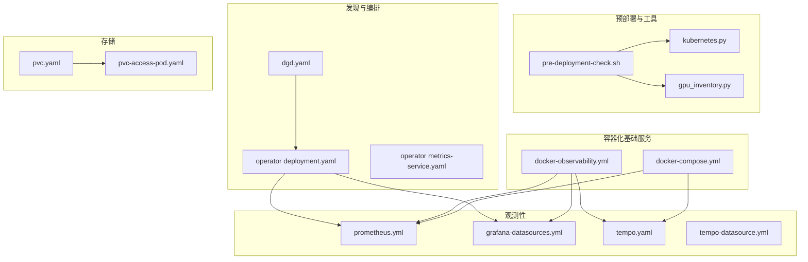
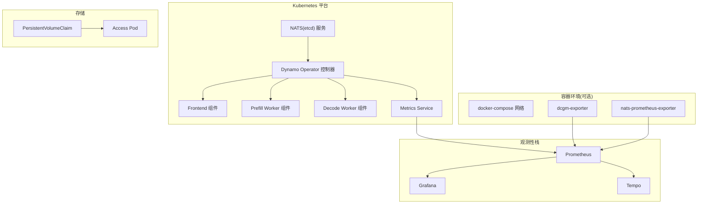
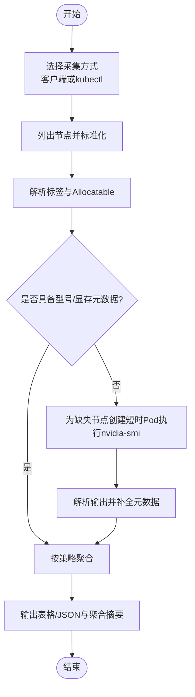
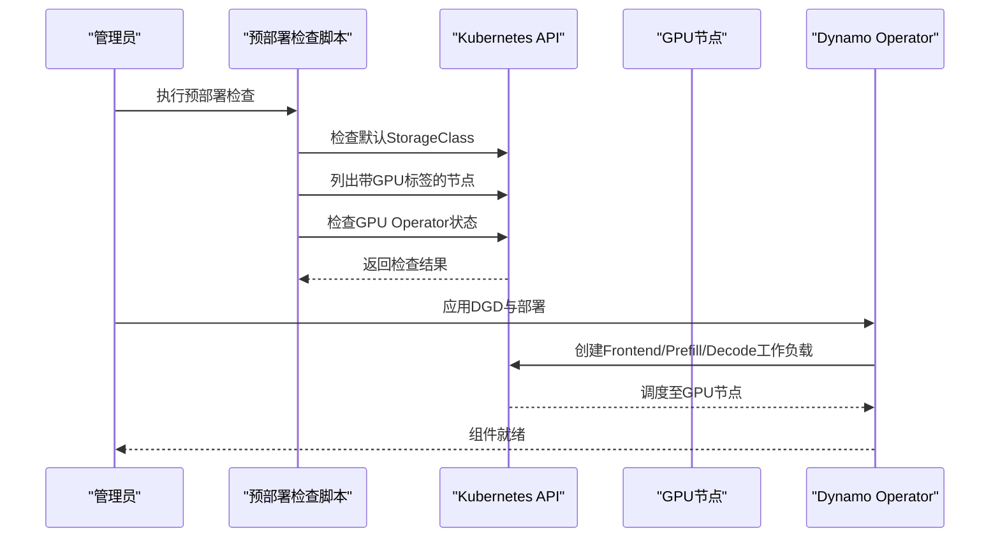
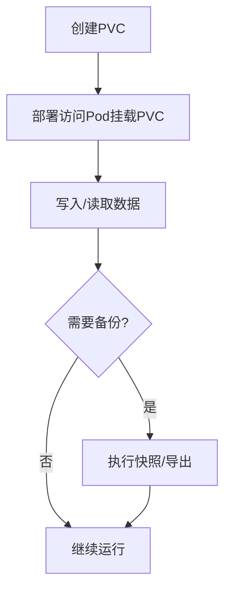
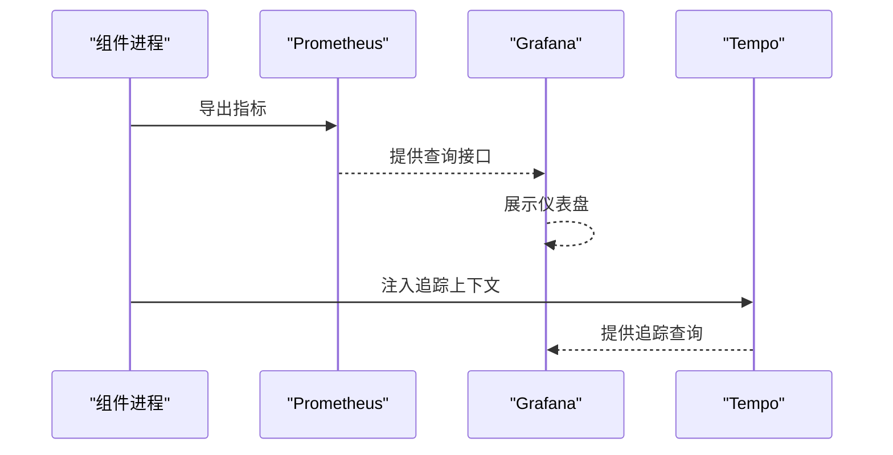
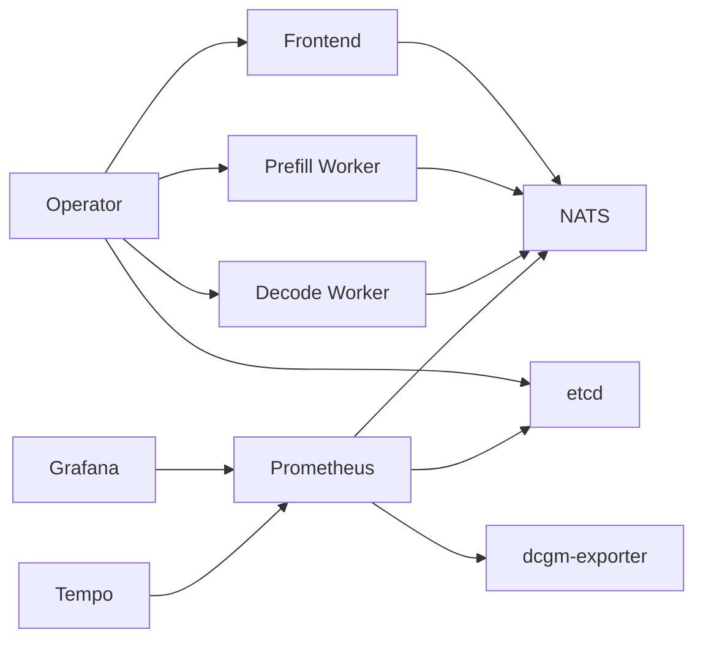

# 基础设施配置

<cite>
**本文引用的文件**
- [deploy/utils/gpu_inventory.py](file://deploy/utils/gpu_inventory.py)
- [deploy/utils/kubernetes.py](file://deploy/utils/kubernetes.py)
- [deploy/discovery/dgd.yaml](file://deploy/discovery/dgd.yaml)
- [deploy/observability/prometheus.yml](file://deploy/observability/prometheus.yml)
- [deploy/observability/grafana-datasources.yml](file://deploy/observability/grafana-datasources.yml)
- [deploy/observability/tempo.yaml](file://deploy/observability/tempo.yaml)
- [deploy/observability/tempo-datasource.yml](file://deploy/observability/tempo-datasource.yml)
- [deploy/docker-compose.yml](file://deploy/docker-compose.yml)
- [deploy/docker-observability.yml](file://deploy/docker-observability.yml)
- [deploy/helm/charts/platform/components/operator/templates/deployment.yaml](file://deploy/helm/charts/platform/components/operator/templates/deployment.yaml)
- [deploy/helm/charts/platform/components/operator/templates/metrics-service.yaml](file://deploy/helm/charts/platform/components/operator/templates/metrics-service.yaml)
- [deploy/utils/manifests/pvc.yaml](file://deploy/utils/manifests/pvc.yaml)
- [deploy/utils/manifests/pvc-access-pod.yaml](file://deploy/utils/manifests/pvc-access-pod.yaml)
- [deploy/pre-deployment/pre-deployment-check.sh](file://deploy/pre-deployment/pre-deployment-check.sh)
</cite>

## 目录
1. [简介](#简介)
2. [项目结构](#项目结构)
3. [核心组件](#核心组件)
4. [架构总览](#架构总览)
5. [详细组件分析](#详细组件分析)
6. [依赖关系分析](#依赖关系分析)
7. [性能考量](#性能考量)
8. [故障排查指南](#故障排查指南)
9. [结论](#结论)
10. [附录](#附录)

## 简介
本指南面向在Kubernetes与容器环境中部署Dynamo推理平台的工程师，系统性说明基础设施配置的关键环节：GPU资源发现与管理、Kubernetes集群配置（节点选择、资源限制与调度）、网络配置（含InfiniBand/RDMA与带宽/延迟优化）、存储配置（PVC与缓存）、以及监控体系（Prometheus、Grafana、Tempo/Tracing）的落地方法与最佳实践。文中所有技术细节均基于仓库中的实际配置文件与工具脚本进行归纳总结。

## 项目结构
围绕基础设施配置，仓库中与之直接相关的目录与文件包括：
- 预部署检查与工具：pre-deployment、utils
- 发现与编排：discovery、helm charts
- 观测性：observability（Prometheus、Grafana、Tempo）
- 容器化基础服务：docker-compose、docker-observability
- 存储与访问：utils/manifests 下的 PVC 与访问 Pod

图表来源
- [deploy/pre-deployment/pre-deployment-check.sh](file://deploy/pre-deployment/pre-deployment-check.sh#L1-L284)
- [deploy/utils/kubernetes.py](file://deploy/utils/kubernetes.py#L1-L186)
- [deploy/utils/gpu_inventory.py](file://deploy/utils/gpu_inventory.py#L1-L490)
- [deploy/discovery/dgd.yaml](file://deploy/discovery/dgd.yaml#L1-L59)
- [deploy/helm/charts/platform/components/operator/templates/deployment.yaml](file://deploy/helm/charts/platform/components/operator/templates/deployment.yaml#L1-L199)
- [deploy/helm/charts/platform/components/operator/templates/metrics-service.yaml](file://deploy/helm/charts/platform/components/operator/templates/metrics-service.yaml#L1-L34)
- [deploy/observability/prometheus.yml](file://deploy/observability/prometheus.yml#L1-L63)
- [deploy/observability/grafana-datasources.yml](file://deploy/observability/grafana-datasources.yml#L1-L24)
- [deploy/observability/tempo.yaml](file://deploy/observability/tempo.yaml#L1-L37)
- [deploy/observability/tempo-datasource.yml](file://deploy/observability/tempo-datasource.yml#L1-L28)
- [deploy/docker-compose.yml](file://deploy/docker-compose.yml#L1-L36)
- [deploy/docker-observability.yml](file://deploy/docker-observability.yml#L1-L138)
- [deploy/utils/manifests/pvc.yaml](file://deploy/utils/manifests/pvc.yaml#L1-L17)
- [deploy/utils/manifests/pvc-access-pod.yaml](file://deploy/utils/manifests/pvc-access-pod.yaml#L1-L41)

章节来源
- [deploy/pre-deployment/pre-deployment-check.sh](file://deploy/pre-deployment/pre-deployment-check.sh#L1-L284)
- [deploy/utils/kubernetes.py](file://deploy/utils/kubernetes.py#L1-L186)
- [deploy/utils/gpu_inventory.py](file://deploy/utils/gpu_inventory.py#L1-L490)
- [deploy/discovery/dgd.yaml](file://deploy/discovery/dgd.yaml#L1-L59)
- [deploy/helm/charts/platform/components/operator/templates/deployment.yaml](file://deploy/helm/charts/platform/components/operator/templates/deployment.yaml#L1-L199)
- [deploy/helm/charts/platform/components/operator/templates/metrics-service.yaml](file://deploy/helm/charts/platform/components/operator/templates/metrics-service.yaml#L1-L34)
- [deploy/observability/prometheus.yml](file://deploy/observability/prometheus.yml#L1-L63)
- [deploy/observability/grafana-datasources.yml](file://deploy/observability/grafana-datasources.yml#L1-L24)
- [deploy/observability/tempo.yaml](file://deploy/observability/tempo.yaml#L1-L37)
- [deploy/observability/tempo-datasource.yml](file://deploy/observability/tempo-datasource.yml#L1-L28)
- [deploy/docker-compose.yml](file://deploy/docker-compose.yml#L1-L36)
- [deploy/docker-observability.yml](file://deploy/docker-observability.yml#L1-L138)
- [deploy/utils/manifests/pvc.yaml](file://deploy/utils/manifests/pvc.yaml#L1-L17)
- [deploy/utils/manifests/pvc-access-pod.yaml](file://deploy/utils/manifests/pvc-access-pod.yaml#L1-L41)

## 核心组件
- GPU资源发现与聚合：通过标签与节点信息采集，结合短时Pod执行nvidia-smi补充缺失元数据，输出每节点GPU数量、型号与显存容量，并支持聚合统计。
- Kubernetes工具集：封装kubectl命令、访问Pod部署与清理、检测集群内运行环境等。
- 发现与编排：DynamoGraphDeployment定义组件类型、副本数、镜像与资源限制；Operator部署负责控制器生命周期与参数注入。
- 观测性栈：Prometheus抓取NATS/etcd/DCGM等指标；Grafana作为可视化与仪表盘；Tempo提供分布式追踪。
- 容器化基础服务：NATS与etcd用于消息与键值存储；可选Docker Compose组合观测栈。
- 存储：PVC声明与访问Pod，便于本地或共享存储场景的数据读写与备份。

章节来源
- [deploy/utils/gpu_inventory.py](file://deploy/utils/gpu_inventory.py#L1-L490)
- [deploy/utils/kubernetes.py](file://deploy/utils/kubernetes.py#L1-L186)
- [deploy/discovery/dgd.yaml](file://deploy/discovery/dgd.yaml#L1-L59)
- [deploy/helm/charts/platform/components/operator/templates/deployment.yaml](file://deploy/helm/charts/platform/components/operator/templates/deployment.yaml#L1-L199)
- [deploy/observability/prometheus.yml](file://deploy/observability/prometheus.yml#L1-L63)
- [deploy/observability/grafana-datasources.yml](file://deploy/observability/grafana-datasources.yml#L1-L24)
- [deploy/observability/tempo.yaml](file://deploy/observability/tempo.yaml#L1-L37)
- [deploy/observability/tempo-datasource.yml](file://deploy/observability/tempo-datasource.yml#L1-L28)
- [deploy/docker-compose.yml](file://deploy/docker-compose.yml#L1-L36)
- [deploy/docker-observability.yml](file://deploy/docker-observability.yml#L1-L138)
- [deploy/utils/manifests/pvc.yaml](file://deploy/utils/manifests/pvc.yaml#L1-L17)
- [deploy/utils/manifests/pvc-access-pod.yaml](file://deploy/utils/manifests/pvc-access-pod.yaml#L1-L41)

## 架构总览
下图展示Dynamo基础设施配置在Kubernetes与容器环境中的整体交互：Operator负责编排与参数注入；组件按DGD定义进行部署；观测性栈通过Prometheus/Grafana/Tempo收集与展示指标与追踪；存储通过PVC与访问Pod保障数据可用性。

图表来源
- [deploy/helm/charts/platform/components/operator/templates/deployment.yaml](file://deploy/helm/charts/platform/components/operator/templates/deployment.yaml#L1-L199)
- [deploy/helm/charts/platform/components/operator/templates/metrics-service.yaml](file://deploy/helm/charts/platform/components/operator/templates/metrics-service.yaml#L1-L34)
- [deploy/discovery/dgd.yaml](file://deploy/discovery/dgd.yaml#L1-L59)
- [deploy/observability/prometheus.yml](file://deploy/observability/prometheus.yml#L1-L63)
- [deploy/observability/grafana-datasources.yml](file://deploy/observability/grafana-datasources.yml#L1-L24)
- [deploy/observability/tempo.yaml](file://deploy/observability/tempo.yaml#L1-L37)
- [deploy/docker-compose.yml](file://deploy/docker-compose.yml#L1-L36)
- [deploy/docker-observability.yml](file://deploy/docker-observability.yml#L1-L138)
- [deploy/utils/manifests/pvc.yaml](file://deploy/utils/manifests/pvc.yaml#L1-L17)
- [deploy/utils/manifests/pvc-access-pod.yaml](file://deploy/utils/manifests/pvc-access-pod.yaml#L1-L41)

## 详细组件分析

### GPU资源发现与管理
- 资源采集来源与优先级
  - 优先使用Kubernetes客户端读取节点列表；若失败则回退到kubectl JSON输出。
  - 从节点标签提取GPU数量、产品型号、显存容量与MIG能力；若缺失则通过短时Pod执行nvidia-smi补充。
- 聚合策略
  - 在存在多型号/显存组合时，优先“每节点GPU数”更高者，其次“单卡显存”更大者，输出代表性聚合结果。
- 输出格式
  - 支持表格与JSON两种输出，便于人工审阅与自动化处理。
- 运维建议
  - 确保节点已正确标注GPU资源标签；在混合机型环境中，建议统一显存规格以简化调度与容量规划。

图表来源
- [deploy/utils/gpu_inventory.py](file://deploy/utils/gpu_inventory.py#L152-L190)
- [deploy/utils/gpu_inventory.py](file://deploy/utils/gpu_inventory.py#L306-L385)
- [deploy/utils/gpu_inventory.py](file://deploy/utils/gpu_inventory.py#L387-L417)

章节来源
- [deploy/utils/gpu_inventory.py](file://deploy/utils/gpu_inventory.py#L1-L490)

### Kubernetes集群配置与调度优化
- 集群前置条件检查
  - 检查kubectl连通性、默认StorageClass、GPU节点与GPU Operator状态。
- 节点选择与资源限制
  - 通过节点标签选择GPU节点（如nvidia.com/gpu.present=true）。
  - 在DGD中为组件设置resources.limits（例如gpu: "1"），确保调度器按需分配。
- 调度优化
  - 使用亲和/反亲和、容忍、拓扑感知等策略提升跨节点均衡与容错。
  - 结合GPU库存工具输出，动态规划组件副本分布，避免热点节点过载。

图表来源
- [deploy/pre-deployment/pre-deployment-check.sh](file://deploy/pre-deployment/pre-deployment-check.sh#L41-L177)
- [deploy/discovery/dgd.yaml](file://deploy/discovery/dgd.yaml#L15-L59)
- [deploy/helm/charts/platform/components/operator/templates/deployment.yaml](file://deploy/helm/charts/platform/components/operator/templates/deployment.yaml#L52-L58)

章节来源
- [deploy/pre-deployment/pre-deployment-check.sh](file://deploy/pre-deployment/pre-deployment-check.sh#L1-L284)
- [deploy/discovery/dgd.yaml](file://deploy/discovery/dgd.yaml#L1-L59)
- [deploy/helm/charts/platform/components/operator/templates/deployment.yaml](file://deploy/helm/charts/platform/components/operator/templates/deployment.yaml#L1-L199)

### 网络配置要求（含InfiniBand/RDMA）
- 现状与建议
  - 仓库未提供InfiniBand/RDMA专用配置示例。建议在底层网络层面完成RDMA子网与安全域划分，并在Kubernetes中通过网络策略限制流量范围。
  - 对于跨节点高吞吐通信，结合GPU内存直通与零拷贝路径（如NVLink）优化，减少CPU参与。
- 延迟与带宽优化
  - 将高延迟链路（跨AZ/跨地域）上的组件尽量同地部署；对高频KV缓存与prefill/decode流水线进行同机/同NUMA优化。
  - 在容器网络层启用SR-IOV或DPDK（视云厂商支持情况）以降低转发开销。

[本节为通用指导，不直接分析具体文件，故无章节来源]

### 存储配置指南
- PVC声明
  - 使用utils/manifests/pvc.yaml声明持久卷请求，默认50Gi，可按需调整大小与storageClassName。
- 访问Pod
  - 通过pvc-access-pod.yaml挂载PVC，便于在目标命名空间内进行数据读写与备份验证。
- 备份与缓存
  - 建议将模型权重与KV缓存置于独立PVC，配合快照或CSI卷备份策略；对频繁读取的数据采用只读挂载与缓存层（如本地SSD）加速。

图表来源
- [deploy/utils/manifests/pvc.yaml](file://deploy/utils/manifests/pvc.yaml#L1-L17)
- [deploy/utils/manifests/pvc-access-pod.yaml](file://deploy/utils/manifests/pvc-access-pod.yaml#L1-L41)

章节来源
- [deploy/utils/manifests/pvc.yaml](file://deploy/utils/manifests/pvc.yaml#L1-L17)
- [deploy/utils/manifests/pvc-access-pod.yaml](file://deploy/utils/manifests/pvc-access-pod.yaml#L1-L41)

### 监控基础设施配置（Prometheus、Grafana、Tempo）
- Prometheus
  - 通过prometheus.yml配置抓取NATS、etcd、DCGM等目标；可扩展抓取前端/后端组件端点。
- Grafana
  - 通过grafana-datasources.yml配置Prometheus为默认数据源；仪表盘由provisioning目录提供。
- Tempo
  - 通过tempo.yaml与tempo-datasource.yml配置分布式追踪后端与数据源；支持OTLP接收。
- 容器化观测栈
  - docker-observability.yml组合dcgm-exporter、nats-prometheus-exporter、Prometheus、Tempo与Grafana；docker-compose.yml提供NATS与etcd基础服务。

图表来源
- [deploy/observability/prometheus.yml](file://deploy/observability/prometheus.yml#L20-L50)
- [deploy/observability/grafana-datasources.yml](file://deploy/observability/grafana-datasources.yml#L18-L24)
- [deploy/observability/tempo.yaml](file://deploy/observability/tempo.yaml#L1-L37)
- [deploy/observability/tempo-datasource.yml](file://deploy/observability/tempo-datasource.yml#L6-L28)
- [deploy/docker-compose.yml](file://deploy/docker-compose.yml#L11-L36)
- [deploy/docker-observability.yml](file://deploy/docker-observability.yml#L22-L138)

章节来源
- [deploy/observability/prometheus.yml](file://deploy/observability/prometheus.yml#L1-L63)
- [deploy/observability/grafana-datasources.yml](file://deploy/observability/grafana-datasources.yml#L1-L24)
- [deploy/observability/tempo.yaml](file://deploy/observability/tempo.yaml#L1-L37)
- [deploy/observability/tempo-datasource.yml](file://deploy/observability/tempo-datasource.yml#L1-L28)
- [deploy/docker-compose.yml](file://deploy/docker-compose.yml#L1-L36)
- [deploy/docker-observability.yml](file://deploy/docker-observability.yml#L1-L138)

## 依赖关系分析
- 组件耦合
  - Operator通过参数注入与RBAC控制组件生命周期；组件间通过NATS/etcd通信；观测性栈独立于业务组件。
- 外部依赖
  - GPU Operator、Kubernetes API、容器运行时（含NVIDIA runtime）。
- 潜在风险
  - 多默认StorageClass可能导致PVC绑定异常；GPU Operator未就绪会影响设备可见性。

图表来源
- [deploy/helm/charts/platform/components/operator/templates/deployment.yaml](file://deploy/helm/charts/platform/components/operator/templates/deployment.yaml#L91-L130)
- [deploy/observability/prometheus.yml](file://deploy/observability/prometheus.yml#L20-L50)
- [deploy/docker-observability.yml](file://deploy/docker-observability.yml#L24-L84)

章节来源
- [deploy/helm/charts/platform/components/operator/templates/deployment.yaml](file://deploy/helm/charts/platform/components/operator/templates/deployment.yaml#L1-L199)
- [deploy/observability/prometheus.yml](file://deploy/observability/prometheus.yml#L1-L63)
- [deploy/docker-observability.yml](file://deploy/docker-observability.yml#L1-L138)

## 性能考量
- GPU资源利用
  - 依据GPU库存工具输出，合理分配每节点GPU数与显存规格，避免碎片化与资源争用。
- 网络与I/O
  - 将高吞吐数据路径（KV缓存、模型加载）与计算节点就近部署；必要时启用RDMA与高性能网络插件。
- 观测性
  - 合理设置抓取间隔与保留策略，避免观测性自身成为瓶颈；对关键路径开启分布式追踪定位延迟根因。

[本节提供通用指导，不直接分析具体文件，故无章节来源]

## 故障排查指南
- 预部署检查
  - 使用pre-deployment-check.sh核对kubectl、默认StorageClass、GPU节点与GPU Operator状态；按提示修复问题。
- PVC与访问Pod
  - 通过kubernetes.py提供的部署/清理函数快速验证PVC可用性与权限；确认访问Pod Ready状态。
- GPU库存
  - 使用gpu_inventory.py输出节点级GPU清单与聚合摘要；对缺失元数据的节点，确认nvidia-smi短时Pod执行成功。

章节来源
- [deploy/pre-deployment/pre-deployment-check.sh](file://deploy/pre-deployment/pre-deployment-check.sh#L1-L284)
- [deploy/utils/kubernetes.py](file://deploy/utils/kubernetes.py#L62-L186)
- [deploy/utils/gpu_inventory.py](file://deploy/utils/gpu_inventory.py#L420-L490)

## 结论
通过预部署检查、GPU资源发现与聚合、Kubernetes编排与调度、观测性栈集成以及存储与网络配置，Dynamo可在生产环境中实现稳定、可观测且可扩展的推理服务。建议在上线前完成硬件与网络基线测试，并持续优化调度策略与观测指标以支撑SLA驱动的弹性扩缩容。

## 附录
- 快速参考
  - 部署顺序：预检查 → 安装GPU Operator与默认StorageClass → 应用DGD → 验证组件就绪 → 部署观测性栈 → 配置PVC与访问Pod
  - 关键配置位置：dgd.yaml、prometheus.yml、grafana-datasources.yml、tempo.yaml、pvc.yaml、pvc-access-pod.yaml

[本节为概览性内容，不直接分析具体文件，故无章节来源]