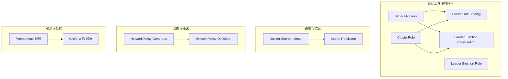
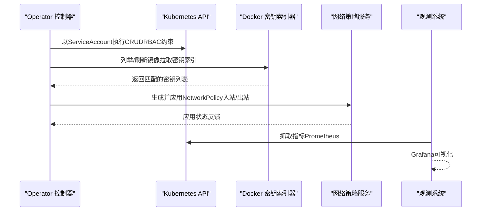
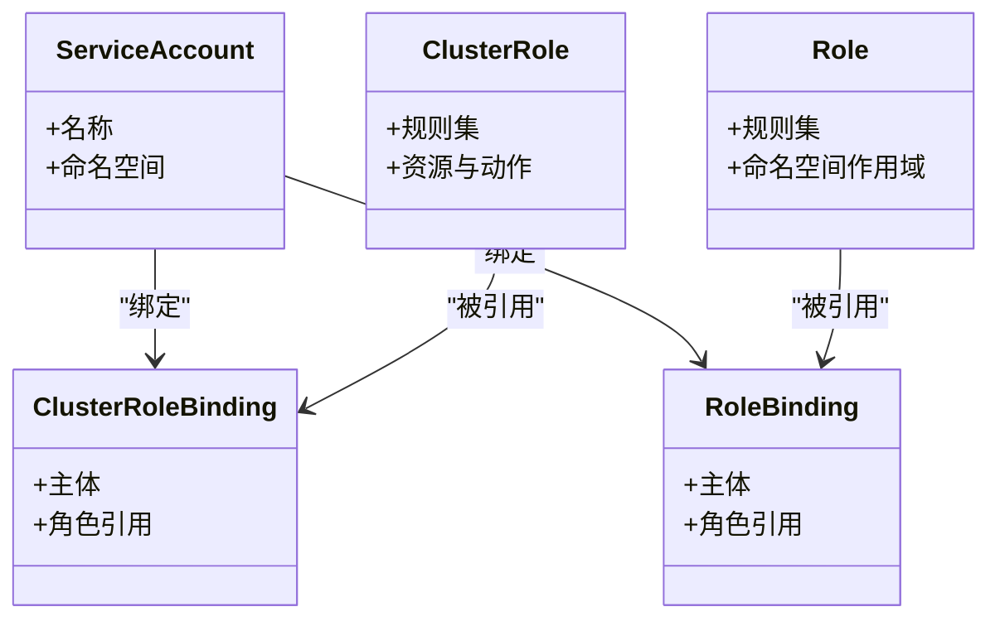
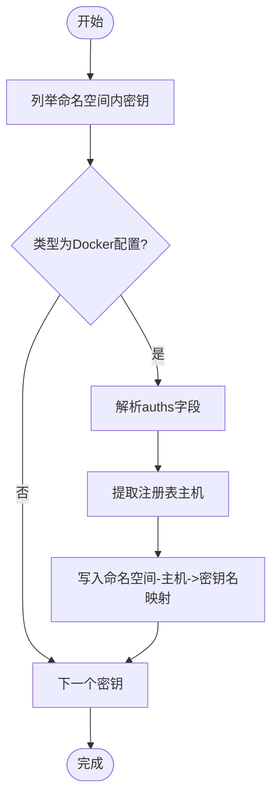
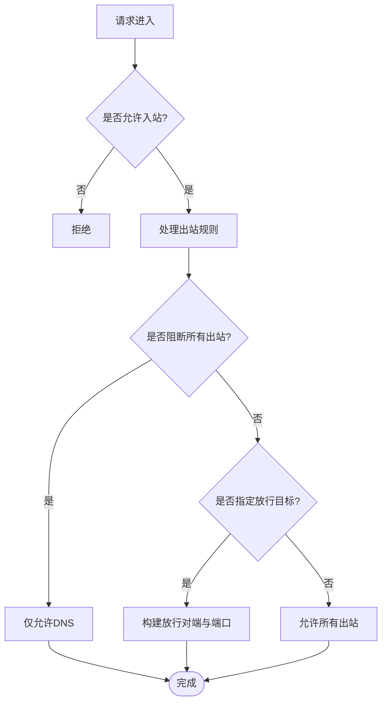
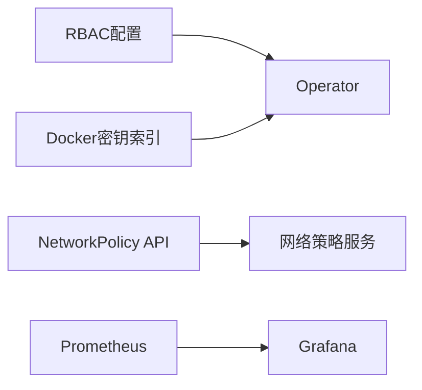

# 安全加固配置

<cite>
**本文档引用的文件**
- [SECURITY.md](file://SECURITY.md)
- [role.yaml](file://deploy/operator/config/rbac/role.yaml)
- [role_binding.yaml](file://deploy/operator/config/rbac/role_binding.yaml)
- [service_account.yaml](file://deploy/operator/config/rbac/service_account.yaml)
- [manager-rbac.yaml](file://deploy/helm/charts/platform/components/operator/templates/manager-rbac.yaml)
- [leader-election-rbac.yaml](file://deploy/helm/charts/platform/components/operator/templates/leader-election-rbac.yaml)
- [docker.go](file://deploy/operator/internal/secrets/docker.go)
- [docker_test.go](file://deploy/operator/internal/secrets/docker_test.go)
- [secret_replicator.go](file://deploy/operator/internal/secret/secret_replicator.go)
- [pvc-access-pod.yaml](file://deploy/utils/manifests/pvc-access-pod.yaml)
- [sanity_check.py](file://deploy/sanity_check.py)
- [main.py](file://tests/fault_tolerance/hardware/fault_injection_service/api_service/main.py)
- [prometheus.yml](file://deploy/observability/prometheus.yml)
- [grafana-datasources.yml](file://deploy/observability/grafana-datasources.yml)
</cite>

## 目录
1. [简介](#简介)
2. [项目结构](#项目结构)
3. [核心组件](#核心组件)
4. [架构总览](#架构总览)
5. [详细组件分析](#详细组件分析)
6. [依赖关系分析](#依赖关系分析)
7. [性能考虑](#性能考虑)
8. [故障排查指南](#故障排查指南)
9. [结论](#结论)
10. [附录](#附录)

## 简介
本指南面向Dynamo平台的安全加固配置，围绕身份认证与授权（RBAC）、网络安全（TLS/防火墙/隔离）、数据安全（加密/访问控制/审计）、容器安全（镜像扫描/运行时保护/漏洞管理）以及合规性（安全标准/风险评估/安全监控）等维度，结合仓库中的实际配置与实现进行系统化说明，并提供可操作的加固建议与最佳实践。

## 项目结构
Dynamo的安全相关配置主要分布在以下位置：
- 运维与部署：operator RBAC、Helm模板、观测性配置
- 容器与镜像：Docker配置密钥索引与拉取策略
- 网络与隔离：NetworkPolicy生成逻辑与示例
- 数据与凭证：Secret复制与最小权限原则
- 健康检查与环境探测：容器内环境识别

**图表来源**
- [manager-rbac.yaml](file://deploy/helm/charts/platform/components/operator/templates/manager-rbac.yaml#L15-L554)
- [leader-election-rbac.yaml](file://deploy/helm/charts/platform/components/operator/templates/leader-election-rbac.yaml#L15-L91)
- [docker.go](file://deploy/operator/internal/secrets/docker.go#L14-L72)
- [secret_replicator.go](file://deploy/operator/internal/secret/secret_replicator.go#L32-L45)
- [main.py](file://tests/fault_tolerance/hardware/fault_injection_service/api_service/main.py#L685-L744)
- [prometheus.yml](file://deploy/observability/prometheus.yml#L20-L62)
- [grafana-datasources.yml](file://deploy/observability/grafana-datasources.yml#L18-L24)

**章节来源**
- [manager-rbac.yaml](file://deploy/helm/charts/platform/components/operator/templates/manager-rbac.yaml#L15-L554)
- [leader-election-rbac.yaml](file://deploy/helm/charts/platform/components/operator/templates/leader-election-rbac.yaml#L15-L91)
- [docker.go](file://deploy/operator/internal/secrets/docker.go#L14-L72)
- [secret_replicator.go](file://deploy/operator/internal/secret/secret_replicator.go#L32-L45)
- [main.py](file://tests/fault_tolerance/hardware/fault_injection_service/api_service/main.py#L685-L744)
- [prometheus.yml](file://deploy/observability/prometheus.yml#L20-L62)
- [grafana-datasources.yml](file://deploy/observability/grafana-datasources.yml#L18-L24)

## 核心组件
- 身份认证与授权（RBAC）
  - 使用ServiceAccount绑定ClusterRole/Role，限定operator对资源的操作范围与最小权限。
  - 提供独立的Leader Election角色，确保主控选举过程的最小权限访问。
- 凭证与镜像拉取
  - Docker配置密钥索引器按命名空间与注册表主机动态发现与匹配镜像拉取密钥。
  - Secret复制器支持跨命名空间复制敏感密钥，便于多租户或多命名空间场景下的统一管理。
- 网络安全
  - 支持根据配置生成NetworkPolicy，允许DNS出站、基于表达式的目标放行或完全阻断入站/出站。
- 数据与容器安全
  - Pod安全上下文默认注入fsGroup，支持用户自定义覆盖；示例Pod限制特权提升、仅保留必要能力集。
  - 容器内环境探测脚本用于识别容器运行环境，辅助安全基线校验。
- 观测与监控
  - Prometheus静态目标配置与Grafana数据源配置，支撑指标采集与可视化。

**章节来源**
- [role.yaml](file://deploy/operator/config/rbac/role.yaml#L17-L247)
- [role_binding.yaml](file://deploy/operator/config/rbac/role_binding.yaml#L16-L35)
- [service_account.yaml](file://deploy/operator/config/rbac/service_account.yaml#L16-L28)
- [manager-rbac.yaml](file://deploy/helm/charts/platform/components/operator/templates/manager-rbac.yaml#L15-L554)
- [leader-election-rbac.yaml](file://deploy/helm/charts/platform/components/operator/templates/leader-election-rbac.yaml#L15-L91)
- [docker.go](file://deploy/operator/internal/secrets/docker.go#L14-L72)
- [secret_replicator.go](file://deploy/operator/internal/secret/secret_replicator.go#L32-L45)
- [pvc-access-pod.yaml](file://deploy/utils/manifests/pvc-access-pod.yaml#L11-L35)
- [sanity_check.py](file://deploy/sanity_check.py#L551-L571)
- [prometheus.yml](file://deploy/observability/prometheus.yml#L20-L62)
- [grafana-datasources.yml](file://deploy/observability/grafana-datasources.yml#L18-L24)

## 架构总览
下图展示Dynamo安全加固的关键交互路径：operator通过RBAC访问集群资源，镜像拉取密钥由索引器动态发现，NetworkPolicy由API服务生成并应用，观测数据经Prometheus与Grafana呈现。

**图表来源**
- [manager-rbac.yaml](file://deploy/helm/charts/platform/components/operator/templates/manager-rbac.yaml#L15-L554)
- [leader-election-rbac.yaml](file://deploy/helm/charts/platform/components/operator/templates/leader-election-rbac.yaml#L15-L91)
- [docker.go](file://deploy/operator/internal/secrets/docker.go#L28-L72)
- [main.py](file://tests/fault_tolerance/hardware/fault_injection_service/api_service/main.py#L685-L744)
- [prometheus.yml](file://deploy/observability/prometheus.yml#L20-L62)
- [grafana-datasources.yml](file://deploy/observability/grafana-datasources.yml#L18-L24)

## 详细组件分析

### 身份认证与授权（RBAC）配置
- ServiceAccount与Role/ClusterRole绑定
  - 使用独立的manager角色与角色绑定，限定operator对CRD、工作负载、网络策略、事件等资源的最小操作集合。
  - 支持命名空间限制模式，避免过度授权到集群范围资源。
- 主控选举专用角色
  - 为Leader Election提供ConfigMap与Lease读写权限，降低主控冲突与误操作风险。
- 最佳实践
  - 采用最小权限原则，定期审查RBAC规则；启用命名空间限制以减少越权面。
  - 对外部集成（如Webhook、Istio VirtualService）单独评估权限，避免“通配符”滥用。

**图表来源**
- [service_account.yaml](file://deploy/operator/config/rbac/service_account.yaml#L16-L28)
- [role.yaml](file://deploy/operator/config/rbac/role.yaml#L17-L247)
- [role_binding.yaml](file://deploy/operator/config/rbac/role_binding.yaml#L16-L35)
- [manager-rbac.yaml](file://deploy/helm/charts/platform/components/operator/templates/manager-rbac.yaml#L15-L554)
- [leader-election-rbac.yaml](file://deploy/helm/charts/platform/components/operator/templates/leader-election-rbac.yaml#L15-L91)

**章节来源**
- [service_account.yaml](file://deploy/operator/config/rbac/service_account.yaml#L16-L28)
- [role.yaml](file://deploy/operator/config/rbac/role.yaml#L17-L247)
- [role_binding.yaml](file://deploy/operator/config/rbac/role_binding.yaml#L16-L35)
- [manager-rbac.yaml](file://deploy/helm/charts/platform/components/operator/templates/manager-rbac.yaml#L15-L554)
- [leader-election-rbac.yaml](file://deploy/helm/charts/platform/components/operator/templates/leader-election-rbac.yaml#L15-L91)

### 服务账户安全与凭据轮换
- Docker镜像拉取密钥索引
  - 按命名空间与注册表主机建立映射，自动刷新索引，避免硬编码在Pod中。
- Secret复制
  - 在多命名空间场景下复制关键密钥，减少重复配置与泄露面。
- 凭据轮换建议
  - 使用自动化轮换流程（CI/CD钩子）更新密钥后触发索引刷新与滚动更新。
  - 为不同注册表维护独立密钥，缩短影响面。

**图表来源**
- [docker.go](file://deploy/operator/internal/secrets/docker.go#L28-L72)

**章节来源**
- [docker.go](file://deploy/operator/internal/secrets/docker.go#L14-L72)
- [docker_test.go](file://deploy/operator/internal/secrets/docker_test.go#L13-L95)
- [secret_replicator.go](file://deploy/operator/internal/secret/secret_replicator.go#L32-L45)

### 网络安全配置（TLS/防火墙/隔离）
- NetworkPolicy生成逻辑
  - 入站：可选择阻断全部入站（空入站规则），或按需放行特定来源。
  - 出站：默认允许DNS（kube-system命名空间），其余出站可按注册表/服务表达式放行；端口级阻断当前实现存在限制。
- TLS建议
  - 前端/网关层启用TLS终止与强密码套件；后端间通信可使用mTLS或服务网格策略。
  - 使用证书颁发与轮换机制（如cert-manager）保障证书生命周期管理。
- 防火墙与隔离
  - 结合云厂商安全组/网络ACL限制对外暴露面；Pod间隔离优先使用NetworkPolicy。
  - 将监控网络与业务网络分离，避免观测流量污染业务链路。

**图表来源**
- [main.py](file://tests/fault_tolerance/hardware/fault_injection_service/api_service/main.py#L685-L744)

**章节来源**
- [main.py](file://tests/fault_tolerance/hardware/fault_injection_service/api_service/main.py#L685-L744)

### 数据安全配置（加密/访问控制/审计）
- 加密
  - 静态数据：对象存储/卷加密（云厂商KMS）；传输加密：TLS 1.2+。
  - 密钥管理：使用Kubernetes Secrets或外部密钥管理服务（Vault/Cloud KMS）。
- 访问控制
  - RBAC最小权限；Pod安全上下文默认fsGroup，避免root运行；限制特权容器与capabilities。
- 审计
  - 启用Kubernetes审计日志，记录RBAC相关操作；结合Prometheus/Grafana可视化关键指标。

**章节来源**
- [pvc-access-pod.yaml](file://deploy/utils/manifests/pvc-access-pod.yaml#L11-L35)
- [prometheus.yml](file://deploy/observability/prometheus.yml#L20-L62)
- [grafana-datasources.yml](file://deploy/observability/grafana-datasources.yml#L18-L24)

### 容器安全配置（镜像扫描/运行时保护/漏洞管理）
- 镜像扫描
  - CI阶段集成镜像扫描工具（Trivy/Snyk），扫描基础镜像与应用镜像。
- 运行时保护
  - 使用受限的容器运行时（如Falco/OPA/Gatekeeper）实施策略；限制capabilities与mounts。
- 漏洞管理
  - 建立漏洞修复流程与补丁发布周期；对关键组件进行热修复与快速回滚。

**章节来源**
- [pvc-access-pod.yaml](file://deploy/utils/manifests/pvc-access-pod.yaml#L11-L35)

### 合规性配置（安全标准/风险评估/安全监控）
- 安全标准
  - 参考CIS、NIST、SOC2等标准，结合组织基线进行差距评估。
- 风险评估
  - 定期开展威胁建模与渗透测试；对高危组件（operator、网关、存储）重点评估。
- 安全监控
  - 通过Prometheus/Grafana实现告警与可视化；结合SIEM进行集中日志与事件分析。

**章节来源**
- [SECURITY.md](file://SECURITY.md#L18-L32)
- [prometheus.yml](file://deploy/observability/prometheus.yml#L20-L62)
- [grafana-datasources.yml](file://deploy/observability/grafana-datasources.yml#L18-L24)

## 依赖关系分析
- 组件耦合
  - operator RBAC与Helm模板保持一致的资源范围；镜像拉取密钥索引依赖Kubernetes Secret API。
  - NetworkPolicy生成服务与Kubernetes NetworkPolicy API交互。
- 外部依赖
  - Prometheus/Grafana作为观测基础设施；云厂商KMS/安全组作为底层安全能力。

**图表来源**
- [manager-rbac.yaml](file://deploy/helm/charts/platform/components/operator/templates/manager-rbac.yaml#L15-L554)
- [docker.go](file://deploy/operator/internal/secrets/docker.go#L28-L72)
- [main.py](file://tests/fault_tolerance/hardware/fault_injection_service/api_service/main.py#L685-L744)
- [prometheus.yml](file://deploy/observability/prometheus.yml#L20-L62)
- [grafana-datasources.yml](file://deploy/observability/grafana-datasources.yml#L18-L24)

**章节来源**
- [manager-rbac.yaml](file://deploy/helm/charts/platform/components/operator/templates/manager-rbac.yaml#L15-L554)
- [docker.go](file://deploy/operator/internal/secrets/docker.go#L14-L72)
- [main.py](file://tests/fault_tolerance/hardware/fault_injection_service/api_service/main.py#L685-L744)
- [prometheus.yml](file://deploy/observability/prometheus.yml#L20-L62)
- [grafana-datasources.yml](file://deploy/observability/grafana-datasources.yml#L18-L24)

## 性能考虑
- RBAC与API调用
  - 合理拆分角色与命名空间，减少大规模列表/监听带来的API压力。
- 密钥索引刷新
  - 使用缓存与事件驱动刷新，避免频繁全量扫描。
- 观测开销
  - 调整抓取间隔与目标数量，避免对集群造成额外负载。

## 故障排查指南
- 容器内环境识别
  - 通过环境变量与文件系统判断容器运行环境，辅助安全基线验证。
- 网络策略生效性
  - 检查NetworkPolicy类型与规则是否正确应用；确认命名空间标签与对端选择器匹配。
- 观测数据可用性
  - 核对Prometheus静态目标与Grafana数据源配置，确保监控链路连通。

**章节来源**
- [sanity_check.py](file://deploy/sanity_check.py#L551-L571)
- [main.py](file://tests/fault_tolerance/hardware/fault_injection_service/api_service/main.py#L685-L744)
- [prometheus.yml](file://deploy/observability/prometheus.yml#L20-L62)
- [grafana-datasources.yml](file://deploy/observability/grafana-datasources.yml#L18-L24)

## 结论
通过RBAC最小权限、动态密钥索引、NetworkPolicy隔离、容器安全基线与观测体系的协同，Dynamo可在生产环境中实现稳健的安全加固。建议持续完善漏洞管理与合规流程，结合自动化工具实现安全策略的可审计与可追溯。

## 附录
- 安全漏洞报告渠道与流程参见项目安全公告页面。

**章节来源**
- [SECURITY.md](file://SECURITY.md#L18-L32)