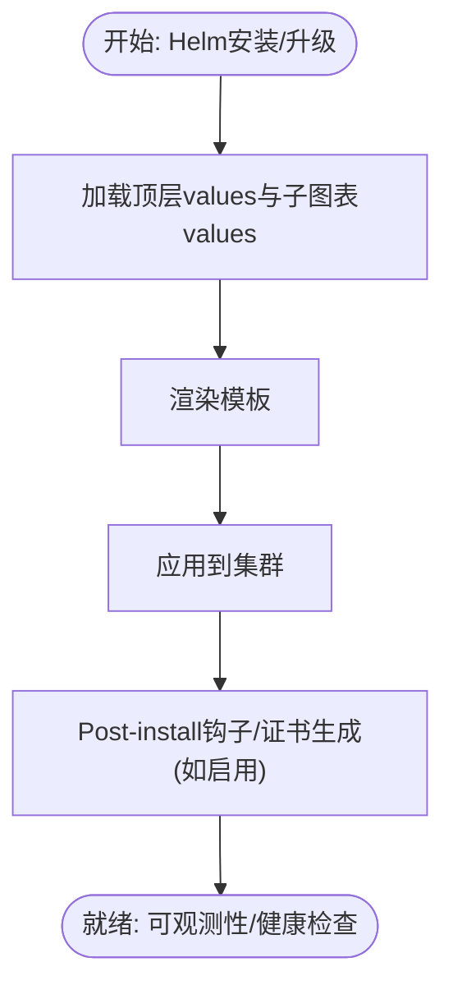

# 应用配置管理

<cite>
**本文引用的文件**
- [deploy/helm/README.md](file://deploy/helm/README.md)
- [deploy/helm/charts/platform/Chart.yaml](file://deploy/helm/charts/platform/Chart.yaml)
- [deploy/helm/charts/platform/values.yaml](file://deploy/helm/charts/platform/values.yaml)
- [deploy/discovery/dgd.yaml](file://deploy/discovery/dgd.yaml)
- [components/src/dynamo/common/config_dump/__init__.py](file://components/src/dynamo/common/config_dump/__init__.py)
- [components/src/dynamo/common/config_dump/config_dumper.py](file://components/src/dynamo/common/config_dump/config_dumper.py)
- [components/src/dynamo/common/config_dump/environment.py](file://components/src/dynamo/common/config_dump/environment.py)
- [components/src/dynamo/frontend/main.py](file://components/src/dynamo/frontend/main.py)
- [components/src/dynamo/global_router/handler.py](file://components/src/dynamo/global_router/handler.py)
- [components/src/dynamo/router/__init__.py](file://components/src/dynamo/router/__init__.py)
- [components/src/dynamo/planner/kube.py](file://components/src/dynamo/planner/kube.py)
- [benchmarks/profiler/utils/config.py](file://benchmarks/profiler/utils/config.py)
- [deploy/operator/config/default/kustomization.yaml](file://deploy/operator/config/default/kustomization.yaml)
- [lib/runtime/src/config.rs](file://lib/runtime/src/config.rs)
- [lib/runtime/src/pipeline/network/manager.rs](file://lib/runtime/src/pipeline/network/manager.rs)
- [lib/runtime/src/component/client.rs](file://lib/runtime/src/component/client.rs)
- [deploy/operator/internal/dynamo/graph.go](file://deploy/operator/internal/dynamo/graph.go)
</cite>

## 目录
1. [简介](#简介)
2. [项目结构](#项目结构)
3. [核心组件](#核心组件)
4. [架构总览](#架构总览)
5. [详细组件分析](#详细组件分析)
6. [依赖关系分析](#依赖关系分析)
7. [性能考量](#性能考量)
8. [故障排查指南](#故障排查指南)
9. [结论](#结论)
10. [附录](#附录)

## 简介
本指南面向Dynamo在Kubernetes平台上的应用配置管理，围绕以下目标展开：  
- Helm图表配置与值文件管理、版本控制策略  
- 组件配置策略（前端、路由器、工作节点）  
- 配置热更新机制（动态加载、验证与回滚）  
- 配置模板与最佳实践（多场景示例）  
- 安全策略（敏感信息保护、权限控制、审计日志）

## 项目结构
Dynamo的配置管理横跨多个层次：  
- 平台级Helm图表（Operator、NATS、etcd、调度器、Grove等）  
- 运行时配置（环境变量与配置文件优先级）  
- 组件级配置（前端、路由器、全局路由器、规划器）  
- 发现与编排（DynamoGraphDeployment、服务发现后端）  

**图示来源**
- [deploy/helm/charts/platform/Chart.yaml](file://deploy/helm/charts/platform/Chart.yaml#L24-L46)
- [deploy/helm/charts/platform/values.yaml](file://deploy/helm/charts/platform/values.yaml#L1-L732)
- [lib/runtime/src/config.rs](file://lib/runtime/src/config.rs#L222-L331)
- [lib/runtime/src/pipeline/network/manager.rs](file://lib/runtime/src/pipeline/network/manager.rs#L64-L101)
- [components/src/dynamo/frontend/main.py](file://components/src/dynamo/frontend/main.py#L1-L469)
- [components/src/dynamo/router/__init__.py](file://components/src/dynamo/router/__init__.py#L1-L13)
- [components/src/dynamo/global_router/handler.py](file://components/src/dynamo/global_router/handler.py#L1-L232)
- [components/src/dynamo/planner/kube.py](file://components/src/dynamo/planner/kube.py#L1-L188)
- [deploy/discovery/dgd.yaml](file://deploy/discovery/dgd.yaml#L1-L59)
- [deploy/operator/config/default/kustomization.yaml](file://deploy/operator/config/default/kustomization.yaml#L1-L158)
- [deploy/operator/internal/dynamo/graph.go](file://deploy/operator/internal/dynamo/graph.go#L339-L366)

**章节来源**
- [deploy/helm/README.md](file://deploy/helm/README.md#L18-L23)
- [deploy/helm/charts/platform/Chart.yaml](file://deploy/helm/charts/platform/Chart.yaml#L24-L46)
- [deploy/helm/charts/platform/values.yaml](file://deploy/helm/charts/platform/values.yaml#L1-L732)
- [deploy/discovery/dgd.yaml](file://deploy/discovery/dgd.yaml#L1-L59)
- [deploy/operator/config/default/kustomization.yaml](file://deploy/operator/config/default/kustomization.yaml#L1-L158)

## 核心组件
- Helm平台图表与值文件：定义Operator、NATS、etcd、调度器、Grove等子组件启用状态、镜像、资源、网络与安全参数；支持通过自定义values覆盖默认值，实现版本化与可追溯的配置管理。
- 运行时配置：通过环境变量与配置文件（/opt/dynamo/etc/runtime.toml、/opt/dynamo/defaults/runtime.toml）加载，支持前缀过滤与字段映射，便于在容器内动态注入。
- 组件配置：
  - 前端：HTTP端口、TLS、路由模式（轮询/随机/KV）、KV事件、请求/事件平面选择、指标前缀、自定义后端指标轮询等。
  - 路由器：本地路由器按组件类型区分预填充/解码池；全局路由器基于网格选择策略进行池间路由。
  - 规划器：通过Kubernetes API读取/更新DynamoGraphDeployment及其适配器，实现副本伸缩与就绪等待。
- 发现与编排：DGD示例展示如何声明式地定义服务、镜像、资源与命令参数；Operator负责将配置写入运行时或生成资源。

**章节来源**
- [deploy/helm/charts/platform/values.yaml](file://deploy/helm/charts/platform/values.yaml#L1-L732)
- [lib/runtime/src/config.rs](file://lib/runtime/src/config.rs#L222-L331)
- [components/src/dynamo/frontend/main.py](file://components/src/dynamo/frontend/main.py#L88-L327)
- [components/src/dynamo/global_router/handler.py](file://components/src/dynamo/global_router/handler.py#L23-L232)
- [components/src/dynamo/planner/kube.py](file://components/src/dynamo/planner/kube.py#L40-L188)
- [deploy/discovery/dgd.yaml](file://deploy/discovery/dgd.yaml#L1-L59)

## 架构总览
下图展示了从Helm到组件的配置流经路径与关键决策点：

**图示来源**
- [deploy/helm/charts/platform/Chart.yaml](file://deploy/helm/charts/platform/Chart.yaml#L24-L46)
- [deploy/helm/charts/platform/values.yaml](file://deploy/helm/charts/platform/values.yaml#L1-L732)
- [lib/runtime/src/config.rs](file://lib/runtime/src/config.rs#L222-L331)
- [components/src/dynamo/frontend/main.py](file://components/src/dynamo/frontend/main.py#L329-L469)
- [components/src/dynamo/global_router/handler.py](file://components/src/dynamo/global_router/handler.py#L70-L232)
- [components/src/dynamo/planner/kube.py](file://components/src/dynamo/planner/kube.py#L81-L188)

## 详细组件分析

### Helm图表与值文件管理
- 图表依赖：平台图表依赖Operator、NATS、etcd、Kai调度器、Grove等子图表，可通过condition开关启用/禁用。
- 值文件分层：顶层values集中管理各子组件参数；Operator、NATS、etcd等子图表各自维护子域配置。
- 版本控制：Chart.yaml中定义版本号；values.yaml包含大量注释说明用途与默认值，便于追踪变更。
- 安全与证书：Webhook证书可自动或外部管理；NATS支持TLS与JetStream持久化存储配置。

**图示来源**
- [deploy/helm/charts/platform/Chart.yaml](file://deploy/helm/charts/platform/Chart.yaml#L24-L46)
- [deploy/helm/charts/platform/values.yaml](file://deploy/helm/charts/platform/values.yaml#L151-L212)
- [deploy/helm/charts/platform/values.yaml](file://deploy/helm/charts/platform/values.yaml#L289-L437)

**章节来源**
- [deploy/helm/README.md](file://deploy/helm/README.md#L18-L23)
- [deploy/helm/charts/platform/Chart.yaml](file://deploy/helm/charts/platform/Chart.yaml#L24-L46)
- [deploy/helm/charts/platform/values.yaml](file://deploy/helm/charts/platform/values.yaml#L1-L732)

### 组件配置策略（前端/路由器/工作节点）
- 前端配置要点：
  - HTTP主机/端口、TLS证书/密钥、路由模式（轮询/随机/KV）、KV事件与树结构参数、请求/事件平面（NATS/HTTP/TCP、ZMQ）、指标前缀、自定义后端指标轮询间隔与端点。
  - 通过命令行参数与环境变量组合，支持在不同部署形态下灵活切换。
- 路由器配置要点：
  - 本地路由器：根据组件类型区分预填充/解码池；支持基于活跃块/令牌数的忙碌检测阈值。
  - 全局路由器：基于网格选择策略（ISL/TTFT、上下文长度/ITL）选择池，连接各池本地路由器并转发请求。
- 工作节点配置要点：
  - 通过DGD声明式定义服务镜像、命令、参数、资源限制；规划器可读取/更新副本数与就绪状态。

**图示来源**
- [components/src/dynamo/frontend/main.py](file://components/src/dynamo/frontend/main.py#L88-L327)
- [components/src/dynamo/frontend/main.py](file://components/src/dynamo/frontend/main.py#L379-L440)
- [components/src/dynamo/global_router/handler.py](file://components/src/dynamo/global_router/handler.py#L33-L232)

**章节来源**
- [components/src/dynamo/frontend/main.py](file://components/src/dynamo/frontend/main.py#L88-L327)
- [components/src/dynamo/global_router/handler.py](file://components/src/dynamo/global_router/handler.py#L23-L232)
- [deploy/discovery/dgd.yaml](file://deploy/discovery/dgd.yaml#L15-L59)

### 配置热更新机制（动态加载/验证/回滚）
- 动态配置加载：
  - 运行时配置：通过环境变量与配置文件加载，支持前缀过滤与字段映射，优先级明确。
  - 网络配置：从环境变量读取HTTP/TCP/NATS客户端配置，作为网络层唯一读取源。
- 配置验证：
  - 前端参数校验：TLS证书/密钥成对、自定义后端轮询间隔非负等。
  - 规划器API调用：通过Kubernetes API读取/更新DGD/DGDSA，异常处理与超时重试。
- 回滚策略：
  - Helm升级失败时可回滚至历史版本；Operator通过Kustomize与CRD管理，结合就绪条件与健康检查保障回滚后的稳定性。
  - 运行时配置变更：通过环境变量增量更新，避免重启；必要时配合滚动更新与探针确保平滑过渡。

**图示来源**
- [lib/runtime/src/config.rs](file://lib/runtime/src/config.rs#L222-L331)
- [lib/runtime/src/pipeline/network/manager.rs](file://lib/runtime/src/pipeline/network/manager.rs#L64-L101)
- [components/src/dynamo/frontend/main.py](file://components/src/dynamo/frontend/main.py#L319-L326)
- [components/src/dynamo/planner/kube.py](file://components/src/dynamo/planner/kube.py#L156-L188)
- [deploy/operator/config/default/kustomization.yaml](file://deploy/operator/config/default/kustomization.yaml#L44-L58)

**章节来源**
- [lib/runtime/src/config.rs](file://lib/runtime/src/config.rs#L222-L331)
- [lib/runtime/src/pipeline/network/manager.rs](file://lib/runtime/src/pipeline/network/manager.rs#L64-L101)
- [components/src/dynamo/frontend/main.py](file://components/src/dynamo/frontend/main.py#L319-L326)
- [components/src/dynamo/planner/kube.py](file://components/src/dynamo/planner/kube.py#L156-L188)
- [deploy/operator/config/default/kustomization.yaml](file://deploy/operator/config/default/kustomization.yaml#L44-L58)

### 配置模板与最佳实践
- 多场景模板建议：
  - 开发/测试：启用NATS JetStream文件存储、开启调试日志、较小资源限制；关闭生产级证书自动管理。
  - 生产：启用Webhook校验、证书自动轮换、PodDisruptionBudget、严格的命名空间作用域与Leader选举。
  - 多模型/多租户：通过DGD按命名空间隔离，结合Operator的命名空间限制与租约机制避免冲突。
- 参数覆盖最佳实践：
  - 使用自定义values覆盖默认值；为每个环境准备独立values文件；通过CI/CD流水线进行版本化发布与审批。
  - 对于运行时配置，优先使用环境变量覆盖关键参数（如HTTP端口、指标前缀），减少重启频率。

**章节来源**
- [deploy/helm/charts/platform/values.yaml](file://deploy/helm/charts/platform/values.yaml#L151-L212)
- [deploy/helm/charts/platform/values.yaml](file://deploy/helm/charts/platform/values.yaml#L289-L437)
- [deploy/discovery/dgd.yaml](file://deploy/discovery/dgd.yaml#L1-L59)

### 配置安全策略（敏感信息保护/权限控制/审计日志）
- 敏感信息保护：
  - 环境变量导出时默认对敏感键进行脱敏；仅在必要时允许明文输出。
  - NATS/TLS证书与密钥通过Kubernetes Secret管理；Operator支持外部证书与cert-manager集成。
- 权限控制：
  - Operator RBAC与Webhook准入控制；可配置命名空间作用域与租约以避免多实例冲突。
  - Prometheus端点可经由认证代理保护。
- 审计日志：
  - 前端与全局路由器记录路由决策与连接状态；运行时配置转储包含系统/环境/包版本等信息，便于审计与排障。

**图示来源**
- [components/src/dynamo/common/config_dump/environment.py](file://components/src/dynamo/common/config_dump/environment.py#L59-L92)
- [deploy/helm/charts/platform/values.yaml](file://deploy/helm/charts/platform/values.yaml#L151-L212)
- [deploy/operator/config/default/kustomization.yaml](file://deploy/operator/config/default/kustomization.yaml#L44-L58)
- [components/src/dynamo/common/config_dump/config_dumper.py](file://components/src/dynamo/common/config_dump/config_dumper.py#L88-L122)

**章节来源**
- [components/src/dynamo/common/config_dump/environment.py](file://components/src/dynamo/common/config_dump/environment.py#L59-L92)
- [components/src/dynamo/common/config_dump/config_dumper.py](file://components/src/dynamo/common/config_dump/config_dumper.py#L88-L122)
- [deploy/helm/charts/platform/values.yaml](file://deploy/helm/charts/platform/values.yaml#L151-L212)
- [deploy/operator/config/default/kustomization.yaml](file://deploy/operator/config/default/kustomization.yaml#L44-L58)

## 依赖关系分析
- Helm图表依赖：platform依赖Operator、NATS、etcd、Kai调度器、Grove；values中对各子图表进行开关与参数控制。
- 运行时依赖：前端/路由器依赖运行时配置与网络配置；全局路由器依赖本地路由器端点；规划器依赖Kubernetes API。
- Operator依赖：通过Kustomize管理资源；内部逻辑负责将DGD配置转换为运行时配置或资源对象。

**图示来源**
- [deploy/helm/charts/platform/Chart.yaml](file://deploy/helm/charts/platform/Chart.yaml#L24-L46)
- [components/src/dynamo/frontend/main.py](file://components/src/dynamo/frontend/main.py#L329-L469)
- [lib/runtime/src/config.rs](file://lib/runtime/src/config.rs#L222-L331)
- [lib/runtime/src/pipeline/network/manager.rs](file://lib/runtime/src/pipeline/network/manager.rs#L64-L101)
- [components/src/dynamo/global_router/handler.py](file://components/src/dynamo/global_router/handler.py#L70-L232)
- [components/src/dynamo/planner/kube.py](file://components/src/dynamo/planner/kube.py#L40-L188)

**章节来源**
- [deploy/helm/charts/platform/Chart.yaml](file://deploy/helm/charts/platform/Chart.yaml#L24-L46)
- [components/src/dynamo/frontend/main.py](file://components/src/dynamo/frontend/main.py#L329-L469)
- [lib/runtime/src/config.rs](file://lib/runtime/src/config.rs#L222-L331)
- [lib/runtime/src/pipeline/network/manager.rs](file://lib/runtime/src/pipeline/network/manager.rs#L64-L101)
- [components/src/dynamo/global_router/handler.py](file://components/src/dynamo/global_router/handler.py#L70-L232)
- [components/src/dynamo/planner/kube.py](file://components/src/dynamo/planner/kube.py#L40-L188)

## 性能考量
- 路由策略：KV路由在事件驱动与预测模式之间权衡；可通过活跃块/令牌阈值与树大小参数调节负载均衡与内存占用。
- 请求/事件平面：TCP通常延迟更低；NATS适合高吞吐事件流；HTTP/ZMQ适用于特定场景。
- 资源与伸缩：通过DGD/DGDSA控制副本数；结合规划器的就绪等待，避免过早扩容导致的抖动。
- 指标与可观测性：前端指标前缀统一；自定义后端指标轮询间隔需小于Prometheus抓取周期以保证数据新鲜度。

## 故障排查指南
- 配置转储：前端支持将当前配置与系统/环境信息转储到文件或标准输出，便于诊断。
- 日志与告警：前端/全局路由器记录路由决策与连接状态；Operator与NATS/JetStream提供监控端点与探针。
- 回滚与恢复：Helm升级失败可回滚；规划器等待就绪超时会抛出异常，便于快速定位问题。
- 环境变量与运行时：确认DYN_RUNTIME_/DYN_SYSTEM_前缀变量是否正确映射到目标字段；网络配置是否与环境一致。

**章节来源**
- [components/src/dynamo/common/config_dump/config_dumper.py](file://components/src/dynamo/common/config_dump/config_dumper.py#L88-L122)
- [components/src/dynamo/frontend/main.py](file://components/src/dynamo/frontend/main.py#L346-L353)
- [components/src/dynamo/planner/kube.py](file://components/src/dynamo/planner/kube.py#L156-L188)
- [lib/runtime/src/config.rs](file://lib/runtime/src/config.rs#L314-L331)

## 结论
Dynamo的配置管理通过Helm图表与值文件实现平台级编排，借助运行时配置与组件参数实现细粒度控制，并以Operator与Kubernetes API保障发现与编排的自动化。结合热更新、验证与回滚机制，以及安全与审计策略，可在多场景下稳定、可追溯地交付推理服务。

## 附录
- 配置转储工具入口与注册：用于在运行时收集系统/环境/版本等信息，便于诊断。
- 运行时配置加载：明确环境变量与配置文件的优先级与映射规则。
- 网络配置加载：统一从环境变量读取HTTP/TCP/NATS配置，确保一致性。
- Operator配置更新：将DGD配置转换为运行时配置，支持前端端口等关键参数的动态调整。

**章节来源**
- [components/src/dynamo/common/config_dump/__init__.py](file://components/src/dynamo/common/config_dump/__init__.py#L11-L34)
- [components/src/dynamo/common/config_dump/config_dumper.py](file://components/src/dynamo/common/config_dump/config_dumper.py#L124-L173)
- [lib/runtime/src/config.rs](file://lib/runtime/src/config.rs#L222-L331)
- [lib/runtime/src/pipeline/network/manager.rs](file://lib/runtime/src/pipeline/network/manager.rs#L64-L101)
- [deploy/operator/internal/dynamo/graph.go](file://deploy/operator/internal/dynamo/graph.go#L343-L366)