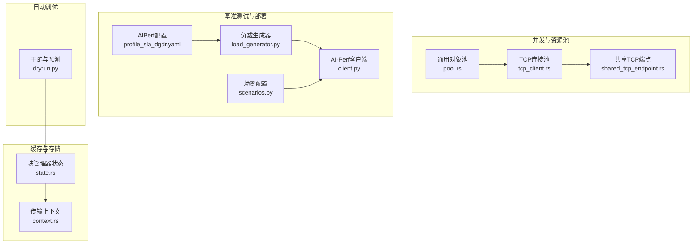
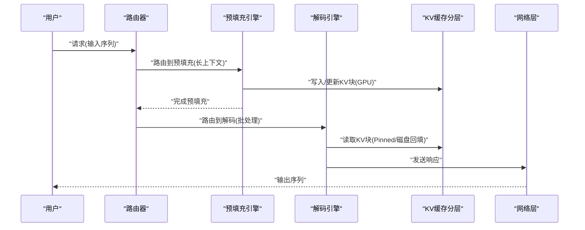
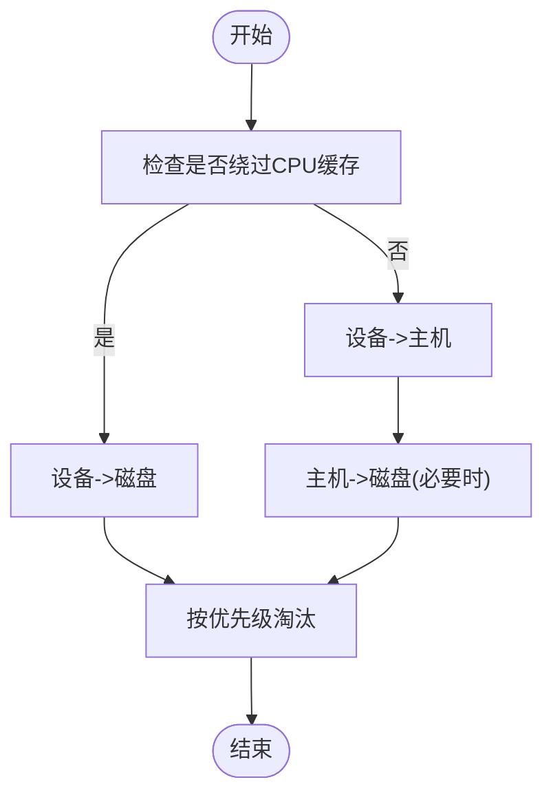
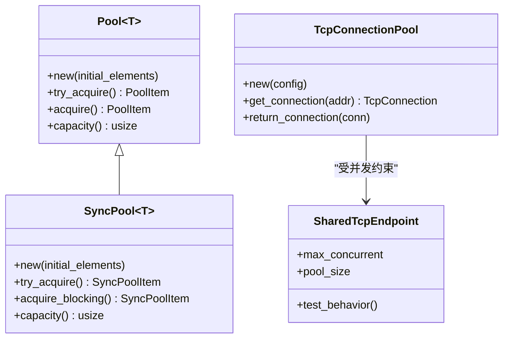
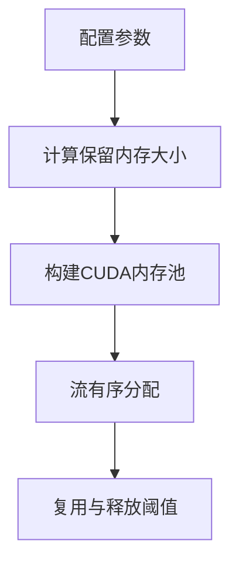
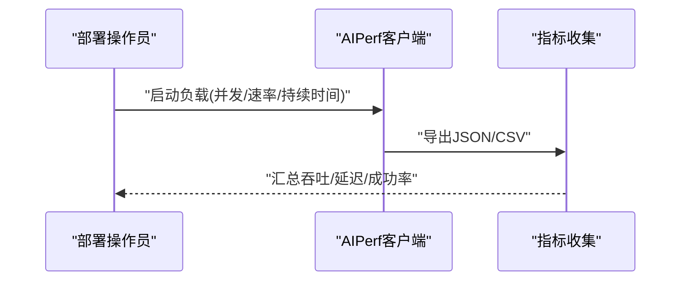
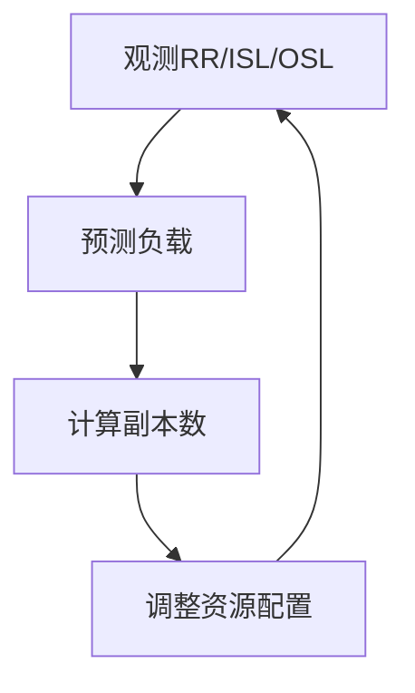
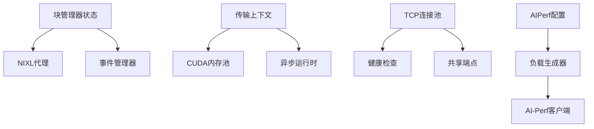

# 性能调优配置

<cite>
**本文档引用的文件**
- [tuning.md](file://docs/performance/tuning.md)
- [state.rs](file://lib/llm/src/block_manager/state.rs)
- [context.rs](file://lib/llm/src/block_manager/block/transfer/context.rs)
- [pool.rs](file://lib/runtime/src/utils/pool.rs)
- [tcp_client.rs](file://lib/runtime/src/pipeline/network/egress/tcp_client.rs)
- [shared_tcp_endpoint.rs](file://lib/runtime/src/pipeline/network/ingress/shared_tcp_endpoint.rs)
- [profile_sla_dgdr.yaml](file://benchmarks/profiler/deploy/profile_sla_dgdr.yaml)
- [dgd.yaml](file://deploy/discovery/dgd.yaml)
- [load_generator.py](file://tests/profiler/utils/load_generator.py)
- [client.py](file://tests/fault_tolerance/deploy/client.py)
- [scenarios.py](file://tests/fault_tolerance/deploy/scenarios.py)
- [dryrun.py](file://components/src/dynamo/planner/utils/dryrun.py)
</cite>

## 目录
1. [简介](#简介)
2. [项目结构](#项目结构)
3. [核心组件](#核心组件)
4. [架构概览](#架构概览)
5. [详细组件分析](#详细组件分析)
6. [依赖关系分析](#依赖关系分析)
7. [性能考虑](#性能考虑)
8. [故障排查指南](#故障排查指南)
9. [结论](#结论)

## 简介
本指南专注于Dynamo系统的性能调优配置，覆盖缓存策略、并发控制、资源池管理以及性能基准测试与自动调优机制。通过深入解析KV缓存分层（GPU/CPU/磁盘）、线程池与连接池、GPU内存池与网络缓冲区优化，并结合AIPerf集成与负载生成器，帮助用户在不同工作负载下实现最佳吞吐与延迟表现。

## 项目结构
Dynamo的性能调优涉及多个层面：
- 缓存与存储：KV块管理器的状态与分层缓存（设备/GPU、主机/Pinned、磁盘）
- 并发与资源池：通用对象池、TCP连接池、CUDA内存池
- 基准测试：AIPerf集成、负载生成器、结果解析
- 自动调优：规划器干跑与负载预测

**图表来源**
- [state.rs](file://lib/llm/src/block_manager/state.rs#L101-L213)
- [context.rs](file://lib/llm/src/block_manager/block/transfer/context.rs#L164-L232)
- [pool.rs](file://lib/runtime/src/utils/pool.rs#L185-L331)
- [tcp_client.rs](file://lib/runtime/src/pipeline/network/egress/tcp_client.rs#L358-L369)
- [shared_tcp_endpoint.rs](file://lib/runtime/src/pipeline/network/ingress/shared_tcp_endpoint.rs#L936-L952)
- [profile_sla_dgdr.yaml](file://benchmarks/profiler/deploy/profile_sla_dgdr.yaml#L14-L29)
- [load_generator.py](file://tests/profiler/utils/load_generator.py#L65-L196)
- [client.py](file://tests/fault_tolerance/deploy/client.py#L576-L590)
- [scenarios.py](file://tests/fault_tolerance/deploy/scenarios.py#L615-L653)
- [dryrun.py](file://components/src/dynamo/planner/utils/dryrun.py#L93-L129)

**章节来源**
- [tuning.md](file://docs/performance/tuning.md#L18-L149)

## 核心组件
本节概述与性能调优直接相关的组件及其职责：
- KV块管理器状态：负责构建多级缓存池（设备/GPU、主机/Pinned、磁盘），并协调离线/迁移策略
- 传输上下文与CUDA内存池：为跨设备数据传输提供内存池与批量参数化
- 通用对象池：统一的异步/同步资源池接口，支持返回回调与容量控制
- TCP连接池：带健康检查的连接复用，降低握手与拥塞开销
- AIPerf基准测试：通过配置文件驱动在线剖析与SLA验证
- 负载生成器与客户端：封装请求速率、持续时间、超时与结果解析
- 规划器干跑与预测：基于历史指标预测未来负载并调整副本数

**章节来源**
- [state.rs](file://lib/llm/src/block_manager/state.rs#L101-L213)
- [context.rs](file://lib/llm/src/block_manager/block/transfer/context.rs#L164-L232)
- [pool.rs](file://lib/runtime/src/utils/pool.rs#L185-L331)
- [tcp_client.rs](file://lib/runtime/src/pipeline/network/egress/tcp_client.rs#L358-L369)
- [profile_sla_dgdr.yaml](file://benchmarks/profiler/deploy/profile_sla_dgdr.yaml#L14-L29)
- [load_generator.py](file://tests/profiler/utils/load_generator.py#L65-L196)
- [client.py](file://tests/fault_tolerance/deploy/client.py#L576-L590)
- [dryrun.py](file://components/src/dynamo/planner/utils/dryrun.py#L93-L129)

## 架构概览
Dynamo的性能调优围绕以下关键路径展开：
- 预填充阶段：优先使用大批次、长上下文以提升GPU利用率，减少首次令牌时间
- 解码阶段：平衡批大小与最大令牌数，控制中间张量尺寸与KV缓存占用
- 缓存分层：设备/GPU作为主缓存，主机/Pinned作为二级缓存，磁盘作为远端缓存
- 连接与网络：通过连接池与共享端点优化网络吞吐与延迟
- 自动调优：基于历史指标预测负载，动态调整副本数量与资源分配

**图表来源**
- [tuning.md](file://docs/performance/tuning.md#L76-L110)
- [state.rs](file://lib/llm/src/block_manager/state.rs#L145-L169)

## 详细组件分析

### 缓存策略配置
- KV缓存大小与层次
  - 设备/GPU缓存：作为主要缓存，承载高频访问的KV块
  - 主机/Pinned缓存：作为二级缓存，用于回填与临时驻留
  - 磁盘缓存：用于远端回填与长期驻留，降低设备内存压力
- 预取策略
  - 预填充阶段采用大批次与长上下文，提升GPU利用率
  - 解码阶段根据ITL与OSL目标动态调整最大令牌数
- 淘汰算法
  - 基于优先级与命中率的离线/迁移策略，避免频繁碎片化
  - 支持绕过CPU缓存（从GPU直接到磁盘）以减少中间层开销

**图表来源**
- [state.rs](file://lib/llm/src/block_manager/state.rs#L145-L169)

**章节来源**
- [state.rs](file://lib/llm/src/block_manager/state.rs#L101-L213)
- [tuning.md](file://docs/performance/tuning.md#L76-L110)

### 并发控制配置
- 线程池设置
  - 异步运行时与Tokio句柄用于任务调度与I/O操作
  - 通过通知与条件变量实现高效的资源获取与释放
- 连接池管理
  - TCP连接池维护每地址的健康连接队列，自动过滤不健康连接
  - 共享TCP端点确保并发上限与池大小的一致性
- 资源限制
  - 对象池容量与阻塞获取行为保证资源可用性与公平性
  - 连接池大小与通道缓冲区限制网络并发度

**图表来源**
- [pool.rs](file://lib/runtime/src/utils/pool.rs#L185-L331)
- [tcp_client.rs](file://lib/runtime/src/pipeline/network/egress/tcp_client.rs#L358-L369)
- [shared_tcp_endpoint.rs](file://lib/runtime/src/pipeline/network/ingress/shared_tcp_endpoint.rs#L936-L952)

**章节来源**
- [pool.rs](file://lib/runtime/src/utils/pool.rs#L185-L331)
- [tcp_client.rs](file://lib/runtime/src/pipeline/network/egress/tcp_client.rs#L358-L369)
- [shared_tcp_endpoint.rs](file://lib/runtime/src/pipeline/network/ingress/shared_tcp_endpoint.rs#L936-L952)

### 资源池配置
- GPU内存池
  - 基于CUDA流有序分配，支持预热与释放阈值
  - 批量参数化（并发传输数、批大小、层数、外层组件数）决定保留内存大小
- CPU计算池
  - 通过主机Pinned缓冲区池与传输上下文协同，减少CPU-GPU拷贝开销
- 网络缓冲区优化
  - 连接池大小与通道缓冲区共同影响吞吐与延迟
  - 健康检查与重试机制提升稳定性

**图表来源**
- [context.rs](file://lib/llm/src/block_manager/block/transfer/context.rs#L211-L232)

**章节来源**
- [context.rs](file://lib/llm/src/block_manager/block/transfer/context.rs#L164-L232)

### 性能基准测试配置
- AIPerf集成
  - 通过部署YAML配置profilingConfig与SLA参数（ISL/OSL/TTFT/ITL）
  - 容器镜像版本与自动应用策略由部署覆盖项控制
- 负载生成
  - 计算请求速率与并发度，按持续时间驱动测试
  - 超时策略与日志持久化便于问题定位
- 性能指标收集
  - 解析AI-Perf导出的JSON与CSV，提取吞吐、延迟、成功率等关键指标

**图表来源**
- [profile_sla_dgdr.yaml](file://benchmarks/profiler/deploy/profile_sla_dgdr.yaml#L14-L29)
- [load_generator.py](file://tests/profiler/utils/load_generator.py#L65-L196)
- [client.py](file://tests/fault_tolerance/deploy/client.py#L576-L590)

**章节来源**
- [profile_sla_dgdr.yaml](file://benchmarks/profiler/deploy/profile_sla_dgdr.yaml#L14-L29)
- [load_generator.py](file://tests/profiler/utils/load_generator.py#L65-L196)
- [client.py](file://tests/fault_tolerance/deploy/client.py#L576-L590)
- [scenarios.py](file://tests/fault_tolerance/deploy/scenarios.py#L615-L653)

### 自动调优机制
- 动态资源配置
  - 基于历史RR/ISL/OSL观测，预测未来负载并调整副本需求
- 自适应调度
  - 规划器在预填充与解码阶段分别计算副本数，平衡吞吐与延迟
- 性能预测
  - 通过干跑记录指标，建立时间序列预测模型，指导资源扩展

**图表来源**
- [dryrun.py](file://components/src/dynamo/planner/utils/dryrun.py#L93-L129)

**章节来源**
- [dryrun.py](file://components/src/dynamo/planner/utils/dryrun.py#L93-L129)

## 依赖关系分析
- 组件耦合
  - 块管理器状态依赖NIXL代理与事件管理器，协调多级缓存与离线策略
  - 传输上下文依赖CUDA内存池与异步运行时，确保高效的数据传输
  - TCP连接池与共享端点共同约束网络并发度
- 外部依赖
  - AIPerf容器镜像与部署YAML定义了基准测试环境
  - 负载生成器与客户端封装了外部工具的调用与结果解析

**图表来源**
- [state.rs](file://lib/llm/src/block_manager/state.rs#L29-L47)
- [context.rs](file://lib/llm/src/block_manager/block/transfer/context.rs#L173-L180)
- [tcp_client.rs](file://lib/runtime/src/pipeline/network/egress/tcp_client.rs#L358-L369)
- [profile_sla_dgdr.yaml](file://benchmarks/profiler/deploy/profile_sla_dgdr.yaml#L14-L29)
- [load_generator.py](file://tests/profiler/utils/load_generator.py#L65-L196)
- [client.py](file://tests/fault_tolerance/deploy/client.py#L576-L590)

**章节来源**
- [state.rs](file://lib/llm/src/block_manager/state.rs#L29-L47)
- [context.rs](file://lib/llm/src/block_manager/block/transfer/context.rs#L173-L180)
- [tcp_client.rs](file://lib/runtime/src/pipeline/network/egress/tcp_client.rs#L358-L369)
- [profile_sla_dgdr.yaml](file://benchmarks/profiler/deploy/profile_sla_dgdr.yaml#L14-L29)
- [load_generator.py](file://tests/profiler/utils/load_generator.py#L65-L196)
- [client.py](file://tests/fault_tolerance/deploy/client.py#L576-L590)

## 性能考虑
- 缓存策略
  - 合理设置块大小（如128）以平衡前缀缓存命中率与注意力计算效率
  - 在高负载下考虑绕过CPU缓存，减少中间层开销
- 并发控制
  - 对象池容量应与峰值并发匹配；连接池大小与通道缓冲区需与网络带宽一致
  - 使用健康检查与重试机制提升稳定性
- 资源池
  - CUDA内存池的保留大小与释放阈值需根据模型规模与批大小调优
  - CPU计算池与Pinned缓冲区配合，减少拷贝次数
- 基准测试
  - 使用AIPerf进行SLA驱动的在线剖析，结合持续时间与请求计数控制测试长度
  - 解析导出指标，关注吞吐、P99延迟与成功率

[本节为通用性能建议，无需特定文件来源]

## 故障排查指南
- 缓存相关
  - 检查离线策略是否正确应用，确认优先级阈值与终止条件
  - 关注设备/GPU缓存不足导致的回填频率与磁盘访问
- 并发相关
  - 对象池空时的日志与等待行为，确认容量与获取策略
  - TCP连接池中不健康连接的过滤与重建
- 基准测试相关
  - 超时错误与进程返回码，查看标准输出与标准错误日志
  - 成功率与错误摘要，定位失败模式（如取消、超时）

**章节来源**
- [state.rs](file://lib/llm/src/block_manager/state.rs#L743-L779)
- [pool.rs](file://lib/runtime/src/utils/pool.rs#L311-L331)
- [tcp_client.rs](file://lib/runtime/src/pipeline/network/egress/tcp_client.rs#L910-L950)
- [client.py](file://tests/fault_tolerance/deploy/client.py#L549-L590)
- [load_generator.py](file://tests/profiler/utils/load_generator.py#L133-L187)

## 结论
通过系统化的缓存策略、并发控制与资源池配置，并结合AIPerf基准测试与自动调优机制，Dynamo能够在不同工作负载下实现稳定的高性能推理服务。建议从缓存层次与块大小入手，逐步优化并发参数与网络缓冲区，并利用干跑与SLA驱动的基准测试持续迭代调优。