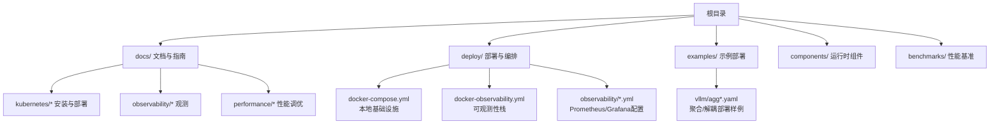
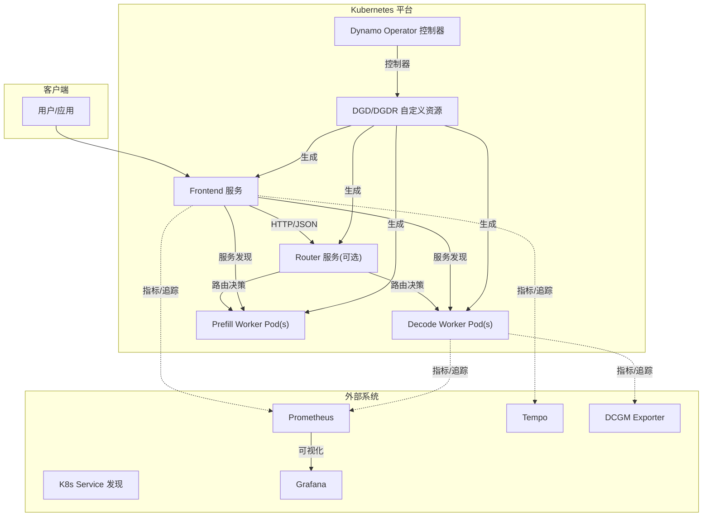
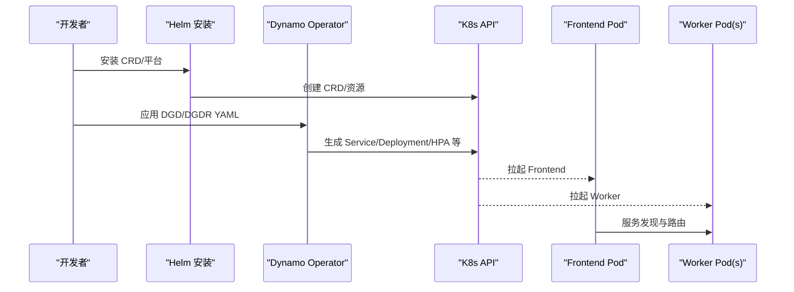
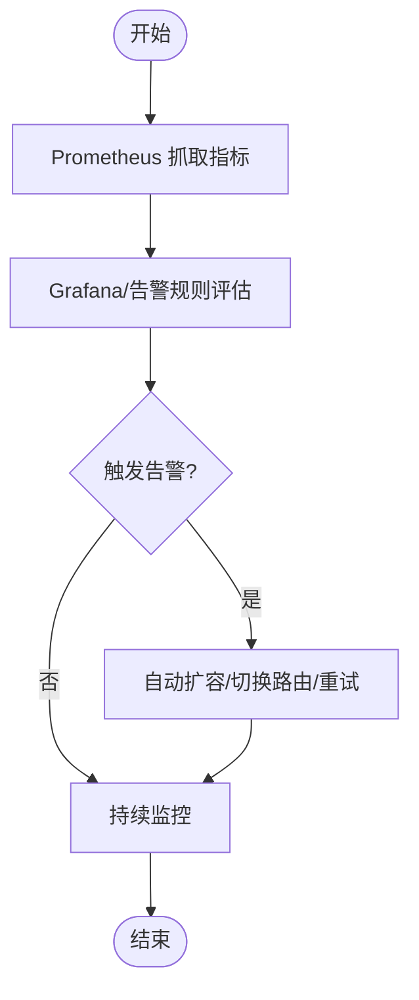
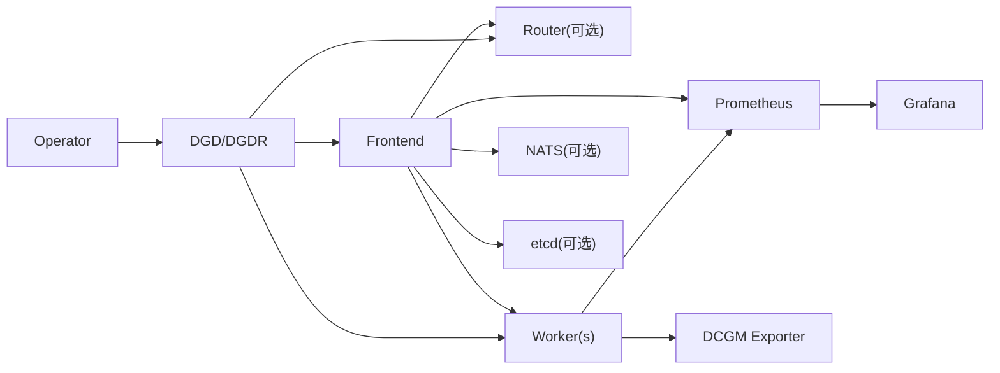

# 生产环境配置

<cite>
**本文引用的文件**
- [README.md](file://README.md)
- [deploy/README.md](file://deploy/README.md)
- [docs/kubernetes/README.md](file://docs/kubernetes/README.md)
- [docs/kubernetes/installation_guide.md](file://docs/kubernetes/installation_guide.md)
- [docs/kubernetes/deployment/create_deployment.md](file://docs/kubernetes/deployment/create_deployment.md)
- [docs/kubernetes/autoscaling.md](file://docs/kubernetes/autoscaling.md)
- [docs/performance/tuning.md](file://docs/performance/tuning.md)
- [docs/observability/README.md](file://docs/observability/README.md)
- [deploy/docker-compose.yml](file://deploy/docker-compose.yml)
- [deploy/docker-observability.yml](file://deploy/docker-observability.yml)
- [deploy/observability/prometheus.yml](file://deploy/observability/prometheus.yml)
- [deploy/observability/grafana-datasources.yml](file://deploy/observability/grafana-datasources.yml)
- [examples/backends/vllm/deploy/agg.yaml](file://examples/backends/vllm/deploy/agg.yaml)
- [examples/backends/vllm/deploy/agg_router.yaml](file://examples/backends/vllm/deploy/agg_router.yaml)
- [examples/backends/vllm/deploy/disagg_router.yaml](file://examples/backends/vllm/deploy/disagg_router.yaml)
</cite>

## 目录
1. [简介](#简介)
2. [项目结构](#项目结构)
3. [核心组件](#核心组件)
4. [架构总览](#架构总览)
5. [详细组件分析](#详细组件分析)
6. [依赖关系分析](#依赖关系分析)
7. [性能考虑](#性能考虑)
8. [故障排查指南](#故障排查指南)
9. [结论](#结论)
10. [附录](#附录)

## 简介
本指南面向在生产环境中部署与运维Dynamo推理平台的工程团队，覆盖单节点本地验证、Kubernetes多节点集群部署以及混合环境（本地+K8s）部署的配置策略；围绕CPU、内存、GPU与网络资源的合理分配给出优化建议；阐述高可用性配置（负载均衡、故障转移、数据持久化）；提供性能调优（缓存策略、并发控制、资源池管理）与监控告警（关键指标、异常检测、自动恢复）实践；最后总结安全加固与访问控制要点。

## 项目结构
Dynamo仓库提供了从本地快速启动到Kubernetes生产部署的完整路径，并配套可观测性栈与性能调优文档。关键目录与文件如下：
- 文档与指南：docs/ 下包含安装、部署、观测、性能等主题文档
- 部署与编排：deploy/ 提供K8s平台安装、示例与可观测性编排
- 示例部署：examples/ 各后端（vLLM/SGLang/TRT-LLM）的聚合/解耦部署样例
- 组件实现：components/ 各运行时组件（前端、路由、引擎等）
- 基准与性能：benchmarks/ 性能评测工具与脚本

章节来源
- file://README.md#L18-L367
- file://docs/kubernetes/README.md#L1-L253

## 核心组件
- 前端（Frontend）：提供OpenAI兼容HTTP接口，负责请求预处理、服务发现与路由、负载均衡与健康检查。
- 工作进程（Worker）：承载具体推理引擎（vLLM/SGLang/TRT-LLM），执行prefill/decode计算。
- 路由器（Router）：支持KV感知路由，减少重复KV计算，提升吞吐。
- 平台与自定义资源：DynamoGraphDeployment（DGD）、DynamoGraphDeploymentScalingAdapter（DGDSA）等，用于声明式编排与弹性伸缩。
- 可观测性：Prometheus、Grafana、Tempo、DCGM Exporter、NATS Exporter构成的监控追踪体系。

章节来源
- file://docs/kubernetes/README.md#L160-L253
- file://docs/kubernetes/deployment/create_deployment.md#L80-L148
- file://docs/observability/README.md#L35-L100

## 架构总览
下图展示Dynamo在Kubernetes中的典型拓扑：前端作为统一入口，通过服务发现连接多个工作进程；可选KV感知路由器进行流量调度；平台控制器根据DGD/DGDR生成实际工作负载；Prometheus/Grafana/Tempos提供监控与追踪。

图表来源
- [docs/kubernetes/README.md](file://docs/kubernetes/README.md#L160-L253)
- [docs/observability/README.md](file://docs/observability/README.md#L61-L100)

## 详细组件分析

### 单节点部署（本地开发/验证）
- 适用场景：本地开发、无外部依赖、快速验证
- 关键点：
  - 使用本地etcd/NATS：通过docker-compose启动基础服务
  - 前端与引擎均以本地进程方式运行，避免跨网络开销
  - vLLM可禁用KV事件发布以避免NATS依赖
- 参考命令与配置：
  - 启动基础设施与可观测性栈
  - 使用前端与引擎的本地命令行参数进行功能验证

章节来源
- file://README.md#L225-L242
- file://deploy/docker-compose.yml#L1-L36
- file://deploy/docker-observability.yml#L1-L138

### 多节点集群部署（Kubernetes）
- 平台安装：
  - 通过Helm安装CRD与平台组件，支持共享/专用集群模式
  - 支持多节点编排（Grove/KAI Scheduler或LeaderWorkerSet+Volcano）
- 部署模式选择：
  - 聚合（Aggregated）：prefill+decode在同一GPU/进程内
  - 聚合+路由器（Aggregated+Router）：多副本+负载均衡
  - 解耦（Disaggregated）：prefill与decode分离，独立扩展
- 示例模板：
  - vLLM聚合/聚合+路由器/解耦部署样例
  - 可按需启用KV感知路由、LoRA适配器等

图表来源
- [docs/kubernetes/installation_guide.md](file://docs/kubernetes/installation_guide.md#L133-L206)
- [docs/kubernetes/README.md](file://docs/kubernetes/README.md#L160-L253)
- [examples/backends/vllm/deploy/agg.yaml](file://examples/backends/vllm/deploy/agg.yaml#L1-L35)

章节来源
- file://docs/kubernetes/installation_guide.md#L1-L386
- file://docs/kubernetes/README.md#L1-L253
- file://examples/backends/vllm/deploy/agg.yaml#L1-L35
- file://examples/backends/vllm/deploy/agg_router.yaml#L1-L37
- file://examples/backends/vllm/deploy/disagg_router.yaml#L1-L57

### 混合环境部署（本地+K8s）
- 场景说明：部分组件在K8s中运行，另一些在本地或边缘节点运行
- 配置要点：
  - 保持服务发现一致性（如使用K8s Service或etcd/NATS）
  - 明确Frontend与Worker的网络可达性与端口暴露策略
  - 在K8s侧保留必要的镜像拉取密钥与模型密钥
- 建议：
  - 将Frontend置于K8s中以获得更好的弹性与可观测性
  - 将Worker按模型规模与延迟目标分布在不同节点或集群

章节来源
- file://docs/kubernetes/deployment/create_deployment.md#L79-L148
- file://docs/kubernetes/README.md#L160-L253

### 资源配置优化（CPU/内存/GPU/网络）
- GPU优先级：
  - 解耦部署优先：prefill/decode独立扩缩，最大化GPU利用率
  - 聚合部署次之：简单但可能产生prefill/decode竞争
- 内存与KV缓存：
  - 合理设置批大小、最大token数与块大小，平衡吞吐与延迟
  - 利用KV感知路由与前缀缓存，降低重复计算
- 网络与I/O：
  - 优先使用K8s内Service与Ingress，避免跨机房高延迟
  - 对大模型与长序列，关注网络带宽与队列深度

章节来源
- file://docs/performance/tuning.md#L31-L149
- file://docs/kubernetes/deployment/create_deployment.md#L150-L188

### 高可用性配置（负载均衡、故障转移、数据持久化）
- 负载均衡与路由：
  - 使用Frontend+Router组合，结合K8s Service与Ingress
  - KV感知路由减少重复KV计算，提高整体吞吐
- 故障转移：
  - 多副本Frontend/Worker，配合就绪/存活探针
  - 通过DGD/DGDSA实现受控扩缩容，避免抖动
- 数据持久化：
  - 模型与权重通过Secret/ConfigMap或外部存储挂载
  - 前缀缓存与KV缓存可采用本地磁盘或共享存储（视部署拓扑）

章节来源
- file://docs/kubernetes/README.md#L160-L253
- file://docs/kubernetes/deployment/create_deployment.md#L150-L188
- file://examples/backends/vllm/deploy/agg_router.yaml#L16-L18

### 性能调优指南（缓存、并发、资源池）
- 引擎参数：
  - 批大小、最大token数、块大小等参数对吞吐/延迟影响显著
  - 解耦部署中，prefill/decode分别优化以满足不同SLA
- 缓存策略：
  - 启用前缀缓存与KV感知路由
  - 合理设置最大本地prefill长度，避免prefill瓶颈
- 并发与资源池：
  - 依据TTFT/ITL目标，动态调整Worker副本数
  - 结合KEDA/HPA/Prometheus进行事件驱动/指标驱动伸缩

章节来源
- file://docs/performance/tuning.md#L31-L149
- file://docs/kubernetes/autoscaling.md#L148-L174

### 监控与告警配置（指标、异常检测、自动恢复）
- 指标采集：
  - Prometheus抓取Frontend/Worker/DCGM/NATS导出器指标
  - Grafana可视化，设置阈值告警
- 关键指标：
  - 前端：排队请求数、并发请求数、TTFT/ITL直方图
  - Worker：GPU利用率、显存占用、KV缓存命中率
- 自动恢复：
  - 通过HPA/KEDA/DGDSA实现自愈扩缩
  - 结合探针与重启策略保障健康状态

图表来源
- [docs/observability/README.md](file://docs/observability/README.md#L35-L100)
- [deploy/observability/prometheus.yml](file://deploy/observability/prometheus.yml#L20-L63)
- [deploy/observability/grafana-datasources.yml](file://deploy/observability/grafana-datasources.yml#L18-L24)

章节来源
- file://docs/observability/README.md#L1-L100
- file://deploy/docker-compose.yml#L1-L36
- file://deploy/docker-observability.yml#L1-L138
- file://deploy/observability/prometheus.yml#L1-L63
- file://deploy/observability/grafana-datasources.yml#L1-L24

### 安全加固与访问控制策略
- 访问控制：
  - 使用K8s RBAC限制Operator与控制器权限
  - 通过命名空间隔离与网络策略限制横向移动
- 凭据管理：
  - 模型与镜像仓库凭据使用Secret注入
  - 禁止在容器镜像中硬编码敏感信息
- 入口与传输：
  - 通过Ingress/ALB/TLS终止保护API入口
  - 服务间通信建议启用mTLS或基于网络策略的加密通道

章节来源
- file://docs/kubernetes/installation_guide.md#L196-L204
- file://docs/kubernetes/deployment/create_deployment.md#L189-L222

## 依赖关系分析
- 组件耦合：
  - Frontend依赖服务发现（K8s Service/etcd/NATS），与Worker解耦
  - Router可选启用，增强KV感知与流量调度能力
  - Operator通过DGD/DGDR声明式生成工作负载
- 外部依赖：
  - Prometheus/Grafana/Tempos提供可观测性
  - DCGM Exporter提供GPU指标
  - NATS/etcd用于消息与键值存储（可选）

图表来源
- [docs/kubernetes/README.md](file://docs/kubernetes/README.md#L160-L253)
- [docs/observability/README.md](file://docs/observability/README.md#L61-L100)

章节来源
- file://docs/kubernetes/README.md#L160-L253
- file://docs/observability/README.md#L61-L100

## 性能考虑
- 参数调优：
  - 批大小、最大token数、块大小与并行度（TP/PP）需结合模型规模与硬件能力进行权衡
  - 解耦部署中，prefill/decode分别优化以满足不同SLA目标
- 资源分配：
  - GPU优先分配给解耦部署的decode侧，提升KV缓存复用率
  - 合理设置CPU/内存请求/限制，避免调度与OOM风险
- 缓存与路由：
  - 启用前缀缓存与KV感知路由，降低重复计算
  - 适当增大最大本地prefill长度，减少prefill队列积压

章节来源
- file://docs/performance/tuning.md#L31-L149
- file://docs/kubernetes/deployment/create_deployment.md#L150-L188

## 故障排查指南
- 平台安装问题：
  - CRD已存在、Operator冲突、镜像拉取失败等常见错误与解决步骤
- 部署与伸缩：
  - DGDSA启用/禁用对副本管理的影响；HPA/KEDA配置与指标可用性检查
- 可观测性：
  - 指标抓取失败、Grafana数据源未配置、Prometheus查询异常等问题定位

章节来源
- file://docs/kubernetes/installation_guide.md#L297-L386
- file://docs/kubernetes/autoscaling.md#L668-L732
- file://docs/observability/README.md#L1-L100

## 结论
Dynamo提供从本地到Kubernetes的全栈部署方案与完善的可观测性支撑。生产部署应以解耦架构为首选，结合KV感知路由与SLA驱动的弹性伸缩，实现高吞吐与低延迟的平衡。通过合理的资源规划、监控告警与安全加固，可构建稳定可靠的生成式AI推理平台。

## 附录
- 快速参考清单：
  - 平台安装：Helm安装CRD与平台，校验Operator与基础设施
  - 部署模板：从聚合/聚合+路由器/解耦样例入手，按需启用KV路由
  - 伸缩策略：KEDA/HPA/Planner三类方案，按场景选择
  - 监控配置：Prometheus抓取、Grafana仪表板、Tempo追踪
  - 安全策略：RBAC、Secret、Ingress TLS、网络策略