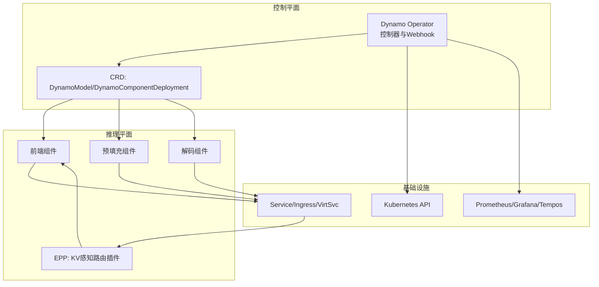
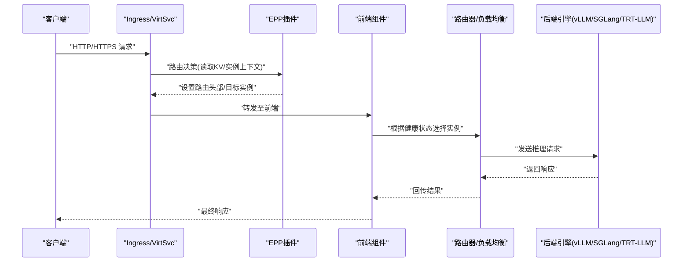
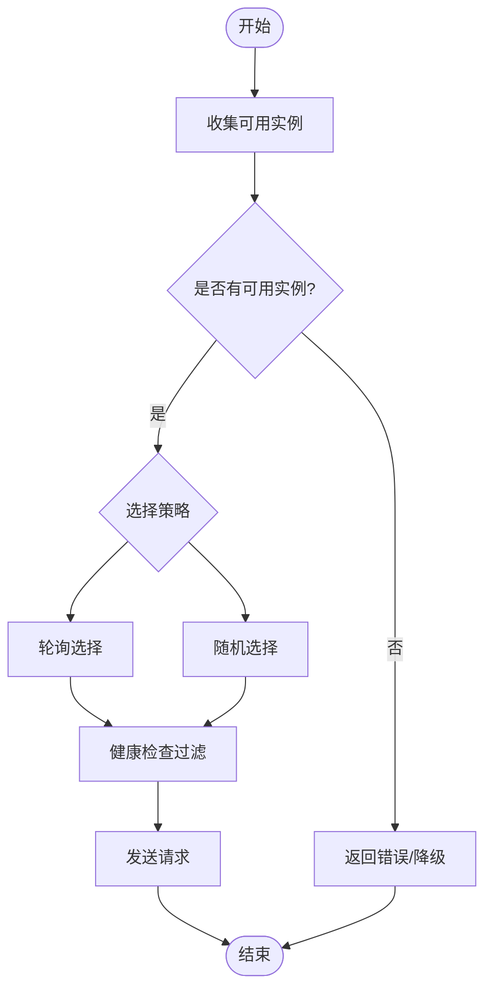
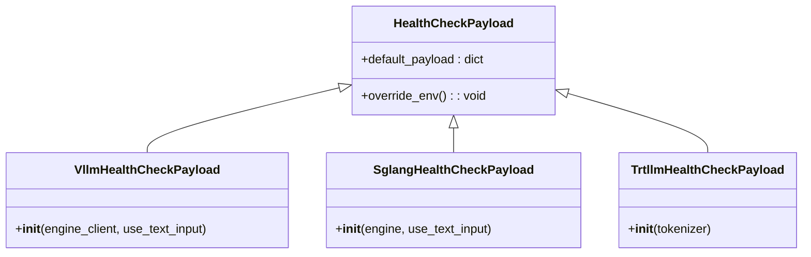
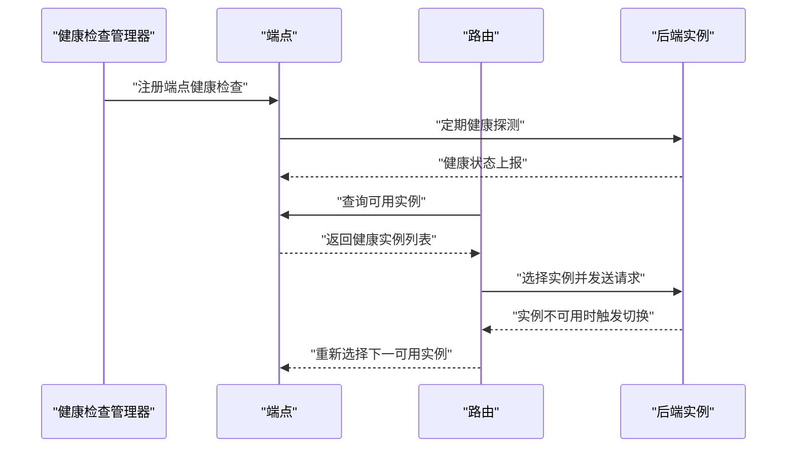
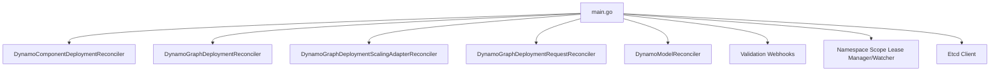

# 高可用性配置

<cite>
**本文引用的文件**
- [deploy/operator/api/v1alpha1/dynamo_model_types.go](file://deploy/operator/api/v1alpha1/dynamo_model_types.go)
- [deploy/operator/api/v1alpha1/dynamocomponentdeployment_types.go](file://deploy/operator/api/v1alpha1/dynamocomponentdeployment_types.go)
- [deploy/operator/cmd/main.go](file://deploy/operator/cmd/main.go)
- [components/src/dynamo/sglang/health_check.py](file://components/src/dynamo/sglang/health_check.py)
- [components/src/dynamo/trtllm/health_check.py](file://components/src/dynamo/trtllm/health_check.py)
- [components/src/dynamo/vllm/health_check.py](file://components/src/dynamo/vllm/health_check.py)
- [deploy/inference-gateway/epp/cmd/epp/main.go](file://deploy/inference-gateway/epp/cmd/epp/main.go)
- [deploy/helm/charts/platform/components/operator/templates/deployment.yaml](file://deploy/helm/charts/platform/components/operator/templates/deployment.yaml)
- [deploy/helm/charts/platform/components/operator/templates/epp.yaml](file://deploy/helm/charts/platform/components/operator/templates/epp.yaml)
- [deploy/discovery/dgd.yaml](file://deploy/discovery/dgd.yaml)
- [lib/runtime/src/system_health.rs](file://lib/runtime/src/system_health.rs)
- [lib/runtime/src/pipeline/network/egress/push_router.rs](file://lib/runtime/src/pipeline/network/egress/push_router.rs)
- [tests/fault_tolerance/deploy/checkers.py](file://tests/fault_tolerance/deploy/checkers.py)
</cite>

## 目录
1. [简介](#简介)
2. [项目结构](#项目结构)
3. [核心组件](#核心组件)
4. [架构总览](#架构总览)
5. [详细组件分析](#详细组件分析)
6. [依赖关系分析](#依赖关系分析)
7. [性能考量](#性能考量)
8. [故障排查指南](#故障排查指南)
9. [结论](#结论)
10. [附录](#附录)

## 简介
本指南面向在Kubernetes上部署与运维Dynamo推理平台的工程师，聚焦高可用性配置的完整实践。内容覆盖负载均衡与流量分发、健康检查与故障转移、故障注入与恢复验证、数据持久化与状态管理、多区域部署与一致性、以及服务网格与网关插件的配置要点。文档以仓库中的实际实现为依据，结合架构图与流程图帮助读者快速落地。

## 项目结构
Dynamo采用“Operator + 多后端引擎 + 网关插件”的分层架构：
- Operator层：通过CRD定义推理拓扑与组件，负责资源编排、发现与可观测性指标。
- 后端引擎层：支持SGLang、vLLM、TRT-LLM等后端，提供健康检查payload与运行时能力。
- 网关与路由层：通过Gateway API扩展与自研Endpoint Picker Plugin（EPP）实现KV感知的智能路由。
- Helm与部署：提供Operator与相关组件的Helm Chart与默认配置模板。

图表来源
- [deploy/operator/cmd/main.go](file://deploy/operator/cmd/main.go#L560-L621)
- [deploy/operator/api/v1alpha1/dynamocomponentdeployment_types.go](file://deploy/operator/api/v1alpha1/dynamocomponentdeployment_types.go#L39-L48)
- [deploy/inference-gateway/epp/cmd/epp/main.go](file://deploy/inference-gateway/epp/cmd/epp/main.go#L47-L59)

章节来源
- [deploy/operator/cmd/main.go](file://deploy/operator/cmd/main.go#L129-L694)
- [deploy/operator/api/v1alpha1/dynamo_model_types.go](file://deploy/operator/api/v1alpha1/dynamo_model_types.go#L29-L173)
- [deploy/operator/api/v1alpha1/dynamocomponentdeployment_types.go](file://deploy/operator/api/v1alpha1/dynamocomponentdeployment_types.go#L39-L133)

## 核心组件
- DynamoModel：描述模型元信息、端点列表与就绪状态，用于Operator进行状态收敛与条件判断。
- DynamoComponentDeployment：描述组件类型、副本数、探针、Ingress/VirtSvc、多节点等，作为Operator编排入口。
- Operator主程序：初始化控制器、Webhook、命名空间范围、发现后端（Kubernetes或Etcd），并注册健康/就绪探针。
- 后端健康检查：各后端提供统一的健康检查payload构造器，确保最小化请求即可完成健康探测。
- EPP：基于Gateway API扩展的Endpoint Picker插件，实现KV感知的路由决策与请求头注入。

章节来源
- [deploy/operator/api/v1alpha1/dynamo_model_types.go](file://deploy/operator/api/v1alpha1/dynamo_model_types.go#L29-L173)
- [deploy/operator/api/v1alpha1/dynamocomponentdeployment_types.go](file://deploy/operator/api/v1alpha1/dynamocomponentdeployment_types.go#L39-L133)
- [deploy/operator/cmd/main.go](file://deploy/operator/cmd/main.go#L129-L694)
- [components/src/dynamo/sglang/health_check.py](file://components/src/dynamo/sglang/health_check.py#L50-L121)
- [components/src/dynamo/trtllm/health_check.py](file://components/src/dynamo/trtllm/health_check.py#L51-L92)
- [components/src/dynamo/vllm/health_check.py](file://components/src/dynamo/vllm/health_check.py#L82-L121)
- [deploy/inference-gateway/epp/cmd/epp/main.go](file://deploy/inference-gateway/epp/cmd/epp/main.go#L47-L59)

## 架构总览
下图展示从请求进入网关到后端执行的高可用路径，包含健康检查、故障转移与路由选择。

图表来源
- [deploy/inference-gateway/epp/cmd/epp/main.go](file://deploy/inference-gateway/epp/cmd/epp/main.go#L22-L33)
- [lib/runtime/src/pipeline/network/egress/push_router.rs](file://lib/runtime/src/pipeline/network/egress/push_router.rs#L145-L180)
- [components/src/dynamo/vllm/health_check.py](file://components/src/dynamo/vllm/health_check.py#L82-L121)

## 详细组件分析

### 负载均衡与流量分发策略
- 健康检查驱动的实例选择：系统维护每个端点的健康状态，并在路由阶段过滤不可用实例，确保流量仅投向健康实例。
- 路由算法：提供轮询与随机两种策略，均基于可用实例集合进行选择，避免对不健康实例发起请求。
- 网关与EPP：通过Gateway API扩展与EPP插件，将KV缓存与实例上下文信息注入请求头，实现更精细的路由决策。

图表来源
- [lib/runtime/src/pipeline/network/egress/push_router.rs](file://lib/runtime/src/pipeline/network/egress/push_router.rs#L145-L180)
- [lib/runtime/src/system_health.rs](file://lib/runtime/src/system_health.rs#L36-L221)

章节来源
- [lib/runtime/src/pipeline/network/egress/push_router.rs](file://lib/runtime/src/pipeline/network/egress/push_router.rs#L145-L180)
- [lib/runtime/src/system_health.rs](file://lib/runtime/src/system_health.rs#L36-L221)

### 健康检查机制
- 统一基类：所有后端健康检查payload继承统一的基类，支持环境变量覆盖；针对不同后端（vLLM、SGLang、TRT-LLM）提供默认payload与BOS token解析。
- 最小化请求：健康检查payload仅包含最少必要字段，确保探测开销低且能快速判定实例健康。
- 探测触发：Operator与运行时共同维护健康检查目标与通知器，按需注册端点并持续探测。

图表来源
- [components/src/dynamo/vllm/health_check.py](file://components/src/dynamo/vllm/health_check.py#L82-L121)
- [components/src/dynamo/sglang/health_check.py](file://components/src/dynamo/sglang/health_check.py#L50-L121)
- [components/src/dynamo/trtllm/health_check.py](file://components/src/dynamo/trtllm/health_check.py#L51-L92)

章节来源
- [components/src/dynamo/vllm/health_check.py](file://components/src/dynamo/vllm/health_check.py#L21-L121)
- [components/src/dynamo/sglang/health_check.py](file://components/src/dynamo/sglang/health_check.py#L20-L121)
- [components/src/dynamo/trtllm/health_check.py](file://components/src/dynamo/trtllm/health_check.py#L17-L92)

### 故障转移配置
- 健康状态管理：系统健康模块维护端点健康映射与通知器，新端点注册通过通道避免竞态，确保健康检查及时生效。
- 实例选择与重试：当当前实例不可用时，轮询/随机策略会自动切换到下一个可用实例，减少单点故障影响。
- 验证与回归：测试套件提供高可用场景下的成功率与恢复时间校验，保障故障转移有效。

图表来源
- [lib/runtime/src/system_health.rs](file://lib/runtime/src/system_health.rs#L36-L221)
- [lib/runtime/src/pipeline/network/egress/push_router.rs](file://lib/runtime/src/pipeline/network/egress/push_router.rs#L145-L180)
- [tests/fault_tolerance/deploy/checkers.py](file://tests/fault_tolerance/deploy/checkers.py#L409-L444)

章节来源
- [lib/runtime/src/system_health.rs](file://lib/runtime/src/system_health.rs#L36-L221)
- [lib/runtime/src/pipeline/network/egress/push_router.rs](file://lib/runtime/src/pipeline/network/egress/push_router.rs#L145-L180)
- [tests/fault_tolerance/deploy/checkers.py](file://tests/fault_tolerance/deploy/checkers.py#L371-L444)

### 数据持久化与状态管理
- 模型与组件状态：DynamoModel与DynamoComponentDeployment CRD记录端点、副本、条件等状态，便于Operator进行一致性收敛与观测。
- 发现后端：Operator启动时可选择Kubernetes API或Etcd作为服务发现后端，影响端点发现与状态同步。
- 命名空间范围：支持受限命名空间模式与集群范围模式，通过租约机制防止脑裂并实现跨命名空间协调。

章节来源
- [deploy/operator/api/v1alpha1/dynamo_model_types.go](file://deploy/operator/api/v1alpha1/dynamo_model_types.go#L76-L173)
- [deploy/operator/api/v1alpha1/dynamocomponentdeployment_types.go](file://deploy/operator/api/v1alpha1/dynamocomponentdeployment_types.go#L179-L200)
- [deploy/operator/cmd/main.go](file://deploy/operator/cmd/main.go#L225-L230)
- [deploy/operator/cmd/main.go](file://deploy/operator/cmd/main.go#L354-L426)

### 多区域部署与一致性
- 跨区域复制：通过多集群部署与共享Etcd作为状态中心，实现跨区域的组件状态与端点信息同步。
- 延迟优化：利用就近路由与EPP插件的KV感知能力，优先选择本地或近邻区域实例，降低跨区RTT。
- 一致性保证：Operator在集群内通过Leader选举与健康/就绪探针维持一致性；跨集群通过Etcd写入与读取的原子性保障。

章节来源
- [deploy/operator/cmd/main.go](file://deploy/operator/cmd/main.go#L454-L464)
- [deploy/discovery/dgd.yaml](file://deploy/discovery/dgd.yaml#L10-L11)

### 服务网格与网关插件
- EPP插件：注册自定义评分器，实现基于KV缓存与实例上下文的路由决策，并在请求头中注入路由标识。
- Ingress与VirtualService：组件可通过Ingress或Istio VirtualService暴露，支持TLS与主机后缀配置，配合EPP实现服务网格内的智能路由。
- RBAC与权限：根据命名空间限制模式生成Role/RoleBinding或ClusterRole，确保EPP在受控范围内访问所需资源。

图表来源
- [deploy/inference-gateway/epp/cmd/epp/main.go](file://deploy/inference-gateway/epp/cmd/epp/main.go#L47-L59)
- [deploy/operator/api/v1alpha1/dynamocomponentdeployment_types.go](file://deploy/operator/api/v1alpha1/dynamocomponentdeployment_types.go#L149-L170)
- [deploy/helm/charts/platform/components/operator/templates/epp.yaml](file://deploy/helm/charts/platform/components/operator/templates/epp.yaml#L31-L116)

章节来源
- [deploy/inference-gateway/epp/cmd/epp/main.go](file://deploy/inference-gateway/epp/cmd/epp/main.go#L22-L59)
- [deploy/operator/api/v1alpha1/dynamocomponentdeployment_types.go](file://deploy/operator/api/v1alpha1/dynamocomponentdeployment_types.go#L149-L170)
- [deploy/helm/charts/platform/components/operator/templates/epp.yaml](file://deploy/helm/charts/platform/components/operator/templates/epp.yaml#L16-L116)

## 依赖关系分析
- 控制器与Webhook：Operator主程序注册多个控制器与验证Webhook，启用/禁用取决于配置标志；同时配置健康/就绪探针。
- 命名空间范围：在受限模式下创建租约管理器，在集群模式下创建租约观察器，防止跨命名空间冲突。
- 发现后端：支持Kubernetes API与Etcd两种后端，Etcd客户端在启动时建立连接并保持长连。

图表来源
- [deploy/operator/cmd/main.go](file://deploy/operator/cmd/main.go#L560-L621)
- [deploy/operator/cmd/main.go](file://deploy/operator/cmd/main.go#L354-L426)
- [deploy/operator/cmd/main.go](file://deploy/operator/cmd/main.go#L454-L464)

章节来源
- [deploy/operator/cmd/main.go](file://deploy/operator/cmd/main.go#L129-L694)

## 性能考量
- 健康检查开销：使用最小化payload与短超时，避免对生产流量造成额外压力。
- 路由策略：轮询与随机策略复杂度低，适合大规模实例场景；建议结合实例容量与健康度动态调整。
- 网关与EPP：头部注入与路由决策在网关层完成，尽量减少后端处理负担。
- 可观测性：Prometheus/Grafana/Tempos集成，建议为关键指标设置告警阈值，如成功率、P95/P99延迟与实例可用率。

## 故障排查指南
- 成功率与恢复时间：高可用场景下要求成功率≥90%，恢复时间≤60秒；若失败，检查健康检查是否正确、实例是否被标记为不可用。
- 健康状态异常：确认系统健康模块已注册端点并持续探测；检查路由是否正确过滤不可用实例。
- 网关与EPP：核对VirtualService/Ingress配置与TLS参数，确保EPP插件正常加载并注入路由头部。
- Operator与命名空间：在受限模式下检查租约管理器是否正常运行；在集群模式下确认租约观察器未出现致命错误导致退出。

章节来源
- [tests/fault_tolerance/deploy/checkers.py](file://tests/fault_tolerance/deploy/checkers.py#L409-L444)
- [lib/runtime/src/system_health.rs](file://lib/runtime/src/system_health.rs#L36-L221)
- [deploy/operator/cmd/main.go](file://deploy/operator/cmd/main.go#L384-L394)

## 结论
通过统一的健康检查、基于实例健康状态的路由策略、EPP插件的KV感知路由、以及Operator对CRD与服务发现的编排，Dynamo实现了高可用的推理平台。结合多区域部署与服务网格配置，可在保证低延迟的同时提升整体韧性。建议在生产环境中启用严格的健康检查与可观测性，并定期进行故障演练以验证恢复能力。

## 附录
- Helm部署参数：Operator容器参数、Leader选举、命名空间范围、发现后端、Webhook开关等均可通过Helm Values与命令行参数配置。
- 示例拓扑：通过DynamoGraphDeployment示例定义前端、预填充与解码组件，结合资源限制与副本数实现冗余与弹性。

章节来源
- [deploy/helm/charts/platform/components/operator/templates/deployment.yaml](file://deploy/helm/charts/platform/components/operator/templates/deployment.yaml#L78-L148)
- [deploy/discovery/dgd.yaml](file://deploy/discovery/dgd.yaml#L15-L59)