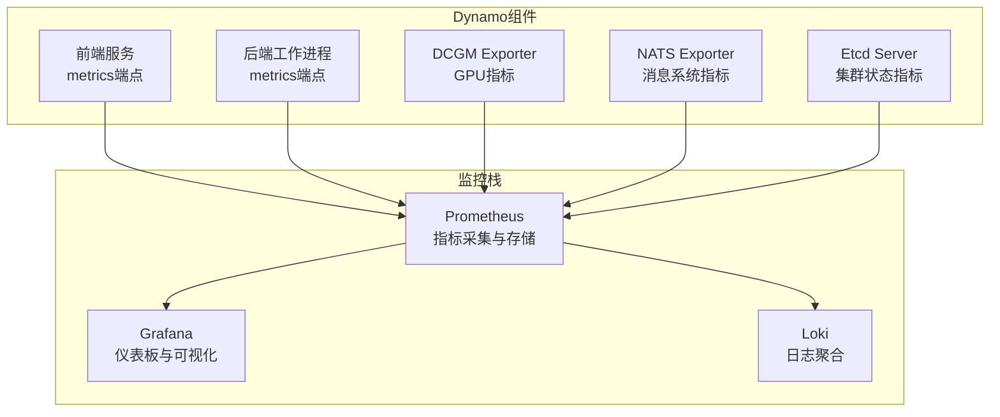
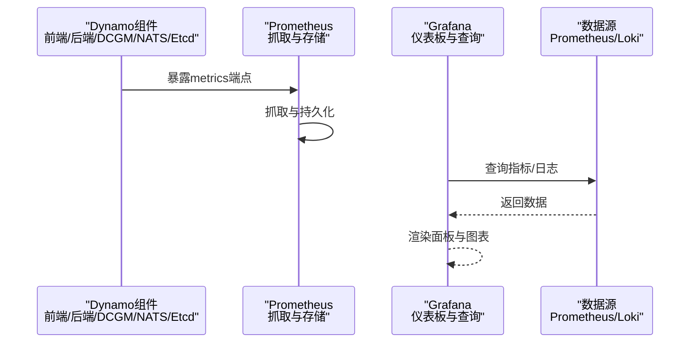
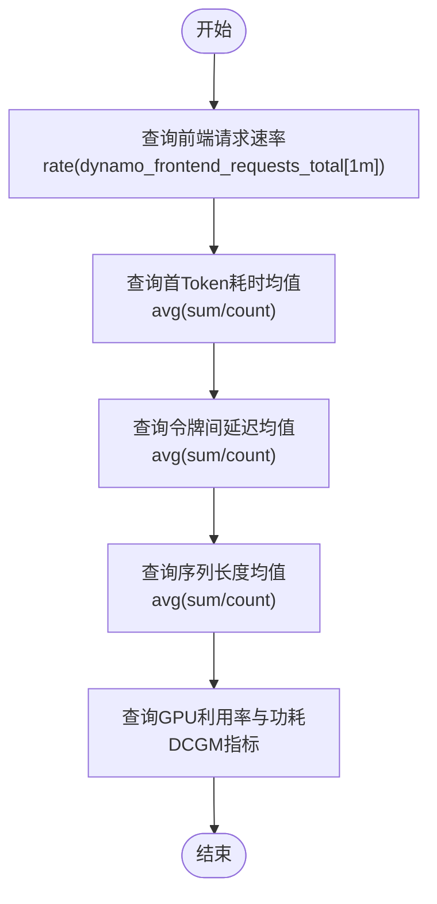
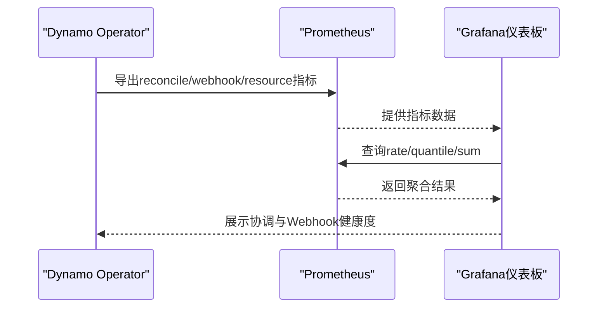
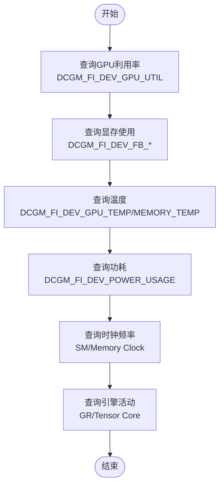
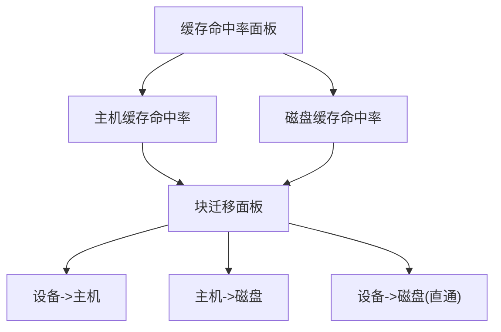
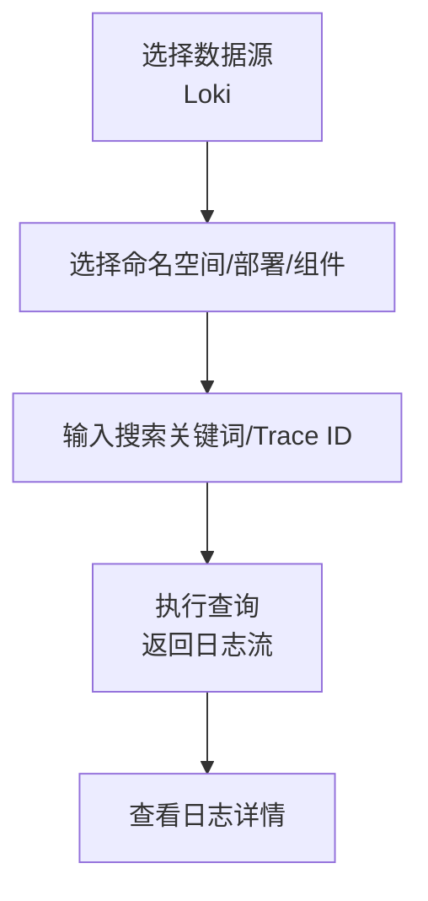
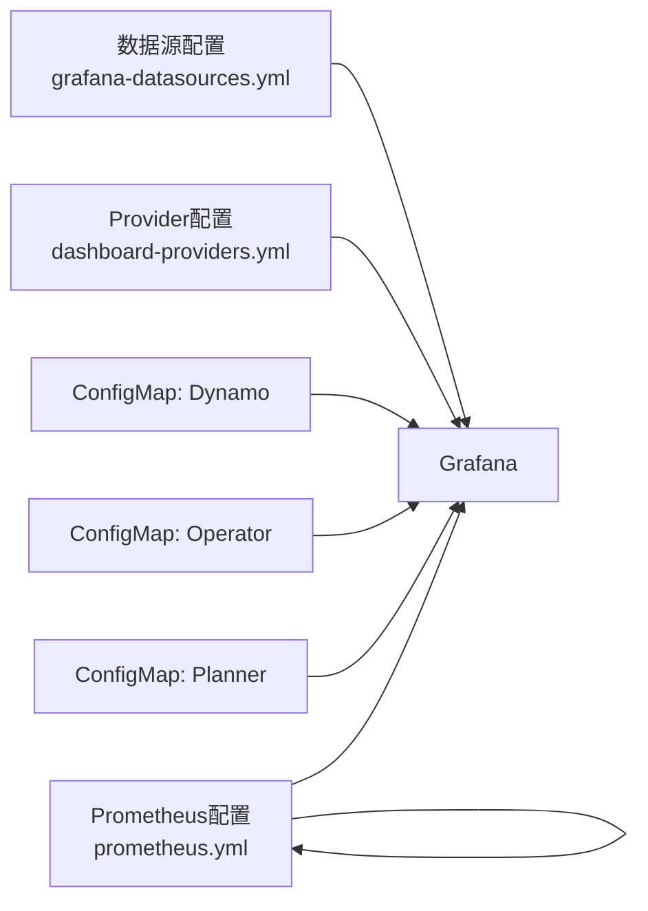

# 仪表板可视化

<cite>
**本文档引用的文件**
- [dynamo.json](file://deploy/observability/grafana_dashboards/dynamo.json)
- [dynamo-operator.json](file://deploy/observability/grafana_dashboards/dynamo-operator.json)
- [dcgm-metrics.json](file://deploy/observability/grafana_dashboards/dcgm-metrics.json)
- [kvbm.json](file://deploy/observability/grafana_dashboards/kvbm.json)
- [temp-loki.json](file://deploy/observability/grafana_dashboards/temp-loki.json)
- [dashboard-providers.yml](file://deploy/observability/grafana_dashboards/dashboard-providers.yml)
- [grafana-datasources.yml](file://deploy/observability/grafana-datasources.yml)
- [prometheus.yml](file://deploy/observability/prometheus.yml)
- [grafana-dynamo-dashboard-configmap.yaml](file://deploy/observability/k8s/grafana-dynamo-dashboard-configmap.yaml)
- [grafana-operator-dashboard-configmap.yaml](file://deploy/observability/k8s/grafana-operator-dashboard-configmap.yaml)
- [grafana-planner-dashboard-configmap.yaml](file://deploy/observability/k8s/grafana-planner-dashboard-configmap.yaml)
- [prometheus-grafana.md](file://docs/observability/prometheus-grafana.md)
</cite>

## 目录
1. [简介](#简介)
2. [项目结构](#项目结构)
3. [核心组件](#核心组件)
4. [架构总览](#架构总览)
5. [详细组件分析](#详细组件分析)
6. [依赖关系分析](#依赖关系分析)
7. [性能考虑](#性能考虑)
8. [故障排除指南](#故障排除指南)
9. [结论](#结论)
10. [附录](#附录)

## 简介
本指南面向Dynamo项目的仪表板可视化与监控实践，系统性阐述Grafana仪表板的设计原则、布局策略、面板类型选择与数据源配置；深入解析关键监控仪表板（系统资源、应用性能、业务指标）的构建方法；说明仪表板模板化与共享机制以支持团队协作与标准化；提供交互式查询与钻取功能的实现思路；并给出仪表板的版本管理与更新策略建议。

## 项目结构
Dynamo的可观测性由Prometheus（指标）、Grafana（可视化）与Loki（日志）共同组成。仪表板以JSON格式定义，并通过Grafana的数据源与Provider进行加载与管理。Kubernetes部署场景下，仪表板通过ConfigMap注入到Grafana中，实现统一管理与版本控制。

图表来源
- [prometheus.yml](file://deploy/observability/prometheus.yml#L20-L62)
- [grafana-datasources.yml](file://deploy/observability/grafana-datasources.yml#L18-L24)
- [dynamo.json](file://deploy/observability/grafana_dashboards/dynamo.json#L26-L116)

章节来源
- [prometheus.yml](file://deploy/observability/prometheus.yml#L16-L62)
- [grafana-datasources.yml](file://deploy/observability/grafana-datasources.yml#L18-L24)
- [dashboard-providers.yml](file://deploy/observability/grafana_dashboards/dashboard-providers.yml#L18-L29)

## 核心组件
- 指标采集器：Prometheus通过静态配置抓取Dynamo前端、后端、DCGM、NATS、Etcd等目标。
- 数据源：Grafana默认使用Prometheus作为指标数据源，同时可接入Loki用于日志查询。
- 仪表板：以JSON格式定义，包含面板、查询、变量与样式配置；支持Provider自动加载与Kubernetes ConfigMap注入。
- 面板类型：时序图、统计图、日志面板等，按指标特性选择最佳可视化方式。
- 变量与模板：通过模板变量实现命名空间、组件类型、模型等维度的动态筛选与钻取。

章节来源
- [prometheus.yml](file://deploy/observability/prometheus.yml#L20-L62)
- [grafana-datasources.yml](file://deploy/observability/grafana-datasources.yml#L18-L24)
- [dashboard-providers.yml](file://deploy/observability/grafana_dashboards/dashboard-providers.yml#L18-L29)
- [dynamo.json](file://deploy/observability/grafana_dashboards/dynamo.json#L24-L117)

## 架构总览
下图展示从Dynamo组件到Grafana仪表板的完整链路：组件暴露metrics端点，Prometheus定时抓取，Grafana通过Provider或ConfigMap加载仪表板并查询Prometheus/Loki。

图表来源
- [prometheus.yml](file://deploy/observability/prometheus.yml#L20-L62)
- [grafana-datasources.yml](file://deploy/observability/grafana-datasources.yml#L18-L24)
- [dashboard-providers.yml](file://deploy/observability/grafana_dashboards/dashboard-providers.yml#L18-L29)

## 详细组件分析

### Dynamo通用仪表板（系统与硬件）
该仪表板聚焦Dynamo运行时的整体状态，包含前端请求速率、首Token耗时、令牌间延迟、输入输出序列长度、GPU利用率与功耗等关键指标。

- 面板类型与用途
  - 时间序列：前端请求/耗时/延迟/序列长度，用于趋势观察与异常检测。
  - 多轴时间序列：GPU利用率与功耗对比，便于容量与能耗分析。
- 关键查询要点
  - 使用rate()计算每秒速率，结合legendFormat区分模型/状态/类型。
  - 使用平均值聚合（sum/count）与分位数（quantile）评估尾部延迟。
- 布局策略
  - 将高优先级指标放置在上方，便于快速掌握全局健康度。
  - 同类指标（如耗时）集中展示，减少视觉切换成本。

图表来源
- [dynamo.json](file://deploy/observability/grafana_dashboards/dynamo.json#L106-L116)
- [dynamo.json](file://deploy/observability/grafana_dashboards/dynamo.json#L199-L209)
- [dynamo.json](file://deploy/observability/grafana_dashboards/dynamo.json#L294-L303)
- [dynamo.json](file://deploy/observability/grafana_dashboards/dynamo.json#L387-L395)
- [dynamo.json](file://deploy/observability/grafana_dashboards/dynamo.json#L480-L501)
- [dynamo.json](file://deploy/observability/grafana_dashboards/dynamo.json#L591-L613)

章节来源
- [dynamo.json](file://deploy/observability/grafana_dashboards/dynamo.json#L24-L117)

### Dynamo Operator仪表板（控制器与Webhook）
该仪表板关注Dynamo Operator的运行健康，包括资源协调速率、持续时间与错误率，以及Webhook准入请求与拒绝情况，帮助运维人员快速定位控制器问题。

- 面板类型与用途
  - 时间序列：协调速率、P95持续时间、错误率，用于稳定性评估。
  - 时间序列：Webhook请求速率、P95持续时间、拒绝原因分布。
- 关键查询要点
  - 使用rate()计算速率，histogram_quantile()提取P95。
  - 通过标签过滤（resource_type、namespace、operation、reason）进行多维分析。
- 布局策略
  - 将“协调”与“Webhook”分区块展示，便于分别排查。

图表来源
- [dynamo-operator.json](file://deploy/observability/grafana_dashboards/dynamo-operator.json#L125-L137)
- [dynamo-operator.json](file://deploy/observability/grafana_dashboards/dynamo-operator.json#L224-L228)
- [dynamo-operator.json](file://deploy/observability/grafana_dashboards/dynamo-operator.json#L320-L324)
- [dynamo-operator.json](file://deploy/observability/grafana_dashboards/dynamo-operator.json#L516-L520)

章节来源
- [dynamo-operator.json](file://deploy/observability/grafana_dashboards/dynamo-operator.json#L24-L139)
- [dynamo-operator.json](file://deploy/observability/grafana_dashboards/dynamo-operator.json#L139-L327)
- [dynamo-operator.json](file://deploy/observability/grafana_dashboards/dynamo-operator.json#L327-L620)

### DCGM GPU指标仪表板
该仪表板基于DCGM Exporter提供的GPU指标，展示GPU利用率、显存占用、温度、功耗、时钟频率与引擎活动等，帮助识别硬件瓶颈与过热风险。

- 面板类型与用途
  - 时间序列：GPU利用率、显存使用、温度、功耗、时钟频率。
  - 仪表盘：平均GPU利用率仪表，直观反映整体负载。
- 关键查询要点
  - 利用DCGM标准指标名进行聚合与单位换算（如字节、瓦特、摄氏度）。
  - 通过legendFormat区分不同GPU实例，便于横向对比。

图表来源
- [dcgm-metrics.json](file://deploy/observability/grafana_dashboards/dcgm-metrics.json#L117-L122)
- [dcgm-metrics.json](file://deploy/observability/grafana_dashboards/dcgm-metrics.json#L214-L230)
- [dcgm-metrics.json](file://deploy/observability/grafana_dashboards/dcgm-metrics.json#L325-L341)
- [dcgm-metrics.json](file://deploy/observability/grafana_dashboards/dcgm-metrics.json#L428-L433)
- [dcgm-metrics.json](file://deploy/observability/grafana_dashboards/dcgm-metrics.json#L520-L540)
- [dcgm-metrics.json](file://deploy/observability/grafana_dashboards/dcgm-metrics.json#L625-L641)

章节来源
- [dcgm-metrics.json](file://deploy/observability/grafana_dashboards/dcgm-metrics.json#L25-L122)
- [dcgm-metrics.json](file://deploy/observability/grafana_dashboards/dcgm-metrics.json#L122-L230)
- [dcgm-metrics.json](file://deploy/observability/grafana_dashboards/dcgm-metrics.json#L230-L341)
- [dcgm-metrics.json](file://deploy/observability/grafana_dashboards/dcgm-metrics.json#L341-L433)
- [dcgm-metrics.json](file://deploy/observability/grafana_dashboards/dcgm-metrics.json#L433-L540)
- [dcgm-metrics.json](file://deploy/observability/grafana_dashboards/dcgm-metrics.json#L540-L641)

### KVBM（KV块管理器）仪表板
该仪表板聚焦KVBM的缓存命中率与块迁移（主机/设备/磁盘）行为，帮助优化KV缓存策略与IO路径。

- 面板类型与用途
  - 时间序列：主机缓存命中率、磁盘缓存命中率。
  - 时间序列：块迁移（设备到主机、主机到磁盘、设备到磁盘直通）。
- 关键查询要点
  - 使用rate()或直接计数展示迁移速率，结合legendFormat标注方向。
  - 缓存命中率面板可隐藏数值显示，仅保留趋势线以便于对比。

图表来源
- [kvbm.json](file://deploy/observability/grafana_dashboards/kvbm.json#L123-L131)
- [kvbm.json](file://deploy/observability/grafana_dashboards/kvbm.json#L218-L225)
- [kvbm.json](file://deploy/observability/grafana_dashboards/kvbm.json#L424-L433)
- [kvbm.json](file://deploy/observability/grafana_dashboards/kvbm.json#L522-L532)
- [kvbm.json](file://deploy/observability/grafana_dashboards/kvbm.json#L620-L631)

章节来源
- [kvbm.json](file://deploy/observability/grafana_dashboards/kvbm.json#L24-L131)
- [kvbm.json](file://deploy/observability/grafana_dashboards/kvbm.json#L131-L225)
- [kvbm.json](file://deploy/observability/grafana_dashboards/kvbm.json#L225-L325)
- [kvbm.json](file://deploy/observability/grafana_dashboards/kvbm.json#L325-L433)
- [kvbm.json](file://deploy/observability/grafana_dashboards/kvbm.json#L433-L540)
- [kvbm.json](file://deploy/observability/grafana_dashboards/kvbm.json#L540-L641)

### 日志仪表板（Loki集成）
该仪表板通过Loki查询DynamoGraph相关日志，支持按命名空间、部署名称、组件类型与关键词/Trace ID过滤，便于问题定位与关联分析。

- 面板类型与用途
  - 日志面板：实时滚动查看日志，支持详情展开与排序。
- 关键查询要点
  - 使用label_values()生成变量，实现动态过滤。
  - 支持文本框输入搜索关键字与Trace ID，提升检索效率。

图表来源
- [temp-loki.json](file://deploy/observability/grafana_dashboards/temp-loki.json#L51-L65)
- [temp-loki.json](file://deploy/observability/grafana_dashboards/temp-loki.json#L103-L115)
- [temp-loki.json](file://deploy/observability/grafana_dashboards/temp-loki.json#L128-L139)
- [temp-loki.json](file://deploy/observability/grafana_dashboards/temp-loki.json#L153-L165)

章节来源
- [temp-loki.json](file://deploy/observability/grafana_dashboards/temp-loki.json#L22-L66)
- [temp-loki.json](file://deploy/observability/grafana_dashboards/temp-loki.json#L71-L203)

### Planner仪表板（规划器）
该仪表板展示规划器的工人数量、GPU小时用量与观测/预测指标，帮助理解调度策略与资源消耗。

- 面板类型与用途
  - 统计图：当前预填/解码工人数量、累计GPU小时。
  - 时间序列：工人数量历史、观测TTFT/ITL、请求速率/时长、序列长度。
- 关键查询要点
  - 使用planner前缀指标进行聚合与颜色区分。
  - 多轴展示不同单位（请求速率/秒、时长/秒、令牌数），注意轴标签与颜色映射。

章节来源
- [grafana-planner-dashboard-configmap.yaml](file://deploy/observability/k8s/grafana-planner-dashboard-configmap.yaml#L97-L107)
- [grafana-planner-dashboard-configmap.yaml](file://deploy/observability/k8s/grafana-planner-dashboard-configmap.yaml#L156-L166)
- [grafana-planner-dashboard-configmap.yaml](file://deploy/observability/k8s/grafana-planner-dashboard-configmap.yaml#L216-L226)
- [grafana-planner-dashboard-configmap.yaml](file://deploy/observability/k8s/grafana-planner-dashboard-configmap.yaml#L340-L356)
- [grafana-planner-dashboard-configmap.yaml](file://deploy/observability/k8s/grafana-planner-dashboard-configmap.yaml#L500-L514)
- [grafana-planner-dashboard-configmap.yaml](file://deploy/observability/k8s/grafana-planner-dashboard-configmap.yaml#L644-L658)
- [grafana-planner-dashboard-configmap.yaml](file://deploy/observability/k8s/grafana-planner-dashboard-configmap.yaml#L772-L787)

## 依赖关系分析
- 数据源依赖
  - Grafana默认使用Prometheus作为指标数据源；日志面板使用Loki。
- Provider与ConfigMap
  - 文件Provider：通过dashboard-providers.yml从本地文件系统加载仪表板。
  - Kubernetes ConfigMap：通过grafana-dynamo/operator/planner-dashboard-configmap.yaml注入仪表板至Grafana。
- 指标来源
  - Prometheus通过prometheus.yml静态配置抓取Dynamo各组件与外部Exporter。

图表来源
- [grafana-datasources.yml](file://deploy/observability/grafana-datasources.yml#L18-L24)
- [dashboard-providers.yml](file://deploy/observability/grafana_dashboards/dashboard-providers.yml#L18-L29)
- [grafana-dynamo-dashboard-configmap.yaml](file://deploy/observability/k8s/grafana-dynamo-dashboard-configmap.yaml#L11-L12)
- [grafana-operator-dashboard-configmap.yaml](file://deploy/observability/k8s/grafana-operator-dashboard-configmap.yaml#L10-L11)
- [grafana-planner-dashboard-configmap.yaml](file://deploy/observability/k8s/grafana-planner-dashboard-configmap.yaml#L9-L10)
- [prometheus.yml](file://deploy/observability/prometheus.yml#L20-L62)

章节来源
- [prometheus.yml](file://deploy/observability/prometheus.yml#L16-L62)
- [grafana-datasources.yml](file://deploy/observability/grafana-datasources.yml#L18-L24)
- [dashboard-providers.yml](file://deploy/observability/grafana_dashboards/dashboard-providers.yml#L18-L29)
- [grafana-dynamo-dashboard-configmap.yaml](file://deploy/observability/k8s/grafana-dynamo-dashboard-configmap.yaml#L11-L12)
- [grafana-operator-dashboard-configmap.yaml](file://deploy/observability/k8s/grafana-operator-dashboard-configmap.yaml#L10-L11)
- [grafana-planner-dashboard-configmap.yaml](file://deploy/observability/k8s/grafana-planner-dashboard-configmap.yaml#L9-L10)

## 性能考虑
- 查询优化
  - 使用rate()、increase()等窗口函数避免瞬时峰值干扰。
  - 对高基数标签（如instance）进行合理限制，避免查询膨胀。
- 面板渲染
  - 控制面板数量与并发查询，避免Grafana与Prometheus压力过大。
  - 合理设置刷新间隔与最小刷新间隔，平衡实时性与性能。
- 存储与保留
  - 调整Prometheus的存储保留策略，确保关键指标长期可用。
- 日志查询
  - 在Loki查询中使用标签过滤与时间范围，避免全量扫描。

## 故障排除指南
- 服务状态检查
  - 使用docker compose ps确认Prometheus、Grafana、Exporter容器运行正常。
- 日志与错误
  - 使用docker compose logs查看容器日志，定位配置或网络问题。
- 指标可达性
  - 访问Prometheus Targets页面，确认抓取目标处于“UP”状态。
- 配置重载
  - 若遇到配置或数据陈旧，可停止并删除命名卷后重启，以清空持久化数据与仪表板缓存。

章节来源
- [prometheus-grafana.md](file://docs/observability/prometheus-grafana.md#L94-L106)

## 结论
通过规范的仪表板设计与合理的数据源配置，Dynamo能够实现对系统资源、应用性能与业务指标的全面可视化。借助Provider与ConfigMap机制，仪表板可实现团队共享与版本化管理；结合模板变量与钻取能力，满足多环境、多租户的监控需求。建议在实践中持续优化查询与面板布局，确保监控体系的高效与稳定。

## 附录

### 仪表板模板化与共享机制
- 文件Provider：通过dashboard-providers.yml启用文件目录结构，自动加载仪表板文件。
- Kubernetes ConfigMap：将仪表板内容封装为ConfigMap，随Grafana部署同步更新，便于CI/CD与GitOps管理。
- 变量与过滤：利用模板变量实现跨命名空间、跨组件的动态筛选，提升复用性。

章节来源
- [dashboard-providers.yml](file://deploy/observability/grafana_dashboards/dashboard-providers.yml#L18-L29)
- [grafana-dynamo-dashboard-configmap.yaml](file://deploy/observability/k8s/grafana-dynamo-dashboard-configmap.yaml#L11-L12)
- [grafana-operator-dashboard-configmap.yaml](file://deploy/observability/k8s/grafana-operator-dashboard-configmap.yaml#L10-L11)
- [grafana-planner-dashboard-configmap.yaml](file://deploy/observability/k8s/grafana-planner-dashboard-configmap.yaml#L9-L10)

### 交互式查询与钻取实现思路
- 模板变量：在仪表板中定义变量（如namespace、component、model），并在查询中引用，实现动态过滤。
- 多维聚合：通过标签过滤与聚合函数（sum、avg、histogram_quantile）实现跨维度钻取。
- 日志联动：在日志面板中输入Trace ID或关键词，与指标面板联动，实现端到端问题定位。

章节来源
- [temp-loki.json](file://deploy/observability/grafana_dashboards/temp-loki.json#L103-L115)
- [temp-loki.json](file://deploy/observability/grafana_dashboards/temp-loki.json#L128-L139)
- [temp-loki.json](file://deploy/observability/grafana_dashboards/temp-loki.json#L153-L165)
- [dynamo-operator.json](file://deploy/observability/grafana_dashboards/dynamo-operator.json#L132-L136)
- [dynamo-operator.json](file://deploy/observability/grafana_dashboards/dynamo-operator.json#L224-L228)
- [dynamo-operator.json](file://deploy/observability/grafana_dashboards/dynamo-operator.json#L320-L324)

### 版本管理与更新策略
- GitOps：将仪表板JSON与Provider/ConfigMap配置纳入版本控制，通过CI/CD自动化部署。
- 分层管理：将通用面板与特定环境面板分离，减少冲突与回滚风险。
- 迁移与兼容：更新面板时先在测试环境验证，逐步推广至生产；对不兼容变更提供降级方案。