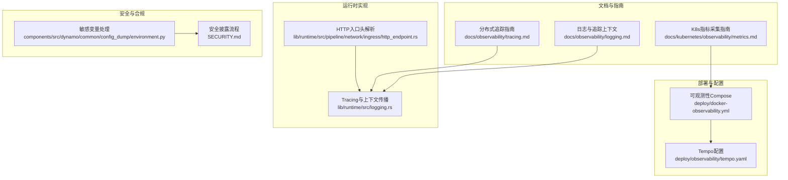
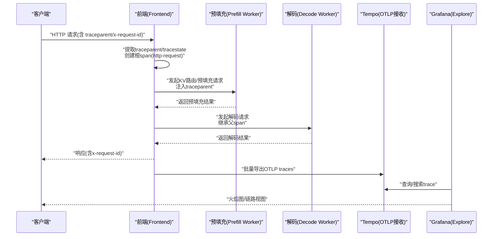
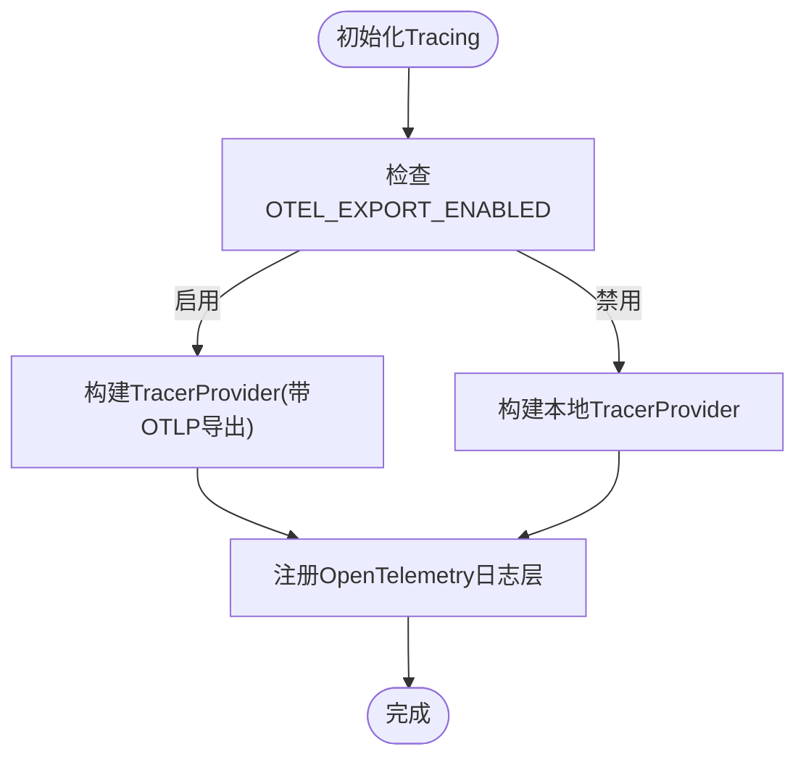
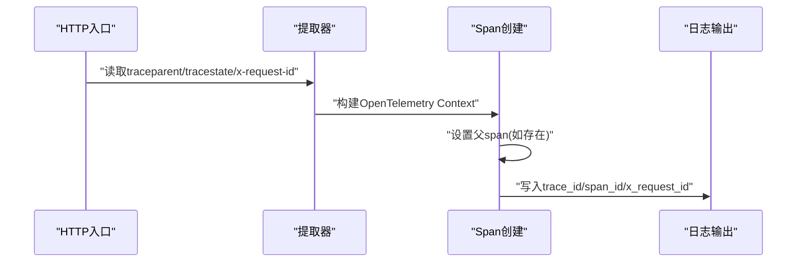
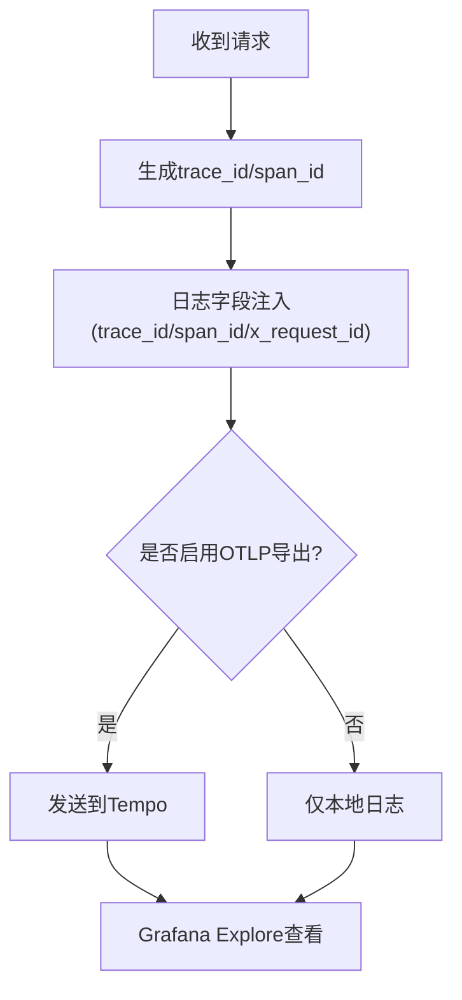
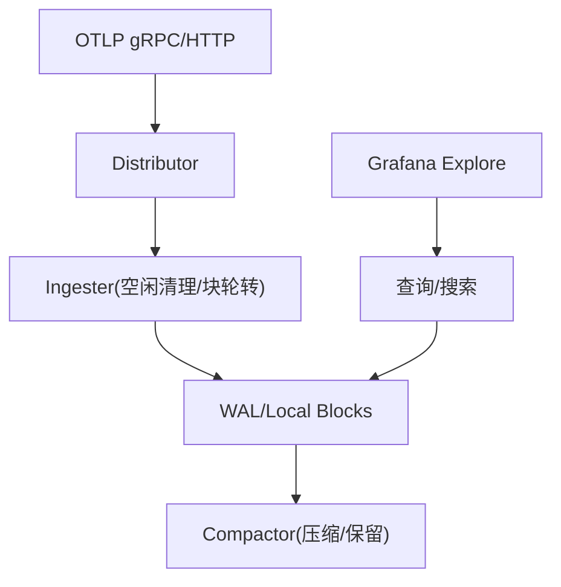
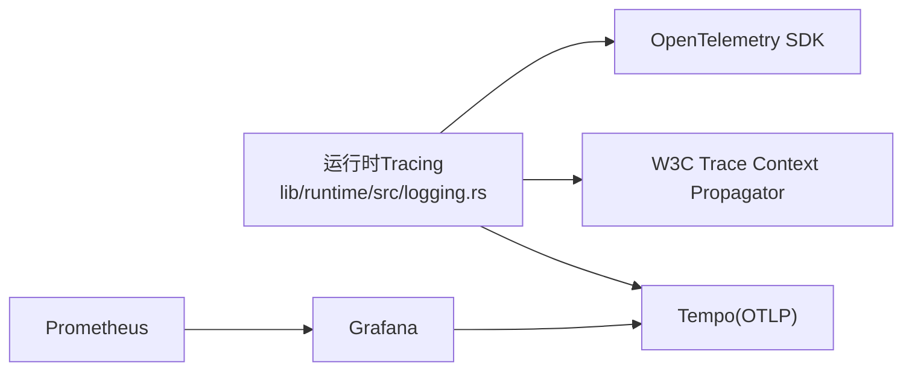

# 分布式追踪

<cite>
**本文引用的文件**
- [docs/observability/tracing.md](file://docs/observability/tracing.md)
- [docs/observability/logging.md](file://docs/observability/logging.md)
- [docs/kubernetes/observability/metrics.md](file://docs/kubernetes/observability/metrics.md)
- [deploy/observability/tempo.yaml](file://deploy/observability/tempo.yaml)
- [deploy/docker-observability.yml](file://deploy/docker-observability.yml)
- [lib/runtime/src/logging.rs](file://lib/runtime/src/logging.rs)
- [lib/runtime/src/pipeline/network/ingress/http_endpoint.rs](file://lib/runtime/src/pipeline/network/ingress/http_endpoint.rs)
- [SECURITY.md](file://SECURITY.md)
- [components/src/dynamo/common/config_dump/environment.py](file://components/src/dynamo/common/config_dump/environment.py)
</cite>

## 目录
1. [简介](#简介)
2. [项目结构](#项目结构)
3. [核心组件](#核心组件)
4. [架构总览](#架构总览)
5. [详细组件分析](#详细组件分析)
6. [依赖关系分析](#依赖关系分析)
7. [性能考量](#性能考量)
8. [故障排查指南](#故障排查指南)
9. [结论](#结论)
10. [附录](#附录)

## 简介
本文件系统化梳理Dynamo在分布式追踪方面的实现与使用方式，重点覆盖以下方面：
- 基于OpenTelemetry的分布式追踪与上下文传播（W3C Trace Context）
- 与Tempo的集成与可视化（Grafana Explore）
- 跨服务调用链路的可视化与性能分析
- 追踪数据的导出、存储与查询优化
- 常见性能瓶颈定位与优化建议
- 追踪数据的安全与隐私保护措施

## 项目结构
围绕分布式追踪，相关能力分布在如下位置：
- 文档层：观测性指南（Tracing、Logging、Metrics）与Kubernetes观测性说明
- 部署层：Tempo、Grafana、Prometheus等可观测性栈的容器编排与配置
- 运行时层：基于OpenTelemetry的Tracing初始化、上下文提取与传播、日志中嵌入trace/span信息
- 安全层：环境变量敏感信息处理与安全披露流程

**图表来源**
- [docs/observability/tracing.md](file://docs/observability/tracing.md#L1-L215)
- [docs/observability/logging.md](file://docs/observability/logging.md#L1-L263)
- [docs/kubernetes/observability/metrics.md](file://docs/kubernetes/observability/metrics.md#L1-L181)
- [deploy/docker-observability.yml](file://deploy/docker-observability.yml#L1-L138)
- [deploy/observability/tempo.yaml](file://deploy/observability/tempo.yaml#L1-L37)
- [lib/runtime/src/logging.rs](file://lib/runtime/src/logging.rs#L135-L1152)
- [lib/runtime/src/pipeline/network/ingress/http_endpoint.rs](file://lib/runtime/src/pipeline/network/ingress/http_endpoint.rs#L276-L302)
- [SECURITY.md](file://SECURITY.md#L1-L32)
- [components/src/dynamo/common/config_dump/environment.py](file://components/src/dynamo/common/config_dump/environment.py#L59-L92)

**章节来源**
- [docs/observability/tracing.md](file://docs/observability/tracing.md#L1-L215)
- [docs/observability/logging.md](file://docs/observability/logging.md#L1-L263)
- [docs/kubernetes/observability/metrics.md](file://docs/kubernetes/observability/metrics.md#L1-L181)
- [deploy/docker-observability.yml](file://deploy/docker-observability.yml#L1-L138)
- [deploy/observability/tempo.yaml](file://deploy/observability/tempo.yaml#L1-L37)
- [lib/runtime/src/logging.rs](file://lib/runtime/src/logging.rs#L135-L1152)
- [lib/runtime/src/pipeline/network/ingress/http_endpoint.rs](file://lib/runtime/src/pipeline/network/ingress/http_endpoint.rs#L276-L302)
- [SECURITY.md](file://SECURITY.md#L1-L32)
- [components/src/dynamo/common/config_dump/environment.py](file://components/src/dynamo/common/config_dump/environment.py#L59-L92)

## 核心组件
- OpenTelemetry Tracing与导出
  - 通过环境变量启用OTLP导出，将trace发送至Tempo（gRPC/HTTP端点）
  - 运行时初始化TracerProvider并注册OpenTelemetry日志层
- 上下文传播
  - 支持W3C Trace Context（traceparent/tracestate），从HTTP/NATS头部提取并注入
  - 在日志中嵌入trace_id、span_id、x-request-id等字段，便于无后端也能关联请求
- Tempo集成
  - Tempo配置包含接收器（OTLP gRPC/HTTP）、存储路径、压缩与保留策略
  - Grafana作为可视化界面，支持Explore搜索与TraceQL
- 日志与追踪
  - JSONL日志格式支持trace/span字段；可选开启Span事件（进入/关闭）日志
  - 支持自定义x-request-id，便于应用级请求跟踪与跨组件关联
- 安全与隐私
  - 环境变量敏感值自动脱敏输出
  - 安全漏洞上报渠道与流程

**章节来源**
- [docs/observability/tracing.md](file://docs/observability/tracing.md#L12-L26)
- [docs/observability/logging.md](file://docs/observability/logging.md#L15-L27)
- [deploy/observability/tempo.yaml](file://deploy/observability/tempo.yaml#L4-L37)
- [lib/runtime/src/logging.rs](file://lib/runtime/src/logging.rs#L135-L1152)
- [components/src/dynamo/common/config_dump/environment.py](file://components/src/dynamo/common/config_dump/environment.py#L59-L92)

## 架构总览
Dynamo的分布式追踪采用“运行时生成+OTLP导出+Tempo存储+Grafana可视化”的方案，核心链路如下：

**图表来源**
- [docs/observability/tracing.md](file://docs/observability/tracing.md#L10-L141)
- [lib/runtime/src/logging.rs](file://lib/runtime/src/logging.rs#L317-L351)
- [lib/runtime/src/pipeline/network/ingress/http_endpoint.rs](file://lib/runtime/src/pipeline/network/ingress/http_endpoint.rs#L276-L302)
- [deploy/docker-observability.yml](file://deploy/docker-observability.yml#L86-L100)

## 详细组件分析

### 组件A：Tracing初始化与OTLP导出
- 功能要点
  - 检测OTEL_EXPORT_ENABLED，按需启用OTLP导出或本地TracerProvider
  - 设置服务名（OTEL_SERVICE_NAME），构建Resource
  - 注册OpenTelemetry日志层与自定义DistributedTraceIdLayer
  - 使用W3C Trace Context Propagator进行传播
- 关键行为
  - 当启用导出时，使用OTLP批量导出器连接Tempo端点
  - 未启用导出时，仍可在日志中看到trace_id/span_id，便于离线分析
- 性能影响
  - 导出会引入网络开销与序列化成本，建议在生产按需开启
  - 批量导出器具备背压与重试机制，降低对业务的影响

**图表来源**
- [lib/runtime/src/logging.rs](file://lib/runtime/src/logging.rs#L935-L970)

**章节来源**
- [lib/runtime/src/logging.rs](file://lib/runtime/src/logging.rs#L135-L1152)
- [docs/observability/tracing.md](file://docs/observability/tracing.md#L12-L26)

### 组件B：上下文提取与传播
- HTTP入口
  - 从HTTP头提取traceparent/tracestate/x-request-id/x-dynamo-request-id
  - 将其封装为TraceParent结构，供后续span创建与传播
- NATS/KV事件通道
  - 从NATS HeaderMap提取traceparent，构造OpenTelemetry Context
  - 用于跨进程/跨组件的span父子关系建立
- 日志与Span
  - 在日志中写入trace_id/span_id/x_request_id，便于快速关联
  - 支持在on_new_span/on_enter阶段补全分布式追踪上下文

**图表来源**
- [lib/runtime/src/pipeline/network/ingress/http_endpoint.rs](file://lib/runtime/src/pipeline/network/ingress/http_endpoint.rs#L276-L302)
- [lib/runtime/src/logging.rs](file://lib/runtime/src/logging.rs#L317-L351)
- [lib/runtime/src/logging.rs](file://lib/runtime/src/logging.rs#L483-L497)

**章节来源**
- [lib/runtime/src/pipeline/network/ingress/http_endpoint.rs](file://lib/runtime/src/pipeline/network/ingress/http_endpoint.rs#L276-L302)
- [lib/runtime/src/logging.rs](file://lib/runtime/src/logging.rs#L317-L351)
- [lib/runtime/src/logging.rs](file://lib/runtime/src/logging.rs#L483-L497)
- [lib/runtime/src/logging.rs](file://lib/runtime/src/logging.rs#L1213-L1245)

### 组件C：日志中的追踪上下文
- JSONL格式
  - 自动包含trace_id、span_id、x_request_id等字段
  - 可选开启Span事件（进入/关闭）日志，便于定位热点与阻塞点
- 示例
  - 在Grafana Explore中可通过Service Name、Span Name、Tags（如x_request_id）检索trace
  - Disaggregated场景下，Frontend/Prefill/Decode三段span清晰可见

**图表来源**
- [docs/observability/logging.md](file://docs/observability/logging.md#L97-L138)
- [docs/observability/tracing.md](file://docs/observability/tracing.md#L130-L141)

**章节来源**
- [docs/observability/logging.md](file://docs/observability/logging.md#L97-L138)
- [docs/observability/tracing.md](file://docs/observability/tracing.md#L130-L141)

### 组件D：Tempo存储与查询优化
- 接收器
  - OTLP gRPC/HTTP端点监听来自Dynamo各组件的trace
- 存储与压缩
  - WAL与本地块存储，配置bloom过滤与块大小/时长参数
  - 压缩与保留策略控制磁盘占用与查询效率
- 查询
  - Grafana Explore支持按Service/Name/Tag搜索，TraceQL辅助复杂查询
  - 建议结合x-request-id与Span Name进行快速定位

**图表来源**
- [deploy/observability/tempo.yaml](file://deploy/observability/tempo.yaml#L4-L37)
- [deploy/docker-observability.yml](file://deploy/docker-observability.yml#L86-L100)

**章节来源**
- [deploy/observability/tempo.yaml](file://deploy/observability/tempo.yaml#L4-L37)
- [deploy/docker-observability.yml](file://deploy/docker-observability.yml#L86-L100)

### 组件E：Kubernetes观测性与指标
- Prometheus/Grafana
  - 通过kube-prometheus-stack采集指标，PodMonitor自动发现Dynamo组件
  - Dynamo仪表板包含请求速率、首Token时间、GPU/节点资源等面板
- 与Tracing联动
  - 结合x-request-id在Grafana中串联指标与Trace视图，提升定位效率

**章节来源**
- [docs/kubernetes/observability/metrics.md](file://docs/kubernetes/observability/metrics.md#L1-L181)

## 依赖关系分析
- 运行时依赖
  - OpenTelemetry SDK与Tracing层
  - tracing-opentelemetry日志层
  - W3C Trace Context Propagator
- 外部依赖
  - Tempo（OTLP接收）
  - Grafana（可视化）
  - Prometheus（指标，辅助定位）

**图表来源**
- [lib/runtime/src/logging.rs](file://lib/runtime/src/logging.rs#L1116-L1118)
- [deploy/docker-observability.yml](file://deploy/docker-observability.yml#L86-L100)

**章节来源**
- [lib/runtime/src/logging.rs](file://lib/runtime/src/logging.rs#L1116-L1118)
- [deploy/docker-observability.yml](file://deploy/docker-observability.yml#L86-L100)

## 性能考量
- 导出开销
  - OTLP批量导出会带来网络与CPU开销，建议在高负载场景按需开启或调整批量大小与间隔
- 查询优化
  - Tempo块大小与时长、压缩与保留策略需结合数据量与查询模式调优
  - Grafana Explore中优先使用Service/Name/Tag过滤，减少扫描范围
- 日志与Span事件
  - 开启Span事件日志会增加I/O与序列化成本，建议仅在问题定位时临时开启
- 端到端延迟
  - 结合指标面板（如首Token时间、请求时延）与Trace火焰图，定位热点阶段（Prefill/Decode）

[本节为通用指导，无需特定文件引用]

## 故障排查指南
- 无法在Grafana中看到Trace
  - 检查OTEL_EXPORT_ENABLED与OTEL_EXPORTER_OTLP_TRACES_ENDPOINT是否正确
  - 确认Dynamo组件已设置OTEL_SERVICE_NAME且与Grafana Explore筛选一致
- Trace缺失或不完整
  - 确保上游请求携带traceparent/x-request-id
  - 检查HTTP入口是否正确解析traceparent/tracestate/x-request-id
- 日志中缺少trace_id/span_id
  - 确认DYN_LOGGING_JSONL已启用
  - 如需查看Span事件，请启用DYN_LOGGING_SPAN_EVENTS
- 安全与隐私
  - 环境变量中敏感值会被脱敏输出，避免泄露
  - 发现安全问题请按安全披露流程上报

**章节来源**
- [docs/observability/tracing.md](file://docs/observability/tracing.md#L12-L26)
- [docs/observability/logging.md](file://docs/observability/logging.md#L15-L27)
- [lib/runtime/src/pipeline/network/ingress/http_endpoint.rs](file://lib/runtime/src/pipeline/network/ingress/http_endpoint.rs#L276-L302)
- [components/src/dynamo/common/config_dump/environment.py](file://components/src/dynamo/common/config_dump/environment.py#L59-L92)
- [SECURITY.md](file://SECURITY.md#L18-L31)

## 结论
Dynamo通过OpenTelemetry实现了标准化的分布式追踪，结合Tempo与Grafana提供了强大的可视化与分析能力。运行时层在保证低侵入的同时，提供了完善的上下文传播与日志嵌入能力。通过合理配置导出策略、优化Tempo存储与查询参数，并配合指标面板，可高效定位性能瓶颈并持续改进系统稳定性。

[本节为总结，无需特定文件引用]

## 附录
- 快速开始
  - 启动可观测性栈（Prometheus、Grafana、Tempo）
  - 设置DYN_LOGGING_JSONL、OTEL_EXPORT_ENABLED、OTEL_SERVICE_NAME、OTEL_EXPORTER_OTLP_TRACES_ENDPOINT
  - 启动Frontend与Worker，发送请求并使用x-request-id在Grafana Explore中检索
- Kubernetes部署
  - 在DynamoGraphDeployment中统一注入Tracing环境变量
  - 通过PodMonitor自动发现与采集指标，结合仪表板进行观测

**章节来源**
- [docs/observability/tracing.md](file://docs/observability/tracing.md#L27-L151)
- [docs/observability/tracing.md](file://docs/observability/tracing.md#L155-L213)
- [docs/kubernetes/observability/metrics.md](file://docs/kubernetes/observability/metrics.md#L107-L181)