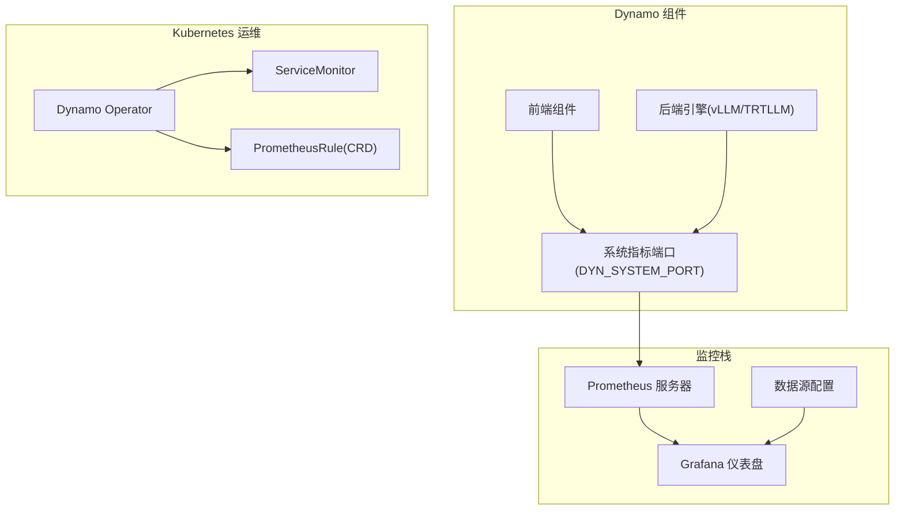
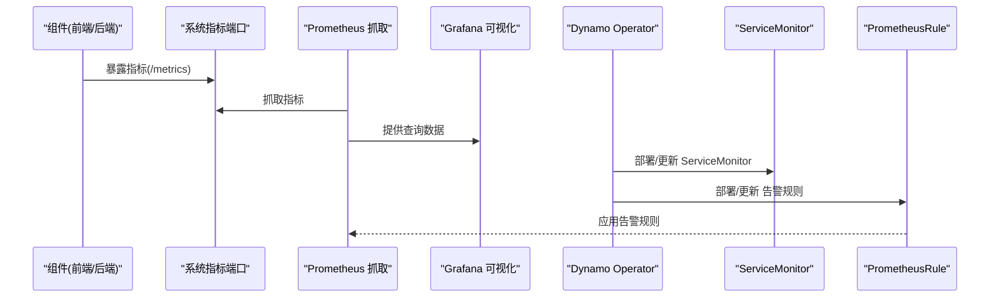
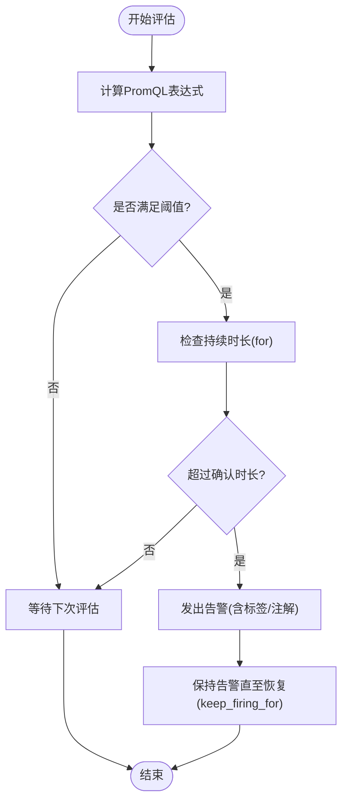
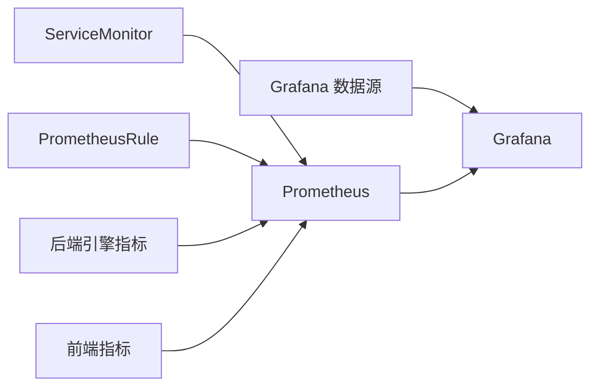

# 告警配置

<cite>
**本文引用的文件**
- [prometheus.yml](file://deploy/observability/prometheus.yml)
- [grafana-datasources.yml](file://deploy/observability/grafana-datasources.yml)
- [monitor.yaml](file://deploy/operator/config/prometheus/monitor.yaml)
- [prometheusrule.yaml](file://deploy/operator/internal/controller/testing/prometheus/prometheusrule.yaml)
- [prometheus-grafana.md](file://docs/observability/prometheus-grafana.md)
- [vllm 指南](file://docs/backends\vllm\prometheus.md)
- [trtllm 指南](file://docs/backends\trtllm\prometheus.md)
- [dynamo.json](file://deploy/observability/grafana_dashboards\dynamo.json)
- [kvbm.json](file://deploy/observability/grafana_dashboards\kvbm.json)
- [dcgm-metrics.json](file://deploy/observability/grafana_dashboards\dcgm-metrics.json)
- [grafana-dynamo-dashboard-configmap.yaml](file://deploy/observability/k8s\grafana-dynamo-dashboard-configmap.yaml)
- [github_alerts.py](file://docs\_extensions\github_alerts.py)
- [health_check.rs](file://lib/runtime\src\health_check.rs)
- [tracker.rs](file://lib/runtime\src\utils\tasks\tracker.rs)
- [main.py（故障注入）](file://tests/fault_tolerance/hardware/fault_injection_service/api_service/main.py)
</cite>

## 目录
1. [简介](#简介)
2. [项目结构](#项目结构)
3. [核心组件](#核心组件)
4. [架构总览](#架构总览)
5. [详细组件分析](#详细组件分析)
6. [依赖关系分析](#依赖关系分析)
7. [性能考量](#性能考量)
8. [故障排查指南](#故障排查指南)
9. [结论](#结论)
10. [附录](#附录)

## 简介
本指南面向Dynamo平台的告警配置与管理，系统性阐述Prometheus告警规则的设计原则与最佳实践，覆盖阈值设定、告警级别与静默规则；详解通知渠道配置（邮件、Slack、PagerDuty等）在当前仓库中的集成思路；说明去重与抑制机制以避免告警风暴；给出常见故障场景的告警策略（服务不可用、性能下降、资源耗尽）；并解释告警历史与趋势分析方法。

## 项目结构
Dynamo的可观测性由Prometheus采集、Grafana可视化、以及Operator层面的服务监控组成。关键位置如下：
- Prometheus配置：用于定义抓取目标、评估周期与数据源
- Grafana配置：数据源与仪表盘
- Operator监控：ServiceMonitor与PrometheusRule的CRD定义
- 文档与示例：后端引擎指标文档与可视化指南

图表来源
- [prometheus.yml](file://deploy/observability/prometheus.yml#L16-L63)
- [grafana-datasources.yml](file://deploy/observability/grafana-datasources.yml#L18-L24)
- [monitor.yaml](file://deploy/operator/config/prometheus/monitor.yaml#L16-L41)
- [prometheusrule.yaml](file://deploy/operator/internal/controller/testing/prometheus/prometheusrule.yaml#L59-L153)

章节来源
- [prometheus.yml](file://deploy/observability/prometheus.yml#L16-L63)
- [grafana-datasources.yml](file://deploy/observability/grafana-datasources.yml#L18-L24)
- [monitor.yaml](file://deploy/operator/config/prometheus/monitor.yaml#L16-L41)
- [prometheusrule.yaml](file://deploy/operator/internal/controller/testing/prometheus/prometheusrule.yaml#L59-L153)

## 核心组件
- Prometheus采集器：通过静态配置抓取前端、后端、GPU DCGM、etcd、NATS等目标
- Grafana数据源与仪表盘：统一从Prometheus获取指标并展示
- Operator监控：通过ServiceMonitor暴露控制器指标，通过PrometheusRule定义告警规则
- 后端引擎指标：vLLM与TRT-LLM指标经由Dynamo统一暴露，便于集中观测与告警

章节来源
- [prometheus.yml](file://deploy/observability/prometheus.yml#L20-L63)
- [grafana-datasources.yml](file://deploy/observability/grafana-datasources.yml#L18-L24)
- [monitor.yaml](file://deploy/operator/config/prometheus/monitor.yaml#L16-L41)
- [prometheus-grafana.md](file://docs/observability/prometheus-grafana.md#L78-L113)

## 架构总览
下图展示了Dynamo告警体系的关键交互：组件指标被Prometheus抓取，Grafana进行可视化；Operator负责服务与指标暴露；告警规则由PrometheusRule定义并通过Operator下发。

图表来源
- [prometheus.yml](file://deploy/observability/prometheus.yml#L20-L63)
- [monitor.yaml](file://deploy/operator/config/prometheus/monitor.yaml#L16-L41)
- [prometheusrule.yaml](file://deploy/operator/internal/controller/testing/prometheus/prometheusrule.yaml#L59-L153)

## 详细组件分析

### Prometheus 规则设计与最佳实践
- 规则组与表达式
  - 使用规则组分组管理告警与记录规则，确保可维护性与一致性
  - 表达式采用PromQL，结合rate、increase、histogram_quantile等函数进行性能与容量分析
- 触发条件与持续时间
  - 使用for字段定义“确认时长”，避免瞬时抖动导致误报
  - 结合keep_firing_for控制告警在条件恢复后的延续时长，便于观察恢复过程
- 标签与注解
  - labels用于标识告警级别、影响面与责任人
  - annotations用于附加说明、处置指引与参考链接
- 评估间隔与抓取间隔
  - 全局evaluation_interval与job级scrape_interval需匹配，避免过早或过晚触发

图表来源
- [prometheusrule.yaml](file://deploy/operator/internal/controller/testing/prometheus/prometheusrule.yaml#L109-L126)

章节来源
- [prometheusrule.yaml](file://deploy/operator/internal/controller/testing/prometheus/prometheusrule.yaml#L59-L153)

### 通知渠道配置（邮件、Slack、PagerDuty）
- 当前仓库未直接包含通知Webhook或集成配置文件
- 建议在PrometheusRule中通过annotations添加通知渠道信息（如Slack频道、PagerDuty集成URL），并在Alertmanager中配置路由与接收器
- 若使用GitHub Actions或CI流程，可通过扩展模块实现告警事件推送

章节来源
- [prometheusrule.yaml](file://deploy/operator/internal/controller/testing/prometheus/prometheusrule.yaml#L102-L108)
- [github_alerts.py](file://docs\_extensions\github_alerts.py#L243-L255)

### 去重与抑制机制
- 告警去重
  - 通过labels唯一标识同一类告警，避免重复发送
  - 在Alertmanager中设置group_by、group_wait、group_interval、repeat_interval，减少噪声
- 抑制机制
  - 对于根因告警（如服务不可用）可抑制其派生告警（如下游延迟升高）
  - 利用match_re与equal进行跨告警的抑制匹配

章节来源
- [prometheusrule.yaml](file://deploy/operator/internal/controller/testing/prometheus/prometheusrule.yaml#L127-L131)

### 常见故障场景的告警策略
- 服务不可用
  - 前端/后端存活探针失败或HTTP 5xx比率升高
  - 建议：短确认时长快速发现，配合抑制避免风暴
- 性能下降
  - TTFT/TPOT/请求时延分位数升高；吞吐量骤降
  - 建议：多维度阈值组合，区分模型与请求类型
- 资源耗尽
  - GPU利用率/显存占用/温度/功耗异常；队列积压
  - 建议：结合DCGM指标与引擎指标，设置分级阈值

章节来源
- [vllm 指南](file://docs/backends\vllm\prometheus.md#L86-L96)
- [trtllm 指南](file://docs/backends\trtllm\prometheus.md#L106-L114)
- [dynamo.json](file://deploy/observability/grafana_dashboards\dynamo.json#L591-L613)

### 告警历史与趋势分析
- Grafana仪表盘提供历史趋势与阈值线，便于定位异常区间
- 通过面板阈值与注解标注，辅助复盘与改进

章节来源
- [dynamo.json](file://deploy/observability/grafana_dashboards\dynamo.json#L70-L81)
- [kvbm.json](file://deploy/observability/grafana_dashboards\kvbm.json#L35-L60)
- [dcgm-metrics.json](file://deploy/observability/grafana_dashboards\dcgm-metrics.json#L26-L52)

### Prometheus 采集与指标暴露
- 采集配置
  - 定义多个job抓取前端、后端、DCGM、etcd、NATS等目标
  - 调整scrape_interval以平衡实时性与负载
- 指标暴露
  - 后端引擎指标通过Dynamo统一暴露，支持vLLM与TRT-LLM
  - 系统指标端口通过环境变量启用

章节来源
- [prometheus.yml](file://deploy/observability/prometheus.yml#L20-L63)
- [prometheus-grafana.md](file://docs/observability/prometheus-grafana.md#L20-L26)
- [vllm 指南](file://docs/backends\vllm\prometheus.md#L20-L26)
- [trtllm 指南](file://docs/backends\trtllm\prometheus.md#L20-L25)

### Grafana 数据源与仪表盘
- 数据源
  - Grafana通过Prometheus数据源查询指标
- 仪表盘
  - 提供Dynamo、KVBM、DCGM等仪表盘，展示请求速率、时延、GPU利用率等关键指标

章节来源
- [grafana-datasources.yml](file://deploy/observability/grafana-datasources.yml#L18-L24)
- [grafana-dynamo-dashboard-configmap.yaml](file://deploy/observability/k8s\grafana-dynamo-dashboard-configmap.yaml#L11-L54)
- [dynamo.json](file://deploy/observability/grafana_dashboards\dynamo.json#L1-L100)

### Operator 层面的监控与健康检查
- ServiceMonitor
  - 通过ServiceMonitor暴露控制器指标端点，便于Prometheus抓取
- 健康检查
  - 运行时健康检查任务对端点进行监控，支持通道式发现与通知

章节来源
- [monitor.yaml](file://deploy/operator/config/prometheus/monitor.yaml#L16-L41)
- [health_check.rs](file://lib/runtime\src\health_check.rs#L116-L141)

### 运行时告警能力（扩展建议）
- 当前代码中存在“告警策略”注释，表明未来可扩展为基于错误模式的告警通知
- 建议通过Webhook方式对接邮件、Slack、PagerDuty等渠道，并加入限流与聚合策略

章节来源
- [tracker.rs](file://lib/runtime\src\utils\tasks\tracker.rs#L1027-L1034)

## 依赖关系分析
- Prometheus依赖于ServiceMonitor暴露的端点与数据源配置
- Grafana依赖Prometheus数据源与预置仪表盘
- 告警规则依赖PrometheusRule的CRD定义
- 后端引擎指标依赖Dynamo统一暴露

图表来源
- [monitor.yaml](file://deploy/operator/config/prometheus/monitor.yaml#L16-L41)
- [prometheusrule.yaml](file://deploy/operator/internal/controller/testing/prometheus/prometheusrule.yaml#L59-L153)
- [grafana-datasources.yml](file://deploy/observability/grafana-datasources.yml#L18-L24)

章节来源
- [monitor.yaml](file://deploy/operator/config/prometheus/monitor.yaml#L16-L41)
- [prometheusrule.yaml](file://deploy/operator/internal/controller/testing/prometheus/prometheusrule.yaml#L59-L153)
- [grafana-datasources.yml](file://deploy/observability/grafana-datasources.yml#L18-L24)

## 性能考量
- 抓取与评估间隔
  - 降低scrape_interval可提升实时性，但增加Prometheus与目标端压力
  - evaluation_interval应与业务SLA匹配，避免过度频繁评估
- 指标基数与标签
  - 控制高基数标签数量，避免内存与查询开销激增
- 采样与聚合
  - 使用histogram_quantile与rate等函数进行高效聚合，减少原始样本存储

## 故障排查指南
- 服务验证
  - 确认监控组件（Prometheus、Grafana、dcgm-exporter、monitoring-agent）已部署并运行
- 目标连通性
  - 检查Prometheus Targets页面，确认抓取目标可达
- 日志与状态
  - 查看Prometheus与Grafana日志，定位配置或网络问题
- 告警验证
  - 通过模拟故障（如注入延迟或错误）验证告警链路与通知渠道

章节来源
- [prometheus-grafana.md](file://docs/observability/prometheus-grafana.md#L94-L106)
- [main.py（故障注入）](file://tests/fault_tolerance/hardware/fault_injection_service/api_service/main.py#L1182-L1194)

## 结论
Dynamo的告警体系以Prometheus为核心，结合Grafana可视化与Operator监控，形成完整的可观测闭环。通过合理的规则设计、通知渠道配置与抑制/去重策略，可有效避免告警风暴并提升故障响应效率。建议在现有基础上完善通知集成与历史趋势分析，持续优化阈值与评估策略以适配生产环境。

## 附录
- 快速启动与访问
  - Prometheus与Grafana界面地址与默认凭据
- 环境变量
  - DYN_SYSTEM_PORT用于启用系统指标端口

章节来源
- [prometheus-grafana.md](file://docs/observability/prometheus-grafana.md#L62-L74)
- [prometheus-grafana.md](file://docs/observability/prometheus-grafana.md#L20-L26)