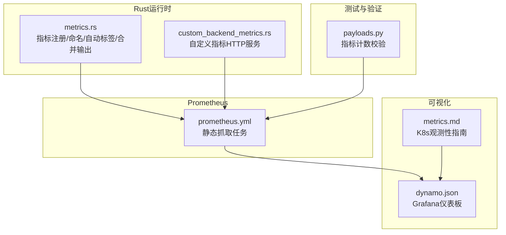
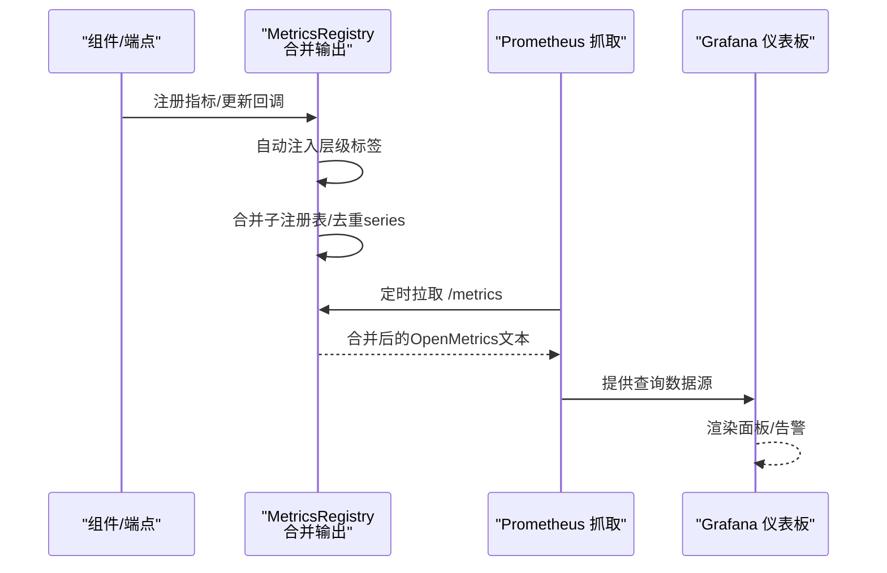
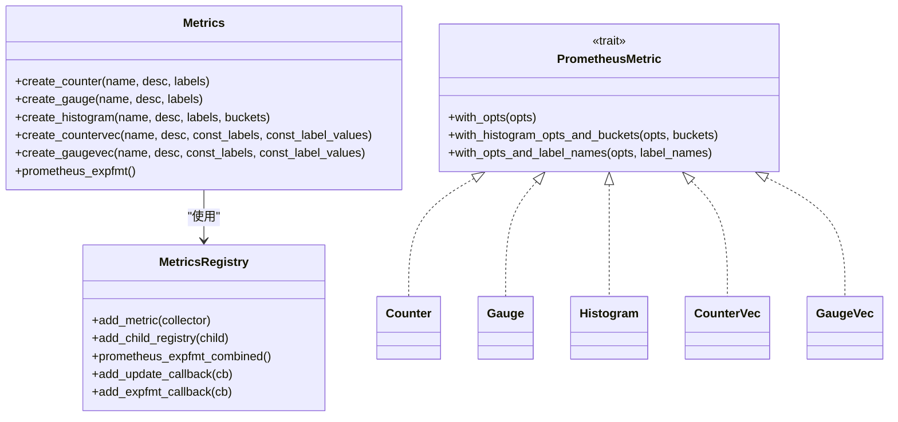
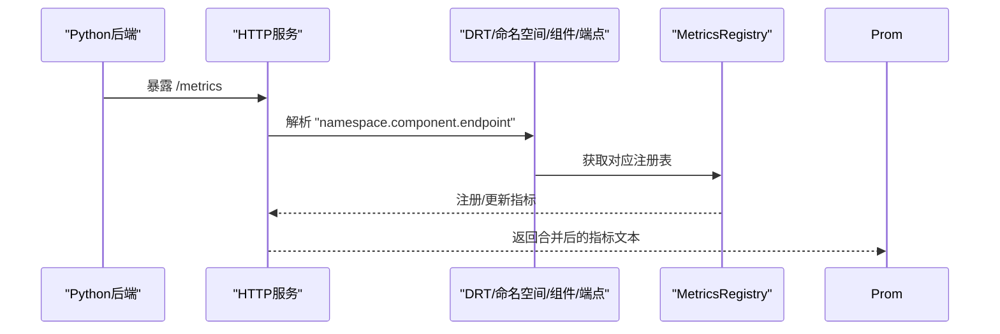
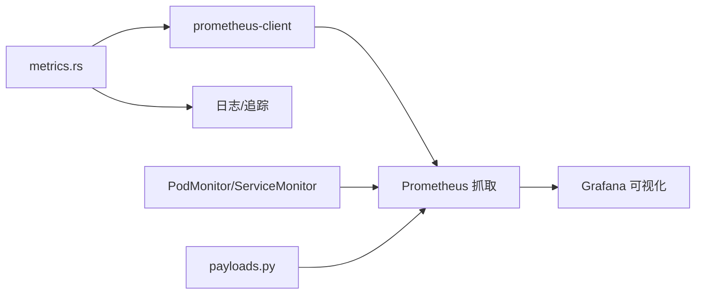

# 指标监控

<cite>
**本文引用的文件**
- [metrics.rs](file://lib/runtime/src/metrics.rs)
- [prometheus.yml](file://deploy/observability/prometheus.yml)
- [dynamo.json](file://deploy/observability/grafana_dashboards/dynamo.json)
- [metrics.md](file://docs/kubernetes/observability/metrics.md)
- [custom_backend_metrics.rs](file://lib/llm/src/http/service/custom_backend_metrics.rs)
- [payloads.py](file://tests/utils/payloads.py)
</cite>

## 目录
1. [简介](#简介)
2. [项目结构](#项目结构)
3. [核心组件](#核心组件)
4. [架构总览](#架构总览)
5. [详细组件分析](#详细组件分析)
6. [依赖关系分析](#依赖关系分析)
7. [性能考量](#性能考量)
8. [故障排查指南](#故障排查指南)
9. [结论](#结论)
10. [附录](#附录)

## 简介
本文件面向Dynamo指标监控系统，系统性阐述Prometheus指标采集架构与实现，覆盖指标定义、标签设计、时间序列管理、关键业务指标（吞吐量、延迟分布、错误率、资源利用率）、自定义指标在Rust与Python端的注册与上报机制，并提供查询与可视化最佳实践及数据存储与保留策略建议。

## 项目结构
Dynamo的指标监控由以下部分组成：
- Rust运行时指标基础设施：统一的指标注册与命名、自动标签注入、层级合并输出。
- Prometheus配置：静态目标与抓取间隔、外部导出器（NATS、etcd、DCGM）。
- Grafana仪表板：前端请求、延迟、GPU/节点资源等面板。
- Kubernetes观测性指南：PodMonitor/ServiceMonitor、Operator指标、验证步骤。
- 自定义后端指标：通过HTTP服务暴露自定义指标，按命名空间/组件/端点解析与定位。

图表来源
- [metrics.rs](file://lib/runtime/src/metrics.rs#L1-L120)
- [prometheus.yml](file://deploy/observability/prometheus.yml#L20-L63)
- [dynamo.json](file://deploy/observability/grafana_dashboards/dynamo.json#L1-L120)
- [metrics.md](file://docs/kubernetes/observability/metrics.md#L107-L181)
- [custom_backend_metrics.rs](file://lib/llm/src/http/service/custom_backend_metrics.rs#L122-L142)
- [payloads.py](file://tests/utils/payloads.py#L629-L653)

章节来源
- [metrics.rs](file://lib/runtime/src/metrics.rs#L1-L120)
- [prometheus.yml](file://deploy/observability/prometheus.yml#L20-L63)
- [dynamo.json](file://deploy/observability/grafana_dashboards/dynamo.json#L1-L120)
- [metrics.md](file://docs/kubernetes/observability/metrics.md#L107-L181)
- [custom_backend_metrics.rs](file://lib/llm/src/http/service/custom_backend_metrics.rs#L122-L142)
- [payloads.py](file://tests/utils/payloads.py#L629-L653)

## 核心组件
- 指标注册与命名
  - 统一的指标工厂函数，支持Counter/Gauge/Histogram及其向量变体；自动为每个层级注入命名空间、组件、端点标签；支持常量标签与动态标签。
- 指标合并输出
  - 多级注册表树形合并，去重series，合并HELP/TYPE，支持扩展文本回调拼接到输出末尾。
- Prometheus抓取配置
  - 静态目标：NATS、etcd、DCGM、Dynamo前端、后端、KVBM等；可按需启用/调整抓取间隔。
- 可视化与查询
  - Grafana仪表板包含前端请求速率、首Token耗时、令牌间延迟、请求时延、输入/输出序列长度、GPU利用率、节点CPU/内存等。
- 自定义指标上报
  - 后端可通过HTTP服务暴露自定义指标，按“命名空间.组件.端点”格式解析定位到对应层级注册表。

章节来源
- [metrics.rs](file://lib/runtime/src/metrics.rs#L201-L376)
- [metrics.rs](file://lib/runtime/src/metrics.rs#L605-L906)
- [prometheus.yml](file://deploy/observability/prometheus.yml#L20-L63)
- [dynamo.json](file://deploy/observability/grafana_dashboards/dynamo.json#L1-L200)
- [custom_backend_metrics.rs](file://lib/llm/src/http/service/custom_backend_metrics.rs#L122-L142)

## 架构总览
下图展示从组件到注册表、再到Prometheus抓取与Grafana可视化的完整链路。

图表来源
- [metrics.rs](file://lib/runtime/src/metrics.rs#L605-L906)
- [prometheus.yml](file://deploy/observability/prometheus.yml#L20-L63)
- [dynamo.json](file://deploy/observability/grafana_dashboards/dynamo.json#L1-L200)

## 详细组件分析

### 指标注册与命名（Rust）
- 自动标签
  - 在USE_AUTO_LABELS开启时，自动为指标注入dynamo_namespace、dynamo_component、dynamo_endpoint标签，值来自层级路径并进行安全化处理。
- 指标类型与参数
  - 支持Counter/CounterVec、Gauge/GaugeVec、Histogram、IntCounter/IntCounterVec、IntGauge/IntGaugeVec。
  - CounterVec/GaugeVec需要显式提供常量标签名列表；Histogram支持自定义桶；普通Counter/Gauge不接受桶或常量标签。
- 注册与合并
  - 指标仅注册到本地层级注册表，避免跨层级冲突；合并输出时递归遍历子注册表，去重series，合并HELP/TYPE。
- 回调机制
  - 更新回调：每次抓取前执行，用于刷新动态指标状态。
  - 扩展文本回调：追加任意Prometheus文本到输出末尾，便于后端补充指标。

图表来源
- [metrics.rs](file://lib/runtime/src/metrics.rs#L62-L196)
- [metrics.rs](file://lib/runtime/src/metrics.rs#L384-L539)
- [metrics.rs](file://lib/runtime/src/metrics.rs#L605-L906)

章节来源
- [metrics.rs](file://lib/runtime/src/metrics.rs#L37-L39)
- [metrics.rs](file://lib/runtime/src/metrics.rs#L201-L376)
- [metrics.rs](file://lib/runtime/src/metrics.rs#L605-L906)

### Prometheus抓取配置
- 静态目标
  - nats-prometheus-exporter、etcd-server、dcgm-exporter、dynamo-frontend、dynamo-backend、kvbm-metrics等。
- 抓取间隔
  - 全局10s，部分组件（如NATS/etcd/DCGM）更短以提升可观测性。
- 动态后端
  - 通过环境变量DYN_SYSTEM_PORT启动后端，Prometheus按静态目标抓取其/system/metrics端点。

章节来源
- [prometheus.yml](file://deploy/observability/prometheus.yml#L16-L63)

### Grafana仪表板与查询
- 前端指标
  - 请求总量、首Token耗时、令牌间延迟、请求时延、输入/输出序列长度。
- 资源指标
  - GPU利用率（DCGM）、节点CPU/负载、容器CPU/内存。
- 查询示例
  - rate(dynamo_frontend_requests_total[30s])、1000*(sum)/count等聚合表达式。
- 面板说明
  - 每个面板均标注了对应指标名称与单位，便于快速定位。

章节来源
- [dynamo.json](file://deploy/observability/grafana_dashboards/dynamo.json#L1-L200)
- [metrics.md](file://docs/kubernetes/observability/metrics.md#L145-L175)

### 自定义指标上报（Rust/Python）
- Rust端
  - 通过Metrics::create_*系列方法在指定层级注册指标；利用扩展文本回调追加后端自定义指标。
- Python端
  - 通过HTTP服务暴露自定义指标，遵循“命名空间.组件.端点”的格式解析，定位到对应DRT/命名空间/组件/端点，再注册到相应MetricsRegistry。

图表来源
- [custom_backend_metrics.rs](file://lib/llm/src/http/service/custom_backend_metrics.rs#L122-L142)
- [metrics.rs](file://lib/runtime/src/metrics.rs#L605-L906)

章节来源
- [custom_backend_metrics.rs](file://lib/llm/src/http/service/custom_backend_metrics.rs#L122-L142)
- [metrics.rs](file://lib/runtime/src/metrics.rs#L605-L906)

### 关键业务指标定义与标签设计
- 请求吞吐量
  - 指标：dynamo_frontend_requests_total（计数器）
  - 标签：request_type、status、model等（依据实际实现）
  - 查询：rate(...[窗口])，区分不同请求类型与状态
- 延迟分布
  - 指标：dynamo_frontend_time_to_first_token_seconds、inter_token_latency_seconds、request_duration_seconds（直方图）
  - 标签：model、endpoint等
  - 查询：histogram_quantile(0.95, sum(rate(..._bucket[5m]))) 或 avg by (model)(...)
- 错误率
  - 指标：dynamo_frontend_requests_total（按status分组）
  - 查询：sum(rate(status!="200"[5m])) / sum(rate(...[5m]))
- 资源利用率
  - GPU：DCGM_FI_DEV_GPU_UTIL（百分比）、DCGM_FI_DEV_POWER_USAGE（瓦特）
  - 节点：node_cpu_seconds_total、node_memory_MemAvailable_bytes等（通过node-exporter）

章节来源
- [dynamo.json](file://deploy/observability/grafana_dashboards/dynamo.json#L1-L200)
- [metrics.md](file://docs/kubernetes/observability/metrics.md#L145-L175)

### 时间序列管理与命名规范
- 命名前缀
  - 统一以dynamo_component_前缀，确保与平台其他组件隔离。
- 标签注入
  - 自动注入dynamo_namespace、dynamo_component、dynamo_endpoint，避免与K8s或其他系统标签冲突。
- 合并与去重
  - 合并HELP/TYPE一致的指标族；series完全相同则去重并告警；允许同名但标签不同的series存在。

章节来源
- [metrics.rs](file://lib/runtime/src/metrics.rs#L222-L275)
- [metrics.rs](file://lib/runtime/src/metrics.rs#L724-L830)

## 依赖关系分析
- 运行时依赖
  - prometheus-client库用于指标类型与编码；内部通过MetricsRegistry维护注册表树。
- 外部集成
  - Prometheus静态抓取；Grafana作为可视化界面；K8s通过PodMonitor/ServiceMonitor自动发现。
- 测试验证
  - 通过payloads.py对后端指标数量进行最小阈值校验，确保指标覆盖率。

图表来源
- [metrics.rs](file://lib/runtime/src/metrics.rs#L1-L120)
- [prometheus.yml](file://deploy/observability/prometheus.yml#L20-L63)
- [payloads.py](file://tests/utils/payloads.py#L629-L653)

章节来源
- [metrics.rs](file://lib/runtime/src/metrics.rs#L1-L120)
- [prometheus.yml](file://deploy/observability/prometheus.yml#L20-L63)
- [payloads.py](file://tests/utils/payloads.py#L629-L653)

## 性能考量
- 抓取频率与开销
  - 对高频指标（NATS/etcd/DCGM）采用较短抓取间隔，平衡实时性与Prometheus负载。
- 指标数量与标签基数
  - 控制动态标签基数，避免series爆炸；优先使用常量标签与有限枚举值。
- 合并输出成本
  - 合并多注册表、去重series会带来一定CPU开销；建议在高并发场景下评估合并规模。
- Histogram桶设置
  - 合理设置桶边界，兼顾精度与内存占用；必要时使用自定义桶。

## 故障排查指南
- 指标未出现
  - 检查Prometheus静态目标是否正确；确认后端已暴露/system/metrics端点。
- 标签缺失
  - 确认USE_AUTO_LABELS开启且层级路径有效；检查标签是否被自动标签覆盖。
- series重复告警
  - 合并时若出现完全重复series，Prometheus会丢弃后续样本并记录告警；检查注册表树与标签组合。
- 自定义指标未生效
  - 确认HTTP服务按“命名空间.组件.端点”格式解析成功；检查对应MetricsRegistry是否已注册。

章节来源
- [metrics.rs](file://lib/runtime/src/metrics.rs#L724-L830)
- [custom_backend_metrics.rs](file://lib/llm/src/http/service/custom_backend_metrics.rs#L122-L142)

## 结论
Dynamo通过统一的Rust指标基础设施实现了清晰的命名、自动标签与层级合并输出；结合Prometheus静态抓取与Grafana仪表板，提供了完善的可观测性闭环。自定义指标既可在Rust侧通过回调扩展，也可在Python后端通过HTTP服务暴露。建议在生产中合理控制标签基数、优化抓取频率与桶设置，并通过测试用例持续验证指标覆盖率。

## 附录
- Kubernetes观测性指南要点
  - 使用kube-prometheus-stack部署Prometheus/Grafana；通过PodMonitor自动发现Dynamo组件；Operator自身也提供额外指标。
- 常用查询参考
  - rate(dynamo_frontend_requests_total[30s])、avg by (model)(...)、histogram_quantile(0.95,...)等。

章节来源
- [metrics.md](file://docs/kubernetes/observability/metrics.md#L107-L181)
- [dynamo.json](file://deploy/observability/grafana_dashboards/dynamo.json#L1-L200)