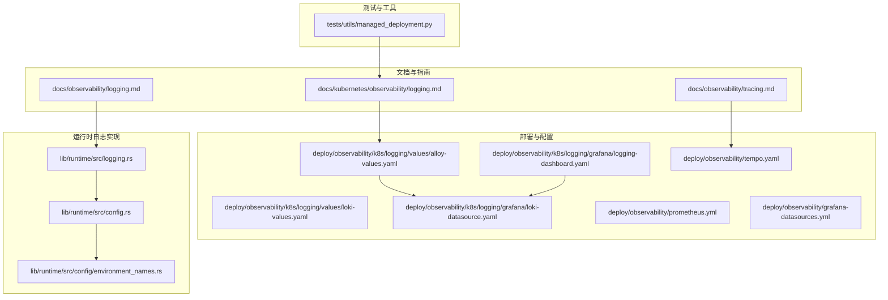
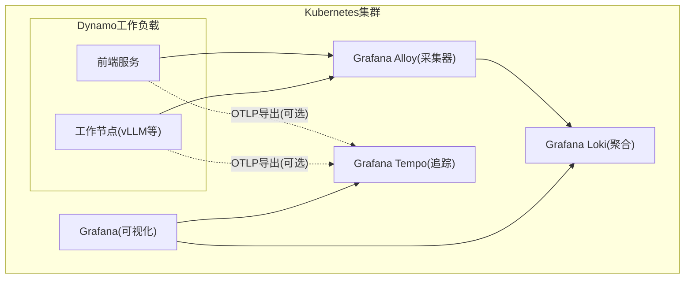
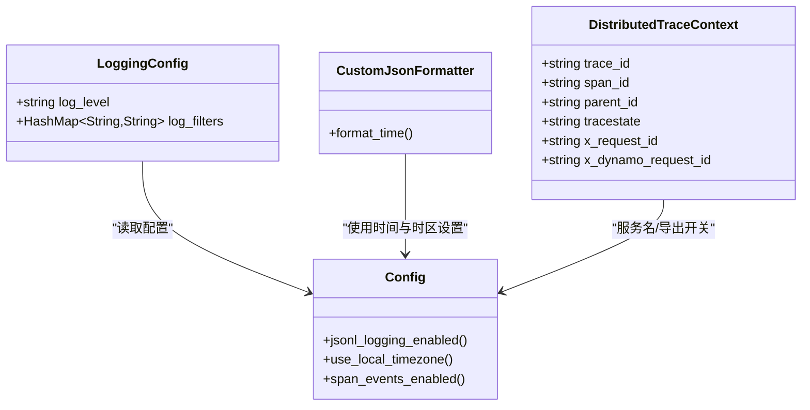
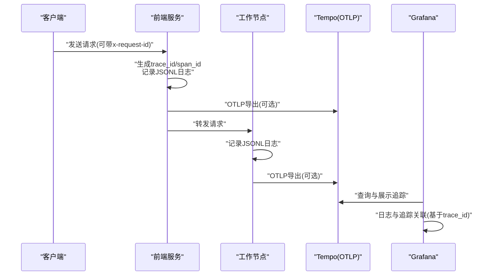
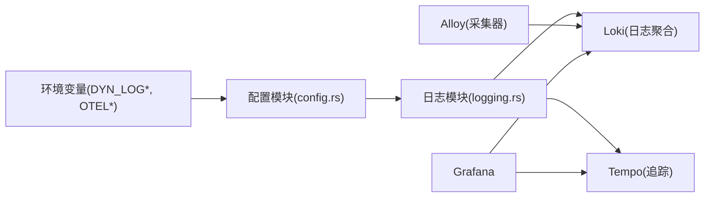

# 日志管理

<cite>
**本文引用的文件**
- [docs/kubernetes/observability/logging.md](file://docs/kubernetes/observability/logging.md)
- [docs/observability/logging.md](file://docs/observability/logging.md)
- [docs/observability/tracing.md](file://docs/observability/tracing.md)
- [deploy/observability/k8s/logging/values/loki-values.yaml](file://deploy/observability/k8s/logging/values/loki-values.yaml)
- [deploy/observability/k8s/logging/values/alloy-values.yaml](file://deploy/observability/k8s/logging/values/alloy-values.yaml)
- [deploy/observability/k8s/logging/grafana/logging-dashboard.yaml](file://deploy/observability/k8s/logging/grafana/logging-dashboard.yaml)
- [deploy/observability/k8s/logging/grafana/loki-datasource.yaml](file://deploy/observability/k8s/logging/grafana/loki-datasource.yaml)
- [deploy/observability/tempo.yaml](file://deploy/observability/tempo.yaml)
- [deploy/observability/prometheus.yml](file://deploy/observability/prometheus.yml)
- [deploy/observability/grafana-datasources.yml](file://deploy/observability/grafana-datasources.yml)
- [lib/runtime/src/logging.rs](file://lib/runtime/src/logging.rs)
- [lib/runtime/src/config.rs](file://lib/runtime/src/config.rs)
- [lib/runtime/src/config/environment_names.rs](file://lib/runtime/src/config/environment_names.rs)
- [tests/utils/managed_deployment.py](file://tests/utils/managed_deployment.py)
</cite>

## 目录
1. [简介](#简介)
2. [项目结构](#项目结构)
3. [核心组件](#核心组件)
4. [架构总览](#架构总览)
5. [组件详解](#组件详解)
6. [依赖关系分析](#依赖关系分析)
7. [性能与成本优化](#性能与成本优化)
8. [故障排查指南](#故障排查指南)
9. [结论](#结论)
10. [附录](#附录)

## 简介
本指南面向Dynamo日志管理与可观测性，围绕ELK/EFK风格的“日志聚合+指标+链路追踪”体系进行系统化说明。当前仓库采用的生产级参考方案为：Grafana Loki（日志聚合）、Grafana Alloy（日志采集器）、Grafana（可视化）以及Tempo（链路追踪）。同时，Dynamo运行时内置结构化日志能力（JSONL），支持trace_id/span_id字段，并可选导出到OTLP后端（如Tempo）。

本指南覆盖以下主题：
- ELK/EFK集成架构与配置要点（Loki、Alloy、Grafana）
- 日志收集策略（容器日志、应用日志、系统日志）
- 日志格式标准化与结构化日志最佳实践
- 日志检索与分析技巧（查询语法与过滤条件）
- 分布式追踪集成（OTel、Tempo、Jaeger兼容性说明）
- 日志存储优化与成本控制策略

## 项目结构
与日志管理相关的关键目录与文件：
- 文档与指南
  - docs/kubernetes/observability/logging.md：Kubernetes环境下的日志聚合指南
  - docs/observability/logging.md：Dynamo日志模块与环境变量说明
  - docs/observability/tracing.md：分布式追踪与OTLP导出
- 部署与配置
  - deploy/observability/k8s/logging/values/*.yaml：Loki与Alloy在Kubernetes中的Helm值文件
  - deploy/observability/k8s/logging/grafana/*.yaml：Loki数据源与Dynamo日志仪表盘
  - deploy/observability/tempo.yaml：Tempo本地配置示例
  - deploy/observability/prometheus.yml、grafana-datasources.yml：Prometheus与Grafana数据源
- 运行时日志实现
  - lib/runtime/src/logging.rs：日志初始化、格式化、OTLP导出、结构化字段注入
  - lib/runtime/src/config.rs、environment_names.rs：环境变量解析与常量定义
- 测试与工具
  - tests/utils/managed_deployment.py：采集Pod日志与指标的辅助脚本

**图表来源**
- [docs/observability/logging.md](file://docs/observability/logging.md#L1-L263)
- [docs/kubernetes/observability/logging.md](file://docs/kubernetes/observability/logging.md#L1-L155)
- [docs/observability/tracing.md](file://docs/observability/tracing.md#L33-L157)
- [deploy/observability/k8s/logging/values/loki-values.yaml](file://deploy/observability/k8s/logging/values/loki-values.yaml#L1-L80)
- [deploy/observability/k8s/logging/values/alloy-values.yaml](file://deploy/observability/k8s/logging/values/alloy-values.yaml#L1-L60)
- [deploy/observability/k8s/logging/grafana/logging-dashboard.yaml](file://deploy/observability/k8s/logging/grafana/logging-dashboard.yaml#L1-L225)
- [deploy/observability/k8s/logging/grafana/loki-datasource.yaml](file://deploy/observability/k8s/logging/grafana/loki-datasource.yaml#L1-L19)
- [deploy/observability/tempo.yaml](file://deploy/observability/tempo.yaml#L1-L37)
- [deploy/observability/prometheus.yml](file://deploy/observability/prometheus.yml#L1-L63)
- [deploy/observability/grafana-datasources.yml](file://deploy/observability/grafana-datasources.yml#L1-L24)
- [lib/runtime/src/logging.rs](file://lib/runtime/src/logging.rs#L1-L200)
- [lib/runtime/src/config.rs](file://lib/runtime/src/config.rs#L458-L483)
- [lib/runtime/src/config/environment_names.rs](file://lib/runtime/src/config/environment_names.rs#L32-L63)
- [tests/utils/managed_deployment.py](file://tests/utils/managed_deployment.py#L821-L887)

**章节来源**
- [docs/observability/logging.md](file://docs/observability/logging.md#L1-L263)
- [docs/kubernetes/observability/logging.md](file://docs/kubernetes/observability/logging.md#L1-L155)
- [docs/observability/tracing.md](file://docs/observability/tracing.md#L33-L157)
- [deploy/observability/k8s/logging/values/loki-values.yaml](file://deploy/observability/k8s/logging/values/loki-values.yaml#L1-L80)
- [deploy/observability/k8s/logging/values/alloy-values.yaml](file://deploy/observability/k8s/logging/values/alloy-values.yaml#L1-L60)
- [deploy/observability/k8s/logging/grafana/logging-dashboard.yaml](file://deploy/observability/k8s/logging/grafana/logging-dashboard.yaml#L1-L225)
- [deploy/observability/k8s/logging/grafana/loki-datasource.yaml](file://deploy/observability/k8s/logging/grafana/loki-datasource.yaml#L1-L19)
- [deploy/observability/tempo.yaml](file://deploy/observability/tempo.yaml#L1-L37)
- [deploy/observability/prometheus.yml](file://deploy/observability/prometheus.yml#L1-L63)
- [deploy/observability/grafana-datasources.yml](file://deploy/observability/grafana-datasources.yml#L1-L24)
- [lib/runtime/src/logging.rs](file://lib/runtime/src/logging.rs#L1-L200)
- [lib/runtime/src/config.rs](file://lib/runtime/src/config.rs#L458-L483)
- [lib/runtime/src/config/environment_names.rs](file://lib/runtime/src/config/environment_names.rs#L32-L63)
- [tests/utils/managed_deployment.py](file://tests/utils/managed_deployment.py#L821-L887)

## 核心组件
- Loki（日志聚合）
  - 单体模式部署，带MinIO对象存储；支持结构化元数据与标签映射
- Grafana Alloy（日志采集器）
  - 通过kubernetesApi方式采集Pod日志，支持标签映射与结构化元数据
- Grafana（可视化）
  - 提供Loki数据源与Dynamo日志仪表盘，支持按命名空间、组件类型、DynamoGraphDeployment过滤
- Tempo（链路追踪）
  - 支持OTLP gRPC/HTTP接收，可作为Dynamo的Tracing后端
- Dynamo运行时日志模块
  - 支持可读文本与JSONL两种输出；自动注入trace_id/span_id；可选导出OTLP

**章节来源**
- [docs/kubernetes/observability/logging.md](file://docs/kubernetes/observability/logging.md#L8-L15)
- [docs/observability/logging.md](file://docs/observability/logging.md#L8-L27)
- [docs/observability/tracing.md](file://docs/observability/tracing.md#L33-L157)
- [deploy/observability/k8s/logging/values/loki-values.yaml](file://deploy/observability/k8s/logging/values/loki-values.yaml#L1-L80)
- [deploy/observability/k8s/logging/values/alloy-values.yaml](file://deploy/observability/k8s/logging/values/alloy-values.yaml#L1-L60)
- [deploy/observability/k8s/logging/grafana/logging-dashboard.yaml](file://deploy/observability/k8s/logging/grafana/logging-dashboard.yaml#L61-L76)
- [deploy/observability/tempo.yaml](file://deploy/observability/tempo.yaml#L1-L37)
- [lib/runtime/src/logging.rs](file://lib/runtime/src/logging.rs#L1-L200)

## 架构总览
下图展示Dynamo在Kubernetes中的日志与追踪架构：Alloy从Pod采集日志并推送到Loki；Grafana通过Loki数据源查看日志；Dynamo组件在启用JSONL与OTLP导出时，既可在日志中看到trace_id/span_id，也可将链路信息导出至Tempo。

**图表来源**
- [docs/kubernetes/observability/logging.md](file://docs/kubernetes/observability/logging.md#L1-L155)
- [docs/observability/logging.md](file://docs/observability/logging.md#L1-L263)
- [docs/observability/tracing.md](file://docs/observability/tracing.md#L33-L157)
- [deploy/observability/k8s/logging/values/alloy-values.yaml](file://deploy/observability/k8s/logging/values/alloy-values.yaml#L1-L60)
- [deploy/observability/k8s/logging/grafana/logging-dashboard.yaml](file://deploy/observability/k8s/logging/grafana/logging-dashboard.yaml#L1-L225)
- [deploy/observability/tempo.yaml](file://deploy/observability/tempo.yaml#L1-L37)

## 组件详解

### Loki配置与优化
- 单体模式部署，适合开发/测试；资源限制与内存上限建议合理设置
- 启用结构化元数据与标签映射，便于在Grafana中过滤
- 使用MinIO作为对象存储，便于快速搭建

关键点
- 结构化元数据与标签映射：用于将Pod标签转换为Loki标签，便于过滤
- 资源配额：根据集群规模与日志量调整CPU/内存
- 存储路径：单体模式下默认写入本地磁盘或MinIO

**章节来源**
- [deploy/observability/k8s/logging/values/loki-values.yaml](file://deploy/observability/k8s/logging/values/loki-values.yaml#L1-L80)

### Alloy采集器配置
- 采集方式：kubernetesApi（更友好于开发/测试）
- 标签映射：将Pod标签映射为Loki标签，如组件类型、DynamoGraphDeployment名称等
- 结构化元数据：将Pod名称等映射为结构化字段
- 命名空间：限定采集范围，避免跨命名空间污染

**章节来源**
- [deploy/observability/k8s/logging/values/alloy-values.yaml](file://deploy/observability/k8s/logging/values/alloy-values.yaml#L1-L60)

### Grafana日志仪表盘与数据源
- 数据源：Loki数据源指向loki-gateway服务
- 仪表盘：Dynamo日志仪表盘支持按命名空间、组件类型、DynamoGraphDeployment、Trace ID与关键词过滤
- 查询表达式：基于标签过滤与正则匹配

**章节来源**
- [deploy/observability/k8s/logging/grafana/loki-datasource.yaml](file://deploy/observability/k8s/logging/grafana/loki-datasource.yaml#L1-L19)
- [deploy/observability/k8s/logging/grafana/logging-dashboard.yaml](file://deploy/observability/k8s/logging/grafana/logging-dashboard.yaml#L61-L76)

### Dynamo运行时日志模块
- 输出格式：可读文本或JSONL；JSONL启用后自动注入trace_id/span_id
- 时间戳：支持UTC或本地时区
- 过滤级别：通过DYN_LOG环境变量按模块设置
- OTLP导出：可选开启，将链路信息导出至OTLP后端（如Tempo）

**图表来源**
- [lib/runtime/src/logging.rs](file://lib/runtime/src/logging.rs#L106-L133)
- [lib/runtime/src/logging.rs](file://lib/runtime/src/logging.rs#L158-L176)
- [lib/runtime/src/logging.rs](file://lib/runtime/src/logging.rs#L1101-L1111)
- [lib/runtime/src/config.rs](file://lib/runtime/src/config.rs#L458-L483)
- [lib/runtime/src/config/environment_names.rs](file://lib/runtime/src/config/environment_names.rs#L32-L63)

**章节来源**
- [lib/runtime/src/logging.rs](file://lib/runtime/src/logging.rs#L1-L200)
- [lib/runtime/src/logging.rs](file://lib/runtime/src/logging.rs#L907-L920)
- [lib/runtime/src/logging.rs](file://lib/runtime/src/logging.rs#L1361-L1392)
- [lib/runtime/src/config.rs](file://lib/runtime/src/config.rs#L458-L483)
- [lib/runtime/src/config/environment_names.rs](file://lib/runtime/src/config/environment_names.rs#L32-L63)

### 分布式追踪与OTLP导出
- 启用方式：设置OTEL_EXPORT_ENABLED与OTEL_EXPORTER_OTLP_TRACES_ENDPOINT
- Tempo集成：OTLP gRPC/HTTP端点可直接对接Tempo
- 日志内关联：JSONL日志包含trace_id/span_id，便于与追踪关联

**图表来源**
- [docs/observability/tracing.md](file://docs/observability/tracing.md#L33-L157)
- [docs/observability/logging.md](file://docs/observability/logging.md#L97-L118)
- [lib/runtime/src/logging.rs](file://lib/runtime/src/logging.rs#L924-L935)

**章节来源**
- [docs/observability/tracing.md](file://docs/observability/tracing.md#L33-L157)
- [docs/observability/logging.md](file://docs/observability/logging.md#L97-L118)
- [deploy/observability/tempo.yaml](file://deploy/observability/tempo.yaml#L1-L37)

### 日志收集策略
- 容器日志
  - 通过Alloy采集Pod标准输出，映射组件类型与DynamoGraphDeployment名称等标签
- 应用日志
  - Dynamo组件启用JSONL后，日志包含trace_id/span_id，便于追踪关联
- 系统日志
  - 可通过Alloy采集节点日志（如需）或结合其他系统监控方案

**章节来源**
- [docs/kubernetes/observability/logging.md](file://docs/kubernetes/observability/logging.md#L79-L113)
- [docs/observability/logging.md](file://docs/observability/logging.md#L105-L118)
- [deploy/observability/k8s/logging/values/alloy-values.yaml](file://deploy/observability/k8s/logging/values/alloy-values.yaml#L11-L38)

### 日志格式标准化与结构化日志最佳实践
- JSONL格式
  - 必须启用DYN_LOGGING_JSONL；日志包含time、level、target、message、file、line等基础字段
  - 自动注入trace_id、span_id、span_name、parent_id等追踪字段
- 时间与时区
  - 默认UTC；可通过DYN_LOG_USE_LOCAL_TZ切换本地时区
- 过滤与级别
  - DYN_LOG支持按模块设置级别；默认info
- 请求ID
  - 支持x-request-id头，贯穿整个请求生命周期的日志与追踪

**章节来源**
- [docs/observability/logging.md](file://docs/observability/logging.md#L15-L27)
- [docs/observability/logging.md](file://docs/observability/logging.md#L78-L95)
- [docs/observability/logging.md](file://docs/observability/logging.md#L220-L243)
- [lib/runtime/src/logging.rs](file://lib/runtime/src/logging.rs#L1361-L1392)

### 日志检索与分析技巧
- Grafana Loki查询
  - 使用标签过滤：namespace、nvidia_com_dynamo_component_type、nvidia_com_dynamo_graph_deployment_name
  - 关键词过滤：支持“|= ”语法
  - Trace ID过滤：可直接输入trace_id进行关联查询
- 仪表盘模板变量
  - 命名空间、DynamoGraphDeployment、组件类型、Trace ID、搜索关键词等

**章节来源**
- [deploy/observability/k8s/logging/grafana/logging-dashboard.yaml](file://deploy/observability/k8s/logging/grafana/logging-dashboard.yaml#L61-L76)
- [docs/kubernetes/observability/logging.md](file://docs/kubernetes/observability/logging.md#L144-L155)

### 分布式追踪集成（Jaeger与Tempo）
- Tempo
  - 支持OTLP gRPC/HTTP；单机配置示例见tempo.yaml
- Jaeger
  - Dynamo日志模块基于OpenTelemetry，日志中的trace_id/span_id与W3C规范兼容，具备与Jaeger互通的基础能力
  - 若选择Jaeger，请确保后端支持OTLP或使用适配层

**章节来源**
- [docs/observability/tracing.md](file://docs/observability/tracing.md#L33-L157)
- [docs/observability/logging.md](file://docs/observability/logging.md#L97-L103)
- [deploy/observability/tempo.yaml](file://deploy/observability/tempo.yaml#L1-L37)

## 依赖关系分析
- 运行时日志模块依赖配置模块解析环境变量
- Alloy依赖Loki数据源；Grafana依赖Loki与Tempo数据源
- Tempo作为OTLP接收端，与Dynamo日志形成互补

**图表来源**
- [lib/runtime/src/config.rs](file://lib/runtime/src/config.rs#L458-L483)
- [lib/runtime/src/config/environment_names.rs](file://lib/runtime/src/config/environment_names.rs#L32-L63)
- [lib/runtime/src/logging.rs](file://lib/runtime/src/logging.rs#L1-L200)
- [deploy/observability/k8s/logging/values/alloy-values.yaml](file://deploy/observability/k8s/logging/values/alloy-values.yaml#L1-L60)
- [deploy/observability/k8s/logging/grafana/logging-dashboard.yaml](file://deploy/observability/k8s/logging/grafana/logging-dashboard.yaml#L1-L225)
- [deploy/observability/tempo.yaml](file://deploy/observability/tempo.yaml#L1-L37)

**章节来源**
- [lib/runtime/src/config.rs](file://lib/runtime/src/config.rs#L458-L483)
- [lib/runtime/src/config/environment_names.rs](file://lib/runtime/src/config/environment_names.rs#L32-L63)
- [lib/runtime/src/logging.rs](file://lib/runtime/src/logging.rs#L1-L200)
- [deploy/observability/k8s/logging/values/alloy-values.yaml](file://deploy/observability/k8s/logging/values/alloy-values.yaml#L1-L60)
- [deploy/observability/k8s/logging/grafana/logging-dashboard.yaml](file://deploy/observability/k8s/logging/grafana/logging-dashboard.yaml#L1-L225)
- [deploy/observability/tempo.yaml](file://deploy/observability/tempo.yaml#L1-L37)

## 性能与成本优化
- Loki
  - 单体模式适合开发/测试；生产建议拆分后端/读写组件并使用对象存储
  - 合理设置内存上限与块大小，避免OOM
- Alloy
  - 优先使用kubernetesApi采集，减少对宿主机文件系统的依赖
  - 控制标签数量与保留列表，降低索引开销
- Grafana
  - 限制最大行数与查询并发，避免大范围全量扫描
- Tempo
  - 合理设置块大小与保留周期，控制磁盘占用
- Dynamo日志
  - 按需开启OTLP导出，避免不必要的网络开销
  - 使用DYN_LOG控制模块级别，减少冗余日志

[本节为通用指导，不直接分析具体文件]

## 故障排查指南
- 日志未显示trace_id/span_id
  - 确认已启用DYN_LOGGING_JSONL；检查DYN_LOG级别是否过低
- Grafana无法连接Loki
  - 检查loki-gateway服务与命名空间；确认数据源URL正确
- Alloy采集不到日志
  - 检查命名空间与标签映射；确认gatherMethod与labelsToKeep配置
- OTLP导出失败
  - 检查OTEL_EXPORT_ENABLED与OTEL_EXPORTER_OTLP_TRACES_ENDPOINT；确认Tempo可达
- 测试采集
  - 可使用测试工具脚本采集Pod日志与指标，定位采集链路问题

**章节来源**
- [tests/utils/managed_deployment.py](file://tests/utils/managed_deployment.py#L821-L887)
- [docs/observability/logging.md](file://docs/observability/logging.md#L105-L118)
- [docs/kubernetes/observability/logging.md](file://docs/kubernetes/observability/logging.md#L115-L131)
- [deploy/observability/k8s/logging/values/alloy-values.yaml](file://deploy/observability/k8s/logging/values/alloy-values.yaml#L14-L38)

## 结论
Dynamo的日志管理以“结构化日志+日志聚合+链路追踪”为核心，结合Alloy与Loki实现高效采集与查询，配合Grafana提供直观的可视化界面；运行时日志模块内置JSONL与OTLP能力，既满足开发调试，也便于接入生产级追踪后端（如Tempo）。通过合理的配置与优化，可在保证可观测性的同时控制成本与性能开销。

[本节为总结性内容，不直接分析具体文件]

## 附录

### 环境变量速查
- 日志相关
  - DYN_LOGGING_JSONL：启用JSONL
  - DYN_LOG：模块级日志级别
  - DYN_LOG_USE_LOCAL_TZ：本地时区
  - DYN_LOGGING_SPAN_EVENTS：开启Span事件
- 追踪相关
  - OTEL_EXPORT_ENABLED：启用OTLP导出
  - OTEL_EXPORTER_OTLP_TRACES_ENDPOINT：OTLP端点
  - OTEL_SERVICE_NAME：服务名

**章节来源**
- [docs/observability/logging.md](file://docs/observability/logging.md#L15-L27)
- [docs/observability/tracing.md](file://docs/observability/tracing.md#L33-L42)
- [lib/runtime/src/config/environment_names.rs](file://lib/runtime/src/config/environment_names.rs#L32-L63)