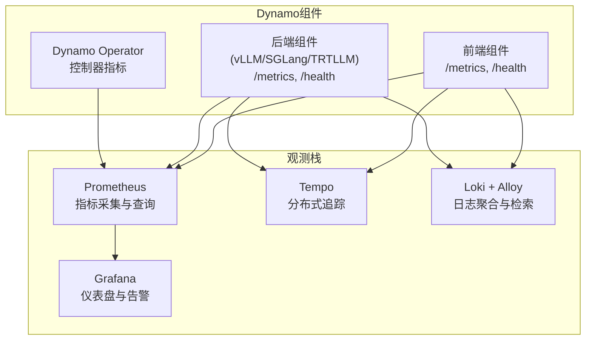
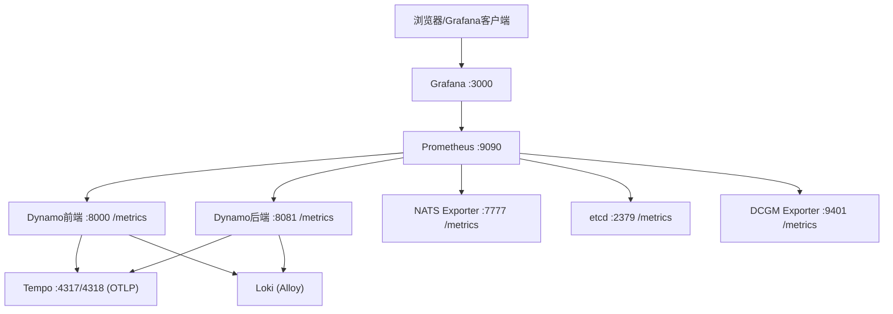
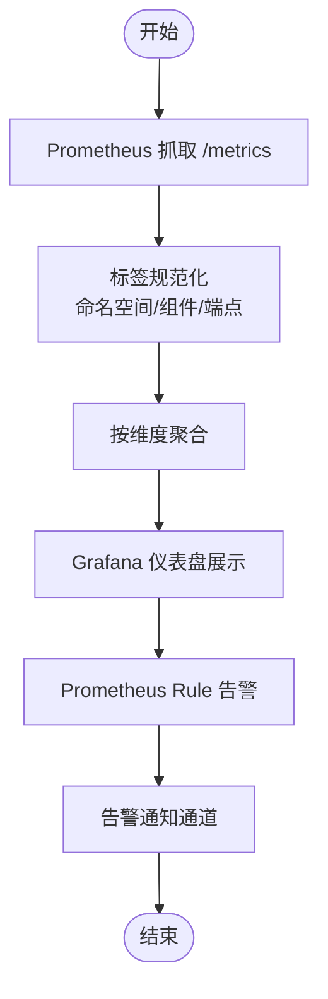
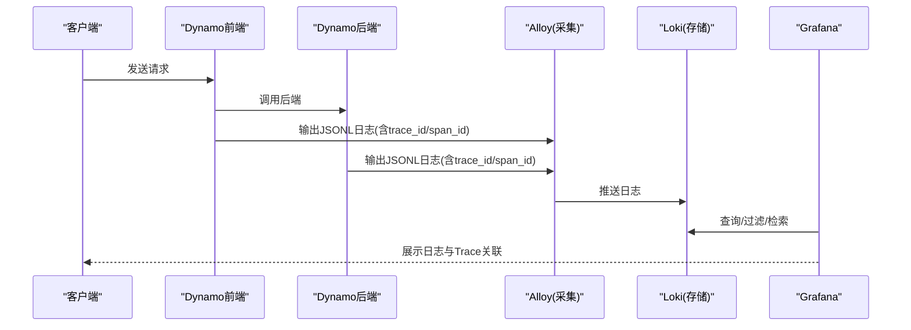
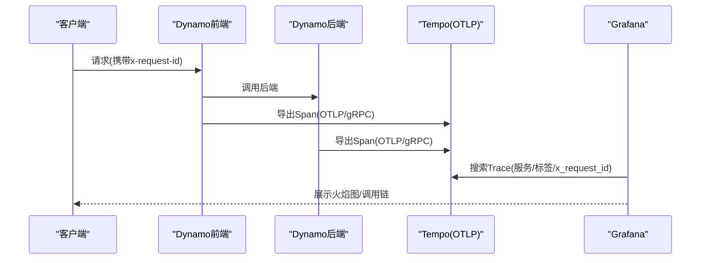
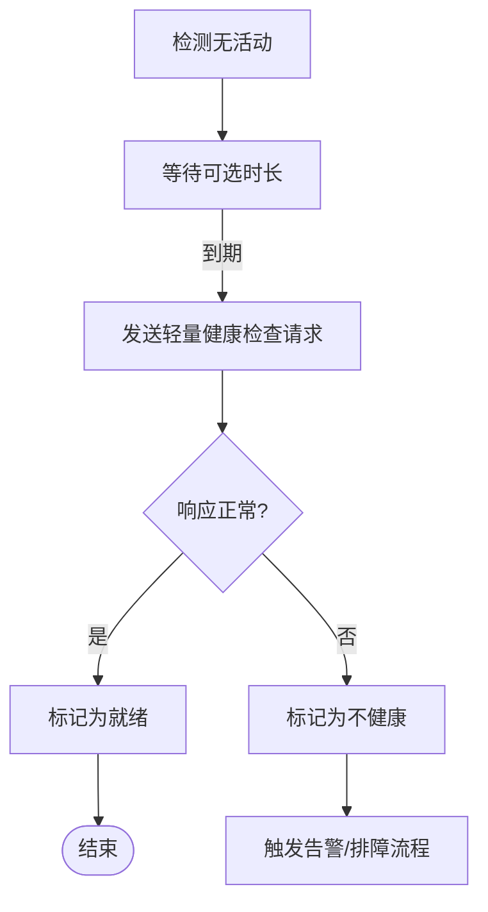
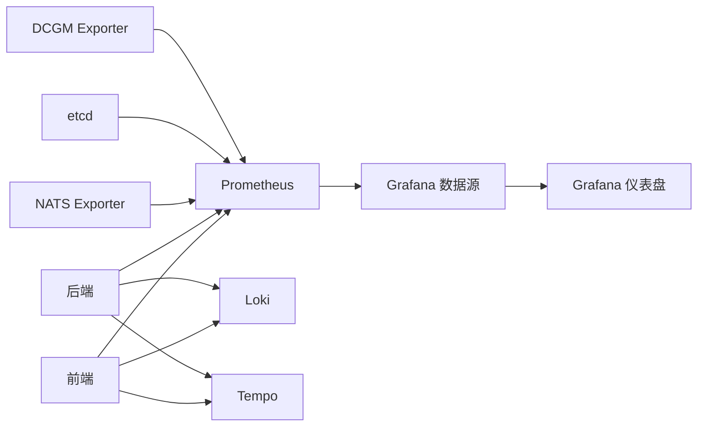

# 监控运维

<cite>
**本文引用的文件**   
- [README.md](file://deploy/observability/README.md)
- [prometheus.yml](file://deploy/observability/prometheus.yml)
- [grafana-datasources.yml](file://deploy/observability/grafana-datasources.yml)
- [tempo.yaml](file://deploy/observability/tempo.yaml)
- [metrics.md](file://docs/observability/metrics.md)
- [tracing.md](file://docs/observability/tracing.md)
- [logging.md](file://docs/observability/logging.md)
- [health-checks.md](file://docs/observability/health-checks.md)
- [metrics.md（Kubernetes）](file://docs/kubernetes/observability/metrics.md)
- [logging.md（Kubernetes）](file://docs/kubernetes/observability/logging.md)
- [dynamo.json](file://deploy/observability/grafana_dashboards/dynamo.json)
- [dcgm-metrics.json](file://deploy/observability/grafana_dashboards/dcgm-metrics.json)
- [kvbm.json](file://deploy/observability/grafana_dashboards/kvbm.json)
- [temp-loki.json](file://deploy/observability/grafana_dashboards/temp-loki.json)
- [logging-dashboard.yaml](file://deploy/observability/k8s/logging/grafana/logging-dashboard.yaml)
</cite>

## 目录
1. [简介](#简介)
2. [项目结构](#项目结构)
3. [核心组件](#核心组件)
4. [架构总览](#架构总览)
5. [组件详解](#组件详解)
6. [依赖关系分析](#依赖关系分析)
7. [性能考量](#性能考量)
8. [故障排查指南](#故障排查指南)
9. [结论](#结论)
10. [附录](#附录)

## 简介
本指南面向Dynamo监控运维团队与平台工程师，系统化阐述Dynamo在单机与Kubernetes环境下的可观测性体系：指标采集（Prometheus）、日志聚合（Loki + Alloy）、链路追踪（Tempo + OpenTelemetry）。文档覆盖关键性能指标定义与监控策略（吞吐量、延迟、资源利用率、错误率），日志管理最佳实践（格式标准化、存储与检索优化），告警配置指南（阈值、级别与通知渠道），以及运维自动化（健康检查、自动扩容与故障恢复）与容量规划及成本优化建议。

## 项目结构
Dynamo的可观测性由“观测栈”与“组件指标/日志/追踪”两部分组成：
- 观测栈：Prometheus（指标）、Grafana（可视化）、Tempo（追踪）、Loki + Alloy（日志）
- 组件层：前端与后端组件暴露指标端点；统一的日志与追踪环境变量支持结构化日志与OTLP导出

图示来源
- [prometheus.yml](file://deploy/observability/prometheus.yml#L20-L62)
- [grafana-datasources.yml](file://deploy/observability/grafana-datasources.yml#L18-L24)
- [tempo.yaml](file://deploy/observability/tempo.yaml#L4-L15)
- [metrics.md](file://docs/observability/metrics.md#L101-L154)
- [logging.md](file://docs/observability/logging.md#L15-L27)
- [tracing.md](file://docs/observability/tracing.md#L18-L26)

章节来源
- [README.md](file://deploy/observability/README.md#L1-L4)
- [prometheus.yml](file://deploy/observability/prometheus.yml#L16-L62)
- [grafana-datasources.yml](file://deploy/observability/grafana-datasources.yml#L16-L24)
- [tempo.yaml](file://deploy/observability/tempo.yaml#L4-L37)

## 核心组件
- 指标系统（Prometheus + Grafana）
  - 前端与后端组件均暴露OpenMetrics格式指标，标签包含命名空间、组件、端点等，便于分维度聚合与告警
  - Grafana内置多类仪表盘，覆盖请求速率、首Token时延、请求时延、输入/输出序列长度、GPU利用率等
- 日志系统（Loki + Alloy）
  - 通过Alloy从Kubernetes API采集容器日志，按标签映射到Loki，支持按部署、组件类型、命名空间过滤
  - 支持JSONL结构化日志，便于与追踪关联
- 追踪系统（Tempo + OpenTelemetry）
  - 通过OTLP协议将Span导出至Tempo，结合Grafana Explore进行搜索与火焰图分析
  - 支持自定义请求ID，便于跨服务串联定位问题

章节来源
- [metrics.md](file://docs/observability/metrics.md#L61-L154)
- [metrics.md（Kubernetes）](file://docs/kubernetes/observability/metrics.md#L108-L174)
- [logging.md（Kubernetes）](file://docs/kubernetes/observability/logging.md#L47-L155)
- [logging.md](file://docs/observability/logging.md#L15-L27)
- [tracing.md](file://docs/observability/tracing.md#L18-L26)

## 架构总览
下图展示Dynamo在本地Docker Compose环境中的观测拓扑与数据流：

图示来源
- [README.md](file://deploy/observability/README.md#L61-L87)
- [prometheus.yml](file://deploy/observability/prometheus.yml#L20-L62)
- [tempo.yaml](file://deploy/observability/tempo.yaml#L8-L15)
- [grafana-datasources.yml](file://deploy/observability/grafana-datasources.yml#L18-L24)

## 组件详解

### 指标体系与关键指标
- 指标来源与端点
  - 前端：默认HTTP端口（可通过环境变量配置）暴露指标端点
  - 后端：默认系统端口（可通过环境变量配置）暴露指标端点
  - 外部组件：NATS Exporter、etcd、DCGM Exporter等
- 关键指标类别
  - 前端指标：请求总量、并发请求数、队列中请求数、首Token时延、请求时延、输入/输出序列长度、迁移次数等
  - 组件指标：并发处理数、请求/响应字节数、处理时长、运行时长等
  - 引擎指标：各后端引擎（如vLLM、SGLang、TRT-LLM）自有指标
- 查询与可视化
  - Grafana内置仪表盘覆盖上述指标，支持按模型、组件、端点等维度筛选
  - 可基于PromQL编写自定义面板与告警规则

图示来源
- [metrics.md](file://docs/observability/metrics.md#L61-L154)
- [dynamo.json](file://deploy/observability/grafana_dashboards/dynamo.json#L24-L117)
- [dcgm-metrics.json](file://deploy/observability/grafana_dashboards/dcgm-metrics.json#L25-L122)

章节来源
- [metrics.md](file://docs/observability/metrics.md#L101-L154)
- [metrics.md（Kubernetes）](file://docs/kubernetes/observability/metrics.md#L108-L174)
- [dynamo.json](file://deploy/observability/grafana_dashboards/dynamo.json#L24-L117)
- [dcgm-metrics.json](file://deploy/observability/grafana_dashboards/dcgm-metrics.json#L25-L122)

### 日志管理与检索
- 结构化日志
  - JSONL格式可选，启用后日志包含trace_id、span_id等字段，便于与追踪关联
  - 支持自定义请求ID头（x-request-id），贯穿所有日志与Span
- 日志采集与存储
  - Kubernetes：使用Alloy从Kubernetes API采集日志，转发至Loki，采用本地MinIO作为存储
  - 支持按命名空间、DynamoGraphDeployment、组件类型等标签过滤
- 可视化与检索
  - Grafana内置日志仪表盘，支持关键字与Trace ID检索
  - 支持时间范围、标签过滤与日志详情查看

图示来源
- [logging.md](file://docs/observability/logging.md#L15-L27)
- [logging.md（Kubernetes）](file://docs/kubernetes/observability/logging.md#L47-L155)
- [logging-dashboard.yaml](file://deploy/observability/k8s/logging/grafana/logging-dashboard.yaml#L10-L80)
- [temp-loki.json](file://deploy/observability/grafana_dashboards/temp-loki.json#L51-L66)

章节来源
- [logging.md](file://docs/observability/logging.md#L15-L27)
- [logging.md（Kubernetes）](file://docs/kubernetes/observability/logging.md#L47-L155)
- [logging-dashboard.yaml](file://deploy/observability/k8s/logging/grafana/logging-dashboard.yaml#L10-L80)
- [temp-loki.json](file://deploy/observability/grafana_dashboards/temp-loki.json#L51-L66)

### 链路追踪与可视化
- 追踪导出
  - 通过OTLP协议将Span导出至Tempo，支持gRPC与HTTP两种端点
  - 服务名（OTEL_SERVICE_NAME）用于区分前端、解码/预填充工作器等
- 可视化与分析
  - Grafana Explore选择Tempo数据源，支持按服务名、Span名称、标签（如x_request_id）搜索
  - 提供火焰图与调用链分析，辅助定位慢调用与异常

图示来源
- [tracing.md](file://docs/observability/tracing.md#L18-L26)
- [tempo.yaml](file://deploy/observability/tempo.yaml#L8-L15)

章节来源
- [tracing.md](file://docs/observability/tracing.md#L18-L26)
- [tempo.yaml](file://deploy/observability/tempo.yaml#L4-L37)

### 健康检查与Canary探测
- 健康端点
  - 前端：/health返回健康状态；/live返回存活状态
  - 后端：/health与/liveness端点，支持初始状态与端点就绪要求
- Canary健康检查（K8s默认开启）
  - 在空闲期发送轻量测试请求验证端点可用性
  - 可配置等待时间与超时，避免对在线流量造成影响
- 自动化与排障
  - 健康检查失败会触发日志告警，结合日志与追踪快速定位问题

图示来源
- [health-checks.md](file://docs/observability/health-checks.md#L219-L345)

章节来源
- [health-checks.md](file://docs/observability/health-checks.md#L14-L345)

### 告警配置指南
- 告警规则建议
  - 前端请求速率骤降或错误率上升
  - 首Token时延与请求时延分位数（如P95/P99）超过阈值
  - 并发队列积压（inflight与queue差值显著增大）
  - GPU利用率/温度/功耗异常
  - 健康检查失败与端点不可用
- 阈值设定与级别
  - 建议采用分级阈值（警告/严重），并结合时间窗口与滑动平均
  - 对于时延类指标，建议同时设置绝对阈值与环比阈值
- 通知渠道
  - Grafana告警集成多种通知方式（邮件、Webhook、IM等）
  - 建议为不同级别配置差异化通知策略

章节来源
- [dynamo.json](file://deploy/observability/grafana_dashboards/dynamo.json#L24-L117)
- [dcgm-metrics.json](file://deploy/observability/grafana_dashboards/dcgm-metrics.json#L25-L122)
- [kvbm.json](file://deploy/observability/grafana_dashboards/kvbm.json#L38-L131)

### 运维自动化与脚本
- 健康检查自动化
  - 利用健康端点与Canary机制实现自动可用性检测
  - 在K8s中由Operator默认启用，减少手工干预
- 自动扩容与故障恢复
  - 基于指标面板与告警规则，结合HPA/扩缩容策略实现弹性伸缩
  - 故障恢复建议：隔离异常实例、重试与熔断、灰度回滚
- 健康巡检清单
  - 定期检查Prometheus抓取目标、Grafana数据源连通性、Tempo索引与存储、Loki写入与查询
  - 校验日志标签映射与过滤表达式，确保检索效率

章节来源
- [health-checks.md](file://docs/observability/health-checks.md#L219-L345)
- [metrics.md（Kubernetes）](file://docs/kubernetes/observability/metrics.md#L108-L174)

### 容量规划与成本优化
- 指标驱动的容量规划
  - 以请求速率、时延、并发队列长度、GPU利用率为核心指标，评估CPU/GPU/内存/网络瓶颈
  - 结合KV缓存命中率（KVBM相关指标）优化缓存策略
- 成本优化建议
  - 指标抓取间隔与保留周期：根据SLA调整抓取频率与存储时长
  - 日志与追踪：启用JSONL与OTLP导出仅在必要场景，避免冗余数据
  - 存储：Loki采用本地存储适合开发测试，生产建议对象存储与压缩策略
  - 追踪：合理设置采样率与保留周期，降低Tempo存储压力

章节来源
- [kvbm.json](file://deploy/observability/grafana_dashboards/kvbm.json#L38-L131)
- [logging.md（Kubernetes）](file://docs/kubernetes/observability/logging.md#L47-L155)
- [tempo.yaml](file://deploy/observability/tempo.yaml#L21-L37)

## 依赖关系分析
- 指标依赖
  - Prometheus依赖各组件的/metrics端点与外部Exporter（NATS、etcd、DCGM）
  - Grafana依赖Prometheus数据源配置
- 日志依赖
  - Alloy依赖Kubernetes API或容器目录采集，Loki负责存储与查询
  - Grafana通过Loki数据源展示日志
- 追踪依赖
  - 组件需启用JSONL与OTLP导出，Tempo接收OTLP数据
  - Grafana Explore依赖Tempo数据源

图示来源
- [prometheus.yml](file://deploy/observability/prometheus.yml#L20-L62)
- [grafana-datasources.yml](file://deploy/observability/grafana-datasources.yml#L18-L24)
- [tempo.yaml](file://deploy/observability/tempo.yaml#L8-L15)

章节来源
- [prometheus.yml](file://deploy/observability/prometheus.yml#L20-L62)
- [grafana-datasources.yml](file://deploy/observability/grafana-datasources.yml#L18-L24)
- [tempo.yaml](file://deploy/observability/tempo.yaml#L4-L37)

## 性能考量
- 指标采集
  - 合理设置抓取间隔，避免过高的采集频率导致Prometheus压力
  - 使用标签裁剪与查询优化，减少高基数标签的使用
- 日志与追踪
  - JSONL与OTLP导出仅在调试与生产排障阶段启用，日常关闭以降低开销
  - Loki与Tempo的存储与查询性能与标签数量、时间范围密切相关
- 可视化
  - 仪表盘面板数量与查询复杂度直接影响Grafana渲染性能，建议拆分仪表盘与复用变量

## 故障排查指南
- 快速定位
  - 使用x-request-id在日志与追踪中建立关联，缩小问题范围
  - 结合前端时延指标与后端处理时长，判断瓶颈在前端还是后端
- 常见问题
  - 指标缺失：检查/metrics端点可达性与标签是否正确
  - 日志无法检索：确认Alloy采集配置、Loki存储与查询端点
  - 追踪缺失：确认OTEL_EXPORT_ENABLED与OTLP端点配置
  - 健康检查失败：检查端点就绪要求与Canary等待/超时参数

章节来源
- [logging.md](file://docs/observability/logging.md#L220-L253)
- [tracing.md](file://docs/observability/tracing.md#L113-L151)
- [health-checks.md](file://docs/observability/health-checks.md#L324-L345)

## 结论
Dynamo提供了完善的可观测性基础设施：Prometheus指标、Loki日志与Tempo追踪三者协同，配合健康检查与Canary探测，能够有效支撑生产级监控与运维。通过标准化的日志格式、清晰的指标命名与丰富的仪表盘，团队可以快速定位问题、制定告警策略，并基于指标进行容量规划与成本优化。

## 附录
- 环境变量速查
  - 指标端口：DYN_SYSTEM_PORT、DYN_HTTP_PORT
  - 日志：DYN_LOGGING_JSONL、DYN_LOG、DYN_LOG_USE_LOCAL_TZ
  - 追踪：OTEL_EXPORT_ENABLED、OTEL_EXPORTER_OTLP_TRACES_ENDPOINT、OTEL_SERVICE_NAME
- 仪表盘参考
  - Dynamo通用仪表盘、DCGM GPU仪表盘、KVBM相关仪表盘、日志仪表盘

章节来源
- [metrics.md](file://docs/observability/metrics.md#L16-L22)
- [logging.md](file://docs/observability/logging.md#L15-L27)
- [tracing.md](file://docs/observability/tracing.md#L18-L26)
- [dynamo.json](file://deploy/observability/grafana_dashboards/dynamo.json#L1-L800)
- [dcgm-metrics.json](file://deploy/observability/grafana_dashboards/dcgm-metrics.json#L1-L800)
- [kvbm.json](file://deploy/observability/grafana_dashboards/kvbm.json#L1-L858)
- [temp-loki.json](file://deploy/observability/grafana_dashboards/temp-loki.json#L1-L215)