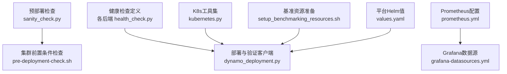
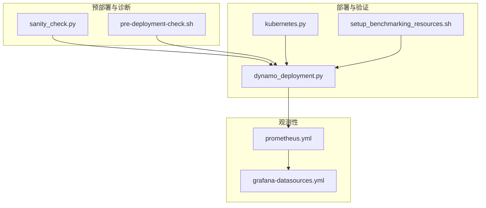
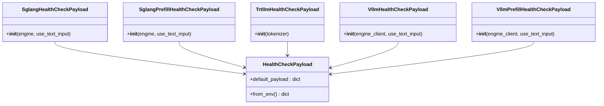
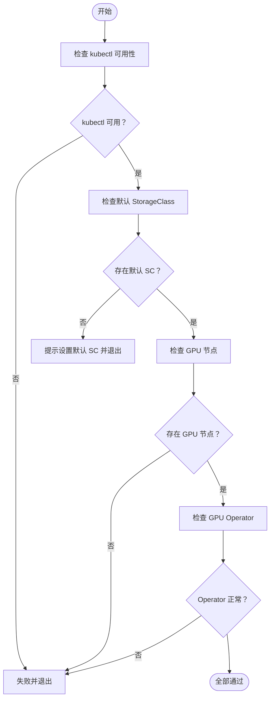
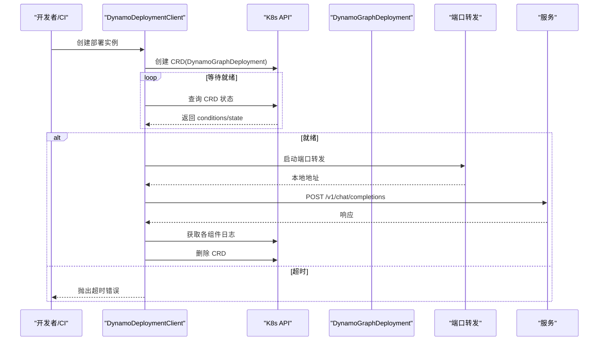
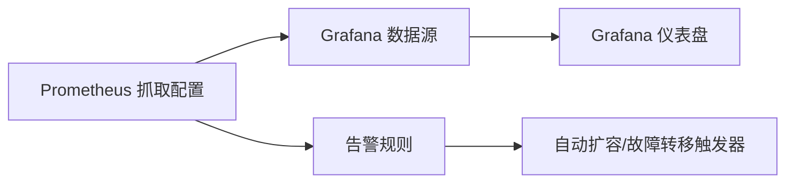
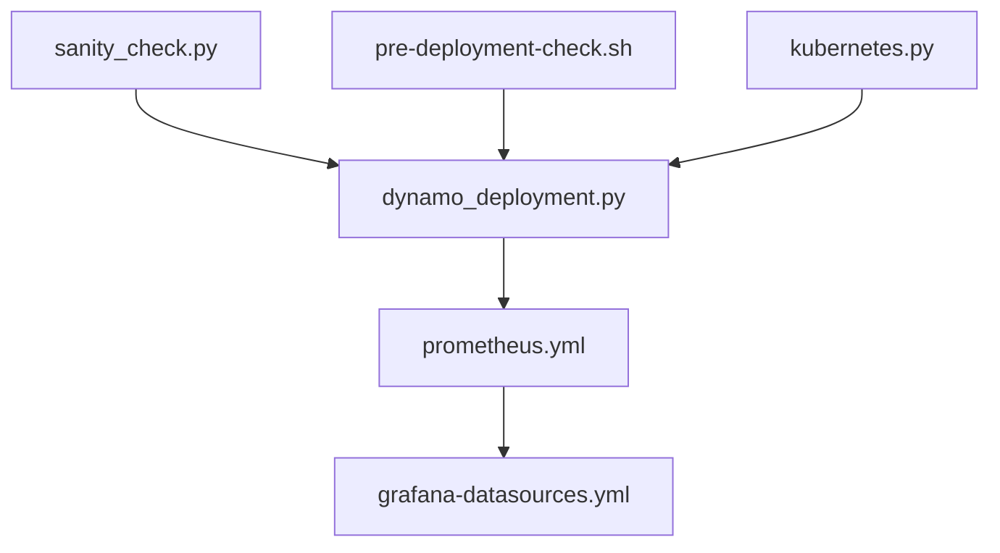

# 运维自动化

<cite>
**本文引用的文件**
- [sanity_check.py](file://deploy/sanity_check.py)
- [pre-deployment-check.sh](file://deploy/pre-deployment/pre-deployment-check.sh)
- [health_check.py（SGLang）](file://components/src/dynamo/sglang/health_check.py)
- [health_check.py（TRT-LLM）](file://components/src/dynamo/trtllm/health_check.py)
- [health_check.py（vLLM）](file://components/src/dynamo/vllm/health_check.py)
- [dynamo_deployment.py](file://deploy/utils/dynamo_deployment.py)
- [kubernetes.py](file://deploy/utils/kubernetes.py)
- [setup_benchmarking_resources.sh](file://deploy/utils/setup_benchmarking_resources.sh)
- [prometheus.yml](file://deploy/observability/prometheus.yml)
- [grafana-datasources.yml](file://deploy/observability/grafana-datasources.yml)
- [values.yaml（平台 Helm Chart）](file://deploy/helm/charts/platform/values.yaml)
</cite>

## 目录
1. [简介](#简介)
2. [项目结构](#项目结构)
3. [核心组件](#核心组件)
4. [架构总览](#架构总览)
5. [详细组件分析](#详细组件分析)
6. [依赖关系分析](#依赖关系分析)
7. [性能考量](#性能考量)
8. [故障排查指南](#故障排查指南)
9. [结论](#结论)
10. [附录](#附录)

## 简介
本指南面向Dynamo在生产环境的运维自动化，覆盖以下主题：
- 健康检查脚本：服务可用性检测与性能验证
- 自动化部署与回滚：蓝绿与金丝雀策略建议
- 监控告警自动化：自动扩容与故障转移
- 运维脚本规范与最佳实践：错误处理与日志记录
- CI/CD流水线中的监控集成与质量门禁

目标是帮助读者快速建立可重复、可观测、可恢复的自动化运维体系。

## 项目结构
围绕运维自动化，仓库中与之直接相关的模块主要分布在以下目录：
- 预部署与诊断：deploy/sanity_check.py、deploy/pre-deployment/pre-deployment-check.sh
- 健康检查：components/src/dynamo/*/health_check.py（SGLang/TRT-LLM/vLLM）
- 部署与测试：deploy/utils/dynamo_deployment.py、deploy/utils/kubernetes.py、deploy/utils/setup_benchmarking_resources.sh
- 观测性：deploy/observability/prometheus.yml、deploy/observability/grafana-datasources.yml
- 平台配置：deploy/helm/charts/platform/values.yaml

图表来源
- [sanity_check.py](file://deploy/sanity_check.py#L1-L148)
- [pre-deployment-check.sh](file://deploy/pre-deployment/pre-deployment-check.sh#L1-L284)
- [health_check.py（SGLang）](file://components/src/dynamo/sglang/health_check.py#L1-L121)
- [health_check.py（TRT-LLM）](file://components/src/dynamo/trtllm/health_check.py#L1-L92)
- [health_check.py（vLLM）](file://components/src/dynamo/vllm/health_check.py#L1-L121)
- [dynamo_deployment.py](file://deploy/utils/dynamo_deployment.py#L1-L599)
- [kubernetes.py](file://deploy/utils/kubernetes.py#L1-L186)
- [setup_benchmarking_resources.sh](file://deploy/utils/setup_benchmarking_resources.sh#L1-L107)
- [prometheus.yml](file://deploy/observability/prometheus.yml#L1-L63)
- [grafana-datasources.yml](file://deploy/observability/grafana-datasources.yml#L1-L24)
- [values.yaml（平台 Helm Chart）](file://deploy/helm/charts/platform/values.yaml#L1-L732)

章节来源
- [sanity_check.py](file://deploy/sanity_check.py#L1-L148)
- [pre-deployment-check.sh](file://deploy/pre-deployment/pre-deployment-check.sh#L1-L284)
- [health_check.py（SGLang）](file://components/src/dynamo/sglang/health_check.py#L1-L121)
- [health_check.py（TRT-LLM）](file://components/src/dynamo/trtllm/health_check.py#L1-L92)
- [health_check.py（vLLM）](file://components/src/dynamo/vllm/health_check.py#L1-L121)
- [dynamo_deployment.py](file://deploy/utils/dynamo_deployment.py#L1-L599)
- [kubernetes.py](file://deploy/utils/kubernetes.py#L1-L186)
- [setup_benchmarking_resources.sh](file://deploy/utils/setup_benchmarking_resources.sh#L1-L107)
- [prometheus.yml](file://deploy/observability/prometheus.yml#L1-L63)
- [grafana-datasources.yml](file://deploy/observability/grafana-datasources.yml#L1-L24)
- [values.yaml（平台 Helm Chart）](file://deploy/helm/charts/platform/values.yaml#L1-L732)

## 核心组件
- 预部署诊断与系统信息检查：sanity_check.py
- 集群前置条件检查：pre-deployment-check.sh
- 后端健康检查payload定义：各后端 health_check.py
- 部署与验证客户端：dynamo_deployment.py
- K8s工具集：kubernetes.py
- 基准资源准备：setup_benchmarking_resources.sh
- 观测性配置：prometheus.yml、grafana-datasources.yml
- 平台Helm值：platform/values.yaml

章节来源
- [sanity_check.py](file://deploy/sanity_check.py#L1-L148)
- [pre-deployment-check.sh](file://deploy/pre-deployment/pre-deployment-check.sh#L1-L284)
- [health_check.py（SGLang）](file://components/src/dynamo/sglang/health_check.py#L1-L121)
- [health_check.py（TRT-LLM）](file://components/src/dynamo/trtllm/health_check.py#L1-L92)
- [health_check.py（vLLM）](file://components/src/dynamo/vllm/health_check.py#L1-L121)
- [dynamo_deployment.py](file://deploy/utils/dynamo_deployment.py#L1-L599)
- [kubernetes.py](file://deploy/utils/kubernetes.py#L1-L186)
- [setup_benchmarking_resources.sh](file://deploy/utils/setup_benchmarking_resources.sh#L1-L107)
- [prometheus.yml](file://deploy/observability/prometheus.yml#L1-L63)
- [grafana-datasources.yml](file://deploy/observability/grafana-datasources.yml#L1-L24)
- [values.yaml（平台 Helm Chart）](file://deploy/helm/charts/platform/values.yaml#L1-L732)

## 架构总览
下图展示从“预部署检查”到“部署与验证”，再到“观测性”的整体运维自动化链路。

图表来源
- [sanity_check.py](file://deploy/sanity_check.py#L1-L148)
- [pre-deployment-check.sh](file://deploy/pre-deployment/pre-deployment-check.sh#L1-L284)
- [dynamo_deployment.py](file://deploy/utils/dynamo_deployment.py#L1-L599)
- [kubernetes.py](file://deploy/utils/kubernetes.py#L1-L186)
- [setup_benchmarking_resources.sh](file://deploy/utils/setup_benchmarking_resources.sh#L1-L107)
- [prometheus.yml](file://deploy/observability/prometheus.yml#L1-L63)
- [grafana-datasources.yml](file://deploy/observability/grafana-datasources.yml#L1-L24)

## 详细组件分析

### 健康检查脚本与配置
- 统一健康检查payload基类：各后端通过继承基类提供默认payload，并支持环境变量覆盖；payload包含采样参数、停止条件、输入类型等，确保最小化请求即可完成快速验证。
- SGLang：根据引擎tokenizer提取BOS token ID，或回退为默认值；支持文本输入与token输入两种模式。
- TRT-LLM：从包装后的HuggingFace tokenizer中提取BOS token ID，构造最小化请求。
- vLLM：从AsyncLLM引擎客户端提取BOS token ID，构造最小化请求；同时提供prefill场景的payload封装。

图表来源
- [health_check.py（SGLang）](file://components/src/dynamo/sglang/health_check.py#L50-L121)
- [health_check.py（TRT-LLM）](file://components/src/dynamo/trtllm/health_check.py#L51-L92)
- [health_check.py（vLLM）](file://components/src/dynamo/vllm/health_check.py#L82-L121)

章节来源
- [health_check.py（SGLang）](file://components/src/dynamo/sglang/health_check.py#L1-L121)
- [health_check.py（TRT-LLM）](file://components/src/dynamo/trtllm/health_check.py#L1-L92)
- [health_check.py（vLLM）](file://components/src/dynamo/vllm/health_check.py#L1-L121)

### 预部署检查与系统诊断
- sanity_check.py：以树形结构输出系统信息、容器/主机上下文、开发工具、框架、文件权限、CUDA/NVIDIA信息、ulimit、DYN_*环境变量等；支持“详尽检查”“简洁输出”“仅运行时检查”等模式；退出码用于CI失败判定。
- pre-deployment-check.sh：检查kubectl连通性、默认StorageClass、GPU节点、GPU Operator状态；输出汇总并返回整体结果。

图表来源
- [pre-deployment-check.sh](file://deploy/pre-deployment/pre-deployment-check.sh#L41-L177)

章节来源
- [sanity_check.py](file://deploy/sanity_check.py#L1-L148)
- [pre-deployment-check.sh](file://deploy/pre-deployment/pre-deployment-check.sh#L1-L284)

### 自动化部署与验证
- dynamo_deployment.py：封装K8s客户端、CRD创建、等待就绪、端口转发、HTTP测试、日志采集与清理；支持verbose/quiet进度显示、超时控制、异常处理与优雅关闭。
- kubernetes.py：提供is_running_in_cluster、kubectl命令执行、PVC访问Pod部署/清理等通用能力。
- setup_benchmarking_resources.sh：在命名空间内应用基准资源清单、可选创建HuggingFace Token Secret、校验PVC与Secret存在。

图表来源
- [dynamo_deployment.py](file://deploy/utils/dynamo_deployment.py#L98-L496)
- [kubernetes.py](file://deploy/utils/kubernetes.py#L27-L186)

章节来源
- [dynamo_deployment.py](file://deploy/utils/dynamo_deployment.py#L1-L599)
- [kubernetes.py](file://deploy/utils/kubernetes.py#L1-L186)
- [setup_benchmarking_resources.sh](file://deploy/utils/setup_benchmarking_resources.sh#L1-L107)

### 监控与告警自动化
- Prometheus：定义多个job抓取NATS、etcd、DCGM、前端/后端指标等；可通过环境变量调整抓取间隔。
- Grafana：配置Prometheus作为默认数据源。
- 平台Helm值：提供operator、etcd、NATS、Ingress/Istio、Webhook、证书、安全上下文等配置项，便于统一管理。

图表来源
- [prometheus.yml](file://deploy/observability/prometheus.yml#L16-L63)
- [grafana-datasources.yml](file://deploy/observability/grafana-datasources.yml#L16-L24)
- [values.yaml（平台 Helm Chart）](file://deploy/helm/charts/platform/values.yaml#L20-L212)

章节来源
- [prometheus.yml](file://deploy/observability/prometheus.yml#L1-L63)
- [grafana-datasources.yml](file://deploy/observability/grafana-datasources.yml#L1-L24)
- [values.yaml（平台 Helm Chart）](file://deploy/helm/charts/platform/values.yaml#L1-L732)

### 蓝绿与金丝雀发布策略（建议）
- 蓝绿：使用两套完全相同的DynamoGraphDeployment，通过Ingress切换服务指向；验证新版本稳定后再切流量。
- 金丝雀：逐步提升新版本副本比例，结合Prometheus阈值（如P95延迟、错误率）自动扩缩容；失败则回滚至旧版本。
- 与健康检查联动：新版本上线前先执行健康检查payload，通过后再进行流量切换或逐步放量。

说明：本节为概念性策略，不直接对应具体源码文件。

## 依赖关系分析
- 部署链路依赖：sanity_check.py/pre-deployment-check.sh → dynamo_deployment.py → kubernetes.py → Prometheus/Grafana
- 观测链路：Prometheus抓取 → Grafana可视化 → 告警 → 自动化动作（扩容/回滚）

图表来源
- [sanity_check.py](file://deploy/sanity_check.py#L1-L148)
- [pre-deployment-check.sh](file://deploy/pre-deployment/pre-deployment-check.sh#L1-L284)
- [dynamo_deployment.py](file://deploy/utils/dynamo_deployment.py#L1-L599)
- [kubernetes.py](file://deploy/utils/kubernetes.py#L1-L186)
- [prometheus.yml](file://deploy/observability/prometheus.yml#L1-L63)
- [grafana-datasources.yml](file://deploy/observability/grafana-datasources.yml#L1-L24)

章节来源
- [sanity_check.py](file://deploy/sanity_check.py#L1-L148)
- [pre-deployment-check.sh](file://deploy/pre-deployment/pre-deployment-check.sh#L1-L284)
- [dynamo_deployment.py](file://deploy/utils/dynamo_deployment.py#L1-L599)
- [kubernetes.py](file://deploy/utils/kubernetes.py#L1-L186)
- [prometheus.yml](file://deploy/observability/prometheus.yml#L1-L63)
- [grafana-datasources.yml](file://deploy/observability/grafana-datasources.yml#L1-L24)

## 性能考量
- 健康检查payload最小化：仅生成1个token或短prompt，降低对GPU/CPU的占用，缩短验证时间。
- 端口转发与HTTP测试：在本地或集群内按需选择，避免不必要的网络开销。
- 日志采集：按组件分目录保存，便于定位瓶颈与异常。
- Prometheus抓取间隔：根据指标重要性与成本权衡，避免过度抓取导致额外负载。

## 故障排查指南
- 预部署阶段
  - sanity_check.py：若出现“缺少关键组件/环境变量/权限问题”，根据输出逐项修复；必要时启用“详尽检查”获取更详细信息。
  - pre-deployment-check.sh：针对kubectl不可达、无默认StorageClass、无GPU节点、GPU Operator未运行等问题，按提示修正。
- 部署与验证阶段
  - dynamo_deployment.py：关注CRD状态conditions与state；若长时间未就绪，查看组件日志；必要时终止端口转发进程并重试。
  - kubernetes.py：确认kubectl访问命名空间正常；PVC访问Pod部署失败时，保留Pod以便手动调试。
- 观测性
  - Prometheus：核对抓取targets是否可达；确认抓取间隔与服务端口一致。
  - Grafana：确认数据源配置正确且Prometheus可用。

章节来源
- [sanity_check.py](file://deploy/sanity_check.py#L1-L148)
- [pre-deployment-check.sh](file://deploy/pre-deployment/pre-deployment-check.sh#L1-L284)
- [dynamo_deployment.py](file://deploy/utils/dynamo_deployment.py#L287-L415)
- [kubernetes.py](file://deploy/utils/kubernetes.py#L55-L186)
- [prometheus.yml](file://deploy/observability/prometheus.yml#L16-L63)
- [grafana-datasources.yml](file://deploy/observability/grafana-datasources.yml#L16-L24)

## 结论
通过将“预部署检查”“健康检查payload”“部署与验证客户端”“K8s工具集”“观测性配置”整合为统一的运维自动化体系，可以显著提升Dynamo在Kubernetes上的可靠性与可维护性。建议在CI/CD流水线中串联上述步骤，并结合Prometheus/Grafana实现自动化告警与自愈。

## 附录
- 运维脚本编写规范与最佳实践
  - 错误处理：使用明确的退出码与错误消息；对可恢复错误提供重试机制。
  - 日志记录：区分INFO/WARN/ERROR级别；在CI中保留关键上下文（如CRD状态、日志路径）。
  - 可观测性：为每个脚本暴露关键指标（耗时、成功率），便于监控与告警。
  - 安全性：避免在日志中打印敏感信息；对私有镜像仓库凭据使用K8s Secret。
- CI/CD流水线中的监控集成与质量门禁
  - 在“构建”阶段执行sanity_check.py与pre-deployment-check.sh。
  - 在“部署”阶段调用dynamo_deployment.py并执行健康检查payload。
  - 在“验收”阶段读取Prometheus指标，设置质量门禁（如P95延迟、错误率、可用性）。
  - 失败时触发自动回滚至上一个稳定版本。