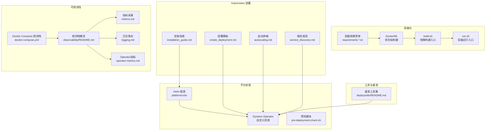
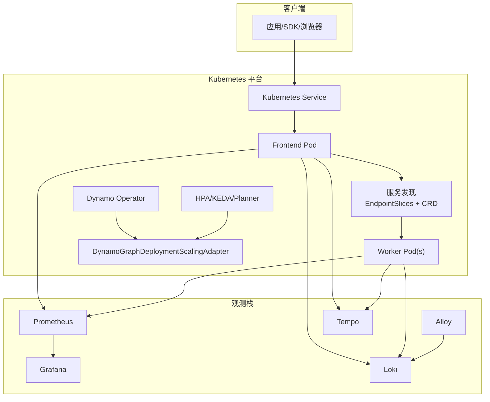
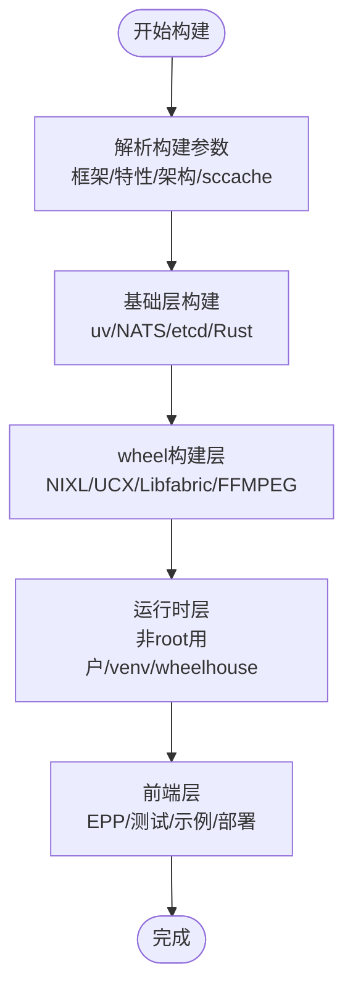
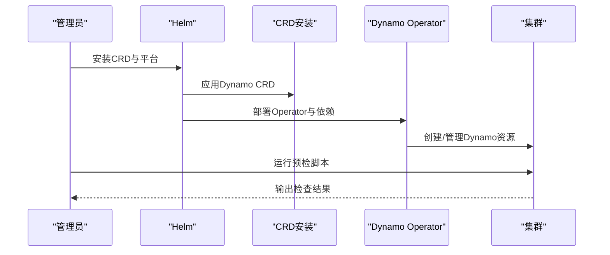
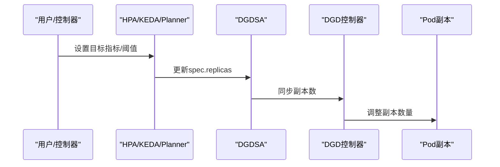
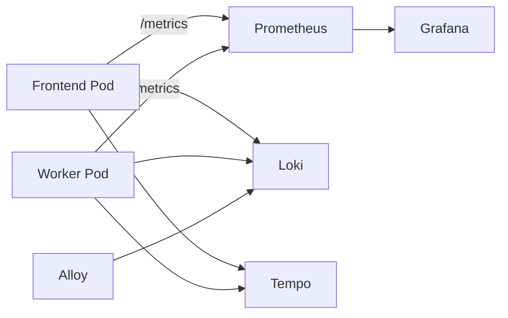
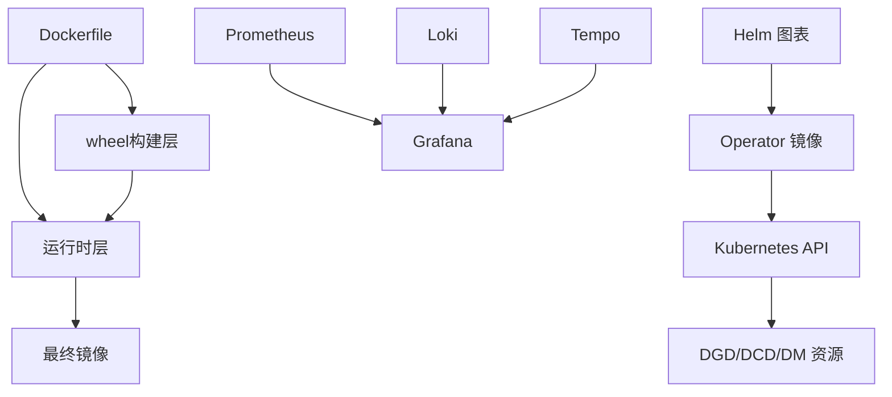

# 部署和运维

<cite>
**本文引用的文件**
- [container/README.md](file://container/README.md)
- [container/Dockerfile](file://container/Dockerfile)
- [container/build.sh](file://container/build.sh)
- [container/run.sh](file://container/run.sh)
- [deploy/docker-compose.yml](file://deploy/docker-compose.yml)
- [deploy/nats-server.conf](file://deploy/nats-server.conf)
- [deploy/helm/README.md](file://deploy/helm/README.md)
- [deploy/operator/README.md](file://deploy/operator/README.md)
- [deploy/observability/README.md](file://deploy/observability/README.md)
- [docs/kubernetes/installation_guide.md](file://docs/kubernetes/installation_guide.md)
- [docs/kubernetes/deployment/create_deployment.md](file://docs/kubernetes/deployment/create_deployment.md)
- [docs/kubernetes/autoscaling.md](file://docs/kubernetes/autoscaling.md)
- [docs/kubernetes/observability/logging.md](file://docs/kubernetes/observability/logging.md)
- [docs/kubernetes/observability/metrics.md](file://docs/kubernetes/observability/metrics.md)
- [docs/kubernetes/observability/operator-metrics.md](file://docs/kubernetes/observability/operator-metrics.md)
- [docs/kubernetes/service_discovery.md](file://docs/kubernetes/service_discovery.md)
- [deploy/utils/README.md](file://deploy/utils/README.md)
</cite>

## 目录
1. [简介](#简介)
2. [项目结构](#项目结构)
3. [核心组件](#核心组件)
4. [架构总览](#架构总览)
5. [详细组件分析](#详细组件分析)
6. [依赖关系分析](#依赖关系分析)
7. [性能考虑](#性能考虑)
8. [故障排查指南](#故障排查指南)
9. [结论](#结论)
10. [附录](#附录)

## 简介
本指南面向Dynamo在生产与多环境中的部署与运维，覆盖容器化构建与运行、Kubernetes平台安装与管理、可观测性体系、自动伸缩策略、蓝绿/金丝雀/滚动更新实践、安全与合规、成本优化与资源利用率监控等主题。内容基于仓库中容器构建脚本、Dockerfile、Helm图表、Operator说明、Kubernetes部署与观测文档整理而成，帮助读者建立从开发到生产的完整交付流水线。

## 项目结构
Dynamo的部署与运维相关能力主要分布在以下目录：
- 容器化：container/（Dockerfile、构建脚本、运行脚本、依赖清单）
- 平台安装与管理：deploy/（Helm图表、Operator、预检脚本、观测栈compose）
- 文档与示例：docs/（Kubernetes安装、部署、观测、服务发现、自动伸缩等）
- 工具与基准：deploy/utils/（基准资源准备、PVC与访问Pod）

图示来源
- [container/Dockerfile](file://container/Dockerfile#L1-L655)
- [container/build.sh](file://container/build.sh#L1-L800)
- [container/run.sh](file://container/run.sh#L1-L400)
- [deploy/helm/README.md](file://deploy/helm/README.md#L1-L23)
- [deploy/operator/README.md](file://deploy/operator/README.md#L1-L37)
- [docs/kubernetes/installation_guide.md](file://docs/kubernetes/installation_guide.md#L1-L386)
- [docs/kubernetes/deployment/create_deployment.md](file://docs/kubernetes/deployment/create_deployment.md#L1-L260)
- [docs/kubernetes/autoscaling.md](file://docs/kubernetes/autoscaling.md#L1-L732)
- [docs/kubernetes/observability/README.md](file://docs/kubernetes/observability/README.md#L1-L100)
- [docs/kubernetes/observability/metrics.md](file://docs/kubernetes/observability/metrics.md#L1-L181)
- [docs/kubernetes/observability/logging.md](file://docs/kubernetes/observability/logging.md#L1-L155)
- [docs/kubernetes/observability/operator-metrics.md](file://docs/kubernetes/observability/operator-metrics.md#L1-L267)
- [deploy/docker-compose.yml](file://deploy/docker-compose.yml#L1-L36)
- [deploy/utils/README.md](file://deploy/utils/README.md#L1-L153)

章节来源
- [container/README.md](file://container/README.md#L1-L411)
- [container/Dockerfile](file://container/Dockerfile#L1-L655)
- [container/build.sh](file://container/build.sh#L1-L800)
- [container/run.sh](file://container/run.sh#L1-L400)
- [deploy/docker-compose.yml](file://deploy/docker-compose.yml#L1-L36)
- [deploy/nats-server.conf](file://deploy/nats-server.conf#L1-L14)
- [deploy/helm/README.md](file://deploy/helm/README.md#L1-L23)
- [deploy/operator/README.md](file://deploy/operator/README.md#L1-L37)
- [deploy/observability/README.md](file://deploy/observability/README.md#L1-L100)
- [docs/kubernetes/installation_guide.md](file://docs/kubernetes/installation_guide.md#L1-L386)
- [docs/kubernetes/deployment/create_deployment.md](file://docs/kubernetes/deployment/create_deployment.md#L1-L260)
- [docs/kubernetes/autoscaling.md](file://docs/kubernetes/autoscaling.md#L1-L732)
- [docs/kubernetes/observability/logging.md](file://docs/kubernetes/observability/logging.md#L1-L155)
- [docs/kubernetes/observability/metrics.md](file://docs/kubernetes/observability/metrics.md#L1-L181)
- [docs/kubernetes/observability/operator-metrics.md](file://docs/kubernetes/observability/operator-metrics.md#L1-L267)
- [docs/kubernetes/service_discovery.md](file://docs/kubernetes/service_discovery.md#L1-L115)
- [deploy/utils/README.md](file://deploy/utils/README.md#L1-L153)

## 核心组件
- 容器镜像与构建
  - 多阶段Dockerfile：基础层、wheel构建层、运行时层、前端层，支持vLLM/TensorRT-LLM/SGLang/None框架目标，统一缓存与依赖复用。
  - 构建脚本：集中处理框架选择、CUDA版本、NIXL/FFmpeg特性开关、sccache缓存、EFA扩展、平台多架构支持。
  - 运行脚本：封装GPU设备映射、网络模式(host/bridge/none/container共享)、用户与权限、卷挂载、交互式会话等。
- Kubernetes平台与Operator
  - Helm图表：CRD与平台安装；Operator负责DynamoGraphDeployment/DynamoComponentDeployment等资源的编排与生命周期管理。
  - 自动伸缩：通过DynamoGraphDeploymentScalingAdapter与HPA/KEDA/Planner集成实现事件驱动与SLA感知的弹性。
  - 服务发现：Kubernetes原生EndpointSlices与DynamoWorkerMetadata CRD配合，或可选etcd后端。
- 观测性
  - 指标：前端/后端HTTP端口暴露OpenMetrics格式指标；Prometheus自动发现；Grafana仪表盘。
  - 日志：Grafana Loki + Alloy收集结构化日志(JSONL)，按组件类型与DGD名称过滤。
  - 跟踪：OpenTelemetry导出至Tempo；支持服务名与OTEL导出开关。
  - Operator指标：控制器循环、Webhook验证、资源库存等指标与仪表盘。
- 基准与工具
  - PVC与访问Pod：用于存储配置与结果，支持拷贝与下载；基准脚本辅助准备命名空间资源。

章节来源
- [container/Dockerfile](file://container/Dockerfile#L1-L655)
- [container/build.sh](file://container/build.sh#L1-L800)
- [container/run.sh](file://container/run.sh#L1-L400)
- [deploy/helm/README.md](file://deploy/helm/README.md#L1-L23)
- [deploy/operator/README.md](file://deploy/operator/README.md#L1-L37)
- [docs/kubernetes/autoscaling.md](file://docs/kubernetes/autoscaling.md#L1-L732)
- [docs/kubernetes/service_discovery.md](file://docs/kubernetes/service_discovery.md#L1-L115)
- [docs/kubernetes/observability/metrics.md](file://docs/kubernetes/observability/metrics.md#L1-L181)
- [docs/kubernetes/observability/logging.md](file://docs/kubernetes/observability/logging.md#L1-L155)
- [docs/kubernetes/observability/operator-metrics.md](file://docs/kubernetes/observability/operator-metrics.md#L1-L267)
- [deploy/utils/README.md](file://deploy/utils/README.md#L1-L153)

## 架构总览
下图展示Dynamo在Kubernetes上的典型部署拓扑与数据流：前端作为HTTP入口，经由服务发现路由到后端工作节点；观测栈通过Prometheus抓取指标、Grafana可视化、Loki收集日志、Tempo承载链路追踪；Operator负责CRD编排与自动伸缩适配器的创建与同步。

图示来源
- [docs/kubernetes/deployment/create_deployment.md](file://docs/kubernetes/deployment/create_deployment.md#L1-L260)
- [docs/kubernetes/autoscaling.md](file://docs/kubernetes/autoscaling.md#L1-L732)
- [docs/kubernetes/observability/metrics.md](file://docs/kubernetes/observability/metrics.md#L1-L181)
- [docs/kubernetes/observability/logging.md](file://docs/kubernetes/observability/logging.md#L1-L155)
- [docs/kubernetes/observability/operator-metrics.md](file://docs/kubernetes/observability/operator-metrics.md#L1-L267)
- [docs/kubernetes/service_discovery.md](file://docs/kubernetes/service_discovery.md#L1-L115)

## 详细组件分析

### 容器化构建与运行
- 多阶段构建
  - 基础层：安装uv、NATS、etcd、Rust工具链，为后续wheel构建与运行时复制依赖。
  - wheel构建层：在manylinux镜像中构建NIXL/UCX/Libfabric/FFmpeg与Python wheels，支持sccache缓存加速。
  - 运行时层：创建非root用户(dynamo)，安装Python虚拟环境，安装wheelhouse中的包，设置入口点。
  - 前端层：复制EPP二进制与测试/示例/部署代码，创建可交互的前端镜像。
- 构建参数与特性开关
  - 框架选择：vLLM/TensorRT-LLM/SGLang/None，自动注入对应基础镜像标签与CUDA版本。
  - 特性开关：KVBM、GPU内存服务、媒体NIXL/FFMPEG、EFA、多架构(amd64/arm64)、sccache。
  - 构建缓存：Docker层缓存与sccache对象缓存，减少重复编译时间。
- 运行时配置
  - 用户与权限：默认以非root用户运行，兼容OpenShift组权限；支持--user覆盖。
  - 网络模式：host/bridge/none/container共享，host模式便于GPU直连与高吞吐，bridge适合隔离与CI。
  - 卷挂载：HuggingFace缓存、工作区绑定(--mount-workspace)、交互式shell(-it)。
  - 资源限制：通过Docker命令行传入内存/文件描述符/IPC限制，结合Kubernetes资源请求/限制使用。

图示来源
- [container/Dockerfile](file://container/Dockerfile#L1-L655)
- [container/build.sh](file://container/build.sh#L1-L800)

章节来源
- [container/README.md](file://container/README.md#L1-L411)
- [container/Dockerfile](file://container/Dockerfile#L1-L655)
- [container/build.sh](file://container/build.sh#L1-L800)
- [container/run.sh](file://container/run.sh#L1-L400)

### Kubernetes平台安装与管理
- 安装路径
  - 生产路径：使用NGC发布的Helm图表安装CRD与平台，快速部署。
  - 自定义路径：从源码构建Operator镜像，推送至私有仓库，再通过Helm安装。
- 预检与验证
  - 预检脚本检查kubectl连接、默认StorageClass、GPU节点可用性。
  - 验证CRD与Operator Pod状态，确认平台就绪。
- 多节点与调度
  - 支持Grove+KAI Scheduler或LeaderWorkerSet+Volcano，满足多节点协同与绑带调度需求。
- 命名空间与权限
  - 支持集群级与命名空间受限安装，避免与现有Operator冲突。

图示来源
- [docs/kubernetes/installation_guide.md](file://docs/kubernetes/installation_guide.md#L1-L386)
- [deploy/helm/README.md](file://deploy/helm/README.md#L1-L23)
- [deploy/operator/README.md](file://deploy/operator/README.md#L1-L37)

章节来源
- [docs/kubernetes/installation_guide.md](file://docs/kubernetes/installation_guide.md#L1-L386)
- [deploy/helm/README.md](file://deploy/helm/README.md#L1-L23)
- [deploy/operator/README.md](file://deploy/operator/README.md#L1-L37)

### 自动伸缩与弹性策略
- 适配器模型
  - 每个服务自动创建DynamoGraphDeploymentScalingAdapter，作为副本数的唯一真实来源。
  - 通过Scale子资源对接HPA/KEDA/Planner，Operator控制器将副本变更同步回DGD。
- 伸缩策略
  - HPA：CPU/内存资源指标，适用于前端等通用场景。
  - KEDA：Prometheus触发器，基于队列深度、TTFT等LLM关键指标，支持零副本缩放。
  - Planner：SLA感知的协调伸缩，针对prefill/decode服务联合优化。
- 最佳实践
  - 为不同服务选择合适指标，避免多个控制器互相冲突。
  - 设置合理的最小/最大副本与稳定窗口，防止抖动。

图示来源
- [docs/kubernetes/autoscaling.md](file://docs/kubernetes/autoscaling.md#L1-L732)

章节来源
- [docs/kubernetes/autoscaling.md](file://docs/kubernetes/autoscaling.md#L1-L732)

### 部署模板与多环境策略
- 架构模式
  - 聚合服务(agg)：单进程内prefill/decode，适合小模型与开发测试。
  - 聚合+路由器(agg_router)：多副本负载均衡，适合中等流量与高可用。
  - 解耦服务(disagg)：prefill/decode分离，最大化吞吐与GPU利用率，适合生产。
- 模板定制
  - Frontend：HTTP入口、服务发现、请求预处理。
  - Worker：按后端(vLLM/SGLang/TensorRT-LLM)配置特定标志，如GPU内存利用、批大小、KV缓存等。
  - 资源与副本：根据模型规模与SLA设定CPU/内存/GPU请求与副本数。
- 多环境差异
  - 开发：轻量聚合部署，本地缓存与桥接网络，便于调试。
  - 测试：隔离网络与资源，启用健康探针与日志聚合。
  - 生产：解耦部署、自动伸缩、SLA Planner、Operator指标与告警。

章节来源
- [docs/kubernetes/deployment/create_deployment.md](file://docs/kubernetes/deployment/create_deployment.md#L1-L260)

### 服务发现与路由
- Kubernetes发现（默认）
  - 使用EndpointSlices与DynamoWorkerMetadata CRD，确保只有“就绪且具备元数据”的Pod才可被发现。
  - 注入DYN_DISCOVERY_BACKEND=kubernetes与Pod元信息，保障实例ID一致性。
- etcd发现（可选）
  - 通过注解切换后端，需提供可用的etcd集群，并在平台Helm中配置连接。

章节来源
- [docs/kubernetes/service_discovery.md](file://docs/kubernetes/service_discovery.md#L1-L115)

### 观测性体系
- 指标采集
  - 前端/后端均暴露OpenMetrics端点；通过PodMonitor自动发现；Grafana仪表盘包含请求速率、TTFT、ITL、GPU/节点/CPU/内存面板。
- 日志聚合
  - 使用Loki + Alloy收集结构化日志(JSONL)，按组件类型与DGD名称过滤，便于定位问题。
- 跟踪
  - OpenTelemetry导出至Tempo，结合Grafana Trace查看端到端链路。
- Operator指标
  - 控制器循环耗时、Webhook验证、资源库存等指标与仪表盘，便于Operator健康度评估。

图示来源
- [docs/kubernetes/observability/metrics.md](file://docs/kubernetes/observability/metrics.md#L1-L181)
- [docs/kubernetes/observability/logging.md](file://docs/kubernetes/observability/logging.md#L1-L155)
- [docs/kubernetes/observability/operator-metrics.md](file://docs/kubernetes/observability/operator-metrics.md#L1-L267)
- [deploy/observability/README.md](file://deploy/observability/README.md#L1-L100)

章节来源
- [docs/kubernetes/observability/metrics.md](file://docs/kubernetes/observability/metrics.md#L1-L181)
- [docs/kubernetes/observability/logging.md](file://docs/kubernetes/observability/logging.md#L1-L155)
- [docs/kubernetes/observability/operator-metrics.md](file://docs/kubernetes/observability/operator-metrics.md#L1-L267)
- [deploy/observability/README.md](file://deploy/observability/README.md#L1-L100)

### 基准与工具
- PVC与访问Pod
  - 提供dynamo-pvc与临时访问Pod，支持拷贝配置与结果，便于批量基准与性能分析。
- 基准资源准备
  - 一键创建命名空间所需资源，支持RWX存储与HF令牌密钥，便于并发与外部模型访问。

章节来源
- [deploy/utils/README.md](file://deploy/utils/README.md#L1-L153)

## 依赖关系分析
- 容器层依赖
  - Dockerfile各阶段共享基础镜像与工具链，wheel构建层依赖manylinux与GCC 14兼容性，运行时层依赖NIXL/UCX/Libfabric/FFMPEG构建产物。
- 平台层依赖
  - Helm图表依赖Operator镜像与CRD；Operator依赖Kubernetes API与RBAC；自动伸缩依赖HPA/KEDA/Planner与Prometheus。
- 观测层依赖
  - 指标依赖Prometheus自动发现与ServiceMonitor/PodMonitor；日志依赖Loki与Alloy；跟踪依赖OTel与Tempo。

图示来源
- [container/Dockerfile](file://container/Dockerfile#L1-L655)
- [deploy/helm/README.md](file://deploy/helm/README.md#L1-L23)
- [docs/kubernetes/observability/metrics.md](file://docs/kubernetes/observability/metrics.md#L1-L181)
- [docs/kubernetes/observability/logging.md](file://docs/kubernetes/observability/logging.md#L1-L155)

章节来源
- [container/Dockerfile](file://container/Dockerfile#L1-L655)
- [deploy/helm/README.md](file://deploy/helm/README.md#L1-L23)
- [docs/kubernetes/observability/metrics.md](file://docs/kubernetes/observability/metrics.md#L1-L181)
- [docs/kubernetes/observability/logging.md](file://docs/kubernetes/observability/logging.md#L1-L155)

## 性能考虑
- 容器与镜像
  - 使用sccache对象缓存与Docker层缓存，减少重复编译；多架构支持与CUDA版本匹配，避免ABI不兼容。
  - 运行时层采用非root用户与组写权限掩码，提升文件共享效率。
- Kubernetes与伸缩
  - 优先解耦部署以提升GPU利用率；基于TTFT/队列深度的KEDA触发器更贴合LLM场景。
  - 合理设置稳定窗口与最小/最大副本，避免频繁扩缩导致抖动。
- 观测与调优
  - 结合Grafana仪表盘与PromQL查询，定位瓶颈（前端并发、后端解码延迟、GPU占用率）。
  - 使用Operator指标评估控制器健康度与Webhook成功率，及时发现编排异常。

[本节为通用指导，无需具体文件引用]

## 故障排查指南
- 平台安装
  - 若提示“无法安装集群级Operator”，需启用命名空间限制或使用现有Operator所在命名空间。
  - CRD已存在则跳过安装步骤；Pod未启动时使用describe/logs定位原因。
- 自动伸缩
  - 若缩放无效，检查适配器状态、HPA/KEDA配置与Prometheus指标可用性；确认无多重控制器冲突。
- 观测性
  - 指标不可见：检查ServiceMonitor/PodMonitor是否被Prometheus发现；确认dynamo_namespace标签正确。
  - 日志缺失：确认DYN_LOGGING_JSONL开启、Alloy与Loki连通、命名空间过滤正确。
- 服务发现
  - 组件不可见：检查EndpointSlices就绪状态与DynamoWorkerMetadata是否存在；核对RBAC权限。
- 基准与工具
  - PVC无法访问：确认访问Pod已就绪，路径与权限正确；必要时清理临时Pod。

章节来源
- [docs/kubernetes/installation_guide.md](file://docs/kubernetes/installation_guide.md#L297-L386)
- [docs/kubernetes/autoscaling.md](file://docs/kubernetes/autoscaling.md#L668-L732)
- [docs/kubernetes/observability/metrics.md](file://docs/kubernetes/observability/metrics.md#L145-L181)
- [docs/kubernetes/observability/logging.md](file://docs/kubernetes/observability/logging.md#L132-L155)
- [docs/kubernetes/service_discovery.md](file://docs/kubernetes/service_discovery.md#L81-L115)
- [deploy/utils/README.md](file://deploy/utils/README.md#L73-L153)

## 结论
Dynamo提供了从容器化构建到Kubernetes平台部署、自动伸缩与全栈可观测性的完整能力。通过规范化的镜像构建参数、清晰的部署模板与自动伸缩策略、完善的日志/指标/跟踪体系以及Operator健康监控，可在开发、测试与生产环境中实现高效、稳定与可观察的推理服务交付。建议在生产中优先采用解耦部署、KEDA事件驱动伸缩与SLA Planner协调策略，并结合Operator指标与Grafana仪表盘进行持续优化。

[本节为总结性内容，无需具体文件引用]

## 附录
- 环境变量与可观测性
  - 共享变量：DYN_SYSTEM_PORT、DYN_SYSTEM_STARTING_HEALTH_STATUS、DYN_SYSTEM_HEALTH_PATH、DYN_SYSTEM_LIVE_PATH、DYN_SYSTEM_USE_ENDPOINT_HEALTH_STATUS、DYN_LOGGING_JSONL、DYN_LOG、DYN_LOG_USE_LOCAL_TZ、DYN_LOGGING_CONFIG_PATH、OTEL_EXPORT_ENABLED、OTEL_EXPORTER_OTLP_TRACES_ENDPOINT、OTEL_SERVICE_NAME等。
- Docker Compose观测栈
  - 包含NATS/etcd基础设施与Prometheus/Grafana/Tempo及DCGM/NATS Exporter，便于单机快速搭建观测环境。

章节来源
- [deploy/observability/README.md](file://deploy/observability/README.md#L35-L100)
- [deploy/docker-compose.yml](file://deploy/docker-compose.yml#L1-L36)
- [deploy/nats-server.conf](file://deploy/nats-server.conf#L1-L14)