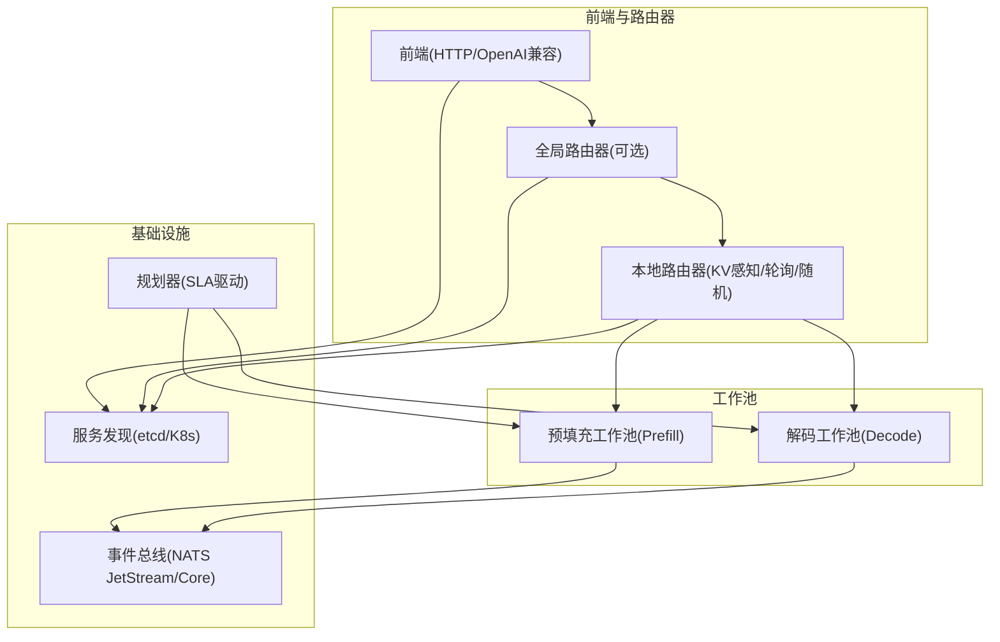
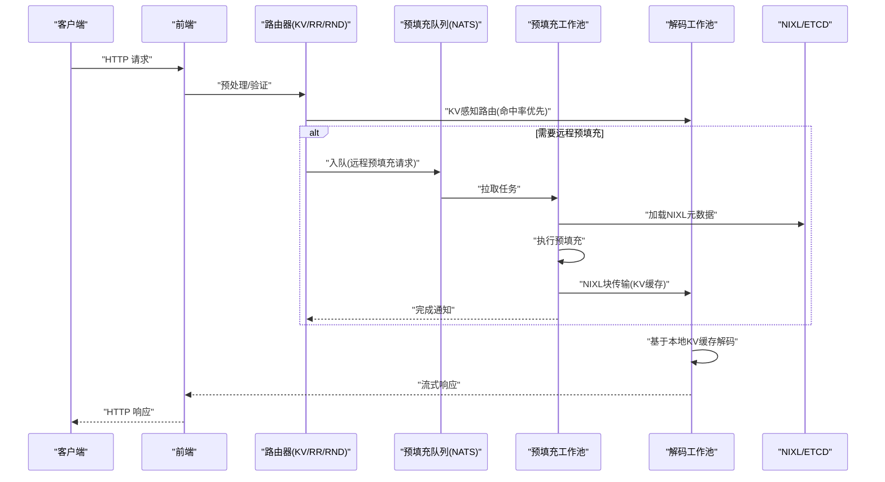
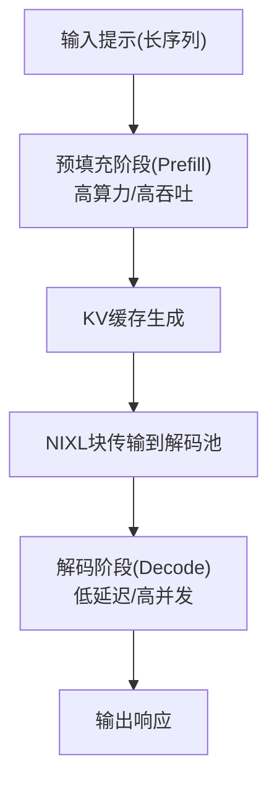
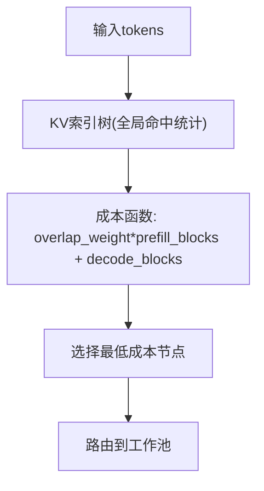
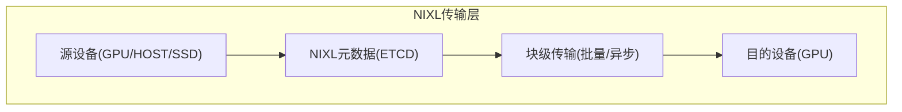
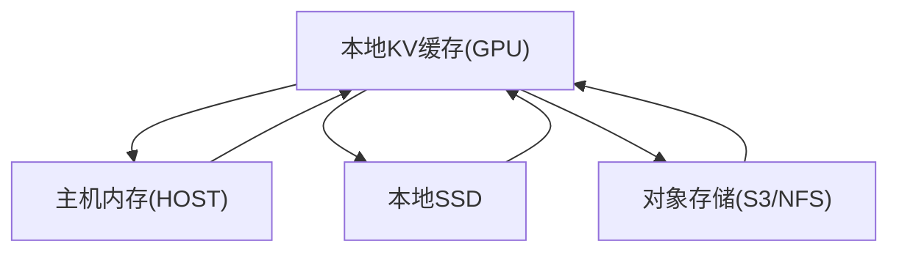
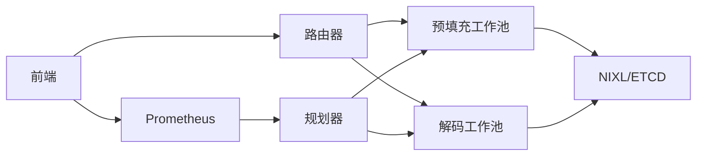

# 为什么选择Dynamo

<cite>
**本文引用的文件**
- [README.md](file://README.md)
- [architecture.md](file://docs/design_docs/architecture.md)
- [dynamo_flow.md](file://docs/design_docs/dynamo_flow.md)
- [kv_cache_routing.md](file://docs/router/kv_cache_routing.md)
- [kvbm_architecture.md](file://docs/kvbm/kvbm_architecture.md)
- [sla_planner.md](file://docs/planner/sla_planner.md)
- [benchmarking.md](file://docs/benchmarks/benchmarking.md)
- [tuning.md](file://docs/performance/tuning.md)
- [main.py](file://components/src/dynamo/frontend/main.py)
- [handler.py](file://components/src/dynamo/global_router/handler.py)
- [planner_connector.py](file://components/src/dynamo/planner/planner_connector.py)
</cite>

## 目录
1. [引言](#引言)
2. [项目结构](#项目结构)
3. [核心组件](#核心组件)
4. [架构总览](#架构总览)
5. [详细组件分析](#详细组件分析)
6. [依赖关系分析](#依赖关系分析)
7. [性能考量](#性能考量)
8. [故障排查指南](#故障排查指南)
9. [结论](#结论)
10. [附录](#附录)

## 引言
本文件聚焦“为什么选择Dynamo”，系统阐述Dynamo如何解决大模型推理的关键难题，并以五大核心优势为主线，结合架构图与性能基准，帮助读者从技术与业务双维度理解Dynamo的价值。

## 项目结构
Dynamo是一个多语言混合（Rust高性能、Python可扩展）的分布式推理框架，围绕“解耦预填充与解码、智能路由KV缓存、动态GPU调度、加速数据传输、KV缓存卸载”构建。其核心由前端、路由器、工作池（预填充/解码）、规划器与存储层组成，支持vLLM、SGLang、TensorRT-LLM等后端引擎。

图示来源
- [dynamo_flow.md](file://docs/design_docs/dynamo_flow.md#L87-L271)
- [main.py](file://components/src/dynamo/frontend/main.py#L329-L469)
- [handler.py](file://components/src/dynamo/global_router/handler.py#L23-L232)

章节来源
- [README.md](file://README.md#L31-L64)
- [architecture.md](file://docs/design_docs/architecture.md#L19-L70)

## 核心组件
- 前端与路由器：提供OpenAI兼容HTTP接口、请求预处理、路由策略（轮询/随机/KV感知），并支持全局路由器进行跨池路由。
- 预填充/解码工作池：分离预填充（高吞吐）与解码（低延迟）阶段，避免计算与内存竞争。
- KV缓存管理与路由：通过KV事件/索引树实现跨节点的KV命中率优化，减少重复计算。
- 规划器：基于SLA的目标（TTFT/ITL）进行预测与自动扩缩容，保障服务质量。
- 存储与传输：通过NIXL实现GPU直连/远程内存共享与块级传输，降低同步与排队开销。

章节来源
- [main.py](file://components/src/dynamo/frontend/main.py#L94-L326)
- [kv_cache_routing.md](file://docs/router/kv_cache_routing.md#L18-L64)
- [sla_planner.md](file://docs/planner/sla_planner.md#L16-L50)

## 架构总览
下图展示了Dynamo在多节点环境中的典型数据流：客户端经前端进入，前端/路由器根据策略选择最优工作池；当需要远程预填充时，通过队列与NIXL将KV缓存块直接传送到解码工作池，随后完成解码与响应。

图示来源
- [dynamo_flow.md](file://docs/design_docs/dynamo_flow.md#L24-L80)
- [kv_cache_routing.md](file://docs/router/kv_cache_routing.md#L132-L160)

章节来源
- [dynamo_flow.md](file://docs/design_docs/dynamo_flow.md#L87-L271)

## 详细组件分析

### 1) 解耦预填充与解码（打破单GPU容量与协调瓶颈）
- 背景：单卡容量不足，张量并行带来节点间同步与负载不均问题。
- 方案：将预填充（长序列、高算力需求）与解码（短上下文、低延迟）解耦到不同工作池，避免互相争抢资源。
- 效果：在多节点场景中显著提升整体吞吐与GPU利用率，降低TTFT与ITL波动。

图示来源
- [architecture.md](file://docs/design_docs/architecture.md#L71-L83)
- [dynamo_flow.md](file://docs/design_docs/dynamo_flow.md#L40-L54)

章节来源
- [architecture.md](file://docs/design_docs/architecture.md#L31-L83)
- [tuning.md](file://docs/performance/tuning.md#L18-L74)

### 2) 动态GPU调度（按需扩缩容，应对波动需求）
- 背景：推理负载波动大，静态分配导致资源浪费或拥塞。
- 方案：SLA驱动的规划器，基于历史与实时指标预测未来负载，自动调整预填充/解码工作副本数。
- 效果：在满足TTFT/ITL目标的前提下，最大化GPU利用率与吞吐。

图示来源
- [sla_planner.md](file://docs/planner/sla_planner.md#L97-L148)
- [planner_connector.py](file://components/src/dynamo/planner/planner_connector.py#L19-L30)

章节来源
- [sla_planner.md](file://docs/planner/sla_planner.md#L1-L204)

### 3) LLM感知请求路由（消除KV重算，提升命中率）
- 背景：传统路由忽略LLM特性，导致频繁KV重算与排队。
- 方案：基于KV事件/前缀树的KV感知路由，综合“预填充块数+解码块数”的成本函数选择最优工作节点。
- 效果：显著降低TTFT与平均请求延迟，提升吞吐。

图示来源
- [kv_cache_routing.md](file://docs/router/kv_cache_routing.md#L427-L470)

章节来源
- [kv_cache_routing.md](file://docs/router/kv_cache_routing.md#L1-L200)

### 4) 加速数据传输（NIXL块传输，降低同步与排队）
- 背景：分布式推理需要高效的数据移动，传统库难以适配动态拓扑。
- 方案：NIXL抽象统一多种内存/存储层级，支持块级批量传输与GPU直连。
- 效果：减少预填充到解码的等待时间，提升端到端吞吐。

图示来源
- [kvbm_architecture.md](file://docs/kvbm/kvbm_architecture.md#L20-L40)
- [dynamo_flow.md](file://docs/design_docs/dynamo_flow.md#L76-L81)

章节来源
- [kvbm_architecture.md](file://docs/kvbm/kvbm_architecture.md#L1-L40)
- [dynamo_flow.md](file://docs/design_docs/dynamo_flow.md#L76-L86)

### 5) KV缓存卸载（多层内存协同，突破显存瓶颈）
- 背景：KV缓存占用巨大，单卡显存难以承载长上下文。
- 方案：KVBM在GPU/HBM/CPU/SSD/对象存储之间进行块级迁移与复用。
- 效果：在高并发与长上下文场景下仍能保持较低TTFT与稳定ITL。

图示来源
- [kvbm_architecture.md](file://docs/kvbm/kvbm_architecture.md#L20-L40)

章节来源
- [kvbm_architecture.md](file://docs/kvbm/kvbm_architecture.md#L1-L40)

## 依赖关系分析
- 组件内聚与耦合：前端/路由器与工作池通过统一请求平面（TCP/HTTP/NATS）交互；KV感知路由依赖NATS事件与ETCD元数据；规划器通过Prometheus抓取前端指标。
- 外部依赖：etcd（服务发现）、NATS（事件/消息）、容器/编排平台（Kubernetes）。
- 潜在环路：路由与传输为纯数据通路，未见循环依赖；规划器仅读取指标并下发指令，无反向耦合。

图示来源
- [main.py](file://components/src/dynamo/frontend/main.py#L364-L371)
- [sla_planner.md](file://docs/planner/sla_planner.md#L16-L32)

章节来源
- [main.py](file://components/src/dynamo/frontend/main.py#L25-L51)
- [sla_planner.md](file://docs/planner/sla_planner.md#L16-L32)

## 性能考量
- 解耦收益：在多节点部署中，解耦预填充与解码可获得显著吞吐增益，且更易平衡TTFT与ITL。
- 路由优化：KV感知路由在大规模请求下可将TTFT与平均请求延迟显著降低。
- 卸载策略：CPU/SSD/对象存储的KV缓存复用可有效缓解显存压力，提升系统整体吞吐。
- 自动扩缩容：SLA规划器通过预测与插值，避免过度或不足配置，提升资源利用率与SLA达成率。
- 基准方法：使用AIPerf进行对比实验，覆盖并发度、序列长度、模型规模与硬件配置，生成可视化报告。

章节来源
- [architecture.md](file://docs/design_docs/architecture.md#L71-L103)
- [benchmarking.md](file://docs/benchmarks/benchmarking.md#L16-L75)
- [tuning.md](file://docs/performance/tuning.md#L18-L149)

## 故障排查指南
- 服务发现与消息：确认etcd/NATS可用性与连接参数；在本地开发可使用文件存储键值与禁用KV事件发布。
- 路由模式：若启用KV感知路由，确保后端开启KV事件；否则可切换为轮询/随机或禁用KV事件。
- 扩缩容：检查规划器指标采集端点与抓取间隔，确保调整周期合理，避免频繁变更。
- 全局路由：核对池选择策略与命名空间映射，确保请求正确路由至对应池。

章节来源
- [main.py](file://components/src/dynamo/frontend/main.py#L226-L326)
- [kv_cache_routing.md](file://docs/router/kv_cache_routing.md#L46-L64)
- [sla_planner.md](file://docs/planner/sla_planner.md#L152-L204)

## 结论
Dynamo通过“解耦预填充与解码、动态GPU调度、LLM感知路由、加速数据传输、KV缓存卸载”五大能力，系统化解决了单GPU容量限制、张量并行协调挑战与分布式推理性能瓶颈。依托模块化架构与SLA驱动的自动化运维，Dynamo在多节点环境下实现了更高的吞吐、更低的延迟与更强的弹性，是面向生产的大模型推理首选方案。

## 附录
- 快速开始与部署：参考本地快速启动与Kubernetes部署说明，按需选择后端引擎与拓扑。
- 基准工具：使用AIPerf进行对比评测，支持客户端/服务端两种方式，便于在不同场景下评估性能差异。

章节来源
- [README.md](file://README.md#L91-L203)
- [benchmarking.md](file://docs/benchmarks/benchmarking.md#L22-L542)