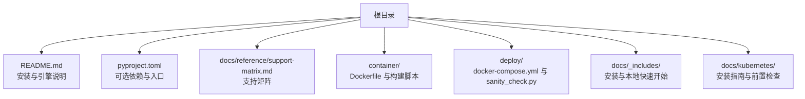
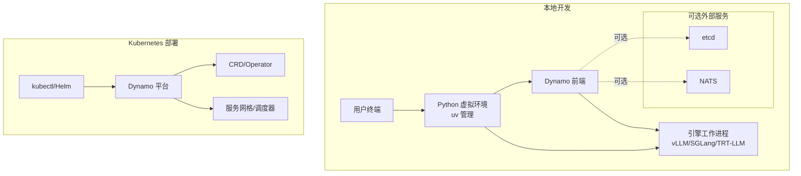
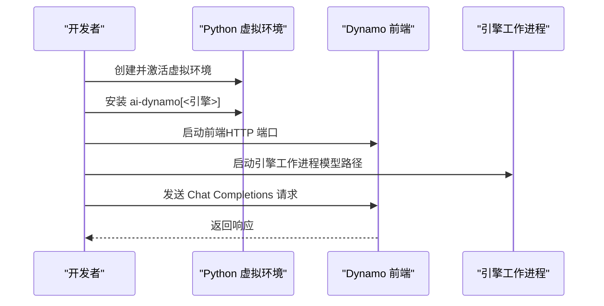
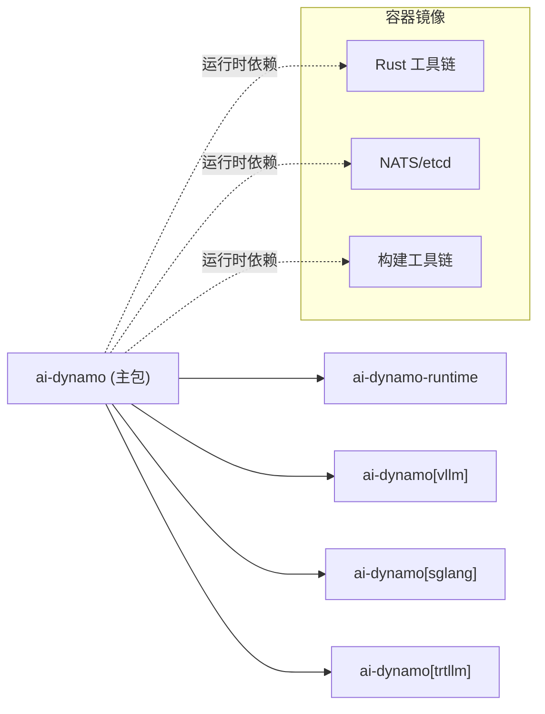

# 快速开始

<cite>
**本文引用的文件**
- [README.md](file://README.md)
- [pyproject.toml](file://pyproject.toml)
- [docs/reference/support-matrix.md](file://docs/reference/support-matrix.md)
- [container/Dockerfile](file://container/Dockerfile)
- [container/build.sh](file://container/build.sh)
- [container/deps/requirements.txt](file://container/deps/requirements.txt)
- [deploy/docker-compose.yml](file://deploy/docker-compose.yml)
- [deploy/sanity_check.py](file://deploy/sanity_check.py)
- [docs/_includes/install.rst](file://docs/_includes/install.rst)
- [docs/_includes/quick_start_local.rst](file://docs/_includes/quick_start_local.rst)
- [docs/kubernetes/installation_guide.md](file://docs/kubernetes/installation_guide.md)
- [deploy/pre-deployment/pre-deployment-check.sh](file://deploy/pre-deployment/pre-deployment-check.sh)
</cite>

## 目录
1. [简介](#简介)
2. [项目结构](#项目结构)
3. [核心组件](#核心组件)
4. [架构总览](#架构总览)
5. [详细组件分析](#详细组件分析)
6. [依赖关系分析](#依赖关系分析)
7. [性能考虑](#性能考虑)
8. [故障排除指南](#故障排除指南)
9. [结论](#结论)
10. [附录](#附录)

## 简介
本指南面向首次接触 NVIDIA Dynamo 的用户，提供从零开始的完整安装与部署流程，覆盖系统要求、依赖安装、Python 环境配置、推理引擎选择与安装、本地开发环境搭建、命令行示例与验证步骤，并给出常见问题排查建议。通过本指南，您将能够在单机环境中成功启动第一个 Dynamo 实例，并为进一步的生产级部署打下基础。

## 项目结构
Dynamo 仓库采用多模块组织方式：核心运行时与组件位于 components 与 lib 目录；容器镜像构建与依赖在 container 目录；部署与运维工具位于 deploy 与 docs 目录；示例与配方位于 examples 与 recipes 目录。对于快速开始，以下目录与文件最为相关：
- 安装与引擎选择：README.md、pyproject.toml、docs/reference/support-matrix.md
- 本地开发与依赖：container/Dockerfile、container/build.sh、container/deps/requirements.txt
- 本地验证与外部服务：deploy/docker-compose.yml、deploy/sanity_check.py
- Kubernetes 部署前置检查：docs/kubernetes/installation_guide.md、deploy/pre-deployment/pre-deployment-check.sh

图表来源
- [README.md](file://README.md#L91-L181)
- [pyproject.toml](file://pyproject.toml#L50-L67)
- [docs/reference/support-matrix.md](file://docs/reference/support-matrix.md#L1-L160)
- [container/Dockerfile](file://container/Dockerfile#L1-L120)
- [deploy/docker-compose.yml](file://deploy/docker-compose.yml#L1-L36)
- [docs/_includes/install.rst](file://docs/_includes/install.rst#L1-L45)
- [docs/_includes/quick_start_local.rst](file://docs/_includes/quick_start_local.rst#L1-L46)
- [docs/kubernetes/installation_guide.md](file://docs/kubernetes/installation_guide.md#L1-L130)

章节来源
- [README.md](file://README.md#L91-L181)
- [pyproject.toml](file://pyproject.toml#L50-L67)
- [docs/reference/support-matrix.md](file://docs/reference/support-matrix.md#L1-L160)
- [container/Dockerfile](file://container/Dockerfile#L1-L120)
- [deploy/docker-compose.yml](file://deploy/docker-compose.yml#L1-L36)
- [docs/_includes/install.rst](file://docs/_includes/install.rst#L1-L45)
- [docs/_includes/quick_start_local.rst](file://docs/_includes/quick_start_local.rst#L1-L46)
- [docs/kubernetes/installation_guide.md](file://docs/kubernetes/installation_guide.md#L1-L130)

## 核心组件
- 推理引擎（可选）：vLLM、SGLang、TensorRT-LLM。通过可选依赖与入口点进行安装与调用。
- 运行时与前端：OpenAI 兼容前端、路由与工作进程等组件。
- 外部服务（可选）：etcd、NATS（用于服务发现与事件发布），或本地文件存储模式以避免外部依赖。
- 验证工具：sanity_check.py 提供系统资源、框架、CUDA 等诊断能力。

章节来源
- [pyproject.toml](file://pyproject.toml#L50-L67)
- [README.md](file://README.md#L211-L243)
- [deploy/sanity_check.py](file://deploy/sanity_check.py#L1-L150)

## 架构总览
Dynamo 支持多种部署形态：本地单机开发、Kubernetes 生产部署。本地开发推荐使用 uv 包管理器与 Python 虚拟环境，按需安装对应引擎的可选依赖。生产部署可借助 Helm 图表与容器镜像。

图表来源
- [README.md](file://README.md#L137-L181)
- [docs/kubernetes/installation_guide.md](file://docs/kubernetes/installation_guide.md#L133-L206)

## 详细组件分析

### 系统要求与平台兼容性
- 操作系统与架构：Ubuntu 22.04/24.04 x86_64/ARM64；容器镜像支持多架构。
- GPU 与驱动：支持 Hopper/Ada/Lovelace/Ampere 架构；CUDA 版本随 Dynamo 版本变化。
- Python 版本：项目要求 Python >= 3.10；部分特性（如 KV Block Manager）仅在特定版本与发行版上受支持。

章节来源
- [docs/reference/support-matrix.md](file://docs/reference/support-matrix.md#L40-L114)
- [pyproject.toml](file://pyproject.toml#L14-L14)

### 依赖安装与 Python 环境配置
- 推荐使用 uv 作为 Python 包管理器，便于快速创建与激活虚拟环境。
- 安装 Python 开发头文件以满足后端引擎的 JIT 编译需求。
- 创建虚拟环境并安装指定引擎的可选依赖（ai-dynamo[vllm]、ai-dynamo[sglang]、ai-dynamo[trtllm]）。

章节来源
- [README.md](file://README.md#L96-L124)
- [docs/_includes/install.rst](file://docs/_includes/install.rst#L1-L45)

### 推理引擎选择与安装
- vLLM：适合广泛功能覆盖；默认启用 KV 事件发布，本地开发可禁用以避免 NATS。
- SGLang：适合高吞吐；与 NIXL 集成良好。
- TensorRT-LLM：追求极致性能；需注意与 Python 版本与 CUDA 的兼容性。

章节来源
- [README.md](file://README.md#L211-L224)
- [pyproject.toml](file://pyproject.toml#L50-L67)
- [docs/reference/support-matrix.md](file://docs/reference/support-matrix.md#L26-L38)

### 本地开发环境搭建
- 使用 uv 创建虚拟环境并安装引擎依赖。
- 如需最小化依赖，可使用本地文件存储模式（--store-kv file）避免 etcd；对 vLLM，可在本地禁用 KV 事件发布以避免 NATS。
- 启动前端与引擎工作进程，发送请求进行验证。

图表来源
- [README.md](file://README.md#L137-L174)
- [docs/_includes/quick_start_local.rst](file://docs/_includes/quick_start_local.rst#L25-L44)

章节来源
- [README.md](file://README.md#L137-L174)
- [docs/_includes/quick_start_local.rst](file://docs/_includes/quick_start_local.rst#L1-L46)

### 外部服务与消息中间件
- 本地开发可使用 docker-compose 启动 etcd 与 NATS；也可通过本地文件存储模式避免外部依赖。
- 在分布式或启用 KV-aware 路由场景中，NATS 与 etcd 为可选但推荐的基础设施。

章节来源
- [deploy/docker-compose.yml](file://deploy/docker-compose.yml#L1-L36)
- [README.md](file://README.md#L225-L243)

### 验证与诊断
- 使用 sanity_check.py 对系统资源、CUDA、框架、Dynamo 组件进行快速诊断。
- 可选输出 JSON，便于问题上报与自动化集成。

章节来源
- [deploy/sanity_check.py](file://deploy/sanity_check.py#L1-L150)

### Kubernetes 部署前置检查
- 验证 kubectl 连通性、默认 StorageClass、GPU 节点与 GPU Operator 状态。
- 该脚本帮助在生产部署前识别常见集群问题。

章节来源
- [docs/kubernetes/installation_guide.md](file://docs/kubernetes/installation_guide.md#L119-L128)
- [deploy/pre-deployment/pre-deployment-check.sh](file://deploy/pre-deployment/pre-deployment-check.sh#L1-L120)

## 依赖关系分析
Dynamo 的 Python 层通过可选依赖引入不同推理引擎；容器镜像层则统一安装 Rust、NATS、etcd 以及构建工具链，确保跨平台一致性。

图表来源
- [pyproject.toml](file://pyproject.toml#L14-L29)
- [pyproject.toml](file://pyproject.toml#L50-L67)
- [container/Dockerfile](file://container/Dockerfile#L68-L104)

章节来源
- [pyproject.toml](file://pyproject.toml#L14-L29)
- [pyproject.toml](file://pyproject.toml#L50-L67)
- [container/Dockerfile](file://container/Dockerfile#L68-L104)

## 性能考虑
- 选择合适的引擎与 CUDA 版本以匹配硬件与驱动版本。
- 在本地开发中，可通过禁用 KV 事件发布减少外部依赖带来的开销。
- 使用容器镜像内置的优化工具链与缓存机制（如 sccache）提升构建效率。

章节来源
- [docs/reference/support-matrix.md](file://docs/reference/support-matrix.md#L78-L114)
- [README.md](file://README.md#L155-L155)
- [container/Dockerfile](file://container/Dockerfile#L225-L238)

## 故障排除指南
- Python 版本不兼容：确认 Python >= 3.10；部分特性仅在特定版本上受支持。
- CUDA/驱动不匹配：参考支持矩阵中的 CUDA 与驱动版本要求。
- 无法连接 Kubernetes 集群：使用预部署检查脚本定位问题。
- 缺少 Python 开发头文件：安装 python3-dev 后重试。
- 本地无外部依赖：使用 --store-kv file；对 vLLM 添加 --kv-events-config '{"enable_kv_cache_events": false}'。

章节来源
- [docs/reference/support-matrix.md](file://docs/reference/support-matrix.md#L78-L114)
- [docs/kubernetes/installation_guide.md](file://docs/kubernetes/installation_guide.md#L119-L128)
- [README.md](file://README.md#L104-L111)
- [README.md](file://README.md#L155-L155)

## 结论
通过本指南，您已了解 Dynamo 的系统要求、依赖安装、引擎选择与本地开发流程，并掌握了验证与故障排除的基本方法。建议在完成本地验证后，结合 Kubernetes 安装指南进行生产级部署，并持续关注支持矩阵与版本更新。

## 附录
- 本地快速开始命令示例与验证步骤可参考本地快速开始与安装包含文件。
- 生产部署可参考 Kubernetes 安装指南与前置检查脚本。

章节来源
- [docs/_includes/quick_start_local.rst](file://docs/_includes/quick_start_local.rst#L1-L46)
- [docs/_includes/install.rst](file://docs/_includes/install.rst#L1-L45)
- [docs/kubernetes/installation_guide.md](file://docs/kubernetes/installation_guide.md#L133-L206)