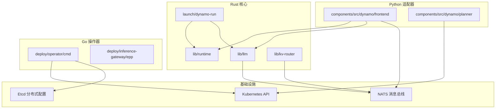
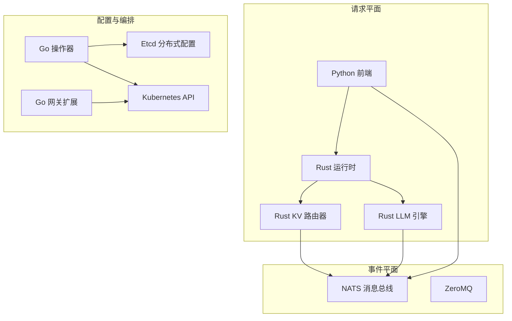
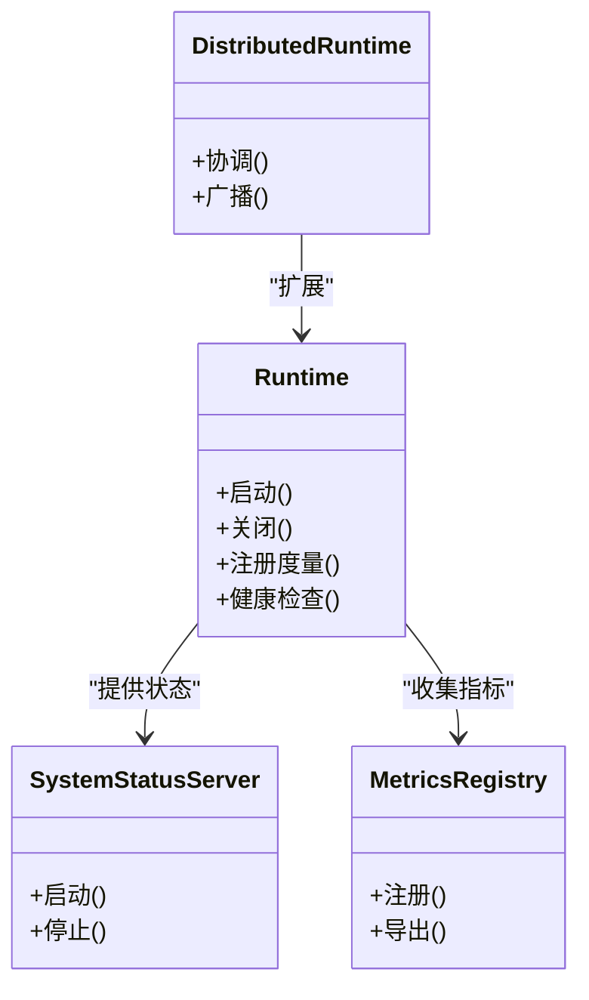
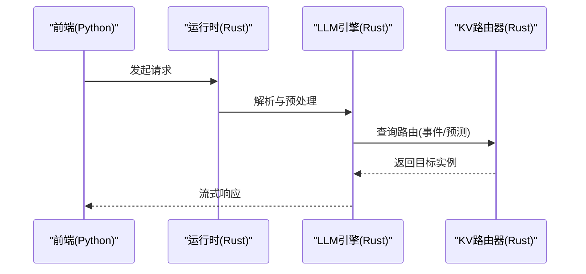
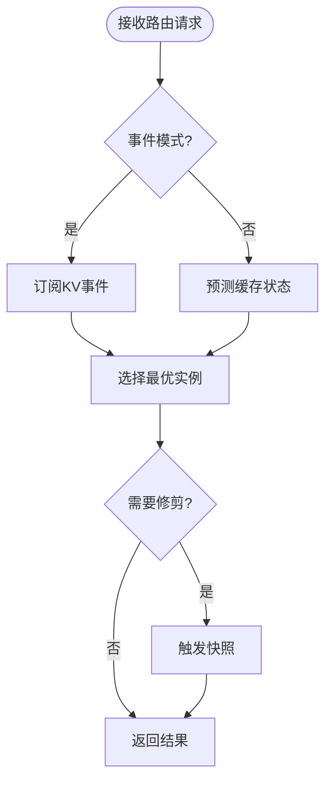
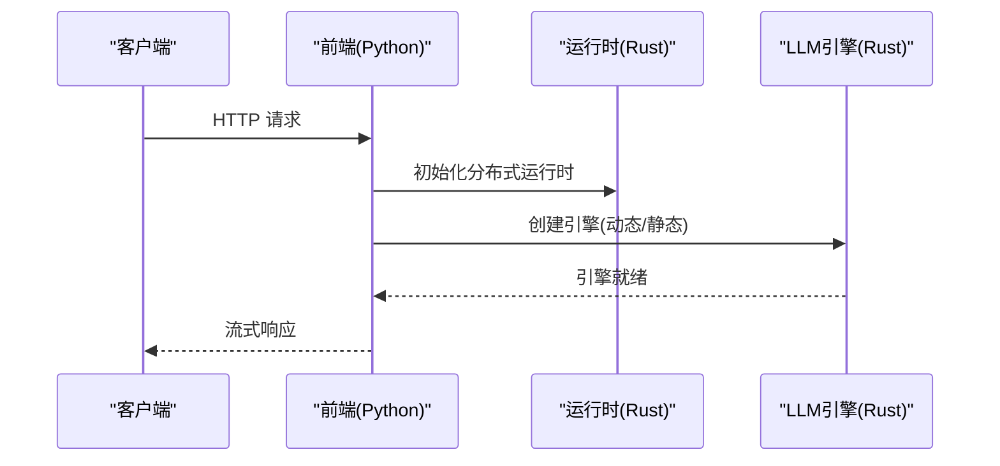
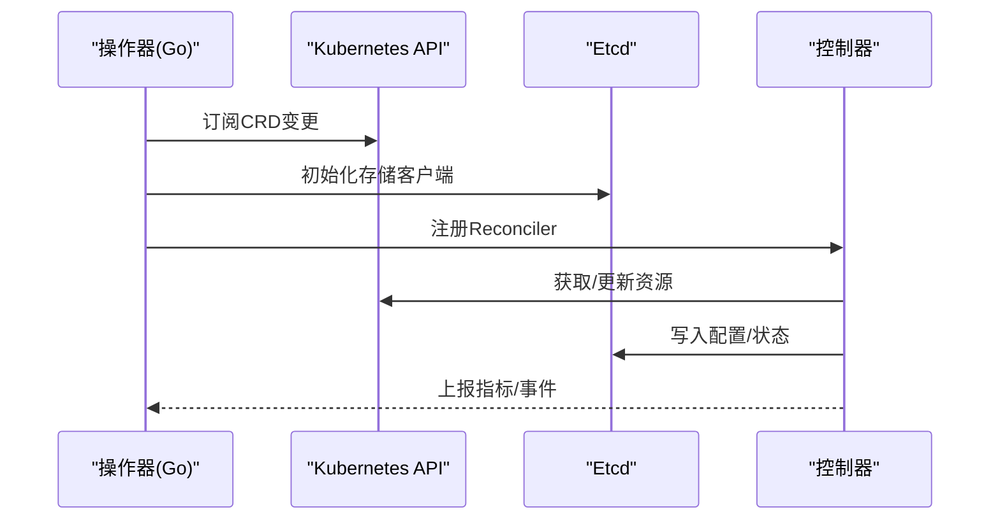
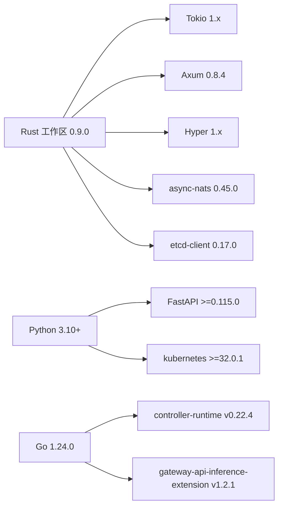

# 技术栈介绍

<cite>
**本文档引用的文件**
- [Cargo.toml](file://Cargo.toml)
- [pyproject.toml](file://pyproject.toml)
- [lib/runtime/Cargo.toml](file://lib/runtime/Cargo.toml)
- [lib/llm/Cargo.toml](file://lib/llm/Cargo.toml)
- [lib/kv-router/Cargo.toml](file://lib/kv-router/Cargo.toml)
- [launch/dynamo-run/Cargo.toml](file://launch/dynamo-run/Cargo.toml)
- [deploy/operator/cmd/main.go](file://deploy/operator/cmd/main.go)
- [deploy/inference-gateway/epp/go.mod](file://deploy/inference-gateway/epp/go.mod)
- [deploy/utils/kubernetes.py](file://deploy/utils/kubernetes.py)
- [lib/runtime/src/lib.rs](file://lib/runtime/src/lib.rs)
- [lib/llm/src/lib.rs](file://lib/llm/src/lib.rs)
- [launch/dynamo-run/src/main.rs](file://launch/dynamo-run/src/main.rs)
- [components/src/dynamo/frontend/main.py](file://components/src/dynamo/frontend/main.py)
- [components/src/dynamo/planner/kube.py](file://components/src/dynamo/planner/kube.py)
</cite>

## 目录
1. [引言](#引言)
2. [项目结构](#项目结构)
3. [核心组件](#核心组件)
4. [架构总览](#架构总览)
5. [详细组件分析](#详细组件分析)
6. [依赖关系分析](#依赖关系分析)
7. [性能考量](#性能考量)
8. [故障排除指南](#故障排除指南)
9. [结论](#结论)

## 引言
本文件系统化介绍Dynamo的技术栈与架构设计，重点阐述其多语言混合架构：以Rust构建高性能核心组件（运行时、KV路由器、LLM引擎），以Python提供后端适配器与CLI工具，以Go实现Kubernetes操作器与网关扩展。同时，文档解析关键依赖库与技术选型（Tokio异步运行时、Axum Web框架、NATS消息传递、Etcd分布式配置存储等），给出版本兼容性信息与依赖关系图，帮助读者快速理解Dynamo的整体技术路线与实现要点。

## 项目结构
Dynamo采用多语言混合的分层组织方式：
- Rust工作区（lib/*）：核心运行时、LLM引擎、KV路由器、内存管理、令牌处理等
- Python包（components/src/dynamo/*）：前端服务、规划器、适配器与CLI工具
- Go模块（deploy/operator、deploy/inference-gateway/epp）：Kubernetes控制器、网关扩展
- 基准测试与示例（benchmarks、examples）：性能评测与使用示例
- 部署与可观测性（deploy、docs）：Helm图表、Kubernetes部署、监控告警

**图表来源**
- [Cargo.toml](file://Cargo.toml#L4-L32)
- [lib/runtime/Cargo.toml](file://lib/runtime/Cargo.toml#L23-L68)
- [lib/llm/Cargo.toml](file://lib/llm/Cargo.toml#L41-L85)
- [lib/kv-router/Cargo.toml](file://lib/kv-router/Cargo.toml#L18-L33)
- [launch/dynamo-run/Cargo.toml](file://launch/dynamo-run/Cargo.toml#L25-L45)
- [deploy/operator/cmd/main.go](file://deploy/operator/cmd/main.go#L30-L73)
- [deploy/inference-gateway/epp/go.mod](file://deploy/inference-gateway/epp/go.mod#L1-L10)

**章节来源**
- [Cargo.toml](file://Cargo.toml#L4-L32)
- [pyproject.toml](file://pyproject.toml#L4-L45)

## 核心组件
- 运行时（Rust）：提供分布式运行时、健康检查、系统状态服务、度量注册、传输层抽象、工作池与生命周期管理等能力，是所有组件的运行基础。
- LLM引擎（Rust）：封装HTTP/GRPC接口、模型发现与加载、KV路由集成、预处理器、令牌化、多后端适配（vLLM、TRT-LLM、SGLang等）、媒体处理与块管理等。
- KV路由器（Rust）：基于前缀树的KV缓存路由，支持事件驱动与预测模式、树修剪与快照、负载均衡策略与复制同步。
- 前端（Python）：OpenAI风格HTTP服务、自动发现、预处理器、路由器（轮询、随机、KV模式），支持TLS、指标导出与交互式聊天。
- 规划器（Python）：Kubernetes客户端封装，查询Dynamo Graph Deployment状态、更新副本数、等待就绪等。
- 操作器（Go）：基于controller-runtime的Kubernetes控制器，负责Dynamo CRD的协调、命名空间范围控制、Webhook校验、Etcd存储、资源计数与指标上报。
- 网关扩展（Go）：Gateway API推理扩展的插件，配合Inference Gateway实现请求路由与策略执行。

**章节来源**
- [lib/runtime/src/lib.rs](file://lib/runtime/src/lib.rs#L20-L62)
- [lib/llm/src/lib.rs](file://lib/llm/src/lib.rs#L13-L46)
- [components/src/dynamo/frontend/main.py](file://components/src/dynamo/frontend/main.py#L1-L100)
- [components/src/dynamo/planner/kube.py](file://components/src/dynamo/planner/kube.py#L40-L188)
- [deploy/operator/cmd/main.go](file://deploy/operator/cmd/main.go#L129-L695)
- [deploy/inference-gateway/epp/go.mod](file://deploy/inference-gateway/epp/go.mod#L1-L10)

## 架构总览
Dynamo通过多语言协作实现高性能推理平台：
- Rust负责高并发、低延迟的核心路径（Tokio异步运行时、Axum Web框架、NATS消息传递）
- Python提供易用的适配器与CLI工具，便于快速集成与运维
- Go负责与Kubernetes生态深度集成，提供控制器、Webhook与网关扩展
- Etcd作为分布式配置与状态存储，支撑跨节点一致性与发现

**图表来源**
- [lib/runtime/Cargo.toml](file://lib/runtime/Cargo.toml#L23-L68)
- [lib/llm/Cargo.toml](file://lib/llm/Cargo.toml#L122-L130)
- [components/src/dynamo/frontend/main.py](file://components/src/dynamo/frontend/main.py#L361-L368)
- [deploy/operator/cmd/main.go](file://deploy/operator/cmd/main.go#L454-L464)

## 详细组件分析

### Rust 运行时（dynamo-runtime）
- 职责：分布式运行时、健康检查、系统状态服务、度量注册、传输层抽象、工作池与生命周期管理
- 关键特性：Tokio全功能特性、Prometheus指标、OpenTelemetry链路追踪、HTTP/2服务器、Axum集成
- 依赖：Tokio、Axum、Hyper、Tracing、Etcd客户端、NATS客户端、ZMQ等

**图表来源**
- [lib/runtime/src/lib.rs](file://lib/runtime/src/lib.rs#L20-L62)
- [lib/runtime/Cargo.toml](file://lib/runtime/Cargo.toml#L23-L68)

**章节来源**
- [lib/runtime/src/lib.rs](file://lib/runtime/src/lib.rs#L20-L62)
- [lib/runtime/Cargo.toml](file://lib/runtime/Cargo.toml#L23-L68)

### Rust LLM 引擎（dynamo-llm）
- 职责：HTTP/GRPC服务、模型发现与加载、KV路由集成、预处理器、令牌化、多后端适配
- 关键特性：HTTP服务、gRPC服务、OpenAPI/Swagger、媒体处理（图像/视频）、块管理（CUDA/NIXL）
- 依赖：Tokio、Axum、Hyper、Tonic、Utoipa、Tokenizers、Candle、Rayon等

**图表来源**
- [lib/llm/src/lib.rs](file://lib/llm/src/lib.rs#L13-L46)
- [lib/llm/Cargo.toml](file://lib/llm/Cargo.toml#L122-L130)

**章节来源**
- [lib/llm/src/lib.rs](file://lib/llm/src/lib.rs#L13-L46)
- [lib/llm/Cargo.toml](file://lib/llm/Cargo.toml#L122-L130)

### Rust KV路由器（dynamo-kv-router）
- 职责：基于前缀树的KV缓存路由，支持事件驱动与预测模式、树修剪与快照
- 关键特性：Radix树、活跃块跟踪、输出块跟踪、复制同步、快照阈值与修剪策略
- 依赖：Tokio、Prometheus、xxHash、Tracing等

**图表来源**
- [lib/kv-router/Cargo.toml](file://lib/kv-router/Cargo.toml#L18-L33)

**章节来源**
- [lib/kv-router/Cargo.toml](file://lib/kv-router/Cargo.toml#L18-L33)

### Python 前端（dynamo.frontend）
- 职责：OpenAI风格HTTP服务、自动发现、预处理器、路由器（轮询、随机、KV模式）
- 关键特性：TLS支持、指标前缀、NATS/HTTP/TCP请求平面、NATS/ZMQ事件平面
- 依赖：FastAPI、uvloop、kubernetes、prometheus_client等

**图表来源**
- [components/src/dynamo/frontend/main.py](file://components/src/dynamo/frontend/main.py#L329-L469)

**章节来源**
- [components/src/dynamo/frontend/main.py](file://components/src/dynamo/frontend/main.py#L1-L469)

### Python 规划器（dynamo.planner）
- 职责：Kubernetes API封装、Dynamo Graph Deployment状态查询、副本数更新、就绪等待
- 关键特性：DGDSA缩放子资源优先、回退到DGD补丁、就绪条件判断、超时控制

**章节来源**
- [components/src/dynamo/planner/kube.py](file://components/src/dynamo/planner/kube.py#L40-L188)

### Go 操作器（deploy/operator/cmd）
- 职责：Dynamo CRD协调、命名空间范围控制、Webhook校验、Etcd存储、资源计数与指标上报
- 关键特性：controller-runtime、Lease机制、多集群/受限命名空间模式、动态RBAC、Docker镜像密钥索引

**图表来源**
- [deploy/operator/cmd/main.go](file://deploy/operator/cmd/main.go#L560-L621)

**章节来源**
- [deploy/operator/cmd/main.go](file://deploy/operator/cmd/main.go#L129-L695)

### Go 网关扩展（deploy/inference-gateway/epp）
- 职责：Gateway API推理扩展插件，与Inference Gateway协同实现请求路由与策略执行
- 依赖：controller-runtime、gateway-api-inference-extension等

**章节来源**
- [deploy/inference-gateway/epp/go.mod](file://deploy/inference-gateway/epp/go.mod#L1-L10)

## 依赖关系分析

### 版本与兼容性
- Rust工作区版本：0.9.0，统一edition 2024
- Tokio：1.x（full特性），用于异步运行时与任务调度
- Axum：0.8.4（固定版本），用于HTTP服务与OpenAPI集成
- Hyper/Hyper-Util：1.x系列，支持HTTP/2与服务器特性
- NATS：async-nats 0.45.0，支持服务特性；ZeroMQ用于事件平面
- Etcd：etcd-client 0.17.0，启用TLS特性
- Python：>=3.10，FastAPI>=0.115.0，kubernetes>=32.0.1
- Go：1.24.0，controller-runtime v0.22.4，gateway-api-inference-extension v1.2.1

**图表来源**
- [Cargo.toml](file://Cargo.toml#L35-L128)
- [pyproject.toml](file://pyproject.toml#L14-L29)
- [deploy/inference-gateway/epp/go.mod](file://deploy/inference-gateway/epp/go.mod#L3-L8)

**章节来源**
- [Cargo.toml](file://Cargo.toml#L35-L128)
- [pyproject.toml](file://pyproject.toml#L14-L29)
- [deploy/inference-gateway/epp/go.mod](file://deploy/inference-gateway/epp/go.mod#L3-L8)

### 多语言耦合与边界
- Rust核心（运行时/LLM/KV）通过NATS/ZeroMQ与事件平面交互，通过HTTP/GRPC与前端/规划器通信
- Python前端负责用户入口与自动发现，调用Rust运行时完成实际推理
- Go操作器与网关扩展负责Kubernetes生态集成，读写Etcd并协调CRD状态
- 各语言间通过标准协议（HTTP/TCP/NATS/ZMQ）与共享配置（Etcd）解耦

**章节来源**
- [components/src/dynamo/frontend/main.py](file://components/src/dynamo/frontend/main.py#L361-L368)
- [lib/llm/Cargo.toml](file://lib/llm/Cargo.toml#L122-L130)
- [lib/runtime/Cargo.toml](file://lib/runtime/Cargo.toml#L23-L68)

## 性能考量
- 异步与并发：Tokio全功能特性确保高并发I/O与CPU密集任务并行；Rust所有权模型避免运行时开销
- 事件驱动：NATS与ZeroMQ在事件平面提供低延迟发布/订阅，减少中心化瓶颈
- KV路由优化：Radix树与活跃块跟踪降低路由决策成本；快照与修剪控制内存占用
- HTTP/2与TLS：Hyper支持HTTP/2与安全传输，提升吞吐与安全性
- Python侧：uvloop替代默认事件循环，提升网络I/O性能

[本节为通用指导，无需具体文件分析]

## 故障排除指南
- NATS连接问题：确认请求平面与事件平面配置一致，KV模式下需启用NATS事件或复制同步
- Etcd连通性：操作器初始化时创建etcd客户端，若连接失败需检查地址与TLS配置
- Kubernetes权限：受限命名空间模式需正确配置RBAC与Lease机制，避免资源不可见
- 超时与重试：前端与规划器均设置超时参数，必要时调整等待时间与重试策略
- 日志与指标：启用调试级别日志与Prometheus指标，结合OpenTelemetry追踪定位问题

**章节来源**
- [components/src/dynamo/frontend/main.py](file://components/src/dynamo/frontend/main.py#L361-L368)
- [deploy/operator/cmd/main.go](file://deploy/operator/cmd/main.go#L454-L464)
- [components/src/dynamo/planner/kube.py](file://components/src/dynamo/planner/kube.py#L156-L187)

## 结论
Dynamo通过Rust、Python、Go三语种协同，构建了高性能、可扩展、可观测的分布式推理平台。Rust提供底层性能与可靠性，Python提供易用性与生态适配，Go保障与Kubernetes的深度集成。以Tokio、Axum、NATS、Etcd为核心依赖，Dynamo在多租户、多后端、多协议场景下具备良好的可维护性与演进空间。