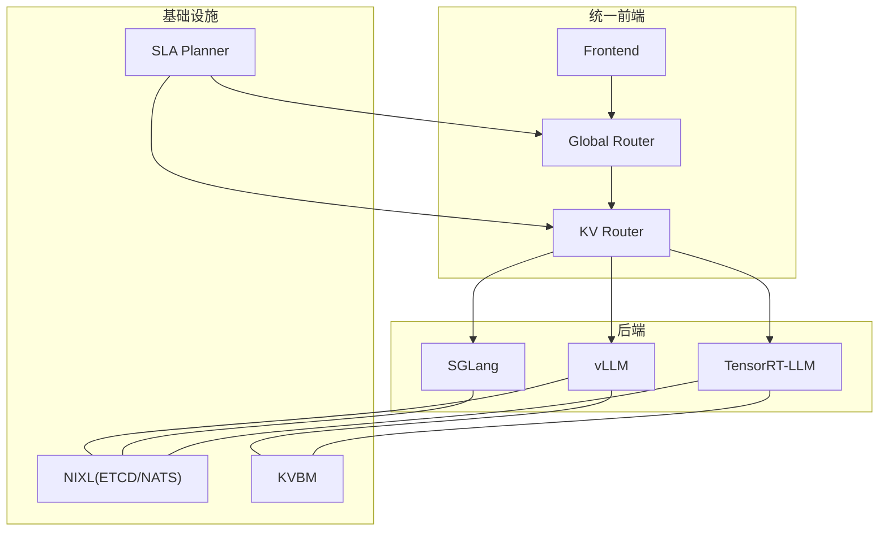
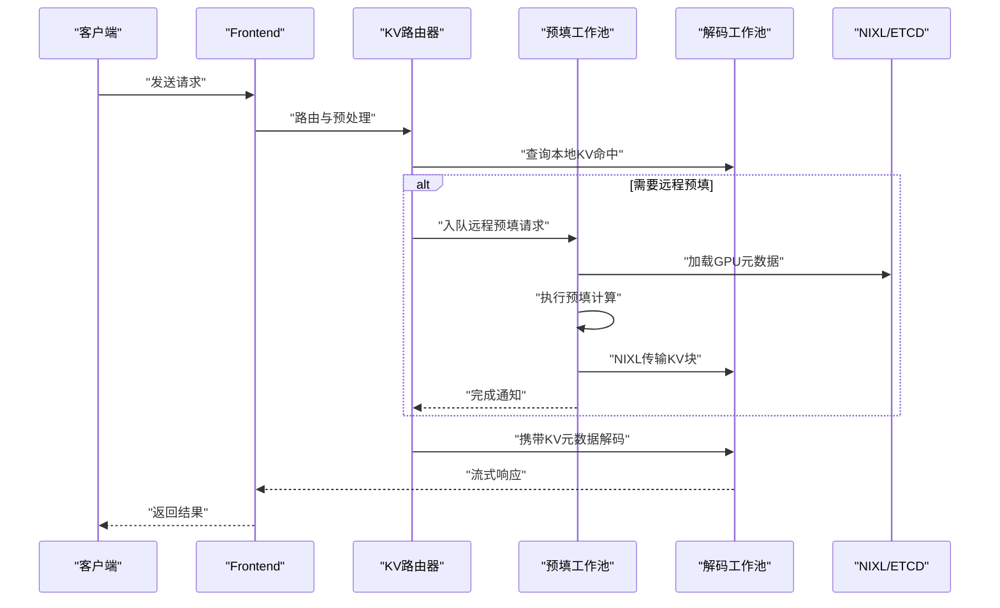
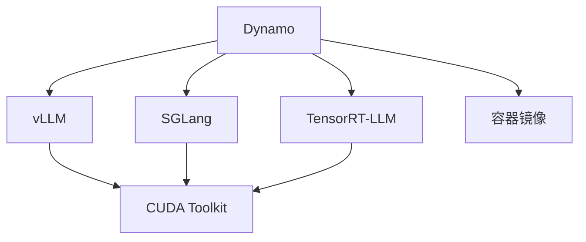

# 支持矩阵

<cite>
**本文引用的文件**
- [support-matrix.md](file://docs/reference/support-matrix.md)
- [support-matrix.md](file://fern/pages/reference/support-matrix.md)
- [kv_cache_routing.md](file://docs/router/kv_cache_routing.md)
- [planner_intro.rst](file://docs/planner/planner_intro.rst)
- [sla_planner.md](file://docs/planner/sla_planner.md)
- [dynamo_flow.md](file://docs/design_docs/dynamo_flow.md)
- [kvbm_architecture.md](file://docs/kvbm/kvbm_architecture.md)
- [kvbm_intro.rst](file://docs/kvbm/kvbm_intro.rst)
- [vllm_speculative_decoding.md](file://docs/backends/vllm/speculative_decoding.md)
- [vllm_handlers.py](file://components/src/dynamo/vllm/handlers.py)
- [trtllm_engine.py](file://components/src/dynamo/trtllm/engine.py)
- [trtllm_config_modifier.py](file://benchmarks/profiler/utils/config_modifiers/trtllm.py)
- [trtllm_router_test.py](file://tests/router/test_router_e2e_with_trtllm.py)
- [sglang_disagg_script.sh](file://examples/backends/sglang/slurm_jobs/scripts/gb200-fp4/disagg/8k1k-low-latency.sh)
- [kvbm_connector_leader.py](file://lib/bindings/kvbm/python/kvbm/trtllm_integration/connector/kvbm_connector_leader.py)
- [kvbm_vllm_bindings.rs](file://lib/bindings/kvbm/src/block_manager/vllm.rs)
- [tool_calling_xml_parser.rs](file://lib/parsers/src/tool_calling/xml/parser.rs)
- [lora_cache.rs](file://lib/llm/src/lora/cache.rs)
- [prefill_router.rs](file://lib/llm/src/kv_router/prefill_router.rs)
- [planner_defaults.py](file://components/src/dynamo/planner/defaults.py)
- [planner_core.py](file://components/src/dynamo/planner/utils/planner_core.py)
- [planner_sla.py](file://components/src/dynamo/planner/planner_sla.py)
- [test_determinism_agg.py](file://tests/kvbm_integration/test_determinism_agg.py)
- [README.md](file://container/README.md)
</cite>

## 目录
1. [简介](#简介)
2. [项目结构](#项目结构)
3. [核心组件](#核心组件)
4. [架构总览](#架构总览)
5. [详细组件分析](#详细组件分析)
6. [依赖关系分析](#依赖关系分析)
7. [性能考量](#性能考量)
8. [故障排查指南](#故障排查指南)
9. [结论](#结论)
10. [附录](#附录)

## 简介
本支持矩阵面向Dynamo平台与三大后端（vLLM、SGLang、TensorRT-LLM），系统化梳理在“分解服务、KV感知路由、SLA规划器、KVBM、多模态、工具调用、LoRA、请求迁移、推测式解码”等关键功能上的兼容性状态。通过“✅完全支持/✅部分支持/❌不支持”的分级标注，并结合实际代码与文档证据，帮助用户基于业务目标选择合适的后端与功能组合。

## 项目结构
围绕支持矩阵的关键支撑点，相关能力分布在以下模块：
- 后端适配层：vLLM、SGLang、TRT-LLM的组件命名、参数与部署脚本
- 路由与KV：统一前端、KV感知路由、NIXL事件发布
- 规划器：SLA驱动的自动扩缩容与虚拟部署
- KVBM：跨后端的KV块管理与连接器
- 多模态与推理优化：多模态编码器、推测式解码
- 工具调用与LoRA：函数调用解析、LoRA缓存与加载

图示来源
- [dynamo_flow.md](file://docs/design_docs/dynamo_flow.md#L87-L271)
- [kv_cache_routing.md](file://docs/router/kv_cache_routing.md#L128-L159)

章节来源
- [dynamo_flow.md](file://docs/design_docs/dynamo_flow.md#L87-L271)
- [kv_cache_routing.md](file://docs/router/kv_cache_routing.md#L128-L159)

## 核心组件
- 统一前端与路由：支持预填/解码阶段分离的路由决策，具备KV事件收集与全局KV视图同步能力
- 后端适配：vLLM/SGLang/TRT-LLM均采用统一的“prefill/decode”子组件命名规范，便于跨后端一致性管理
- SLA规划器：基于负载预测与性能插值的自动扩缩容，仅支持分解部署模式
- KVBM：作为KV块管理的抽象层，提供与vLLM/TRT-LLM的连接器集成
- 多模态与推理优化：TRT-LLM支持多模态编码器；vLLM支持聚合推测式解码
- 工具调用与LoRA：XML解析工具调用；LoRA缓存校验与加载

章节来源
- [planner_defaults.py](file://components/src/dynamo/planner/defaults.py#L107-L139)
- [planner_intro.rst](file://docs/planner/planner_intro.rst#L34-L82)
- [kvbm_architecture.md](file://docs/kvbm/kvbm_architecture.md#L19-L40)

## 架构总览
下图展示了Dynamo在分解服务下的典型请求流，包含预填队列、NIXL元数据交换、KV事件发布与路由决策：

图示来源
- [dynamo_flow.md](file://docs/design_docs/dynamo_flow.md#L87-L271)
- [kv_cache_routing.md](file://docs/router/kv_cache_routing.md#L128-L159)

章节来源
- [dynamo_flow.md](file://docs/design_docs/dynamo_flow.md#L87-L271)
- [kv_cache_routing.md](file://docs/router/kv_cache_routing.md#L128-L159)

## 详细组件分析

### 分解服务（Prefill/Decode）
- vLLM：统一前端支持自动预填路由，Prefill/Decode组件命名一致，适合分解部署
- SGLang：当前需独立启动预填路由器；未来将支持统一前端自动路由
- TRT-LLM：支持分解部署并通过事件发布参与路由决策

章节来源
- [kv_cache_routing.md](file://docs/router/kv_cache_routing.md#L128-L131)
- [planner_defaults.py](file://components/src/dynamo/planner/defaults.py#L107-L117)
- [trtllm_router_test.py](file://tests/router/test_router_e2e_with_trtllm.py#L135-L153)

### KV感知路由
- 全局KV缓存状态同步：从引擎收集KV事件，维护跨节点的缓存块视图
- 路由策略：优先路由到KV命中率高的工作节点，显著降低TTFT与平均延迟
- 适用范围：vLLM/TensorRT-LLM已内置；SGLang需独立预填路由器

章节来源
- [kv_cache_routing.md](file://docs/router/kv_cache_routing.md#L163-L167)

### SLA规划器
- 功能特性：基于TTFT/ITL目标的自动扩缩容，支持多种负载预测模型（常量/ARIMA/卡尔曼/Prophet）
- 部署限制：仅支持分解部署；需要前端暴露指标端点
- 虚拟部署：通过VirtualConnector桥接外部环境，实现非阻塞扩缩容

章节来源
- [planner_intro.rst](file://docs/planner/planner_intro.rst#L34-L82)
- [sla_planner.md](file://docs/planner/sla_planner.md#L1-L204)
- [planner_sla.py](file://components/src/dynamo/planner/planner_sla.py#L40-L55)
- [planner_core.py](file://components/src/dynamo/planner/utils/planner_core.py#L850-L882)

### KVBM（KV块管理）
- 层次化架构：顶层LLM运行时（vLLM/SGLang/TRT-LLM）通过连接器对接KVBM；中间层封装核心逻辑；底层NIXL提供统一数据/存储事务
- 连接器：vLLM与TRT-LLM均有专用连接器；TRT-LLM在KVBM集成中存在特定约束
- 测试验证：确定性测试覆盖TRT-LLM配置与连接器行为

章节来源
- [kvbm_architecture.md](file://docs/kvbm/kvbm_architecture.md#L19-L40)
- [kvbm_vllm_bindings.rs](file://lib/bindings/kvbm/src/block_manager/vllm.rs#L50-L96)
- [kvbm_connector_leader.py](file://lib/bindings/kvbm/python/kvbm/trtllm_integration/connector/kvbm_connector_leader.py#L208-L218)
- [test_determinism_agg.py](file://tests/kvbm_integration/test_determinism_agg.py#L148-L171)

### 多模态
- vLLM：未见明确多模态后端支持说明
- SGLang：通过多模态脚本展示多模态场景（如DeepSeek-R1）
- TRT-LLM：支持多模态编码器初始化，适用于全EPD场景

章节来源
- [trtllm_engine.py](file://components/src/dynamo/trtllm/engine.py#L52-L76)
- [sglang_disagg_script.sh](file://examples/backends/sglang/slurm_jobs/scripts/gb200-fp4/disagg/8k1k-low-latency.sh#L138-L180)

### 工具调用
- XML解析：支持从工具定义中提取函数名与参数Schema，生成工具调用响应
- 适用场景：函数式工具调用的解析与序列化

章节来源
- [tool_calling_xml_parser.rs](file://lib/parsers/src/tool_calling/xml/parser.rs#L181-L207)

### LoRA
- 缓存校验：检查adapter_config.json与权重文件存在性，确保LoRA可用
- vLLM集成：在解码阶段可按模型名匹配已加载LoRA适配器并注入请求
- TRT-LLM：LoRA缓存路径与文件校验逻辑在Rust侧实现

章节来源
- [lora_cache.rs](file://lib/llm/src/lora/cache.rs#L53-L74)
- [vllm_handlers.py](file://components/src/dynamo/vllm/handlers.py#L1256-L1274)

### 请求迁移
- 概念与流程：在故障容忍场景下进行请求迁移与取消、优雅停机、拒绝策略
- 与KV感知路由协同：迁移过程可结合KV命中率与队列状态进行智能调度

章节来源
- [dynamo_flow.md](file://docs/design_docs/dynamo_flow.md#L87-L271)

### 推测式解码
- vLLM：支持聚合推测式解码（Eagle3），单GPU即可运行
- TRT-LLM：未见明确推测式解码实现说明

章节来源
- [vllm_speculative_decoding.md](file://docs/backends/vllm/speculative_decoding.md#L1-L121)

## 依赖关系分析
- 后端版本与CUDA支持：各后端版本随Dynamo版本更新，CUDA支持存在差异
- 容器镜像与构建：提供多架构容器镜像与Python轮子，TensorRT-LLM对Python 3.11有限制
- 配置与参数：不同后端在GPU内存利用、并发序列数、批大小等方面有差异化参数

图示来源
- [support-matrix.md](file://docs/reference/support-matrix.md#L17-L22)
- [support-matrix.md](file://docs/reference/support-matrix.md#L82-L99)
- [README.md](file://container/README.md#L407-L411)

章节来源
- [support-matrix.md](file://docs/reference/support-matrix.md#L17-L22)
- [support-matrix.md](file://docs/reference/support-matrix.md#L82-L99)
- [README.md](file://container/README.md#L407-L411)

## 性能考量
- TTFT与ITL权衡：分解部署允许针对TTFT或ITL进行资源倾斜优化
- KV事件与路由：通过全局KV视图提升命中率，降低排队与首Token延迟
- SLA规划器：使用预测模型与插值估算吞吐，动态调整预填/解码副本数
- 多模态与推测式解码：在满足SLA前提下提升整体吞吐与端到端性能

章节来源
- [dynamo_flow.md](file://docs/design_docs/dynamo_flow.md#L82-L91)
- [kv_cache_routing.md](file://docs/router/kv_cache_routing.md#L163-L167)
- [sla_planner.md](file://docs/planner/sla_planner.md#L34-L40)

## 故障排查指南
- SLA规划器扩缩容冲突：若调整间隔过短，前一次扩缩容可能未完成即触发新操作，建议增大调整间隔
- 前端指标缺失：SLA规划器依赖前端指标端点，确认指标格式正确
- TRT-LLM CUDA图限制：KVBM连接器API暂不支持CUDA图，需显式禁用
- SGLang预填路由：当前需独立启动预填路由器；后续将支持统一前端自动路由

章节来源
- [sla_planner.md](file://docs/planner/sla_planner.md#L149-L151)
- [test_determinism_agg.py](file://tests/kvbm_integration/test_determinism_agg.py#L154-L155)
- [kv_cache_routing.md](file://docs/router/kv_cache_routing.md#L128-L131)

## 结论
- vLLM：在分解服务、KV感知路由、SLA规划器、多模态、推测式解码方面具备完整或接近完整的支持，是通用推理后端的优选
- SGLang：统一前端自动预填路由尚在完善中，但多模态与分布式场景已有实践脚本
- TensorRT-LLM：在分解服务、KV事件发布、KVBM集成方面支持良好，推测式解码与DEP存在限制

## 附录

### 功能兼容性矩阵（摘要）

- 分解服务
  - vLLM：✅完全支持
  - SGLang：✅部分支持（需独立预填路由器）
  - TRT-LLM：✅完全支持
- KV感知路由
  - vLLM：✅完全支持
  - SGLang：✅部分支持（需独立预填路由器）
  - TRT-LLM：✅完全支持
- SLA规划器
  - vLLM：✅完全支持（分解部署）
  - SGLang：✅部分支持（分解部署）
  - TRT-LLM：✅完全支持（分解部署）
- KVBM
  - vLLM：✅完全支持（连接器与适配）
  - SGLang：✅部分支持（通过中间层适配）
  - TRT-LLM：✅完全支持（连接器与测试验证）
- 多模态
  - vLLM：⚠️未见明确后端支持说明
  - SGLang：✅通过脚本示例支持
  - TRT-LLM：✅支持多模态编码器
- 工具调用
  - vLLM：✅通过解析器支持
  - SGLang：✅通过解析器支持
  - TRT-LLM：✅通过解析器支持
- LoRA
  - vLLM：✅支持加载与注入
  - SGLang：✅通过缓存校验支持
  - TRT-LLM：✅通过缓存校验支持
- 请求迁移
  - vLLM：✅概念与流程清晰
  - SGLang：✅概念与流程清晰
  - TRT-LLM：✅概念与流程清晰
- 推测式解码
  - vLLM：✅支持（聚合Eagle3）
  - SGLang：❌未见明确支持
  - TRT-LLM：❌未见明确支持

章节来源
- [kv_cache_routing.md](file://docs/router/kv_cache_routing.md#L128-L131)
- [planner_intro.rst](file://docs/planner/planner_intro.rst#L34-L82)
- [kvbm_architecture.md](file://docs/kvbm/kvbm_architecture.md#L19-L40)
- [vllm_speculative_decoding.md](file://docs/backends/vllm/speculative_decoding.md#L1-L121)
- [vllm_handlers.py](file://components/src/dynamo/vllm/handlers.py#L1256-L1274)
- [trtllm_engine.py](file://components/src/dynamo/trtllm/engine.py#L52-L76)
- [trtllm_config_modifier.py](file://benchmarks/profiler/utils/config_modifiers/trtllm.py#L243-L275)
- [tool_calling_xml_parser.rs](file://lib/parsers/src/tool_calling/xml/parser.rs#L181-L207)
- [lora_cache.rs](file://lib/llm/src/lora/cache.rs#L53-L74)
- [prefill_router.rs](file://lib/llm/src/kv_router/prefill_router.rs#L599-L629)