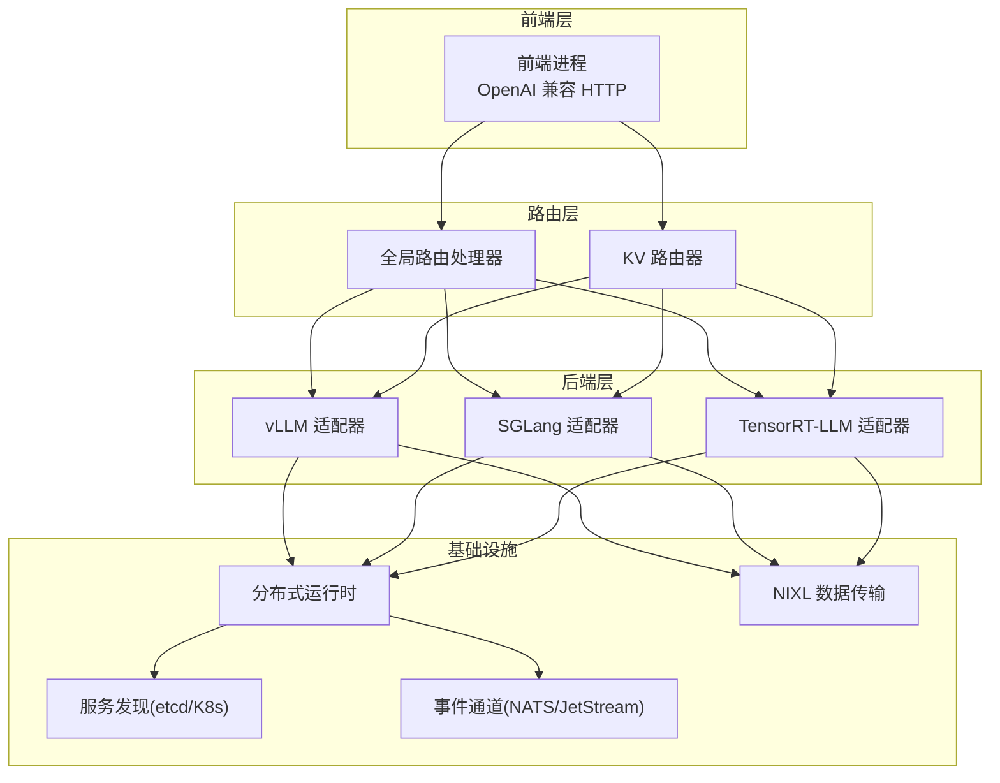
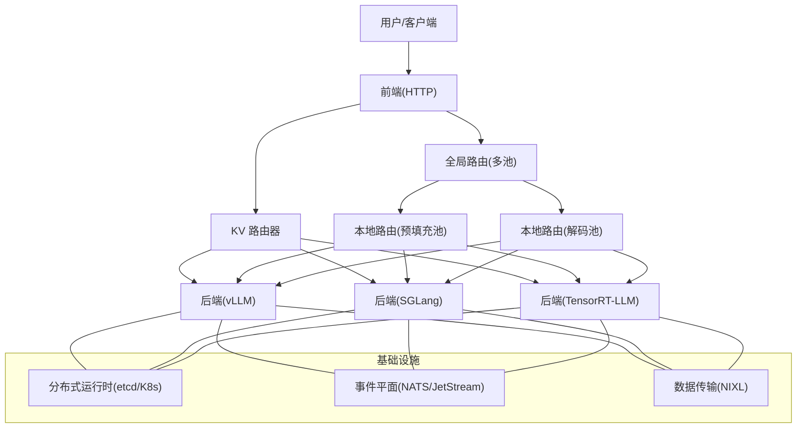
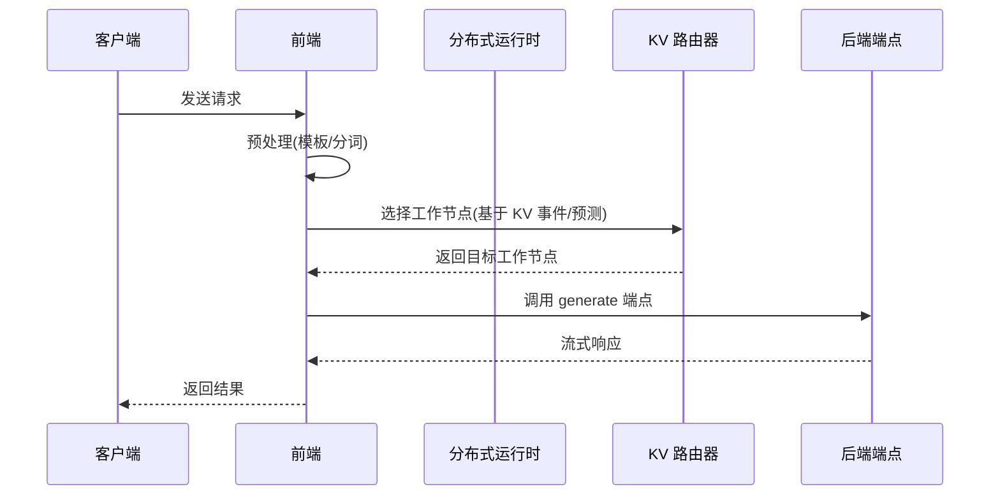
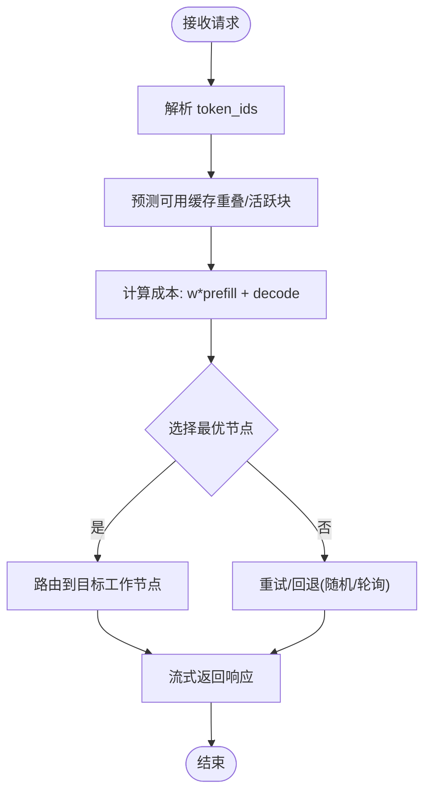
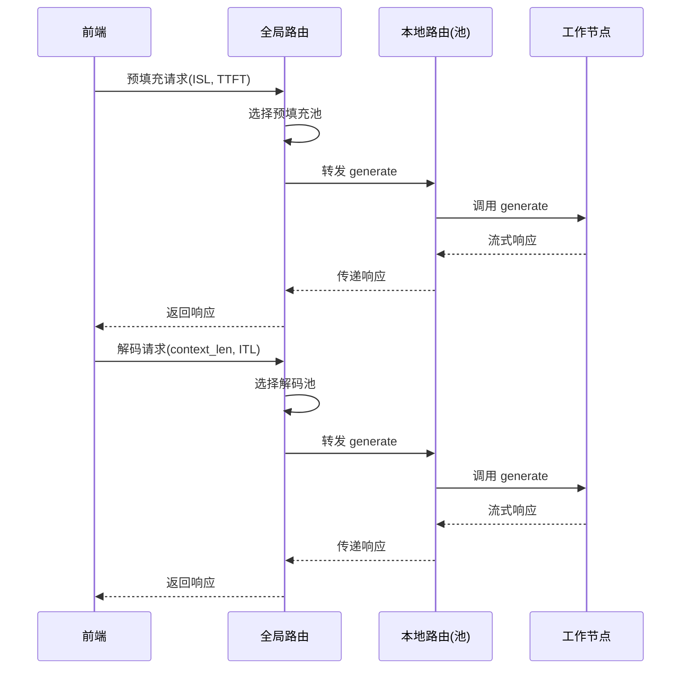
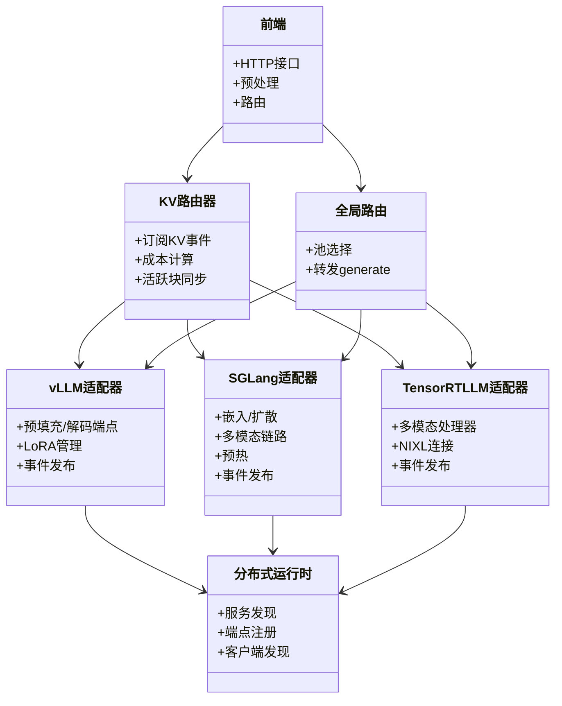
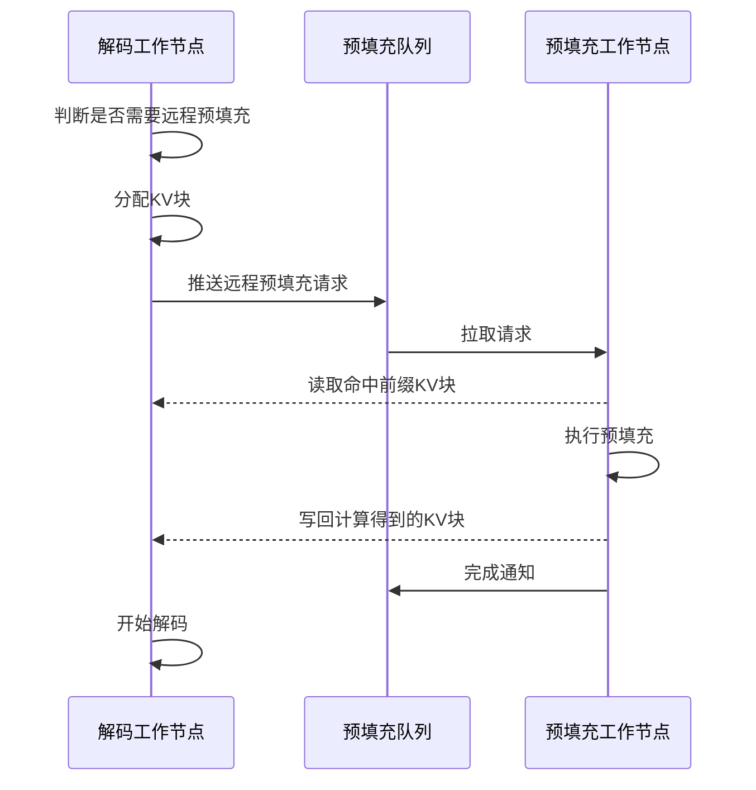
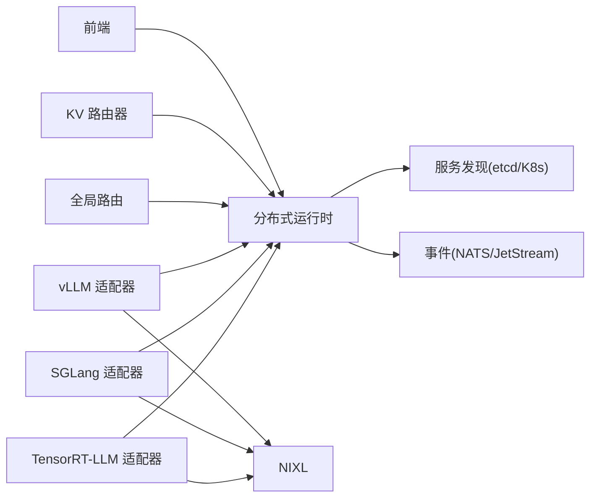

# 架构概览

<cite>
**本文引用的文件**
- [README.md](file://README.md)
- [architecture.md](file://docs/design_docs/architecture.md)
- [distributed_runtime.md](file://docs/design_docs/distributed_runtime.md)
- [disagg_serving.md](file://docs/design_docs/disagg_serving.md)
- [kv_cache_routing.md](file://docs/router/kv_cache_routing.md)
- [main.py（前端）](file://components/src/dynamo/frontend/main.py)
- [main.py（vLLM 后端）](file://components/src/dynamo/vllm/main.py)
- [main.py（SGLang 后端）](file://components/src/dynamo/sglang/main.py)
- [main.py（TensorRT-LLM 后端）](file://components/src/dynamo/trtllm/main.py)
- [handler.py（全局路由）](file://components/src/dynamo/global_router/handler.py)
- [endpoint_types.py](file://components/src/dynamo/common/utils/endpoint_types.py)
</cite>

## 目录
1. [简介](#简介)
2. [项目结构](#项目结构)
3. [核心组件](#核心组件)
4. [架构总览](#架构总览)
5. [详细组件分析](#详细组件分析)
6. [依赖关系分析](#依赖关系分析)
7. [性能考量](#性能考量)
8. [故障排查指南](#故障排查指南)
9. [结论](#结论)

## 简介
本文件面向希望理解 Dynamo 分布式推理框架整体架构的读者，系统阐述其在多节点环境中的高吞吐、低延迟设计，以及如何以“推理引擎无关”的方式统一抽象 vLLM、SGLang、TensorRT-LLM 等不同后端。文档重点覆盖：
- 分布式推理架构与组件层次
- 数据流与控制流
- 前端服务、KV 缓存路由器、后端适配器、分布式运行时之间的交互
- 全局路由与分层路由策略
- 关键优化点：解耦预填充与解码、KV 缓存感知路由、NIXL 加速数据传输

## 项目结构
Dynamo 采用“前端 + 多后端适配器 + 分布式运行时”的模块化设计，核心目录与职责如下：
- components/src/dynamo/frontend：前端入口，提供 OpenAI 兼容 HTTP 接口、请求预处理、路由与发现
- components/src/dynamo/vllm / sglang / trtllm：各后端适配器，封装各自引擎的注册、端点暴露与事件发布
- components/src/dynamo/global_router：高层路由，面向多池场景进行预填充/解码池选择
- docs/design_docs：高层设计文档，涵盖架构、分布式运行时、解耦推理与 KV 路由
- lib/runtime：分布式运行时（Rust 实现），提供命名空间、组件、端点与客户端发现机制

**图表来源**
- [architecture.md](file://docs/design_docs/architecture.md#L63-L67)
- [distributed_runtime.md](file://docs/design_docs/distributed_runtime.md#L22-L42)
- [main.py（前端）](file://components/src/dynamo/frontend/main.py#L329-L440)
- [main.py（vLLM 后端）](file://components/src/dynamo/vllm/main.py#L76-L151)
- [main.py（SGLang 后端）](file://components/src/dynamo/sglang/main.py#L69-L123)
- [main.py（TensorRT-LLM 后端）](file://components/src/dynamo/trtllm/main.py#L128-L160)

**章节来源**
- [architecture.md](file://docs/design_docs/architecture.md#L19-L70)
- [distributed_runtime.md](file://docs/design_docs/distributed_runtime.md#L18-L42)

## 核心组件
- 前端服务（Frontend）
  - 提供 OpenAI 兼容 HTTP API、提示模板与分词预处理
  - 支持多种路由模式：轮询、随机、KV 感知路由
  - 通过分布式运行时进行模型发现与端点调用
- KV 缓存路由器（KV Router）
  - 基于 NATS/JetStream 订阅 KV 事件，维护全局前缀树索引
  - 结合重叠分数与活跃块占用，计算成本并选择最优工作节点
- 全局路由处理器（Global Router）
  - 面向多池部署，按输入序列长（ISL）或上下文长度与目标 TTFT/ITL 进行池级选择
  - 将请求转发至本地路由，实现跨池调度
- 后端适配器（vLLM/SGLang/TensorRT-LLM）
  - 注册模型与端点、暴露 generate/clear/load/unload 等端点
  - 发布 KV 事件、集成 NIXL 与指标收集
- 分布式运行时（DistributedRuntime）
  - 服务发现（etcd/Kubernetes）、端点注册与客户端发现
  - 请求平面（TCP/HTTP/NATS）与可选事件平面（NATS/ZMQ）

**章节来源**
- [main.py（前端）](file://components/src/dynamo/frontend/main.py#L88-L326)
- [kv_cache_routing.md](file://docs/router/kv_cache_routing.md#L18-L64)
- [handler.py（全局路由）](file://components/src/dynamo/global_router/handler.py#L23-L121)
- [main.py（vLLM 后端）](file://components/src/dynamo/vllm/main.py#L363-L416)
- [main.py（SGLang 后端）](file://components/src/dynamo/sglang/main.py#L125-L210)
- [main.py（TensorRT-LLM 后端）](file://components/src/dynamo/trtllm/main.py#L446-L520)
- [distributed_runtime.md](file://docs/design_docs/distributed_runtime.md#L20-L96)

## 架构总览
Dynamo 的整体架构强调“推理引擎无关”与“分布式协同”。前端负责接入与路由；KV 路由器通过事件驱动的全局视图提升缓存命中率；全局路由在多池场景下进行资源编排；后端适配器统一注册到分布式运行时，实现跨进程的服务发现与负载均衡。

**图表来源**
- [architecture.md](file://docs/design_docs/architecture.md#L53-L67)
- [kv_cache_routing.md](file://docs/router/kv_cache_routing.md#L167-L214)
- [disagg_serving.md](file://docs/design_docs/disagg_serving.md#L21-L42)
- [main.py（前端）](file://components/src/dynamo/frontend/main.py#L379-L440)
- [main.py（vLLM 后端）](file://components/src/dynamo/vllm/main.py#L418-L528)
- [main.py（SGLang 后端）](file://components/src/dynamo/sglang/main.py#L125-L210)
- [main.py（TensorRT-LLM 后端）](file://components/src/dynamo/trtllm/main.py#L446-L520)

## 详细组件分析

### 前端服务（OpenAI 兼容 HTTP + 预处理 + 路由）
- 功能要点
  - 解析命令行参数，初始化分布式运行时与路由配置
  - 支持 KV 路由模式下的重叠权重、温度、事件开关、副本同步等参数
  - 通过分布式运行时创建引擎工厂与端点，启动 HTTP/交互式/kservice 服务
- 关键流程
  - 初始化 DistributedRuntime（可选启用 NATS）
  - 构造 RouterConfig/KvRouterConfig
  - make_engine 创建引擎并进入 run_input（HTTP/交互/kservice）

**图表来源**
- [main.py（前端）](file://components/src/dynamo/frontend/main.py#L329-L440)
- [kv_cache_routing.md](file://docs/router/kv_cache_routing.md#L428-L470)

**章节来源**
- [main.py（前端）](file://components/src/dynamo/frontend/main.py#L88-L326)
- [main.py（前端）](file://components/src/dynamo/frontend/main.py#L329-L440)

### KV 缓存路由器（事件驱动与本地索引）
- 功能要点
  - JetStream 默认模式持久化 KV 事件，支持快照与恢复
  - NATS Core + 本地索引模式用于低延迟部署
  - 多副本间通过消息同步活跃块状态，保证负载估计一致
  - 支持动态阈值配置（活跃解码块/预填充令牌数）
- 关键流程
  - 订阅 KV 事件，更新前缀树与活跃块槽管理
  - 计算成本函数：overlap_score_weight × 预填充块 + 解码块
  - 选择最低成本节点，必要时引入 softmax 温度

**图表来源**
- [kv_cache_routing.md](file://docs/router/kv_cache_routing.md#L427-L470)
- [kv_cache_routing.md](file://docs/router/kv_cache_routing.md#L272-L317)

**章节来源**
- [kv_cache_routing.md](file://docs/router/kv_cache_routing.md#L16-L64)
- [kv_cache_routing.md](file://docs/router/kv_cache_routing.md#L167-L271)
- [kv_cache_routing.md](file://docs/router/kv_cache_routing.md#L321-L366)
- [kv_cache_routing.md](file://docs/router/kv_cache_routing.md#L427-L470)
- [kv_cache_routing.md](file://docs/router/kv_cache_routing.md#L702-L733)

### 全局路由处理器（多池分层路由）
- 功能要点
  - 基于配置网格选择预填充/解码池
  - 依据 ISL/TTFT 或上下文长度/ITL 目标进行池内路由
  - 维护到各池本地路由的客户端连接，转发 generate 请求
- 关键流程
  - 初始化：连接各池本地路由 generate 端点
  - 预填充：根据 ISL 与 TTFT 目标选择池
  - 解码：根据上下文长度与 ITL 目标选择池
  - 转发并流式返回

**图表来源**
- [handler.py（全局路由）](file://components/src/dynamo/global_router/handler.py#L122-L214)

**章节来源**
- [handler.py（全局路由）](file://components/src/dynamo/global_router/handler.py#L23-L121)
- [handler.py（全局路由）](file://components/src/dynamo/global_router/handler.py#L122-L214)

### 后端适配器（vLLM/SGLang/TensorRT-LLM）
- vLLM 适配器
  - 支持预填充/解码端点、LoRA 管理、多模态编码/解码链路
  - 可选 vLLM 原生编码器、事件合并器、LMCache 指标回调
  - 注册模型类型（Chat/Completions/Prefill）与端点
- SGLang 适配器
  - 支持嵌入、扩散语言模型、多模态编码/解码链路
  - 预填充阶段暖机减少首 Token 时间
  - 注册模型类型与端点，支持就绪门控
- TensorRT-LLM 适配器
  - 支持多模态请求处理器、NIXL 连接器
  - 可配置 KV 缓存连接器（如 KVBM），发布事件与指标
  - 注册模型类型与端点，支持事件缓冲区大小与后端类型

**图表来源**
- [main.py（vLLM 后端）](file://components/src/dynamo/vllm/main.py#L418-L674)
- [main.py（SGLang 后端）](file://components/src/dynamo/sglang/main.py#L125-L433)
- [main.py（TensorRT-LLM 后端）](file://components/src/dynamo/trtllm/main.py#L446-L520)
- [distributed_runtime.md](file://docs/design_docs/distributed_runtime.md#L20-L96)

**章节来源**
- [main.py（vLLM 后端）](file://components/src/dynamo/vllm/main.py#L76-L151)
- [main.py（vLLM 后端）](file://components/src/dynamo/vllm/main.py#L363-L416)
- [main.py（vLLM 后端）](file://components/src/dynamo/vllm/main.py#L418-L674)
- [main.py（SGLang 后端）](file://components/src/dynamo/sglang/main.py#L69-L123)
- [main.py（SGLang 后端）](file://components/src/dynamo/sglang/main.py#L125-L433)
- [main.py（TensorRT-LLM 后端）](file://components/src/dynamo/trtllm/main.py#L128-L160)
- [main.py（TensorRT-LLM 后端）](file://components/src/dynamo/trtllm/main.py#L446-L520)

### 解耦预填充与解码（Disaggregated Serving）
- 设计思想
  - 预填充与解码阶段计算特性差异大，分别使用专用工作池
  - 条件式解耦：当预填充较长且队列空闲时远程执行，否则本地复用缓存
  - 使用 NIXL 在工作池之间非阻塞传输 KV 块，降低等待时间
- 关键流程
  - 决策是否本地/远程预填充
  - 分配 KV 块、推送远程预填充请求到全局队列
  - 预填充完成后写回 KV 块并通知解码
  - 解码阶段继续生成后续 token

**图表来源**
- [disagg_serving.md](file://docs/design_docs/disagg_serving.md#L21-L42)
- [disagg_serving.md](file://docs/design_docs/disagg_serving.md#L64-L98)

**章节来源**
- [disagg_serving.md](file://docs/design_docs/disagg_serving.md#L19-L59)
- [disagg_serving.md](file://docs/design_docs/disagg_serving.md#L60-L98)

## 依赖关系分析
- 组件耦合与内聚
  - 前端与 KV 路由器：强耦合（事件/成本计算），但通过分布式运行时解耦具体后端
  - 全局路由与本地路由：弱耦合（仅通过命名空间/组件/端点约定）
  - 后端适配器与分布式运行时：强内聚（统一注册/端点/事件）
- 外部依赖
  - 服务发现：etcd 或 Kubernetes（Dynamo 运行时自动切换）
  - 事件通道：NATS（JetStream 或 Core + 本地索引）
  - 数据传输：NIXL（RDMA/远程内存直传）

**图表来源**
- [distributed_runtime.md](file://docs/design_docs/distributed_runtime.md#L52-L96)
- [kv_cache_routing.md](file://docs/router/kv_cache_routing.md#L52-L55)
- [main.py（vLLM 后端）](file://components/src/dynamo/vllm/main.py#L212-L286)
- [main.py（TensorRT-LLM 后端）](file://components/src/dynamo/trtllm/main.py#L465-L520)

**章节来源**
- [distributed_runtime.md](file://docs/design_docs/distributed_runtime.md#L52-L96)
- [kv_cache_routing.md](file://docs/router/kv_cache_routing.md#L52-L55)

## 性能考量
- 解耦预填充/解码提升 GPU 利用率与吞吐
- KV 缓存感知路由显著降低 TTFT 与平均请求延迟
- NIXL 非阻塞 KV 传输减少等待时间
- 动态 GPU 调度与事件平面驱动的 Planner 协同优化
- 指标与可观测性：Prometheus 回调、事件快照、对象存储持久化

[本节为通用指导，无需特定文件引用]

## 故障排查指南
- NATS/JetStream 未启用导致 KV 路由异常
  - 检查前端参数与后端事件发布配置
  - 在禁用 KV 事件模式下，确认后端已关闭事件发布
- 服务发现失败
  - 确认 etcd/K8s 环境连通性与命名空间/组件/端点一致性
- 端点不可达
  - 使用分布式运行时客户端检查端点实例列表与负载均衡策略
- 指标缺失
  - 检查 Prometheus 注册回调与多进程模式设置

**章节来源**
- [kv_cache_routing.md](file://docs/router/kv_cache_routing.md#L52-L64)
- [distributed_runtime.md](file://docs/design_docs/distributed_runtime.md#L77-L96)

## 结论
Dynamo 通过“推理引擎无关”的抽象与“分布式运行时”的统一服务发现与端点管理，实现了 vLLM、SGLang、TensorRT-LLM 的无缝集成。结合 KV 缓存感知路由、解耦预填充/解码与 NIXL 数据传输，Dynamo 在多节点环境下实现了高吞吐、低延迟与良好弹性，适用于生产级大规模推理服务。