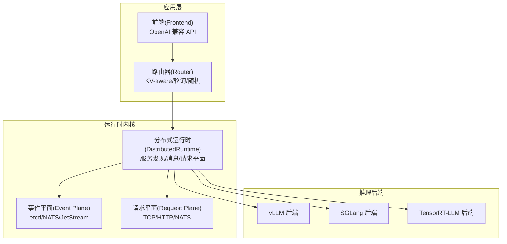
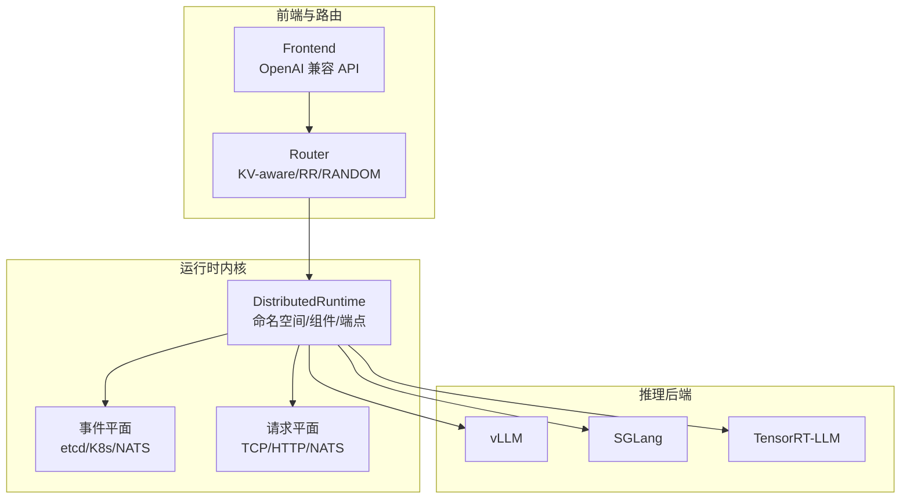
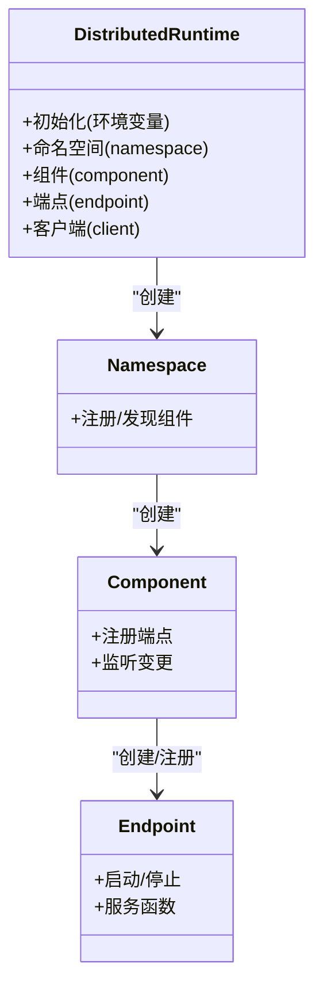
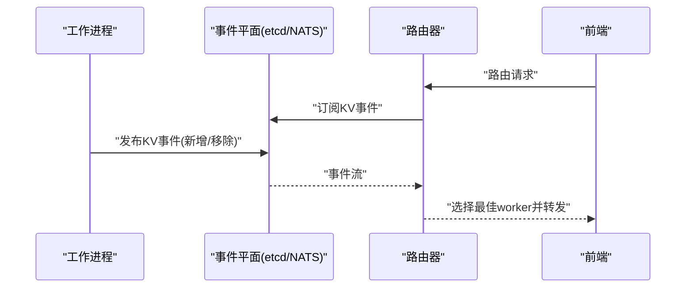
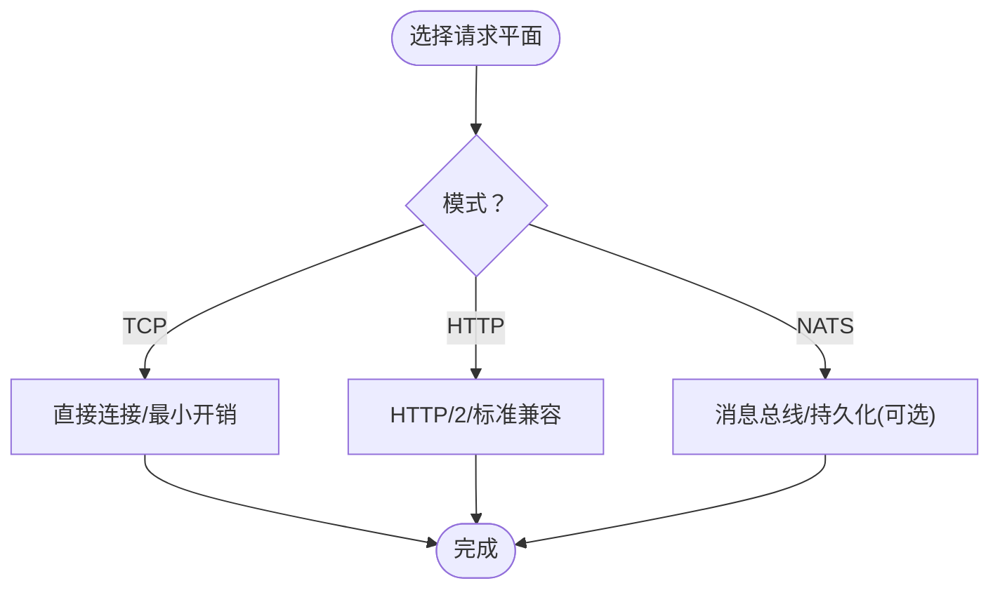
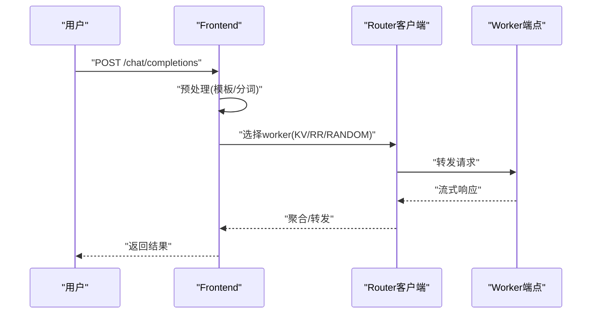
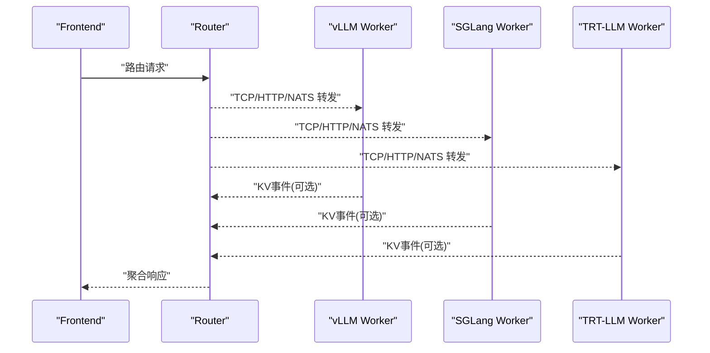
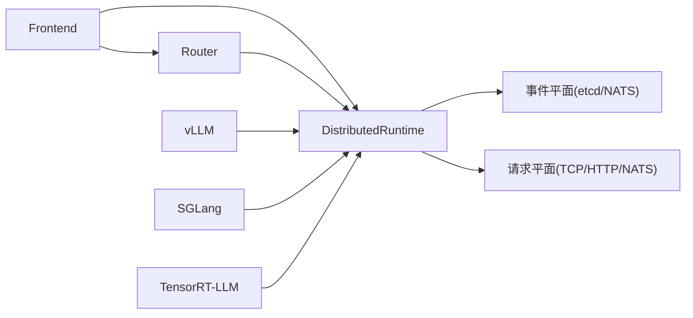

# 项目概述

<cite>
**本文引用的文件**
- [README.md](file://README.md)
- [architecture.md](file://docs/design_docs/architecture.md)
- [distributed_runtime.md](file://docs/design_docs/distributed_runtime.md)
- [event_plane.md](file://docs/design_docs/event_plane.md)
- [request_plane.md](file://docs/design_docs/request_plane.md)
- [kv_cache_routing.md](file://docs/router/kv_cache_routing.md)
- [frontend/main.py](file://components/src/dynamo/frontend/main.py)
- [vllm/main.py](file://components/src/dynamo/vllm/main.py)
- [sglang/main.py](file://components/src/dynamo/sglang/main.py)
- [trtllm/main.py](file://components/src/dynamo/trtllm/main.py)
</cite>

## 目录
1. [引言](#引言)
2. [项目结构](#项目结构)
3. [核心组件](#核心组件)
4. [架构总览](#架构总览)
5. [详细组件分析](#详细组件分析)
6. [依赖关系分析](#依赖关系分析)
7. [性能考量](#性能考量)
8. [故障排查指南](#故障排查指南)
9. [结论](#结论)
10. [附录](#附录)

## 引言
Dynamo 是面向多节点分布式环境的大模型（LLM）高吞吐、低延迟推理框架。其核心价值主张包括：
- 推行“预填充分离与解码”（Disaggregated Prefill & Decode），最大化 GPU 利用率与吞吐，灵活平衡 TTFT 与 ITL
- 动态 GPU 调度，按实时需求分配资源，避免静态配置导致的资源浪费
- LLM 感知的请求路由（KV-aware routing），消除不必要的 KV 缓存重算，显著降低时延与提升吞吐
- 加速数据传输（NIXL），减少跨节点 KV 数据搬运的同步开销
- KV 缓存分层卸载（KV Cache Offloading），利用多级内存（HBM/DDR/NVMe/远端存储）扩展缓存容量，支撑更长上下文与更高并发

Dynamo 在 Rust 中构建高性能内核，在 Python 中提供可扩展性与易用性；对 vLLM、SGLang、TensorRT-LLM 等后端保持“推理引擎无关”的设计，既适合本地快速验证，也适合大规模生产部署。

## 项目结构
仓库采用模块化组织，围绕“运行时内核 + 多后端适配 + 前端与路由 + 运维与观测”展开：
- components/src/dynamo：核心组件与后端适配器（前端、路由器、各引擎适配）
- docs：设计文档、用户指南、运维手册
- deploy：Kubernetes 平台、Operator、观测与日志、示例部署
- benchmarks：基准测试、性能剖析、AB 测试
- lib：Rust 运行时库、KV 路由、LLM 抽象、绑定与工具
- recipes/examples：典型拓扑与部署配方、示例脚本
- scripts/tests：CI/测试工具与样例

图表来源
- [architecture.md](file://docs/design_docs/architecture.md#L19-L70)
- [distributed_runtime.md](file://docs/design_docs/distributed_runtime.md#L20-L46)
- [event_plane.md](file://docs/design_docs/event_plane.md#L20-L52)
- [request_plane.md](file://docs/design_docs/request_plane.md#L20-L47)

章节来源
- [README.md](file://README.md#L27-L51)
- [architecture.md](file://docs/design_docs/architecture.md#L19-L70)

## 核心组件
- 分布式运行时（DistributedRuntime）：统一的服务注册、发现、生命周期管理与请求平面抽象，支持多后端与多种负载均衡策略
- 事件平面（Event Plane）：通过 etcd 或 Kubernetes CRD 实现服务发现；通过 NATS（JetStream/Pub/Sub）实现 KV 事件与路由器副本同步
- 请求平面（Request Plane）：支持 TCP/HTTP/NATS 三种传输模式，独立于 KV 事件平面
- 前端（Frontend）：OpenAI 兼容 API、预处理（模板/分词）、路由选择（轮询/随机/KV-aware）
- 后端适配器（vLLM/SGLang/TRT-LLM）：封装各自引擎，注册模型、暴露 generate/clear 等端点，发布 KV 事件与指标

章节来源
- [distributed_runtime.md](file://docs/design_docs/distributed_runtime.md#L20-L106)
- [event_plane.md](file://docs/design_docs/event_plane.md#L20-L52)
- [request_plane.md](file://docs/design_docs/request_plane.md#L20-L47)
- [frontend/main.py](file://components/src/dynamo/frontend/main.py#L88-L469)
- [vllm/main.py](file://components/src/dynamo/vllm/main.py#L76-L800)
- [sglang/main.py](file://components/src/dynamo/sglang/main.py#L69-L664)
- [trtllm/main.py](file://components/src/dynamo/trtllm/main.py#L128-L528)

## 架构总览
Dynamo 的高层架构以“运行时内核 + 可插拔后端 + 统一前端”为核心，通过事件平面与请求平面解耦，实现：
- 高可用的服务发现与自动注册（etcd/K8s）
- KV 事件驱动的全局缓存视图与路由器一致性
- 多种请求传输模式以适配不同部署场景
- 多后端统一接口，屏蔽引擎差异

图表来源
- [architecture.md](file://docs/design_docs/architecture.md#L53-L70)
- [event_plane.md](file://docs/design_docs/event_plane.md#L20-L52)
- [request_plane.md](file://docs/design_docs/request_plane.md#L20-L47)

## 详细组件分析

### 分布式运行时（DistributedRuntime）
- 角色与层次：DistributedRuntime → Namespace → Component → Endpoint；支持多命名空间隔离与多组件组合
- 发现后端：etcd（默认）或 Kubernetes（需显式设置）；K8s 模式下使用 CRD/EndpointSlices
- 请求平面：TCP/HTTP/NATS；通过环境变量 DYN_REQUEST_PLANE 配置
- 客户端与负载均衡：支持随机、轮询、直连；Watcher 自动感知端点变化
- 可靠性：租约保活、断线重连、事务写入、删除清理

图表来源
- [distributed_runtime.md](file://docs/design_docs/distributed_runtime.md#L20-L106)

章节来源
- [distributed_runtime.md](file://docs/design_docs/distributed_runtime.md#L20-L106)

### 事件平面（Event Plane）
- 服务发现：etcd（默认）或 Kubernetes（需显式启用）；K8s 模式无需 etcd
- NATS：用于 KV 事件（JetStream/Pub/Sub）、路由器副本同步；可禁用以简化部署
- 键值存储抽象：EtcdStore/MemoryStore/NatsStore/FileStore
- 事务与可靠性：租约过期自动清理、重连退避、修订跟踪无丢失

图表来源
- [event_plane.md](file://docs/design_docs/event_plane.md#L20-L52)
- [kv_cache_routing.md](file://docs/router/kv_cache_routing.md#L16-L56)

章节来源
- [event_plane.md](file://docs/design_docs/event_plane.md#L20-L52)
- [kv_cache_routing.md](file://docs/router/kv_cache_routing.md#L16-L56)

### 请求平面（Request Plane）
- 模式：TCP（默认，低延迟）、HTTP（标准兼容、可观测）、NATS（消息总线）
- 配置：DYN_REQUEST_PLANE；TCP/HTTP/NATS 各自参数（端口、超时、池大小等）
- 与事件平面解耦：请求平面不影响 KV 事件传输（KV 事件仍走 NATS）

图表来源
- [request_plane.md](file://docs/design_docs/request_plane.md#L20-L76)

章节来源
- [request_plane.md](file://docs/design_docs/request_plane.md#L20-L76)

### 前端（Frontend）
- 功能：OpenAI 兼容 API、提示模板、分词、路由（轮询/随机/KV-aware）
- KV 路由参数：重叠分数权重、温度、是否启用事件、TTL/树大小/修剪比例、副本同步、活跃块跟踪等
- 支持：交互模式、KServe gRPC、自定义后端指标采集
- 启动方式：命令行参数控制 HTTP 端口、TLS、命名空间、请求/事件平面、模型名/路径等

图表来源
- [frontend/main.py](file://components/src/dynamo/frontend/main.py#L88-L469)
- [kv_cache_routing.md](file://docs/router/kv_cache_routing.md#L132-L159)

章节来源
- [frontend/main.py](file://components/src/dynamo/frontend/main.py#L88-L469)

### 后端适配器（vLLM/SGLang/TensorRT-LLM）
- vLLM：支持前缀缓存事件发布、多模态编码/解码链路、LoRA、健康检查、指标导出
- SGLang：多模态处理器、扩散语言模型、预热以降低 TTFT、非主节点只暴露指标
- TensorRT-LLM：NIXL 连接、KV 事件发布、指标收集、多模态请求处理器、连接器集成

图表来源
- [vllm/main.py](file://components/src/dynamo/vllm/main.py#L76-L800)
- [sglang/main.py](file://components/src/dynamo/sglang/main.py#L69-L664)
- [trtllm/main.py](file://components/src/dynamo/trtllm/main.py#L128-L528)

章节来源
- [vllm/main.py](file://components/src/dynamo/vllm/main.py#L76-L800)
- [sglang/main.py](file://components/src/dynamo/sglang/main.py#L69-L664)
- [trtllm/main.py](file://components/src/dynamo/trtllm/main.py#L128-L528)

## 依赖关系分析
- 运行时内核是所有组件的共同基础，负责服务发现、消息与请求平面
- 事件平面与请求平面相互独立，KV 事件默认经 NATS（JetStream/Pub/Sub），请求平面可选 TCP/HTTP/NATS
- 前端依赖运行时进行服务发现与端点调用；后端适配器依赖运行时注册自身端点并发布 KV 事件
- 多后端通过统一的注册接口与端点协议对接，实现“引擎无关”

图表来源
- [distributed_runtime.md](file://docs/design_docs/distributed_runtime.md#L20-L106)
- [event_plane.md](file://docs/design_docs/event_plane.md#L20-L52)
- [request_plane.md](file://docs/design_docs/request_plane.md#L20-L47)

章节来源
- [distributed_runtime.md](file://docs/design_docs/distributed_runtime.md#L20-L106)
- [event_plane.md](file://docs/design_docs/event_plane.md#L20-L52)
- [request_plane.md](file://docs/design_docs/request_plane.md#L20-L47)

## 性能考量
- 预填充分离与解码：通过将预填充分离到专用 worker，最大化 GPU 利用率，提升吞吐；可根据 SLA 调整 TTFT/ITL 权衡
- KV 缓存复用：基于 KV-aware routing，避免重复计算，显著降低 TTFT 与平均请求时延
- 动态 GPU 调度：根据实时负载调整 worker 数量与分配，避免静态配置导致的资源浪费
- 数据传输加速：NIXL 减少跨节点 KV 数据搬运的同步与批处理开销
- 请求平面选择：TCP 最低延迟；HTTP 更易调试与兼容；NATS 提供消息总线能力但有 payload 限制

章节来源
- [architecture.md](file://docs/design_docs/architecture.md#L71-L103)
- [kv_cache_routing.md](file://docs/router/kv_cache_routing.md#L82-L131)
- [request_plane.md](file://docs/design_docs/request_plane.md#L293-L307)

## 故障排查指南
- 服务无法通信：检查请求平面模式一致、端口未被防火墙阻断、主机/端口配置正确；NATS 可选但默认启用 KV 事件时需要
- NATS 相关问题：确认 NATS 服务器可达；JetStream 需要持久化；Core 模式下事件为 fire-and-forget
- etcd/K8s 发现：默认 etcd；K8s 需显式设置 DYN_DISCOVERY_BACKEND=kubernetes；operator 注入环境变量
- 端口冲突：TCP 默认使用系统分配端口；如指定固定端口需避免冲突
- KV 路由状态：JetStream 模式支持持久化快照；Core+Local Indexer 模式状态在 worker；禁用 KV 事件则不支持持久化

章节来源
- [request_plane.md](file://docs/design_docs/request_plane.md#L264-L292)
- [event_plane.md](file://docs/design_docs/event_plane.md#L353-L470)
- [distributed_runtime.md](file://docs/design_docs/distributed_runtime.md#L44-L106)

## 结论
Dynamo 通过“运行时内核 + 事件/请求平面 + 统一前端 + 多后端适配”的架构，解决了分布式 LLM 推理中的关键难题：GPU 利用率、KV 缓存重算、动态负载与数据传输瓶颈。其“引擎无关”的设计使用户可在 vLLM、SGLang、TensorRT-LLM 之间自由切换，并结合 KV-aware routing、动态调度与 NIXL 等能力获得更高的吞吐与更低的时延。对于初学者，可通过本地快速启动体验；对于有经验的开发者，可深入定制路由策略、请求/事件平面与观测体系，满足复杂生产场景。

## 附录
- 快速开始：本地单机部署、OpenAI 兼容 API、KV-aware 路由开关
- 生产部署：Kubernetes 平台、Operator、观测与日志、多节点 Recipe
- 开发指南：后端适配、运行时扩展、KV 路由 API 使用

章节来源
- [README.md](file://README.md#L91-L224)
- [README.md](file://README.md#L182-L224)