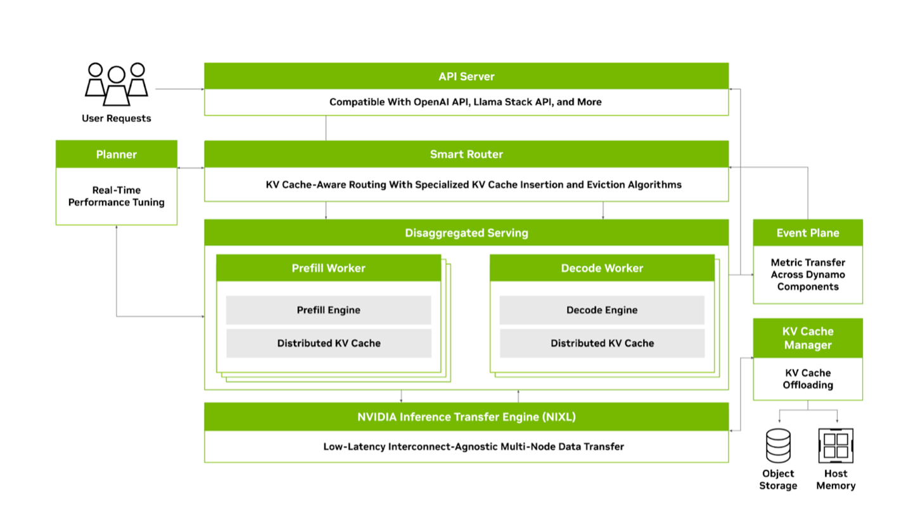

<!--
SPDX-FileCopyrightText: Copyright (c) 2024-2026 NVIDIA CORPORATION & AFFILIATES. All rights reserved.
SPDX-License-Identifier: Apache-2.0

Licensed under the Apache License, Version 2.0 (the "License");
you may not use this file except in compliance with the License.
You may obtain a copy of the License at

http://www.apache.org/licenses/LICENSE-2.0

Unless required by applicable law or agreed to in writing, software
distributed under the License is distributed on an "AS IS" BASIS,
WITHOUT WARRANTIES OR CONDITIONS OF ANY KIND, either express or implied.
See the License for the specific language governing permissions and
limitations under the License.
-->

# Contributing to Dynamo

Thank you for your interest in contributing to Dynamo! Whether you're fixing a typo, reporting a bug, improving documentation, or building a new feature—every contribution matters and helps make Dynamo better for everyone.

This guide will help you get started. If you have questions, join us on [Discord](https://discord.gg/D92uqZRjCZ) or open a [GitHub Discussion](https://github.com/ai-dynamo/dynamo/discussions).

> **Community Impact**
> - 70+ external contributors have merged PRs
> - 130+ community contributions merged since launch
> - ~8 new contributors join each month
>
> Your contribution matters. [See our contributors](https://github.com/ai-dynamo/dynamo/graphs/contributors).

> **TL;DR for experienced contributors:**
> 1. Fork and clone the repo
> 2. Create a branch: `git checkout -b yourname/fix-description`
> 3. Make changes, run `pre-commit`
> 4. Commit with DCO sign-off: `git commit -s -m "fix: description"`
> 5. Open a PR targeting `main`

## Code of Conduct

We are committed to providing a welcoming and inclusive environment. Please read and follow our [Code of Conduct](CODE_OF_CONDUCT.md).

---

## Ways to Contribute

### Report a Bug

Found something broken? [Open a bug report](https://github.com/ai-dynamo/dynamo/issues/new?template=bug_report.yml) with:
- Steps to reproduce
- Expected vs. actual behavior
- Environment details (OS, GPU, Python version, Dynamo version)

### Improve Documentation

Documentation improvements are always welcome. This includes:
- Fixing typos or unclear explanations
- Adding examples or tutorials
- Improving API documentation

Small doc fixes can be submitted directly as PRs without an issue.

### First-Time Contributors

New to open source or Dynamo? Look for issues labeled [`good first issue`](https://github.com/ai-dynamo/dynamo/issues?q=is%3Aissue+is%3Aopen+label%3A%22good+first+issue%22). These are beginner-friendly tasks with clear scope.

### Propose a Feature

Have an idea for a new feature? [Open a feature request](https://github.com/ai-dynamo/dynamo/issues/new?template=feature_request.yml) to discuss it with maintainers before implementation.

### Contribute Code

Ready to write code? See the [Contribution Workflow](#contribution-workflow) section below for the process.

---

## Quick Start for Contributors

### Prerequisites

- **Python 3.10+** with development headers (`sudo apt install python3-dev`)
- **Rust** (install via [rustup](https://rustup.rs/))
- **Build tools**: `sudo apt install -y build-essential libhwloc-dev libudev-dev pkg-config libclang-dev protobuf-compiler cmake`

### Fork and Clone

1. [Fork the repository](https://github.com/ai-dynamo/dynamo/fork) on GitHub
2. Clone your fork:

```bash
git clone https://github.com/YOUR_USERNAME/dynamo.git
cd dynamo

# Create virtual environment
uv venv venv
source venv/bin/activate

# Install dependencies and build
uv pip install pip maturin
cd lib/bindings/python && maturin develop --uv && cd ../../..
uv pip install -e .
```

### Run Tests

```bash
# Run unit tests
pytest -m "unit"

# Run a quick sanity check
./deploy/sanity_check.py
```

### Set Up Pre-commit Hooks

```bash
pip install pre-commit
pre-commit install
```

For detailed setup instructions, see the [Developing Locally](README.md#developing-locally) section in the README.

---

## Project Architecture

Understanding Dynamo's architecture helps you find where to make changes.



### Core Components

| Component | Purpose | Directory |
|-----------|---------|-----------|
| **Frontend** | OpenAI-compatible HTTP API server | `components/src/dynamo/frontend/` |
| **Router** | KV cache-aware request routing with load balancing | `components/src/dynamo/router/` |
| **Planner** | Real-time performance tuning and worker scaling | `components/src/dynamo/planner/` |
| **Workers** | Backend engine integrations (vLLM, SGLang, TensorRT-LLM) | `components/src/dynamo/{vllm,sglang,trtllm}/` |
| **KV Cache Manager** | Multi-tier cache offloading (GPU → CPU → SSD → Object Storage) | `lib/bindings/kvbm/` |
| **SLA Profiler** | Benchmarking and SLA-driven configuration | `benchmarks/profiler/` |

### Communication Planes

| Plane | Purpose | Documentation |
|-------|---------|---------------|
| **Discovery Plane** | Service registration and discovery across components | [docs/design_docs/distributed_runtime.md](docs/design_docs/distributed_runtime.md) |
| **Request Plane** | High-performance request routing between components | [docs/design_docs/request_plane.md](docs/design_docs/request_plane.md) |
| **KV Event Plane** | KV cache event propagation for cache-aware routing | [docs/design_docs/event_plane.md](docs/design_docs/event_plane.md) |

### Kubernetes Deployment

| Component | Purpose | Directory |
|-----------|---------|-----------|
| **Operator** | CRDs, controllers, and webhooks for K8s-native deployment | `deploy/operator/` |
| **Helm Charts** | Templated deployment configurations | `deploy/helm/` |
| **Recipes** | Pre-built deployment configurations for common scenarios | `recipes/` |

### Why These Languages?

| Layer | Language | Why | Directory |
|-------|----------|-----|-----------|
| Core Runtime | Rust | Memory safety, zero-cost abstractions, predictable latency | `lib/runtime/` |
| LLM Engine | Rust | High-throughput token processing, async I/O | `lib/llm/` |
| KV Block Manager | Rust | Direct memory control for GPU/CPU/SSD offloading | `lib/bindings/kvbm/` |
| Backend Integrations | Python | Rapid iteration, framework compatibility | `components/src/dynamo/` |
| Planner & Router | Python | Extensible policies, easy customization | `components/src/dynamo/{planner,router}/` |
| Kubernetes Operator | Go | K8s controller patterns, client-go ecosystem | `deploy/operator/` |

> **Design Philosophy**: We built performance-sensitive modules in Rust for speed, memory safety, and robust concurrency. We use Python for flexibility, enabling rapid prototyping and effortless customization.

For detailed architecture documentation, see [docs/design_docs/architecture.md](docs/design_docs/architecture.md). For supported versions of critical dependencies (vLLM, SGLang, TensorRT-LLM, CUDA, etc.), see the [Support Matrix](docs/reference/support-matrix.md).

---

## Contribution Workflow

### When Is a GitHub Issue Required?

**Submit a PR directly (no issue needed) if:**
- Your change is **<100 lines of code** AND addresses a simple, focused concern (typos, simple bug fixes, formatting)
- **OR** your PR addresses an **existing approved GitHub Issue** (link with "Fixes #123")

**Create a GitHub Issue first for:**
- Changes ≥100 lines of code
- New features, architecture changes, or multi-component changes
- Any change that requires design discussion

### Issue-First Workflow

For larger contributions, follow these steps:

1. **Create a GitHub Issue** – [Open a Contribution Request](https://github.com/ai-dynamo/dynamo/issues/new?template=contribution_request.yml) using the template.

2. **Describe the Problem** – Explain what you're solving, including context, error messages, or use cases.

3. **Propose a Solution** – Include:
   - **Estimated PR size**: XS / S / M / L / XL / XXL
   - **Files affected**: Approximate number and components
   - **Type of change**: Bug fix, new feature, refactoring, or performance improvement

4. **Get Approval** – Wait for maintainers to review and apply the `approved-for-pr` label.

5. **Submit a Pull Request** – [Open a PR](https://github.com/ai-dynamo/dynamo/compare) that references the issue using GitHub keywords (e.g., "Fixes #123").

6. **Address Code Rabbit Review** – Respond to automated Code Rabbit suggestions, including nitpicks.

7. **Ensure CI Passes** – Fix any failing tests before requesting human review.

8. **Request Review** – Add the person who approved your issue as a reviewer. Check [CODEOWNERS](CODEOWNERS) for required approvers based on files modified.

> **Note on AI-Generated Code**: While we encourage using AI tools, you must fully understand every change in your PR. Inability to explain submitted code will result in rejection.

---

## Code Style & Quality

### Pre-commit Hooks

All PRs are checked against [pre-commit hooks](.pre-commit-config.yaml). Run locally:

```bash
pre-commit install
pre-commit run --all-files
```

### Language Conventions

| Language | Style Guide | Formatter |
|----------|-------------|-----------|
| **Python** | [PEP 8](https://peps.python.org/pep-0008/) | `black`, `ruff` |
| **Rust** | [Rust API Guidelines](https://rust-lang.github.io/api-guidelines/) | `cargo fmt`, `cargo clippy` |
| **Go** | [Effective Go](https://go.dev/doc/effective_go) | `gofmt` |

### General Guidelines

- Keep PRs focused—one concern per PR
- Avoid unnecessary complexity
- No commented-out code
- Ensure clean builds (no warnings or errors)
- All tests must pass

### Running GitHub Actions Locally

Use [act](https://nektosact.com/) to run workflows locally:

```bash
act -j pre-merge-rust
```

Or use the [GitHub Local Actions](https://marketplace.visualstudio.com/items?itemName=SanjulaGanepola.github-local-actions) VS Code extension.

---

## DCO & Licensing

### Developer Certificate of Origin

Dynamo requires all contributions to be signed off with the [Developer Certificate of Origin (DCO)](https://developercertificate.org/). This certifies that you have the right to submit your contribution under the project's [Apache 2.0 license](LICENSE).

Each commit must include a sign-off line:

```text
Signed-off-by: Jane Smith <jane.smith@email.com>
```

Add this automatically with the `-s` flag:

```bash
git commit -s -m "fix: your descriptive message"
```

**Requirements:**
- Use your real name (no pseudonyms or anonymous contributions)
- Your `user.name` and `user.email` must be configured in git

⚠️ **DCO Check Failed?** See our [DCO Troubleshooting Guide](DCO.md) for step-by-step instructions to fix it.

### License

By contributing, you agree that your contributions will be licensed under the [Apache 2.0 License](LICENSE).

---

## Getting Help

- **Discord**: [Join our community](https://discord.gg/D92uqZRjCZ)
- **Discussions**: [GitHub Discussions](https://github.com/ai-dynamo/dynamo/discussions)
- **Documentation**: [docs.nvidia.com/dynamo](https://docs.nvidia.com/dynamo/latest/index.html)

Thank you for contributing to Dynamo!
