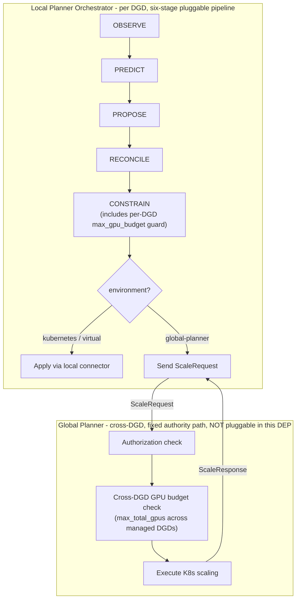
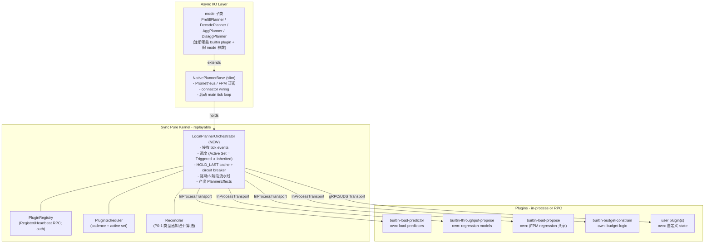
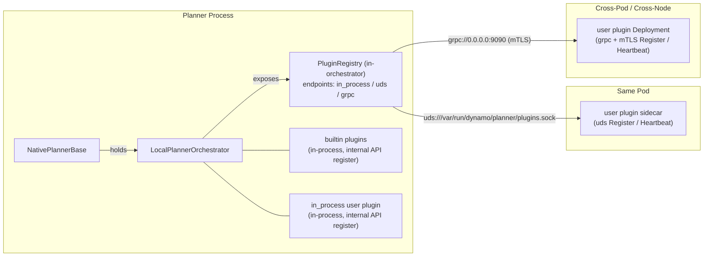

# DEP-XXXX：Dynamo Planner 插件架构（Plugin Architecture）

> 原文：`DEP-XXXX_ Dynamo Planner Plugin Architecture.docx`
> 本文为中文翻译版，关键术语首次出现时附上英文原词以便对照。

| 字段（Field） | 取值（Value） |
| --- | --- |
| 状态（Status） | READY_FOR_REVIEW |
| 版本（Revision） | v11 |
| 作者（Authors） | [Kang Zhang CN](mailto:kangz@nvidia.com)、[Hongkuan Zhou US](mailto:hongkuanz@nvidia.com) |
| 创建（Created） | 2026-04-11 |
| 更新（Updated） | 2026-04-23 |

## 修订历史（Changelog）

### Implementation progress（2026-04-23 状态同步，non-structural）

主文档 v11 规范未动；以下是 implementation 现状对 caveat 节的影响：

- **PR 3.5 follow-up 已 land**（2026-04-23）—— `K8sSATokenAuth` + `SpiffeJwtAuth` 真实实现 + 23 单测；「K8s 部署衔接」节 + 「全量配置样例」节的 "v1 不可用" caveat 同步改为 "已 land"。
- **PR 6 6-7 finish landed**（2026-04-23）—— `PsmShimProposePlugin` + `PSMBridge` 作为 PR 5 期间的 placeholder，在 5 个真实 builtin + `OrchestratorEngineAdapter` 全部就绪后删除；G3 parity 现在完全走生产 adapter 路径。
- **PR 7 进度 8/11**（2026-04-23）—— 7-1/7-2/7-3/7-4/7-7/7-8/7-10 + runbook 完成；剩 7-5/7-6（optional，`_apply_effects` + `_wire_predicted_load_if_supported` 已等价满足）/ 7-9（卡 runtime 测试 infra）。

### v11 — 2026-04-20（PR 1-4 详细文档 review 同步：实施层冲突修正）

针对 PR 1-4 详细文档启动后 review 报告（27 issue）中的 9 个 CRITICAL + 6 个重要 gap，本次修订解决主文档与 PR 详细文档实施层的所有结构性偏差。

**CRITICAL（结构性修正）**：

- **CONSTRAIN SET 静态拒收承诺改为 runtime drop only**——v10 主文档 line 1142-1148 / 1274 承诺「register 阶段静态拒」实际不可行（proto 无 plugin 自报输出类型字段）；改为 runtime drop + audit + Prometheus metric。PR 3 v1.1 Q7 已决议、本主文档同步。
- **`in_process_plugins` 配置路径统一**为 `plugin_registration.in_process_plugins`（v10 文档启动顺序节误写 `scheduling.in_process_plugins`）；PR 3 SchedulingConfig 同步把字段移到 PluginRegistrationConfig。
- **`grpc_tls` 配置 schema 改为 `grpc_mtls.secret_mount_path`**——复用 dynamo platform cert-manager 已有 secret 约定（`tls.crt` / `tls.key` / `ca.crt` 三键）；禁止 in-line cert 配置（防泄露 + 复用平台自动 rotation）。PR 2 决议同步。
- **`auth.trusted_sources` 配置 schema 改为 string list + sibling 配置**（避免 list of union 类型，Pydantic-friendly）；PR 3 详细文档同步。
- **`circuit_breaker.failure_threshold` 默认值统一为 5**（v10 主文档配置示例写 3，PR 3 详细文档写 5；PR 3 默认值更稳健，避免偶发抖动放大成 OPEN）。
- **Transport 描述统一为 3 类**：`InProcessTransport` / `UdsTransport` / `GrpcTransport`（v10 主文档归 2 类「InProcess + Grpc(含 UDS+TCP)」与 PR 2 详细文档不齐；按用户 facing 配置分 3 类更直观）。
- **`Clock` 抽象统一为 2 个时间源 + 1 个 sleep**：`now()`（epoch 时间，给 audit log）+ `monotonic()`（单调时间，给 duration / scheduling）+ `async sleep(s)`；v10 主文档简化只写 `monotonic()` 与 PR 2 详细文档不齐。
- **`PlannerStateMachine` 删除时机改 PR 11 cleanup**（v10 主文档 line 2151 写「解构 PR 中删除」过时；PR 5/6/7/8 全程 read-only PSM；G3 fixture 自动守护；PR 11 在 PR 10 默认 flip 稳定后才删）。
- **`ReplayPlannerAdapter` 迁移路径改 PR 8**（v10 主文档 line 2146「实施期（解构 PSM 同 PR）」过时；PR 5 不接 ReplayPlannerAdapter，PR 8 才迁移）。

**重要 design gap 补齐**：

- **`PredictionData` 字段必须 `optional`**——proto 字段加 `optional` 修饰，让 PR 4 chain-augment partial-merge 能用 `HasField()` 区分「我说 0」vs「未设置」；line 1280 / 1287 / 1320 描述同步加注。
- **REJECT 与 final 优先级明示**：type-aware merge 算法 step 1 加注「即使集合中有 final=true，REJECT 仍优先（安全否决高于权威覆盖）」。
- **HeartbeatMonitor 跳过逻辑改为基于 transport**：跳过 `transport_type == "in_process"` 的 plugin（无论 builtin / user），不是 `is_builtin`——否则 in_process user plugin 因不发心跳会被立即剔除。PR 3 3-6 同步修。
- **K8s SA / SPIFFE 在 v1 不可用 caveat**：「PluginRegistry 拓扑」节 + 配置示例加 caveat「v1 仅支持 static_secret + K8s Secret mount；K8s SA / SPIFFE 在 PR 3.5 follow-up land」。**（2026-04-23 更新：PR 3.5 已 ship，caveat 已 lifted；见上方 Implementation progress 节。）**
- **Mode 子类 EXECUTE Hook 集成方式明示**：`LocalPlannerOrchestrator.__init__` 接 `pre_execute_hook` / `post_execute_hook` callback；`NativePlannerBase` subclass override 方法 + 注入 callback。
- **Replay 测试不强制 Stub 版本**：内置 plugin 单测用真实 instance + InProcessTransport + 注入小 trace；Stub 版本仅 user plugin contract test 需要。

**新增**：「v11 实施细节注解（Implementation Notes）」节——记录 8 条「不阻塞但实施时易踩坑」的注解（如 `target_replicas` 空 list 处理、`tick_max_duration_seconds` per-stage 而非整 tick、单 plugin 慢 → 整 stage latency = max 的 trade-off 等）。

### v10 — 2026-04-20（YAGNI 清理 + 数值 diag 字段废弃）

针对 PR 6 detailed 评审中识别出的两处 over-engineering 与 1 处 diag 字段映射方案：

- **删除 `PluginLifecycle.Snapshot/Restore` RPC**——现有 code repo 没有 snapshot/restore 机制，本 DEP 是"重构 + 行为等价"不应引入新能力。`PluginLifecycle` 现仅含 `Bootstrap` + `Reset` 两个 RPC。如果未来需要故障快速恢复 / 调试二分 / 测试加速，作为 follow-up PR 加（proto3 加新 RPC backward-compatible，不破坏 client）。
- **`RegressionModelStore` 独立类删除，merge 到 `LocalPlannerOrchestrator`**——少一层抽象。Orchestrator 内置 own regression model，提供 `get_regression(kind)` accessor 给 `builtin-throughput-propose` 与 `builtin-load-propose` 共享访问；single-threaded asyncio 保证读写串行，不需要锁。
- 「Plugin Internal State 契约」节简化：4 个 RPC 表 → 2 个 RPC 表 + 一段 follow-up 说明。
- 「重放与测试 → Snapshot/Restore（可选优化）」节改名为「Snapshot / Restore（不在本 DEP 范围）」并大幅缩短。
- 「Cache 持久化策略」表中 plugin 内部 state 行：从「通过 Snapshot/Restore RPC 可选实现」改为「重启走 Bootstrap 重新拟合（与现有 PSM 重启行为一致）」。
- **`TickDiagnostics` 数值字段废弃声明**：7 个数值字段（`estimated_ttft_ms` / `engine_rps_*` / `predicted_*` 等）保留作向后兼容，但新模型下由 plugin 直接 emit Prometheus metric，不再走 TickDiagnostics（PR 6 Q2 决议）。决策原因类 6 个字段保留——plugin 通过 `OverrideResult.reason` 编码 enum value，orchestrator 解码。
- v3/v6 changelog 中关于 Snapshot/Restore 的描述保留为历史；本节是对正文当前规范的修正。

### v9 — 2026-04-20（实施层 gap 补齐：并发模型与 Tick 调度）

针对 v8 review 反馈中识别的 Gap 5——明确 plugin 调用并行/串行模型、final 在并行下的处理、HOLD_LAST cache 锁需求、tick overlap 处理。

**新增整节「并发模型与 Tick 调度」**插入「PluginRegistry 拓扑与启动顺序」之后：

- **线程模型：single-threaded async event loop**（Python asyncio）——与现有 NativePlannerBase 一致；plugin RPC 用 `asyncio.gather` 并行；HOLD_LAST cache / circuit state 单线程读写**无锁**。
- **Stage 间 vs 内并发**：stage 间严格串行；PROPOSE/RECONCILE/CONSTRAIN 内并行（gather）；PREDICT 内串行 chain-augment；EXECUTE 单 connector。
- **`final=true` 在并行下处理**：编排器 `asyncio.gather` 等所有 plugin 返回后再合并；final 是合并控制而非调用控制；伪代码展示 winner 选择逻辑。
- **Tick overlap 处理**：选「跳过 missed tick」+ wall-clock-based scheduling；emit `tick_skipped_total` metric + audit log。
- **Plugin 调用失败 / 超时**：per-plugin `request_timeout_seconds`（默认 5s）；`asyncio.gather(return_exceptions=True)` 单 plugin 失败隔离；stage timeout 兜底 `tick_max_duration_seconds`（默认 30s）。
- **完整 tick mermaid 时序图**。

**proto 改动**：`RegisterRequest` 新增 `request_timeout_seconds` 字段。

**配置 yaml 改动**：`scheduling` 子树新增 `request_timeout_seconds` (默认 5) + `tick_max_duration_seconds` (默认 30)。

**Prometheus 指标**：新增「6. 并发与 Tick 调度」子节，4 个指标（`tick_skipped_total{plugin_id}` counter / `tick_lag_seconds{plugin_id}` gauge / `tick_duration_seconds` histogram / `tick_timeout_total` counter）；命名约定子节序号 7 → 8。

### v8 — 2026-04-20（实施层 gap 补齐：PluginRegistry 拓扑与启动顺序）

针对 v6 review 反馈中识别的 Gap 4——明确 `PluginRegistry` 进程位置、内置/用户 plugin 的注册路径分离、启动时序、in_process plugin 发现机制、cache 持久化策略。

**新增整节「PluginRegistry 拓扑与启动顺序」**插入「实现层映射」之后，包含：

- **拓扑：编排器内嵌 + 多入口**（方案 C）：`PluginRegistry` 内嵌于 `LocalPlannerOrchestrator`，同时暴露 in_process / uds / grpc 三种 endpoint；不引入额外进程；mermaid 图展示三种 plugin 部署形态如何接入同一个 Registry。
- **启动顺序 10 步**：从 NativePlannerBase 启动到 user plugin Register 全流程；明确 builtin / in_process / user plugin 各自的注册时机。
- **Builtin Plugin 注册路径表**：与 user plugin 在 7 个维度上的对比（注册方式、auth、protocol_version、ListPlugins 可见性、enabled 配置受控性、心跳要求）。
- **in_process User Plugin 发现机制**：仅配置式（避免 setuptools entrypoint 隐式注入风险）；yaml 示例 + 编排器 import + register_internal 伪代码。
- **优雅关闭与 ListPlugins**：Unregister(plugin_id, reason) + ListPlugins(stage_filter, include_disabled)。
- **Cache 持久化策略表**：4 类状态（注册表 / HOLD_LAST cache / circuit state / plugin internal state）的存储位置与重启行为；明确不持久化的代价由 builtin-budget-constrain 兜底。
- **K8s 部署衔接**：planner 容器 / sidecar / 跨 Pod 三种 plugin 部署形态都通过现有 K8s 原生机制接入；明确 **DGD CRD 不需要扩展**——plugin 完全 decoupled 于 DGD spec，operator 不感知；与 dynamic self-registration 设计原则一致。如果未来 operator 想要 plugin 自动重启等便利性优化，可在 operator 层加，不影响本 DEP 协议。

**proto 新增**

- `PluginRegistry` service 新增两个 RPC：
  - `Unregister(plugin_id, reason)` —— plugin 优雅关闭主动调，立即清 cache，避免被 missed_heartbeat 才剔除的延迟；
  - `ListPlugins(stage_filter, include_disabled)` —— 运维 / 调试工具用，返回 `repeated PluginInfo`，含元数据 + 运行时状态（circuit state、cache age、evaluation count）；admin RBAC 与 plugin Register auth 分离。
- `PluginInfo` message 新增（12 个字段，覆盖元数据 + 运行时状态）；`CircuitState` enum 新增（CLOSED / OPEN / HALF_OPEN）。

**配置 yaml 扩展**

- `plugin_registration` 子树加 `in_process_plugins[]`：每项含 module / class / plugin_id / plugin_type / priority / interval / hold_policy / kwargs。

### v7 — 2026-04-20（实施层 gap 补齐：EXECUTE 与 connectors 衔接）

针对 v5 review 反馈中识别的 Gap 3——v6 之前 DEP 把 EXECUTE 标为「本 DEP 不涉及」，但工程师落地时需要明确 connector 选择 / `ComponentTarget → TargetReplica` 转换 / 失败处理 / 跳过条件 / Mode hook 等。本版补齐这些细节，让实施 PR 直接可施工。

**新增整节「EXECUTE 阶段衔接（EXECUTE Stage & Connectors）」**插入「GlobalPlanner 端的执行路径」与「内置 Plugin 与默认行为」之间，包含：

- **关键定位**：EXECUTE 不可插件化（运维想自定义 apply scaling 应写新 connector，不是 plugin）；connector 选择由 `NativePlannerBase` 启动时根据 `config.environment` 三选一构造；现有 `PlannerConnector` 接口零改动。
- **EXECUTE 流程 mermaid 时序图**：CONSTRAIN 完成 → 跳过条件检查 → ComponentTarget 转 TargetReplica → 抽取 predicted_load 调 set_predicted_load → set_component_replicas（3 种结果分支）。
- **跳过条件**与「阶段跳过行为」表 EXECUTE 行对齐：rejected / no_change / advisory；跳过仍生成 decision_id。
- **ComponentTarget → TargetReplica 转换**伪代码：1-1 映射，`replicas=None` 跳过该 component。
- **Predicted Load 传递**（仅 GlobalPlanner 模式）：编排器从 `PipelineContext.predictions` 抽取调 `set_predicted_load`；其他 connector 是 no-op。
- **失败处理**：connector 抛异常 / GlobalPlanner ERROR / SCALING 三类；不在当前 tick 重试，下一 tick 重新决策；与现有 `scaling_in_progress` 守卫衔接。
- **EXECUTE Audit 与 Metrics**：5 个 audit events + 3 个新指标（`dynamo_planner_execute_total`、`dynamo_planner_execute_latency_seconds`、`dynamo_planner_execute_skip_reason_total`）。
- **Mode 子类的 EXECUTE Hook**：`pre_execute` / `post_execute` 接口，保持现有 `_apply_effects` 钩子兼容。
- **Connector 接口的演进路线**：abstract 方法保留；建议 `set_component_replicas` 在下一版 ABC 提升为 abstract（非本 DEP 范围）。

**配套改动**

- 阶段定义表 EXECUTE 行从「本 DEP 不涉及」改为「不可插件化（详见 EXECUTE 阶段衔接节）」。
- Prometheus 指标节新增「5. 新增指标：EXECUTE 阶段（与 Connector 衔接）」子节；命名约定子节序号 6 → 7。

### v6 — 2026-04-20（语义重定义：`final=true` 改为「完全覆盖」）

针对 v5 review 反馈中「final 不应只是调用优化、应该表示最终结果不容许覆盖」的语义清理。核心：`final=true` 的语义从「跳过 lower-priority plugin 调用」改为「本 plugin OverrideResult 完全覆盖其他 plugin 输出」；编排器始终调用所有 plugin，提升可观测性。

**新 final 语义（PROPOSE / RECONCILE）**

- final=true → 本 plugin 的 OverrideResult **完全覆盖**所有其他 plugin 的输出（包括它们的 AT_LEAST/AT_MOST 硬约束）。
- 其他 plugin **仍然被调用**（保留 metrics、audit log、内部状态更新），但其输出**被丢弃**不参与合并。
- 多个 plugin 同时 final=true → 按 priority 数字最小者胜。

**CONSTRAIN 阶段 final silently ignored**

- CONSTRAIN 不允许 SET，仅有 AT_LEAST/AT_MOST 通过 max/min 单调累加；final 在此无意义。
- 如果允许 final 在 CONSTRAIN 覆盖，会让 user plugin 绕过 builtin-budget-constrain，破坏底线安全保证——故 silently ignored。
- 要让自己的 constrain 优先生效，应让 AT_LEAST 数字更大或 AT_MOST 数字更小，max/min 自动让你赢。

**安全保证（强调）**

- 跨 stage 的 budget 安全保证不变——CONSTRAIN 阶段的 builtin-budget-constrain 总是跑，其 AT_LEAST(min_endpoint) + AT_MOST(max_gpu_budget) 总是参与最终 clamp。任何 PROPOSE/RECONCILE 的 final **不能让系统 scale 到 0 或超 GPU 预算**。
- 设计原则明确化：**真正的硬约束应注册到 CONSTRAIN 阶段**（用 AT_LEAST/AT_MOST 表达），而非 PROPOSE/RECONCILE 期待没人 final。

**改动位置**

- proto 三个 stage 的 `final` 字段注释全部重写（PROPOSE/RECONCILE 完全覆盖；CONSTRAIN silently ignored）。
- 共用「类型感知合并算法」节加 final 优先级处理步骤（在 REJECT 短路与 type-aware 合并之间插入 final 检查）；附「关于 final 的安全说明」段。
- stage-specific 微调表新增「`final=true` 行为」列。
- PROPOSE 节表格 final 行重写；新增「使用 final 的注意事项」子节（5 条 normative）。
- RECONCILE 节 final 描述同步更新。
- CONSTRAIN 节加 final silently ignored 说明。
- multi-cadence 调度节描述更新：编排器始终调用所有 active plugin，不再因 final 跳过。
- worked example 表新增 final 场景行（P1 final + P2 SET + P3 AT_MOST → P1 完全覆盖）。
- v3 changelog 中 PSM 解构后 PluginLifecycle 包含 Bootstrap/Snapshot/Restore/Reset；本版本未改 lifecycle 接口本身，但 final 语义影响调用链路。

### v5 — 2026-04-20（运维改进：内置 plugin 统一 enable/disable）

针对 v4 review 反馈中「内置 plugin 也应该可被 enable/disable」的小幅运维改进。核心：4 个内置 plugin 暴露统一的 `enabled` 配置开关，`builtin-budget-constrain` 例外（保留为唯一不可 disable 的安全核心）。

- 「配置 Toggle 与内置 Plugin 注册」节升级并改名为「Builtin Plugin 的 Enable / Disable」——5 个内置 plugin 各自的默认值、是否可 disable、disable 后的行为；4 行 toggle 组合表保留。
- 老 toggle (`enable_throughput_scaling` / `enable_load_scaling`) 仍存在，作为 `enabled` 默认值；显式 `scheduling.builtins.<id>.enabled` 优先；冲突时发 warning。
- `builtin-budget-constrain.enabled = false` 配置在编排器启动时拒绝并提示运维：替换约束算法应注册高 priority CONSTRAIN plugin 加更紧约束（max/min 单调性保证不可放宽 builtin），不应 disable 安全核心。
- CONSTRAIN 节加一条 normative 文本：明确 builtin-budget-constrain 是唯一不可 disable 的 builtin。
- 配置 yaml 扩展：每个 builtin plugin 增加 `enabled` 字段；`builtin-budget-constrain` 注释明确不可配置。
- **安全护栏总结**：4 个 builtin disable 后只会让系统不主动决策或交给 user plugin，不会出现「scale 到 0 / 超额」——因为 budget guard 仍跑。

### v4 — 2026-04-20（实施层 gap 补齐：跨 stage 统一合并语义）

针对 v3 review 反馈中「PREDICT 应该 chain 而非 fallback / RECONCILE 应该是 builtin 与 user 输出再合并 / CONSTRAIN 应该各自独立产出 floor/ceiling」的整合解决方案。核心：**所有 stage 的多 plugin 合并语义统一**——除 PREDICT 用 chain-augment 外，PROPOSE/RECONCILE/CONSTRAIN 共用同一套类型感知合并算法（方案 A）。

**新增「类型感知合并算法（Type-aware Merge Algorithm）」共用基础小节**

- 抽取 P0-1 方案 A 为「决策语义」节下首个子节；PROPOSE/RECONCILE/CONSTRAIN 三节直接引用，不再各自重复定义。
- 新增 stage-specific 微调表：baseline 来源、SET 是否允许（PROPOSE/RECONCILE 允许；CONSTRAIN 拒绝）。

**PREDICT 改为 chain-augment**

- 取消旧的 fallback chain 描述；改为 chain-augment：按 priority 降序 chain（priority 数字大者先跑做 baseline，最高优先级最后跑拍板），后者读前者输出可矫正/覆盖、`final=true` 提前停。
- 新增伪代码 + 三行示例（builtin baseline → user LLM 微调 num_req → user emergency override + final=true）。
- 新增 chain-augment vs type-aware merge 的对比表，澄清 priority/final 在两种语义中的不同含义。

**RECONCILE 改为「与 user plugin 输出再合并」**

- proto `ReconcileStageResponse` 改为输出 `OverrideResult`（与 ProposeStageResponse 同构）。
- 新增「多 reconcile plugin 协作」子节：builtin-reconcile 与 user reconcile plugin 平等参与方案 A 二次合并，不再独占。
- 内置 plugin 清单新增 `builtin-reconcile`（priority=200、永远注册）。
- 关键澄清："builtin 永远跑且不可禁用" 是生命周期保证，但其 SET 输出 priority 数字大、天然让位 user plugin。

**CONSTRAIN 改为「多 plugin 平等合并 floor/ceiling」**

- proto `ConstrainStageResponse` 改为输出 `OverrideResult`；SET 类型在 register 时拒绝（`reject_reason=constrain_cannot_set`），运行时 SET 条目被 drop + 审计 `plugin_constrain_set_dropped`。
- `builtin-budget-constrain` 行为变更：从「per-component clamp 产出 final replicas」改为「产出 `AT_LEAST(min_endpoint)` + `AT_MOST(max_gpu_budget)` 参与方案 A 合并」；priority=200。
- 新增「多 constrain plugin 协作」子节：示例工作日白天 vs 夜间合并效果；关键安全保证一段：max/min 单调性天然保证 user plugin 只能让约束更紧。
- 阶段定义表 CONSTRAIN 行更新合并语义为「方案 A 的 floor/ceiling 部分」。

**配置 yaml 与 cadence 表**

- cadence 表新增 builtin-reconcile 行（每 tick 跑、N/A hold）。
- 配置注释新增「builtin-reconcile / builtin-budget-constrain 永远 every-tick + N/A hold；不可配置」。

### v3 — 2026-04-20（实施层 gap 补齐：PSM 彻底解构）

针对 v2 review 中识别出的 5 个实施盲点的 Gap 1 解决方案。核心变化：**`PlannerStateMachine` 类被彻底解构（decompose）**，状态与方法按 ownership 分散到对应的 builtin plugin 与 `LocalPlannerOrchestrator`。这是一个直接受 v2 review 反问"PSM 还能称为 State Machine 么"驱动的命名 + 架构清理。

**重定义核心边界**

- 「核心边界（Core Boundary）」节重写：原 `PlannerStateMachine` 的「pure decision kernel」职责拆为三个角色——
  - **Plugin**（含内置与用户 plugin）：算法 + 自有 state；
  - **`LocalPlannerOrchestrator`**（NEW）：接收 tick events、维护调度 state、产出 `PlannerEffects` 的**新的 pure event-driven state machine**；
  - **`NativePlannerBase`**（瘦身后）：runtime I/O plumbing。
- `TickInput -> PlannerEffects` 契约保留，但实现方由 PSM 转移到 `LocalPlannerOrchestrator`。

**新增「实现层映射」整节**

- 类层次 mermaid 图（Async I/O Layer / Sync Pure Kernel / Plugins 三层）。
- `PlannerStateMachine` 状态去向表：regression → throughput-propose + load-propose 共享 `RegressionModelStore`；predictors → `builtin-load-predictor`；worker counts → `PipelineContext.observations.workers`；`_throughput_lower_bound_*` → 不存在；调度状态 → orchestrator；mode 标志 → mode 子类 register 时 dispatch。
- `PlannerStateMachine` 方法去向表：mixin 方法按算法归属拆到对应 builtin plugin；`on_tick` 整体被 `orchestrator.tick()` 取代。
- Plugin Internal State 契约：新增 `PluginLifecycle` service（Bootstrap/Snapshot/Restore/Reset 4 个 RPC）；builtin 必须实现，用户可选；共享 state 由 store 自身实现 Snapshot/Restore。
- Mode 子类（PrefillPlanner 等）演进表：保留但职责变为「显式注册 builtin plugin 集合」。

**测试体系迁移**

- G3 验收标准节升级：在 PSM 解构 PR 前通过 git tag 锁定 commit，dump fixture 作为永久基线；测试文件按 plugin 边界拆分（`test_state_machine.py` → `test_orchestrator_behavior_parity.py`；mixin 层级断言 → `test_builtin_*.py`）。
- 「重放与测试 → Snapshot/Restore」子节澄清：Snapshot/Restore 维持**可选**（builtin 推荐、用户 plugin 可选）；显式说明 replay 等价性的基本路径是「从干净 state 跑到尾」，不依赖 Snapshot/Restore——后者只服务于生产故障恢复 / 调试二分定位 / 测试加速三个可选场景。Plugin 必须保证的是 deterministic 不变量（不依赖 wall-clock / 不依赖随机数 / state 完全由输入序列决定）。
- `ReplayPlannerAdapter` 迁移路径更新：实施期直接实例化 `LocalPlannerOrchestrator`，PSM 类在解构 PR 中删除。

**收尾措辞清理**

- 「Mutable State 自然消失」节升级为「State Ownership 的彻底重整」——不只是 `_throughput_lower_bound_*` 一对字段，整个 PSM 的 state ownership 都重整了；regression model 通过编排器注入同一个 `RegressionModelStore` 给两个 plugin。
- 「非目标」节第一条由「不替换 PSM 算法」改为「不重写算法实现——本 DEP 仅做架构重组」；新增第三条明确 OBSERVE/EXECUTE 不在本 DEP 中可插件化。

### v2 — 2026-04-20（架构 review 后修订）

针对 v1 (2026-04-14) 的 review 解决了 3 项阻塞问题（P0）、6 项重要问题（P1）、9 项一般问题（P2）。主要变化：

**契约层（合并语义 + wire format）**

- **PROPOSE/RECONCILE 合并语义统一**为类型感知（type-aware）方案：`AT_LEAST` 取 max 得 floor、`AT_MOST` 取 min 得 ceiling、`SET` 由 priority 数字最小者胜，最终 `clamp(recommendation, floor, ceiling)`；附伪代码与 7 行 worked example。修复 v1 摘要与 RECONCILE 节描述自相矛盾的问题。
- **决策载体 `prefill_replicas/decode_replicas` int32 → `repeated ComponentTarget`**：与现有 `ScaleRequest.target_replicas` wire 直接对齐；`component_name` 字段为分层 planner（hierarchical_planner_design_zh.md）的多池场景预留；`optional int32 replicas` 天然表达「对某 component 无意见」。
- **REJECT 语义 normative 化**：明确不触发回滚（与 K8s ValidatingAdmissionPolicy / Envoy filter / Istio AuthorizationPolicy 一致）；EXECUTE 跳过 + CONSTRAIN guard 仅观察；急停推荐用 `AT_MOST=current` 或 `advisory mode`。

**G3 重定义 + 内置 plugin 显式化**

- **G3 改为 behavior parity**（不要求 code-path identity）。明确「无插件状态」不存在——4 个内置 plugin（`builtin-load-predictor` / `builtin-throughput-propose` / `builtin-load-propose` / `builtin-budget-constrain`）始终注册，与用户 plugin 走同一条流水线。
- **mutable shared state `_throughput_lower_bound_*` 自然消失**：throughput 输出 `AT_LEAST`、load 输出 `SET`，clamp 在 RECONCILE；「load 优先于 throughput」由 `priority=10 < priority=50` 自然涌现。
- **G3 Behavior Parity Test Matrix**：复用 `test_state_machine.py` / `test_load_based_scaling.py` / `test_easy_scaling.py` 全部 case 作为 golden；`mode × scaling toggle × optimization_target` 三维矩阵。

**新增章节**

- **多 cadence 调度（Multi-cadence Orchestration）**：active set = Triggered ∪ Inherited 模型；`HOLD_LAST` / `ACCEPT_WHEN_IDLE` 行为定义；6 行 Cache 失效条件表（unregister / 心跳超时 / circuit open / 版本升级 / 配置 reload / 重启）；冷启动遵循现有 `state_machine.py:103-104` 初始化语义；mermaid 时序图。
- **GlobalPlanner 端的执行路径**：删除未定义的 `GLOBAL_CONSTRAIN` 术语；明确 GlobalPlanner 不走六阶段、不可插件化（G4 Deferred）；双层 Budget 责任划分（per-DGD `max_gpu_budget` vs cross-DGD `max_total_gpus`）；本地→全局完整时序图。
- **重放与测试（Replay & Testing）**：4 条设计目标 G-T1..G-T4；Transport 抽象（`InProcessTransport` 是 first-class 而非测试 fallback）；Plugin Stub 契约；`Clock` 抽象 + `VirtualClock`；Snapshot/Restore；7 行测试矩阵；`ReplayPlannerAdapter` 三阶段迁移路径。

**可观测性扩展**

- **Prometheus 指标改为「扩展不替换」**：现有 Enum 类型与名字完全不变（修复 v1 草稿"为 Enum 加动态 label"的不可行方案）；plugin 维度作为独立指标家族新增（`plugin_evaluations_total` / `plugin_latency_seconds` / `plugin_circuit_state` / `plugin_held_over_total` / `plugin_cache_age_seconds` / `plugin_override_active`）；新增 RECONCILE / CONSTRAIN / GlobalPlanner 指标家族。
- 现有 enum 状态字典仅追加新值（`override_by_user_plugin` / `reconcile_clamped_to_floor` / `held_over` / `rejected_by_plugin` 等），现有 dashboard / alert 零改动。

**协议治理细节（v1 缺失或模糊）**

- **Transport 三态术语统一**：`in_process` / `uds` / `grpc`（v1 把 sidecar 与 in-process 混用）；同抽象适用于 PluginRegistry 自身。
- **PluginRegistry authn/authz**：`RegisterRequest.auth_token` 必填；trusted_sources 支持 K8s SA token / SPIFFE JWT / static secret；未配置时默认拒绝；`grpc` 强制 mTLS。
- **心跳生命周期**：client cadence = `timeout / 3`；连续 `missed_threshold=2` 才剔除；reconnect 用 exponential backoff。
- **Capability subscription**：`RegisterRequest.needs` dot-path 列表，编排器只填声明字段，节省 wire（特别是 FPM 在多 plugin 大集群下）。
- **协议版本化**：`RegisterRequest.protocol_version` 必填，编排器维护 `[min, max]` 支持范围。
- **FPM 跨语言 schema**：`fpm_encoding` 三选一（`msgspec` 默认 / `proto` / `json`），contract test 锁住跨编码 round-trip 等价。
- **`PipelineContext.request_id` vs `decision_id` 语义明确**：前者 per-tick trace，后者 per-decision（用于关联 ScaleRequest/Response）。
- **「阶段跳过行为」表补全 OBSERVE / EXECUTE 两行**。
- **`enable_load_scaling` / `enable_throughput_scaling` toggle 与内置 plugin 注册的 4 行映射表**：toggle 对外语义保持不变。

**编辑性**

- 架构图从 ASCII art 升级为 mermaid（与各时序图风格统一）。
- References 从 4 条 K8s 链接扩为 14 条：8 条工业体系类比（Envoy filter chain / OPA Gatekeeper / K8s ValidatingAdmissionPolicy / Istio AuthorizationPolicy / K8s CRI / Device Plugin / Scheduler Framework / CNI / containerd / SPIFFE）+ 6 条 Dynamo 内部链接。
- 配置 yaml 集中放在底部「配置」节，覆盖 plugin_registration 全部新字段（auth / grpc_tls / supported_protocol_versions / heartbeat / circuit_breaker / scheduling.builtins）。

### v1 — 2026-04-14

初稿（来自 `DEP-XXXX_ Dynamo Planner Plugin Architecture.docx`）。

## 摘要（Summary）

本 DEP 为 Dynamo Planner 提出一种**插件架构（plugin architecture）**，由以下要素组成：

- **插件注册表（plugin registry）**：支持**动态自注册（dynamic self-registration）**，并允许混合 transport（**`in_process`（同进程直调）/ `uds`（同 Pod Unix Domain Socket）/ `grpc`（跨 Pod TCP gRPC + mTLS）**）。同一套 transport 抽象同时适用于 plugin RPC 与 PluginRegistry 自身的注册/心跳通道。
- **六阶段扩缩容流水线（six-stage scaling pipeline）**：`OBSERVE -> PREDICT -> PROPOSE -> RECONCILE -> CONSTRAIN -> EXECUTE`，支持**多策略组合（multi-policy composition）**和**基于优先级的协调（priority-based reconciliation）**。
- **统一的 `PipelineContext`**：贯穿所有阶段流动；所有字段均为可选，以支持当某个阶段无输出或被跳过时仍可**部分执行（partial execution）**。
- **多节奏 tick 调度器（multi-cadence tick scheduler）**：每个插件声明自己的执行间隔。对于在某个 tick 上没有触发的插件，可以选择把它**上一次的结果回放（replay）**到合并阶段，从而让低频决策（例如每小时一次的预算上限）在两次执行之间仍然生效。

插件接口与具体实现无关（**implementation-agnostic**）：一个插件可以由静态规则、统计模型，或者基于 LLM/Agent 的决策系统实现。无论插件如何实现，系统的安全性都由**强制性的 CONSTRAIN 阶段**保证。

整体设计采用**双编排器模型（two-orchestrator model）**：

- **本地 Planner 编排器（Local Planner Orchestrator，per DGD）**：在每个 DGD 上本地运行完整的六阶段流水线。
- **全局 Planner 编排器（Global Planner Orchestrator，cross-DGD）**：跨 DGD 强制实施权威的全局约束，并最终执行扩缩容动作。

## 动机（Motivation）

主要的产品目标是：让扩缩容策略（scaling policies）**在用户/集群之间可复用（reusable）**，同时仍允许以**最小集成成本（minimal integration cost）**进行**按用户定制（per-user customization）**。Dynamo 维护者应当能够**一次发布**标准策略插件，用户应当能够通过**配置（configuration）**而非 fork 代码来组合或覆盖策略。

当前 planner 的可扩展性依赖于**硬编码的扩展点**和**因环境而异的分支逻辑**，这使得策略复用代价高、定制工作必然伴随代码变更。

## 目标（Goals）

- **G1**：建立基于**能力（capability-based）**、**发现驱动（discovery-driven）**的连接器（connectors）与策略（policies）扩展模型。
- **G2**：定义**分阶段的决策编排模型（staged decision orchestration model）**，并提供**确定性的多策略冲突语义（deterministic multi-policy conflict semantics）**。
- **G3**：在默认配置下与现有 `on_tick()` 实现**行为等价（behavior parity）**——不要求做到 *code-path identity*。等价行为通过**默认注册的内置 plugin**（其中 `builtin-budget-constrain` 不可 disable）在新流水线内实现，对运维和现有部署透明；详见下文「内置 Plugin 与默认行为」一节。
- **G4**（推迟，Deferred）：支持 **GlobalPlanner 级别**的策略定制（cross-DGD plugin 化），以满足集群级治理（cluster-specific governance）需求。本 DEP 仅定义 GlobalPlanner 的固定执行路径；详见「GlobalPlanner 端的执行路径」节末尾的 G4 衔接说明。

## 非目标（Non-Goals）

- **不重写**现有吞吐/负载算法实现——本 DEP 仅做**架构重组**：算法代码（regression、predictor、budget 等）整段搬到对应的 builtin plugin 内部，逻辑字节级保留；G3 行为等价矩阵保证语义不漂移。
- **不改变**核心决策契约（core decision contract）：`TickInput -> PlannerEffects`——契约保留，但实现方由 `PlannerStateMachine` 转移到 `LocalPlannerOrchestrator`（详见「核心边界」+「实现层映射」）。
- **不在本 DEP 中**让 `OBSERVE` / `EXECUTE` 阶段可插件化——它们仍由 `NativePlannerBase` 与 connectors 承担；进一步可插件化是后续 DEP。

## 架构（Architecture）



两层关系一句话：本地负责**意见生成 + 自身约束**，全局负责**跨 DGD 仲裁 + 实际执行**；本地 `max_gpu_budget` 与全局 `max_total_gpus` **不冲突**——前者是 per-DGD 上限（fail-safe + 减少无效远程请求），后者是 cross-DGD 总上限（仲裁权威）。详见下文「GlobalPlanner 端的执行路径」。

## 核心边界（Core Boundary）

新模型下，原有 `PlannerStateMachine` 的「pure decision kernel」职责被**解构（decomposed）**为三个角色，每个角色边界清晰：

| 角色 | 职责 | 性质 |
| --- | --- | --- |
| **Plugin（含内置 plugin 与用户 plugin）** | 算法 + 自有 state（regression models、load predictors 等） | Pure function（无 I/O，stateful 但 state 由自己 own） |
| **`LocalPlannerOrchestrator`** | 接收 tick events、维护调度 state（cadence / cache / circuit breaker）、驱动六阶段流水线、产出 `PlannerEffects` | **新的 pure event-driven state machine**——同步、无 I/O、可重放且确定 |
| **`NativePlannerBase`**（瘦身后） | runtime I/O plumbing（Prometheus 拉取、FPM 订阅、connector 调用、启动 main loop） | Async + I/O |

核心契约保持不变：`TickInput -> PlannerEffects`，但**契约的实现方**由 `PlannerStateMachine` 转移到 `LocalPlannerOrchestrator`。

`PlannerStateMachine` 类**在新模型中不再存在**——其内部状态（regression / predictors / `_throughput_lower_bound_*` / worker counts）按 ownership 原则分散到对应的 plugin 或 PipelineContext；mixin 方法（`_advance_throughput` / `_advance_load` / `_predict_load` / `_apply_*_budget`）按算法归属搬到对应的 builtin plugin 内部。详细映射见下文「实现层映射」一节。

所有**插件编排（plugin orchestration）**、**RPC 调用**、**重试（retries）**、**心跳（heartbeats）**、**注册生命周期管理（registration lifecycle management）**都由 `LocalPlannerOrchestrator` 承担，仍然是同步、deterministic、无 I/O——所有时间获取走注入的 `Clock`，所有跨进程调用走 `PluginTransport` 抽象（详见「重放与测试」节）。

## 实现层映射（Class Layout & State Ownership）

本 DEP 的设计落到代码层时，**`PlannerStateMachine` 类被彻底解构**——其状态与方法分散到对应的 builtin plugin 与 `LocalPlannerOrchestrator`。本节给出精确的拆分映射，作为实现 PR 的契约。

### 类层次（Class Hierarchy）



### `PlannerStateMachine` 状态去向

| 今天 PSM 内的字段 | 新归属 | 说明 |
| --- | --- | --- |
| `_prefill_regression` / `_decode_regression` / `_agg_regression` | `LocalPlannerOrchestrator` **内置 own**（v10 决议） | 两 plugin 通过 `orchestrator.get_regression(kind)` accessor live-reference；mode 决定实例化哪一组；single-threaded asyncio 保证读写串行无锁。**不再单建 `RegressionModelStore` 类**——见下方「共享 state」节 |
| `_num_req_predictor` / `_isl_predictor` / `_osl_predictor` | `builtin-load-predictor` 内部 | 它的核心 state |
| `_num_p_workers` / `_num_d_workers` / `_expected_num_p` / `_expected_num_d` | OBSERVE 阶段产出，写入 `PipelineContext.observations.workers` | 这是输入而非状态——每 tick 由 OBSERVE 重新提供 |
| `_throughput_lower_bound_p` / `_throughput_lower_bound_d` | **不存在**——`builtin-throughput-propose` 通过 `OVERRIDE(AT_LEAST)` + `HOLD_LAST` 表达 | P1-2 已解决 |
| `_next_load_s` / `_next_throughput_s` | `LocalPlannerOrchestrator` 的 per-plugin `last_call_at` | 编排器的调度 state |
| `_diag_*` scratch fields | plugin 各自产出 reason，编排器汇总到 `TickDiagnostics` | 与 P1-4 / P1-5 对齐 |
| `_config` / `_capabilities` | 编排器持有；通过 plugin 构造参数注入 builtin plugin | 不变 |
| `_is_agg` / `_has_prefill` / `_has_decode` / `_is_easy` | 由 mode 子类（PrefillPlanner 等）在 register builtin plugin 时按 mode 决定注册哪个/传哪些参数 | mode dispatch 上移一层 |

### `PlannerStateMachine` 方法去向

| 今天 PSM 方法 | 新归属 |
| --- | --- |
| `LoadScalingMixin._advance_load*` / `_*_easy_decision` / `_*_load_decision` 等 | `builtin-load-propose` 内部，作为 plugin 私有方法 |
| `ThroughputScalingMixin._advance_throughput*` / `_compute_*_replicas` / `_predict_load` 拆开 | 算法部分搬到 `builtin-throughput-propose`；`_predict_load` 单独搬到 `builtin-load-predictor` |
| `_apply_single_budget` / `_apply_global_budget` | `builtin-budget-constrain` 内部（来自 [`budget.py`](components/src/dynamo/planner/core/budget.py) 的现有实现复用） |
| `_observe_traffic` / `_observe_fpm` | OBSERVE 阶段产出 `PipelineContext.observations`（OBSERVE 实现仍由 NativePlannerBase 与 traffic_metrics / FpmEventSubscriber 协同；本 DEP 不展开） |
| `_update_inventory` / `_scaling_in_progress` | `_update_inventory` 内嵌在 OBSERVE 写入 `observations.workers` 的过程；`_scaling_in_progress` 由 `builtin-budget-constrain` 持有为内置 guard |
| `initial_tick` / `_next_scheduled_tick` | `LocalPlannerOrchestrator` 接管；按 multi-cadence 调度算法计算下一 tick |
| `load_benchmark_fpms` / `warm_load_predictors` | bootstrapping 路径：编排器在启动时调用 plugin 的 `Bootstrap(BootstrapRequest)` RPC，传入 benchmark FPM / 历史观测；plugin 内部初始化 state |
| `on_tick` | **整体被 `LocalPlannerOrchestrator.tick(tick, tick_input) -> PlannerEffects` 取代**——同样的 input/output 契约，新的实现 |

### Plugin Internal State 契约

每个 plugin（含内置与用户）通过 `PluginLifecycle` service 暴露 state 管理接口：

```protobuf
service PluginLifecycle {
  rpc Bootstrap(BootstrapRequest) returns (BootstrapResponse);  // 启动时一次性 prime
  rpc Reset(ResetRequest) returns (ResetResponse);              // 配置 reload 时清空
}
```

实现要求：

| RPC | builtin plugin | 用户 plugin | 用途 |
| --- | --- | --- | --- |
| `Bootstrap` | **必须** | 可选 | 启动时一次性加载 benchmark FPM / 历史观测（对应今天的 [`load_benchmark_fpms`](components/src/dynamo/planner/core/state_machine.py) / `warm_load_predictors`） |
| `Reset` | **必须** | 可选 | 配置 reload 或测试 setup/teardown 时清空 state |

**Snapshot/Restore 不在本 DEP 范围**——现有 code repo 没有 snapshot/restore 机制，planner 重启走 Bootstrap 重新拟合 regression（与冷启动等价）。本 DEP 不引入新能力；如果未来需要"故障快速恢复"或"调试二分定位"，作为 follow-up PR 加 RPC（proto3 加新 RPC 是 backward-compatible，不破坏 client）。

**关键不变量（必须的）**：plugin 内部行为必须是 **deterministic** 的——同样的 `(bootstrap input, ordered sequence of Propose calls)` 必须产生同样的输出序列。具体：
- 不依赖 wall-clock 时间（用编排器注入的 `Clock`）；
- 不依赖随机数（如确需，由 plugin 持有 `seed` 字段，启动时由 config 注入并写入 Bootstrap）；
- 内部 state 的演化完全由输入序列决定；
- 不与同进程其他 plugin 共享 mutable state（**唯一例外**是 regression model：由 `LocalPlannerOrchestrator` 内置 own + 通过 `get_regression(kind)` accessor 给 builtin plugin 共享访问；single-threaded asyncio 保证读写顺序确定无锁——v10 决议）。

这套契约让 **G3 行为等价测试只需「从头喂 trace、对照黄金输出」**——deterministic 是 G3 的必要条件，足够。

**共享 state（regression model）**：由 `LocalPlannerOrchestrator` **内置 own**（不再单独建 `RegressionModelStore` 类）；编排器提供 `get_regression(kind)` accessor 给 `builtin-throughput-propose` 与 `builtin-load-propose` 共享访问。Single-threaded asyncio 保证读写串行，不需要锁。

### Mode 子类的演进

`PrefillPlanner` / `DecodePlanner` / `AggPlanner` / `DisaggPlanner` 仍然存在，但职责变为：

| 责任 | 今天 | 新模型 |
| --- | --- | --- |
| 持有 PSM 引用 + 设 mode 标志 | ✅ | ❌（PSM 已不存在） |
| 注册哪些 builtin plugin、传哪些参数 | 隐含（通过 PSM 内部 mode 分支） | ✅ 显式：每个 mode 子类向编排器注册一个明确的 plugin 集合（例如 `PrefillPlanner` 只注册 `builtin-throughput-propose(component="prefill")`） |
| 启动 Prometheus / 订阅 FPM / 连 connector | ✅ | ✅（保留，由 NativePlannerBase 提供基础设施） |
| `_bootstrap_regression` / `_apply_effects` 钩子 | ✅ | ✅（保留——bootstrap 现在通过 plugin 的 Bootstrap RPC，apply effects 仍是 connector 调用） |

### 测试影响

- 现有 [`test_state_machine.py`](components/src/dynamo/planner/tests/unit/test_state_machine.py) 直接测的是 `PSM.on_tick`——PSM 解构后**无法直接保留**。但其**输入输出契约**（`(config, sequence_of_TickInput) → (PlannerEffects sequence)`）作为 G3 行为等价的 golden 集**完整保留**：测试改写为通过 `LocalPlannerOrchestrator.tick()` 喂同一序列，断言输出位级一致。
- 现有 `test_load_based_scaling.py` / `test_easy_scaling.py` 中按 mixin 方法测试的部分，改为对应 builtin plugin 的单元测试（用 `InProcessTransport` + 构造 PipelineContext）。
- G3 验收测试矩阵的「golden 来源」一栏由「`PSM.on_tick` 输出」改为「revision-pinned `PSM.on_tick` 输出（即解构前一次提交的 PSM 行为快照）」，作为永久基线。

## PluginRegistry 拓扑与启动顺序（Registry Topology & Bootstrap）

本节明确 `PluginRegistry` 进程位置、内置/用户 plugin 的注册路径、启动时序、cache 持久化策略——填补 v6 之前的实施盲点。

### 拓扑：编排器内嵌 + 多入口

`PluginRegistry` service **内嵌于 `LocalPlannerOrchestrator`**，与编排器同进程；不引入额外进程或 sidecar。它**同时**暴露三种 transport endpoint，与「插件发现与传输 → Transport 三态」对齐：



理由：
- **一个进程**——最少进程数；与 NativePlannerBase 同生命周期，启动顺序简单；
- **多入口**——同时支持 in_process / uds / grpc 三种 transport 让所有部署形态共用一个 Registry；
- **运维边界仍清晰**——通过 endpoint 监听地址区分内外（`unix:///` 仅本 Pod 可达；`grpc://` 配 mTLS）。

### 启动顺序

```text
1. NativePlannerBase 启动（main loop 入口）
2. 加载 PlannerConfig（含 `scheduling.builtins` toggle 与 `plugin_registration.in_process_plugins` 列表 —— v11 配置路径决议）
3. 实例化 LocalPlannerOrchestrator（v10 决议：regression model 内置 own，不再单建 store）
4. orchestrator 内部注册 builtin plugin：
   - 按 enabled 配置过滤 5 个 builtin（builtin-budget-constrain 强制 enabled）
   - 调内部 register API（不走 Register RPC、免 auth）
   - 直接持有 plugin 实例引用（in-process call，零 RPC 开销）
5. orchestrator 加载 in_process user plugin（按 `config.plugin_registration.in_process_plugins` 列表）：
   - import + 实例化 plugin 类
   - 同样走内部 register API
6. orchestrator 启动 PluginRegistry endpoint（uds + grpc 同时监听）
7. orchestrator 进入 main tick loop（standby state）——
   仅 builtin + in_process plugin 参与决策
8. user plugin（sidecar / 跨 Pod）异步启动：
   a. 等待 planner endpoint 可达（建议用 K8s readinessProbe）
   b. 调 Register 通过 auth_token 校验
   c. 推送 Heartbeat 维持 active 状态
9. user plugin 注册成功后下一 tick 即被纳入 active set
10. orchestrator 持续接收 user plugin 注册（无须重启）
```

### Builtin Plugin 注册路径

builtin plugin 与 user plugin 走**两条不同的注册路径**，但最终都进入同一个 `PluginRegistry` 数据结构，对运维 ListPlugins 视角一致：

| 维度 | builtin plugin | user plugin |
| --- | --- | --- |
| 进程位置 | 编排器进程内 | 同 Pod sidecar / 跨 Pod / 同进程加载（按 transport）|
| 注册路径 | 编排器**内部 API**（直接调，不走 RPC）| `PluginRegistry.Register` RPC |
| auth_token | ❌ 不需要 | ✅ 必填、按 trusted_sources 校验 |
| protocol_version | 编译时绑定 | RegisterRequest 携带，编排器协商 |
| 出现在 `ListPlugins` 结果中 | ✅（`is_builtin=true`） | ✅（`is_builtin=false`）|
| 受 `scheduling.builtins.<id>.enabled` 配置控制 | ✅（v5 已定义） | ❌（user plugin 不通过此 toggle）|
| 心跳要求 | ❌（in-process 不需要）| ✅（`heartbeat_timeout_seconds` 内）—— v11 决议：HeartbeatMonitor 跳过逻辑基于 `transport_type == "in_process"`（不是 `is_builtin`）；否则 in_process **user** plugin 也会被立即剔除 |

### in_process User Plugin 的发现机制

仅支持**配置式加载**——planner 启动时按 `config.plugin_registration.in_process_plugins` 列表 `import` Python 类并构造实例。**不**支持 setuptools entrypoint 自动发现（避免运维"装个 pip 包就改了 planner 行为"的隐式注入风险）：

```yaml
planner:
  plugin_registration:
    in_process_plugins:
      - module: my_company.plugins.budget_override
        class: WorkdayBudgetPlugin
        plugin_id: workday-budget          # 必填，全局唯一；与 user gRPC plugin 同命名空间
        plugin_type: constrain
        priority: 30
        execution_interval_seconds: 60
        hold_policy: HOLD_LAST
        # 可选：传给 plugin 构造函数的参数
        kwargs:
          weekday_cap: 20
          weekend_cap: 5
        # auth_token / protocol_version 不需要——直接受信
```

启动时编排器执行：

```python
for spec in config.plugin_registration.in_process_plugins:
    cls = importlib.import_module(spec.module).__dict__[spec.class_]
    instance = cls(**spec.kwargs)
    orchestrator.register_internal(
        plugin_id=spec.plugin_id,
        plugin_type=spec.plugin_type,
        priority=spec.priority,
        execution_interval_seconds=spec.execution_interval_seconds,
        hold_policy=spec.hold_policy,
        instance=instance,            # in-process call target
        is_builtin=False,
    )
```

### 优雅关闭与 ListPlugins

- **`Unregister(plugin_id, reason)`**：plugin 主动调，立即从 active set 移除并清 HOLD_LAST cache（避免被 missed_heartbeat 才剔除的 ~30s 延迟）。`reason` 可选（`graceful_shutdown` / `config_reload` / `version_upgrade` 等）写 audit log。
- **`ListPlugins(stage_filter, include_disabled)`**：返回 `repeated PluginInfo`，含每个 plugin 的元数据 + circuit state + cache age + evaluation count；运维 CLI / planner web UI / 监控 alert 可统一通过此 RPC 获取 active plugin 视图。Authorization 走单独的 admin RBAC（与 plugin Register 的 auth_token 分离）。

### Cache / Circuit Breaker State 持久化

| 状态 | 存储位置 | 是否持久化 | 重启行为 |
| --- | --- | --- | --- |
| Plugin 注册表 | 编排器内存 | ❌ | 全清；user plugin 重新 Register；in_process / builtin 启动时重新构造 |
| HOLD_LAST cache | 编排器内存 | ❌ | 全清，回到冷启动语义（详见 multi-cadence 调度节）|
| Circuit breaker state | 编排器内存 | ❌ | 全清，所有 plugin 回到 CLOSED |
| Plugin 内部 state（regression / predictor 等） | plugin 自己 | ❌（本 DEP 不引入 Snapshot/Restore）| 重启走 Bootstrap 重新拟合（与现有 PSM 重启行为一致）|

不持久化的代价：
- planner 重启 → 短暂回到冷启动；
- `builtin-budget-constrain` 的 `min_endpoint` 兜底保证安全；
- regression model 通过 `builtin-load-predictor.Bootstrap` 重新加载 benchmark FPM。

**编排器层 state 持久化是 follow-up 优化**，不在本 DEP 范围。

### K8s 部署衔接

- planner 容器：暴露 uds（同 Pod plugin 用）+ optional grpc port（跨 Pod plugin 用）；启动时按 config 注册 builtin + in_process plugin。
- user plugin sidecar：在 DGD spec 中添加为 planner Pod 的 sidecar container（与 worker pool 已支持的 sidecar 模式一致）；`readinessProbe` 等待 planner uds 可写后才 Register；shutdown 时调 `Unregister`。
- 跨 Pod user plugin：作为独立 Deployment；通过 K8s Service 找到 planner gRPC endpoint；mTLS 与 token 配置详见「Authn / Authz」节。

> **Auth source status（2026-04-23 更新）**：PR 3 v1 ship 了 `static_secret` + `allow_unauthenticated`；**PR 3.5 follow-up 已 land `k8s_sa` + `spiffe_jwt` 两源**（2026-04-23）。现在 4 种 source 都可选，按部署形态推荐：
> - **同 Pod sidecar + uds**（推荐起步）—— socket 文件权限隔离（`0660` + 共享 GID），无需 auth_token 校验
> - **跨 Pod + grpc + mTLS + `static_secret`**（dev / 单 cluster prod）—— 通过 K8s Secret mount 注入
> - **跨 Pod + grpc + mTLS + `k8s_sa`**（单 cluster multi-tenant prod）—— projected SA token + `TokenReview` API + `<ns>/<sa>` allow-list
> - **跨 cluster + grpc + mTLS + `spiffe_jwt`**（multi-cluster / mesh 场景）—— SPIRE JWT-SVID + JWKS 验证 + `trust_domain` + SPIFFE ID allow-list
> - 多 source 可通过 `trusted_sources: [...]` 组合（`MultiSourceAuth` fan-out，任一通过即接受）——典型：`[static_secret, k8s_sa]` 让 migration 期新旧 plugin 共存

#### DGD CRD 不需要扩展

三种 user plugin 部署形态都通过现有 K8s 原生机制接入，**DGD CRD 完全不需要为本 DEP 引入新字段**：

| 部署形态 | 现有机制 |
| --- | --- |
| in_process plugin | planner config (`scheduling.in_process_plugins[]`) 加载；不涉及 K8s 资源 |
| 同 Pod sidecar plugin | DGD spec 直接加 sidecar container；与 worker pool sidecar 模式一致 |
| 跨 Pod plugin | 独立 Deployment + K8s Service；与任何 K8s 微服务部署一致 |

设计原则：**plugin 与 DGD 完全 decoupled**——plugin 是独立的 K8s 资源（container 或 Deployment），运维管理边界与 worker 一致。**DGD operator 不需要感知 plugin 的存在**——plugin 通过 self-registration 接入 planner（与 P2-1 选择 dynamic self-registration 而非 declarative discovery 是同一个设计原则）。

如果未来希望 operator 自动 sync 「DGD spec 中声明的 plugin 列表 ↔ 实际跑的 plugin 实例」（例如 plugin 死了 operator 重启它），那是 **operator 层的便利性优化**——加 `spec.planner.plugins[]` 字段重新调度 K8s 资源即可，**不影响本 DEP 的 PluginRegistry 协议**。当前不需要。

## 并发模型与 Tick 调度（Concurrency & Tick Scheduling）

本节明确编排器的并发模型——线程模型、stage 内/间的并发策略、tick 间隔与 overlap 处理、plugin 失败传播——填补 v8 之前关于"plugin 调用是并行还是串行""final 在并行场景如何生效""HOLD_LAST cache 写入是否需要锁"的实施盲点。

### 线程模型：single-threaded async event loop

`LocalPlannerOrchestrator` 在**单个 asyncio event loop** 内运行（Python `asyncio`）。理由：

- **与现有 `NativePlannerBase` 一致**——后者已经是 async（见 `_throughput_loop` / `_load_loop`）；
- **plugin 调用是 I/O bound**（RPC 等待），asyncio 天然适合；
- **无锁**——HOLD_LAST cache、circuit breaker state、plugin registry 都是单线程读写，**不需要任何 mutex / RWLock**；
- **Plugin 编程模型简单**——in_process plugin 实现 `async def Propose(self, ctx)`，直接 await 在编排器 event loop；不必担心 thread safety。

副作用：
- in_process plugin **不能阻塞 event loop**（不能做同步 IO、不能 CPU bound 长时间计算）；如需 CPU 密集计算，应 `await asyncio.to_thread(...)` 或独立进程化（变成 sidecar）。
- gRPC plugin 用 `grpc.aio` 异步 client；server 端实现可以是任何语言/同步实现。

### Stage 间 vs Stage 内并发

| 维度 | 设计 | 实现 |
| --- | --- | --- |
| **Stage 之间** | **严格串行** —— OBSERVE → PREDICT → PROPOSE → RECONCILE → CONSTRAIN → EXECUTE，每个 stage 完全完成才进下一个 | 单个 `await` 链 |
| **PROPOSE / RECONCILE / CONSTRAIN 内多 plugin** | **并行调用** —— `asyncio.gather(*[plugin.Run(ctx) for plugin in active])`，等全部返回后做 type-aware merge | `asyncio.gather(return_exceptions=True)` |
| **PREDICT 内多 plugin** | **串行 chain-augment** —— 后者读前者输出，必须按 priority 顺序逐个 await | `for plugin in chain: prediction = await plugin.Predict(ctx_with_prev)` |
| **EXECUTE** | 单 connector 调用 `await`；connector 内部是否并发由 connector 决定 | `await connector.set_component_replicas(...)` |

### `final=true` 在并行调用下的处理

由于 PROPOSE / RECONCILE 阶段的 plugin **同时启动**（asyncio.gather），编排器无法在 RPC 进行中"提前发现 final"——必须等所有 plugin 都返回。这与 v6 final 语义（"完全覆盖" + 始终调用所有 plugin）天然吻合：

```python
# PROPOSE / RECONCILE stage execution
results = await asyncio.gather(
    *[plugin.Run(ctx) for plugin in active_plugins],
    return_exceptions=True,
)
# Merge happens after all plugins return
final_results = [r for r in results if r.final]
if final_results:
    winner = min(final_results, key=lambda r: r.plugin.priority)
    return winner.override_result   # complete coverage; other plugins' outputs discarded
else:
    return type_aware_merge(results)
```

实现层面 final 不是"调用控制"而是"合并控制"——与 v6 文档定义完全一致。

### Tick 间 overlap 处理：跳过 missed tick

编排器维护每个 plugin 的 `last_call_at`（wall-clock，由注入的 `Clock` 提供）。每个 tick 检查 `now >= last_call_at + execution_interval_seconds` 决定该 plugin 是否触发——这是 **wall-clock-based scheduling**。

如果上一个 tick 因 plugin RPC 慢用了 `T` 秒、`T > interval`，下一个 tick 评估时：

- 检查 `now >= last_call_at + interval` —— 通常成立（已经过了多个 interval）；
- **只触发一次**（不补回 missed 的 N 次 cadence）；
- `last_call_at = now`；
- 编排器 emit metric `dynamo_planner_tick_skipped_total{plugin_id} += (missed_count)`，audit log `tick_skipped{plugin_id, missed_count}`。

设计理由：
- **决策基于 fresh observations 才有意义**——补回 N 次过期决策无价值且可能产生冲突；
- **与 K8s scheduler / cron 等大多数调度器同语义**；
- **运维通过 `tick_skipped_total` 一眼看出"plugin 卡了多久"**——便于告警与定位。

伪代码：

```python
def schedule_active_set(plugins, now):
    active = []
    for p in plugins:
        elapsed = now - p.last_call_at
        if elapsed >= p.execution_interval_seconds:
            missed = int(elapsed / p.execution_interval_seconds) - 1
            if missed > 0:
                metrics.tick_skipped_total.labels(p.id).inc(missed)
                audit.emit("tick_skipped", plugin_id=p.id, missed_count=missed)
            active.append(p)
            p.last_call_at = now
    return active
```

### Plugin 调用失败 / 超时

| 维度 | 设计 |
| --- | --- |
| **per-plugin timeout 配置** | `RegisterRequest` 加 `request_timeout_seconds`（默认 5s，可被 config override）；超时 → 该 plugin 本 tick 失败 |
| **多 plugin 失败传播** | `asyncio.gather(return_exceptions=True)`：单个 plugin 失败/超时**不影响其他** active plugin；触发该 plugin 的 circuit breaker；该 plugin 本 tick 输出视为 `ACCEPT`（不贡献给 merge） |
| **stage timeout 兜底** | `tick_max_duration_seconds`（默认 30s）—— 单个 tick 超出整体 timeout，编排器中止当前 tick、跳过 EXECUTE、emit `tick_timeout` audit；下一个 tick 重新决策 |
| **circuit breaker 协作** | 与 P2-4 定义一致——连续 N 次失败/超时打开熔断；半开期内允许试探 RPC；详见「故障处理 → 熔断器」节 |

### HOLD_LAST cache 与 state 安全

由于 single-threaded asyncio model：

- HOLD_LAST cache 的读写**全部在 event loop 中串行**——不需要锁；
- circuit breaker state、plugin registry 同上；
- 如果未来引入 multi-thread / multi-process 拓扑（**不在本 DEP 范围**），需要重新审视并加 RWLock。

### 一个 tick 的完整时序

```mermaid
sequenceDiagram
    participant T as Tick Scheduler
    participant O as Orchestrator
    participant P1 as predict-plugin-1<br/>(prio=200)
    participant P2 as predict-plugin-2<br/>(prio=10, final)
    participant Pr1 as propose-plugin-1
    participant Pr2 as propose-plugin-2
    participant Re as reconcile-plugin-*
    participant Co as constrain-plugin-*
    participant Conn as PlannerConnector

    T->>O: tick triggered (cadence + active set)
    O->>O: 计算 active set (Triggered ∪ Inherited)<br/>记录 missed_count → metric
    Note over O: PREDICT (chain, serial)
    O->>P1: await Predict(ctx)
    P1-->>O: prediction1
    O->>P2: await Predict(ctx with prediction1)
    P2-->>O: prediction2 (final=true → 后续不调用)
    Note over O: PROPOSE (parallel, asyncio.gather return_exceptions=True)
    par
        O->>Pr1: await Propose(ctx) (timeout=5s)
        Pr1-->>O: result1
    and
        O->>Pr2: await Propose(ctx) (timeout=5s)
        Pr2-->>O: result2
    end
    O->>O: 等全部返回 → merge with final-priority<br/>(if any final → winner override; else type-aware merge)
    Note over O: RECONCILE (parallel, 同样模式)
    par
        O->>Re: await Reconcile(ctx, propose_results)
        Re-->>O: result
    end
    O->>O: merge
    Note over O: CONSTRAIN (parallel, SET 拒绝、final ignored)
    par
        O->>Co: await Constrain(ctx)
        Co-->>O: result
    end
    O->>O: floor/ceiling clamp 得 final ScalingProposal
    Note over O: EXECUTE (serial)
    O->>Conn: await set_component_replicas(targets)
    Conn-->>O: ok
    Note over O: tick 完成 → schedule next tick (wall-clock based)
```

### 配置与 metric

`scheduling` 子树新增并发相关配置项（详见底部「配置」节）：

```yaml
planner:
  scheduling:
    request_timeout_seconds: 5         # plugin RPC 默认 timeout
    tick_max_duration_seconds: 30      # 单 tick 整体上限
    # 各 plugin 可在 RegisterRequest 中 override request_timeout_seconds
```

新增 Prometheus 指标（与 P1-4 体系一致，加入「可观测性 → Prometheus 指标」节）：

| 指标名 | 类型 | 标签 | 说明 |
| --- | --- | --- | --- |
| `dynamo_planner_tick_skipped_total` | Counter | `plugin_id` | 该 plugin 的 cadence 被跳过的次数（实际间隔超过 `interval` 的整数倍）；运维告警阈值参考 |
| `dynamo_planner_tick_lag_seconds` | Gauge | `plugin_id` | 当前实际间隔与配置间隔的差距（`actual_interval - configured_interval`）；持续大于 0 提示 plugin 卡顿 |
| `dynamo_planner_tick_duration_seconds` | Histogram | （无 label） | 单个完整 tick 的耗时（OBSERVE → EXECUTE） |
| `dynamo_planner_tick_timeout_total` | Counter | （无 label） | tick 整体 timeout 触发次数；连续告警则需调高 `tick_max_duration_seconds` 或排查 plugin |

## 流水线模型（Pipeline Model）

### 本地流水线（Local pipeline）

```text
OBSERVE -> PREDICT -> PROPOSE -> RECONCILE -> CONSTRAIN -> EXECUTE / DELEGATE
```

### 阶段定义（Stage definitions）

| 阶段（Stage） | 作用（What it does） | 多 plugin 合并语义 | 是否可插件化（Pluggable?） |
| --- | --- | --- | --- |
| OBSERVE | 收集数据（Prometheus、FPM、worker 状态） | N/A（不在本 DEP 范围） | 本 DEP 不涉及 |
| PREDICT | 预测未来负载（`num_req`、`isl`、`osl`） | **chain-augment**：按 priority 降序 chain，后者读前者输出可矫正/覆盖；`final=true` 提前停 | 是（Yes） |
| PROPOSE | 基于预测上下文和当前 worker 状态，对一个或多个 component 给出 `ComponentTarget`（带 `SET`/`AT_LEAST`/`AT_MOST` 类型） | **类型感知合并算法（方案 A）**——见下方独立小节 | 是（Yes） |
| RECONCILE | 看完整 `PipelineContext` + 所有 PROPOSE 输出；输出 `OverrideResult`（与 PROPOSE 同构），可重权/过滤/加约束 | **复用类型感知合并算法**——所有 RECONCILE plugin 输出再做一次方案 A 合并 → 最终 `ScalingProposal` | 是（Yes） |
| CONSTRAIN | 对 RECONCILE 输出加最终硬约束；**始终运行（always runs）** | **复用类型感知合并算法的 floor/ceiling 部分**：仅 `AT_LEAST`/`AT_MOST` 有效（`SET` 在 register 时被拒绝） | 是（Yes） |
| EXECUTE | 通过 connector 应用最终决策，或委托给 GlobalPlanner | N/A（不可插件化、固定逻辑） | **不可插件化**（详见「EXECUTE 阶段衔接」节） |

**没有「无插件」状态**：编排器**默认**注册一组**内置 plugin**（builtin-load-predictor、builtin-throughput-propose、builtin-load-propose、builtin-reconcile、builtin-budget-constrain），保证默认配置下的行为与现有 `on_tick()` 等价；用户自定义 plugin 与内置 plugin 在同一条流水线、同一套合并规则下竞争。其中 4 个内置 plugin 可在配置中 disable，**仅 `builtin-budget-constrain` 不可 disable**（安全核心）；详见下文「内置 Plugin 与默认行为 → Builtin Plugin 的 Enable / Disable」。

**无论 PROPOSE 阶段是否有插件标记 `final=true`、也无论 RECONCILE 是否产生了 `proposal`，CONSTRAIN 都始终会运行**。

## 流水线数据流（Pipeline data flow）

一个**统一的 `PipelineContext`** 流经所有阶段。每个阶段都收到完整的 context，按需读取，并返回**该阶段特定的响应（stage-specific response）**。编排器把响应写回 context，再传给下一个阶段：

- **OBSERVE**：填充 `context.observations`
- **PREDICT**：读 `context.observations` → 写 `context.predictions`
- **PROPOSE**：读 `context.observations` + `context.predictions` → 写 propose 结果
- **RECONCILE**：合并 propose 结果 → 写 `context.proposal`
- **CONSTRAIN**：读 `context.proposal` → 写 `context.constrained`
- **EXECUTE**：读 `context.constrained` → 应用扩缩容

`PipelineContext` 中所有顶层字段都是**可选的（optional）**。当某个阶段无输出（例如 PREDICT 数据不足），下游阶段会用现有 context 继续运行。

### 阶段跳过行为（Stage skip behavior）

| 跳过的阶段（Skipped stage） | 编排器行为（Orchestrator behavior） | 下游看到（What downstream sees） |
| --- | --- | --- |
| OBSERVE | 部分缺失：编排器从可用源（Prometheus / FPM / worker state）能拿到什么就填什么；任意子字段缺失即 `observations.<field>` 留空 | `context.observations` 存在但若干子字段为空（PREDICT/PROPOSE 用 ACCEPT 优雅降级） |
| PREDICT | `predictions` 保持缺失 | `context.predictions` 不存在 |
| PROPOSE | `proposal` 保持缺失 | `context.proposal` 不存在 |
| RECONCILE | **永不跳过（Never skipped）**；空 `proposals` 时输出 `recommendation = baseline` 后写入 `context.proposal` | — |
| CONSTRAIN | **永不跳过**；内置 guards 总会执行 | — |
| EXECUTE | 三种条件下跳过：(a) RECONCILE 因 REJECT 短路；(b) `context.constrained == 当前 worker 副本数`（无变化）；(c) `advisory mode` 启用——结果只 log 不调 connector | `decision_id` 仍生成（用于审计），`scale_to=None`；`ScalingEvent` 不产生 |

**缺少所需输入数据**的插件必须返回 `ACCEPT`（无意见，no opinion），而**不是返回错误**。这样流水线可以**优雅降级（degrade gracefully）**而不是失败。

## 插件接口与协议（Plugin Interface and Protocol）

下面给出的协议是用于**互操作（interoperability）**的**参考形态（reference shape）**。只要本 DEP 中描述的**阶段语义**和**不变量（invariants）**保持不变，字段名可能会随时间演进。

```protobuf
syntax = "proto3";

package dynamo.planner.plugin.v1;

// ---------------------------------------------------------------------------
// Plugin registry
// ---------------------------------------------------------------------------
service PluginRegistry {
  rpc Register(RegisterRequest) returns (RegisterResponse);
  rpc Heartbeat(HeartbeatRequest) returns (HeartbeatResponse);

  // Plugin gracefully announces shutdown; orchestrator immediately removes
  // it from active set and clears its HOLD_LAST cache (without waiting for
  // missed_heartbeat threshold).
  rpc Unregister(UnregisterRequest) returns (UnregisterResponse);

  // Admin / observability: returns metadata of all registered plugins
  // (builtin and user) plus runtime state (circuit breaker, cache age,
  // evaluation counts). Authorization typically gated by an admin RBAC
  // distinct from plugin Register auth.
  rpc ListPlugins(ListPluginsRequest) returns (ListPluginsResponse);
}

message RegisterRequest {
  string plugin_id = 1;
  string plugin_type = 2;            // "predict" | "propose" | "reconcile" | "constrain"
  uint32 priority = 3;               // lower number = higher priority
  string endpoint = 4;               // inproc://<id> | unix:///path | grpc://host:port
  string version = 5;                // plugin's own semver
  float  execution_interval_seconds = 6;  // 0 = every tick (default)
  HoldPolicy hold_policy = 7;

  // Capability subscription: dot-paths into PipelineContext that this plugin
  // actually consumes. Orchestrator fills only these fields (saves wire +
  // serialization cost). Empty = "no PipelineContext fields needed";
  // unset (length 0 with default) = "send full context" (backward compatible).
  repeated string needs = 8;

  // Protocol versioning: orchestrator keeps a supported range
  // [min_supported, max_supported]. Out-of-range -> reject with reason
  // "protocol_version_unsupported".
  string protocol_version = 9;       // e.g. "1.0"

  // Authentication token. Must validate against one of the
  // configured trusted_sources (k8s SA token / SPIFFE JWT / static secret).
  // If no source is configured, all Register calls are rejected.
  string auth_token = 10;

  // Optional: declares preferred FPM payload encoding. See "FPM 跨语言 schema"
  // in the Plugin Discovery section. Default "msgspec" if unset.
  // Allowed: "msgspec" | "proto" | "json".
  string fpm_encoding = 11;

  // Per-plugin RPC timeout. Orchestrator wraps each Run/Predict/Propose/...
  // call in asyncio.wait_for(timeout). Exceeding this triggers the plugin's
  // circuit breaker and the plugin's output for this tick is treated as ACCEPT.
  // 0 = use orchestrator default (planner.scheduling.request_timeout_seconds,
  // default 5s). See "并发模型与 Tick 调度" for stage-wide tick_max_duration_seconds.
  float request_timeout_seconds = 12;
}

enum HoldPolicy {
  ACCEPT_WHEN_IDLE = 0;  // treat as no opinion between invocations
  HOLD_LAST        = 1;  // replay last result until next invocation
}

message RegisterResponse {
  bool   accepted = 1;
  string reject_reason = 2;
  // Echo back the negotiated protocol_version so the plugin can confirm
  // (relevant when orchestrator supports multiple major versions).
  string negotiated_protocol_version = 3;
}

// Plugin pushes heartbeats every `heartbeat_timeout_seconds / 3` (approx 5s
// by default). 2 consecutive misses -> orchestrator evicts plugin from
// scheduling and clears its HOLD_LAST cache.
message HeartbeatRequest  { string plugin_id = 1; }
message HeartbeatResponse { bool ok = 1; }

message UnregisterRequest {
  string plugin_id = 1;
  string reason    = 2;  // optional; for audit log e.g. "graceful_shutdown" / "config_reload"
}
message UnregisterResponse { bool ok = 1; }

message ListPluginsRequest {
  // Optional filters
  string stage_filter      = 1;  // "" = all; "predict" / "propose" / etc.
  bool   include_disabled  = 2;  // include enabled=false plugins
}
message ListPluginsResponse {
  repeated PluginInfo plugins = 1;
}

message PluginInfo {
  string plugin_id        = 1;
  string plugin_type      = 2;     // "predict" | "propose" | "reconcile" | "constrain"
  uint32 priority         = 3;
  string version          = 4;
  string protocol_version = 5;
  bool   enabled          = 6;     // current enabled state (config + runtime overrides)
  bool   is_builtin       = 7;     // true for builtin-* plugins
  string transport        = 8;     // "in_process" | "uds" | "grpc"
  CircuitState circuit_state = 9;
  uint64 evaluations_total   = 10; // total Run/Predict/Propose/.. RPC count since register
  double last_call_at_seconds_ago = 11;
  double cache_age_seconds        = 12;  // 0 if not in HOLD_LAST state
}

enum CircuitState {
  CLOSED    = 0;
  OPEN      = 1;
  HALF_OPEN = 2;
}

// ---------------------------------------------------------------------------
// Pipeline context (flows through all stages)
//
// Observation types are isomorphic to the existing TickInput boundary types
// in components/src/dynamo/planner/core/types.py. FPM data is passed in its
// native msgspec encoding to avoid duplicating the ForwardPassMetrics schema.
// ---------------------------------------------------------------------------
message PipelineContext {
  // request_id: per-tick orchestrator trace id. All plugin RPCs in the same
  // pipeline tick (PREDICT through CONSTRAIN) share the same request_id;
  // used for stitching audit logs and distributed traces.
  string request_id  = 1;

  // decision_id: assigned by RECONCILE when it produces a non-empty proposal,
  // and stays the same through CONSTRAIN and EXECUTE. Different from
  // request_id because not every tick produces a decision (e.g. all plugins
  // returned ACCEPT, or REJECT short-circuit). Used to correlate
  // ScaleRequest / ScaleResponse, EXECUTE outcomes, and rollback audit.
  string decision_id = 2;

  optional ObservationData observations = 3;  // filled by OBSERVE
  optional PredictionData  predictions  = 4;  // filled by PREDICT (or built-in fallback)
  // proposal/constrained are multi-component (one ComponentTarget per
  // (sub_component_type, component_name)) to align with ScaleRequest and
  // support the hierarchical planner.
  optional ScalingProposal proposal     = 5;  // filled by PROPOSE -> RECONCILE
  optional ScalingProposal constrained  = 6;  // filled by CONSTRAIN
}

// Mirrors TickInput (types.py)
message ObservationData {
  optional TrafficMetrics traffic = 1;
  optional FpmData        fpm     = 2;
  optional WorkerState    workers = 3;
}

// Mirrors TrafficObservation (types.py)
message TrafficMetrics {
  float duration_s = 1;  // observation window length (seconds)
  float num_req    = 2;  // request count in window
  float isl        = 3;  // avg input sequence length
  float osl        = 4;  // avg output sequence length
}

// Mirrors FpmObservations (types.py).
//
// Encoding negotiation: orchestrator picks per-plugin payload encoding based
// on the plugin's RegisterRequest.fpm_encoding ("msgspec" default | "proto" |
// "json"). All three encodings carry the same logical fields; tests assert
// round-trip equality across encodings.
//
//   * "msgspec" (default): native Python encoding of ForwardPassMetrics
//     (forward_pass_metrics.py). Zero overhead for in-process and most
//     uds/Python-sidecar plugins. Carries its own FPM_VERSION.
//   * "proto": message FpmEnginePayload (defined alongside this proto) with
//     explicit fields. Required for cross-language plugins (Go/Rust/...);
//     decoupled from Python's msgspec evolution.
//   * "json": same fields, JSON-encoded. Slowest but human-debuggable;
//     used in development and dashboards.
//
// Orchestrator includes the chosen encoding name in PipelineContext metadata
// so plugins can dispatch decoders. FPM_VERSION (msgspec) and the proto
// schema version evolve independently; the plugin contract test suite
// pins the cross-encoding field mapping.
message FpmData {
  map<string, bytes> prefill_engines = 1;  // bytes interpretation per fpm_encoding
  map<string, bytes> decode_engines  = 2;
}

// Mirrors WorkerCounts (types.py)
message WorkerState {
  optional int32 ready_prefill    = 1;
  optional int32 ready_decode     = 2;
  optional int32 expected_prefill = 3;
  optional int32 expected_decode  = 4;
}

// New: not in existing types.py (currently embedded in ThroughputScalingMixin)
//
// v11 决议: 三个 prediction 字段必须为 `optional float`。
// chain-augment partial-merge (PREDICT 阶段) 用 `HasField()` 区分:
//   - field set → plugin 主动给出该字段（即使值是 0.0）
//   - field unset → plugin 无意见，保留前序 plugin 的值
// 没有 optional 修饰，proto3 默认值 0.0 会让"我说 0"和"未设置"无法区分,
// 主文档 line 1320 的例子 "user-llm-predictor 输出 (num_req=1200) 其余字段保留"
// 无法实现。
message PredictionData {
  optional float predicted_num_req = 1;
  optional float predicted_isl     = 2;
  optional float predicted_osl     = 3;
  string source                    = 4;  // plugin_id or "builtin"
}

// Aligns wire format with existing ScaleRequest.target_replicas
// (components/src/dynamo/planner/connectors/protocol.py).
// Used as the output of RECONCILE/CONSTRAIN: each ComponentTarget's
// `type` field is unused here (only `replicas` matters).
message ScalingProposal {
  repeated ComponentTarget targets = 1;
  string reason                    = 2;
  string source                    = 3;  // plugin_id or "builtin"
}

// ---------------------------------------------------------------------------
// Stage-specific request/response (each stage receives full PipelineContext)
// ---------------------------------------------------------------------------
service PredictPlugin {
  rpc Predict(PredictStageRequest) returns (PredictStageResponse);
}
message PredictStageRequest  { PipelineContext context = 1; }
message PredictStageResponse {
  PredictionData predictions = 1;
  string reason = 2;
}

service ProposePlugin {
  rpc Propose(ProposeStageRequest) returns (ProposeStageResponse);
}
message ProposeStageRequest  { PipelineContext context = 1; }
message ProposeStageResponse {
  oneof result {
    AcceptResult   accept   = 1;
    OverrideResult override = 2;
    RejectResult   reject   = 3;
  }
  // final=true: this plugin's OverrideResult is the FINAL output of the
  // PROPOSE stage—it COMPLETELY OVERRIDES all other plugins' outputs
  // (including AT_LEAST / AT_MOST). All other plugins are STILL CALLED
  // (preserving observability / metrics / audit), but their outputs are
  // discarded for the merge. Multiple plugins with final=true: priority
  // number smallest wins.
  // Does NOT skip CONSTRAIN—the CONSTRAIN stage still runs as the safety
  // net (with builtin-budget-constrain providing min_endpoint / max_gpu_budget).
  bool final = 4;
}

message AcceptResult {}

// One scaling target per component instance.
// `sub_component_type` uses string (NOT proto enum) for parity with the
// existing ScaleRequest wire format and to allow new engine kinds (e.g.
// hierarchical pools, AFD) without bumping the proto version.
//
// Allowed sub_component_type values evolve with Dynamo; current set:
//   "prefill"  -- prefill engine
//   "decode"   -- decode engine (also used in agg mode)
// `component_name` distinguishes multiple pools of the same kind
// (e.g. "prefill-pool-A" vs "prefill-pool-B" in the hierarchical planner).
message ComponentTarget {
  string sub_component_type     = 1;
  optional string component_name = 2;
  optional int32 replicas       = 3;  // unset => "no opinion on this component"
  OverrideType type             = 4;  // only meaningful inside OverrideResult; ignored in ScalingProposal
}

message OverrideResult {
  // Each target carries its own (component, type, replicas). One plugin
  // can therefore say "prefill SET=10, decode AT_MOST=6" in a single RPC.
  // Targets that the plugin has no opinion about are simply omitted.
  repeated ComponentTarget targets = 1;
  string reason                    = 2;
}

enum OverrideType {
  SET      = 0;  // "set replicas to exactly this" (recommendation; priority-resolved)
  AT_LEAST = 1;  // "need at least this many" (floor; all values participate via max)
  AT_MOST  = 2;  // "allow at most this many" (ceiling; all values participate via min)
}

message RejectResult { string reason = 1; }

service ReconcilePlugin {
  rpc Reconcile(ReconcileStageRequest) returns (ReconcileStageResponse);
}
message ReconcileStageRequest {
  PipelineContext context = 1;
  repeated ProposeResult proposals = 2;  // all propose results from preceding stage
}
message ProposeResult {
  string plugin_id = 1;
  oneof result {
    AcceptResult   accept   = 2;
    OverrideResult override = 3;
    RejectResult   reject   = 4;
  }
  uint32 priority = 5;
}
// RECONCILE plugins return OverrideResult (same shape as ProposePlugin).
// builtin-reconcile and user reconcile plugins all coexist; orchestrator
// runs the type-aware merge (see "Type-aware Merge Algorithm" section)
// across all RECONCILE outputs to produce the final ScalingProposal.
//
// User reconcile plugins typically reweight or filter the propose results
// (they see the full propose set), then output their own override-typed
// recommendation. Priority resolves competing SETs across reconcile plugins.
message ReconcileStageResponse {
  oneof result {
    AcceptResult   accept   = 1;
    OverrideResult override = 2;
    RejectResult   reject   = 3;
  }
  // Same final semantics as ProposeStageResponse: this plugin's output
  // completely overrides all other RECONCILE plugins' outputs in the merge,
  // while still calling them for observability. Multiple final=true:
  // priority number smallest wins. Does NOT skip CONSTRAIN.
  bool final = 4;
}

service ConstrainPlugin {
  rpc Constrain(ConstrainStageRequest) returns (ConstrainStageResponse);
}
message ConstrainStageRequest  { PipelineContext context = 1; }
// CONSTRAIN plugins return OverrideResult (same shape as ProposePlugin /
// ReconcilePlugin), but with a hard restriction on `type`:
//   * AT_LEAST and AT_MOST are valid (they tighten the constraint).
//   * SET is silently dropped at runtime (v11 决议: register-time static
//     rejection is infeasible because proto3 has no plugin-self-declared
//     output-type metadata; orchestrator cannot know in advance whether
//     a plugin will emit SET):
//     - At runtime, if a CONSTRAIN plugin produces SET (intentionally
//       or via version drift), the orchestrator drops the SET entry and
//       emits audit event plugin_constrain_set_dropped + Prometheus
//       metric plugin_constrain_set_dropped_total{plugin_id}, but
//       accepts the rest of the OverrideResult.
//
// Orchestrator merges all CONSTRAIN OverrideResults using the type-aware
// merge algorithm (only AT_LEAST / AT_MOST participate); the resulting
// floor / ceiling clamp the RECONCILE output per component_key.
message ConstrainStageResponse {
  oneof result {
    AcceptResult   accept   = 1;
    OverrideResult override = 2;  // SET targets are rejected (see message comment above)
    RejectResult   reject   = 3;
  }
  // final is SILENTLY IGNORED in CONSTRAIN stage. CONSTRAIN allows only
  // AT_LEAST / AT_MOST, which are accumulated via max/min — there is no
  // SET-priority competition for final to influence. Allowing final to
  // "completely override" in CONSTRAIN would let a user plugin bypass
  // builtin-budget-constrain, breaking the safety guarantee. To make
  // your constrain win, simply tighten the bound (larger AT_LEAST or
  // smaller AT_MOST) — max/min monotonicity will let you win automatically.
  bool final = 4;
}
```

### 插件发现与传输（Plugin Discovery and Transport）

插件采用**动态自注册（dynamic self-registration）**作为**唯一**的发现模型：

- 通过 `PluginRegistry.Register` 注册，并附带元数据：`plugin_type`、`plugin_id`、`capabilities`（详见下文 Capability subscription）、`priority`、`endpoint`、`version`、`auth_token`、`protocol_version`。
- **周期性发送心跳（heartbeats）**；详细生命周期与 cadence 见下文「心跳与生命周期」。

#### Transport 三态

Planner 与插件之间统一采用三种 transport，由 `endpoint` URL scheme 决定，**同一套抽象同时适用于 PluginRegistry 自身的注册/心跳通道**（详见「重放与测试」节中 Transport 抽象）：

| Transport | URL scheme 示例 | 部署形态 | 用途 |
| --- | --- | --- | --- |
| `in_process` | `inproc://<plugin_id>` | 与编排器同进程（直接 Python 调用） | 嵌入式部署、replay/测试、性能基线；**生产可用**而非测试专用 |
| `uds` | `unix:///var/run/dynamo/planner/<plugin_id>.sock` | 同 Pod sidecar | 默认推荐，零网络栈开销 |
| `grpc` | `grpc://<host>:<port>` | 跨 Pod / 跨节点的独立 Deployment | 与编排器物理隔离；**必须配合 mTLS** |

> 历史用语「混合通信模式（进程内 / gRPC）」与「same-pod / cross-pod profile」均统一为上述三态术语，避免「sidecar 是不是 in-process」之类歧义——sidecar 走的是 `uds`，**`in_process` 是真正的同进程直调**。

#### 心跳与生命周期

| 项 | 默认值 | 行为 |
| --- | --- | --- |
| `heartbeat_timeout_seconds` | 15 s | 编排器侧的接收侧 timeout；`now - last_heartbeat > timeout` 视为本次心跳缺失 |
| client 推送 cadence | `timeout / 3 ≈ 5 s` | client 自己实现；保证一次网络抖动不会立即触发剔除 |
| 连续缺失阈值 | 2（即连续 2 个 `heartbeat_timeout_seconds` 窗口内一次都没收到） | 触发剔除；与心跳超时区分以避免一次抖动打散调度 |
| 剔除后的 cache | 立即清空（与 P1-2 「Cache 失效条件」表中 unregister 行为一致） | — |
| Reconnect | client 用 exponential backoff 重连 PluginRegistry：`1s, 2s, 4s, ..., max=60s`；成功后重新 `Register`（**视为新一轮注册**：分配新 cache，旧 cache 不复用） | — |

#### Authn / Authz

`PluginRegistry.Register` 必须携带 `auth_token`，编排器按下列顺序匹配 trusted token sources，任一通过即接受：

| Source | 适用场景 | 校验方式 |
| --- | --- | --- |
| **K8s ServiceAccount projected token**（默认） | sidecar / 同集群 Deployment 标准做法 | TokenReview API 验证 + 校验 audience 与 SA 是否在 `trusted_service_accounts` allow-list |
| **SPIFFE / SPIRE JWT-SVID** | 大型 mesh 环境 | JWT 签名校验 + spiffe ID 是否在 allow-list |
| **静态 shared secret** | 离线/裸机/开发环境 | 与配置中的 secret string 直接比对（仅推荐 dev） |

具体使用哪些 source 由部署侧 `planner.plugin_registration.auth.trusted_sources` 配置（详见底部「配置」节）。**未配置任何 source 时，编排器拒绝所有 Register 请求**（默认安全）；要在开发态绕过，必须显式 `auth.trusted_sources: [allow_unauthenticated]`。

`grpc` transport 同时**必须**启用 mTLS；`uds` 通过 socket 文件权限做物理隔离（`0660` + 共享 GID）；`in_process` 由进程边界天然隔离。

#### Capability Subscription

`RegisterRequest.needs` 是一个字符串列表，声明本插件**真正消费**的 PipelineContext 字段（dot-path 形式）。编排器在每次 RPC 中**只填充 plugin 声明的字段**，节省序列化与传输成本（特别是 FPM 在多 plugin 大集群下不可忽略）。

| 路径示例 | 说明 |
| --- | --- |
| `observations.traffic` | 仅需要 traffic metrics 的 plugin |
| `observations.fpm.prefill` | 只关心 prefill FPM 的 plugin（如基于 prefill 队列的 burst 检测） |
| `observations.fpm.decode` | 同上但 decode |
| `observations.workers` | worker counts 即可 |
| `predictions` | 依赖 PREDICT 输出的 plugin |
| `proposal` / `constrained` | RECONCILE / CONSTRAIN plugin 上下文 |

未声明 `needs` 的 plugin 收到**完整 PipelineContext**（向后兼容）；声明 `needs: []` 表示「我什么都不需要，纯按时间触发」（用于纯定时器型 plugin，例如每小时刷新一次预算上限）。

#### 协议版本（Protocol Versioning）

`RegisterRequest.protocol_version` 必填（语义版本字符串，例如 `"1.0"`）。编排器维护支持范围 `[min_supported, max_supported]`：

- 在范围内：接受注册；编排器按 plugin 版本协商可选字段。
- 超出范围：返回 `RegisterResponse(accepted=false, reject_reason="protocol_version_unsupported: requested=X, supported=[A,B]")`。
- 未来若引入破坏性变更，主版本号 +1；编排器可同时支持多个主版本（multi-version registry），plugin 不必齐步升级。

## 决策语义（Decision Semantics）

### 共用基础：类型感知合并算法（Type-aware Merge Algorithm）

PROPOSE / RECONCILE / CONSTRAIN 三个 stage **共用**同一套合并算法（PREDICT 用另一种 chain-augment，单独描述）。本节定义这个共用算法，下面三个 stage 节直接引用即可。

**输入**：一组 `OverrideResult`（每个携带 `priority` 来自所属 plugin、含一个或多个 `ComponentTarget`）+ 一份 baseline（per-component_key 的 fallback 值，通常是上一阶段输出或 worker 当前实际副本数）。

**输出**：每个 `(sub_component_type, component_name)` 的最终值，组成 `ScalingProposal.targets`。

**规则**（来自 P0-1，方案 A）：

1. **REJECT 短路（最高优先级）**：任何 plugin 返回 `REJECT` → 整 chain 短路；本 tick EXECUTE 跳过；CONSTRAIN 内置 guard 仍跑作为安全网。**REJECT 优先于 final**——v11 明示：即使集合中同时存在 `final=true` 的 OverrideResult，REJECT 仍胜（安全否决高于权威覆盖；与 K8s admission controller `deny > allow` 同语义）。
2. **final 优先级**（仅在无 REJECT 时考虑）：检查 plugin 集合中是否有 `final=true` 的 OverrideResult——
   - 有：在 final 集合中按 `priority` 数字最小者胜，**该 plugin 的 OverrideResult 直接成为本 stage 输出**（其他 plugin 输出全部丢弃，包括它们的 AT_LEAST/AT_MOST）。下面 3-4 步跳过。
   - 无：进入 3-4 步的常规合并。
3. 把所有 `ComponentTarget` 按 `(sub_component_type, component_name)` 分桶，每桶独立合并。
4. 每桶内：
   - `floor = max({t.replicas | t.type == AT_LEAST})`；无 AT_LEAST 则 `floor = 0`
   - `ceiling = min({t.replicas | t.type == AT_MOST})`；无 AT_MOST 则 `ceiling = +∞`
   - `recommendation = 优先级最高（priority 数字最小）的 SET 的值`；无 SET 则 `recommendation = baseline[key]`
   - `result = clamp(recommendation, floor, ceiling)`

**伪代码**：见下方 RECONCILE 节中的伪代码。

**关于 `final=true` 的安全说明**：

- final 是 user 表达「我说了算」的权威机制——后果是同 stage 内其他 plugin 的硬约束（AT_LEAST/AT_MOST）会被绕过。**这是有意为之的运维语义**，不是 bug。
- 跨 stage 的安全保证不变——CONSTRAIN 阶段的 `builtin-budget-constrain` 总是跑、其 AT_LEAST/AT_MOST 总是参与最终 clamp，**任何 PROPOSE/RECONCILE 的 final 都不能绕过 CONSTRAIN 的 budget 守卫**。
- 因此设计原则：**「真正的硬约束应注册到 CONSTRAIN 阶段（用 AT_MOST/AT_LEAST 表达）」**，而不是放在 PROPOSE/RECONCILE 期待没人 final。把 emergency-cap 放在 CONSTRAIN，max/min 单调性会保证它无法被任何 plugin 绕过。
- **final 在 CONSTRAIN 阶段被 silently ignored**——CONSTRAIN 不允许 SET，仅有 AT_LEAST/AT_MOST 通过 max/min 累加；允许 final 覆盖会破坏 builtin-budget-constrain 的安全保证。要让自己的 constrain 优先生效，应让 AT_LEAST 数字更大或 AT_MOST 数字更小——max/min 单调性自动让你赢，不需要 final。

**stage-specific 微调**：

| stage | baseline 来源 | SET 是否允许 | `final=true` 行为 | 备注 |
| --- | --- | --- | --- | --- |
| PROPOSE | worker 当前实际副本数（或 PREDICT 输出推导） | 允许 | 完全覆盖其他 plugin 输出 | P0-1 原始定义 |
| RECONCILE | PROPOSE 阶段方案 A 合并的初步结果 | 允许 | 完全覆盖其他 plugin 输出 | user reconcile plugin 可重权 |
| CONSTRAIN | RECONCILE 输出 | **不允许**（v11 决议：仅 runtime drop + audit；register 阶段静态拒不可行） | **silently ignored** | CONSTRAIN 只允许加约束；final 在此无意义且会破坏 budget 安全保证 |

PROPOSE 节中的伪代码、worked example 表均适用于这三个 stage（baseline / SET 允许性按上表替换）。

### PREDICT

PREDICT 输出是 `PredictionData`（连续值：`num_req` / `isl` / `osl`），合并语义与上面的 type-aware merge 不同——使用 **chain-augment**：

**算法**：

1. 编排器按 **priority 降序** 把 active set 中的 PREDICT plugin 排成 chain（priority 数字大的在前，priority 数字小、即最高优先级的在后）。
2. `prediction = None`（初始无 baseline）。
3. 顺序调用每个 plugin，把当前 `prediction` 写入 `PipelineContext.predictions`：
   - plugin 输出 `PredictionData`（v11: 字段 `optional`；只 set 想覆盖的字段，其余 `unset` 保留前一个）→ partial-merge 进当前 `prediction`。
   - plugin 输出 `ACCEPT`（无意见）→ `prediction` 不变。
   - plugin 输出 `RejectResult` → 不影响下游 PREDICT 但本 plugin 被记 `degraded`。
   - plugin 设 `final=true` → chain 提前停止；后续 PREDICT plugin 不调用。
4. chain 结束后的 `prediction` 写入 `PipelineContext.predictions`，传给 PROPOSE。
5. 若 chain 结束 `prediction` 仍为 `None`（所有 plugin 都 ACCEPT 或全失败），下游 PROPOSE 不依赖 PREDICT 输出的部分按 ACCEPT 优雅降级。

**伪代码**：

```python
def run_predict_stage(active_predict_plugins, context, clock):
    chain = sorted(active_predict_plugins,
                   key=lambda p: -p.priority)  # descending: highest priority last
    prediction = None
    for plugin in chain:
        ctx = context.with_predictions(prediction)
        resp = plugin.Predict(ctx)
        if isinstance(resp, AcceptResult):
            continue
        if isinstance(resp, RejectResult):
            emit_audit("plugin_degraded", plugin_id=plugin.id, reason=resp.reason)
            continue
        prediction = merge_prediction(prediction, resp.predictions)
        if resp.final:
            break
    return prediction
```

**chain-augment 示例**：

| chain 顺序 | plugin | 输入 prediction | plugin 输出 | 累积 prediction |
| --- | --- | --- | --- | --- |
| 1 (低 priority, prio=200) | builtin-load-predictor | None | `(num_req=1000, isl=3000, osl=150)` | `(1000, 3000, 150)` |
| 2 (高 priority, prio=10) | user-llm-predictor | `(1000, 3000, 150)` | `(num_req=1200)`（其余字段保留） | `(1200, 3000, 150)` |
| 3 (更高 priority, prio=5, final=true) | user-emergency-override | `(1200, 3000, 150)` | `(num_req=2000, isl=3000, osl=150)`, `final=true` | `(2000, 3000, 150)` |

最高优先级 (`prio=5`) 在 chain 最后跑、加 `final=true`，整 chain 在它之后停止。`prediction` 最终值为 `(2000, 3000, 150)`。

**与 type-aware merge 的对比**：

| 维度 | chain-augment（PREDICT）| type-aware merge（PROPOSE/RECONCILE/CONSTRAIN）|
| --- | --- | --- |
| plugin 输出 | 连续值（`PredictionData`） | 带类型的 `OverrideResult` |
| 合并方式 | 顺序 chain，后者读前者输出可矫正 | 并行收集 + 类型感知 reduce |
| priority 含义 | 决定调用顺序与"谁最终拍板" | 决定 SET 之间的胜者；不影响 AT_LEAST/AT_MOST |
| final 含义 | 提前停止 chain | 跳过 lower-priority plugin 的调用（合并结果不变） |

#### 设计 rationale：为什么 PREDICT 不和其他 stage 共用 type-aware merge

读者通常会问：既然其他三 stage 共用一套合并算法以求一致，PREDICT 为什么单独一套？理由：

- **PREDICT 的输出是连续值（无类型）**，PROPOSE/RECONCILE/CONSTRAIN 的输出是带类型的 `OverrideResult`。type-aware merge 之所以工作，是因为 SET/AT_LEAST/AT_MOST 类型把"如何合并"编码进去了；PREDICT 无类型，没有 universal 正确的合并策略（取 max？取均值？谁胜？都是 case-by-case）。
- **PREDICT 的常见模式是"层叠预测器（layered predictors）"** —— 例如 `builtin-load-predictor` 用 ARIMA 给 baseline，user 写一个 LLM-based predictor 看节假日/告警/营销活动**基于 baseline 微调** `num_req × 1.5`，再写一个 emergency-override plugin 在告警时强制覆盖 + `final=true`。这种"读前者输出 → 微调"的模式在 PROPOSE 不存在（PROPOSE plugin 各自独立判断；想做交叉决策应该写 reconcile plugin）。
- **PROPOSE 三 stage 的 merge 模式可以并行调用、顺序无关、可重放**；PREDICT 的 chain-augment 必须串行。但 PREDICT 通常 plugin 数量少（1-3 个），串行成本可接受；换来的是层叠语义直觉。
- 如果未来某个 PREDICT plugin 真需要 AT_LEAST/AT_MOST 风格的"约束式预测"，可以在该 plugin 内部实现（例如 plugin 看到前序 baseline=1000 后输出 `min(baseline, 5000)` 作为 cap），不需要上升到 stage 级别的语义复杂度。

如果未来有多个独立 predictor 各自给数字、需要 fuse 的场景（与今天的 fallback chain 不同），可以考虑在 PREDICT 之后加一个 **PREDICT_FUSE** stage 或让 user 写一个"meta-predictor plugin"内部聚合多个数据源。本 DEP 不展开。

### PROPOSE

插件按**优先级升序（priority 数字小先调用）**运行；每个插件**对一个或多个 `(sub_component_type, component_name)`** 给出 `ComponentTarget`，并把整组返回作为一个 `OverrideResult`。所有 plugin 的 `ComponentTarget` 被收集到一个集合，由 **RECONCILE 阶段做确定性合并**——**合并以 `(sub_component_type, component_name)` 为键独立进行**。

运行顺序本身**不**决定合并结果（合并语义见下一节）；编排器**始终调用所有 active plugin**（保留可观测性、metrics、audit log），即使有 plugin 设了 `final=true`——后者影响合并结果而非调用集合。Plugin 不必给所有 component 都发表意见，只关心的 component 列出 `ComponentTarget` 即可（即「per-component 的 ACCEPT」是天然支持的）。

| 结果（Result） | 效果（Effect） |
| --- | --- |
| `ACCEPT` | 整个 plugin **对所有 component 均无意见**；不贡献任何 `ComponentTarget`。 |
| `OVERRIDE(SET)` | 对某个 component_key 给出**推荐值（recommendation）**：「我建议这么多副本」。用于 reactive/predictive 插件（例如基于负载的 FPM scaling）。**对同一 component_key 多个 `SET` 同时存在时，RECONCILE 取 `priority` 数字最小者获胜**；其余 `SET` 被忽略。 |
| `OVERRIDE(AT_LEAST)` | 对某个 component_key 给出**下限（floor）**：「至少需要这么多副本」。用于吞吐下界。**对同一 component_key 所有 `AT_LEAST` 都参与合并**（取 max），与 priority 无关。 |
| `OVERRIDE(AT_MOST)` | 对某个 component_key 给出**上限（ceiling）**：「最多允许这么多副本」。用于预算/配额约束。**对同一 component_key 所有 `AT_MOST` 都参与合并**（取 min），与 priority 无关。 |
| `REJECT` | **拒绝**本次扩缩容动作；**短路（short-circuit）**整个 PROPOSE 阶段的剩余插件，并使本 tick 的 EXECUTE 被跳过（**对所有 component 均跳过**）。CONSTRAIN 内置 guards 仍会运行作为安全网。 |
| `final=true` | **本 plugin 的 `OverrideResult` 直接成为本 stage 最终输出**——完全覆盖所有其他 PROPOSE plugin 的输出（包括它们的 `AT_LEAST` / `AT_MOST` 硬约束）。其他 plugin **仍然被调用**（保留 metrics / audit），但其输出**被丢弃**不参与合并。多个 plugin 同时 `final=true` 时按 `priority` 数字最小者胜。**不会跳过 CONSTRAIN 阶段**——CONSTRAIN 仍跑、`builtin-budget-constrain` 仍兜底（详见下方"使用 final 的注意事项"）。 |

> 提示：一个 `OverrideResult` 内可以同时携带不同 `type` 的 `ComponentTarget`——例如「对 prefill SET=10、对 decode AT_MOST=6」。这两条目独立进入 RECONCILE 的对应 component 桶。

#### 使用 `final=true` 的注意事项

`final=true` 是 user 表达「我说了算」的最强机制。运维使用时需注意：

- **同 stage 其他 plugin 的 AT_LEAST/AT_MOST 会被绕过**——这是有意为之，让 user 在 emergency override / VIP 调度 / 灰度切流等场景能强制压制其他建议。
- **跨 stage 安全保证不变**：CONSTRAIN 阶段的 `builtin-budget-constrain` 总是跑，其 `AT_LEAST(min_endpoint)` + `AT_MOST(max_gpu_budget)` 总是参与最终 clamp——任何 PROPOSE/RECONCILE final 都不能让系统 scale 到 0 或超额 GPU 预算。
- **真正的硬约束应注册到 CONSTRAIN 阶段**（用 AT_LEAST/AT_MOST 表达），而非 PROPOSE/RECONCILE。CONSTRAIN 阶段的 max/min 单调性保证你的约束无法被任何 plugin 绕过。
- **CONSTRAIN 阶段的 `final=true` 被 silently ignored**——CONSTRAIN 没有 SET 优先级竞争（它只允许 AT_LEAST/AT_MOST），final 在此无意义；允许 final 覆盖会破坏 budget 安全保证。要让自己的 constrain 优先生效，让 AT_LEAST 数字更大或 AT_MOST 数字更小即可。
- **多个 plugin 同时 `final=true`**：按 `priority` 数字最小者胜（与 SET 选胜规则一致）。

### REJECT 语义详解

`REJECT` 是 PROPOSE 阶段唯一的**否决性结果**。本节明确其精确效果，避免与"回滚（rollback）"混淆。

#### 效果（normative）

1. **整 tick 短路（PROPOSE-stage short-circuit）**：编排器不再调用本 stage 中其余未触发的 plugin；后续 stage 的合并基于已有信息进行。
2. **EXECUTE 跳过**：本 tick **不会**通过 connector 执行任何 scaling 动作；当前 worker 副本数**保持不变**。
3. **CONSTRAIN 仍运行**：`builtin-budget-constrain` 等内置 guard 继续运行作为安全网（例如检查"当前实际副本数是否已经低于 `min_endpoint`"），但其结果**不会**触发新的 EXECUTE——CONSTRAIN 在 REJECT 短路下只做合规性观察，不主动修正。
4. **REJECT 不触发回滚（NO automatic rollback）**：编排器**不会**主动把 worker 副本数恢复到上一次成功 EXECUTE 后的状态。维持现状是 deny 的语义，而**回滚是运维操作，不是策略层职责**。
5. **范围是整 tick、整 component**：不允许「prefill REJECT、decode 放行」——如果只想"冻结某 component"，应当用 `AT_MOST=current_replicas` 表达；REJECT 的语义是"本轮所有 scaling 都不安全"。

#### 为什么不触发回滚

与 Kubernetes admission controller、Envoy filter chain、Istio AuthorizationPolicy 等工业体系一致：deny 维持现状，撤销是单独的工作流。对 Dynamo Planner 而言：

- 上一次成功 EXECUTE 是经过完整流水线（含 CONSTRAIN 全部 guard）通过的合理决策；自动回滚等于推翻一个已被验证的决策。
- 自动回滚会引入"系统自己缩容"的可观测性歧义——运维看到 `scale_down`，但其实是 REJECT 的副作用。
- 真正需要"急停 + 反向"的场景（容量异常、配置错误、安全事件）**应当由人工运维处理**，并配合下面"急停推荐做法"。

#### 急停推荐做法（运维场景）

| 场景 | 推荐做法 |
| --- | --- |
| 暂时冻结所有扩缩容 | 注册一个 `priority=0` 的 CONSTRAIN plugin，输出每个 component 的 `AT_MOST=current_replicas`；保持现有副本，不再增长 |
| 暂时冻结 scale-up，允许 scale-down | 同上但只对要冻结的 component 输出；其它 component 不列出 |
| 完全 dry-run | 启用现有 `advisory` 配置（[`SLAPlannerDefaults.advisory=False`](components/src/dynamo/planner/config/defaults.py)），决策只 log 不执行 |
| 真正需要回滚到上一稳定状态 | 直接 `kubectl edit dgd` 或通过 GlobalPlanner 的运维接口；不依赖 plugin 体系 |

#### 正确用法 vs 误用

| 用法 | 是否合理 | 替代 |
| --- | --- | --- |
| 「检测到本次 scaling 会导致 GPU 严重超额」 | ✅ REJECT | — |
| 「检测到下游配置错误，scaling 不会成功」 | ✅ REJECT | — |
| 「我这个 plugin 没收到所需输入数据」 | ❌ 不要用 REJECT | 返回 `ACCEPT`（无意见，让其他 plugin 决策） |
| 「我这个 plugin 内部出错了」 | ❌ 不要用 REJECT | 返回 RPC error / 超时；让熔断器处理 |
| 「我想撤销上次的 scale-up」 | ❌ 不要用 REJECT | 用 `OVERRIDE(SET=lower_value)`；REJECT 不会反向操作 |
| 「我想冻结某个 component」 | ❌ 不要用 REJECT | 用 `OVERRIDE(AT_MOST=current_replicas)`；REJECT 是整 tick 范围 |

#### 与 HOLD_LAST 的交互

- 触发 REJECT 的 plugin 本身：本 tick **不更新** cache（REJECT 是事件、不是状态）。下个 tick 该 plugin active 时正常重算；若在重算前编排器需要 inherited，则使用**该 plugin 上一次非 REJECT 成功结果**（如有）。
- 其它 plugin 的 inherited cache：**不受影响**——它们的 OVERRIDE 仍按 HOLD_LAST 规则正常注入下一 tick。
- 这避免了「一次 REJECT 把所有 hold 状态打散」的过度反应。

#### 可观测性

- 每次 REJECT 触发 +1 [`dynamo_planner_reject_short_circuited_total{plugin_id}`](#prometheus-指标prometheus-metrics)（标签是触发 REJECT 的 plugin）。
- 审计事件 `plugin_rejected{plugin_id, reason}` 同步发出。
- 现有 enum `dynamo_planner_load_scaling_decision` / `_throughput_scaling_decision` 增加状态 `rejected_by_plugin`（与 P1-4 兼容扩展一致）。

### RECONCILE

RECONCILE 的合并是**类型感知（type-aware）**而非顺序覆盖，并且**以 `(sub_component_type, component_name)` 为键独立合并**：`AT_LEAST` / `AT_MOST` 是**硬约束**，永远参与；`SET` 是**推荐值**，由 `priority` 决定唯一胜者。具体规则如下：

1. **REJECT 短路（short-circuit）**：只要任何 plugin 返回 `REJECT`，立即终止合并，本 tick 的 EXECUTE **对所有 component 均跳过**。**CONSTRAIN 的内置 guard 仍然运行**作为安全网（例如确保 `min_endpoint`），但不会触发新的扩缩容。
2. **按 component_key 分组**：把所有 plugin 的 `ComponentTarget` 按 `(sub_component_type, component_name)` 分桶。
3. 对每个 component_key 独立做合并：
   - **floor** = `max({t.replicas | t.type == AT_LEAST})`；若无 `AT_LEAST` 则 `floor = 0`
   - **ceiling** = `min({t.replicas | t.type == AT_MOST})`；若无 `AT_MOST` 则 `ceiling = +∞`
   - **recommendation** = 所有 `SET` 中**取贡献它的 plugin `priority` 数字最小者**的 `replicas`；若无 `SET` 则 `recommendation = baseline[component_key]`（PREDICT 输出，或 worker 当前实际副本数）
   - **result** = `clamp(recommendation, floor, ceiling)`
4. 把每个 component_key 的 `result` 装回一个 `ScalingProposal.targets` 列表，写入 `context.proposal`，传给 **CONSTRAIN**。

设计要点：

- **`priority` 字面意义保持一致**：数字越小话语权越高。维护者发布的标准 plugin 可以约定 `priority < 100`，用户自定义 plugin 用 `priority >= 100`；想覆盖维护者，只需把自己的 `priority` 调小。
- **floor/ceiling 与 priority 无关**：硬约束（特别是预算/配额）总能生效，不会被某个 `SET` 偷偷绕过；运维不需要靠「把预算 plugin 设最高优先级」这种 workaround。
- **`final=true` 是最强权威声明**：在 PROPOSE / RECONCILE 阶段，`final=true` 让本 plugin 的 `OverrideResult` 完全覆盖所有其他 plugin 的输出（包括 `AT_LEAST` / `AT_MOST`）。其他 plugin 仍被调用（保留可观测性），但合并时被丢弃。多个 final 时 priority 数字最小者胜。**这是 user 表达「我说了算」的机制**——但要理解它会绕过同 stage 其他 plugin 的硬约束（见下方"使用 final 的注意事项"）。
- **「无意见」是默认状态**：plugin 不在 `OverrideResult.targets` 列出某个 component_key，等价于对该 component 投 ACCEPT；不需要发明特殊值。
- **多池天然支持**：分层 planner 中的 `("prefill", "pool-A")` 与 `("prefill", "pool-B")` 是两个独立桶，互不干扰。

伪代码：

```python
def reconcile(plugin_results, baseline):
    # plugin_results: List[(plugin_id, priority, OverrideResult | REJECT)]
    if any(r is REJECT for _, _, r in plugin_results):
        return REJECTED  # short-circuit; EXECUTE skipped, CONSTRAIN guard still runs

    by_key = defaultdict(list)
    for plugin_id, priority, override in plugin_results:
        for t in override.targets:
            key = (t.sub_component_type, t.component_name)  # component_name may be None
            if t.replicas is not None:
                by_key[key].append((priority, t))

    final_targets = []
    for key, entries in by_key.items():
        floors   = [t.replicas for _, t in entries if t.type == AT_LEAST]
        ceilings = [t.replicas for _, t in entries if t.type == AT_MOST]
        sets     = sorted(
            [(prio, t) for prio, t in entries if t.type == SET],
            key=lambda pt: pt[0],            # ascending priority = highest first
        )

        floor          = max(floors)        if floors   else 0
        ceiling        = min(ceilings)      if ceilings else math.inf
        recommendation = sets[0][1].replicas if sets   else baseline[key]

        final_targets.append(ComponentTarget(
            sub_component_type=key[0],
            component_name=key[1],
            replicas=clamp(recommendation, floor, ceiling),
        ))

    return ScalingProposal(targets=final_targets, source="builtin-reconcile")
```

#### 合并语义示例（Worked examples）

下面用 `(sub, name)` 作为 component_key 的简写。第一组示例聚焦**单 component 的合并语义**（与 P0-1 相同），第二组示例展示**多 component 同时决策**与**分层 planner 多池**。

**单 component（`baseline[("prefill", None)] = 8`）：**

| 场景 | proposals | floor | ceiling | recommendation | 最终 result |
| --- | --- | --- | --- | --- | --- |
| 单一推荐 | P1(prio=10): SET=12 | 0 | +∞ | 12 | **12** |
| 多 SET 竞争 | P1(prio=10): SET=20、P2(prio=20): SET=10 | 0 | +∞ | 20（P1 数字小者胜） | **20** |
| 推荐被预算压住 | P1(prio=10): SET=20、P2(prio=50): AT_MOST=12 | 0 | 12 | 20 | **clamp(20, 0, 12) = 12** |
| 推荐被吞吐下界抬升 | P1(prio=10): SET=2、P2(prio=50): AT_LEAST=4 | 4 | +∞ | 2 | **clamp(2, 4, +∞) = 4** |
| REJECT 短路 | P1(prio=10): SET=20、P2(prio=30): REJECT | — | — | — | **REJECTED**（EXECUTE 跳过；CONSTRAIN 内置 guard 仍跑） |
| `final=true` 完全覆盖 | P1(prio=10): SET=20，**final=true**；P2(prio=50): SET=10；P3(prio=80): AT_MOST=5 | — | — | — | **20**（P1 final 直接成为输出；P2 的 SET=10 和 P3 的 AT_MOST=5 都被丢弃；CONSTRAIN 阶段的 budget guard 仍会兜底） |

**多 component（同一 plugin RPC 内两个 target；`baseline = {("prefill",None): 4, ("decode",None): 6}`）：**

| 场景 | P1(prio=10) | P2(prio=50) | prefill 结果 | decode 结果 |
| --- | --- | --- | --- | --- |
| 一次给两个意见 | `prefill SET=8`, `decode AT_MOST=4` | — | clamp(8, 0, +∞) = **8** | clamp(6, 0, 4) = **4** |
| 各自只关心一个 | `prefill SET=8` | `decode SET=10` | clamp(8, 0, +∞) = **8** | clamp(10, 0, +∞) = **10** |

**分层 planner 多池（两个 prefill 池：`pool-A`、`pool-B`，`baseline=2/池`）：**

| 场景 | P1 | P2 | pool-A 结果 | pool-B 结果 |
| --- | --- | --- | --- | --- |
| 池间隔离 | `(prefill, pool-A) SET=5` | `(prefill, pool-B) AT_LEAST=3` | **5** | clamp(2, 3, +∞) = **3** |

#### 多 reconcile plugin 协作（builtin + user）

RECONCILE 阶段允许多个 plugin 共存——`builtin-reconcile`（priority 数字大、低优先级）与 user reconcile plugin（priority 自定义）一起跑。每个 reconcile plugin 看完整 `PipelineContext` + 所有 PROPOSE 的 `OverrideResult` 集合，可以做自己的合并算法（重权、过滤、加额外约束），输出 `OverrideResult`（与 PROPOSE 同构）。编排器对所有 RECONCILE 输出再做一次方案 A 合并产出最终 `ScalingProposal`。

**示例**：

PROPOSE 阶段输出三条 OverrideResult：
- `builtin-load-propose` (prio=10): `prefill SET=20`
- `builtin-throughput-propose` (prio=50): `prefill AT_LEAST=8`
- `user-burst-detector` (prio=30): `prefill AT_LEAST=12`

RECONCILE 阶段：
- `builtin-reconcile` (prio=200) 跑方案 A 得到 `prefill = clamp(20, max(8,12), +∞) = 20`，输出 `prefill SET=20`
- `user-weighted-avg-reconcile` (prio=20) 跑加权平均算法得到 `prefill = 0.7 * 20 + 0.3 * 12 = 17.6 ≈ 18`，输出 `prefill SET=18`
- `user-emergency-cap` (prio=5) 检测到下游异常，输出 `prefill AT_MOST=15`

编排器对 RECONCILE 阶段的三条输出做方案 A 合并：
- floor = `max({})` = 0
- ceiling = `min({15})` = 15
- recommendation = priority 最高（数字最小）的 SET = `user-weighted-avg-reconcile` 的 18（注意 `user-emergency-cap` 没有 SET）
- `result = clamp(18, 0, 15) = 15`

最终写入 `context.proposal` 传给 CONSTRAIN。

> 关键点：`builtin-reconcile` 的输出**不享有特殊权威**——它和 user reconcile plugin 平等参与方案 A 合并。"builtin 永远跑且不可禁用"是它的生命周期保证（永远 register），但它的输出是**一个 SET 候选**，priority 数字大（200）天然让位给 user plugin。这就是「builtin 输出和用户 plugin 输出再合并」的实现。

### CONSTRAIN

- CONSTRAIN 的输出是**本地权威的（locally authoritative）**——在本地流水线中是最后一步，决定发往 EXECUTE / DELEGATE 的最终值。
- CONSTRAIN 阶段**仅允许 `AT_LEAST` / `AT_MOST` 类型的 OverrideResult**——`SET` 在 plugin Register 时被拒绝（`reject_reason=constrain_cannot_set`），运行时若仍出现 SET 条目则 drop 并发审计事件 `plugin_constrain_set_dropped`。CONSTRAIN 的语义是「加约束」，不是「替换值」；要替换值应用 PROPOSE / RECONCILE。
- 多个 constrain plugin 共存——`builtin-budget-constrain` 与 user constrain plugin 平等参与方案 A 合并的 floor/ceiling 部分。
- **`builtin-budget-constrain` 是唯一不可 disable 的 builtin plugin**（详见「Builtin Plugin 的 Enable / Disable」节）——它的 `min_endpoint` / `max_gpu_budget` 是底线安全保证。运维想替换其约束算法可以注册自己的高 priority CONSTRAIN plugin **加更紧约束**（max/min 单调性保证 builtin 约束不被放宽），但**不能让它失效**。

**合并规则**（方案 A 的 floor/ceiling 子集）：

```text
对每个 component_key:
  floor   = max({t.replicas | t.type == AT_LEAST})  ; 无 AT_LEAST 则 0
  ceiling = min({t.replicas | t.type == AT_MOST})   ; 无 AT_MOST 则 +∞
  result  = clamp(reconcile_output[key], floor, ceiling)
```

- **floor / ceiling 不受 priority 影响**——所有 plugin 平等贡献；max/min 操作天然单调收紧。
- **`builtin-budget-constrain`** 用 `AT_LEAST(min_endpoint)` + `AT_MOST(max_gpu_budget)` 表达，priority 数字大（200）但**不影响合并结果**——它的约束总是参与 max/min 计算，无法被 user plugin "放宽"。

**多 constrain plugin 协作示例**：

`reconcile_output[("decode", None)] = 12`，CONSTRAIN 阶段三个 plugin：
- `builtin-budget-constrain` (prio=200): `AT_LEAST=1`（min_endpoint）, `AT_MOST=8`（max_gpu_budget）
- `user-business-hours` (prio=50): 工作日白天加 `AT_MOST=20`，夜间无意见
- `user-burst-floor` (prio=30): 检测到流量飙升，加 `AT_LEAST=4`

工作日白天合并：
- floor = `max({1, 4})` = 4
- ceiling = `min({8, 20})` = 8
- `result = clamp(12, 4, 8) = 8`

夜间合并（`user-business-hours` 返回 ACCEPT）：
- floor = `max({1, 4})` = 4
- ceiling = `min({8})` = 8
- `result = clamp(12, 4, 8) = 8`（与白天相同——因 `business-hours` 的 AT_MOST=20 比 builtin AT_MOST=8 宽松，不参与 min；min 始终是 8）

**关键安全保证**：无论 user plugin 如何注册，`builtin-budget-constrain` 的 `AT_LEAST(min_endpoint)` 与 `AT_MOST(max_gpu_budget)` 总是参与 max/min；user plugin **只能让约束更紧、不能放松 builtin 的约束**——这是 max/min 单调性的天然保证，不需要任何 special case 代码。

**关于回滚 / global-planner 模式**：

- 如果一个插件需要**硬性强制（hard enforcement）**，应当注册为 **constrain**，而不是 propose。
- **在 `environment=global-planner` 模式下**，本地 CONSTRAIN 的输出**仍然完整运行**（包括本地 `max_gpu_budget` 的 per-DGD cap），结果作为 `ScaleRequest` 的 `target_replicas` 发送给 GlobalPlanner；GlobalPlanner 是**最终仲裁者**，可能因 cross-DGD 预算或授权失败而拒绝本地决策。GlobalPlanner 端的执行路径**不走六阶段流水线、不可插件化**（详见下文「GlobalPlanner 端的执行路径」节；进一步可插件化是 G4 Deferred）。

## GlobalPlanner 端的执行路径（GlobalPlanner Authority Path）

GlobalPlanner 是**集中式的 cross-DGD 仲裁者**，负责跨 DGD 的预算分配与授权。本节描述其当前的固定执行路径以及与本地流水线的衔接，避免与本地六阶段流水线产生概念混淆。

### 关键定位

- **不走六阶段流水线**——GlobalPlanner 的内部步骤是**固定的、非插件化**的；本 DEP 不引入 GlobalPlanner-level plugin。
- 任何「全局策略定制」（例如自定义跨 DGD 预算分配、跨 DGD KV-aware routing 决策）属于 **G4，本 DEP 不展开**。
- 不存在 `GLOBAL_CONSTRAIN` plugin 类型。本 DEP 早期草稿中提到的此术语已废弃；其语义被「GlobalPlanner 是 ScaleRequest 的最终仲裁者」取代。
- 本地 plugin 体系（PROPOSE / RECONCILE / CONSTRAIN）**完全运行在本地编排器内**，对 GlobalPlanner 不可见——GlobalPlanner 只看到本地 CONSTRAIN 输出后封装成的 `ScaleRequest`。

### 执行步骤（与现有代码一致）

GlobalPlanner 端的处理映射到 [`scale_handler.ScaleRequestHandler`](components/src/dynamo/global_planner/scale_handler.py)：

1. **Authorization**：检查 `ScaleRequest.caller_namespace` 是否在 `--managed-namespaces` 列表中（implicit 模式则接受所有）；不在则返回 `ScaleResponse(status=ERROR)`。
2. **Cross-DGD GPU budget check**：用 `_calculate_total_gpus_after_request` 算"如果本请求被批准，所有管理的 DGD 总 GPU 是否 ≤ `max_total_gpus`"；不通过则拒绝。
3. **K8s scaling**：通过缓存的 `KubernetesConnector` 实际修改 DGD 副本；`no_operation` 模式下只 log。
4. 返回 `ScaleResponse(status=SUCCESS|ERROR|SCALING, current_replicas)`。

整个序列由 `_scale_lock` 串行化，避免并发请求穿透同一个 pre-scale 状态产生超额。

### 双层 Budget 的责任划分

| 层 | 配置项 | 范围 | 角色 |
| --- | --- | --- | --- |
| 本地 CONSTRAIN（`builtin-budget-constrain`） | `max_gpu_budget`（[`SLAPlannerDefaults`](components/src/dynamo/planner/config/defaults.py) 默认 8） | per-DGD | (a) 减少明显超额的远程请求 RTT；(b) 作为本地 fail-safe（即使第三方 plugin 想超额，本地仍兜底）；(c) 与 `kubernetes` / `virtual` 模式行为一致——本地 CONSTRAIN 永远是 per-DGD 上限 |
| GlobalPlanner（`ScaleRequestHandler`） | `--max-total-gpus`（默认 -1 = unlimited） | cross-DGD aggregate | 跨 DGD 总额仲裁；最终权威 |

**两者不冲突**——本地是 local cap，全局是 cross-DGD cap。运维约定：`sum(local.max_gpu_budget) >= global.max_total_gpus` 即可（local 给宽松上限，global 做汇总卡线）；如果 sum 小于 global，全局预算就永远用不完，运维会得到一个明显的指标背离。

### 时序图：本地 → 全局 一次完整流程

```mermaid
sequenceDiagram
    participant LP as Local Planner Orchestrator
    participant LC as Local CONSTRAIN<br/>(builtin-budget-constrain)
    participant GP as GlobalPlanner ScaleRequestHandler
    participant K8s as K8s API

    Note over LP: Six-stage pipeline ran;<br/>RECONCILE produced proposal
    LP->>LC: Constrain(proposal)
    LC->>LC: Apply per-DGD max_gpu_budget,<br/>min_endpoint, scaling_in_progress guards
    LC-->>LP: final_targets (after local cap)

    LP->>GP: ScaleRequest(target_replicas, predicted_load)
    GP->>GP: 1. Authorization check
    alt Authz fails
        GP-->>LP: ScaleResponse(status=ERROR, "namespace not managed")
    else Authz OK
        GP->>GP: 2. Cross-DGD GPU budget check
        alt Budget exceeded
            GP-->>LP: ScaleResponse(status=ERROR, "would exceed max_total_gpus")
        else Budget OK
            GP->>K8s: 3. Patch DGD replicas
            K8s-->>GP: applied
            GP-->>LP: ScaleResponse(status=SUCCESS, current_replicas)
        end
    end

    Note over LP: Audit log + metrics regardless of outcome;<br/>失败不会改写本地 inherited cache（plugin 视角看仍是 EXECUTE 失败）
```

### 与 G4 的关系

本 DEP 故意**不**对 GlobalPlanner 端做插件化——原因是：

- 跨 DGD 决策需要**集群级一致性**（所有本地 planner 看同一个 budget），这种 invariant 不能让任意 plugin 自由覆盖。
- 当前 `Authorization → cross-DGD GPU budget check` 的流程很短，加 plugin 开销大于收益。
- 真正的「集群级策略定制」（动态优先级、跨 DGD KV-aware reroute、按时段切总 GPU 池等）需要更复杂的 RPC 模型与一致性保证；这些设计延后到 **G4 follow-up DEP**。

如果未来需要 GlobalPlanner 可插件化，可以以**本 DEP 的本地流水线为模板**——把六阶段照搬到 GlobalPlanner，并增加跨 DGD 一致性保证（例如分布式锁、版本号 OCC 等）。本 DEP 不展开。

## EXECUTE 阶段衔接（EXECUTE Stage & Connectors）

EXECUTE 是流水线最后一步，把 CONSTRAIN 输出的 `context.constrained` 真正应用到 worker 副本数。本节明确 EXECUTE 的归属、与现有 [`PlannerConnector`](components/src/dynamo/planner/planner_connector.py) 体系的衔接、跳过条件、失败处理与可观测性，**填补 v5 之前 DEP 仅写"本 DEP 不涉及"的实现盲点**。

### 关键定位

- **EXECUTE 不可插件化**——它是 `LocalPlannerOrchestrator` 的内置固定逻辑。运维想自定义"如何 apply scaling"应该写一个新的 `PlannerConnector` 实现，**而不是 plugin**。原因：
  - 「如何把决策落到底层（K8s API / 远程 GlobalPlanner / 虚拟集群）」是 transport 与 wire format 的事，不是策略；
  - 现有 `connector` 体系已经提供了正确的扩展点；
  - EXECUTE 阶段的 plugin 化会引入并发执行多个 EXECUTE 的歧义（"两个 EXECUTE plugin 都想 scale 到不同值"无意义）。
- **Connector 选择由 `NativePlannerBase` 启动时根据 `config.environment` 决定**（`kubernetes` / `virtual` / `global-planner` 三选一），构造 connector 实例后注入 `LocalPlannerOrchestrator`；编排器只持 `PlannerConnector` 引用，不关心具体类型。
- **现有 connector 接口零改动**——本 DEP 完全复用 [`PlannerConnector.set_component_replicas`](components/src/dynamo/planner/planner_connector.py)；不引入新的 ABC 方法。

### EXECUTE 流程

```mermaid
sequenceDiagram
    participant O as LocalPlannerOrchestrator
    participant C as PlannerConnector<br/>(K8s / Virtual / Global)
    participant Backend as K8s API or<br/>GlobalPlanner

    Note over O: CONSTRAIN 完成；context.constrained 写入
    O->>O: 1. 检查跳过条件（REJECT / no_change / advisory）
    alt 触发跳过
        O-->>O: emit audit execute_skipped_*<br/>不调 connector
    else 不跳过
        O->>O: 2. ComponentTarget -> TargetReplica 转换
        O->>O: 3. 抽取 PipelineContext.predictions<br/>调 connector.set_predicted_load(...)<br/>(Global only; 其他 connector 是 no-op)
        O->>C: 4. await connector.set_component_replicas(targets, blocking=False)
        alt connector 抛 exception 或 GlobalPlanner ERROR
            C-->>O: error
            O-->>O: emit audit execute_failed<br/>metric +1; 不在本 tick 重试
        else 成功
            C->>Backend: scale 操作
            Backend-->>C: applied / scaling
            C-->>O: ok
            O-->>O: emit audit execute_succeeded<br/>metric +1
        end
    end
    Note over O: tick 结束；下一 tick 重新决策
```

### EXECUTE 跳过条件

与「阶段跳过行为」表中 EXECUTE 行一致：

| 条件 | 行为 |
| --- | --- |
| RECONCILE 因 REJECT 短路 | EXECUTE 跳过；audit `execute_skipped_rejected`；`decision_id` 仍生成供追溯 |
| `context.constrained.targets == 当前 worker 副本数`（无变化） | EXECUTE 跳过；audit `execute_skipped_no_change`；避免不必要的 K8s API 调用 |
| `advisory mode` 启用（[`SLAPlannerDefaults.advisory=True`](components/src/dynamo/planner/defaults.py)）| EXECUTE 跳过 + log decision only；audit `execute_advisory` |

跳过 EXECUTE 时仍然生成 `decision_id`、写入 audit log——便于运维追溯「为什么本 tick 没扩缩容」。

### `ComponentTarget` → `TargetReplica` 转换

CONSTRAIN 输出的 `context.constrained.targets` 是 `repeated ComponentTarget`；编排器在调 connector 前做 1-1 映射到现有 wire format `List[TargetReplica]`：

```python
target_replicas = [
    TargetReplica(
        sub_component_type=SubComponentType(t.sub_component_type),  # "prefill" -> PREFILL
        component_name=t.component_name,                              # 可选（分层 planner 多池）
        desired_replicas=t.replicas,                                  # ComponentTarget.replicas (optional unset 时跳过)
    )
    for t in context.constrained.targets
    if t.replicas is not None
]
await connector.set_component_replicas(target_replicas, blocking=False)
```

`ComponentTarget.type` 字段在 EXECUTE 不使用（CONSTRAIN 输出不带 type 语义；详见类型感知合并算法节）。

### Predicted Load 传递（仅 GlobalPlanner 模式）

GlobalPlanner 模式下 `ScaleRequest` 携带 `predicted_load` 用于跨 DGD 调度。编排器在 EXECUTE 前从 `PipelineContext.predictions` 抽取并调 `connector.set_predicted_load(...)`：

```python
if context.predictions is not None:
    connector.set_predicted_load(
        num_requests=context.predictions.predicted_num_req,
        isl=context.predictions.predicted_isl,
        osl=context.predictions.predicted_osl,
    )
await connector.set_component_replicas(target_replicas, blocking=False)
```

对 `KubernetesConnector` / `VirtualConnector`，`set_predicted_load` 是 no-op（已在现有代码中实现）。

### 失败处理

| 失败类型 | 编排器行为 |
| --- | --- |
| `connector.set_component_replicas` 抛 exception | 捕获 → audit `execute_failed{error}` → metric `dynamo_planner_execute_total{result=error}` +1 → **下一 tick 重新决策**（不在当前 tick 重试） |
| `GlobalPlannerConnector` 收到 `ScaleResponse(status=ERROR)` | audit `global_scale_request_rejected{reason}`（已在 P1-3 定义）→ 下一 tick 重新决策 |
| `connector.set_component_replicas` 返回 `SCALING`（仍在 scale 中） | audit `execute_in_progress`；`builtin-budget-constrain` 的 `scaling_in_progress` 守卫会在下个 tick 看到 `expected != ready` 并加 `AT_MOST=current` 防止双重 scale |

**不在当前 tick 重试**的设计原因：
- 避免与下一 tick 的新决策（基于更新观测）冲突；
- 让"重试"语义由 connector 内部管理（如 `KubernetesConnector` 已实现 retry-with-backoff）；
- 编排器层面的失败统计与熔断与 plugin 失败一致，由 `dynamo_planner_execute_*` metric 体系暴露。

### EXECUTE Audit 与 Metrics

新增 audit events（与 P1-4 现有 plugin 审计风格一致）：

| Event | 触发时机 |
| --- | --- |
| `execute_invoked{decision_id, target_replicas}` | 调 connector 之前 |
| `execute_succeeded{decision_id, current_replicas}` | connector 返回成功 |
| `execute_failed{decision_id, error}` | connector 抛异常 |
| `execute_skipped_rejected` / `execute_skipped_no_change` / `execute_advisory` | 三种跳过场景 |
| `execute_in_progress` | connector 返回 `SCALING` 状态 |

新增 Prometheus 指标（与 P1-4 已定义的 GlobalPlanner 指标对称，加入「可观测性 → Prometheus 指标」节）：

| 指标名 | 类型 | 标签 | 说明 |
| --- | --- | --- | --- |
| `dynamo_planner_execute_total` | Counter | `result` | `result` ∈ `{success, error, in_progress, skipped_no_change, skipped_rejected, advisory}` |
| `dynamo_planner_execute_latency_seconds` | Histogram | `result` | connector 调用耗时 |
| `dynamo_planner_execute_skip_reason_total` | Counter | `reason` | 跳过原因分布 |

### Mode 子类的 EXECUTE Hook

`PrefillPlanner` / `DecodePlanner` / `AggPlanner` / `DisaggPlanner` 保留 EXECUTE 钩子做 mode-specific 副作用（dryrun 模式记录决策、特殊日志格式等）。

**v11 决议：集成方式为 callback 注入**——`LocalPlannerOrchestrator.__init__` 接 `pre_execute_hook` / `post_execute_hook` 参数；`NativePlannerBase` subclass override 方法 + 注入 callback：

```python
class LocalPlannerOrchestrator:
    def __init__(
        self, ...,
        pre_execute_hook: Optional[Callable[[ScalingProposal], Awaitable[ScalingProposal]]] = None,
        post_execute_hook: Optional[Callable[[ScalingProposal, ExecuteResult], Awaitable[None]]] = None,
    ): ...

class NativePlannerBase:
    async def pre_execute(self, decision: ScalingProposal) -> ScalingProposal:
        """子类可 override；返回值代替原 decision（可做 last-mile 调整）"""
        return decision

    async def post_execute(self, decision: ScalingProposal, result: ExecuteResult) -> None:
        """子类可 override；在 connector 调用之后被调"""
        pass

    def __init__(self, ...):
        self._orch = LocalPlannerOrchestrator(
            ...,
            pre_execute_hook=self.pre_execute,    # bound method as callback
            post_execute_hook=self.post_execute,
        )
```

未 override 时走 default no-op；现有 mode 子类的 `_apply_effects` hook 行为映射到 `pre_execute` + `post_execute`，保持兼容。

**理由**：callback 注入（而非 subclass orchestrator）保留 NativePlannerBase 与 LocalPlannerOrchestrator 的边界——orchestrator 仅承担 pipeline 驱动职责，不感知 mode 概念；mode 信息通过 hook 在合适时机回调到 NativePlannerBase。

### Connector 接口的演进路线（非阻塞）

- 现有 `PlannerConnector` ABC 的 abstract 方法（`add_component` / `remove_component`）保留——本 DEP **不破坏**现有接口。
- 实际 EXECUTE 主要用 `set_component_replicas`（已经在所有 3 个 connector 实现）；建议下一版 ABC 升级中将其提升为 abstract——**不属于本 DEP 范围**，作为 follow-up issue。
- `set_predicted_load` 在 `GlobalPlannerConnector` 是 production 接口，其他 connector 默认 no-op；建议 ABC 加默认实现避免每个 connector 重写。
- 未来添加新 connector 类型（例如 GitOps / Terraform driven）只需要实现现有 `PlannerConnector` 接口，不影响本 DEP 的 EXECUTE 设计。

## 内置 Plugin 与默认行为（Built-in Plugins & Default Behavior）

「无插件」这个状态在新架构中**不存在**——编排器在启动时**默认注册**下表 5 个内置 plugin（v5 起其中 4 个可在配置中 disable，仅 `builtin-budget-constrain` 不可 disable）。它们与用户插件**走同一条流水线、同一套合并规则**，没有任何 special-case 代码路径。这是 G3「行为等价」的实现基础。

### 内置 Plugin 清单

| `plugin_id` | stage | priority | 行为 | 替代的现有代码 |
| --- | --- | --- | --- | --- |
| `builtin-load-predictor` | PREDICT | 200（chain 中先跑、做 baseline） | 用 `config.load_predictor` 算法（`constant` / `arima` / `kalman` / `prophet`）预测 `num_req` / `isl` / `osl`；失败时返回 `ACCEPT`，下游 plugin 看到 baseline=None | [`throughput_scaling._predict_load`](components/src/dynamo/planner/core/throughput_scaling.py) |
| `builtin-throughput-propose` | PROPOSE | 50 | `enable_throughput_scaling=True` 时启用：用 regression model + perf 数据算 `desired_p` / `desired_d`。**当 `enable_load_scaling=True` 输出 `AT_LEAST`（仅设 floor，让位 SET），否则输出 `SET`**。`HOLD_LAST`，`execution_interval_seconds = throughput_adjustment_interval`（默认 180 s） | [`_advance_throughput`](components/src/dynamo/planner/core/throughput_scaling.py) |
| `builtin-load-propose` | PROPOSE | 10 | `enable_load_scaling=True` 时启用：用 FPM observations + regression 算 `desired`，输出 `SET`（`priority=10` 永远胜过 throughput 的 SET，复刻今天「load 优先」语义）。`execution_interval_seconds = load_adjustment_interval`（默认 5 s） | [`_advance_load`](components/src/dynamo/planner/core/load_scaling.py) |
| `builtin-reconcile` | RECONCILE | 200（让位 user reconcile plugin；与 user 输出再合并）| 跑方案 A 类型感知合并 PROPOSE 输出；输出一组 `OverrideResult`（每个 component 一个 `SET`）参与 RECONCILE 阶段方案 A 的二次合并；user reconcile plugin 与之共存 | （新代码——封装 RECONCILE 算法为可注册 plugin） |
| `builtin-budget-constrain` | CONSTRAIN | 200（priority 不影响 floor/ceiling 合并，仅做语义锚）| 按 [`_apply_global_gpu_budget`](components/src/dynamo/planner/core/budget.py) 的 per-component 逻辑产出 `AT_LEAST(min_endpoint)` + `AT_MOST(max_gpu_budget)`；`scaling_in_progress` 守卫产出 `AT_MOST(current_replicas)`。**约束总是参与 max/min 合并、user plugin 只能让约束更紧** | [`budget._apply_global_gpu_budget`](components/src/dynamo/planner/core/budget.py) |

### Builtin Plugin 的 Enable / Disable

每个 builtin plugin 可在配置中独立 `enabled: true/false`。这给运维统一的开关入口：调试 / A-B 测试 / 让 user plugin 完全自治时都用同一套机制。

| builtin plugin | 默认 `enabled` | 可 disable？ | disable 后行为 |
| --- | --- | --- | --- |
| `builtin-load-predictor` | `true` | ✅ | PREDICT 阶段无 builtin baseline；下游 plugin 看到 `predictions=None`；user predict plugin 完全接管，没有则 PROPOSE 用 baseline=worker 当前副本数 |
| `builtin-throughput-propose` | 取自 `enable_throughput_scaling`（默认 `true`）| ✅ | 该 plugin 不参与 PROPOSE；如果同时 `enable_load_scaling=False`，PROPOSE 阶段无内置项，决策权完全交给 user plugin |
| `builtin-load-propose` | 取自 `enable_load_scaling`（默认 `false`）| ✅ | 同上对称 |
| `builtin-reconcile` | `true` | ✅ | RECONCILE 阶段不再有方案 A 默认合并；user reconcile plugin 完全自治；若也无 user plugin，下游 CONSTRAIN 看到的 `proposal = baseline` |
| `builtin-budget-constrain` | `true` | **❌ 不可 disable**（v4 安全核心保留）| — |

`builtin-budget-constrain` 是**唯一不可 disable 的**——它的 `min_endpoint` / `max_gpu_budget` 是底线安全保证。运维如果想替换它的算法，可以注册自己的高优先级 CONSTRAIN plugin 加更紧约束（max/min 单调性会保证 builtin 约束不被放宽），但**不能让它失效**。要让 register 时配置 `builtin-budget-constrain.enabled: false` → 编排器拒绝该配置 + 启动失败 + 错误信息明确指引。

#### 与现有 toggle 的兼容关系

`enable_throughput_scaling` 与 `enable_load_scaling` 这两个**老 toggle 仍然存在**，作为对应 builtin plugin 的 `enabled` **默认值**——显式的 `scheduling.builtins.<id>.enabled` **优先**生效：

```text
effective_enabled(builtin-throughput-propose) =
    config.scheduling.builtins["builtin-throughput-propose"].enabled
    if explicitly set
    else config.enable_throughput_scaling
```

这保证：
- 老配置（仅设 `enable_*_scaling`）行为完全不变；
- 新配置可以在 `scheduling.builtins.<id>.enabled` 子树独立 override；
- 同时设两者且冲突时，`scheduling.builtins.<id>.enabled` 赢——并发出 warning 到日志，提醒运维清理老 toggle。

#### Toggle 组合 → builtin PROPOSE 集合

| `enable_throughput_scaling` | `enable_load_scaling` | 注册的内置 PROPOSE plugin | 与今天行为对应 |
| --- | --- | --- | --- |
| `true` | `false` (默认) | 只 `builtin-throughput-propose`（输出 `SET`） | 今天 throughput-only |
| `true` | `true` | `builtin-throughput-propose`（输出 `AT_LEAST`） + `builtin-load-propose`（输出 `SET`，prio=10） | 今天「load 受 throughput floor 抬升」|
| `false` | `true` | 只 `builtin-load-propose` | 今天 load-only |
| `false` | `false` | PROPOSE 阶段无内置项；user plugin 若有则跑，否则 RECONCILE 输出 `recommendation = baseline`，不触发 EXECUTE | 今天 "无 scaling 决策" 状态 |

#### 安全护栏总结

- `builtin-budget-constrain` 不可 disable——保证 `min_endpoint` 下界 + `max_gpu_budget` 上界永远生效。
- 其余 4 个 builtin disable 后**只会让系统不主动扩缩容或决策权交给 user plugin**，不会出现"scale 到 0"或"超额"——因为 budget guard 仍跑。
- 这套护栏让运维既能灵活组合（debug / 自定义路径），又不需要担心误关 budget 导致系统 unsafe。

### State Ownership 的彻底重整

本 DEP 不仅消除了 `_throughput_lower_bound_*` 这一对跨 mixin mutable state，更进一步**彻底解构了 `PlannerStateMachine` 类**——所有状态按 ownership 原则分散到最合适的 owner（详见「实现层映射 → `PlannerStateMachine` 状态去向」一节）。

聚焦在 mutable state 层面，最关键的改进是：

- **跨 mixin 隐式协议消失**：今天「throughput 设 lower bound → load 读取并 clamp」是 `PlannerStateMachine` 内部 mixin 之间的隐式约定；新模型里 `builtin-throughput-propose` 直接输出 `AT_LEAST`，`builtin-load-propose` 输出 `SET`，clamp 由 RECONCILE 完成；两 plugin 之间**无任何隐式协议**，只通过编排器明面契约通信。
- **「load 优先」由 priority 自然涌现**：`priority=10 < priority=50` 直接表达；不再需要任何"先跑 throughput 再跑 load 再用 load 覆盖 throughput"的过程代码。
- **regression model 仍是共享 state**——但 v10 决议：由 `LocalPlannerOrchestrator` **内置 own**（不再单建 `RegressionModelStore` 类）；两个 plugin 通过 `orchestrator.get_regression(kind)` accessor live-reference，ownership 显式化、生命周期由 orchestrator 管理；不再是 `self._prefill_regression` 这种 PSM 私有字段被 mixin 互相引用的隐式共享。

「load 优先于 throughput」这种过去靠 `on_tick` 内的判断顺序保证的语义，现在**完全由 priority 数字承载**，没有任何代码路径依赖。

### 与现有 `on_tick()` 的语义对照

| 现有 `on_tick()` 行为 | 新流水线对应路径 |
| --- | --- |
| `enable_load_scaling=False, enable_throughput_scaling=True`（默认配置） | `builtin-throughput-propose` 输出 `SET`；RECONCILE 输出该 SET；CONSTRAIN 应用 budget；与现有 throughput-only 代码同等 |
| `enable_load_scaling=True, enable_throughput_scaling=True` | `builtin-throughput-propose` 输出 `AT_LEAST`（floor）；`builtin-load-propose` 输出 `SET`；RECONCILE 做 `clamp(load_set, throughput_floor, +∞)`；与今天「load 决策受 throughput floor 抬升」同等 |
| `enable_load_scaling=True, enable_throughput_scaling=False` | 仅 `builtin-load-propose` 在跑；输出 `SET`；CONSTRAIN 应用 budget |
| `_advance_throughput → set_lower_bound → return None`（today） | `builtin-throughput-propose` 输出 `AT_LEAST` 而非 `SET`；不需要 short-circuit return |
| Load 决策 = `scale_down_capped_by_throughput`（today 的诊断） | 在 RECONCILE 中 `result == floor < SET`；由 RECONCILE 的 `reason` 字段表达，并继续上报到原有 `LOAD_DECISION_STATES` 枚举 |
| 未传 `traffic` 或 `fpm_observations` 时跳过对应分支 | 对应 plugin 返回 `ACCEPT`（无意见）或不向 `proposals` 集合贡献条目；RECONCILE 的「无意见 = baseline」语义自动接管 |
| Worker `scaling_in_progress` 时 `_advance_load` 跳过 | `builtin-load-propose` 守卫前置：检测到则返回 `ACCEPT`；`builtin-budget-constrain` 也内置同名守卫 |

### G3 验收标准（Behavior Parity Test Matrix）

为防止 PSM 解构期间默认行为漂移，下列回归测试必须**逐 cell 通过**：

- 取现有 [`test_state_machine.py`](components/src/dynamo/planner/tests/unit/test_state_machine.py) / [`test_load_based_scaling.py`](components/src/dynamo/planner/tests/unit/test_load_based_scaling.py) / [`test_easy_scaling.py`](components/src/dynamo/planner/tests/unit/test_easy_scaling.py) 全部 case 作为黄金集（golden）；**在 PSM 解构 PR 之前**通过 git tag 锁定一个 commit，把每个 case 在该 commit 上的 `PSM.on_tick` 输出 dump 为 fixture（永久基线）。
- 把每个 case 的 `(config, sequence_of_TickInput)` 喂给 `LocalPlannerOrchestrator.tick()`（仅注册内置 plugin、无用户 plugin），断言输出的 `(scale_to, diagnostics)` 与 fixture **逐字段一致**。
- 维度覆盖：`mode ∈ {agg, disagg, prefill, decode}` × `(enable_load_scaling, enable_throughput_scaling) ∈ {(F,T),(T,T),(T,F)}` × `optimization_target ∈ {sla, latency, throughput}`。
- 测试文件移交：上述三个测试文件按 plugin 边界拆分——
  - `test_state_machine.py` → `test_orchestrator_behavior_parity.py`（驱动整 tick 的端到端断言）
  - `test_load_based_scaling.py` 中 mixin 方法层级的断言 → `test_builtin_load_propose.py`（用 `InProcessTransport` + 构造 PipelineContext 单测 plugin）
  - `test_easy_scaling.py` → 类似拆分到对应 plugin 的单元测试文件

## 多 cadence 调度（Multi-cadence Orchestration）

不同 plugin 的决策节奏不同——load 决策需要每 5 s 反应一次，而 throughput / 预算 / 业务时段策略可能 180 s ~ 1 h 才更新一次。本节定义编排器如何在每个 tick 上构造 RECONCILE 的输入集，关键是把**「本轮谁被调用」**和**「未被调用者的上轮结果是否仍参与合并」**这两个正交问题分开处理。

### Active Set = Triggered ∪ Inherited

每个 tick 上，编排器为每个 stage 计算两个子集，合并后作为 RECONCILE 的输入：

| 子集 | 定义 | 决定者 |
| --- | --- | --- |
| **Triggered** | 本 tick 按 cadence 该被调用的 plugin（`now >= last_call + execution_interval_seconds`） | plugin 注册时声明的 `execution_interval_seconds` |
| **Inherited** | 未在本轮 Triggered、但**上一次成功结果**仍在编排器 cache 中的 plugin | plugin 注册时声明的 `hold_policy` |

```text
RECONCILE_input = Triggered.results ∪ Inherited.cached_results
```

「算出本轮 active 集合再调用」就是这个机制——但「未 active 的上次结果是否参与」由 `hold_policy` 显式定义，编排器不做隐式假设。

### `HoldPolicy` 行为定义

| 取值 | 未 active 时的行为 | 适用场景 |
| --- | --- | --- |
| `HOLD_LAST` | 编排器把上一次成功结果**重新注入** RECONCILE 输入（`source` 字段标记 `held_over=true`） | 跨 cadence 持续生效的硬约束/floor/ceiling，例如吞吐 floor、每小时预算上限 |
| `ACCEPT_WHEN_IDLE` | 不贡献任何条目，等价于本轮显式返回 `ACCEPT` | 反应式决策，结果只在产出当时有意义；例如 load-driven scaling |

### 内置 plugin 的具体声明

| `plugin_id` | `execution_interval_seconds` | `hold_policy` | 与现有代码的对应 |
| --- | --- | --- | --- |
| `builtin-load-predictor` | 同 `builtin-throughput-propose`（每次预测和 propose 同节奏） | `HOLD_LAST` | 与 [`_predict_load`](components/src/dynamo/planner/core/throughput_scaling.py) 的"上次预测仍可用"语义一致 |
| `builtin-throughput-propose` | `throughput_adjustment_interval`（默认 180） | `HOLD_LAST` | 复刻 `_throughput_lower_bound_*` mutable state 的"跨 cadence 持续"语义 |
| `builtin-load-propose` | `load_adjustment_interval`（默认 5） | `ACCEPT_WHEN_IDLE` | 与 [`_advance_load`](components/src/dynamo/planner/core/load_scaling.py) 的"每 tick 重算、不延续"语义一致 |
| `builtin-reconcile` | 0（每 tick 都跑） | N/A（无 cache） | RECONCILE 阶段是 type-aware 合并，纯函数 |
| `builtin-budget-constrain` | 0（每 tick 都跑） | N/A（CONSTRAIN 永不跳过，无须 hold） | 与 [`_apply_global_gpu_budget`](components/src/dynamo/planner/core/budget.py) 一致 |

### 冷启动语义（Cold Start）

**冷启动遵循现有 `PlannerStateMachine` 的初始化语义**——见 [`state_machine.py:103-104`](components/src/dynamo/planner/core/state_machine.py)：

```103:104:components/src/dynamo/planner/core/state_machine.py
        self._throughput_lower_bound_p: int = 1
        self._throughput_lower_bound_d: int = 1
```

具体到新模型：

- **plugin 首次成功产出之前**，Inherited 集合中**没有该 plugin 的条目**——它既不在 Triggered（cadence 还没到），也不在 Inherited（cache 为空）。
- 因此 RECONCILE 算出的 `floor = 0`、`ceiling = +∞`，`recommendation = baseline`。
- **最终安全由 `builtin-budget-constrain` 的 `min_endpoint` 守卫兜底**——它每个 tick 都跑、不能禁用、其 floor 等价于今天 `_throughput_lower_bound_* = 1` 的初始化值（因为 `min_endpoint` 默认也是 1）。
- 这确保了「无 plugin 产出 + 默认 min_endpoint」的最终输出与今天「`_throughput_lower_bound_p=1` + `_apply_*_budget`」**位级等价**。
- 如需强行复刻"throughput 还没首次产出就让 floor=1"的中间步骤（而非 builtin-budget-constrain 阶段才兜底），编排器可在启动时为 `builtin-throughput-propose` **prime** 一个等价的 `AT_LEAST=min_endpoint` 注入到 cache，作为 inherited fallback；这是实现细节，对最终 result 无差异。

### Cache 失效条件（HOLD_LAST 生命周期）

| 事件 | Inherited cache 处理 | 理由 |
| --- | --- | --- |
| Plugin **正常 unregister** | **立即清空** | plugin 主动撤销，其历史意见不应继续约束系统 |
| Plugin **心跳超时** / 被踢出调度 | **立即清空** | 被动失联视同 unregister |
| Circuit breaker **open** | **保留 hold**，但审计日志标注 `degraded_held_over` | 与今天 mutable state 的失败语义一致——失败时旧 floor 仍在，避免突然失去保护 |
| Plugin **version 升级**（重新 register） | 视为旧版 unregister + 新版 register；旧 cache 立即清 | 新旧版本可能语义不兼容，不能延用旧 hold |
| Planner **配置 reload**（不重启） | 默认**保留**；若 reload 改变了某 plugin 的 `hold_policy`，则按新 policy 处理下一 tick | 运维不希望 reload 把"安全 floor"瞬间清掉 |
| Planner **重启** | cache 全清，回到冷启动 | 进程级重置；接受短暂 fall back to min_endpoint |

### 调度算法

编排器维护一张表：每个注册的 plugin 一项 `(plugin_id, stage, execution_interval_seconds, hold_policy, last_call_at, last_result)`。每个 tick 上：

```python
def build_reconcile_input(stage: str, now: float) -> list[ProposeResult]:
    triggered, inherited = [], []
    for p in registered_plugins(stage):
        if now >= p.last_call_at + p.execution_interval_seconds:
            result = call_plugin(p, context)             # actual RPC
            p.last_call_at = now
            if result.is_success():
                p.last_result = result                   # update cache
            triggered.append(result)
        else:
            if p.hold_policy == HOLD_LAST and p.last_result is not None:
                inherited.append(p.last_result.with_meta(held_over=True))
            # ACCEPT_WHEN_IDLE -> contribute nothing
    return triggered + inherited
```

**注意**：编排器并行触发同 stage 内的 Triggered plugin——**始终调用所有 active plugin**，包括有人设了 `final=true` 的情况（v6 起 final 影响合并而非调用集合，详见决策语义节）；并行调用是允许的，因为合并语义是确定性的（type-aware merge + final-priority 选胜）。Inherited 不做 RPC、零开销。

### 时序图：典型 tick 节奏

下图展示 throughput cadence=180 s、load cadence=5 s 的两组 tick（t=0 ~ t=10 s）：

```mermaid
sequenceDiagram
    participant O as Orchestrator
    participant TP as throughput-propose<br/>(interval=180s, HOLD_LAST)
    participant LP as load-propose<br/>(interval=5s, ACCEPT_WHEN_IDLE)
    participant R as RECONCILE
    participant C as CONSTRAIN

    Note over O: t=0s: both due
    O->>TP: Propose(context)
    TP-->>O: AT_LEAST=10
    O->>LP: Propose(context)
    LP-->>O: SET=2
    O->>R: triggered={TP.AT_LEAST=10, LP.SET=2}
    R-->>O: clamp(2, 10, +inf)=10
    O->>C: Constrain(proposal=10)
    C-->>O: final=10

    Note over O: t=5s: only LP due, TP held
    O->>LP: Propose(context)
    LP-->>O: SET=12
    Note over O: TP not called; cache hit -> inherited
    O->>R: triggered={LP.SET=12}<br/>inherited={TP.AT_LEAST=10 held_over}
    R-->>O: clamp(12, 10, +inf)=12
    O->>C: Constrain(proposal=12)
    C-->>O: final=12

    Note over O: t=10s: only LP due
    O->>LP: Propose(context)
    LP-->>O: SET=8
    O->>R: triggered={LP.SET=8}<br/>inherited={TP.AT_LEAST=10 held_over}
    R-->>O: clamp(8, 10, +inf)=10
    O->>C: final=10
```

### 可观测性扩展

为了让运维能区分"plugin 真正活跃"和"上次结果还在 hold"，每条审计日志的 `plugin_evaluated` 事件必须携带：

- `triggered: bool`——本 tick 是否真正被调用
- `held_over: bool`——本 tick 的合并贡献是否来自 cache（仅 HOLD_LAST 才可能为 true）
- `cache_age_seconds: float`——hold 的结果距上次成功产出多久

对应 Prometheus（与 P1-4 一并落地）：
- `dynamo_planner_plugin_held_over_total{plugin_id, stage}` —— counter，每次 inherited 注入 +1
- `dynamo_planner_plugin_cache_age_seconds{plugin_id}` —— gauge，hold 状态下当前 cache 的年龄

### 配置示例

`scheduling.builtins` 字段允许 override 内置 plugin 的 cadence 与 hold_policy；完整 yaml 见下文「配置」一节。

## 故障处理（Failure Handling）

### 各阶段预期（Per-stage expectations）

| 阶段（Stage） | 超时 / 熔断行为（Timeout / open-circuit behavior） |
| --- | --- |
| PREDICT | 回退到**内置 predictor 输出**；发出 `plugin_degraded`。 |
| PROPOSE | **跳过该插件**，继续 chain 并使用**内置 propose**；发出 `plugin_degraded`。 |
| RECONCILE | 使用**部分可用输入（partial available inputs）**，确定性地继续。 |
| CONSTRAIN | **阻断不安全的执行路径**；应用**强制内置 guards**。 |

### 熔断器（Circuit Breaker）

每个插件槽（plugin slot）维护**独立的熔断器**：

- 在**连续 N 次超时/错误**后**打开（Open）**（默认 `N = 3`）。
- 经过 `recovery_interval_seconds`（默认 60 秒）后**半开（Half-open）**。
- 生命周期：`Closed -> Open -> Half-open -> Closed`。

**单次 tick / reconcile 周期内不做自动重试**。恢复发生在后续周期，通过半开探测（half-open probe）完成。**单 tick 内无重试**。

## 重放与测试（Replay & Testing）

引入插件流水线后，**核心仍然必须保持 deterministic 与 replayable**——这是 G2 「确定性多策略冲突语义」的实现要求，也是现有 [`ReplayPlannerAdapter`](components/src/dynamo/planner/offline/replay_adapter.py)、[`test_state_machine.py`](components/src/dynamo/planner/tests/unit/test_state_machine.py) 这套测试体系能继续工作的前提。本节定义四个支撑机制：transport 抽象、plugin stub 契约、虚拟时钟、snapshot/restore。

### 设计目标

- **G-T1 Replay 等价性**：相同的 `(config, trace, plugin set, plugin stubs)` 必须产生**字节级相同**的 `PlannerEffects` 序列；replay 不依赖 wall-clock、网络、文件系统。
- **G-T2 单元可注入**：每个 stage 都可以单独被 mock；测试可以构造任意 `proposals` 集合验证 RECONCILE 输出，而无需运行完整流水线。
- **G-T3 Transport 一致性**：in-process 和 gRPC 两种 transport 在相同输入下产出相同输出（位级一致），由 contract test suite 锁住。
- **G-T4 渐进迁移**：`ReplayPlannerAdapter` 对调用方的 API 表面保持兼容；现有 trace 与 golden 输出持续可用。

### Transport 抽象

编排器与 plugin 之间通过统一的 `PluginTransport` 接口交互，**3 种**实现（v11 决议：与「插件发现与传输 → Transport 三态」一致；user-facing 配置 endpoint scheme 区分 3 种）：

| Transport | endpoint scheme | 调用方式 | 用途 |
| --- | --- | --- | --- |
| `InProcessTransport` | `inproc://<plugin_id>` | 直接 Python 调用（plugin 注册时传入实例） | 单元测试、replay、嵌入式部署、性能基线 |
| `UdsTransport` | `unix:///path/to/sock` | grpc-over-uds（同 Pod sidecar） | 默认推荐 sidecar 部署 |
| `GrpcTransport` | `grpc://host:port` | grpc + mTLS（跨 Pod / 跨节点） | 跨 Pod 独立 Deployment |

3 种 transport **必须**满足：

1. **同一份 proto 契约**：plugin 实现只写一次，部署时切 transport。
2. **同一套 contract test**：用 `pytest.mark.parametrize("transport", ["in_process", "uds", "grpc", "grpc_mtls"])` 对每个 plugin 跑一次；断言所有 transport 下 `(request, response)` 序列字节相同。
3. **InProcessTransport 是 first-class**——不是「测试专用」的 fallback，而是**生产可选**部署形态（同 Pod 嵌入式 plugin 减少 RPC 开销）。
4. **统一 `call(method, request)` 接口**——orchestrator pipeline 用 `for method, plugin in active_set: await plugin.transport.call(method, ctx)` 一视同仁处理，不在 stage 间分支。

### Plugin Stub 契约

每个 stage plugin 类型都提供配套的 `Stub` 实现，由测试输入序列驱动：

```python
class ProposePluginStub:
    """Determinstic propose plugin: returns scripted results in order."""
    def __init__(self, plugin_id: str, priority: int,
                 results: list[OverrideResult | RejectResult | AcceptResult]):
        self.plugin_id, self.priority = plugin_id, priority
        self._iter = iter(results)

    async def Propose(self, req: ProposeStageRequest) -> ProposeStageResponse:
        return ProposeStageResponse(result=next(self._iter), final=False)
```

**约束**：

- **Stub 仅 user plugin contract test 必需**（v11 决议；v10 「内置 plugin 必须提供 Stub」改为可选）—— 内置 plugin 自身是 deterministic 的（regression / predictor 由 trace 驱动），unit test 可直接用真实 instance + InProcessTransport + 注入小 trace；不必额外维护 Stub。
- Stub 的"结果序列"耗尽时抛 `PluginStubExhausted`——避免测试静默偏离脚本。
- Stub 既可以走 `InProcessTransport`，也可以挂在 gRPC server 后面（用于 contract test 与 e2e 集成）。

### Deterministic Clock

编排器内**所有取时**经过 `Clock` 抽象，禁用 `time.time()` / `time.monotonic()` / `asyncio.sleep` 直接调用（v11 决议：lint check 在 PR 5 5-9 强制）。

`Clock` 接口（v11 与 PR 2 详细文档同步）：

```python
class Clock(abc.ABC):
    def now(self) -> float: ...        # epoch float; for audit log / decision_id timestamp
    def monotonic(self) -> float: ...  # 单调; for duration / scheduling (不受 NTP 影响)
    async def sleep(self, seconds: float) -> None: ...
```

| 实现 | 用途 |
| --- | --- |
| `WallClock` | 生产；`now()=time.time()`、`monotonic()=time.monotonic()`、`sleep=asyncio.sleep` |
| `VirtualClock` | replay / 测试；时间由 trace 或测试代码显式 `advance(N)`；触发 sleep wake |

**关键设计决策**：
- `now()` 与 `monotonic()` 分开 —— audit log 需 epoch 时间（人可读）；duration 计算需 monotonic（不受 NTP / clock skew 影响）。
- `VirtualClock.advance(N)` 通过 heapq 唤醒所有 `wake_at <= mono+N` 的睡眠者 —— 让测试可以"瞬时跑完 1 小时"。
- **production 禁止用 VirtualClock** —— `NativePlannerBase` 启动代码强制 WallClock；config `clock.type=virtual` 在生产环境抛 `ValueError`。

Multi-cadence 调度（`now >= last_call_at + execution_interval_seconds`）、circuit breaker `recovery_interval_seconds`、heartbeat timeout、HOLD_LAST cache age 等**全部**用注入的 `Clock`。replay 时 `VirtualClock` 由 trace 时间驱动，确保 cadence 调度复现。

### Snapshot / Restore（不在本 DEP 范围）

**本 DEP 不引入 Snapshot/Restore 机制**——理由：
- 现有 code repo 没有 snapshot/restore（PSM 重启走 Bootstrap 重新拟合 regression）；
- Replay 等价性的基本路径是「从干净 state 跑到尾」，不依赖 snapshot；
- YAGNI：本 DEP 是「重构 + 行为等价」，不应附带新能力。

`ReplayPlannerAdapter` 按「从头跑到尾」模式工作。如果未来需要：
- **生产故障快速恢复**（避免 regression 重新拟合）
- **调试二分定位**（trace 中分歧 tick 复现）
- **测试加速**（跨 case 复用 setup state）

→ 作为 follow-up PR 加 `Snapshot` / `Restore` RPC。proto3 加新 RPC 是 backward-compatible 操作，不破坏现有 client。

### 测试矩阵

| 层 | 测试类型 | 内容 |
| --- | --- | --- |
| Unit | RECONCILE 合并 | 用 `proposals` 集合 + baseline 直接调 `reconcile()`，断言 `ScalingProposal.targets`；覆盖 P0-1 worked example 表 + 多 component / 多池 |
| Unit | builtin plugin | 用 `InProcessTransport` 单独跑每个 builtin plugin，输入构造 TickInput，断言 `OverrideResult` |
| Behavior parity（来自 P0-3） | `(config, sequence_of_TickInput) → (scale_to, diagnostics)` | 复用 `test_state_machine.py` / `test_load_based_scaling.py` / `test_easy_scaling.py` 全部 case；维度：`mode × scaling toggle × optimization_target` |
| Plugin contract | InProcess vs gRPC 一致性 | 同一 plugin + 同一输入序列在两种 transport 下输出字节相同；`pytest.parametrize("transport", [...])` |
| Multi-cadence | HOLD_LAST / ACCEPT_WHEN_IDLE | 用 `VirtualClock` 推进时间，断言 active set = Triggered ∪ Inherited；覆盖 P1-2 时序图所有分支 |
| Failure | circuit breaker / timeout | 用故意失败的 Stub 触发熔断；断言 `plugin_circuit_state` 指标 + 后续 tick 的回退路径 |
| Replay equivalence | 离线 trace 复现 | 复用现有 trace 数据集，断言 `ScalingEvent` 序列与新流水线（仅 builtin plugin、Stub 化）位级一致 |

### `ReplayPlannerAdapter` 的迁移路径

| 阶段 | 实现 | 行为 |
| --- | --- | --- |
| 当前 | 直接调 `PlannerStateMachine.on_tick` | 现有逻辑 |
| **PR 8**（v11 修订） | 实例化 `LocalPlannerOrchestrator(transport=InProcessTransport, clock=VirtualClock)`，启动时按 mode 注册 5 个 builtin plugin；调用 `orchestrator.tick(tick, tick_input)` | API 表面不变；输出由 G-T1 + G3 行为等价矩阵保证位级一致 |
| 长期 | 同上 + 暴露注册自定义 plugin Stub 的 hook | 用户可在 replay 时模拟自定义 plugin 行为 |

迁移过程中：
- `ReplayPlannerReport` 的字段保持向后兼容；`scaling_events` / `diagnostics_log` 的语义不变；新字段（`plugin_overrides`、`reconcile_reasons`、`held_over_plugins`）以 optional 方式追加。
- **`PlannerStateMachine` 类在 PR 11 cleanup 删除**（v11 决议）—— PR 5/6/7/8 全程 read-only PSM；G3 fixture parity test 自动守护；PR 11 在 PR 10 默认 flip 稳定 1-2 release 后才动。
- PR 8 期间 `ReplayPlannerAdapter` 同时 `import` `LocalPlannerOrchestrator` 与 `PlannerStateMachine`（双路径并存，受 `use_orchestrator` feature flag 控制）；PR 11 cleanup 删除 PSM import。
- 现有 [`test_state_machine.py`](components/src/dynamo/planner/tests/unit/test_state_machine.py) 的 input 序列已在 Pre-PR 5 子项目 dump 为 G3 黄金 fixture（`tests/plugins/g3_fixtures/golden/`，git tag `pre-plugin-architecture` 锁定）；PR 6 6-8 sub-task 加 `test_g3_real_parity.py` 用 orchestrator + 真实 builtin plugin 跑同一 fixture 验证位级一致；测试文件可在 PR 11 cleanup 时统一改名为 `test_orchestrator_behavior_parity.py`。

## 可观测性（Observability）

每次插件调用都会发出**结构化审计日志（structured audit logs）**，例如：`plugin_evaluated`、`plugin_degraded`、`plugin_timeout`、`plugin_circuit_open`、`plugin_rejected`、`global_scale_request_rejected`（GlobalPlanner 拒绝 ScaleRequest 时发出，附 `reason` 例如 `unauthorized` / `cross_dgd_budget_exceeded`）。

### Prometheus 指标（Prometheus Metrics）

设计原则：**扩展而不替换**——现有 [`PlannerPrometheusMetrics`](components/src/dynamo/planner/monitoring/planner_metrics.py) 中的所有指标**保持当前 wire format 不变**（包括 `Enum` 类型本身），现有 dashboard / alert 零改动；plugin 维度作为**独立指标家族**新增。

`prometheus_client.Enum` 的 label 维度在创建时已固定，**无法**在运行时为 `dynamo_planner_load_scaling_decision` 加 `plugin_id` label——此前草稿的对应表条目错误，本节予以更正。

#### 1. 现有指标的兼容扩展（不破坏 wire format）

| 现有指标 | 当前类型 | 兼容扩展 |
| --- | --- | --- |
| `dynamo_planner_load_scaling_decision` | `Enum`，[`LOAD_DECISION_STATES`](components/src/dynamo/planner/monitoring/planner_metrics.py) | 在状态字典里**追加新值** `override_by_user_plugin`、`reconcile_clamped_to_floor`、`reconcile_clamped_to_ceiling`、`held_over`、`rejected_by_plugin`；指标本身**类型与名字均不变** |
| `dynamo_planner_throughput_scaling_decision` | `Enum`，`THROUGHPUT_DECISION_STATES` | 同上扩展（追加 `override_by_user_plugin`、`held_over`、`circuit_open`、`rejected_by_plugin`） |
| 其余 Gauge 指标（`num_*_replicas`、`observed_*`、`predicted_*`、`engine_*` 等） | `Gauge` | **完全不变** |

实现要点：RECONCILE 适配层把新 reason 映射到上述 enum 状态——例如「SET 被 floor 抬上来」由 RECONCILE 写出 reason `clamped_to_floor`，Python 适配层调用 `load_scaling_decision.state("reconcile_clamped_to_floor")`。

#### 2. 新增指标：插件层（Plugin family）

| 指标名 | 类型 | 标签 | 说明 |
| --- | --- | --- | --- |
| `dynamo_planner_plugin_evaluations_total` | Counter | `plugin_id`, `stage`, `result` | 每次 plugin 调用结束 +1；`result` ∈ `{accept, override_set, override_at_least, override_at_most, reject, timeout, error}` |
| `dynamo_planner_plugin_latency_seconds` | Histogram | `plugin_id`, `stage` | 每次 plugin RPC 的 wall-clock 耗时；buckets 默认 `[0.001, 0.005, 0.01, 0.05, 0.1, 0.5, 1, 5]` |
| `dynamo_planner_plugin_circuit_state` | Gauge | `plugin_id` | `0 = closed`、`1 = open`、`0.5 = half_open`（与熔断器三态对齐） |
| `dynamo_planner_plugin_held_over_total` | Counter | `plugin_id`, `stage` | 编排器把 plugin 的上次结果按 `HOLD_LAST` 重新注入 RECONCILE 时 +1（来自多 cadence 调度节） |
| `dynamo_planner_plugin_cache_age_seconds` | Gauge | `plugin_id` | hold 状态下当前 cache 年龄；plugin 处于 active 时归 0 |
| `dynamo_planner_plugin_override_active` | Gauge | `plugin_id`, `stage`, `override_type` | `0/1`，标识本 tick 哪些 plugin 贡献了非 ACCEPT 的 OverrideResult；`override_type` ∈ `{set, at_least, at_most}` |

#### 3. 新增指标：RECONCILE / CONSTRAIN 行为

| 指标名 | 类型 | 标签 | 说明 |
| --- | --- | --- | --- |
| `dynamo_planner_reconcile_clamped_total` | Counter | `sub_component_type`, `component_name`, `source` | 每次 RECONCILE 中 `result != recommendation` 时 +1；`source` ∈ `{floor, ceiling}`；`component_name` 缺省为空字符串 |
| `dynamo_planner_constrain_capped_total` | Counter | `sub_component_type`, `component_name`, `source` | `builtin-budget-constrain` 修正 +1；`source` ∈ `{max_gpu_budget, min_endpoint, scaling_in_progress}` |
| `dynamo_planner_reject_short_circuited_total` | Counter | `plugin_id` | PROPOSE 阶段任意 plugin 返回 `REJECT` 导致整 tick 短路时 +1；标签是触发 REJECT 的 plugin |

#### 4. 新增指标：GlobalPlanner 端

| 指标名 | 类型 | 标签 | 说明 |
| --- | --- | --- | --- |
| `dynamo_planner_global_scale_request_total` | Counter | `result`, `reason` | GlobalPlanner 处理 `ScaleRequest` 后 +1；`result` ∈ `{success, error, scaling}`；`reason` ∈ `{accepted, unauthorized, cross_dgd_budget_exceeded, k8s_failed, ...}` |
| `dynamo_planner_global_scale_request_latency_seconds` | Histogram | `result` | 端到端 RTT，从本地 EXECUTE 发出到收到 ScaleResponse |
| `dynamo_planner_global_managed_dgd_gpus` | Gauge | `dgd_name` | GlobalPlanner 视角的每个被管理 DGD 当前 GPU 占用；总和与 `max_total_gpus` 对照可发现预算背离 |

#### 5. 新增指标：EXECUTE 阶段（与 Connector 衔接）

| 指标名 | 类型 | 标签 | 说明 |
| --- | --- | --- | --- |
| `dynamo_planner_execute_total` | Counter | `result` | EXECUTE 阶段调用结束 +1；`result` ∈ `{success, error, in_progress, skipped_no_change, skipped_rejected, advisory}` |
| `dynamo_planner_execute_latency_seconds` | Histogram | `result` | connector 调用耗时（从 `set_component_replicas` 起到返回）|
| `dynamo_planner_execute_skip_reason_total` | Counter | `reason` | 跳过原因计数；`reason` ∈ `{rejected, no_change, advisory}` |

#### 6. 新增指标：并发与 Tick 调度

| 指标名 | 类型 | 标签 | 说明 |
| --- | --- | --- | --- |
| `dynamo_planner_tick_skipped_total` | Counter | `plugin_id` | 该 plugin 的 cadence 被跳过的次数（实际间隔超过 `interval` 整数倍）；运维告警阈值参考 |
| `dynamo_planner_tick_lag_seconds` | Gauge | `plugin_id` | 当前实际间隔与配置间隔的差距（`actual - configured`）；持续 > 0 提示 plugin 卡顿 |
| `dynamo_planner_tick_duration_seconds` | Histogram | （无 label） | 单个完整 tick 的耗时（OBSERVE → EXECUTE） |
| `dynamo_planner_tick_timeout_total` | Counter | （无 label） | tick 整体 timeout 触发次数；连续告警则需调高 `tick_max_duration_seconds` 或排查 plugin |

#### 7. TickDiagnostics 字段扩展与数值字段废弃

`TickDiagnostics`（[`types.py`](components/src/dynamo/planner/core/types.py)）**新增**可选字段，供日志/UI 复盘使用，**Prometheus 指标不依赖这些字段**：

- `plugin_overrides: list[(plugin_id, stage, override_type, component_key, value)]` —— 本 tick 各 plugin 提交的非 ACCEPT 结果
- `reconcile_reasons: dict[component_key, str]` —— RECONCILE 对每个 component 的最终 reason，例如 `set_by_<plugin_id>` / `clamped_to_floor` / `clamped_to_ceiling` / `inherited_from_<plugin_id>`
- `held_over_plugins: list[plugin_id]` —— 本 tick 通过 `HOLD_LAST` 注入的 plugin 列表

**数值类字段废弃声明**（v10 决议）：现有 `TickDiagnostics` 中的 7 个数值类字段（`estimated_ttft_ms` / `estimated_itl_ms` / `predicted_num_req` / `predicted_isl` / `predicted_osl` / `engine_rps_prefill` / `engine_rps_decode`）保留作向后兼容，但**新模型下由 plugin 直接 emit Prometheus metric**，不再走 `TickDiagnostics`：

- `builtin-load-predictor` 调 `metric.predicted_requests_per_second.set(value)` 等；
- `builtin-throughput-propose` 调 `metric.engine_prefill_capacity_requests_per_second.set(value)` 等；
- `builtin-load-propose` 调 `metric.estimated_ttft_ms.set(value)` 等。

PR 8 的 `ReplayPlannerAdapter` 适配——replay trace 时这些数值字段的来源从 `TickDiagnostics` 转为 plugin 内部直接 emit metric。

**决策原因类字段保留**（6 个）：`load_decision_reason` / `throughput_decision_reason` / `*_reason_prefill` / `*_reason_decode` 仍然走 `TickDiagnostics`——但**plugin 通过 `OverrideResult.reason` 字段编码**（直接传 `LOAD_DECISION_STATES` / `THROUGHPUT_DECISION_STATES` enum value），orchestrator 解码到对应 TickDiagnostics 字段。

#### 8. 命名约定与命名空间检查

所有新增指标遵循 `dynamo_planner_*` 前缀；单位用 Prometheus 标准后缀（`_seconds`、`_total`）。命名前先用 [Prometheus skill](.cursor/skills/prometheus-metrics-contribution/SKILL.md) 的去重 checklist 比对，避免与 `dynamo_runtime_*`、`dynamo_frontend_*` 等命名空间冲突。

## 配置（Configuration）

### 本地 planner（Local planner）

```yaml
planner:
  plugin_registration:
    # PluginRegistry 自身的 transport——支持 in_process / uds / grpc 三种 scheme，
    # 同一编排器可同时监听多个 endpoint。
    endpoints:
      - unix:///var/run/dynamo/planner/plugins.sock   # 同 Pod sidecar 默认
      - grpc://0.0.0.0:9090                            # 跨 Pod 可选

    # Authentication / Authorization for Register / Heartbeat RPCs.
    # v11 schema: trusted_sources 是 string list，sibling 字段含具体配置。
    # 编排器按列表顺序匹配 plugin 提交的 auth_token，任一通过即接受。
    # 未配置任何 source（trusted_sources=[]）时，所有 Register 被拒绝（默认安全）。
    # PR 3 v1 ship: static_secret + allow_unauthenticated
    # PR 3.5 ship: k8s_sa + spiffe_jwt（2026-04-23）—— 4 种 source 都可选。
    auth:
      trusted_sources: ["k8s_sa", "spiffe_jwt"]   # 或 ["static_secret"] / ["static_secret", "k8s_sa"]
      k8s_sa:                                      # PR 3.5 landed
        audience: dynamo-planner
        trusted_service_accounts:
          - default/dynamo-planner-plugin
      spiffe:                                      # PR 3.5 landed
        jwks_endpoint: https://spire.example.org/keys
        audience: dynamo-planner
        trust_domain: example.org
        trusted_spiffe_ids:
          - "spiffe://example.org/ns/dynamo/sa/planner-plugin"
      static_secrets:                              # K8s Secret mount 注入；单 cluster / dev 推荐
        "<secret-token-from-mount>": "subject-label-for-audit"

    # Transport 配置（grpc 必须 mTLS；uds 由 socket 文件权限隔离；in_process 自然隔离）。
    transport:
      allow_insecure_grpc: false                   # 默认拒绝明文 grpc；启动 + WARNING log
      grpc_mtls:
        enabled: true
        secret_mount_path: /var/run/dynamo/planner-tls
        # v11: 复用 dynamo platform cert-manager 已有 secret 约定
        # 内部约定的三键: $mount/tls.crt, $mount/tls.key, $mount/ca.crt
        # 禁止 in-line cert 配置（防泄露 + 复用平台自动 rotation）
      request_timeout_seconds: 5                   # plugin RPC 默认 timeout
      keepalive_time_ms: 30000
      max_message_size_bytes: 10000000             # 10 MB

    # 协议版本范围；超出则拒绝注册。
    supported_protocol_versions:
      min: "1.0"
      max: "1.0"

    # in_process user plugin 配置加载（仅配置式，不支持 setuptools entrypoint）
    # 详见「PluginRegistry 拓扑与启动顺序 → in_process User Plugin 的发现机制」
    in_process_plugins:
      - module: my_company.plugins.budget_override
        class: WorkdayBudgetPlugin
        plugin_id: workday-budget          # 全局唯一；与 user gRPC plugin 同命名空间
        plugin_type: constrain
        priority: 30
        execution_interval_seconds: 60
        hold_policy: HOLD_LAST
        kwargs:
          weekday_cap: 20
          weekend_cap: 5

    # 心跳生命周期
    heartbeat:
      timeout_seconds: 15            # 接收侧 timeout
      missed_threshold: 2            # 连续 N 次 timeout 才剔除
      # client 推送 cadence 由 plugin 自己实现；推荐 timeout / 3
      reconnect_backoff:
        initial_seconds: 1
        max_seconds: 60
        multiplier: 2

    circuit_breaker:
      failure_threshold: 5            # v11: 默认 5（v10 写 3 偏激进，避免偶发抖动放大）
      recovery_interval_seconds: 30   # v11: PR 3 默认 30s

  scheduling:
    # 并发与 tick 调度（详见「并发模型与 Tick 调度」节）
    request_timeout_seconds: 5         # plugin RPC 默认 timeout；可被 RegisterRequest.request_timeout_seconds override
    tick_max_duration_seconds: 30      # 单 tick 整体上限；超时跳过 EXECUTE，下一 tick 重新决策

    # 内置 plugin 的 enabled / cadence / hold_policy；
    # enabled 默认 true（throughput/load propose 默认值取自 enable_*_scaling toggle）；
    # 显式 enabled 优先于老 toggle。详见「Builtin Plugin 的 Enable / Disable」一节。
    builtins:
      builtin-load-predictor:
        enabled: true                       # 可 disable；下游 plugin 看到 predictions=None
        # execution_interval 默认与 builtin-throughput-propose 同步
        hold_policy: HOLD_LAST

      builtin-throughput-propose:
        enabled: true                       # 默认 = enable_throughput_scaling
        execution_interval_seconds: 180     # 默认沿用 throughput_adjustment_interval
        hold_policy: HOLD_LAST

      builtin-load-propose:
        enabled: false                      # 默认 = enable_load_scaling
        execution_interval_seconds: 5       # 默认沿用 load_adjustment_interval
        hold_policy: ACCEPT_WHEN_IDLE

      builtin-reconcile:
        enabled: true                       # 可 disable；user reconcile plugin 自治
        # 永远 every-tick；hold_policy: N/A

      builtin-budget-constrain:
        # enabled: 不可配置——固定 true 作为安全核心；显式设 false 编排器拒绝启动
        # 永远 every-tick；hold_policy: N/A
```

## v11 实施细节注解（Implementation Notes）

本节收录主文档 v10 → v11 review 中识别的 **8 条「不阻塞但实施时易踩坑」的注解**——这些不是规范修订，而是对实施工程师的提醒；遇到对应场景时按本节处理。

### M-1：`asyncio.gather` 后访问 plugin priority 需 zip 配对

主文档「并发模型」节伪代码片段示意了 `r.plugin.priority` 直接访问，实际 `asyncio.gather` 返回的是 result list（无 plugin 引用反向）。**实施时必须**：

```python
plugins = [...]  # active plugin list, ordered
results = await asyncio.gather(
    *[p.transport.call("Propose", ctx) for p in plugins],
    return_exceptions=True,
)
# Pair results with plugins
paired = list(zip(plugins, results))
final_pairs = [(p, r) for p, r in paired if not isinstance(r, Exception) and r.final]
if final_pairs:
    winner_plugin, winner_result = min(final_pairs, key=lambda pr: pr[0].priority)
    return winner_result.override
else:
    return type_aware_merge([(p.priority, r) for p, r in paired if not isinstance(r, Exception)])
```

PR 5 5-4 sub-task 实施时按此模式写。

### M-2：单 plugin 慢 → 整 stage latency = max(plugin latency)（设计 trade-off）

PROPOSE / RECONCILE / CONSTRAIN 用 `asyncio.gather` 并行调所有 plugin，stage 必须等所有 plugin 返回（含 final=true）才能进入下一步——意味着 stage latency 受最慢 plugin 决定。

**这不是 bug，是 final「合并控制 not 调用控制」语义的必然结果**（v6 决议）。运维缓解：
1. 每个 plugin 设合理的 `request_timeout_seconds`（默认 5s；激进的可以 1-2s）
2. 监控 `plugin_call_latency_p99{plugin_id}` —— 高 p99 即真正卡的 plugin
3. 慢 plugin 触发 circuit breaker 后，下个 tick 自动跳过

### M-3：`tick_skipped_total` counter 难定位「谁卡了」

某个 plugin 卡 30s → 所有 plugin 都 missed N 次 → metric 报告"全员 missed"，运维难定位真正的卡源。

**PR 5 / PR 8 实施时建议加 metric**：
- `plugin_call_duration_seconds{plugin_id}`（histogram）—— p99 高的就是真凶
- `plugin_call_blocking_orchestrator_seconds{plugin_id}`（gauge）—— 该 plugin 单独占用 orchestrator 的总时长

`tick_skipped_total` 仅作为后果指标，不是诊断指标。

### M-4：`target_replicas` 空 list 时 EXECUTE 应跳过

CONSTRAIN 输出转换 `ComponentTarget → TargetReplica` 时，跳过 `replicas is None` 的条目（plugin 全 ACCEPT）。**如果所有 ComponentTarget 都是 None**，target_replicas 是空 list；调 connector 一个空 list 行为未定义。

**EXECUTE 跳过条件加一行**（实施时）：

| 条件 | 行为 |
| --- | --- |
| `target_replicas == []`（无任何 component 有意见） | EXECUTE 跳过；audit `execute_skipped_no_targets`；metric `dynamo_planner_execute_total{result=skipped_no_targets} +1` |

PR 5 5-4 / PR 7 实施时把此条加入跳过判断。

### M-5：in_process plugin 配置不接受 `protocol_version` 字段

主文档「Builtin Plugin 注册路径」表说 in_process plugin 「编译时绑定 protocol_version」——意思是 in_process_plugins 配置不需要也不支持 `protocol_version` 字段。

**实施时**：`InProcessPluginSpec` Pydantic class 不含 `protocol_version` 字段；运维如果误填走 yaml `extra: forbid`（Pydantic v2 default）会启动失败 + 明确报错。**不**支持「extra: ignore + 静默忽略」——错误配置应快速暴露。

### M-6：yaml 示例的 `enabled: false` 容易误读为默认值

主文档配置示例中 `builtin-load-propose: enabled: false` 是**显式禁用 yaml 示例**，**不是默认值**。

**实施时**：
- `BuiltinPluginToggle.enabled` Pydantic 默认 `True`
- `builtin-load-propose` / `builtin-throughput-propose` 的「实际 enabled 默认值」= `enable_*_scaling` 现有 toggle 的当前值（v5 决议）
- 配置示例必须加注释 `# 此处显式禁用；默认 = enable_load_scaling toggle`，避免误读

### M-7：`tick_max_duration_seconds` 应 per-stage 而非整 tick

主文档「并发模型」节写「单 tick 整体上限」——但实施层若所有 stage 共享一个 budget，单 stage 卡 25s 后剩 5s 给 4 个 stage 跑不完。

**v11 实施建议**（PR 5 5-4）：
- 每 stage 用 `tick_max_duration_seconds / 6` 作为 per-stage budget（6 个 stage 平分）
- OR：保留整 tick budget 但 stage 内 `asyncio.wait_for(plugin_call, request_timeout_seconds)` 即可——单 plugin 不能拖死 stage
- 推荐 OR 方案——更简单且与现有 per-plugin timeout 一致

**配置变化**：可考虑加 `stage_max_duration_seconds`（默认 = `tick_max_duration_seconds / 6`），允许运维 per-stage tune；v1 不做，标 follow-up。

### M-8：`grpc_listen_addr` 默认 None（disable），yaml 示例需注释

PR 3 EndpointsConfig 默认 `grpc_listen_addr: None`（disable，防意外暴露）；主文档 yaml 示例 `endpoints: - grpc://0.0.0.0:9090` 看起来是默认行为。

**实施时**：yaml 示例必须加注释，避免误判：

```yaml
endpoints:
  - unix:///var/run/dynamo/planner/plugins.sock   # 默认启用（同 Pod sidecar）
  - grpc://0.0.0.0:9090                            # 跨 Pod plugin 才需要打开；
                                                   # default disabled (grpc_listen_addr=None)
```

---

## 参考资料（References）

### 工业体系类比

- **[Envoy filter chain](https://www.envoyproxy.io/docs/envoy/latest/intro/arch_overview/http/http_filters)**——本 DEP 的 PROPOSE chain + `final=true` 短路语义高度类比；filter 顺序由配置决定，每个 filter 可终止链或继续。
- **[OPA Gatekeeper](https://open-policy-agent.github.io/gatekeeper/website/docs/) / [Kubernetes ValidatingAdmissionPolicy](https://kubernetes.io/docs/reference/access-authn-authz/validating-admission-policy/)**——本 DEP 的 CONSTRAIN「兜底强制 + deny 维持现状不回滚」与之同源；REJECT 不触发 rollback 的工业先例。
- **[Istio AuthorizationPolicy](https://istio.io/latest/docs/reference/config/security/authorization-policy/)**——多策略合并的优先级语义；本 DEP 的 priority 数字最小者胜借鉴此。
- **Kubernetes** [CRI](https://kubernetes.io/docs/concepts/architecture/cri/) / [Device Plugin](https://kubernetes.io/docs/concepts/extend-kubernetes/compute-storage-net/device-plugins/) / [Scheduler Framework](https://kubernetes.io/docs/concepts/scheduling-eviction/scheduling-framework/) ——动态注册 + 心跳生命周期 + 多 stage 调度的成熟参照。
- **Kubernetes [CNI](https://github.com/containernetworking/cni)** —— plugin 注册与 transport 抽象的范式。
- **[containerd plugin 架构](https://github.com/containerd/containerd/blob/main/docs/PLUGINS.md)** —— in-process plugin 与 RPC plugin 共存的设计参考。
- **[SPIFFE/SPIRE](https://spiffe.io/)** ——本 DEP 推荐的跨工作负载 plugin 身份标准。

### Dynamo 内部链接

- [`hierarchical_planner_design_zh.md`](hierarchical_planner_design_zh.md)——分层 planner 设计文档；本 DEP 中 `ComponentTarget.component_name` 为该设计预留多池字段。
- [`components/src/dynamo/planner/connectors/protocol.py`](components/src/dynamo/planner/connectors/protocol.py)——`ScaleRequest` / `TargetReplica` 现有 wire 协议；本 DEP 的 `ComponentTarget` 与之 wire 等价对齐。
- [`components/src/dynamo/planner/core/state_machine.py`](components/src/dynamo/planner/core/state_machine.py)——现有 `on_tick` 入口；G3 Behavior Parity Test Matrix 的 golden 来源。
- [`components/src/dynamo/planner/core/budget.py`](components/src/dynamo/planner/core/budget.py)——本地 `max_gpu_budget` 实现；`builtin-budget-constrain` 复用其逻辑。
- [`components/src/dynamo/global_planner/scale_handler.py`](components/src/dynamo/global_planner/scale_handler.py)——GlobalPlanner 端 `Authorization → cross-DGD GPU budget → K8s scaling` 实现；本 DEP「GlobalPlanner 端的执行路径」节与之一一映射。
- [`.cursor/skills/prometheus-metrics-contribution/SKILL.md`](.cursor/skills/prometheus-metrics-contribution/SKILL.md)——本 DEP 新增 Prometheus 指标的命名与去重 checklist。
