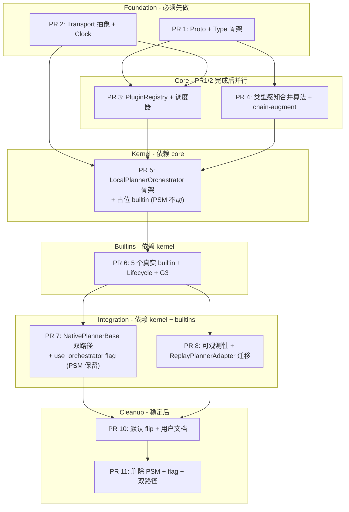

# DEP-XXXX 实施拆分（Implementation Breakdown）

> 配套文档：[`DEP-XXXX_Dynamo_Planner_Plugin_Architecture_zh.md`](DEP-XXXX_Dynamo_Planner_Plugin_Architecture_zh.md) (v9, READY_FOR_REVIEW)
> 代码基线：`components/src/dynamo/planner/` (`core/`、`connectors/`、`monitoring/`、`offline/`、`tests/`、`config/`)
> 创建：2026-04-20

## 目的

把 v9 DEP 拆成 **8 个独立 PR**，明确每个 PR 的范围、依赖、风险、估算、可并行性，便于团队排期 + 分工 + 渐进 review。

## 总览



**估算总量**：
- **主要 8 个 PR**（PR 1-8）：~6-10 周工程师工作量；2-3 人并行可压缩到 ~4-5 周
- **Cleanup PR 10/11**：在 PR 7-9 ship 后稳定 1-2 release（约 4-6 个月）才启动；约 2-3 周工作量

**Production cutover 策略**：
- PR 7 ship 时 `use_orchestrator: false`（升级即兼容、不切换）
- 运维按节奏开 flag（dev → staging → 1 个 prod cluster → 全部）
- PR 10 把默认改 `true`（升级即默认走 orchestrator；但运维仍可手动改 false）
- PR 11 删 flag + PSM（彻底完成迁移）

---

## PR 1：Proto + Type 骨架（无依赖）

### 范围

定义所有新 proto + Python type 骨架，**不接业务逻辑**——给后续 PR 提供契约。

### 新建文件
- `proto/dynamo/planner/plugin/v1/plugin.proto`（约 250 行）—— v9 DEP 中所有 message 与 service 定义
- `components/src/dynamo/planner/plugins/__init__.py`
- `components/src/dynamo/planner/plugins/proto_gen/`（buf/protoc 生成的 Python stubs）
- `components/src/dynamo/planner/plugins/types.py` —— `ComponentTarget`、`OverrideResult`、`PipelineContext` 等 Pydantic 类（与 proto 等价、便于 Python 内部使用）
- `tools/build/gen_planner_proto.sh` —— protoc 生成脚本

### 改动文件
无（不影响现有代码）

### 范围细节
- `PluginRegistry` service：`Register` / `Heartbeat` / `Unregister` / `ListPlugins` 4 RPC
- 4 个 stage service：`PredictPlugin` / `ProposePlugin` / `ReconcilePlugin` / `ConstrainPlugin`
- `PluginLifecycle` service：`Bootstrap` / `Reset`（v10 主文档 YAGNI 删除 `Snapshot` / `Restore`，proto3 加 RPC 是 backward-compatible，未来需要再加）
- 11 个 message：`PipelineContext`、`ComponentTarget`、`OverrideResult`、`ScalingProposal`、`PredictionData`、`ObservationData`、`TrafficMetrics`、`FpmData`、`WorkerState`、`PluginInfo`、`AcceptResult`/`RejectResult`
- 3 个 enum：`OverrideType` / `HoldPolicy` / `CircuitState`

### 测试
- proto 编译通过（CI 接 buf/protoc）
- Pydantic class 与 proto 字段双向 round-trip 测试

### 风险
- **低**——纯定义工作；与现有代码完全不冲突。

### 估算
- **单人 ~5 天 / 双人并行 ~2.5 天**（同步自 [PR 1 详细文档](DEP-XXXX_PR1_Detailed_zh.md) v1.0；原 2-3 天估算偏乐观，未含 Pydantic 镜像 + round-trip test）

### 可并行
✅ 与所有其他 PR 互不冲突；建议**第一个完成**

---

## PR 2：Transport 抽象 + Deterministic Clock（PR 1 完成后启动）

### 范围

提供 plugin 调用的 transport 框架与时间抽象——为 PR 3+ 的实际调用提供 plumbing。

### 新建文件
- `components/src/dynamo/planner/plugins/transport/__init__.py`
- `components/src/dynamo/planner/plugins/transport/base.py` —— `PluginTransport` ABC
- `components/src/dynamo/planner/plugins/transport/in_process.py` —— `InProcessTransport`（直接 Python 调用）
- `components/src/dynamo/planner/plugins/transport/grpc.py` —— `GrpcTransport`（含 mTLS 配置）
- `components/src/dynamo/planner/plugins/transport/uds.py` —— `UdsTransport`（grpc-over-uds）
- `components/src/dynamo/planner/plugins/clock.py` —— `Clock` ABC + `WallClock` + `VirtualClock`
- `tests/plugins/transport/test_transport_contract.py` —— `pytest.parametrize` 跑三 transport 一致性 contract

### 改动文件
无

### 范围细节
- 三种 transport 实现统一接口：`async def call(method, request) -> response`
- 失败统一抛 `PluginCallError`（含 timeout / connection / serialization 三种 subtype）
- gRPC transport 用 `grpc.aio` 异步 client；server 端框架是 `grpc.aio.server`
- mTLS 配置加载（`grpc.ssl_channel_credentials`）
- `VirtualClock` 提供 `advance(seconds)` API，由 replay adapter 控制

### 测试
- Contract test：用同一个 echo plugin、同一个 input，验证三 transport 输出位级一致
- `VirtualClock` 时间推进单测
- mTLS 配置加载单测

### 依赖
- PR 1（需要 proto types）

### 风险
- **中**——gRPC 异步生态成熟但 grpc.aio 与 mTLS 集成有些 boilerplate
- **建议**：找 K8s 已有 mTLS 配置作为参考（dynamo runtime 是否已经有？应优先复用）

### 估算
- **单人 ~6 天 / 双人并行 ~3 天**（同步自 [PR 2 详细文档](DEP-XXXX_PR2_Detailed_zh.md) v1.0；主要差异在 grpc + mTLS sub-task 与 contract test）

### 可并行
✅ 完成后 PR 3 / PR 5 都可启动

---

## PR 3：PluginRegistry + 调度器（PR 1 + PR 2 完成后启动）

### 范围

实现 `PluginRegistry` service + `PluginScheduler`（决定每 tick 调用谁）。

### 新建文件
- `components/src/dynamo/planner/plugins/registry/__init__.py`
- `components/src/dynamo/planner/plugins/registry/server.py` —— PluginRegistry RPC server 实现
- `components/src/dynamo/planner/plugins/registry/auth.py` —— K8s SA token / SPIFFE JWT / static secret 三种 trusted source
- `components/src/dynamo/planner/plugins/registry/circuit_breaker.py` —— 3 态 circuit breaker
- `components/src/dynamo/planner/plugins/scheduler.py` —— `PluginScheduler`：active set 计算（Triggered ∪ Inherited）+ HOLD_LAST cache
- `tests/plugins/registry/test_registry_server.py`
- `tests/plugins/registry/test_auth.py`
- `tests/plugins/registry/test_scheduler.py`
- `tests/plugins/registry/test_circuit_breaker.py`

### 改动文件
无（与现有代码隔离）

### 范围细节
- `Register`：调 auth → 校验 protocol_version → 加入 plugin 表 → 返回 negotiated_protocol_version
- `Heartbeat`：更新 `last_heartbeat_at`；missed_threshold 检查交给后台 task
- `Unregister`：立即清 cache + audit log
- `ListPlugins`：返回 `PluginInfo` 集合（含 circuit state + cache age 等运行时数据）
- `PluginScheduler`：
  - `compute_active_set(now, stage)` → `(triggered_plugins, inherited_results)`
  - HOLD_LAST cache 维护（写入 / 读取 / 失效条件 6 行表中所有触发）
  - missed tick 计算 + emit `tick_skipped_total`
- Auth source 抽象：实现 `K8sSATokenAuth` / `SpiffeJwtAuth` / `StaticSecretAuth`
- 配置加载：`scheduling.builtins.<id>.enabled` + `enable_*_scaling` toggle 互动逻辑

### 测试
- 6 行 cache 失效条件 各自单测（unregister / 心跳超时 / circuit open / 版本升级 / 配置 reload / 重启）
- 3 种 auth source 单测 + integration test（k8s SA token 至少 mock TokenReview API）
- 调度器：用 `VirtualClock` 推进时间，验证 active set 与 P1-2 时序图一致

### 依赖
- PR 1（types/proto）
- PR 2（transport + clock）

### 风险
- **中**——auth 涉及 K8s API 集成（TokenReview）；可能需要 RBAC 配置
- **建议**：第一版 auth 只支持 `static_secret` + `allow_unauthenticated`，K8s SA / SPIFFE 列为 follow-up

### 估算
- **单人 ~12 天 / 双人并行 ~7-8 天**（同步自 [PR 3 详细文档](DEP-XXXX_PR3_Detailed_zh.md) v1.0；含 cache invalidation 6 行表 6 个 must-pass 单测）
- **v1 最小集**（推迟 K8s SA / SPIFFE 到 PR 3.5 follow-up）：~9.5 天单人 / ~5-6 天双人并行

### 可并行
- 与 PR 4 完全并行
- 必须在 PR 5 之前完成

---

## PR 4：类型感知合并算法 + chain-augment（PR 1 完成后启动）

### 范围

实现 v9 决策语义节定义的合并算法——这是**纯函数模块**，无 I/O，无 state，最容易测试与正确性证明。

### 新建文件
- `components/src/dynamo/planner/plugins/merge/__init__.py`
- `components/src/dynamo/planner/plugins/merge/type_aware.py` —— PROPOSE/RECONCILE/CONSTRAIN 共用的 type-aware merge 算法（方案 A）
- `components/src/dynamo/planner/plugins/merge/chain_augment.py` —— PREDICT chain-augment 算法（含 partial-merge）
- `components/src/dynamo/planner/plugins/merge/types.py` —— 内部数据结构（PluginResult、MergeContext 等）
- `tests/plugins/merge/test_type_aware.py` —— 覆盖 v9 worked example 表全部场景 + 多 component + 多池 + final 覆盖 + REJECT 短路
- `tests/plugins/merge/test_chain_augment.py` —— PREDICT 4 种用法（replace / patch / augment / passthrough）+ final 终止

### 改动文件
无

### 范围细节
- `type_aware_merge(plugin_results, baseline) -> ScalingProposal`：
  - REJECT 短路检查（先于一切）
  - final 优先检查（先于 type 合并）—— 找出 `priority` 最小的 final，直接成为 stage 输出
  - 按 `(sub_component_type, component_name)` 分桶
  - 每桶：`floor = max(AT_LEAST)`、`ceiling = min(AT_MOST)`、`recommendation = priority 最小的 SET 或 baseline`
  - clamp(recommendation, floor, ceiling) → 写入 ScalingProposal.targets
- `chain_augment(plugin_chain, ctx) -> PredictionData`：
  - 按 priority 降序遍历
  - partial-merge 语义：`new` 中 unset 字段保留 `prev`
  - final=true 提前终止
- CONSTRAIN 阶段调用 `type_aware_merge` 时传 `set_allowed=False`，drop 任何 SET 条目 + emit `plugin_constrain_set_dropped` audit

### 测试
- v9 worked example 表 7 个场景**逐字断言**（单 component 5 行 + 多 component 2 行 + 分层多池 1 行 + final 覆盖 1 行）
- chain-augment 4 种用法各 2-3 case
- REJECT 短路在所有场景验证
- property-based test（hypothesis）：随机生成 plugin_results，验证 monotonicity（user plugin 加约束只会让结果更紧）

### 依赖
- PR 1（types/proto）

### 风险
- **低**——纯函数；测试覆盖容易做完

### 估算
- **单人 ~7 天 / 双人并行 ~4-5 天**（同步自 [PR 4 详细文档](DEP-XXXX_PR4_Detailed_zh.md) v1.0；含 worked example 9 case + property-based test）

### 可并行
- 与 PR 3 完全并行
- 必须在 PR 5 之前完成
- **PR 4 启动前 verify**：PR 1 中 `PredictionData` 字段必须是 `optional`（用于 chain-augment partial-merge 区分 set vs unset）

---

## PR 5：LocalPlannerOrchestrator + PSM 解构（依赖 PR 1-4）

### 范围

**最重的 PR**——v9 中 PSM 解构、LocalPlannerOrchestrator 新建、6 阶段流水线串联、并发模型实现。

### 新建文件
- `components/src/dynamo/planner/plugins/orchestrator/__init__.py`
- `components/src/dynamo/planner/plugins/orchestrator/orchestrator.py` —— `LocalPlannerOrchestrator` 主类
- `components/src/dynamo/planner/plugins/orchestrator/pipeline.py` —— 6 阶段流水线驱动（含并发执行）
- `components/src/dynamo/planner/plugins/orchestrator/internal_register.py` —— builtin / in_process plugin 内部注册路径
- `components/src/dynamo/planner/plugins/orchestrator/in_process_loader.py` —— in_process user plugin 配置加载
- ~~`components/src/dynamo/planner/plugins/state/regression_store.py`~~ —— **删除（v10 决议）**：regression model 由 `LocalPlannerOrchestrator` 内置 own + 通过 `get_regression(kind)` accessor 暴露给 builtin plugin（主文档 v10 line 423；PR 5 详细文档 v1.3 5-2）；不再有独立的 `RegressionModelStore` 类
- `tests/plugins/orchestrator/test_orchestrator_lifecycle.py`
- `tests/plugins/orchestrator/test_pipeline.py`
- `tests/plugins/orchestrator/test_concurrency.py` —— 并发模型测试（asyncio.gather / final 处理 / timeout / 失败隔离）

### 改动文件
- **PR 5 全程 read-only PSM**——**不删除**任何 `core/` 文件（v10 决议；PR 5 详细文档 v1.3 跨 sub-task 协调点 §1）
- ~~删除 `core/state_machine.py` / `core/load_scaling.py` / `core/throughput_scaling.py`~~ → **延到 PR 11 cleanup**（在 PR 7 双路径 + PR 10 默认 flip 稳定 1-2 release 后）
- 修改：[`core/types.py`](components/src/dynamo/planner/core/types.py) —— `TickDiagnostics` 扩展（PR 8 已落 `plugin_overrides` / `reconcile_reasons` / `held_over_plugins` 字段）；`ScalingDecision` / `PlannerEffects` 保持现状
- **预先打 git tag `pre-plugin-architecture`**（Pre-PR 5 fixture lock，已完成）锁定 PSM 行为快照；PR 5 期间任何意外改 PSM 都被 G3 fixture parity test 立即捕获

### 范围细节
- **预先打 git tag `pre-plugin-architecture`** ——已完成（Pre-PR 5 子项目）；fixture 在 `tests/plugins/g3_fixtures/golden/`；CI 通过 `test_g3_fixture_parity.py` 自动 verify（marker discovery，零 .yml 改动）
- `LocalPlannerOrchestrator.tick(tick, tick_input) -> PlannerEffects`：
  - 1. 计算 active set（从 PluginScheduler）
  - 2. PREDICT chain-augment（串行）
  - 3. PROPOSE asyncio.gather（return_exceptions=True、per-plugin timeout）
  - 4. RECONCILE asyncio.gather → type_aware_merge
  - 5. CONSTRAIN asyncio.gather → type_aware_merge(set_allowed=False)
  - 6. EXECUTE → 调 connector（PR 7 接入）
  - emit metrics + audit logs 全程
- 整 tick 用 `asyncio.wait_for(timeout=tick_max_duration_seconds)` 兜底
- HOLD_LAST cache 写入：plugin 成功返回时更新

### 测试
- `test_orchestrator_lifecycle.py`：startup → ticks → shutdown 完整生命周期
- `test_concurrency.py`：
  - PROPOSE 多 plugin 并行调用
  - 单 plugin timeout 不影响其他
  - tick_max_duration 触发整 tick 中止
  - final 在并行下正确选胜
- 还**不要**做 G3 行为等价测试（在 PR 6 完成 builtin plugin 后才能跑）

### 依赖
- PR 1 (types) + PR 2 (transport/clock) + PR 3 (registry/scheduler) + PR 4 (merge)

### 风险
- **中**（v10 决议后从「高」降为「中」）——PR 5 read-only PSM 策略消除了大部分 refactor 风险
- **核心约束**：`core/state_machine.py` / `load_scaling.py` / `throughput_scaling.py` 在 PR 5 期间**只读**；任何修改触发 G3 fixture parity test fail（CI block）
- **占位 builtin 策略**：PR 5 sub-task 5-7 用占位 plugin 内部临时实例化 PSM 调 mixin 方法（仅测试路径用，production 不接管）；PR 6 才用真实 builtin plugin 替换
- **风险点 2**：`core/adapters.py` 的 `NativePlannerBase` 在 PR 5 期间**完全不动**；PR 7 才引入双路径 + `use_orchestrator` feature flag
- **风险点 3**：mode 子类（PrefillPlanner 等）的 `_bootstrap_regression` / `_apply_effects` hook 在 PR 7 迁移（不在 PR 5）

### 估算
- 1-2 工程师 × 12-14 天（单人）/ 6-8 天（双人并行）—— PR 5 详细文档 v1.3 总估算
- 较 v0 估算（2-3 周）显著缩减，因为放弃 PR 5a/5b 拆分（PSM 不动 → 风险下降 → 范围收敛）

### 可并行
- 必须在 PR 6 之前完成（PR 5 是 orchestrator 骨架，PR 6 把占位 builtin 替换为真实 builtin）
- 与 PR 7 / PR 8 之间通过 `use_orchestrator` feature flag 解耦（PR 7 加双路径；PR 8 可独立 land 可观测性）

---

## PR 6：5 个内置 plugin + PluginLifecycle 实现（依赖 PR 5）

### 范围

实现 v9 内置 plugin 清单中的 5 个 plugin 类——把 PSM 中的 mixin 方法搬到对应 plugin 内部。

### 新建文件
- `components/src/dynamo/planner/plugins/builtins/__init__.py`
- `components/src/dynamo/planner/plugins/builtins/load_predictor.py` —— `BuiltinLoadPredictor`（持 `LOAD_PREDICTORS`）
- `components/src/dynamo/planner/plugins/builtins/throughput_propose.py` —— `BuiltinThroughputPropose`（通过 orchestrator 注入的 `get_regression(kind)` 访问 regression model + 现有 `_compute_*_replicas` 算法）
- `components/src/dynamo/planner/plugins/builtins/load_propose.py` —— `BuiltinLoadPropose`（通过 `get_regression(kind)` accessor + 现有 `_advance_load_*` 算法）
- `components/src/dynamo/planner/plugins/builtins/reconcile.py` —— `BuiltinReconcile`（直接 wrap `type_aware_merge`）
- `components/src/dynamo/planner/plugins/builtins/budget_constrain.py` —— `BuiltinBudgetConstrain`（持 `_apply_global_gpu_budget` 逻辑改为输出 AT_LEAST/AT_MOST）
- `components/src/dynamo/planner/plugins/lifecycle.py` —— `PluginLifecycle` ABC（仅 Bootstrap + Reset；v10 决议 YAGNI 删除 Snapshot/Restore）
- `tests/plugins/builtins/test_load_predictor.py`
- `tests/plugins/builtins/test_throughput_propose.py`
- `tests/plugins/builtins/test_load_propose.py`
- `tests/plugins/builtins/test_reconcile.py`
- `tests/plugins/builtins/test_budget_constrain.py`
- `tests/plugins/builtins/test_g3_behavior_parity.py` —— **关键** —— 加载 PR 5 中预先 dump 的 fixture，验证逐 case 位级一致

### 改动文件
- 修改：[`core/budget.py`](components/src/dynamo/planner/core/budget.py) —— `_apply_global_gpu_budget` 改为返回 `(min_endpoint, max_gpu_budget)` 而非直接 clamp（让 plugin wrapper 转为 AT_LEAST/AT_MOST）
- 修改：[`core/load/predictors.py`](components/src/dynamo/planner/core/load/predictors.py) —— `LOAD_PREDICTORS` 仍存在；`BuiltinLoadPredictor` import 它
- 修改：[`core/perf_model/`](components/src/dynamo/planner/core/perf_model)——regression model 类（`PrefillRegressionModel` 等）保持现状；由 `LocalPlannerOrchestrator`（PR 5）内部按 mode 实例化并通过 `get_regression(kind)` / `update_regression(kind, fpm)` 暴露

### 范围细节
- 每个 builtin plugin 实现 `PluginLifecycle` 中的 Bootstrap + Reset（必须）
- ~~Snapshot/Restore 推荐实现~~（v10 YAGNI 删除——proto 不再含 Snapshot/Restore RPC）
- `BuiltinReconcile` 实质上直接 forward 到 `type_aware_merge`（PR 4 已实现）
- `BuiltinBudgetConstrain` 内部把现有 `min_endpoint` / `max_gpu_budget` 拆为 AT_LEAST/AT_MOST 输出
- 所有 builtin plugin 通过 PR 5 的 `internal_register` 路径注册（不走 RPC）
- toggle 与 enabled 兼容逻辑（v5 的 4 行表）实现

### 测试
- 每个 builtin plugin 独立单测（用 InProcessTransport + 构造 PipelineContext）
- **G3 Behavior Parity Test Matrix**：完整 mode × scaling toggle × optimization_target 三维矩阵
- `test_state_machine.py` / `test_load_based_scaling.py` / `test_easy_scaling.py` 全部 case 仍通过（v10 决议：PR 5/6/7/8 全程 read-only PSM，旧测试自然不破）

### 依赖
- PR 5（orchestrator 骨架 + 占位 builtin + G3 fixture parity 通过）—— 注：v10 决议放弃 PR 5a/5b 拆分

### 风险
- **中-高**——G3 行为等价测试可能露出微妙的浮点 / 顺序依赖差异；需要细致比对
- **建议**：先做 `BuiltinThroughputPropose` 一个 plugin 跑通 G3 子集，证明方法可行后再扩展到其他 plugin

### 估算
- 2 工程师 × 2-3 周（每个 plugin 大约 3-5 天 + G3 测试调试）

### 可并行
- 内部多个 builtin plugin 可分人并行（`load_predictor` / `throughput_propose` / `load_propose` 各自独立）
- 必须在 PR 7 / PR 8 之前完成主体

---

## PR 7：NativePlannerBase 双路径 + Feature Flag + EXECUTE 衔接（依赖 PR 5 + PR 6）

### 范围

把 `NativePlannerBase` 改为支持双路径（PSM + orchestrator），通过 `use_orchestrator` feature flag 控制；EXECUTE 阶段与 connector 衔接。**不删除 PSM**——延后到 PR 10/11 cleanup。

### 改动文件
- 修改：[`core/adapters.py`](components/src/dynamo/planner/core/adapters.py) —— `NativePlannerBase`：
  - **保留**：直接持有 PSM 引用 + 调 `on_tick`（旧路径）
  - **新增**：可选持 `LocalPlannerOrchestrator` 引用（仅在 `use_orchestrator=true` 时构造）
  - **新增**：if 分支根据 flag 选择 engine（PSM vs orchestrator）；调用 `engine.tick()` 抽象接口
  - **新增**：`pre_execute` / `post_execute` hook（仅 orchestrator path 用，与 `_apply_effects` 共存）
- 修改：mode 子类（`PrefillPlanner` / `DecodePlanner` / `AggPlanner` / `DisaggPlanner`）：
  - `_bootstrap_regression` **保留**（PSM path 用）；新增 `_bootstrap_orchestrator_plugins`（orchestrator path 用，调 `orchestrator.bootstrap_plugins(benchmark_fpms=...)`）
  - `_apply_effects` 保留 + 新增 `pre_execute` / `post_execute`
- 修改：[`__main__.py`](components/src/dynamo/planner/__main__.py)——根据 flag 加载 orchestrator 配置
- 修改：[`config/planner_config.py`](components/src/dynamo/planner/config/planner_config.py)（新增 `scheduling` 子树 + `use_orchestrator: bool = false`）
- 修改：[`config/defaults.py`](components/src/dynamo/planner/config/defaults.py)（不破坏现有 `enable_*_scaling` toggle）

### 新建文件
- `components/src/dynamo/planner/plugins/execute.py` —— EXECUTE 阶段实现（ComponentTarget → TargetReplica 转换 + connector 调用 + 失败处理）
- `tests/integration/test_execute_pipeline.py`
- `tests/integration/test_dual_path_parity.py` —— 同 `(config, sequence_of_TickInput)` 在两条路径下输出对比

### 范围细节
- EXECUTE 跳过条件实现（REJECT / no_change / advisory）+ audit
- predicted_load 抽取并传给 GlobalPlannerConnector
- 失败处理：connector exception / GlobalPlanner ERROR / SCALING 三类 + emit metrics
- `use_orchestrator: false` 时 `scheduling.*` 配置字段被 ignore + log warning
- 两条路径**完全独立**——不能互相影响 state（避免 dual-execution 复杂度）

### 测试
- E2E：模拟一个完整 tick（两条路径各跑一遍）
- mode 子类的 4 种 mode 各跑一遍 → 两条路径各自行为正确
- 每种跳过条件触发对应 audit + metric
- **`pytest.parametrize` 跑两条路径**：所有 integration test 在 `use_orchestrator: false` 与 `true` 下都通过

### Rollout 节奏

| 阶段 | 时机 | use_orchestrator 默认 | 运维行动 |
|---|---|---|---|
| **PR 7 ship** | week N | `false` | 升级到新版本，行为不变；可手动开 flag 在 dev/staging 验证 |
| **Adoption** | week N+1 ~ N+4 | `false` | 1 个 prod cluster 开 flag → 1 周观察 → 多个 cluster → 全部 |
| **Default flip**（PR 8/9 ship 时附带） | week N+5+ | `true` | 升级即默认走 orchestrator；运维可手动改 false 回退 |
| **Stabilization** | 1-2 个 release | `true` | 持续观察；任何问题运维 1 分钟内可改 config 回退 |
| **Cleanup**（PR 10/11） | week N+10 ~ | flag 删除 | 删除 PSM 类、删除 flag、清理双路径分支 |

### 依赖
- PR 5（orchestrator 骨架）
- PR 6（真实 builtin plugins）

### 风险
- **中**——connector 接口零改动是设计目标，但 `GlobalPlannerConnector.set_predicted_load` 调用顺序要小心；mode 子类钩子迁移可能影响现有 e2e test
- **缓解**：`use_orchestrator: false` 时所有现有测试不变；orchestrator path 的 e2e test 单独 maintain

### 估算
- 1 工程师 × 2 周（多了 flag 分支 + 双路径 test 矩阵）

### 可并行
- 与 PR 8 部分并行（PR 8 中可观测性可独立做；ReplayPlannerAdapter 必须等 PR 7）

---

## PR 8：可观测性扩展 + ReplayPlannerAdapter 迁移（依赖 PR 5 + PR 6）

### 范围

实现 v9 中所有新 Prometheus 指标 + audit log 体系；迁移 `ReplayPlannerAdapter`。**不**删除 PSM——延到 PR 11 cleanup。

### 改动文件
- 修改：[`monitoring/planner_metrics.py`](components/src/dynamo/planner/monitoring/planner_metrics.py)：
  - 现有 `LOAD_DECISION_STATES` / `THROUGHPUT_DECISION_STATES` 追加新 enum 值（v6 changelog 列表）
  - 新增 13+ 个指标：plugin family / RECONCILE-CONSTRAIN / GlobalPlanner / EXECUTE / Tick scheduling 共 4 组
- 修改：[`monitoring/diagnostics_recorder.py`](components/src/dynamo/planner/monitoring/diagnostics_recorder.py) —— `TickDiagnostics` 新增 `plugin_overrides` / `reconcile_reasons` / `held_over_plugins` 字段
- 修改：[`offline/replay_adapter.py`](components/src/dynamo/planner/offline/replay_adapter.py)：
  - 不再 `import PlannerStateMachine`，改为 `import LocalPlannerOrchestrator`
  - 启动时构造 `InProcessTransport + VirtualClock + 内置 plugin Stub`
  - 暴露注册自定义 stub 的 hook
- ~~**删除** `core/state_machine.py`~~ —— **延到 PR 11 cleanup**（v10 决议：PR 8 read-only PSM；PR 11 在 PR 10 默认 flip 稳定 1-2 release 后才动）

### 新建文件
- `components/src/dynamo/planner/plugins/audit.py` —— 结构化 audit log 框架（plugin_evaluated / plugin_degraded / 等）
- `components/src/dynamo/planner/plugins/stubs/__init__.py` —— 各 stage plugin 的 Stub 实现（`PredictPluginStub` / `ProposePluginStub` / `ReconcilePluginStub` / `ConstrainPluginStub`）
- `tests/replay/test_replay_equivalence.py` —— 现有 trace 跑新 ReplayPlannerAdapter，输出与 fixture 位级一致

### 范围细节
- 新增 metrics 全部按 v9 「可观测性 → Prometheus 指标」节表格实现
- audit log 用 structlog 或 logging.LogRecord.extra 标准化
- ReplayPlannerAdapter 三阶段迁移路径：
  - 现状（v9 之前）：直接调 PSM.on_tick
  - 实施期：内嵌 InProcessOrchestrator
  - 长期：暴露 stub 注册 hook
- 测试文件改名：`test_state_machine.py` → `test_orchestrator_behavior_parity.py`（在 PR 6 已有 G3 fixture 测试基础上）

### 测试
- 每个新指标至少一个 unit test 验证标签 + 值
- ReplayPlannerAdapter 跑现有 trace，输出与 PR 6 dump 的 fixture 位级一致
- Prometheus enum 兼容：现有 dashboard 查询不报错

### 依赖
- PR 5（orchestrator）
- PR 6（builtin plugins）

### 风险
- **中**——`offline/replay_adapter.py` 重写要保持 `ReplayPlannerReport` 字段向后兼容
- Prometheus enum 字段添加要小心（`prometheus_client.Enum.states` 是构造时固定的）

### 估算
- 1 工程师 × 1.5-2 周

### 可并行
- 与 PR 7 大部分并行
- 是**最后**一个 PR——完成后可删除 PSM 类

---

## PR 10：默认 flip + 用户文档（依赖 PR 7-9 ship 后稳定 1-2 release）

### 范围

把 `use_orchestrator` 默认值从 `false` 改为 `true`；写运维文档说明回退方式。

### 改动文件
- 修改：[`config/defaults.py`](components/src/dynamo/planner/config/defaults.py)：`use_orchestrator: bool = True`
- 新建：`docs/components/planner/orchestrator-rollout.md` —— 运维 rollout / rollback 指引
- 新建：`docs/components/planner/orchestrator-deprecation.md` —— 宣告 PSM path 将在 PR 11 删除的 timeline

### 测试
- CI：默认值改了之后所有 e2e test 仍然通过
- 跑两条路径的 parametrize test 再 verify 一遍

### 依赖
- PR 7-9 ship 后稳定运行至少 2 个 release（约 1-2 月）
- production 用户至少 80% 已经手动开启 `use_orchestrator: true` 跑了一段时间

### 风险
- **低**——只是默认值变化；用户仍可改 false 回退；PSM 类还在

### 估算
- 1 工程师 × 2-3 天

---

## PR 11：删除 PSM + flag + 双路径分支（依赖 PR 10 + 至少 1 release）

### 范围

最终 cleanup——删除 `PlannerStateMachine` 类、`use_orchestrator` flag、`NativePlannerBase` 双路径分支。

### 改动文件
- **删除**：[`core/state_machine.py`](components/src/dynamo/planner/core/state_machine.py)
- **删除**：[`core/load_scaling.py`](components/src/dynamo/planner/core/load_scaling.py)
- **删除**：[`core/throughput_scaling.py`](components/src/dynamo/planner/core/throughput_scaling.py)
- 修改：[`core/adapters.py`](components/src/dynamo/planner/core/adapters.py) —— `NativePlannerBase` 简化为只持 `LocalPlannerOrchestrator`
- 修改：[`config/defaults.py`](components/src/dynamo/planner/config/defaults.py) —— 删除 `use_orchestrator` flag
- 修改：mode 子类 —— 删除 `_apply_effects` / `_bootstrap_regression`（已被 `pre/post_execute` / `_bootstrap_orchestrator_plugins` 取代）
- 修改：所有依赖 PSM 的 import / 测试

### 测试
- CI：`rg "PlannerStateMachine"` returns 0 results
- CI：`rg "use_orchestrator"` returns 0 results
- 完整 G3 fixture 通过（仅 orchestrator path）
- e2e test 通过

### 依赖
- PR 10 default flip 后稳定 1 release
- 团队对 PSM 路径删除达成共识（可以 sign-off）

### 风险
- **低**——production 已经全部跑在 orchestrator path 上；删除是清理 dead code
- 风险点：可能有运维偷偷开了 `use_orchestrator: false`（虽然默认 true）；PR 11 之前必须发 deprecation alert + 监控 flag 使用

### 估算
- 1 工程师 × 1 周（含 cleanup + import 修复 + 完整 CI 跑一遍）

---

## 推荐推进顺序

```text
Week 1-2:    PR 1 (proto)              [1 人]
             PR 2 (transport)          [1 人，PR 1 完成后启动]

Week 2-4:    PR 3 (registry/scheduler) [1 人]
             PR 4 (merge)              [1 人]

Week 4-6:    PR 5 (orchestrator 骨架)  [1-2 人]

Week 5-7:    PR 6 (真实 builtins + G3) [2 人]

Week 6-8:    PR 7 (NativePlannerBase 双路径 + flag)  [1 人]
             PR 8 (observability + replay)            [1 人]

[PR 7-9 ship; default false; 运维渐进 adoption]

Month 3-4:   PR 10 (默认 flip + 文档)  [0.5 人 × 2-3 天]

[default true; 稳定 1-2 release]

Month 5-6:   PR 11 (cleanup PSM + flag) [1 人 × 1 周]
```

**主要 8 个 PR 最少 4 周（高并发，3 人）；最多 8 周（1 人串行）。** Cleanup PR 10/11 在 4-6 个月后完成。

## 风险汇总

| PR | 风险等级 | 主要风险 | 缓解 |
|---|---|---|---|
| 1 | 低 | 无 | — |
| 2 | 中 | gRPC + mTLS 集成 boilerplate | 复用 dynamo runtime 已有实现 |
| 3 | 中 | K8s SA token / SPIFFE 集成 | v1 仅支持 static_secret + allow_unauthenticated；K8s/SPIFFE 列为 follow-up |
| 4 | 低 | 算法正确性 | property-based test + worked example 表逐 case |
| 5 | 中 | orchestrator 与 PSM 行为有微妙差异 | G3 fixture 锁定 + 占位 builtin 直接 wrap PSM mixin |
| 6 | 中-高 | G3 行为等价 | 一个 plugin 先 prototype；预先 dump fixture 锁定 |
| 7 | **中（v1.1 高 → v1.2 中）** | flag 路径切换、双路径维护 | use_orchestrator 默认 false 让升级不切换；运维主动控制；1 分钟 config 回退 |
| 8 | 中 | Prometheus enum 兼容 + replay 字段兼容 | 现有 dashboard 测试覆盖 |
| 10 | 低 | 默认 flip 引入边缘 case | 监控 use_orchestrator=false 的 cluster 占比；发 release note 提前预告 |
| 11 | 低 | 删除 PSM 影响 dead code 路径 | rg sweep 全 codebase；CI 跑完整 e2e |

## PR 1-4 Review 残留问题（2026-04-20，方案 C：已修 P0 + P1-2，下列实施时人 review）

下列 8 个问题在 PR 1-4 文档 review 阶段识别但未即时修；**实施工程师在对应 sub-task 启动前必须 read-through 本节**，按 mitigation 处理。

| 编号 | 优先级 | 问题 | 影响 PR | 实施时 mitigation |
|---|---|---|---|---|
| **P1-1** | 中 | proto3 `oneof` 默认空（plugin 忘 set）的 server 行为未文档化 | PR 1 / PR 5 | PR 5 实施时：orchestrator 收到空 `WhichOneof('result')` 视为 `PluginSerializationError` 抛出（非 ACCEPT 静默吞）；触发 circuit breaker 1 次失败计数；plugin bug 快速暴露 |
| **P1-3** | 中-高 | `InProcessTransport` sync plugin 偷偷做 blocking IO 会让 thread pool 满 | PR 2 / PR 6 | PR 2 README 加「sync plugin 红线」节；PR 7 production config 加 `executor_max_workers ≤ 8` 上限；PR 3 CircuitBreaker 加 transport-level slow-call detect（连续 N 次 > timeout/2 触发 OPEN，作为 follow-up） |
| **P1-4** | 中 | `Clock.sleep` cancellation + `VirtualClock` heap leak + `HeartbeatMonitor.run()` 无 graceful shutdown | PR 2 / PR 3 | PR 2 实施 2-5：`VirtualClock.advance` 增加 cleanup pass 清除已 cancelled 的 fut；PR 3 实施 3-6：`HeartbeatMonitor` 加 `stop()` 方法 + 用 `asyncio.Event` 替代 `_clock.sleep` 让 stop() 立即唤醒 |
| **P1-5** | 中 | `make_transport_for_endpoint` (PR 2) 与 `register_internal` (PR 3) 协作未文档化——in_process plugin endpoint 怎么生成？instance 怎么传？ | PR 2 / PR 3 | PR 3 3-2 `register_internal` 实施时：内部生成 `endpoint = f"inproc://{plugin_id}"`；调 `transport_factory(endpoint, in_process_instance=instance)`；PR 2-7 工厂函数已支持此参数 |
| **P2-1** | 低 | PR 1 文档头估算（行 6）写「2-3 天」与正文「单人 5 天 / 双人 2.5 天」矛盾 | PR 1 文档 | PR 1 实施启动前 cleanup：把行 6 改成「单人 ~5 天 / 双人 ~2.5 天」与正文一致 |
| **P2-2** | 低 | PR 4 `_partial_merge` 中 `_is_set` 用 proto class 还是 Pydantic mirror 未明 | PR 4 | PR 4 4-5 实施时：明确用 proto generated class + `proto.HasField()`；Pydantic mirror 仅 in-process plugin 内部代码用 |
| **P2-3** | 低-中 | hypothesis property test CI budget 未上限，可能 flaky | PR 4 | PR 4 4-6 实施时：`@settings(max_examples=50, deadline=2000)`；CI total budget < 30s；完整 1000 examples 跑只在 `nightly-ci.yml`（不阻塞 pre-merge） |
| **P2-4** | 低 | PR 3.5 follow-up 未 land 时，下游 PR 文档不能写 K8s SA / SPIFFE 部署示例 | PR 7 / PR 8 / 主 README | PR 7 / PR 8 README 实施时：所有部署示例必须用 `static_secret` + K8s Secret mount；明确标 caveat「PR 3.5 ship 后可改为 k8s_sa」 |

**Review report 完整参考**：本节是 review report 的简短归档，详细 issue 描述见 commit history。

---

## 跨 PR 必须协调的点

1. **fixture 锁定时机**：**已完成**（Pre-PR 5 子项目）—— git tag `pre-plugin-architecture` + `tests/plugins/g3_fixtures/golden/` 6 个场景 fixture + `test_g3_fixture_parity.py` CI 接入。这是 PR 5/6 G3 测试的 golden 来源；PR 5/6/7/8 全程 read-only PSM 由本测试自动守护。
2. **proto 字段 backward compatibility**：PR 1 一旦发布，后续 PR 改 proto 需要遵循 proto3 兼容规则（不能改字段号、不能改字段类型等）。
3. **配置 schema migration**：PR 7 加 `scheduling.builtins.<id>.enabled` 等新字段时，老配置（仅 `enable_*_scaling`）行为完全不变是硬要求；编排器要做兼容处理。
4. **Audit/Metric naming**：PR 3/5/6/7/8 都会加 audit/metric；建议在 PR 1 阶段就把名字 + label set 全部写入一个共享 constants 文件，避免后续 PR 不一致。
5. **测试 fixture 共享**：PR 4-8 的测试都会用到 mock plugin / mock connector / VirtualClock；建议在 PR 2 阶段把 `tests/conftest.py` 的 fixture 准备好（与 dynamo 现有 conftest 配合）。

## Follow-up（不在本 8 PR 范围内）

- **PR F1**：`PluginConnector.set_component_replicas` 提升为 abstract method（v9 EXECUTE 节末提到）
- **PR F2**：编排器层 state 持久化（HOLD_LAST cache / circuit state 跨重启）
- **PR F3**：DGD operator 自动 sync plugin 列表（v9 PluginRegistry 拓扑节末提到的 operator 优化）
- **PR F4**：GlobalPlanner 端可插件化（G4 deferred，本 DEP 明确不做）
- **PR F5**：英文版 DEP 翻译 + ai-dynamo upstream 提交（如果决定外部贡献）
- ~~**PR 3.5**：`K8sSATokenAuth` + `SpiffeJwtAuth` 实现~~ —— **landed 2026-04-23**（PR 3 v1 仅含 `static_secret`；PR 3.5 补齐 4 auth source 全集。见 `DEP-XXXX_PR3_Detailed_zh.md` v2.1）
- **PR 2.5（可选）**：mTLS cert hot reload via inotify（PR 2 v1 不含；cert-manager 默认 Pod restart 已够用）

---

## Cross-check 报告 v2（2026-04-20，主文档 v11 修订完成）

### v2 增量

主文档完成 v10 → v11 修订，处理 PR 1-4 详细文档 review 报告中的 9 个 CRITICAL + 6 个重要 gap + 8 条实施细节注解。详细决议见主文档 v11 changelog；本节仅记录 cross-check 现状。

| 文档 | 与主文档 v11 当前规范一致 |
|---|---|
| `DEP-XXXX_Dynamo_Planner_Plugin_Architecture_zh.md` v11（主文档） | ✅（自洽 + 加 v11 实施细节注解节）|
| `DEP-XXXX_Implementation_Breakdown_zh.md` v2 | ✅（本文档）|
| `DEP-XXXX_PR1_Detailed_zh.md` v1.1 | ✅（PredictionData optional 强制；与 v11 G-1 同步）|
| `DEP-XXXX_PR2_Detailed_zh.md` v1.0 | ✅（mTLS / Transport 3 类 / Clock 双接口 与 v11 一致）|
| `DEP-XXXX_PR3_Detailed_zh.md` v1.2 | ✅（v11 决议同步：in_process_plugins 路径迁移、HeartbeatMonitor transport 跳过、Pydantic extra forbid 等）|
| `DEP-XXXX_PR4_Detailed_zh.md` v1.1 | ✅（chain-augment final 强制契约 + REJECT > final 与 v11 G-2 同步）|
| `DEP-XXXX_PR5_Detailed_zh.md` v1.3 | ✅（含 v10/v11 决议引用）|
| `DEP-XXXX_PR6_Detailed_zh.md` v1.3 | ✅（含 v10/v11 决议引用）|
| `DEP-XXXX_PR7_Detailed_zh.md` v1.0 | ✅（含 v10/v11 决议引用）|
| `DEP-XXXX_PR8_Detailed_zh.md` v1.0 | ✅（含 v10/v11 决议引用）|

### v1 → v2 主要 cascade

v1 是为 PR 5/6/7/8 详细文档与 v10 主文档对齐做的 cross-check；v2 是为 PR 1-4 详细文档 review 后修订主文档 v11 同步。

**v2 修复的不一致点**（共 9 CRITICAL + 6 重要 gap）：

| 编号 | 不一致点 | v2 修复处 |
|---|---|---|
| **CRITICAL** |||
| C-1 | CONSTRAIN SET 静态拒承诺不可行 | 主文档 line 1142-1148 / 1274 改为 runtime drop only |
| C-2 | `in_process_plugins` 配置路径三方分歧 | 主文档 + PR 3 SchedulingConfig 统一到 `plugin_registration.in_process_plugins` |
| C-3 | `grpc_tls` 配置 schema 与 PR 2 mTLS 决议冲突 | 主文档配置示例改为 `grpc_mtls.secret_mount_path`（复用 cert-manager） |
| C-4 | `auth.trusted_sources` schema 形态冲突 | 主文档配置示例改为 string list + sibling 配置 |
| C-5 | `circuit_breaker.failure_threshold` 默认值不一致 | 主文档 + PR 3 统一为 5 |
| C-6 | Transport 2 类 vs 3 类 | 主文档 Replay 节改为 3 类描述 |
| C-7 | Clock 1 接口 vs 2 接口 | 主文档 Replay 节加完整 `Clock` 接口（now / monotonic / sleep）|
| C-8 | PSM 删除时机过时 | 主文档 line 2151 改为 PR 11 cleanup |
| C-9 | ReplayPlannerAdapter 阶段标过时 | 主文档迁移路径表改为 PR 8 |
| **重要 gap** |||
| G-1 | `PredictionData` 字段必须 optional 未明 | 主文档 proto + PREDICT 算法描述同步 |
| G-2 | REJECT > final 优先级未明 | 主文档 type-aware merge step 1 加注 |
| G-3 | HeartbeatMonitor `is_builtin` 跳过 bug | 主文档 + PR 3 改为 `transport_type == in_process` |
| G-4 | K8s SA / SPIFFE v1 不可用 caveat | 主文档「K8s 部署衔接」节加 caveat block |
| G-5 | Mode 子类 EXECUTE Hook 集成方式 | 主文档「Mode 子类的 EXECUTE Hook」节加 callback 注入示例 |
| G-6 | Replay 测试 Stub 必须 vs PR 6 | 主文档「Plugin Stub 契约」改为 user plugin 必须、内置可选 |

**v2 新增**：
- 主文档「v11 实施细节注解」节——8 条 M-1 ~ M-8 实施提醒（不是规范修订，是开发者备忘录）
- PR 3 详细文档 v1.2 修订历史

### 后续维护承诺（继承 v1）

- 任何主文档语义改动必须 cascade 到 Implementation Breakdown + 受影响 PR 详细文档
- PR 详细文档编号严格不重排
- 每个 PR 启动前先跑一次本 cross-check（对照主文档 v11 当前规范 + 上游 PR 的实际接口）

---

## Cross-check 报告 v1（2026-04-20，consistency check sub-task 完成）

### 起因

写完 PR 5/6/7/8 详细文档后，发现 Implementation Breakdown（v0）与主文档 v10、PR 5/6/7/8 详细文档存在多处不一致——主要因为 v10 主文档做了几次 YAGNI 简化，部分早期决策（PR 5a/5b 拆分、`RegressionModelStore` 独立类、`PluginLifecycle` 4 RPC）没有 cascade 到所有下游文档。

### 已修不一致点

| 编号 | 不一致点 | 修复处 |
|---|---|---|
| 1 | `PluginLifecycle` RPC 数：v10 主文档已删 Snapshot/Restore，仅剩 Bootstrap+Reset；Implementation Breakdown line 83 仍写 4 RPC | Implementation Breakdown line 83 改为 2 RPC + 注明 v10 决议 |
| 2 | `RegressionModelStore` 独立类：v10 主文档 line 21/423 决议「内置 own」；Implementation Breakdown line 263/325/326/340/486 仍假设独立类；主文档自身 line 373/486/1865 也有残留 | Implementation Breakdown 4 处 + 主文档 4 处全部改为「orchestrator 内置 own + get_regression accessor」 |
| 3 | PR 5 删除 `core/state_machine.py`：v10 决议「PR 5 全程 read-only PSM」+「PR 11 才删」；Implementation Breakdown PR 5 节仍写「删除 state_machine.py」 | Implementation Breakdown PR 5 节改为「PR 5 不动 PSM」+ 标 PR 11 cleanup；PR 8 节同步修「删除 PSM」 |
| 4 | PR 5a/5b 拆分：v10 决议放弃，合并为单 PR 5；Implementation Breakdown 多处仍提 PR 5a/5b | Implementation Breakdown PR 5/PR 6/「跨 PR 协调点」节全部改单 PR 5 |
| 5 | PR 1-4 估算偏乐观：原 Implementation Breakdown 估算未含部分 sub-task；新详细文档拆细后估算更高 | Implementation Breakdown PR 1-4 估算同步到详细文档数字 |
| 6 | Pre-PR 5 fixture lock 状态：原 Implementation Breakdown 写「在 PR 5 merge 之前打 git tag」（未来式）；实际已完成 | Implementation Breakdown 跨 PR 协调点 §1 改为「已完成」+ 指向 `pre-plugin-architecture` tag + CI 自动守护 |
| 7 | 主文档 v10 内部 line 419 「唯一例外是下方 RegressionModelStore」与 line 21/423「不再单建 store」矛盾 | 改为「regression model 由 orchestrator 内置 own + 通过 accessor 共享」 |

### 残留（已确认不修，是历史 changelog）

主文档 v10 line 124/186/188/194/199/222 等多处仍提到 Snapshot/Restore、RegressionModelStore——这些都是 v3/v6 的 **Changelog 段落**（历史决策记录），不是当前规范。保留有助读者理解架构演化。所有这些段落均出现在「修订历史 / Changelog」节内，不会与正文规范冲突。

### 一致性当前状态（v1 时点：2026-04-20，主文档仍为 v10）

> ⚠ 此表是 v1 时点快照，最新一致性状态已被 v2 cross-check（主文档 v11 修订后）取代——见上方「Cross-check 报告 v2」。

### 后续维护承诺

- **任何主文档语义改动必须 cascade**到 Implementation Breakdown + 受影响 PR 详细文档 + 残留代码 sub-task；
- **PR 详细文档编号严格不重排**（如 PR 1-4 文档已发布，未来若拆 PR 1.5 / PR 3.5，新建独立文档而非修改 PR 1 / PR 3 编号）；
- **每个 PR 启动前**先跑一次本 cross-check（对照主文档 v10 当前规范 + 上游 PR 的实际接口），约 30 分钟工作量；如发现新不一致，**先修文档再启动实施**。
