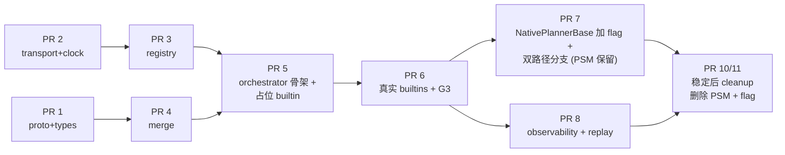
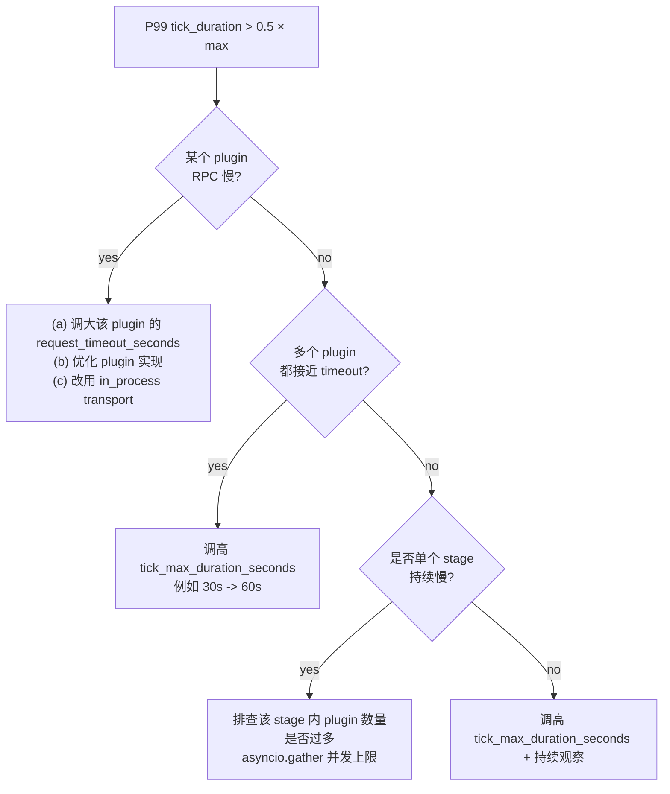

# PR 5 详细 Sub-task 计划

> 配套：[DEP-XXXX_Implementation_Breakdown_zh.md](DEP-XXXX_Implementation_Breakdown_zh.md) PR 5 节
> 配套：[DEP-XXXX_Dynamo_Planner_Plugin_Architecture_zh.md](DEP-XXXX_Dynamo_Planner_Plugin_Architecture_zh.md) v9
> 创建：2026-04-20
> 修订：v1.1 — 删除 dual-execution（一次性切换 + git revert 回退）；regression model 由 orchestrator 内置 own（不再单建 RegressionModelStore 类）；Q3 用 snapshot accessor 兜底

## 修订历史

### v2.1（2026-04-22）—— 5-7 / 5-8 落地（Option B：单 shim plugin）

**新增文件**：
- `plugins/orchestrator/psm_bridge.py`：`PSMBridge` 持有单 `PlannerStateMachine` 实例，暴露 `bootstrap / initial_tick / set_pending_tick / consume_and_run / last_effects`
- `plugins/builtins/psm_shim_propose.py`：单 PROPOSE 阶段占位 plugin `PsmShimProposePlugin`；`Propose(req)` 调 `bridge.consume_and_run()` → 得到 PSM 的 `PlannerEffects` → 把 `scale_to.num_prefill/num_decode` 包成 SET `ComponentTarget`（None → `AcceptResult`）
- `tests/plugins/orchestrator/test_g3_orchestrator_parity.py`：复用现成 `g3_fixtures/dump_tool._tick_for` + `_compare_records` + `_read_fixture` + `serializers.encode_*`；对 6 个场景**逐 tick byte-level 断言**

**关键设计决策（Option B，偏离原 PR 5 5-7 文档 "each plugin 构造自己的 PSM" 措辞）**：

原 5-7 表写的是 "5 个占位 plugin 各实例化 PSM" —— 实施发现该路径不可行：
- PSM `on_tick` 的 `_reset_diag()` / `_build_diagnostics()` / `_next_scheduled_tick()` 是**tick 级 bookkeeping**，不能按 plugin 拆
- 5 个独立 PSM 实例 = 5 份独立 predictor / regression / throughput_lower_bound 状态，跨 tick 不同步 → G3 必然 fail
- 5 个 plugin 共享 1 个 PSM 也有 race（`_advance_throughput` 写 `_throughput_lower_bound_p/d`，`_advance_load` 读）

**Option B 落地**：1 个 shim plugin wraps `PSM.on_tick`，`orchestrator` pipeline 正常驱动（PROPOSE → RECONCILE → CONSTRAIN → EXECUTE 全链路运行），但真正的决策产生源是 PSM。**PR 6 实际做 5 个真实 builtin 时会做合理拆分**（每个 builtin 有自己的 state，不共享 PSM）—— 这是 PR 6 的正经范围。

**`_baseline_from_worker_counts` 的 "返回 {}" 选择**：
- 初版想法：用 `ready_num_prefill/decode` 作 baseline 喂 `type_aware_merge`
- 首次跑 parity 失败（`tick 0 planner_effects.scale_to`：expected `None`, actual `{num_decode: 1}`）
- 根因：PSM 的 `scale_to=None` 含义是"本 tick 无决策"，而 orchestrator 带 baseline 会通过 merge 落地成 `execute_action=apply` + `final_proposal.targets=[decode=1]`
- 修复：placeholder 层**不从 worker_counts 派生 baseline**（返回 `{}`）；这样 shim 返回 Accept + empty baseline → merge 输出空 targets → M-4 `skip_no_targets` → projected `scale_to=None`，与 PSM 一致
- 文档化：真正的 PR 6 builtin 可以自主解释 baseline（例如作 AT_LEAST floor），这是 per-plugin 决策；placeholder 层把 baseline 排除是为了让 PSM 成为唯一决策源

**`_outcome_to_effects` 投影规则**：
- `scale_to`：从 orchestrator 的 `final_proposal.targets` 投影；当 `execute_action != "apply"` 时为 `None`
- `next_tick`：从 `bridge.last_effects.next_tick`（PSM 内部 `_next_scheduled_tick` 决定，placeholder 不 reinvent）
- `diagnostics`：同上，从 `bridge.last_effects.diagnostics`
- 当模式是单引擎（prefill / decode / agg）时，用 `bridge.last_effects.scale_to` 作 fallback 填充未被 orchestrator 触及的 component，保留 PSM 的 `ScalingDecision` 形状

**验证**：
- `test_g3_orchestrator_parity` 对 6 个场景（baseline_disagg / disagg_load_throughput / disagg_load_only_latency_easy / agg / prefill / decode）**全绿 byte-for-byte**
- 现存 `tests/plugins/g3_fixtures/test_g3_fixture_parity.py`（PSM self-guard）继续 green —— PSM 未被改动
- `pytest dynamo/planner/tests/plugins -q` → **311 passed**（305 baseline + 6 parity new）
- CI-parity → **509 passed, 1 skipped, 11 deselected**
- proto stubs 无漂移

**遗留 TickInput / PlannerEffects 桥接**：PR 5 5-2 原计划 `tick(scheduled_tick, tick_input) -> PlannerEffects` 在 v2.0 推迟给 PR 7。本 v2.1 的 parity 测试事实上**包含**了这个桥接逻辑（`_tick_input_to_context` / `_outcome_to_effects`）—— PR 7 NativePlannerBase 集成可以直接复用这两个函数而不用重做设计。

### v2.0（2026-04-22）—— 部分实施：骨架 + 流水线 + 测试（5-7/5-8 暂推迟）

**实施范围**（10 个 sub-task 中的 8 个）：
- **5-1** `plugins/orchestrator/` + `plugins/builtins/` 目录骨架
- **5-2** `LocalPlannerOrchestrator` 类（PipelineContext-native `tick`；TickInput/PlannerEffects 桥接留给 PR 7）
- **5-3** Scheduler 集成（无需显式 wire；PR 3 scheduler 在构造时自行 subscribe registry + circuit breaker + attach cache_age lookup）
- **5-4** 4 阶段流水线 `pipeline.py`：PREDICT chain_augment / PROPOSE / RECONCILE / CONSTRAIN 的 gather + type_aware_merge；**完整吸收 M-1 / M-4 / M-7 三条强制约束**；含 grep + AST 正则测试验证 pipeline.py 里 `asyncio.wait_for` 有且仅有 1 个（包裹 `_body()`，不包裹 `asyncio.gather`）
- **5-5** 模块级 `register_internal()` 函数（薄委托）
- **5-6** `load_in_process_plugins` importlib loader（module / class / kwargs）
- **5-9** 并发 / 失败 / 超时 5 个 case（gather 并行性 / 单 plugin raise 不影响其他 / per-plugin timeout / 连续失败 OPEN circuit 后下一 tick 被 drop / **M-1 priority pairing 验证**）
- **5-10** orchestrator README

**推迟到人工监督的 session**：
- **5-7** 占位 builtin plugin（5 个 wrap PSM mixin 方法）——需要阅读 `core/state_machine.py` / `load_scaling.py` / `throughput_scaling.py` 内部；有 behavior drift 风险
- **5-8** G3 fixture 等价 replay——依赖 5-7 和 fixture lock 的 golden jsonl 文件；主文档标为"PR 5 最重要的 acceptance 测试"，悄然失败代价比慢慢推进大
- **TickInput → PipelineContext 桥接 + PlannerEffects 投影**——按 DEP 设计，这个 adapter 归属 PR 7 (NativePlannerBase 双路径)；本 session orchestrator 的 public `tick` API 直接接受 PipelineContext，使骨架无需动 existing adapter 代码就能跑

**关键实施决策**：
- **baseline 跨 stage 流动**（PR 4 跨 sub-task §4 发现的隐含契约）：orchestrator 的 pipeline 在每 stage 结束后用 `_proposal_to_baseline(prev_proposal, fallback)` 重建 baseline 传给下一 stage；否则 RECONCILE 无 plugin 时会用初始 baseline 覆盖 PROPOSE 输出（最初 test 失败暴露此 bug）
- **PREDICT 适配**：PR 4 `chain_augment` 期望 `PredictPluginCallable` protocol（`call(method, context)`），但 registry 的 plugin 是 `call(method, request)`；orchestrator 内部的 `_PredictAdapter` 小包装器把 `PipelineContext` 包成 `PredictStageRequest`
- **Oneof 空结果处理**（v11 Hidden Knowledge）：`_response_to_plugin_result` 发现 `result_kind == ""` 时发 WARNING 而非抛错；当前 session 选择「记录 + 跳过」而非「强制短路」，避免个别 plugin bug 使全 stage 崩；PR 8 可视为 follow-up strict mode
- **`record_result` 只记录 OverrideResult**：AcceptResult 是 "no opinion"，RejectResult 已经短路整 stage；只有 OverrideResult 值得进 HOLD_LAST cache
- **Inherited HOLD_LAST results always non-final**：缓存重放不能重新断言 `final=True`（避免半死 plugin 的陈旧 final 永远霸占 stage）
- **PipelineOutcome 设计**：pipeline 是纯函数 —— 返回 `execute_action` 决策（`apply` / `skip_no_targets` / `skip_short_circuit` / `skip_tick_timeout`），不自己调 connector；PR 7 NativePlannerBase 负责把 `apply` 投影到 `PlannerConnector.add_component` / `remove_component`

**测试覆盖**（33 个新测试）：
- 12 lifecycle（构造 / 非法配置 / register_internal 一般 + 模块级 / regression accessors 3 case / tick happy / tick empty baseline / shutdown 幂等）
- 11 pipeline（PROPOSE 流向 RECONCILE baseline / CONSTRAIN AT_MOST 夹紧 / PREDICT 喂 PROPOSE 的 predictions / REJECT 短路 / M-4 empty targets / final priority / HOLD_LAST inherits / CONSTRAIN SET drop audit / chain-augment misuse 进 audit_events / tick timeout / **M-7 AST 反向测试**）
- 5 concurrency（5 plugin 并行 gather / 单 plugin raise 不影响 / per-plugin timeout record_failure / 连续失败 OPEN circuit 后 drop / **M-1 priority pairing**）
- 5 in_process_loader（module + class + kwargs / kwargs 传递 / unknown module / unknown class / multi-spec）

**验证**：
- `pytest dynamo/planner/tests/plugins -q` → **305 passed**（272 baseline + 33 orchestrator）
- CI-parity `pre_merge and planner and gpu_0` → **503 passed, 1 skipped, 11 deselected**
- proto stubs 无漂移
- `components/src/dynamo/planner/plugins/orchestrator/README.md` 含架构图 / 阶段表 / M-1/M-4/M-7 约束 / 部分实施 v.s. 推迟清单 / 测试布局

### v1.4（2026-04-22）—— v11 M-1/M-4/M-7 注解显式化

PR 1 + PR 2 编码完成后回看 v11 实施细节注解，PR 5 5-4 sub-task 显式吸收 3 条强制约束：

- **M-1 强制约束**（5-4 实现要点表新增）：`asyncio.gather` 后 plugin priority 通过 `zip(plugins, results)` 配对取得；禁止假定 `r.plugin.priority` 反向引用
- **M-4 强制约束**（5-4 实现要点 EXECUTE 行 + 单测）：`target_replicas == []`（所有 plugin ACCEPT）也走 EXECUTE skip 路径 + audit `execute_skipped_no_targets`
- **M-7 强制约束**（5-4 实现要点表新增 + 单测）：stage 内**禁止额外加 stage-level `asyncio.wait_for`**——PR 2 transport 层每个 `transport.call()` 内部已有 `asyncio.wait_for(coro, request_timeout_seconds)`（默认 5s）作 per-plugin 兜底；整 tick `tick_max_duration_seconds` 是最外层 systemic deadlock 防御。**5-4 单测加 negative test**：grep/ast.parse 扫 `pipeline.py` 禁止 `asyncio.wait_for(asyncio.gather(...))` 模式。CI lint 在 5-9 同步加。
- **不引入 `stage_max_duration_seconds`**：M-7 决议「v1 不做，标 follow-up」

无其他 sub-task 改动；估算不变。

### v1.3（2026-04-20）

YAGNI 清理（与 v9 DEP → v10 同步）：

- **删除 `snapshot_regression()` accessor**——v1.2 设计的"跨 await 边界用 snapshot"防御性接口被取消。理由：(a) v9 DEP v10 删除了 `Snapshot/Restore` RPC（不为生产 snapshot 用）；(b) "跨 await 边界"防御性场景目前不触发（所有 builtin 纯同步）；(c) 简化接口。
- **`get_regression()` 是唯一 accessor**——live reference，同步使用、零开销。
- **5-2 sub-task interface 简化**：删除 `snapshot_regression()` 行；`update_regression()` 仍保留（builtin-throughput-propose 在 PROPOSE 阶段调用 `update_regression('prefill', fpm)` 喂新观测）。
- **Q2 决议表更新**：删除"跨 await 边界用 snapshot_regression()"行；保留单条「同步使用 get_regression()」+ 警告语「未来若引入 async builtin（如调外部 service 的 plugin）需重新审视并加 snapshot 接口或锁」。

### v1.2（2026-04-20）

修正 v1.1 中过于乐观的 production 切换策略。考虑到 PR 5+6+7 整体相当于核心重构（~3000-4000 行新代码 + 删除 PSM），一次性切换风险较高：

- **PR 7 加 `use_orchestrator` feature flag**——默认 `false`（升级即兼容、不切换）；运维按节奏开启（dev → staging → 1 个 prod cluster → 全部）；PR 8/9 ship 时改默认 `true`；PR 10/11 cleanup 删除 flag + PSM 类。
- **PR 7 不删 PSM**——`NativePlannerBase` 加 if 分支（双路径分流）；PSM 类多保留 2-3 个版本作为安全网。
- **回退方案升级**——production 出问题改 config 一行 + 进程 reload，**1 分钟内回退**（替代 v1.1 的"git revert + redeploy 30 分钟"）。
- **新增 PR 10/11 cleanup PR**（详见 [Implementation Breakdown](DEP-XXXX_Implementation_Breakdown_zh.md)）——稳定后才删除 PSM + flag + 双路径分支。

### v1.1（2026-04-20）

- **删除 dual-execution 整套机制**——PSM 与 orchestrator 不同时跑；安全保证靠 G3 fixture lock + 单元测试。
- **regression model ownership 简化**——从「新建 `RegressionModelStore` 类」改为「`LocalPlannerOrchestrator` 内置 own」，少一层抽象类。
- **Q3 await 边界处理**——orchestrator 提供两个 accessor：`get_regression()` 返回 live reference（同步使用、零开销）；`snapshot_regression()` 返回不可变快照（跨 await 使用）。
- **PR 5a/5b 拆分取消**——合并为单个 PR 5（仅做 orchestrator 骨架 + 占位 builtin，**不动** NativePlannerBase / PSM）；真正切换在 PR 7。
- ~~v1.1 提议"PR 7 一次性切换 + git revert 回退"~~——v1.2 修正为 feature flag 方案。

### v1.0（初稿）
拆 PR 5a/5b + dual-execution 安全网；后被简化。

## 为什么 PR 5 风险中等（v1.1 更新）

PR 5 涉及：
- 新增编排器 + 流水线 + 并发模型（~1500-2000 行新代码）
- **不动** NativePlannerBase / PSM —— production 0 影响
- 必须与 PR 6（builtin plugin）配合保证 G3 行为等价

**风险降低的原因**：
- Production cutover 推迟到 PR 7（NativePlannerBase 切换 + 删 PSM）；
- PR 5 merge 后 production 仍走旧 PSM 路径；
- PR 5 本身相当于"在测试环境实现 orchestrator"，影响面小。



---

## Pre-PR 5：Fixture Lock 协议（必须先做，独立提交）

### 目的
锁定现有 PSM 的输出快照作为 G3 行为等价矩阵的永久 golden source。在 PR 5 修改任何核心代码之前完成。

### 步骤

| # | 任务 | 输入 | 输出 |
|---|---|---|---|
| 1 | 创建 fixture dump 工具 | 现有 `tests/unit/test_state_machine.py` / `test_load_based_scaling.py` / `test_easy_scaling.py` | `tests/plugins/g3_fixtures/dump_tool.py` |
| 2 | 跑 dump 工具，生成黄金 fixture | `(config, sequence_of_TickInput)` 全部 case | `tests/plugins/g3_fixtures/golden/*.jsonl`（每文件含 `{tick_input, expected_planner_effects}` 序列）|
| 3 | 打 git tag | 当前 main HEAD | git tag `pre-plugin-architecture` |
| 4 | 在 README 写明 | — | `tests/plugins/g3_fixtures/README.md` 说明 fixture 来源 commit、生成命令、再生成步骤 |

### Acceptance
- 跑 `pytest tests/plugins/g3_fixtures/dump_tool.py` 生成的 jsonl 与 `pre-plugin-architecture` tag 一致
- fixture 文件覆盖：`mode ∈ {agg, disagg, prefill, decode}` × `(enable_load, enable_throughput) ∈ {(F,T), (T,T), (T,F)}` × `optimization_target ∈ {sla, latency, throughput}` 三维矩阵全部 case

### 估算
- 1 工程师 × 2-3 天

---

## PR 5：LocalPlannerOrchestrator 骨架 + 占位 builtin

### 子任务清单（10 项）

#### 5-1：创建 plugins/orchestrator/ 目录结构

| 项 | 内容 |
|---|---|
| 新建 | `components/src/dynamo/planner/plugins/orchestrator/__init__.py`<br/>`components/src/dynamo/planner/plugins/orchestrator/orchestrator.py`（空 class）<br/>`components/src/dynamo/planner/plugins/orchestrator/pipeline.py`（空函数）<br/>`components/src/dynamo/planner/plugins/orchestrator/internal_register.py`（空函数）<br/>`components/src/dynamo/planner/plugins/orchestrator/in_process_loader.py`（空函数）<br/>`components/src/dynamo/planner/plugins/builtins/__init__.py` |
| 修改 | 无 |
| 测试 | 无（纯骨架）|
| 依赖 | PR 1 / 2 / 3 / 4 完成 |
| 估算 | 0.5 天 |

#### 5-2：实现 LocalPlannerOrchestrator + Regression 内置管理

| 项 | 内容 |
|---|---|
| 实现位置 | `plugins/orchestrator/orchestrator.py` |
| 接口 | <pre>class LocalPlannerOrchestrator:<br/>    def __init__(<br/>        self,<br/>        config: PlannerConfig,<br/>        capabilities: WorkerCapabilities,<br/>        clock: Clock,<br/>        registry: PluginRegistry,<br/>        scheduler: PluginScheduler,<br/>        connector: PlannerConnector,<br/>    ):<br/>        # 内置实例化 regression model（按 mode）：<br/>        self._regression = self._init_regression(config)<br/><br/>    # ── Regression accessors（给 builtin plugin 用）──<br/>    def get_regression(self, kind: str):<br/>        """Live reference; single-threaded asyncio 下无锁；plugin 使用时禁止跨 await 重读（详见 Q2）。"""<br/>        return self._regression.get(kind)<br/>    <br/>    def update_regression(self, kind: str, fpm):<br/>        """Mutator; 由 builtin-throughput-propose 在 PROPOSE 阶段调。"""<br/>        self._regression[kind].add_observation(fpm)<br/>    <br/>    # ── Plugin 生命周期 ──<br/>    def register_internal(self, plugin_id, plugin_type, priority, ...): ...<br/>    async def tick(self, tick, tick_input) -> PlannerEffects: ...<br/>    async def shutdown(self): ...<br/>    def list_plugins(self) -> list[PluginInfo]: ...</pre> |
| **Regression accessor 使用规则** | <ol><li>**`get_regression()` 是唯一 accessor**——live reference，同步使用、零开销；</li><li>**当前所有 builtin plugin 都纯同步**，跨 await 边界访问场景不存在；</li><li>**警告**：未来若引入 async builtin（如调外部 service 的 plugin），需重新审视——加 `snapshot_regression()` accessor 或加锁；本 DEP 不预先实现这些 future-proof 接口（YAGNI）。</li></ol> |
| 单测 | `tests/plugins/orchestrator/test_orchestrator_lifecycle.py`：<br/>- 构造 orchestrator → 注册 stub plugin → 调一次 tick → 关闭<br/>- `get_regression()` 在 mode=disagg/prefill/decode/agg 各自返回正确实例<br/>- `update_regression()` 写入后 `get_regression()` 反映最新值 |
| 依赖 | 5-1 |
| 估算 | 2 天 |

#### 5-3：集成 PluginScheduler

PluginScheduler 实现在 PR 3。PR 5 仅 import + 集成。

| 项 | 内容 |
|---|---|
| 集成 | 从 PR 3 import `PluginScheduler` 到 orchestrator |
| 单测 | `tests/plugins/orchestrator/test_scheduler_integration.py`：用 `VirtualClock` + 内存 plugin set，验证 active set 计算正确 |
| 依赖 | 5-2, PR 3 完成 |
| 估算 | 0.5 天 |

#### 5-4：实现 6 阶段流水线驱动

| 项 | 内容 |
|---|---|
| 实现位置 | `plugins/orchestrator/pipeline.py` |
| 接口 | <pre>async def run_pipeline(<br/>    ctx: PipelineContext,<br/>    scheduler: PluginScheduler,<br/>    merger: TypeAwareMerger,    # from PR 4<br/>    chain_augment: ChainAugment, # from PR 4<br/>    connector: PlannerConnector, # for EXECUTE<br/>    clock: Clock,<br/>    config: ConcurrencyConfig,<br/>) -> PlannerEffects: ...</pre> |
| 实现要点 | <ol><li>active set 计算（PREDICT 阶段）+ chain-augment（串行）</li><li>active set 计算（PROPOSE 阶段）+ asyncio.gather + type-aware merge</li><li>active set 计算（RECONCILE 阶段）+ asyncio.gather + type-aware merge</li><li>active set 计算（CONSTRAIN 阶段）+ asyncio.gather + type-aware merge (set_allowed=False)</li><li>EXECUTE：转 `ComponentTarget → TargetReplica` + connector 调用 + 失败处理；M-4 v11：`target_replicas == []` 也跳过 + audit `execute_skipped_no_targets`</li><li>整 tick 用 `asyncio.wait_for(timeout=tick_max_duration_seconds)` 兜底</li></ol> |
| **M-7 v11 强制约束** | <ol><li>**stage 内 plugin 调用统一用** `await asyncio.gather(*[p.transport.call("Propose", ctx) for p in active_plugins], return_exceptions=True)`——**禁止额外加 stage-level `asyncio.wait_for`**</li><li>理由：PR 2 transport 层每个 `transport.call()` 内部已经走 `asyncio.wait_for(coro, request_timeout_seconds)`（默认 5s），单 plugin 不能拖死 stage；额外加 stage timeout 会引入冗余 + 误屏蔽 per-plugin 失败信号</li><li>整 tick `asyncio.wait_for(tick_max_duration_seconds)` 是**最外层**安全兜底（防 systemic deadlock），不是 per-stage 限流</li><li>不引入 `stage_max_duration_seconds` 配置（M-7 决议「v1 不做，标 follow-up」）</li><li>实施时 `pipeline.py` 内**禁止** `asyncio.wait_for` 直接 wrap 整个 stage 的 gather call；CI lint 在 5-9 加 grep check</li></ol> |
| **M-1 v11 强制约束** | gather 后 plugin priority 访问必须用 zip 配对：<br/><pre>plugins = list(active_plugins)  # 保证顺序<br/>results = await asyncio.gather(*[p.transport.call(...) for p in plugins], return_exceptions=True)<br/>paired = list(zip(plugins, results))<br/># 后续 type-aware merge / final detect 必须从 paired 取 priority<br/>type_aware_merge([(p.priority, r) for p, r in paired if not isinstance(r, Exception)])</pre> 禁止假定 `r.plugin.priority` 存在。 |
| 单测 | `tests/plugins/orchestrator/test_pipeline.py`：覆盖<br/>- Happy path（一个 stub plugin per stage，验证流水线串通）<br/>- 单 plugin timeout 不影响其他<br/>- 整 tick timeout 触发 abort<br/>- final 在 PROPOSE 中正确选胜<br/>- REJECT 短路<br/>- HOLD_LAST cache 命中<br/>- **M-4**：所有 plugin ACCEPT → CONSTRAIN 输出空 targets → EXECUTE skip + audit `execute_skipped_no_targets`<br/>- **M-7 negative test**：用 grep / ast.parse 扫 `pipeline.py`，断言不含 `asyncio.wait_for(asyncio.gather(`、不含 `asyncio.wait_for(*[plugin.` 模式 |
| 依赖 | 5-2, 5-3, PR 4（merger 与 chain-augment 实现）|
| 估算 | 3 天 |

#### 5-5：实现 Internal Register API

| 项 | 内容 |
|---|---|
| 实现位置 | `plugins/orchestrator/internal_register.py` |
| 接口 | <pre>def register_internal(<br/>    orchestrator: LocalPlannerOrchestrator,<br/>    plugin_id: str,<br/>    plugin_type: str,<br/>    priority: int,<br/>    execution_interval_seconds: float,<br/>    hold_policy: HoldPolicy,<br/>    instance: PluginBase,  # in-process callable<br/>    is_builtin: bool = True,<br/>): ...</pre> |
| 行为 | 1. 跳过 auth_token 校验<br/>2. 跳过 protocol_version 校验（编译时绑定）<br/>3. 把 instance 包装为 `InProcessTransport` adapter<br/>4. 加入 `PluginRegistry`（在 PluginInfo 中标 `is_builtin=true`）<br/>5. 不需要 Heartbeat（in-process 不会"丢失"）|
| 单测 | `tests/plugins/orchestrator/test_internal_register.py`：注册一个 in-process stub → 验证出现在 ListPlugins 中 + 可被 tick 调用 |
| 依赖 | 5-2 |
| 估算 | 1 天 |

#### 5-6：实现 in_process User Plugin 配置加载

| 项 | 内容 |
|---|---|
| 实现位置 | `plugins/orchestrator/in_process_loader.py` |
| 接口 | <pre>def load_in_process_plugins(<br/>    orchestrator: LocalPlannerOrchestrator,<br/>    config_list: list[InProcessPluginSpec],<br/>):<br/>    for spec in config_list:<br/>        cls = importlib.import_module(spec.module).__dict__[spec.class_]<br/>        instance = cls(**spec.kwargs)<br/>        register_internal(orchestrator, spec.plugin_id, ...)</pre> |
| 配置 schema | `InProcessPluginSpec` Pydantic class（v9 配置 yaml 中 `in_process_plugins[]` 一项）|
| 单测 | `tests/plugins/orchestrator/test_in_process_loader.py`：构造 fake spec + import 一个测试用 plugin class → 验证注册成功 |
| 依赖 | 5-5 |
| 估算 | 1 天 |

#### 5-7：实现占位 builtin plugin（5 个，wrap PSM mixin 方法）

**目的**：让 PR 5 能完整跑通流水线 + 验证 G3 fixture，但**不**实现真正的 builtin plugin（PR 6 才做）。占位 plugin 直接 wrap 现有 PSM 的 mixin 方法，保证行为字节级等价。

| 项 | 内容 |
|---|---|
| 新建 | `plugins/builtins/load_predictor_placeholder.py`<br/>`plugins/builtins/throughput_propose_placeholder.py`<br/>`plugins/builtins/load_propose_placeholder.py`<br/>`plugins/builtins/reconcile_placeholder.py`（直接调 type_aware_merge）<br/>`plugins/builtins/budget_constrain_placeholder.py` |
| 占位 plugin 实现策略 | 每个占位 plugin 在构造时**临时**实例化一个 `PlannerStateMachine`（仅 PR 5 期间）；调用其 mixin 方法获取结果；包装为对应 `OverrideResult`<br/>例如 `BuiltinThroughputProposePlaceholder`：<br/><pre>def __init__(self, config, capabilities):<br/>    self._psm = PlannerStateMachine(config, capabilities)<br/>async def Propose(self, ctx):<br/>    decision = self._psm._advance_throughput(ctx.observations.traffic)<br/>    return OverrideResult(targets=[<br/>        ComponentTarget("prefill", replicas=decision.num_prefill, type=SET),<br/>        ComponentTarget("decode", replicas=decision.num_decode, type=SET),<br/>    ])</pre> |
| **关键约束** | 这些占位 plugin **不接管** production——仅在 orchestrator 测试中跑；NativePlannerBase 仍走 PSM 旧路径（PR 7 才切换） |
| 单测 | `tests/plugins/builtins/test_*_placeholder.py`：每个占位 plugin 独立单测，输出与直接调 PSM mixin 方法位级一致 |
| 依赖 | 5-5 |
| 估算 | 2 天 |

#### 5-8：跑 G3 行为等价 fixture（占位 plugin 版）

| 项 | 内容 |
|---|---|
| 实现位置 | `tests/plugins/orchestrator/test_g3_placeholder_parity.py` |
| 流程 | <ol><li>实例化 orchestrator + 注册 5 个占位 builtin plugin</li><li>加载 Pre-PR 5 dump 的 fixture（jsonl 文件）</li><li>逐 tick 喂 TickInput → orchestrator.tick() → 与 fixture 中 expected_planner_effects 比对</li><li>断言位级一致</li></ol> |
| 价值 | 验证 orchestrator + 流水线 + 占位 plugin 链路与 PSM 输出等价；这是 PR 5 最重要的 acceptance 测试 |
| **预期 drift 处理** | 第一次跑可能发现 mismatch（orchestrator 实现 bug 或 fixture 锁定时机问题）；逐个修复直到 0 mismatch；**不**放宽阈值或加 escape hatch |
| 依赖 | 5-7, Pre-PR 5 fixture lock |
| 估算 | 2 天（包含 debug 时间）|

#### 5-9：并发 / 失败 / 超时单测

| 项 | 内容 |
|---|---|
| 实现位置 | `tests/plugins/orchestrator/test_concurrency.py` |
| Cases | <ol><li>PROPOSE 多 plugin 并行调用（asyncio.gather）—— 验证总耗时 ≈ max(单 plugin 耗时)</li><li>单 plugin timeout 抛 `PluginCallError(TimeoutError)`，其他 plugin 正常完成；该 plugin 触发 circuit breaker</li><li>整 tick timeout（`tick_max_duration_seconds`）触发 abort + emit `tick_timeout_total` metric</li><li>final 在并行下正确选胜（多 final 时 priority 数字最小者）</li><li>REJECT 短路（任何 plugin 返回 REJECT，整 stage 短路）</li><li>HOLD_LAST cache 命中（plugin 上次结果重新注入 active set）</li></ol> |
| 依赖 | 5-4 |
| 估算 | 1.5 天 |

#### 5-10：PR 5 集成测试 + 文档

| 项 | 内容 |
|---|---|
| 集成测试 | `tests/integration/test_orchestrator_e2e.py`：mock connector + 真实 orchestrator + 占位 builtin → 跑一个完整 tick 链路 |
| 文档 | `plugins/orchestrator/README.md`：架构图 + 主要 class / 接口 + 测试运行说明 |
| 依赖 | 5-7, 5-8, 5-9 |
| 估算 | 1 天 |

### PR 5 总估算
- **12-14 工程师天**单人；**6-8 天**两人并行（5-2 / 5-4 / 5-7 可并行）

### PR 5 Acceptance Criteria
- [ ] **现有所有测试 100% 通过**（NativePlannerBase / PSM 完全没动）
- [ ] G3 fixture 在占位 builtin 路径下逐 tick 位级一致
- [ ] 新增 `tests/plugins/orchestrator/` 全部通过
- [ ] 新增 `tests/plugins/builtins/test_*_placeholder.py` 全部通过
- [ ] `tests/integration/test_orchestrator_e2e.py` 通过
- [ ] PR description 明确：本 PR **不影响 production**（NativePlannerBase 仍走 PSM）
- [ ] **M-1 v11**：5-4 实现 `pipeline.py` stage driver 用 `zip(plugins, results)` 配对取 priority；单测显式覆盖
- [ ] **M-4 v11**：5-4 实现 EXECUTE 跳过 `target_replicas == []` + audit `execute_skipped_no_targets`；单测覆盖
- [ ] **M-7 v11**：5-4 实现 `pipeline.py` **不含** `asyncio.wait_for(asyncio.gather(...))` stage-level wrap；negative test (grep/ast.parse) 通过；5-9 lint check 同步加

### PR 5 容量规划（Capacity Planning）

`tick_max_duration_seconds` 默认 30s 是合理初始值，但 production 部署前（PR 7）**必须**做容量规划：

**监控基线**

| 指标 | 健康范围 | 告警阈值 |
| --- | --- | --- |
| `dynamo_planner_tick_duration_seconds` P99 | < 0.5 × `tick_max_duration_seconds` | > 0.8 × `tick_max_duration_seconds` |
| `dynamo_planner_tick_timeout_total` | 0 | > 1 / hour |
| `dynamo_planner_tick_skipped_total{plugin_id}` | 0 | > 1 / hour（除非 plugin cadence 远大于 tick）|
| `dynamo_planner_plugin_latency_seconds{plugin_id}` P99 | < `request_timeout_seconds` × 0.5 | > `request_timeout_seconds` × 0.8 |

**调优决策树**



**Production 部署 runbook**（PR 7 落地时执行）：
1. 在 dev/staging 跑代表性 workload；
2. 收集 `tick_duration_seconds` 直方图，记录 P50/P95/P99；
3. 设置 `tick_max_duration_seconds = max(30, ceil(P99 × 2))`（保留 2× safety margin）；
4. 配置 alert：P99 / `tick_max_duration_seconds` > 0.8 触发；
5. 部署后 1 周内每天 check ratio；如接近 0.8 立即调优。

---

## Resolved Questions（已决议）

下列问题在 PR 5 启动前已经决议，相关 sub-task spec 已按决议实现。

### Q1: `tick_max_duration_seconds` 默认值 30s

**决议：30s 作为初始默认；production 部署前（PR 7）必须按容量规划调优**

参考点：
- 现有 `_throughput_loop` / `_load_loop` 单 iteration 实测 < 1s；
- 默认 plugin RPC timeout = 5s × 6 stage（最坏 worst case）≈ 30s；
- 用户注册多个慢 plugin（如 LLM-based predictor）可能逼近上限。

**容量规划要求**（必须写入 production 部署 runbook）见上方「PR 5 容量规划」节。

### Q2: `Regression Model` ownership 与 thread-safety

**决议：orchestrator 内置 own + 提供 live reference 与 snapshot 两个 accessor**

之前考虑过单建 `RegressionModelStore` 类，最终简化为编排器内置：

```python
class LocalPlannerOrchestrator:
    def get_regression(self, kind: str):
        """Live reference; 同步使用、零开销。"""
        return self._regression.get(kind)
    
    # snapshot_regression() v1.3 已删除（YAGNI；当前 builtin 纯同步不需要）
    # 未来若引入 async builtin，可加：
    #     def snapshot_regression(self, kind: str):
    #         return copy.deepcopy(self._regression.get(kind))
```

**使用规则**：

| 场景 | 用 |
| --- | --- |
| Plugin 方法内同步使用（当前所有 builtin） | `get_regression()` |
| Plugin 内部完全不接触 store（如 user gRPC plugin） | 不需要 |
| Plugin 跨 `await` 边界使用（当前不存在） | **暂未支持**——如未来需要，加 `snapshot_regression()` accessor 或加锁 |

**当前所有 builtin plugin 都纯同步——全部用 `get_regression()`**。本 DEP 遵循 YAGNI 不预先实现 snapshot 接口；future-proof 接口在真有需求时（async builtin 引入时）再加。

**为什么不加锁**：
- single-threaded asyncio event loop（Gap 5 决议）；
- 没有真正的 thread 并发；
- snapshot 解决"伪并发"陷阱（跨 await 时数据可能被改）；
- 不需要 mutex / RWLock。

未来若引入 multi-thread / multi-process（**不在本 DEP 范围**），需要重新审视。

---

## 跨 Sub-task 必须协调的点

### 1. fixture lock 必须在 PR 5 任何代码改动之前完成

Pre-PR 5 fixture lock 是 G3 验收的 golden source；如果 PR 5 期间某 sub-task 不小心改到 PSM mixin 方法，fixture 就要重新 dump，golden 失效。

**约束**：PR 5 sub-task 全部 **read-only** PSM；不修改 `core/state_machine.py` / `core/load_scaling.py` / `core/throughput_scaling.py`。

### 2. 占位 builtin plugin 不接管 production

PR 5 中的占位 builtin plugin 仅在 orchestrator 测试中跑；NativePlannerBase 完全不知道 orchestrator 的存在；production 走 PSM 旧路径。

**约束**：PR 5 不修改 `core/adapters.py` 中的 NativePlannerBase / 模式子类；不修改 `__main__.py`。

### 3. 配置 schema 渐进引入

PR 5 期间 `scheduling.builtins.<id>.enabled` / `scheduling.in_process_plugins[]` 等新 config 字段**可以**加（用于 orchestrator 测试），但 NativePlannerBase 在 PR 5 不读这些字段。

PR 7 才让 NativePlannerBase 读新字段并实际使用——**且仅在 `use_orchestrator: true` 时生效**。`use_orchestrator: false` 时 NativePlannerBase 走旧 PSM 路径，新 config 字段被忽略（仅 log warning 提示用户配置了 orchestrator-only 字段但 flag 未开）。

### 4. PSM 保留至 PR 10/11 cleanup

**约束**：PR 7 中 NativePlannerBase 既能走 orchestrator 也能走 PSM；两条路径共存。
- PSM 类不删；`PlannerStateMachine` import 保留；
- 现有 `tests/unit/test_state_machine.py` 等仍跑（tests for PSM path）；
- 新增 orchestrator path 的测试用 `pytest.parametrize` 跑两条路径；
- PR 10/11 在 production 稳定（建议 2-3 个 release）后才删 PSM。

---

## 风险与缓解

| 风险 | 影响 | 缓解 |
|---|---|---|
| G3 fixture 在占位 builtin 路径下出现 mismatch | PR 5 卡住 | 5-7 占位 plugin 直接 wrap PSM mixin 方法 → 同代码 → 理论上 0 mismatch；如有 mismatch → orchestrator pipeline 实现 bug，必须修 |
| `tick_max_duration_seconds` 阈值在 PR 7 production 不合适 | EXECUTE 频繁 timeout | 上方「容量规划」runbook 强制要求 |
| `asyncio.gather(return_exceptions=True)` 在某些 plugin SDK 下 swallow 不清晰 | 失败信号丢失 | 5-9 专门测每种异常类型；wrap exception 加 plugin_id context |
| Pre-PR 5 fixture lock 后某个新 commit 改了 PSM 行为 | golden source 失效 | git tag 锁定 + CI check：每个 PR 必须确认 fixture 仍然 valid |
| PR 7 切换 production 出 orchestrator path 异常 | 短时间 incident | **`use_orchestrator: false` 立即回退**（改 config + 进程 reload 1 分钟内）；PSM 路径仍可用 |
| 双路径长期共存导致代码复杂度积累 | 维护负担 | PR 10/11 cleanup PR 在 2-3 release 后清理；策略明确：默认 true 跑稳定 1-2 个版本即可启动 cleanup |
| 双路径测试矩阵翻倍 | CI 时间增加 | 接受这个 cost——production 安全优先；PR 7-9 期间 G3 矩阵跑两次（PSM path + orchestrator path） |

**关于 feature flag 提供的安全保证**：
- 默认 `use_orchestrator: false` 让升级不等于切换——运维主动控制时机；
- 单 cluster 灰度发现问题不会全 fleet 受影响；
- 回退路径：改 config 一行 + 进程 reload，**1 分钟内**生效；
- PSM 类多保留 2-3 release 期间作为安全网；
- 配套 G3 + canary 部署仍然是必要的——feature flag 是"额外"保险，不是"替代"测试。

---

## 推荐 staffing

| Phase | 人 | 任务 |
|---|---|---|
| Pre-PR 5 | 0.5 人 × 2-3 天 | Fixture lock |
| PR 5 | 1-2 人 × 1.5-2 周 | 5-1..5-10 |
| PR 6 | 见 [Implementation Breakdown](DEP-XXXX_Implementation_Breakdown_zh.md) | 真实 builtin plugin + G3 验收 |
| PR 7 | 见 Breakdown | NativePlannerBase 切换 + 删 PSM + canary 部署 |

PR 5 总工程师工作量 **2-3 周**（远低于之前 v1 的 5-8 周——dual-execution 删除 + 5a/5b 合并的简化效果）。

---

## 已删除的内容（v1.0 → v1.1）

为了简化，下列 v1.0 中的内容已删除：
- ~~PR 5a / PR 5b 拆分~~ → 合并为单 PR 5
- ~~5a-8 PSM shim with dual-execution~~ → 不需要 shim，PSM 不动
- ~~5a-13 dual-execution monitoring + normalize_for_comparison~~ → 不需要
- ~~PR 5b 6 个 sub-task~~ → 移到 PR 7
- ~~跨 PR 协调点 1: dual-execution staging 验证~~ → 不存在
- ~~RegressionModelStore 独立类~~ → 改为 orchestrator 内置 + accessor
