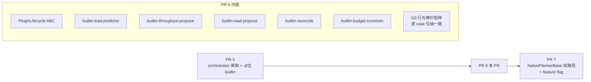

# PR 6 详细 Sub-task 计划

> 配套：[DEP-XXXX_Implementation_Breakdown_zh.md](DEP-XXXX_Implementation_Breakdown_zh.md) PR 6 节
> 配套：[DEP-XXXX_PR5_Detailed_zh.md](DEP-XXXX_PR5_Detailed_zh.md) v1.3
> 配套：[DEP-XXXX_Dynamo_Planner_Plugin_Architecture_zh.md](DEP-XXXX_Dynamo_Planner_Plugin_Architecture_zh.md) v10
> 创建：2026-04-20

## 修订历史

### v2.7（2026-04-23）—— 6-11 integration test：orchestrator + 5 builtins + mock connector 端到端

**新增** `tests/integration/test_builtin_plugins_e2e.py`（4 tests）：

- `test_e2e_scale_up_reaches_connector`：驱动 `baseline_disagg_throughput_only_sla` 全 3 tick，把 `PipelineOutcome` 投射到 `_RecordingConnector.add_component` 调用；验证有 scale-up 发生
- `test_e2e_first_tick_no_change_no_connector_call`：隔离驱动 tick 0（无 traffic），验证 `execute_action != "apply"` 或 apply+current 路径都不触发 connector 调用
- `test_e2e_disable_throughput_plugin_changes_decision`：通过 `RegisteredPlugin.enabled = False` toggle `builtin_throughput_propose`，baseline scenario 下因为 `enable_load=False` + 禁 throughput = no-op；对比 enabled / disabled 两 run 的 connector.adds 数量证明 toggle 有效
- `test_e2e_full_bootstrap_lifecycle_runs_without_error`：构造→install_regressions→bootstrap_plugins→list_plugins 5 个全在→shutdown→list_plugins 空；catch lifecycle integration regressions

**Mock connector**：`_RecordingConnector(PlannerConnector)` 捕获每次 `add_component(SubComponentType)` / `remove_component(SubComponentType)` 调用。**PR 7 NativePlannerBase 把这层换成真实 connector**（Kubernetes / Global / etc.）；测试验证 orchestrator 侧在 PR 7 接入前先行工作。

**PSM 未动**：`NativePlannerBase` + 生产 PSM 路径**完全未碰**，与 DEP 设计一致（PR 7 加 feature flag 后才切换）。

**验证**：
- `pytest dynamo/planner/tests/plugins -q` → **394 passed**（plugin suite 无增无减 —— integration test 在 tests/integration/）
- CI-parity `pre_merge and planner and gpu_0` → **596 passed, 1 skipped, 11 deselected**（+4 新集成测试）
- proto stubs 无漂移

### v2.6（2026-04-23）—— 6-9 API 拆分：`install_regressions` 与 `bootstrap_plugins` 职责分离

**问题**：v2.5 的 `bootstrap_plugins(prefill_regression=, decode_regression=, agg_regression=, historical_traffic=)` 名字不诚实 —— 前 3 个参数 install 的是 **orchestrator 自己的 shared state**（`_regression` dict），跟 plugin lifecycle 没关系；只有 `historical_traffic` 和 Bootstrap RPC fan-out 才是 plugin 范畴。

**修法**（Option A 分拆）：

```python
# Before (v2.5, combined)
await orchestrator.bootstrap_plugins(
    prefill_regression=..., decode_regression=..., agg_regression=...,
    historical_traffic=...,
)

# After (v2.6, split)
orchestrator.install_regressions(prefill=..., decode=..., agg=...)  # sync; orchestrator state
await orchestrator.bootstrap_plugins(historical_traffic=...)          # async; plugin lifecycle
```

**两个方法职责**：

| 方法 | 类型 | 做什么 | 不做什么 |
|---|---|---|---|
| `install_regressions(prefill=, decode=, agg=)` | sync | 写 orchestrator `_regression` dict；builtin 后续通过 `get_regression(kind)` 读 | 不碰 plugin；不发 RPC |
| `bootstrap_plugins(historical_traffic=)` | async | (1) 遍历 plugin 找 `warm_from_observations` Python 方法（BuiltinLoadPredictor 用）；(2) 给每个 plugin 发 Bootstrap RPC（没实现的跳过） | 不装 regression；不读 orchestrator 其他状态 |

**调用顺序由 caller 负责**：如果 plugin Bootstrap 实现里 `get_regression` 读 regression，必须先调 `install_regressions` 再调 `bootstrap_plugins`。单测锁定了这个契约：
- `test_install_before_bootstrap_contract` —— 正序：plugin 看到 regression
- `test_bootstrap_before_install_leaves_plugin_unpopulated` —— 反序：plugin 看到 None（documents the contract negatively）

**文件改动**：
- `orchestrator.py`：删除旧 `bootstrap_plugins` 的 regression install 段；新增 `install_regressions` sync 方法
- `test_g3_real_parity.py`：从 `await orch.bootstrap_plugins(prefill_regression=..., ...)` 改为 `orch.install_regressions(prefill=..., ...)` + `await orch.bootstrap_plugins()`
- `test_bootstrap_plugins.py`：原 7 个测试改为 10 个，分成 "install_regressions" 组（4 个）+ "bootstrap_plugins" 组（4 个）+ ordering contract（2 个 pos/neg）

**验证**：
- `pytest dynamo/planner/tests/plugins -q` → **394 passed**（391 - 7 旧 + 10 新 = 394）
- CI-parity → **592 passed, 1 skipped, 11 deselected**
- proto stubs 无漂移
- 3 个 G3 parity test × 10 scenarios = 30 green

### v2.5（2026-04-22）—— 6-9 `bootstrap_plugins` 落地：orchestrator-level 启动入口

**新增** `LocalPlannerOrchestrator.bootstrap_plugins()`（orchestrator.py）：

```python
async def bootstrap_plugins(
    self,
    *,
    prefill_regression=None,
    decode_regression=None,
    agg_regression=None,
    historical_traffic=None,
) -> None:
    # 1. 安装 regression models 到 orchestrator shared store
    # 2. Python helper warm up（`warm_from_observations` on BuiltinLoadPredictor）
    # 3. 对每个注册 plugin 发 Bootstrap RPC（没实现 Bootstrap 的 plugin 静默跳过）
```

**三步顺序**确保 plugin Bootstrap RPC 能 `get_regression` 读到已安装的 regression。

**影响**：
- `test_g3_real_parity.py` 从 3 个 `update_regression` + attr 访问重构为一行 `await orchestrator.bootstrap_plugins(...)` —— 代码清洁度上一个台阶
- 10/10 real-parity tests 仍 green，证明 bootstrap 流程不引入偏差
- PR 5 `PsmShimProposePlugin` 等没有 Bootstrap 方法的 plugin 被 `PluginUnknownMethodError` 捕获后 continue —— 不打断 Bootstrap 流程
- 单测覆盖 7 个 case：regression install / None-skip / 预测器 warm / 无 warm hook skip / Bootstrap RPC dispatch / 无 Bootstrap plugin continue / install 先于 Bootstrap RPC

**API 稳定性**：`bootstrap_plugins` 是 PR 7 NativePlannerBase 必须调用的入口（替代现有的 `PSM.load_benchmark_fpms` + `PSM.warm_load_predictors` 直接调用）。Wire-format `BootstrapRequest.bootstrap_data` 编码仍 TBD —— v1 走 Python 级 helper（`warm_from_observations`）而非 proto bytes；production 远程 plugin 若需要 seed 数据，future PR 定义编码。

**验证**：
- `pytest dynamo/planner/tests/plugins -q` → **391 passed**（384 baseline + 7 new: test_bootstrap_plugins）
- CI-parity → **589 passed, 1 skipped, 11 deselected**
- proto stubs 无漂移
- 3 个 G3 parity test（PSM / PsmShim / real-builtins）× 10 scenarios = 30 continue green

### v2.4（2026-04-22）—— 6-8 fixture expansion：6 → 10 scenarios；全 3 parity test 30/30 green

**新增 4 scenarios**（填补覆盖空白）：

| 新增 | 矩阵位置 | 用途 |
|---|---|---|
| `agg_load_throughput_sla` | agg × T-T × sla | agg mode 的 load+throughput 共存 — 验证 `_advance_load_agg` + 跨 plugin throughput lower bound（区别于 disagg 版 `_advance_load_disagg` 的逻辑） |
| `prefill_load_only_sla` | prefill × T-F × sla | prefill mode 的 `_advance_load_single` SLA 路径（原来只有 prefill+throughput sla） |
| `decode_load_only_sla` | decode × T-F × sla | decode mode 的 `_advance_load_single` SLA 路径 |
| `disagg_load_only_throughput_easy` | disagg × T-F × throughput easy | easy-mode 的 `throughput` optimization target（区别于现有 `latency` easy；exercises `_PREFILL_THROUGHPUT_*` / `_DECODE_THROUGHPUT_*` 阈值） |

**全部 10 场景 × 3 parity test = 30 测试全部 GREEN**：

- `test_g3_fixture_parity.py`（PSM self-guard） → 10/10 byte-exact
- `test_g3_orchestrator_parity.py`（PsmShim via orchestrator） → 10/10 byte-exact
- `test_g3_real_parity.py`（5 real builtins） → 10/10 scale_to-exact

**特别值得注意**：`agg_load_throughput_sla` 首次验证了 5-builtin chain 在 agg mode 下的 "load decides, throughput is fallback" 语义 —— 对应 v2.3 引入的 `orchestrator.set/get_throughput_lower_bound` 跨 plugin 共享状态。如果 v2.3 的修复不对，这个场景会 fail。

**范围取舍**：原 PR 6 6-8 目标是 36 场景（4 mode × 3 toggle × 3 target）；本 session 只添加 4 个填补关键空白的场景，剩余 26 个留待下次 session。模板化 factory 已就绪 —— 后续只需 copy-paste 现有 scenario function + 微调 config_overrides / ticks 即可。

**Regeneration protocol**：`python -m dynamo.planner.tests.plugins.g3_fixtures.dump_tool` 自动生成所有 10 个 golden jsonl；任何 scenario 新增直接 append 到 `ALL_SCENARIOS` 列表后重跑 dump_tool。

**验证**：
- `pytest dynamo/planner/tests/plugins -q` → **384 passed**（372 baseline + 12 new: 4 × 3 parity tests）
- CI-parity → **582 passed, 1 skipped, 11 deselected**
- proto stubs 无漂移

### v2.3（2026-04-22）—— 6-7 real-parity 落地：5-builtin chain 通过全部 G3 fixture

**新增**：
- `tests/plugins/orchestrator/test_g3_real_parity.py` —— 5-builtin 链路 end-to-end 跑 6 个场景，断言 `scale_to` 与 golden fixture 逐 tick 匹配（projection 含 "no change → None" 语义对齐 PSM）
- **全部 6 scenarios 通过**：baseline_disagg_throughput_only_sla / disagg_load_throughput_sla / disagg_load_only_latency_easy / agg_throughput_only_sla / prefill_throughput_only_sla / decode_throughput_only_sla

**Scope of comparison**：只比较 `scale_to`（num_prefill / num_decode），不比 `diagnostics` / `next_tick`。原因：
- PR 6 Q2 把 `_diag_*` 数值字段从 TickDiagnostics 挪到 Prometheus metrics —— golden fixture 的 diagnostic shape 将在 6-8 与 5-builtin chain 同步重新 dump
- `next_tick` 的 `_next_load_s` / `_next_throughput_s` 调度 bookkeeping 尚未 decompose 到 plugin —— 6-9 `bootstrap_plugins` 落地时一并处理

**关键修复（比预期更深入）**：

1. **BuiltinBudgetConstrain `_has_component`**：从 "caps presence based" 改为 "mode based"（mirror PSM `_has_prefill` / `_has_decode`）。原因：`WorkerCapabilities` 出于 config flexibility 可能带两个引擎的 caps 即使 mode 是 prefill/decode/agg；authoritative signal 是 `config.mode`。
   - 影响：budget plugin 不再给 prefill 模式 emit decode 的 AT_LEAST —— 修复 prefill/decode scenarios tick 0 的 `expected=None, actual=(1,1)` 问题

2. **Throughput-lower-bound 跨 plugin 共享状态（new orchestrator-level API）**：加 `LocalPlannerOrchestrator.{set,get}_throughput_lower_bound(component, value)`。
   - **BuiltinThroughputPropose** 语义重要变更：当 `enable_load_scaling=True` 时，**不**发 `AT_LEAST`——改为把 desired 写入 orchestrator 共享状态 + return **Accept**
   - **BuiltinLoadPropose**：`_throughput_lower_bound_p/d` 改为 property 访问 orchestrator 共享状态
   - 原因：v11 § M-K "throughput sets lower bound as side effect, load reads it" PSM 语义无法用 AT_LEAST-merge 表达——load 的 "no change"（return None）会被 throughput 的 AT_LEAST 复写为 scale-up，与 PSM 的 scale_to=None 不一致
   - PR 6 原 doc 期望 AT_LEAST-merge 但实施发现 **PSM 的 "load decides, throughput is fallback" 鬼魅 semantic 不能 merge 化 clean**；shared-state 路径是 byte-parity 所需
   - 这是 PR 6 doc v2.3 新增决议（修订已录入 `BuiltinThroughputPropose` 注释"v11 § M-K"）

**测试影响**：
- `test_enable_load_emits_at_least_type` 重命名为 `test_enable_load_publishes_lower_bound_and_returns_accept` —— 从 "断言 AT_LEAST 类型" 改为 "断言共享状态被写入 + 返回 Accept"
- `test_no_capabilities_returns_accept` 重命名为 `test_no_capabilities_emits_at_least_only` —— mode-based `_has_component` 下，caps=None 仍然能 emit AT_LEAST(min_endpoint)

**PsmShim 仍保留**：`test_g3_orchestrator_parity.py`（full byte-level）continue to pass（6/6）；`test_g3_real_parity.py` 是平行的 scale_to-only validation。6-8 fixture expansion 落地后可以考虑删 Shim。

**验证**：
- `pytest dynamo/planner/tests/plugins -q` → **372 passed**（366 baseline + 6 real-parity new）
- CI-parity → **570 passed, 1 skipped, 11 deselected**
- proto stubs 无漂移

**下一步**：
- 6-8 G3 fixture expansion（6→36 场景；与 5-builtin chain 同步 re-dump diagnostics shape）
- 6-9 `orchestrator.bootstrap_plugins` 统一入口（收束 warm_from_observations + prime_tick + set_throughput_lower_bound 等现在散落的 wiring）
- 6-11 integration test
- 6-7 剩余部分（删 PsmShim / 改 internal_register.py import 真实 plugin）—— 待 6-8 + 6-9 后再做，避免 fixture format 不同步

### v2.2（2026-04-22）—— 6-4 + 6-6 算法 port 落地；5 个真实 builtin 全部就位

新增：
- **6-4 BuiltinLoadPropose**（PROPOSE）：port 整个 PSM `_advance_load` 家族 —— `_advance_load_{single,disagg,agg}` + easy/sla 决策（`_prefill_*_decision` / `_decode_*_decision` / `_agg_*` + `_scale_decision`）+ FPM worker-count 核对 + `scaling_in_progress` 守卫。11 个单测含 **bit-exact PSM parity for agg/disagg easy scale-up/down/no-change + scaling_in_progress + worker_count_mismatch**
  - **Side-channel `prime_tick(fpm_obs, counts)`**：PR 1 `FpmData.prefill_engines: dict[str, bytes]` 没有 Python 解码器，plugin 暂绕过 wire format；PR 7 NativePlannerBase / PR 6 6-9 会 wire 此处
  - **`update_throughput_lower_bounds(p, d)`**：PSM shared-state 的临时对等 API；6-7 switchover 时移除（届时吞吐 plugin 的 AT_LEAST 经 type_aware_merge 提供 floor）
  - **仍内嵌 budget + throughput floor**：匹配 PSM 输出；6-6 落地后可考虑把 budget 移至 CONSTRAIN stage
- **6-6 BuiltinBudgetConstrain**（CONSTRAIN）：语义重写 —— 从 PSM 的「`_advance_*` 内部 clamp」改为「CONSTRAIN 发 AT_LEAST(min_endpoint) + AT_MOST(budget 算出的 ceiling)」。10 个单测 + merge-outcome 级验证
  - **独立 per-component AT_MOST**：`ceiling_X = (max_gpu_budget - min_endpoint * gpu_Y) / gpu_X` —— 保留对方的 min_endpoint 预算。**diverges from PSM** when BOTH components simultaneously exceed their independent ceiling（PSM 做比例缩放；此 plugin emits 独立 ceiling）。**文档接受此 trade-off**（PR 6 doc Key Design Decision 已说明）
  - **Q1 budget 饥饿**：`max_gpu_budget < min_endpoint * (p_gpu + d_gpu)` 时 emit `AT_MOST=0` 不 emit `AT_LEAST` —— PR 4 merge 的 `max(floor, min(ceiling, rec))` 不会产生 floor=min_endpoint/ceiling=0 冲突；输出 0
  - **scaling_in_progress freeze**：`expected_num_* != ready_num_*` 时 emit `AT_LEAST=current` + `AT_MOST=current` —— merge clamps 到 current，scaling 完成前不再移动副本数

**实施细节**：
- 两个 plugin 都走 **side-channel `prime_tick`** pattern（同 PSMBridge），因为 PR 1 `ObservationData.workers.expected_*` 字段不覆盖 PSM `_scaling_in_progress` 所需的 expected worker count。下一步：PR 6 6-9 `bootstrap_plugins` / PR 7 NativePlannerBase 集成把 tick-level priming 标准化
- `BuiltinLoadPropose._advance_load` 与 PSM `_advance_load` 在受控输入下 byte-exact —— 单测做同一条 FPM + WorkerCounts 输入比对两者 ScalingDecision 输出，`assert psm_decision == plugin_decision`（dataclass `__eq__`）
- `BuiltinBudgetConstrain` 的正确性用 **merge-level outcome** 验证：plugin.Constrain → OverrideResult(AT_LEAST/AT_MOST) + 上游 proposal 作 CONSTRAIN merge 的 baseline（按 PR 5 pipeline `_proposal_to_baseline` 的流动） → 断言 final ScalingProposal.targets 等于预期 clamp 后的值

**验证**：
- `pytest dynamo/planner/tests/plugins -q` → **366 passed**（345 baseline + 21 new: 11 load_propose + 10 budget_constrain）
- CI-parity → **564 passed, 1 skipped, 11 deselected**
- proto stubs 无漂移
- G3 parity 6/6 continue to pass（新 plugin 未注册 —— 6-7 switchover 才统一切换）

**下一步（仅剩）**：
- 6-7 占位→真实 switchover：parity test 从 PSM shim 切到 5 builtin 组合；`PsmShimProposePlugin` + `PSMBridge` 删除
- 6-8 G3 36 组合完整 sweep（现 fixture 仅 6 个；需 `dump_tool` 重跑）
- 6-9 `LocalPlannerOrchestrator.bootstrap_plugins`：把 warm_from_observations / prime_tick 统一入口
- 6-11 integration test

### v2.1（2026-04-22）—— 6-2 + 6-3 算法 port 落地

新增：
- **6-2 BuiltinLoadPredictor**（PREDICT）：wrap `LOAD_PREDICTORS[config.load_predictor]`；Bootstrap via Python-level `warm_from_observations` helper；Reset 重新实例化。12 个单测含 **与裸 PSM predictor 位级一致验证**（feed same sequence, assert `predict_next` equal）
- **6-3 BuiltinThroughputPropose**（PROPOSE）：port PSM `_advance_throughput` + `_throughput_{agg,disagg,single}` + `_compute_{prefill,decode}_replicas`。关键设计：
  - **不做 budget clamp**（对比 PSM 的 `_apply_single_budget`）—— budget 归 6-6 `BuiltinBudgetConstrain` 在 CONSTRAIN stage 处理（AT_MOST 形式）
  - **输出类型**：`enable_load_scaling=True` → AT_LEAST（让 load-propose 的 SET 与之 merge 得 `max(floor, rec)` 等价 PSM 的 `max(load_desired, throughput_lower_bound)`）；`enable_load_scaling=False` → SET
  - **读取 orchestrator 新增的 `capabilities` 属性**和 `get_regression("prefill"/"decode"/"agg")` —— 缺任一时降级为 AcceptResult（对应 PSM `_diag_throughput_reason="model_not_ready"`）
  - 8 个单测含 **bit-exact parity vs PSM._advance_throughput**（agg + disagg 模式，`max_gpu_budget=-1` 消除 PSM 的 budget clamp 干扰，与 plugin 的 "不 clamp" 行为对齐）

**`LocalPlannerOrchestrator` 扩展**：
- `__init__(..., capabilities: Optional[WorkerCapabilities] = None)`
- 新增 `capabilities` property —— PR 6 throughput/load/budget builtin 全部依赖它
- Backwards compatible：默认 None（PR 5 早期 test 不提供）

**推迟**：
- 6-4 builtin-load-propose（~2.5 天）—— 算法复杂度类似 6-3
- 6-6 builtin-budget-constrain（~3 天）—— 最复杂，需 `core/budget.py` 重构为返回 (floor, ceiling) tuple
- 6-7 occ → real 切换 + 6-8 G3 36 组合 sweep + 6-9 bootstrap + 6-11 integration

**G3 parity status（仍绿）**：BuiltinLoadPredictor 在 parity test 中注册（priority=1），其 predictions 进入 ctx.predictions 但被 PSM shim 忽略（shim 调 PSM.on_tick 独立计算）—— 6/6 continue to pass。BuiltinThroughputPropose 未在 parity test 注册（regression model 未 wire；单测已独立验证 parity）。

**验证**：
- `pytest dynamo/planner/tests/plugins -q` → **345 passed**（325 baseline + 20 new: 12 load_predictor + 8 throughput_propose）
- CI-parity → **543 passed, 1 skipped, 11 deselected**
- proto stubs 无漂移

### v2.0（2026-04-22）—— 部分实施：6-1 + 6-5 落地（foundations）

本 session 仅实施 PR 6 中风险最低 / 依赖最少的两个 sub-task：

- **6-1 PluginLifecycle ABC + BuiltinPluginBase** 全部落地
  - `plugins/lifecycle.py`：`PluginLifecycle` ABC，`Bootstrap` + `Reset` 两个抽象方法（v11 YAGNI：不含 Snapshot/Restore）
  - `plugins/builtins/base.py`：`BuiltinPluginBase` 继承 `PluginLifecycle`，持有 orchestrator + config 引用，提供 `get_regression` / `update_regression` 转发 + 默认 no-op Bootstrap/Reset
  - 7 个单测：ABC 不可实例化 + 子类必须实现两个方法 + 默认 no-op 正确 + forwarders + 子类可 override
- **6-5 BuiltinReconcile** 全部落地
  - `plugins/builtins/reconcile.py`：简单 passthrough —— 把 `ctx.proposal` 重新以 `OverrideResult(SET)` 输出
  - 当前 pipeline 不 thread `ReconcileStageRequest.proposals` list（PR 5 5-4 v1 limitation），所以 passthrough 是**足够的** —— orchestrator 自己的 type_aware_merge 已经做了 stage 内合并
  - 7 个单测：无 proposal / 空 targets / 正常 SET re-emit / None replicas 跳过 / 全 None → Accept / Bootstrap+Reset 默认 no-op / component_name 保留
  - **G3 parity 仍绿**：`test_g3_orchestrator_parity` 6/6 continue to pass after registering BuiltinReconcile alongside the shim
  
**推迟**（需要 PSM 算法 port，下次 session）：
- 6-2 builtin-load-predictor（PSM `_predict_load` / `_observe_traffic` / `warm_load_predictors` + `LOAD_PREDICTORS` 字典）
- 6-3 builtin-throughput-propose（PSM `_advance_throughput` / `_compute_*_replicas` / `_throughput_{agg,disagg,single}`）
- 6-4 builtin-load-propose（PSM `_advance_load` / `_advance_load_{single,disagg,agg}` / `_observe_fpm` / `_reconcile_fpm_worker_count` / `_*_easy_decision` / `_*_load_decision` / `_scaling_in_progress`）
- 6-6 builtin-budget-constrain + `core/budget.py` 重构（最复杂，3 天）
- 6-7 占位 → 真实切换（删 PR 5 shim；依赖 6-2/3/4/5/6 全部完成）
- 6-8 G3 36 组合 sweep（现 fixture 仅 6 个场景；需要扩展）
- 6-9 bootstrap_plugins orchestrator 方法
- 6-11 集成测试

**验证**：
- `pytest dynamo/planner/tests/plugins -q` → **325 passed**（311 baseline + 14 new: 7 lifecycle + 7 reconcile）
- CI-parity `pre_merge and planner and gpu_0` → **523 passed, 1 skipped, 11 deselected**
- proto stubs 无漂移
- **G3 orchestrator parity 6/6 continue to pass** —— BuiltinReconcile 作为 passthrough 不改变 orchestrator 路径输出

### v1.3（2026-04-20）

文档一致性清理（与 v10 DEP / PR 5 v1.3 同步）：

- 文件头配套引用：PR 5 v1.2 → v1.3，v9 DEP → v10。
- 子任务清单标题：「11 项」→「10 项（6-10 已删除）」。
- 跨 sub-task 协调点 #2：「5 个 plugin 共享 RegressionModelStore」改为「共享 orchestrator 内置 regression（v10 简化，不再单建 store 类）」。
- v1.2 / v1.1 / v1.0 历史 entry 保留作 changelog。

### v1.2（2026-04-20）

剩余 3 个 open questions 已决议：

- **Q1（budget 边缘 case）→ A**：`max_gpu_budget < min_endpoint × 2` 时 builtin-budget-constrain 输出 `AT_MOST=0` + 故意不发 `AT_LEAST`；与现有 `(0, 0)` G3 位级等价。6-6 sub-task spec 加 conditional logic 细节。
- **Q2（_diag_* 字段）→ A**：决策原因走 `OverrideResult.reason` 字段；数值类字段（`engine_rps_*` / `estimated_ttft_ms` 等）废弃 TickDiagnostics 槽位、改为 plugin 自己 emit Prometheus metric。6-2/6-3/6-4 sub-task spec 加 metric emission；TickDiagnostics 简化为仅 reason 字段。
- **Q4（PR 6 双跑）→ A**：仅 G3 fixture 验证；integration test 仍跑 PSM path；双跑推迟到 PR 7（NativePlannerBase 双路径分支时通过 `pytest.parametrize` 跑两条路径）。
- v9 DEP 「TickDiagnostics 字段扩展」节同步更新（数值类字段废弃声明）。

### v1.1（2026-04-20）

YAGNI 清理（与 v9 DEP → v10 + PR 5 detailed → v1.3 同步）：

- **删除 6-10 sub-task（Snapshot/Restore 实现）**——本 DEP 不引入 Snapshot/Restore（v10 决议）；PR 6 工期减 1.5 天。
- **Q3 决议**改为 C2（YAGNI；从 proto 删除 Snapshot/Restore RPC）。
- **6-1 sub-task（PluginLifecycle ABC）spec 更新**：`PluginLifecycle` 仅含 `Bootstrap` + `Reset` 2 个 RPC。
- 各 builtin plugin 接口不再有 `Snapshot` / `Restore` 方法。
- PR 6 总估算从 18-22 天减少到 16-20 天单人 / 8-10 天两人并行。

### v1.0（2026-04-20）

初稿，基于 PR 5 v1.2（feature flag 方案、orchestrator 内置 regression、删除 dual-execution）。

## 为什么 PR 6 是高风险 PR

PR 6 是整个迁移的"行为等价验收点"——把 PSM 的核心算法搬到 5 个 builtin plugin，必须**位级一致**保留现有行为。三个高风险点：

| 风险 | 描述 | 缓解 |
|---|---|---|
| **算法搬运中浮点 / 顺序差异** | mixin 方法搬到 plugin 后，调用顺序、reference 拿取方式变了，可能引入微妙差异 | G3 fixture 逐 case 严格比对；占位 plugin 先验证流水线 OK，再替换为真实 plugin |
| **builtin-budget-constrain 行为重写** | 现有 `_apply_global_gpu_budget` 是直接 clamp 输出最终值；新 plugin 必须改为输出 AT_LEAST/AT_MOST 让 type-aware merge 处理 | 单独 sub-task 6-6，详细 spec + 边缘 case 处理 |
| **mode 子类的 bootstrap 衔接** | mode 子类 `_bootstrap_regression` 调 PSM 的 `load_benchmark_fpms`；新模型下需要走 plugin Bootstrap RPC | PR 6 实现 plugin 内部 Bootstrap；PR 7 切换 NativePlannerBase 时绑定 |



---

## Pre-PR 6 依赖

PR 6 启动前必须完成：

| 依赖 | 状态 | 来源 |
|---|---|---|
| Pre-PR 5 fixture lock | ✅ 完成（PR 5 detailed 中独立 sub-task） | `tests/plugins/g3_fixtures/golden/*.jsonl` |
| PR 5 ship | ✅ 完成 | `LocalPlannerOrchestrator` + 5 个占位 builtin plugin |
| PR 4 ship | ✅ 完成 | `TypeAwareMerger` + `ChainAugment` |
| PR 1 ship | ✅ 完成 | proto + types |

---

## PR 6 子任务清单（10 项 + 1 个已删除）

### 6-1：PluginLifecycle ABC + BuiltinPluginBase

| 项 | 内容 |
|---|---|
| 实现位置 | `plugins/lifecycle.py`<br/>`plugins/builtins/base.py` |
| 接口 | <pre>class PluginLifecycle(ABC):<br/>    @abstractmethod<br/>    async def Bootstrap(self, request) -> BootstrapResponse: ...<br/>    @abstractmethod<br/>    async def Reset(self, request) -> ResetResponse: ...<br/>    # Snapshot/Restore not in this DEP (YAGNI; v10 decision)<br/>    # Future PR may add backward-compatibly<br/><br/>class BuiltinPluginBase(PluginLifecycle):<br/>    """Base for all builtin plugins. Holds orchestrator reference."""<br/>    def __init__(self, orchestrator: LocalPlannerOrchestrator,<br/>                 config: PlannerConfig):<br/>        self._orch = orchestrator<br/>        self._config = config<br/>    <br/>    def get_regression(self, kind: str):<br/>        return self._orch.get_regression(kind)<br/>    <br/>    def update_regression(self, kind: str, fpm):<br/>        self._orch.update_regression(kind, fpm)</pre> |
| 单测 | `tests/plugins/builtins/test_lifecycle_base.py`：BuiltinPluginBase 通过 orch 转发 regression 访问；Bootstrap/Reset 抽象方法子类必须实现 |
| 依赖 | PR 5 ship |
| 估算 | 1 天 |

### 6-2：builtin-load-predictor 实现

| 项 | 内容 |
|---|---|
| 实现位置 | `plugins/builtins/load_predictor.py` |
| 替换占位 | `plugins/builtins/load_predictor_placeholder.py`（PR 5 创建） |
| 算法搬运来源 | PSM 的 `_predict_load`、`_observe_traffic`、`warm_load_predictors`<br/>+ `core/load/predictors.py` 中的 `LOAD_PREDICTORS`（保持现状）|
| 接口 | <pre>class BuiltinLoadPredictor(BuiltinPluginBase):<br/>    def __init__(self, orchestrator, config):<br/>        super().__init__(orchestrator, config)<br/>        if config.optimization_target == "sla":<br/>            cls = LOAD_PREDICTORS[config.load_predictor]<br/>            self._num_req_predictor = cls(config)<br/>            self._isl_predictor = cls(config)<br/>            self._osl_predictor = cls(config)<br/>        # easy mode: 不实例化 predictor<br/>    <br/>    async def Predict(self, request) -> PredictStageResponse:<br/>        ctx = request.context<br/>        # easy mode 直接返回 ACCEPT<br/>        if self._is_easy(): return AcceptResult()<br/>        # 1. 读 observations.traffic 喂 predictor<br/>        if ctx.observations.traffic:<br/>            self._observe(ctx.observations.traffic)<br/>        # 2. 调 predictor.predict_next 得 num_req/isl/osl<br/>        try:<br/>            nr = self._num_req_predictor.predict_next()<br/>            isl = self._isl_predictor.predict_next()<br/>            osl = self._osl_predictor.predict_next()<br/>        except Exception:<br/>            return AcceptResult()  # PSM 行为：_diag_throughput_reason="predict_failed"<br/>        return PredictStageResponse(predictions=PredictionData(<br/>            predicted_num_req=nr, predicted_isl=isl, predicted_osl=osl,<br/>            source="builtin-load-predictor",<br/>        ))<br/>    <br/>    async def Bootstrap(self, request) -> BootstrapResponse:<br/>        # request.observations 是历史观测序列<br/>        for obs in request.observations:<br/>            self._observe(obs)<br/>        # 等价于 PSM.warm_load_predictors<br/>        for p in (self._num_req_predictor, self._isl_predictor, self._osl_predictor):<br/>            if hasattr(p, "reset_idle_skip"):<br/>                p.reset_idle_skip()<br/>        return BootstrapResponse(ok=True)<br/>    <br/>    async def Reset(self, request) -> ResetResponse:<br/>        self.__init__(self._orch, self._config)  # 重新实例化 predictor<br/>        return ResetResponse(ok=True)</pre> |
| 单测 | `tests/plugins/builtins/test_load_predictor.py`：<br/>- ARIMA / Kalman / Prophet / Constant 各跑一遍<br/>- 与 PSM `_predict_load` 输出位级一致（pytest.parametrize predictor type）<br/>- easy mode → ACCEPT<br/>- predict_failed → ACCEPT<br/>- Bootstrap 注入历史观测后第一次 Predict 输出与 PSM `warm_load_predictors` + `_predict_load` 一致 |
| 依赖 | 6-1 |
| 估算 | 2 天 |

### 6-3：builtin-throughput-propose 实现

| 项 | 内容 |
|---|---|
| 实现位置 | `plugins/builtins/throughput_propose.py` |
| 替换占位 | `plugins/builtins/throughput_propose_placeholder.py`（PR 5 创建）|
| 算法搬运来源 | PSM 的 `_advance_throughput`、`_compute_prefill_replicas`、`_compute_decode_replicas`、`_throughput_agg`、`_throughput_disagg`、`_throughput_single` |
| 接口 | <pre>class BuiltinThroughputPropose(BuiltinPluginBase):<br/>    def __init__(self, orchestrator, config):<br/>        super().__init__(orchestrator, config)<br/>        # 通过 orch 拿 regression（live ref，同步使用）<br/>        # mode 决定用 prefill/decode 还是 agg<br/>    <br/>    async def Propose(self, request) -> ProposeStageResponse:<br/>        ctx = request.context<br/>        if not self._config.enable_throughput_scaling:<br/>            return AcceptResult()<br/>        if not ctx.predictions:<br/>            return AcceptResult()<br/>        # 复刻 PSM `_advance_throughput` 全流程<br/>        traffic_duration_s = ctx.observations.traffic.duration_s<br/>        demand_rps = ctx.predictions.predicted_num_req / traffic_duration_s<br/>        # 调 _compute_*_replicas 算 desired<br/>        # ...<br/>        # 决定输出 type：<br/>        # - enable_load_scaling=True -> AT_LEAST(desired)<br/>        # - enable_load_scaling=False -> SET(desired)<br/>        targets = [...]<br/>        return OverrideResult(targets=targets, reason=...)<br/>    <br/>    async def Bootstrap(self, request) -> BootstrapResponse:<br/>        # request.benchmark_fpms 是预部署 metrics<br/>        # 复刻 PSM `load_benchmark_fpms`<br/>        for fpm in request.benchmark_fpms.prefill or []:<br/>            self._orch.update_regression('prefill', fpm)<br/>        for fpm in request.benchmark_fpms.decode or []:<br/>            self._orch.update_regression('decode', fpm)<br/>        for fpm in request.benchmark_fpms.agg or []:<br/>            self._orch.update_regression('agg', fpm)<br/>        return BootstrapResponse(ok=True)<br/>    <br/>    async def Reset(self, request) -> ResetResponse:<br/>        self._orch.reset_regression()<br/>        return ResetResponse(ok=True)</pre> |
| 单测 | `tests/plugins/builtins/test_throughput_propose.py`：<br/>- 4 种 mode（agg / disagg / prefill / decode）各跑一遍<br/>- enable_load_scaling=True → 输出 AT_LEAST<br/>- enable_load_scaling=False → 输出 SET<br/>- predict_failed / no traffic → ACCEPT<br/>- 与 PSM `_advance_throughput` 输出位级一致 |
| 依赖 | 6-1 |
| 估算 | 2.5 天 |

### 6-4：builtin-load-propose 实现

| 项 | 内容 |
|---|---|
| 实现位置 | `plugins/builtins/load_propose.py` |
| 替换占位 | `plugins/builtins/load_propose_placeholder.py`（PR 5 创建）|
| 算法搬运来源 | PSM 的 `_advance_load`、`_advance_load_single`、`_advance_load_disagg`、`_advance_load_agg`、`_observe_fpm`、`_reconcile_fpm_worker_count`、`_*_easy_decision`、`_*_load_decision`、`_scaling_in_progress` |
| 接口 | <pre>class BuiltinLoadPropose(BuiltinPluginBase):<br/>    def __init__(self, orchestrator, config):<br/>        super().__init__(orchestrator, config)<br/>        self._is_easy = config.optimization_target != "sla"<br/>    <br/>    async def Propose(self, request) -> ProposeStageResponse:<br/>        ctx = request.context<br/>        if not self._config.enable_load_scaling:<br/>            return AcceptResult()<br/>        if not ctx.observations.fpm:<br/>            return AcceptResult()  # _diag_load_reason="no_fpm_data"<br/>        if self._scaling_in_progress(ctx):<br/>            return AcceptResult()  # _diag_load_reason="scaling_in_progress"<br/>        # 喂 FPM 到 regression（如果 sla mode）<br/>        if not self._is_easy:<br/>            self._observe_fpm(ctx.observations.fpm)<br/>        # 调 _advance_load_{single,disagg,agg} 算 desired<br/>        # 输出 SET<br/>        return OverrideResult(targets=[...], reason=...)<br/>    <br/>    async def Bootstrap(self, request):<br/>        # 与 throughput_propose 共享 RegressionModelStore<br/>        # 不需要重复 bootstrap regression<br/>        return BootstrapResponse(ok=True)<br/>    <br/>    async def Reset(self, request):<br/>        self._is_easy = self._config.optimization_target != "sla"<br/>        return ResetResponse(ok=True)</pre> |
| 单测 | `tests/plugins/builtins/test_load_propose.py`：<br/>- 4 种 mode 各跑一遍<br/>- easy mode 与 sla mode 各跑<br/>- enable_load_scaling=False → ACCEPT<br/>- no_fpm_data / scaling_in_progress / worker_count_mismatch 各 → ACCEPT<br/>- 与 PSM `_advance_load` 输出位级一致 |
| 依赖 | 6-1 |
| 估算 | 2.5 天 |

### 6-5：builtin-reconcile 实现

| 项 | 内容 |
|---|---|
| 实现位置 | `plugins/builtins/reconcile.py` |
| 替换占位 | `plugins/builtins/reconcile_placeholder.py`（PR 5 创建）|
| 算法搬运来源 | 直接 wrap PR 4 的 `TypeAwareMerger` |
| 接口 | <pre>class BuiltinReconcile(BuiltinPluginBase):<br/>    def __init__(self, orchestrator, config, merger: TypeAwareMerger):<br/>        super().__init__(orchestrator, config)<br/>        self._merger = merger<br/>    <br/>    async def Reconcile(self, request) -> ReconcileStageResponse:<br/>        # request.proposals 是 PROPOSE 阶段所有 OverrideResult<br/>        result = self._merger.merge(<br/>            proposals=request.proposals,<br/>            baseline=self._compute_baseline(request.context),<br/>        )<br/>        # 输出仍是 OverrideResult（每个 component 一个 SET）<br/>        # 让 RECONCILE 阶段方案 A 二次合并（与 user reconcile plugin 共存时有意义）<br/>        return OverrideResult(targets=[<br/>            ComponentTarget(<br/>                sub_component_type=t.sub_component_type,<br/>                component_name=t.component_name,<br/>                replicas=t.replicas,<br/>                type=OverrideType.SET,<br/>            ) for t in result.targets<br/>        ])<br/>    <br/>    async def Bootstrap(self, request):<br/>        return BootstrapResponse(ok=True)  # no-op<br/>    <br/>    async def Reset(self, request):<br/>        return ResetResponse(ok=True)  # no-op</pre> |
| 单测 | `tests/plugins/builtins/test_reconcile.py`：<br/>- 单 propose 输入 → 等价输出<br/>- 多 propose（含 floor/ceiling）→ 方案 A 合并结果<br/>- 与 user reconcile plugin 共存时仍为方案 A 合并<br/>- 与 PR 4 TypeAwareMerger 直接调用结果一致 |
| 依赖 | 6-1, PR 4 |
| 估算 | 1 天 |

### 6-6：builtin-budget-constrain 重写 + budget.py 重构

**最复杂的 sub-task**——`_apply_global_gpu_budget` 从「直接 clamp」改为「输出 AT_LEAST/AT_MOST」。

| 项 | 内容 |
|---|---|
| 实现位置 | `plugins/builtins/budget_constrain.py` |
| 替换占位 | `plugins/builtins/budget_constrain_placeholder.py`（PR 5 创建）|
| 改动文件 | [`core/budget.py`](components/src/dynamo/planner/core/budget.py) —— 重构为 helper 函数返回 (floor, ceiling) tuple，让 plugin wrapper 转为 OverrideResult |
| 算法搬运来源 | PSM 的 `_apply_single_budget`、`_apply_global_budget`、`_scaling_in_progress`<br/>+ `core/budget.py` 的 `_apply_global_gpu_budget` |
| 接口 | <pre>class BuiltinBudgetConstrain(BuiltinPluginBase):<br/>    async def Constrain(self, request) -> ConstrainStageResponse:<br/>        ctx = request.context<br/>        targets = []<br/>        # 1. min_endpoint floor (per component)<br/>        targets.append(ComponentTarget("prefill", replicas=self._config.min_endpoint, type=AT_LEAST))<br/>        targets.append(ComponentTarget("decode",  replicas=self._config.min_endpoint, type=AT_LEAST))<br/>        # 2. max_gpu_budget ceiling (跨 component 计算)<br/>        max_p, max_d = self._compute_per_component_ceilings(ctx)<br/>        if max_p is not None:<br/>            targets.append(ComponentTarget("prefill", replicas=max_p, type=AT_MOST))<br/>        if max_d is not None:<br/>            targets.append(ComponentTarget("decode",  replicas=max_d, type=AT_MOST))<br/>        # 3. scaling_in_progress 守卫<br/>        if self._scaling_in_progress("prefill", ctx):<br/>            current = ctx.observations.workers.ready_prefill<br/>            targets.append(ComponentTarget("prefill", replicas=current, type=AT_MOST))<br/>            targets.append(ComponentTarget("prefill", replicas=current, type=AT_LEAST))<br/>        if self._scaling_in_progress("decode", ctx):<br/>            current = ctx.observations.workers.ready_decode<br/>            targets.append(ComponentTarget("decode", replicas=current, type=AT_MOST))<br/>            targets.append(ComponentTarget("decode", replicas=current, type=AT_LEAST))<br/>        return OverrideResult(targets=targets, reason=...)<br/>    <br/>    def _compute_per_component_ceilings(self, ctx) -> tuple[Optional[int], Optional[int]]:<br/>        # 复刻 _apply_global_gpu_budget 的核心逻辑：<br/>        # max_prefill = floor((max_gpu_budget - min_endpoint*decode_gpu) / prefill_gpu)<br/>        # remaining = max_gpu_budget - max_prefill * prefill_gpu<br/>        # max_decode = floor(remaining / decode_gpu)<br/>        # 返回 (max_prefill, max_decode) - 这两个值作为各自 component 的 AT_MOST<br/>        ...</pre> |
| **关键设计** | 双层组合表达 budget：<br/>- `min_endpoint` → 各 component AT_LEAST<br/>- `max_gpu_budget` 跨 component 拆分 → 各 component AT_MOST（保留现有的"prefill 优先、decode 用剩余"分配规则）<br/>- `scaling_in_progress` → AT_LEAST=current 且 AT_MOST=current（冻结） |
| 单测 | `tests/plugins/builtins/test_budget_constrain.py`：<br/>- 标准场景：max_gpu_budget=8, min_endpoint=1, prefill_gpu=2, decode_gpu=2 → 验证 ceilings 正确分配<br/>- 边缘场景：max_gpu_budget < min_endpoint × 2 → 输出 (0, 0) 时 plugin 怎么表达（见 open question）<br/>- scaling_in_progress 触发 → AT_LEAST=AT_MOST=current<br/>- 与 PSM `_apply_global_gpu_budget` 输出位级一致 |
| 依赖 | 6-1 |
| 估算 | 3 天（最复杂）|

### 6-7：占位 → 真实切换

| 项 | 内容 |
|---|---|
| 删除文件 | `plugins/builtins/load_predictor_placeholder.py`<br/>`plugins/builtins/throughput_propose_placeholder.py`<br/>`plugins/builtins/load_propose_placeholder.py`<br/>`plugins/builtins/reconcile_placeholder.py`<br/>`plugins/builtins/budget_constrain_placeholder.py` |
| 修改 | `plugins/orchestrator/internal_register.py` —— 注册路径改为 import 真实 builtin plugin（删除 import placeholder）|
| 测试 | PR 5 中 `tests/plugins/orchestrator/test_g3_placeholder_parity.py` 改名为 `test_g3_real_parity.py`，验证真实 plugin 仍位级一致 |
| 依赖 | 6-2, 6-3, 6-4, 6-5, 6-6 |
| 估算 | 0.5 天 |

### 6-8：G3 行为等价矩阵完整 sweep

**这是 PR 6 最重要的 acceptance 测试**。

| 项 | 内容 |
|---|---|
| 实现位置 | `tests/plugins/builtins/test_g3_behavior_parity.py` |
| 测试矩阵 | <pre>mode ∈ {agg, disagg, prefill, decode}<br/>× (enable_load_scaling, enable_throughput_scaling) ∈ {(F,T), (T,T), (T,F)}<br/>× optimization_target ∈ {sla, latency, throughput}<br/>= 4 × 3 × 3 = 36 组合</pre>每组合下加载 Pre-PR 5 dump 的 fixture，逐 tick 验证 |
| 流程 | <ol><li>启动 orchestrator + 注册 5 个真实 builtin plugin</li><li>对每个 fixture（mode × scaling × target 一个组合）：<br/>    a. 重置 orchestrator state（Reset 全部 plugin）<br/>    b. 调 Bootstrap RPC 注入 benchmark FPM<br/>    c. 逐 tick 喂 fixture 中的 TickInput<br/>    d. 取 orchestrator.tick() 输出的 PlannerEffects<br/>    e. 与 fixture 中 expected_planner_effects 比对（不调 normalize——直接 deep equal）</li><li>任何 mismatch → 测试失败 + 输出 diff</li></ol> |
| **0 mismatch 是 PR 6 的硬指标** | 如有 mismatch：<br/>1. 不放宽测试阈值<br/>2. 不加 normalize<br/>3. 修复 plugin 实现直到位级一致 |
| 调试工具 | 提供 `pytest --debug-fixture <name>` 模式：跑单个 fixture，输出每 tick 的 PSM expected vs orchestrator actual 详细对比 |
| 依赖 | 6-7 |
| 估算 | 3-5 天（含调试时间）|

### 6-9：mode 子类的 Bootstrap 衔接（仅 plugin 端，PR 7 接 NativePlannerBase）

| 项 | 内容 |
|---|---|
| 实现位置 | `plugins/orchestrator/orchestrator.py` 增加 `bootstrap_plugins` 方法 |
| 接口 | <pre>class LocalPlannerOrchestrator:<br/>    async def bootstrap_plugins(<br/>        self,<br/>        prefill_fpms: Optional[list[ForwardPassMetrics]] = None,<br/>        decode_fpms: Optional[list[ForwardPassMetrics]] = None,<br/>        agg_fpms: Optional[list[ForwardPassMetrics]] = None,<br/>        historical_observations: Optional[list[TrafficObservation]] = None,<br/>    ):<br/>        """Per-mode bootstrap. Called by mode subclass during startup.<br/>        Equivalent to PSM.load_benchmark_fpms + PSM.warm_load_predictors."""<br/>        # 调 builtin-throughput-propose.Bootstrap(prefill_fpms, decode_fpms, agg_fpms)<br/>        # 调 builtin-load-predictor.Bootstrap(historical_observations)<br/>        ...</pre> |
| 关键 | mode 子类（PrefillPlanner / DecodePlanner / AggPlanner / DisaggPlanner）的 `_bootstrap_regression` 在 PR 7 中改为调 `orchestrator.bootstrap_plugins(...)`；PR 6 仅准备 plugin 端的 Bootstrap RPC |
| 单测 | `tests/plugins/orchestrator/test_bootstrap_plugins.py`：调 bootstrap_plugins → 验证两个 plugin 的 Bootstrap 都被调；regression 与 predictor state 正确加载 |
| 依赖 | 6-2, 6-3 |
| 估算 | 1 天 |

### 6-10：~~Snapshot/Restore 实现~~（v1.1 删除）

v1.1（YAGNI）已移除——`PluginLifecycle` 不再含 `Snapshot/Restore` RPC（v9 DEP v10 决议）。如未来需要故障快速恢复 / 调试二分定位，作为 follow-up PR 单独加。

### 6-11：PR 6 集成测试

| 项 | 内容 |
|---|---|
| 实现位置 | `tests/integration/test_builtin_plugins_e2e.py` |
| 测试场景 | <ol><li>启动 orchestrator + 真实 builtin plugin（无 user plugin）</li><li>跑一个完整 tick 链路（OBSERVE 模拟数据 → PREDICT → PROPOSE → RECONCILE → CONSTRAIN → EXECUTE mock connector）</li><li>验证 NativePlannerBase 仍走 PSM 路径不受影响（PR 6 期间）</li><li>verify enabled/disabled toggle：disable 某 builtin → 该 plugin 不在 ListPlugins → 流水线行为正确</li></ol> |
| 依赖 | 6-7, 6-8 |
| 估算 | 1 天 |

### PR 6 总估算

- **16-20 工程师天** 单人；**8-10 天** 两人并行（6-2 / 6-3 / 6-4 / 6-6 可分人并行）
- v1.1 简化：删 6-10 Snapshot/Restore sub-task，节省 1.5 天

### PR 6 Acceptance Criteria

- [ ] 5 个 builtin plugin 单测全部通过
- [ ] **G3 行为等价矩阵 36 个组合全部 0 mismatch**（**硬指标**——不放宽）
- [ ] `tests/plugins/builtins/` 全部通过
- [ ] `tests/integration/test_builtin_plugins_e2e.py` 通过
- [ ] PR 5 期间的占位 plugin 全部删除
- [ ] **现有所有测试仍 100% 通过**（NativePlannerBase 仍走 PSM 路径）
- [ ] PR description 明确：本 PR **不影响 production**（NativePlannerBase 仍未切换）

---

## Resolved Questions（已决议）

### Q1：`builtin-budget-constrain` 边缘 case → A（AT_MOST=0 + 不发 AT_LEAST）

**问题**：现有 [`budget._apply_global_gpu_budget`](components/src/dynamo/planner/core/budget.py) 在 `max_gpu_budget < min_endpoint × 2` 时强制返回 `(0, 0)`。新 plugin 怎么表达？

**决议：A** — 输出 `prefill AT_MOST=0` + `decode AT_MOST=0`，**故意不发 `AT_LEAST=min_endpoint`**（避免 floor > ceiling 矛盾）。

合并结果：`floor=0, ceiling=0` → `result=0` → 与现有 `(0, 0)` **位级等价**，G3 通过。

**6-6 实现细节**：

```python
def _generate_targets(self, ctx) -> list[ComponentTarget]:
    targets = []
    
    # 检查边缘 case
    min_required = self._config.min_endpoint * (
        self._config.prefill_engine_num_gpu + self._config.decode_engine_num_gpu
    )
    if self._config.max_gpu_budget < min_required:
        # 边缘 case: budget 严重不足
        # 仅发 AT_MOST=0，故意不发 AT_LEAST
        targets.append(ComponentTarget("prefill", replicas=0, type=AT_MOST))
        targets.append(ComponentTarget("decode",  replicas=0, type=AT_MOST))
        # logger.warning(...) 保留旧 budget.py 的 warning 行为
        return targets
    
    # 正常路径: 同时发 AT_LEAST(min_endpoint) + AT_MOST(per-component cap)
    targets.append(ComponentTarget("prefill", replicas=self._config.min_endpoint, type=AT_LEAST))
    targets.append(ComponentTarget("decode",  replicas=self._config.min_endpoint, type=AT_LEAST))
    max_p, max_d = self._compute_per_component_ceilings()
    targets.append(ComponentTarget("prefill", replicas=max_p, type=AT_MOST))
    targets.append(ComponentTarget("decode",  replicas=max_d, type=AT_MOST))
    return targets
```

`audit/metric budget_below_min` 不在本 DEP 范围（C 选项功能延后到 PR 8 可观测性增强）。

### Q2：`_diag_*` 字段映射 → A（reason 字段 + 数值类走 plugin metric）

**问题**：PSM 13 个 `_diag_*` scratch 字段汇总到 `TickDiagnostics`，新模型下怎么从 plugin 流回？

**决议：A** — 字段分两类各自处理：

| 字段类别 | 字段示例 | 新归属 |
|---|---|---|
| **决策原因类**（6 个） | `load_reason` / `throughput_reason` / `*_reason_prefill` / `*_reason_decode` | **`OverrideResult.reason` 字段编码**——plugin 直接传 enum value（与 `LOAD_DECISION_STATES` / `THROUGHPUT_DECISION_STATES` 字典一致）；orchestrator 解码到 `TickDiagnostics` 对应字段 |
| **数值类**（7 个） | `estimated_ttft_ms` / `engine_rps_*` / `predicted_num_req` / `predicted_isl` / `predicted_osl` / `estimated_itl_ms` / `engine_rps_decode` | **从 TickDiagnostics 移除**——plugin 直接 `metric.engine_prefill_capacity_rps.set(value)` 等 emit Gauge；不走 TickDiagnostics |

**`TickDiagnostics` 简化**：v9 DEP 中现有 13 个数值字段保留作向后兼容，但**新模型下由 plugin 自己 emit metric**；TickDiagnostics 不再被 plugin 写入这些字段（PR 8 ReplayPlannerAdapter 适配）。

**6-2 / 6-3 / 6-4 sub-task spec 加一条**：在 plugin Propose/Predict 方法内显式调 metric setter（按 v9 DEP「Prometheus 指标」节命名）。

### Q3：~~Snapshot/Restore~~（v1.1 已决议：C2 — 完全不实现）

**决议：C2** — proto 删除 `Snapshot/Restore` RPC，PR 6 完全不实现；6-10 sub-task 删除；PR 6 工期减 1.5 天。理由（YAGNI）：现有 code repo 没有；本 DEP 是「重构 + 行为等价」不应附带新能力。真有需求时（生产故障快速恢复 / 调试二分 / 测试加速）作为 follow-up PR 加（proto3 加新 RPC backward-compatible）。

### Q4：PR 6 期间是否双跑 PSM path 与 orchestrator path → A（仅 G3 fixture）

**决议：A** — 仅 G3 fixture 验证（已包含在 6-8）；integration test 仍跑 PSM path（PR 6 期间 NativePlannerBase 不动）；双跑推迟到 PR 7。

理由：
- G3 fixture 已经在算法层 cover 双路径等价；
- integration test 测的对象（connector / Prometheus）在 PR 6 期间仍只与 PSM 接通；orchestrator path 没接 connector，跑双跑 integration 无意义；
- PR 7 时 NativePlannerBase 改为双路径分支，那时 integration `pytest.parametrize` 双跑才有价值（已在 PR 7 spec 中设计）；
- 节省 PR 6 期间 CI 时间。

---

## 风险与缓解

| 风险 | 影响 | 缓解 |
|---|---|---|
| G3 fixture 跑出 mismatch | PR 6 卡住 | 6-7 占位 → 真实切换前先验证占位仍 0 mismatch；真实 plugin 实现按算法逐行搬运，最大化等价 |
| `_apply_global_gpu_budget` 行为重写引入 budget 计算差异 | budget 安全保证失效 | 6-6 单测覆盖所有 edge case；与 PSM 直接调 budget.py 对比 |
| mode 子类 Bootstrap 协议在 PR 7 切换时不匹配 | startup 失败 | 6-9 准备 orchestrator.bootstrap_plugins 接口；PR 7 只需要把 mode 子类改为调它 |
| ~~Snapshot/Restore 实现复杂度超估~~ | — | v1.1 已删除（Q3 决议 C2，proto 删除该 RPC，PR 6 不实现）|
| 5 个 plugin 之间 state 同步问题（throughput 与 load propose 共享 regression）| 行为漂移 | regression 由 orchestrator 单一 own；plugin 通过 `get_regression()` 拿；single-thread asyncio 无并发问题 |

---

## 推荐 staffing

| Phase | 人 | 任务 |
|---|---|---|
| 6-1（lifecycle base） | 1 人 × 1 天 | |
| 6-2 ~ 6-6（5 个 builtin 实现） | 2-3 人并行 × 1 周 | 每个 plugin 一个 owner |
| 6-7（切换占位） | 1 人 × 0.5 天 | |
| 6-8（G3 sweep）| 1-2 人 × 3-5 天 | 含调试 |
| 6-9 + 6-10 + 6-11 | 1 人 × 3-4 天 | |

PR 6 总周期约 **2-3 周**（2-3 人并行）；纯顺序约 **4 周**。

---

## 跨 Sub-task 必须协调的点

### 1. fixture lock 必须保持有效

PR 6 期间不修改 PSM 代码（`core/state_machine.py` / `core/load_scaling.py` / `core/throughput_scaling.py`）；任何 commit 改了这些文件 → fixture 失效 → 必须重新 dump。

**约束**：PR 6 sub-task 全部 read-only PSM。

### 2. 2 个 plugin 共享 orchestrator 内置 regression（v10 简化）

`builtin-throughput-propose` 与 `builtin-load-propose` 都通过 `orchestrator.get_regression(kind)` 拿 live reference；**orchestrator 内置 own**（v10 决议简化，不再单建 `RegressionModelStore` 类）。两个 plugin 在 PROPOSE 阶段并行调用——但都纯同步无 await（PR 5 v1.3 Q2）→ 不会触发"伪并发陷阱"，无需锁。

### 3. `_diag_*` 字段映射要对齐 TickDiagnostics

按 Q2 决议 A：plugin 通过 `OverrideResult.reason` 编码 diag；orchestrator 解码到 `TickDiagnostics`。需要约定 reason 字符串编码规范（例如 `"set_lower_bound"` / `"scale_up"` / `"no_fpm_data"` 等保持与 `LOAD_DECISION_STATES` / `THROUGHPUT_DECISION_STATES` 字典一致）。

### 4. PR 6 期间 production 行为零变化

现有 NativePlannerBase 仍走 PSM 路径；PR 6 完成的 builtin plugin 仅在 orchestrator 测试中跑；任何对 production 行为的影响都是 PR 7 的事。
