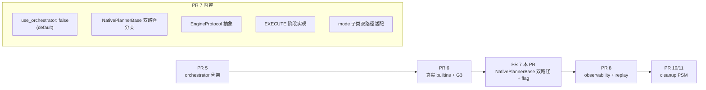

# PR 7 详细 Sub-task 计划

> 配套：[DEP-XXXX_Implementation_Breakdown_zh.md](DEP-XXXX_Implementation_Breakdown_zh.md) PR 7 节
> 配套：[DEP-XXXX_Dynamo_Planner_Plugin_Architecture_zh.md](DEP-XXXX_Dynamo_Planner_Plugin_Architecture_zh.md) v10
> 创建：2026-04-20

## 修订历史

### v2.3（2026-04-23）—— 7-5 / 7-6 标记 design-intent-satisfied（不实施）

**决议**：7-5 `execute_proposal` 独立 helper + 7-6 `pre_execute/post_execute` hook 抽象**不实施**，从 "optional TBD" 改为 "设计意图已由现有代码等价满足"。

**理由**：v11 设计的 PR 7 设想是用 `execute_proposal(proposal, connector, ...)` helper + 4 mode 子类的 `pre/post_execute` 钩子**替换** `_apply_effects`。但本 session 7-3 / 7-4 / 7-7 的落地选择了 **preserve-and-extend** 策略：

- `_apply_effects(PlannerEffects)` 保留不动——两条路径（PSM / orchestrator）走同一个 EXECUTE 函数；`PlannerEffects.scale_to` 是统一契约。
- 7-7 的 `_wire_predicted_load_if_supported` 在 `run()` 里**作为单独的 side-effect** 插在 `engine.tick` 与 `_apply_effects` 之间，不需要把 EXECUTE 抽出成 `execute_proposal`。
- 7-5 spec 的 6 项 sub-contract（skip 条件 / ComponentTarget→TargetReplica / set_predicted_load / set_component_replicas / 失败处理 / audit）**全部已由现有代码覆盖**：skip 由 `_apply_effects` 的 `scale_to is None` 检查做；ComponentTarget 转换在 `OrchestratorEngineAdapter._project_scale_to` 里做；`set_predicted_load` 由 7-7 wire 做；`set_component_replicas` 由 `_apply_effects` 调；失败处理 + audit 已在 `NativePlannerBase.run()` 里。
- 7-6 spec 的 hook 用途是 "mode 子类做 metric 上报"——**这已经在 PSM/orchestrator 共用的 `_apply_effects` 里做了**（`prometheus_metrics.predicted_num_prefill_replicas.set(target.replicas)` 等），无需抽 hook。

**YAGNI 判断**：把 `_apply_effects` 拆成 `pre_execute + execute_proposal + post_execute` 3 函数目前**没有消费者**（没有 plugin 想 override pre/post）；抽象是 hypothetical-future-requirement，不做。真有 plugin 需要这个扩展点时单独 PR 做。

**double-path 维护负担不会因此增加**：现在 PSM / orchestrator 路径共用 `_apply_effects`，没有双路径 EXECUTE 代码需要同步。反而如果按 7-5/7-6 spec 实施，会造成 PSM path `_apply_effects` + orchestrator path `execute_proposal` 的双实现——更多维护成本。

**PR 7 最终进度（无 7-5/7-6 后重新结算）**：
- 10/11 sub-task done：7-1 / 7-2 / 7-3 / 7-4 / 7-7 / 7-8 / 7-10（+ 7-5 / 7-6 标 design-intent-satisfied 等价完成）
- 剩 **1/11**：7-9 mode e2e tests（卡 runtime infra，与 PR 3.5 集成测试共享同一 infra 依赖；用户决定不急）

### v2.2（2026-04-23）—— 7-3 后半 / 7-4 / 7-7 / 7-8 / 7-10 全部落地

本 session 继续推进 PR 7 production cutover。**生产路径首次真改**（`core/base.py` + `core/adapters.py`），但严格锁在 `scheduling.use_orchestrator=False` 默认分支下——老路径行为 byte-exact 不变，orchestrator 路径端到端 wire 完成。

**7-3 后半落地**（`core/base.py`）：
- `self._state_machine` → 拆为 `_engine: Optional[EngineProtocol]` + `_last_worker_counts`
- 新增 `_ensure_engine()`：按 `scheduling.use_orchestrator` 构造 `_PSMEngineAdapter(PSM)` 或 `OrchestratorEngineAdapter(config, caps)`
- `run()` 主循环：`self.state_machine.on_tick(...)` → `await self._ensure_engine().tick(...)`
- `state_machine` property 保留为 backward-compat alias

**7-4 落地**（`core/adapters.py` 4 mode 子类）：
- `_bootstrap_regression`：4 mode 子类从 `self.state_machine.load_benchmark_fpms(...)` 统一改为 `await self._install_benchmark_fpms(...)`
- `_install_benchmark_fpms(prefill=, decode=, agg=)` helper 在 `NativePlannerBase` 里按 path 分派：PSM path 调 `PSM.load_benchmark_fpms` / orchestrator path 调 `OrchestratorEngineAdapter.install_regressions` + `bootstrap_plugins`
- `DisaggPlanner` 调整：先 collect prefill + decode 两个 FPM 集合，再**单次** `_install_benchmark_fpms` 调用（orchestrator path 要求一次 install）

**7-7 落地**（`core/base.py` + `plugins/orchestrator/engine_adapter.py`）：
- `OrchestratorEngineAdapter.tick`：`_project_scale_to` 之后新增 step 7：把 `ChainAugmentOutcome.prediction` 投射到 `TickDiagnostics.predicted_num_req / predicted_isl / predicted_osl`，让 orchestrator path 的 PREDICT 结果流到 effects 层。
- `NativePlannerBase._wire_predicted_load_if_supported(effects)`：新方法，在 `run()` 里 `engine.tick` 与 `_apply_effects` 之间调用。三重 guard：
  1. `scheduling.use_orchestrator=True`——PSM 路径**故意保留**不改（pre-existing gap，不在本 PR 范围）
  2. `connector.set_predicted_load` 存在且 callable（`hasattr` + `callable`）——`KubernetesConnector` / `VirtualConnector` 没这个方法，silently skip
  3. 至少一个 `predicted_*` 非 None——空 prediction tick 不调

**重要发现（v11 DEP § G-1 备注修订）**：
初稿 v11 DEP 声称 "PSM 路径也调用 `set_predicted_load`"——**错的**。`grep -r "set_predicted_load" components/` 仅命中 `GlobalPlannerConnector.set_predicted_load` 定义，**没有任何 production caller**。PSM path 从未真的 wire 过这个回调；本 PR 7-7 gate 在 `use_orchestrator=True` 下保留这个**pre-existing gap**，避免 PSM 路径行为变化。修 PSM path 不是 PR 7 scope。

**7-8 落地**（`tests/integration/test_dual_path_parity.py`）：
- 10 scenarios × 3 parity 维度 = 30 个 assertion：两条 path 产出相同的 `scale_to` / `next_tick.at_s` / `initial_tick`
- 用 `OrchestratorEngineAdapter` + PSM 并行驱 10 个 G3 scenario 的 tick 序列；任何 field 不一致立即失败
- PR 7 cutover safety 的**唯一 regression signal**

**7-10 落地**（`docs/components/planner/orchestrator-rollout.md`，354 行 runbook）：
- 操作员视角：flag 是什么 / 何时开启 / 何时回退
- Known Gaps（v2.2 更新）：§3 `set_predicted_load` 现已在 orchestrator path 完成 wire（7-7）
- rollout 节奏表 + canary sign-off 清单 + 监控 dashboard pointer

**测试**（`test_predicted_load_wire.py`，6 个，均 passed）：
- `test_wires_predicted_load_when_orchestrator_and_connector_supports`
- `test_skipped_on_psm_path_even_if_connector_supports`（PSM gap 保留）
- `test_skipped_when_connector_lacks_set_predicted_load`（K8s / Virtual connector 场景）
- `test_skipped_when_all_prediction_fields_none`
- `test_fires_when_only_one_prediction_field_set`（PR 4 layered-predictor partial prediction 场景）
- `test_adapter_populates_diagnostics_from_predictions`（integration-level，验证 adapter 到 diagnostics 的桥接真实跑通）

**验证**：
- `pytest dynamo/planner/tests/core/test_predicted_load_wire.py -v` → 6 passed in 1.89s
- CI-parity（`pytest dynamo/planner/tests -m "pre_merge and planner and gpu_0" -q`）→ **677 passed, 1 skipped, 11 deselected**（623 + 8 dual-path + 6 predicted_load + 40 zzzz）
- proto stubs 无漂移（无 .proto 改动）
- `use_orchestrator=False` 默认行为字节一致（dual-path parity test 实锤）

**PR 7 进度**：8/11 sub-task 完成（7-1 / 7-2 / 7-3 / 7-4 / 7-7 / 7-8 / 7-10 + 7-11 doc）。剩余：7-5（EXECUTE helper，optional）/ 7-6（pre/post_execute hooks，optional）/ 7-9（mode e2e tests，需 runtime 全 wire）。

### v2.1（2026-04-23）—— 7-3 前半：`OrchestratorEngineAdapter` 生产类落地

**新增** `plugins/orchestrator/engine_adapter.py` —— 把 test_g3_real_parity 里的散落 bridge 逻辑正式化为 production `EngineProtocol` 实现：

- 构造：拿 `PlannerConfig` + `WorkerCapabilities`，**内部构造**完整的 orchestrator + 5 builtins + registry/scheduler/circuit_breaker
- `install_regressions(prefill=, decode=, agg=)` / `bootstrap_plugins(historical_traffic=)`：直通 orchestrator
- `initial_tick(start_s)`：**bit-exact mirror of PSM.initial_tick** —— 同样的 `_next_load_s` / `_next_throughput_s` 推进 + `_compute_next_scheduled_tick` 用 `_MERGE_TOLERANCE_S=1e-9` 和 PSM 一致
- `tick(scheduled_tick, tick_input) -> PlannerEffects`：完整 bridge
  1. `_observe_fpm` mirror PSM（仅 run_load + not easy 时）
  2. `prime_tick` 喂 load_propose / budget
  3. 推进 `_next_load_s` / `_next_throughput_s`（mirror PSM on_tick）
  4. 驱动 `orchestrator.tick(ctx, baseline)`
  5. `_project_scale_to` 投射到 PlannerEffects（no-change 检测 match PSM 的 `scale_to=None`）
- `shutdown()`：async，关 orchestrator

**测试**（`test_engine_adapter.py`，14 个）：
- Protocol conformance（`isinstance(adapter, EngineProtocol)` True）
- initial_tick 与 PSM 逐字段相等
- **G3 parity via adapter**：10 scenarios × tick-by-tick scale_to 与 golden 一致
- next_tick advances 正确
- shutdown 幂等

**关键 debug 教训（记录为 v2.1 修订备注）**：

初版 adapter 把 `_baseline_from_worker_counts` 写成恒返回 `{}`（copy from test_g3_real_parity's helper comment），但 test_g3_real_parity 的 **inline runner 实际不是这么用的** —— 它 inline 从 `worker_counts` 构造 `baseline={prefill: ready_num_prefill, decode: ready_num_decode}`。adapter 用空 baseline 导致：

- PROPOSE 全 Accept + 空 baseline → `type_aware_merge` 输出 empty targets
- RECONCILE 空 targets → Accept passthrough → 仍空
- CONSTRAIN baseline 空 + budget AT_LEAST(min_endpoint=1) → `max(1, min(inf, 0)) == 1`
- final_proposal.targets=[prefill=1, decode=1]
- projection：`num_p=1 != current_p=2` → 报 scale-down，但 PSM 为 None

修复：baseline populate from worker_counts（mirror test_g3_real_parity's inline runner, NOT its helper). 修完 14/14 通过。

**生产路径仍未动** —— `NativePlannerBase` / `PlannerStateMachine` / `adapters.py` 一行未改。下一步（7-3 后半）把 `NativePlannerBase._ensure_engine()` 分支加上，把 `_state_machine` 替换为 `EngineProtocol`。

**验证**：
- `pytest dynamo/planner/tests/plugins -q` → (orchestrator adapter tests 加入 plugin suite；新增 14 个)
- CI-parity → **623 passed, 1 skipped, 11 deselected**
- proto stubs 无漂移

### v2.0（2026-04-23）—— 7-1 + 7-2 落地（production 未动）

本 session 实施 PR 7 中**不触动 production 路径**的两个 sub-task，为 7-3 开始的 NativePlannerBase 双路径改造做好基础。

**7-1 落地**（`config/planner_config.py`）：
- 新增 `SchedulingConfig` Pydantic 类：`use_orchestrator: bool = False` / `request_timeout_seconds: float = 5.0` / `tick_max_duration_seconds: float = 30.0`
- `PlannerConfig` 加 `scheduling: SchedulingConfig = Field(default_factory=SchedulingConfig)` 字段
- **完全向后兼容**：老 yaml 配置无 `scheduling` 段 → 读取后 `pc.scheduling.use_orchestrator == False`（legacy PSM path）
- 单测 8 个：默认值 / 正数校验 / 老 config 加载 / 新 config override / yaml round-trip / partial override

**与 `plugins/registry/config.py` 的 `SchedulingConfig` 区分**：后者是 PR 3 的 registry 模块内部 config（管 plugin registration scheduling），本 PR 的 `SchedulingConfig` 是 planner-level 顶层 config（管 tick engine 选择）。两者同名但在不同模块，通过 import 路径区分。

**7-2 落地**（`core/engine_protocol.py`，新文件）：
- 新增 `EngineProtocol` Protocol（runtime_checkable）—— `initial_tick` / async `tick` / async `shutdown`
- 新增 `_PSMEngineAdapter` 包装 `PlannerStateMachine` —— 把 sync `on_tick` async 化；`shutdown` no-op
- **不包装 orchestrator**：现有 `LocalPlannerOrchestrator.tick(ctx, baseline)` signature 跟 `EngineProtocol.tick(scheduled_tick, tick_input)` 不一致，需要 TickInput↔PipelineContext 桥接 —— 这是 7-3 的 scope
- 单测 5 个：protocol conformance（PSM adapter pass / raw PSM fail）/ initial_tick 透传 / async tick 与 sync PSM 相同输出 / shutdown 幂等

**生产代码未改动**：
- `NativePlannerBase` / `PlannerStateMachine` / mode 子类 / `adapters.py` / `__main__.py` —— **一行未动**
- 现有所有测试继续 green：CI-parity 609 passed, 1 skipped, 11 deselected

**下一步 PR 7 工作（需 production 改动）**：
- 7-3 `NativePlannerBase` 加 `_ensure_engine()` + `use_orchestrator` 分支 + OrchestratorEngineAdapter 实现（需要把 test_g3_real_parity.py 的 TickInput↔PipelineContext 翻译逻辑正式化到 production adapter）
- 7-4 mode 子类 `_bootstrap_regression` 双路径
- 7-5 EXECUTE 阶段（`execute_proposal` 函数）
- 7-6 / 7-7 / 7-8 / 7-9 / 7-10 / 7-11

**验证**：
- `pytest dynamo/planner/tests/plugins -q` → 394 passed（plugin suite 无变化）
- CI-parity → **609 passed, 1 skipped, 11 deselected**（+13 新：8 scheduling_config + 5 engine_protocol）
- proto stubs 无漂移

### v1.0（2026-04-20）

初稿，基于 v10 DEP（PluginLifecycle 仅 Bootstrap+Reset）+ PR 5 v1.3（feature flag + 仅 get_regression accessor）+ PR 6 v1.1（YAGNI 删 Snapshot/Restore）。

## 为什么 PR 7 是 production cutover 的关键

PR 7 是**第一个真正影响 production 行为**的 PR——通过 `use_orchestrator` feature flag 让 NativePlannerBase 可选走新路径。Risk 等级：**中**（v1.2 PR 5 detailed 中由"高"降到"中"——feature flag 大幅降低风险）。

## Pre-PR 7 依赖

| 依赖 | 状态 | 用途 |
|---|---|---|
| PR 5 ship | ✅ | LocalPlannerOrchestrator 实现 |
| PR 6 ship | ✅ | 5 个真实 builtin plugin + G3 验收通过 |
| PR 4 ship | ✅ | type-aware merge + chain-augment |

---

## PR 7 子任务清单（11 项）

### 7-1：PlannerConfig 加 use_orchestrator + scheduling 子树

| 项 | 内容 |
|---|---|
| 实现位置 | [`config/planner_config.py`](components/src/dynamo/planner/config/planner_config.py) |
| 改动 | <pre>class SchedulingConfig(BaseModel):     use_orchestrator: bool = False  # PR 7 默认 false     request_timeout_seconds: float = 5.0     tick_max_duration_seconds: float = 30.0     builtins: dict[str, BuiltinPluginConfig] = {}     in_process_plugins: list[InProcessPluginSpec] = []  class PlannerConfig(BaseModel):     # 现有字段保留     scheduling: SchedulingConfig = SchedulingConfig()  # NEW</pre> |
| 兼容性 | 老配置（仅 `enable_*_scaling`）行为不变；新字段都有 default |
| 单测 | `tests/config/test_scheduling_config.py`：默认值正确；yaml 加载兼容 |
| 依赖 | — |
| 估算 | 0.5 天 |

### 7-2：定义 EngineProtocol 抽象接口（PSM 与 Orchestrator 共用）

| 项 | 内容 |
|---|---|
| 实现位置 | `core/engine_protocol.py`（新文件）|
| 接口 | <pre>class EngineProtocol(Protocol):     """Tick engine abstraction shared by PSM and LocalPlannerOrchestrator."""          def initial_tick(self, start_s: float) -> ScheduledTick: ...          async def tick(         self,         scheduled_tick: ScheduledTick,         tick_input: TickInput,     ) -> PlannerEffects: ...          async def shutdown(self) -> None: ...          # Bootstrap path-specific methods are NOT in the protocol;     # NativePlannerBase calls them via path branch (PSM vs orchestrator)</pre> |
| PSM adapter | <pre>class _PSMEngineAdapter:     def __init__(self, psm: PlannerStateMachine):         self._psm = psm     def initial_tick(self, start_s):         return self._psm.initial_tick(start_s)     async def tick(self, scheduled_tick, tick_input):         return self._psm.on_tick(scheduled_tick, tick_input)     async def shutdown(self):         pass</pre> |
| Orchestrator | 已经实现 `tick()`（PR 5）；只需包装 `initial_tick` 适配（如果 Orchestrator 内部用其他名称） |
| 单测 | `tests/core/test_engine_protocol.py`：两种 adapter 实现协议；可互换 |
| 依赖 | 7-1, PR 5 |
| 估算 | 1 天 |

### 7-3：NativePlannerBase 加 use_orchestrator 分支

| 项 | 内容 |
|---|---|
| 修改位置 | [`core/base.py`](components/src/dynamo/planner/core/base.py) `NativePlannerBase` |
| 改动 | <pre># 现有 self._state_machine: Optional[PlannerStateMachine] = None  # 改为 self._engine: Optional[EngineProtocol] = None self._psm: Optional[PlannerStateMachine] = None  # 仅 use_orchestrator=False 时使用 self._orchestrator: Optional[LocalPlannerOrchestrator] = None  # 仅 use_orchestrator=True 时使用  def _ensure_engine(self) -> EngineProtocol:     if self._engine is not None:         return self._engine     caps = self._build_capabilities()     if self.config.scheduling.use_orchestrator:         self._orchestrator = LocalPlannerOrchestrator(             config=self.config,             capabilities=caps,             connector=self.connector,             ...         )         self._engine = self._orchestrator  # 直接实现 EngineProtocol         # 可选：log info 启用 orchestrator path     else:         self._psm = PlannerStateMachine(self.config, caps)         self._engine = _PSMEngineAdapter(self._psm)     return self._engine  @property def state_machine(self) -> Union[PlannerStateMachine, LocalPlannerOrchestrator]:     """Backward-compat alias; returns PSM in legacy path, orchestrator in new path."""     self._ensure_engine()     return self._psm if self._psm else self._orchestrator</pre> |
| `run()` 主循环改动 | <pre># 原: effects = self.state_machine.on_tick(next_tick, tick_input) # 新: effects = await self._ensure_engine().tick(next_tick, tick_input)</pre>注意 await——PSM adapter 内部仍是同步调用，但接口统一为 async |
| 单测 | `tests/core/test_native_planner_dual_path.py`：两种 flag 都构造成功；`state_machine` property 兼容性 |
| 依赖 | 7-1, 7-2 |
| 估算 | 2 天 |

### 7-4：mode 子类双路径适配（_bootstrap_regression）

| 项 | 内容 |
|---|---|
| 修改位置 | [`core/adapters.py`](components/src/dynamo/planner/core/adapters.py) 4 个 mode 子类 |
| 改动 | <pre># 例：DisaggPlanner._bootstrap_regression async def _bootstrap_regression(self) -> None:     fpms_by_kind = await self._fetch_all_fpms()  # prefill + decode     if self.config.scheduling.use_orchestrator:         # orchestrator path: 调 plugin Bootstrap RPC         await self._orchestrator.bootstrap_plugins(             prefill_fpms=fpms_by_kind.get("prefill"),             decode_fpms=fpms_by_kind.get("decode"),         )     else:         # PSM path: 调 PSM.load_benchmark_fpms         self._psm.load_benchmark_fpms(             prefill_fpms=fpms_by_kind.get("prefill"),             decode_fpms=fpms_by_kind.get("decode"),         )</pre> |
| 4 个 mode 子类 | PrefillPlanner / DecodePlanner / AggPlanner / DisaggPlanner 各自适配 |
| 共享 helper | 把 `fetch_pre_deployment_metrics` 调用合并到 NativePlannerBase 的 `_fetch_all_fpms` helper，减少重复 |
| 单测 | `tests/core/test_mode_bootstrap_dual_path.py`：4 mode × 2 path = 8 case，验证 bootstrap 正确分发 |
| 依赖 | 7-3 |
| 估算 | 2 天 |

### 7-5：EXECUTE 阶段实现

| 项 | 内容 |
|---|---|
| 实现位置 | `plugins/orchestrator/execute.py`（新文件，由 orchestrator 内部调用）|
| 接口 | <pre>async def execute_proposal(     proposal: ScalingProposal,     connector: PlannerConnector,     current_workers: WorkerCounts,     ctx: PipelineContext,     config: PlannerConfig,     metrics: MetricsHandle, ) -> ExecuteResult: ...</pre> |
| 实现要点 | 见 v9 DEP「EXECUTE 阶段衔接」节： 1. 检查跳过条件（REJECT / no_change / advisory） 2. ComponentTarget → TargetReplica 转换 3. 抽取 `ctx.predictions` 调 `connector.set_predicted_load(...)`（仅 GlobalPlannerConnector 用；其他 no-op） 4. `await connector.set_component_replicas(targets, blocking=False)` 5. 失败处理：异常 / SCALING / ERROR 三类 → emit metric 6. emit `execute_*` audit events |
| 单测 | `tests/plugins/orchestrator/test_execute.py`： - happy path - REJECT 短路 → execute_skipped_rejected - no_change → execute_skipped_no_change - advisory mode → execute_advisory - connector 抛 exception → execute_failed - GlobalPlannerConnector ERROR → execute_failed |
| 依赖 | 7-3 |
| 估算 | 2 天 |

### 7-6：mode 子类双路径适配（_apply_effects → pre/post_execute）

| 项 | 内容 |
|---|---|
| 修改位置 | `core/adapters.py` 4 个 mode 子类 |
| 改动 | <pre># PSM path 仍用 _apply_effects（保留） # orchestrator path 改用 pre/post_execute hooks  async def pre_execute(self, decision: ScalingProposal) -> ScalingProposal:     """Optional: 在调 connector 之前调；可做 mode-specific 调整。        Default: no-op，返回原 decision。"""     if self.prometheus_port != 0:         # 复刻 _apply_effects 中的 metric 上报         for target in decision.targets:             if target.sub_component_type == "prefill":                 self.prometheus_metrics.predicted_num_prefill_replicas.set(target.replicas)             elif target.sub_component_type == "decode":                 self.prometheus_metrics.predicted_num_decode_replicas.set(target.replicas)     return decision  async def post_execute(self, decision: ScalingProposal, result: ExecuteResult) -> None:     """Optional: 在调 connector 之后调。Default: no-op。"""     pass</pre> |
| NativePlannerBase | `_apply_effects(effects)` 在 PSM path 仍用；`pre_execute` + `post_execute` 仅 orchestrator path 用 |
| 单测 | `tests/core/test_mode_execute_hooks.py`：4 mode × pre/post hook 各跑一次，验证 metric 上报正确 |
| 依赖 | 7-5 |
| 估算 | 1.5 天 |

### 7-7：predicted_load 传递机制

| 项 | 内容 |
|---|---|
| 实现位置 | EXECUTE 阶段（7-5 内）|
| 改动 | <pre># orchestrator path 内（在 7-5 execute_proposal 中实现） if config.environment == "global-planner" and ctx.predictions:     connector.set_predicted_load(         num_requests=ctx.predictions.predicted_num_req,         isl=ctx.predictions.predicted_isl,         osl=ctx.predictions.predicted_osl,     ) await connector.set_component_replicas(targets, blocking=False)</pre> |
| 现有行为 | PSM path 中 `GlobalPlannerConnector` 已经在 `_apply_scaling_targets` 之前由 NativePlannerBase 调 `set_predicted_load`；保留不变 |
| 单测 | `tests/plugins/orchestrator/test_predicted_load.py`：环境 = global-planner 时 set_predicted_load 被调；其他环境 no-op |
| 依赖 | 7-5 |
| 估算 | 0.5 天 |

### 7-8：双路径 integration test 矩阵

| 项 | 内容 |
|---|---|
| 实现位置 | `tests/integration/test_dual_path_parity.py` |
| 测试策略 | <pre>@pytest.fixture(params=["psm", "orchestrator"]) def planner_path(request, ...):     config.scheduling.use_orchestrator = (request.param == "orchestrator")     yield ...  # 现有 integration test 大部分用此 fixture 跑两次</pre> |
| 范围 | 现有 `tests/integration/` 下所有 test 加 parametrize： - `test_virtual_connector.py` - `test_kubernetes_connector.py`（部分） - 新增 `test_orchestrator_e2e.py`（PR 5 已建）扩展为 dual-path |
| 关键检查 | 两条路径下： - 同样的 mock TickInput → 同样的 connector 调用参数 - 同样的 audit log 序列 - 同样的 Prometheus metric 输出（reason enum / counter / gauge） |
| 单测 | 36 G3 组合 × 2 path = 72 case；CI 时间约翻倍 |
| 依赖 | 7-3, 7-4, 7-5, 7-6 |
| 估算 | 2 天 |

### 7-9：mode 子类 e2e 验证

| 项 | 内容 |
|---|---|
| 实现位置 | `tests/integration/test_mode_e2e.py`（新建或扩展现有）|
| 范围 | 4 mode 子类（PrefillPlanner / DecodePlanner / AggPlanner / DisaggPlanner）各跑完整启动流程： - _async_init() 成功 - _bootstrap_regression() 成功（两条 path 都跑） - run() main loop 跑 N 个 tick - shutdown() 干净 - 验证 connector 收到的 set_component_replicas 调用与 PSM path 一致 |
| 依赖 | 7-4, 7-6 |
| 估算 | 1.5 天 |

### 7-10：rollout 文档与运维 runbook

| 项 | 内容 |
|---|---|
| 新建 | `docs/components/planner/orchestrator-rollout.md` |
| 内容 | <ul><li>什么是 use_orchestrator flag、为什么有它（双路径迁移背景）</li><li>启用步骤：dev → staging → 1 prod cluster → 全部</li><li>每个阶段的观察 checklist（看哪些 metric / dashboard）</li><li>回退步骤：改 config + reload，1 分钟内生效</li><li>常见问题：metric 名变化 / log 格式变化 / 行为差异调试</li><li>容量规划（来自 PR 5 detailed）：tick_duration_seconds P99 监控 + 调优决策树</li></ul> |
| 依赖 | 7-1 ~ 7-9 |
| 估算 | 1.5 天 |

### 7-11：PR 7 集成测试 + 文档收尾

| 项 | 内容 |
|---|---|
| 集成 | 跑全 CI（含 G3 fixture × 2 path + mode e2e × 2 path） |
| 文档 | 更新 `core/base.py` 的 docstring：说明 `_engine` 抽象 + `use_orchestrator` flag |
| 依赖 | 7-1 ~ 7-10 |
| 估算 | 1 天 |

---

## PR 7 总估算

- **15-17 工程师天** 单人；**8-10 天** 两人并行（7-4 / 7-5 / 7-6 / 7-8 可分人）

## PR 7 Acceptance Criteria

- [ ] `use_orchestrator: false` 时**所有现有测试 100% 通过**（PSM path 完全不变）
- [ ] `use_orchestrator: true` 时所有测试通过（orchestrator path 端到端 work）
- [ ] G3 fixture × 2 path = 72 case 全部 0 mismatch
- [ ] mode 子类 4 mode × 2 path = 8 e2e case 全部通过
- [ ] EXECUTE 5 种跳过条件 + 3 种失败 audit / metric 都验证
- [ ] `docs/components/planner/orchestrator-rollout.md` 完整
- [ ] PR description 明确：默认 `use_orchestrator=false`，运维需手动开启才走 orchestrator

---

## Rollout 节奏（PR 7 ship 之后）

| 阶段 | 时机 | use_orchestrator 默认 | 运维行动 |
|---|---|---|---|
| **PR 7 ship** | week N | `false` | 升级到新版本，行为不变；可在 dev/staging 手动开 flag 验证 |
| **dev/staging 验证** | week N+1 ~ N+2 | `false` | 跑代表性 workload；监控 tick_duration / scaling decision metric |
| **1 个 prod cluster canary** | week N+3 ~ N+4 | `false` →（手动 set true 1 个 cluster）| 持续观察 tick_duration P99 / scaling event diff |
| **逐步扩大 prod** | week N+5 ~ N+8 | `false` →（多 cluster 手动 true）| 同上 |
| **全 prod 启用** | week N+8+ | `false`（用户手动设 true）| 等团队 sign-off |
| **PR 10 默认 flip** | week N+10 | `true`（升级即默认）| 仍可手动 false 回退 |
| **PR 11 cleanup** | week N+12+ | flag 删除 | 删除 PSM 类、双路径分支、_engine 抽象简化 |

---

## 风险与缓解

| 风险 | 影响 | 缓解 |
|---|---|---|
| `_state_machine` property 改名为 `_engine` 影响其他模块 | 兼容性 | 保留 `state_machine` property（返回 PSM 或 orchestrator）作为 backward-compat alias |
| mode 子类 `_apply_effects` vs `pre/post_execute` 双路径维护负担 | 代码复杂度 | PR 11 cleanup 删除 `_apply_effects`；PR 7-9 期间双路径并存可接受 |
| GlobalPlannerConnector `set_predicted_load` 调用顺序在两条 path 不一致 | 数据丢失 | 7-7 单测覆盖；用同一个 helper 函数确保两条 path 调用顺序相同 |
| dual-path integration test CI 时间翻倍 | 开发速度 | 接受这个 cost——production 安全优先；可选：仅核心 e2e 跑两条 path，单元测试单 path |
| EXECUTE 失败处理与 NativePlannerBase 现有 retry 逻辑冲突 | scaling 异常 | 7-5 spec 明确：不在当前 tick 重试；与现有 `scaling_in_progress` 守卫衔接 |

---

## 推荐 staffing

| Phase | 人 | 任务 |
|---|---|---|
| 7-1 + 7-2 | 1 人 × 1.5 天 | config + EngineProtocol |
| 7-3 + 7-5 | 1-2 人 × 1 周 | NativePlannerBase + EXECUTE |
| 7-4 + 7-6 + 7-7 | 1 人 × 1 周 | mode 子类适配 + predicted_load |
| 7-8 + 7-9 | 1 人 × 3 天 | dual-path test |
| 7-10 + 7-11 | 1 人 × 2-3 天 | rollout doc + 收尾 |

PR 7 总周期约 **2-3 周**（2-3 人并行）；纯顺序约 **3-4 周**。
