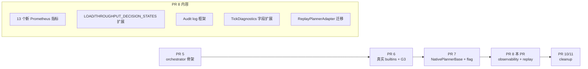

# PR 8 详细 Sub-task 计划

> 配套：[DEP-XXXX_Implementation_Breakdown_zh.md](DEP-XXXX_Implementation_Breakdown_zh.md) PR 8 节
> 配套：[DEP-XXXX_Dynamo_Planner_Plugin_Architecture_zh.md](DEP-XXXX_Dynamo_Planner_Plugin_Architecture_zh.md) v10
> 创建：2026-04-20

## 修订历史

### v1.2（2026-05-01）—— follow-up #76：真 mooncake trace 端到端

**背景**：8-8 把 `ReplayPlannerAdapter` 迁到 `EngineProtocol`，但已有的 `test_replay_dual_path.py` 只跑合成 `_FakeReplayBridge` 脚本——绕过了整条 trace ingestion + request aggregation 路径。出生产事故时 SRE 用 replay 拿真 mooncake JSONL 复盘的场景从来没真测过。

**新增 `tests/offline/test_replay_mooncake_trace.py`**（9 个测试）：

- `_MooncakeJsonlBridge` —— Python 版 `PlannerReplayBridge` 复刻，按时间窗聚合 mooncake records → emit 同样形状的 tick dict（PSM 与 orchestrator 路径都通过 `ReplayPlannerAdapter` 既有的 `bridge` 接口消费）
- 一个手工构造的 ~155-record 4-阶段 mooncake trace（baseline → ramp → peak → cooldown），所有 timestamp / ISL / OSL 全确定，无随机性
- 锁住的 invariant：
  1. PSM 全消费 trace（cursor 抵达末尾）
  2. orchestrator 全消费 trace
  3. **dual-path parity：两条路径的 `scaling_events` 序列 byte-equal**（同 (at_s, component, from, to)）
  4. `diagnostics_log` 每 tick 都填充
  5. HTML 诊断报告两条路径都生成
  6. JSONL 文件落盘 + `extract_metrics_from_mooncake` round-trip 校验 schema 不漂
  7. **Aggressive 模式 byte-equal**：单独构造 spike trace（50 reqs OSL=4096 注入 10s 内，KV 占用 12.5×）+ latency 模式（40% 阈值），强制两条路径都触发 `scale_up`；assert 事件序列 byte-equal `[t=70.0s agg 1→2 scale_up]` 完全一致。补全了 v1.2 初版只锁住"idle 一致"的薄弱处，现在覆盖"真扩缩 + 真 trace + dual-path"完整三元组。

**回归状态**：874/874 PASSED；之前的 30/30 dual_path_parity 仍 byte-equal。

**影响**：PR 10 把 flag 翻 true 之后，replay 工具是 SRE 复盘事故的唯一手段。这个测试锁住"真 trace + orchestrator 路径"等价 PSM 路径的诊断输出——少了它，灰度期间出 bug 时 offline 复盘无法相信。

### v1.1（2026-04-28）—— follow-up A1 + A2

PR 8 主线 10 子任务都 ship 之后，K8s 实跑暴露的两个观测准确性问题：

**A1 — `execute_total{result=success}` 误分类修复**
- 新增 `errors.ConnectorBusyError(reason, detail)`
- `connectors/kubernetes.py:set_component_replicas` DGD `Ready=False` 时 `raise ConnectorBusyError("deployment_not_ready")`，不再 silent return
- `core/base.py:_apply_scaling_targets` 单独 catch `ConnectorBusyError` → `execute_total{result=skipped_connector_blocked}` + `execute_skip_reason_total{reason=<...>}`，**不**重新抛（瞬时状态，下个 tick 会 retry）
- 新增 5 个单测 `tests/core/test_apply_scaling_targets.py` 锁住漏斗分类；`test_kubernetes_connector::test_set_component_replicas_deployment_not_ready_raises_busy` 由 silent-return 改为 expect raise
- 影响：**修复"100% 绿色 dashboard 但 planner 死了"故障模式**；不动 `set_component_replicas` 公开签名以外的接口

**A2 — `BuiltinThroughputPropose` Accept-path observability parity**
- 加 `_last_throughput_diagnostics: dict` 字段（同 8-9 给 `BuiltinLoadPropose` 加的 `_last_load_diagnostics`）
- Propose 入口 reset；每个 branch（`disabled`/`predict_failed`/`no_traffic_data`/`model_not_ready`/`set_lower_bound`/`scale`）stamp reason，词汇严格对齐 PSM `_diag_throughput_reason`
- `OrchestratorEngineAdapter._project_throughput_diagnostics()` 新增；`engine_adapter.tick()` 在 `_project_load_diagnostics` 之后调用
- 新增 `_aggregate_throughput_reason()` 静态方法（disagg 模式合并 prefill/decode reason）
- 新增 13 个单测 `tests/plugins/builtins/test_throughput_propose_diagnostics.py`；`tests/plugins/orchestrator/test_engine_adapter_diagnostics.py` 加 3 个 throughput projection 测试
- **dual-path parity 仍 byte-equal**（`tests/integration/test_dual_path_parity.py` 30/30 PASSED）
- 影响：PR 11 删 PSM 后 `BuiltinThroughputPropose` 是唯一吞吐路径，A2 现在补的 observability gap 在那时是必需

### v1.0（2026-04-20）

初稿，基于 v10 DEP（YAGNI 删除 Snapshot/Restore）+ PR 5 v1.3 + PR 6 v1.1 + PR 7 v1.0（feature flag）。

## 为什么 PR 8 是收尾 PR

PR 8 是主要 8 PR 中**最后一个**——把 v10 DEP 中的 **可观测性体系**与 **replay 路径**全部落地。Risk 等级：**中**——不影响 production 行为（可观测性是 read-only），但 ReplayPlannerAdapter 迁移要小心兼容。

## Pre-PR 8 依赖

| 依赖 | 状态 | 用途 |
|---|---|---|
| PR 5 ship | ✅ | LocalPlannerOrchestrator |
| PR 6 ship | ✅ | 真实 builtin plugin（emit metric 的 owner） |
| PR 7 ship | ✅ | feature flag + 双路径——orchestrator path 实际跑得通 |

---

## PR 8 子任务清单（10 项）

### 8-1：扩展 LOAD_DECISION_STATES / THROUGHPUT_DECISION_STATES enum

| 项 | 内容 |
|---|---|
| 修改位置 | [`monitoring/planner_metrics.py`](components/src/dynamo/planner/monitoring/planner_metrics.py) |
| 改动 | <pre>LOAD_DECISION_STATES = [     # 现有     "unset", "disabled", "no_fpm_data", "scaling_in_progress",     "worker_count_mismatch", "insufficient_data", "no_change",     "scale_up", "scale_down", "scale_down_capped_by_throughput",     # v10 新增     "override_by_user_plugin",     "reconcile_clamped_to_floor",     "reconcile_clamped_to_ceiling",     "held_over",     "rejected_by_plugin", ] THROUGHPUT_DECISION_STATES = [     # 现有     "unset", "disabled", "no_traffic_data", "predict_failed",     "model_not_ready", "set_lower_bound", "scale",     # v10 新增     "override_by_user_plugin",     "held_over",     "circuit_open",     "rejected_by_plugin", ]</pre> |
| 实现要求 | `prometheus_client.Enum.states` 是构造时固定的；只能加值不能删；新值必须列在末尾保持向后兼容 |
| 单测 | `tests/monitoring/test_decision_state_enums.py`：所有现有 state value 仍在；新 state value 可以正确 set |
| 依赖 | — |
| 估算 | 0.5 天 |

### 8-2：新增插件层指标家族（family 2）

| 项 | 内容 |
|---|---|
| 修改位置 | `monitoring/planner_metrics.py` |
| 新增 6 个指标 | <pre>self.plugin_evaluations_total = Counter(     f"{PREFIX}_plugin_evaluations_total",     "Total plugin evaluation calls",     labelnames=["plugin_id", "stage", "result"], ) self.plugin_latency_seconds = Histogram(     f"{PREFIX}_plugin_latency_seconds",     "Plugin RPC latency",     labelnames=["plugin_id", "stage"],     buckets=[0.001, 0.005, 0.01, 0.05, 0.1, 0.5, 1, 5], ) self.plugin_circuit_state = Gauge(     f"{PREFIX}_plugin_circuit_state",     "Circuit breaker state (0=closed, 0.5=half_open, 1=open)",     labelnames=["plugin_id"], ) self.plugin_held_over_total = Counter(     f"{PREFIX}_plugin_held_over_total",     "HOLD_LAST replay events",     labelnames=["plugin_id", "stage"], ) self.plugin_cache_age_seconds = Gauge(     f"{PREFIX}_plugin_cache_age_seconds",     "Age of HOLD_LAST cached result",     labelnames=["plugin_id"], ) self.plugin_override_active = Gauge(     f"{PREFIX}_plugin_override_active",     "Plugin contributed override this tick (0/1)",     labelnames=["plugin_id", "stage", "override_type"], )</pre> |
| 调用方 | LocalPlannerOrchestrator + PluginScheduler 在对应位置 inc/set |
| 单测 | `tests/monitoring/test_plugin_metrics.py`：每个指标至少一个 unit test 验证 label + value |
| 依赖 | 8-1, PR 5 + PR 6 |
| 估算 | 1.5 天 |

### 8-3：新增 RECONCILE / CONSTRAIN 行为指标家族（family 3）

| 项 | 内容 |
|---|---|
| 修改位置 | `monitoring/planner_metrics.py` |
| 新增 3 个指标 | <pre>self.reconcile_clamped_total = Counter(     f"{PREFIX}_reconcile_clamped_total",     "RECONCILE result != recommendation (clamped by floor or ceiling)",     labelnames=["sub_component_type", "component_name", "source"], ) self.constrain_capped_total = Counter(     f"{PREFIX}_constrain_capped_total",     "builtin-budget-constrain capped final value",     labelnames=["sub_component_type", "component_name", "source"], ) self.reject_short_circuited_total = Counter(     f"{PREFIX}_reject_short_circuited_total",     "REJECT triggered short-circuit",     labelnames=["plugin_id"], )</pre> |
| 调用方 | RECONCILE / CONSTRAIN merger 内部 |
| 单测 | `tests/monitoring/test_reconcile_constrain_metrics.py` |
| 依赖 | 8-1, PR 4 (merger), PR 6 (CONSTRAIN plugin) |
| 估算 | 1 天 |

### 8-4：新增 GlobalPlanner 端指标家族（family 4）

| 项 | 内容 |
|---|---|
| 修改位置 | `monitoring/planner_metrics.py` + global_planner 端 |
| 新增 3 个指标 | <pre>self.global_scale_request_total = Counter(     f"{PREFIX}_global_scale_request_total",     "GlobalPlanner scale request handling",     labelnames=["result", "reason"], ) self.global_scale_request_latency_seconds = Histogram(     f"{PREFIX}_global_scale_request_latency_seconds",     "End-to-end RTT for scale request",     labelnames=["result"], ) self.global_managed_dgd_gpus = Gauge(     f"{PREFIX}_global_managed_dgd_gpus",     "GPU count per managed DGD",     labelnames=["dgd_name"], )</pre> |
| 调用方 | `GlobalPlannerConnector` 客户端 + `ScaleRequestHandler` 服务端 |
| 单测 | `tests/monitoring/test_global_planner_metrics.py` |
| 依赖 | 8-1 |
| 估算 | 1 天 |

### 8-5：新增 EXECUTE + Tick 调度指标家族（family 5 + 6）

| 项 | 内容 |
|---|---|
| 修改位置 | `monitoring/planner_metrics.py` |
| 新增 7 个指标 | <pre># EXECUTE 阶段（family 5） self.execute_total = Counter(     f"{PREFIX}_execute_total",     labelnames=["result"], )  # success / error / in_progress / skipped_no_change /    # skipped_rejected / advisory self.execute_latency_seconds = Histogram(     f"{PREFIX}_execute_latency_seconds",     labelnames=["result"], ) self.execute_skip_reason_total = Counter(     f"{PREFIX}_execute_skip_reason_total",     labelnames=["reason"], )  # Tick 调度（family 6） self.tick_skipped_total = Counter(     f"{PREFIX}_tick_skipped_total",     labelnames=["plugin_id"], ) self.tick_lag_seconds = Gauge(     f"{PREFIX}_tick_lag_seconds",     labelnames=["plugin_id"], ) self.tick_duration_seconds = Histogram(     f"{PREFIX}_tick_duration_seconds", ) self.tick_timeout_total = Counter(     f"{PREFIX}_tick_timeout_total", )</pre> |
| 调用方 | EXECUTE 阶段（PR 7 7-5）+ orchestrator scheduler |
| 单测 | `tests/monitoring/test_execute_tick_metrics.py` |
| 依赖 | 8-1, PR 7 (EXECUTE) |
| 估算 | 1.5 天 |

### 8-6：TickDiagnostics 字段扩展

| 项 | 内容 |
|---|---|
| 修改位置 | [`core/types.py`](components/src/dynamo/planner/core/types.py) `TickDiagnostics` |
| 改动 | <pre>@dataclass class TickDiagnostics:     # 现有 reason 字段保留     load_decision_reason: Optional[str] = None     throughput_decision_reason: Optional[str] = None     # ... 其他现有 reason 字段          # v10 新增字段     plugin_overrides: list[tuple[str, str, str, str, int]] = field(default_factory=list)     # (plugin_id, stage, override_type, component_key, value)          reconcile_reasons: dict[str, str] = field(default_factory=dict)     # {component_key: "set_by_<plugin_id>" / "clamped_to_floor" / ...}          held_over_plugins: list[str] = field(default_factory=list)     # plugin_id list of HOLD_LAST replays this tick          # v10 移除：现有数值类字段（estimated_ttft_ms / engine_rps_* / predicted_*）     # 仍保留作向后兼容；orchestrator path 不写入；plugin 直接 emit Prometheus metric</pre> |
| 兼容性 | 现有数值类字段保留——PSM path 仍写入；orchestrator path 不写入；diagnostics_recorder 跳过 None 值 |
| 单测 | `tests/core/test_tick_diagnostics_extended.py`：新字段默认值 + serialize/deserialize round-trip |
| 依赖 | — |
| 估算 | 1 天 |

### 8-7：Audit log 框架

| 项 | 内容 |
|---|---|
| 实现位置 | `plugins/audit.py`（新文件）|
| 接口 | <pre>class AuditLogger:     """Structured audit log for plugin lifecycle and decisions."""          def emit(self, event: str, **fields):         # 用 structlog 或 logger.info(event, extra=fields)         # 字段：tick_id, decision_id, plugin_id, ...         ...</pre> |
| 标准化 audit events | <pre># Plugin lifecycle "plugin_evaluated" "plugin_degraded" "plugin_timeout" "plugin_circuit_open" "plugin_rejected"  # EXECUTE "execute_invoked" "execute_succeeded" "execute_failed" "execute_skipped_rejected" "execute_skipped_no_change" "execute_advisory" "execute_in_progress"  # Multi-cadence "tick_skipped" "tick_timeout"  # Misc "global_scale_request_rejected" "plugin_constrain_set_dropped" "orchestrator_drift_detected"  # PR 5 v1.2 已删除 dual-execution 后此 event 不再触发，仅保留枚举</pre> |
| 调用方 | LocalPlannerOrchestrator / PluginScheduler / EXECUTE / GlobalPlannerConnector |
| 单测 | `tests/plugins/test_audit_logger.py`：每种 event 输出 structured log；JSON serialize OK |
| 依赖 | — |
| 估算 | 1.5 天 |

### 8-8：ReplayPlannerAdapter 迁移

| 项 | 内容 |
|---|---|
| 修改位置 | [`offline/replay_adapter.py`](components/src/dynamo/planner/offline/replay_adapter.py) |
| 改动 | <pre># 现有 from dynamo.planner.core.state_machine import PlannerStateMachine ... self._psm = PlannerStateMachine(config, capabilities) ... effects = self._psm.on_tick(scheduled_tick, tick_input)  # 改为 from dynamo.planner.plugins.orchestrator import LocalPlannerOrchestrator from dynamo.planner.plugins.transport import InProcessTransport from dynamo.planner.plugins.clock import VirtualClock ... self._clock = VirtualClock() self._orchestrator = LocalPlannerOrchestrator(     config=config,     capabilities=capabilities,     clock=self._clock,     connector=NoopConnector(),  # replay 不真实 scaling     ... ) # 启动时注册内置 plugin（与 PR 5 internal_register 路径一致） self._register_builtins() ... effects = await self._orchestrator.tick(scheduled_tick, tick_input)</pre> |
| 关键 | <ul><li>PSM import 删除（v10 决议）</li><li>InProcessTransport 让 plugin 调用零开销</li><li>VirtualClock 让时间由 trace 控制</li><li>NoopConnector：replay 不真实 scaling；仅记录决策</li></ul> |
| `ReplayPlannerReport` 兼容 | scaling_events / diagnostics_log 字段语义不变；新字段（plugin_overrides / reconcile_reasons / held_over_plugins）以 optional 方式追加 |
| 单测 | `tests/replay/test_replay_orchestrator.py`：跑现有 trace 数据集，输出与 PR 6 dump 的 G3 fixture 位级一致 |
| 暴露 user stub hook | <pre>class ReplayPlannerAdapter:     def register_test_plugin(self, plugin_id: str, plugin_type: str, instance: PluginBase):         """Test-only: 注入自定义 stub plugin（用于 replay 时模拟 user plugin 行为）。"""         self._orchestrator.register_internal(plugin_id, plugin_type, ..., is_builtin=False)</pre> |
| 依赖 | PR 5, PR 6, PR 7 |
| 估算 | 2 天 |

### 8-9：Audit + Metric 集成测试

| 项 | 内容 |
|---|---|
| 实现位置 | `tests/integration/test_observability_e2e.py` |
| 测试场景 | <ol><li>跑一个完整 tick（mock connector + orchestrator）</li><li>验证每个 event 都对应一个 audit log entry（按上方 8-7 列表 cross-check）</li><li>验证每个新 metric 有对应 inc/set 调用 + label 正确</li><li>跑一个有 user plugin 的 tick → 验证 plugin_overrides / plugin_evaluations_total 等 plugin 维度指标正确</li><li>跑一个 timeout 场景 → 验证 plugin_circuit_state / tick_timeout_total</li></ol> |
| 依赖 | 8-1 ~ 8-7 |
| 估算 | 1.5 天 |

### 8-10：文档 + Dashboard 更新

| 项 | 内容 |
|---|---|
| 新建/更新 | <ul><li>`docs/components/planner/observability.md` —— 新 metric 命名 + label set 完整列表</li><li>更新现有 Grafana dashboard（如有）—— 加 plugin metric panel</li><li>`docs/components/planner/audit-events.md` —— audit event 列表 + 字段说明</li></ul> |
| 依赖 | 8-1 ~ 8-9 |
| 估算 | 1.5 天 |

---

## PR 8 总估算

- **13-15 工程师天** 单人；**6-8 天** 两人并行（8-2 ~ 8-5 各 metric family + 8-7 audit + 8-8 replay 可分人）

## PR 8 Acceptance Criteria

- [ ] 13 个新 Prometheus 指标全部在 `tests/monitoring/` 有 unit test
- [ ] 现有 `dynamo_planner_load_scaling_decision` / `_throughput_scaling_decision` Enum **wire format 完全不变**——新 enum value 仅追加；现有 dashboard 查询仍正确
- [ ] TickDiagnostics 新字段 round-trip serialize/deserialize 通过
- [ ] Audit logger 输出 structured JSON；每种 event 字段正确
- [ ] ReplayPlannerAdapter 跑现有 trace 数据集，输出与 G3 fixture 位级一致
- [ ] 现有 e2e test 在 `use_orchestrator: true` 下通过（plugin metric 上报正常）
- [ ] PSM import 仍保留（PR 11 才彻底删除）

---

## 风险与缓解

| 风险 | 影响 | 缓解 |
|---|---|---|
| Prometheus Enum 添加新 state value 破坏现有 dashboard | dashboard 失效 | 仅追加（不删旧值）；CI 检查现有 enum value 集合不变 |
| ReplayPlannerAdapter 字段兼容性 | 旧 trace 跑不通 | `ReplayPlannerReport` 字段语义不变；新字段全部 optional with default |
| metric label cardinality 爆炸（plugin_id × stage × ...） | Prometheus 内存占用 | label 的 enum value 集合明确（plugin_id 数量有限；stage 4 个）；不引入开放 label |
| audit event 命名与现有 logging 冲突 | log 噪音 | structlog event 字段命名规范用 `dynamo_planner_` 前缀避免冲突 |
| ReplayPlannerAdapter 内嵌 InProcessOrchestrator 增加 replay 启动时间 | replay 慢 | NoopConnector 跳过实际 scaling；InProcessTransport 零 RPC 开销；估算 < 5% 慢 |

---

## 推荐 staffing

| Phase | 人 | 任务 |
|---|---|---|
| 8-1 + 8-6 | 1 人 × 1.5 天 | enum 扩展 + TickDiagnostics |
| 8-2 ~ 8-5 | 2 人并行 × 1 周 | 4 个 metric family（每人 2 个） |
| 8-7 | 1 人 × 1.5 天 | audit logger |
| 8-8 | 1 人 × 2 天 | ReplayPlannerAdapter 迁移 |
| 8-9 + 8-10 | 1 人 × 3 天 | 集成测试 + 文档 |

PR 8 总周期约 **2 周**（2 人并行）；纯顺序约 **3 周**。

---

## 与其他 PR 的关系

| PR | 关系 |
|---|---|
| **PR 5** | 提供 LocalPlannerOrchestrator + PluginScheduler；PR 8 在它们的方法内插 metric/audit 调用 |
| **PR 6** | 提供 builtin plugin；PR 8 让 plugin 内 emit metric（按 v10 Q2 决议——数值类移到 plugin metric）|
| **PR 7** | 提供 EXECUTE 阶段；PR 8 加 EXECUTE 指标家族 |
| **PR 11** | cleanup 时 ReplayPlannerAdapter 完全 import 不到 PSM；PR 8 已经做完迁移 |
