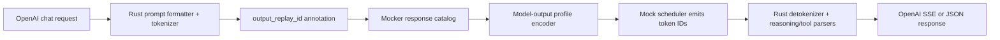

# Model-aware scripted responses for `dynamo.mocker`

## Summary

Add an opt-in response catalog to `dynamo.mocker`. It will turn semantic reasoning/tool-call fixtures into each model's native output grammar, emit those tokens through the existing mock scheduler, and let the default Rust frontend perform its real prompt formatting, tokenization, detokenization, reasoning parsing, tool parsing, SSE generation, and unary aggregation.



This remains CPU-only and downloads model metadata/tokenizers without weights.

## Public interfaces and behavior

Extend `MockEngineArgs` in `lib/mocker/src/common/protocols.rs` with:

- `--response-catalog-path <json>`
- `--model-output-profile <profile>`

Supported profiles and automatically advertised runtime parsers:

| Profile | Tool parser | Reasoning parser |
|---|---|---|
| `kimi_k3` | `kimi_k3` | `kimi_k3` |
| `deepseek_v4` | `deepseek_v4` | `deepseek_v4` |
| `qwen3_5` | `qwen3_coder` | `qwen3` |
| `glm_5_2` | `glm47` | `glm45` |
| `gpt_oss` | `harmony` | `gpt_oss` |

Introduce a versioned JSON catalog:

```json
{
  "version": 1,
  "cases": [
    {
      "id": "weather",
      "response": {
        "reasoning": "I should call the weather tool.",
        "content": null,
        "tool_calls": [
          {
            "name": "get_weather",
            "arguments": {"city": "Seattle"}
          }
        ]
      },
      "finish_reason": "stop",
      "chunk_size": 1
    }
  ]
}
```

Each case accepts exactly one payload form:

- `response`: semantic reasoning, content, and tool calls.
- `raw_output`: exact native model text for malformed/truncated grammar cases.
- `output_token_ids`: exact-token escape hatch and migration path from replay traces.

Behavior:

- Reuse the existing request selector: `nvext.annotations: ["output_replay_id:weather"]`.
- Defaults are `finish_reason: "stop"` and `chunk_size: 1`; larger chunk sizes exercise interval-batched backend output.
- Catalog mode is strict: missing IDs, duplicate IDs, invalid payload unions, or incompatible options fail instead of falling back to random tokens.
- Reject combinations with the existing generic `--reasoning` or legacy `--response-replay-trace-path`; preserve all legacy behavior when the new flags are absent.
- Respect request `max_tokens` and context limits. Clipping changes the terminal reason to `length`; a complete scripted response uses its configured reason.

## Implementation changes

- Create one Rust profile registry containing parser-pair metadata, grammar construction, special-token classification, and official-source references. Python only reads profile-derived parser names, preventing duplicate mappings.
- Have `components/src/dynamo/mocker/config.py` publish the profile's tool and reasoning parser names in `ModelRuntimeConfig`, making frontend discovery behave like a real worker.
- In `lib/llm/src/mocker.rs`:
  - Load and structurally validate the catalog once.
  - Pass the `LocalModel` tokenizer into mocker construction.
  - Compile semantic responses into typed text/special-token segments and encode them through the same segment-aware tokenizer used by prompt processing.
  - Detect whether the rendered prompt already opened a reasoning channel from its token suffix; select the correct completion framing instead of duplicating `<think>`/XTML boundaries.
  - Use `openai_harmony`'s native encoder for GPT-OSS and validate compatibility with the loaded model tokenizer.
  - Cache compiled token sequences by case and prompt-framing state.
  - Feed exact token counts into the existing scheduler, then coalesce emitted token IDs according to `chunk_size` without changing scheduling or performance simulation.
  - Emit the configured terminal reason and cumulative usage exactly once.
- Keep model grammar strings out of Python and test request bodies. Reuse exported parser configurations where possible and add golden conformance fixtures where markers are not exported.
- Treat the official model artifacts as grammar sources:
  - Kimi K3 encoding: <https://huggingface.co/moonshotai/Kimi-K3/blob/main/encoding_k3.py>
  - DeepSeek V4 encoding: <https://huggingface.co/deepseek-ai/DeepSeek-V4-Pro/blob/main/encoding/README.md>
  - Qwen3.5 tokenizer template: <https://huggingface.co/Qwen/Qwen3.5-4B/blob/main/tokenizer_config.json>
  - GLM model guidance: <https://huggingface.co/zai-org/GLM-5>
  - GPT-OSS Harmony: <https://github.com/openai/harmony>

## Test plan

Rust unit/conformance tests:

- Golden semantic-to-native grammar output for all five profiles.
- Encoder-to-existing-parser round trips for reasoning, direct content, one call, parallel calls, strings, nested JSON, Unicode, and empty arguments.
- Special-token preservation and prompt-injected reasoning framing.
- Catalog validation, strict lookup, chunk coalescing, truncation, finish reasons, usage, and legacy replay compatibility.

Hermetic pre-merge CPU coverage:

- Run profile encoder/parser conformance for all profiles without model downloads.
- Run one full frontend -> discovery -> mocker -> frontend E2E with a tiny synthetic model fixture to prove catalog selection and the complete process boundary.
- Mark `gpu_0`, `pre_merge`, `e2e`, and `parallel`.

Scheduled official-metadata matrix:

- Pin repository revision SHAs for one metadata-only checkpoint per profile.
- Download/cache tokenizer, config, chat template, and required custom encoding files while excluding weights.
- For every profile, run streaming and unary reasoning-plus-tool-call requests through the real Rust frontend and mocker.
- Add grammar-specific coverage: Kimi XTML framing, DeepSeek prompt-injected reasoning and DSML, Qwen XML parameters, GLM truncated-call handling, and GPT-OSS token-native analysis/commentary channels.

Acceptance criteria:

- Streamed deltas reassemble to the same semantic response as unary output.
- Reasoning appears only in `reasoning_content`; tool names and JSON arguments are exact.
- No native grammar markers leak into content.
- Tool calls normalize terminal `stop` to OpenAI `tool_calls`; truncation remains `length`.
- Exactly one terminal finish and one final usage record are emitted.
- Tests run without CUDA initialization, model weights, or inference-engine workers.

## Assumptions

- Version one covers only the default Rust frontend processor. The catalog remains backend-neutral so vLLM/SGLang Python processor parity can follow without changing its schema.
- Official metadata compatibility is scheduled rather than required on every PR; local runs become fast once metadata is cached.
- Existing parser-only tests remain; new tests cover the distinct HTTP, preprocessing, discovery, mocker, detokenization, and response-assembly composition risk.
- Because this introduces a public mocker fixture contract and cross-layer runtime behavior, capture the design as a lightweight DEP before implementation.
