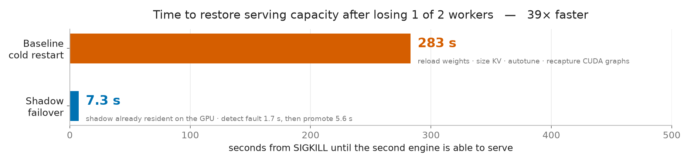
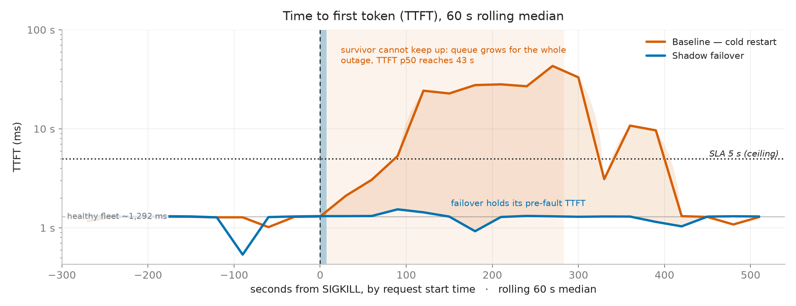
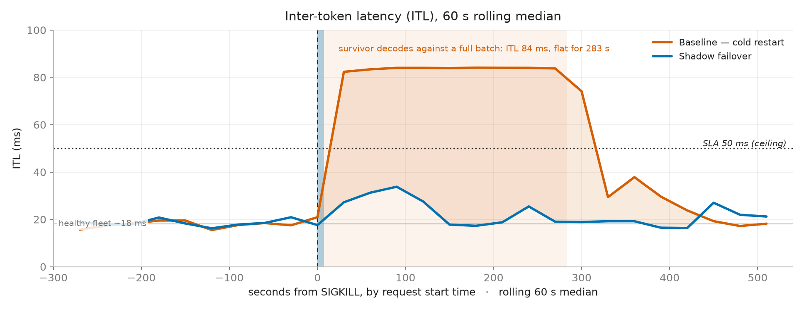
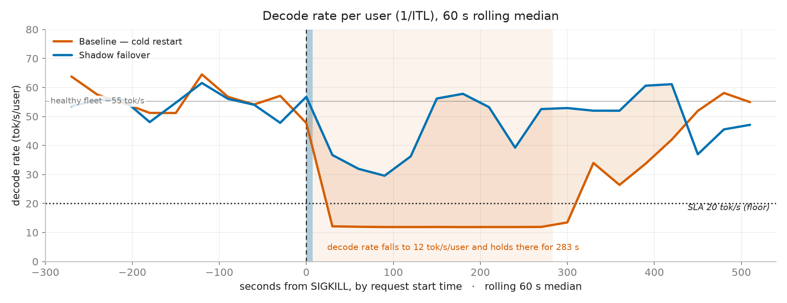
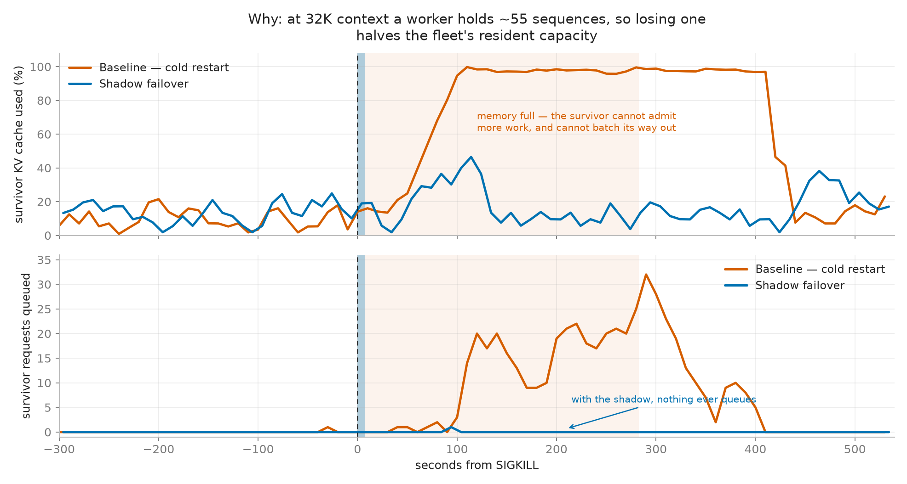
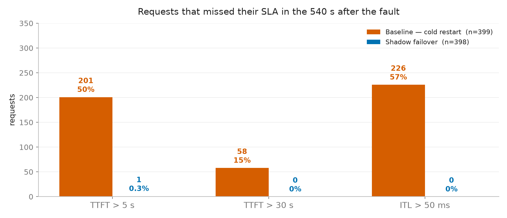

# Shadow Engine Failover on GLM-5.2

Killing 1 of 2 workers in a live fleet, with and without a resident shadow
engine. One variable differs between the arms.

## Setup

| | |
|---|---|
| model | GLM-5.2-NVFP4, TP=8, 204800 context, `gpu-memory-utilization 0.80` |
| fleet | 2 workers, 1 per node, 1 shared frontend, round-robin routing |
| load | synthetic, ISL 32,000 ± 0 / OSL 1,000, `ignore_eos` |
| arrivals | **open loop**, 0.7 req/s Poisson, concurrency cap 2048 (non-binding) |
| shape | 450 s soak → tree `SIGKILL` of one worker → 600 s observation |
| arm A | shadow engine resident, promotes in place |
| arm B | stock vLLM, no shadow — killed worker cold-restarts |

Fixed concurrency cannot measure this: the client only issues a new request when
one returns, so a degraded fleet receives *less* work and the fault hides itself.
A fixed arrival rate is what lets a queue form.

**Arms matched pre-fault:** TTFT p50 1,299 vs 1,285 ms · ITL p50 18 vs 18 ms ·
throughput 616 vs 617 tok/s · 190 vs 190 requests. n=1 per arm.

## Headline

| | shadow failover | baseline | |
|---|---|---|---|
| **second engine able to serve** | **7.3 s** | **283 s** | **39×** |
| of which: fault detection | 1.7 s | — | |
| of which: promotion / cold start | 5.6 s | 283 s | |
| TTFT p50, 307 s after the fault | **1,311 ms** | **23,815 ms** | 18× |
| ITL p50, 307 s after the fault | **22 ms** | **84 ms** | 3.8× |
| decode rate p50, 307 s after the fault | **46 tok/s/user** | **12 tok/s/user** | 0.26× |
| survivor queue depth, median | **0** | **14** (max 32) | — |
| survivor KV utilisation, median | **13.5%** | **97.1%** | — |
| requests with TTFT > 5 s | **1 of 398** | **201 of 399** | 201× |
| requests with ITL > 50 ms | **0 of 398** | **226 of 399** | — |
| system output throughput, +0..+540 | 735 tok/s | 733 tok/s | **1.00×** |

Both arms deliver the same tokens over the full window: the baseline's shortfall
while a worker is missing is repaid by the backlog it drains afterwards. **At
this operating point the fault costs latency, not throughput** — requests are
served late and stream slowly, not dropped.

Timings are engine-ready on both arms, read from sub-second instrumentation —
`failover_state -> active` on the failover arm, the container Ready condition on
the baseline. Rows below the first compare both arms over the same 307 s window
after the fault; the failover arm is only degraded for the first 7 s of it.

---

---

The failover fleet never crosses an SLA line on any of the three. The baseline
breaches all three for the full 283 s outage. ITL is the cleanest of them: it is
set by resident batch size, so it steps to 84 ms and holds flat rather than
drifting — p50 84 ms against p99 87 ms across the whole outage.

Not one failover request exceeded 50 ms ITL. 226 of 399 baseline requests did.

---

At 32K context each request holds ~32.5K tokens of KV, so a worker holds ~55
resident sequences. Losing one halves the fleet's resident capacity — KV
saturates, the scheduler cannot admit more, and requests queue. The survivor
cannot batch its way out of a memory limit.

At 8K context the binding constraint is `max_num_seqs` rather than memory: the
worker simply grows its batch, nothing queues, and losing half the fleet produced
no measurable effect at any arrival rate tested.

---

---
