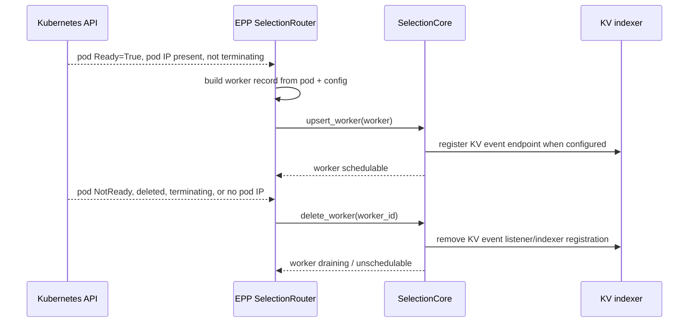
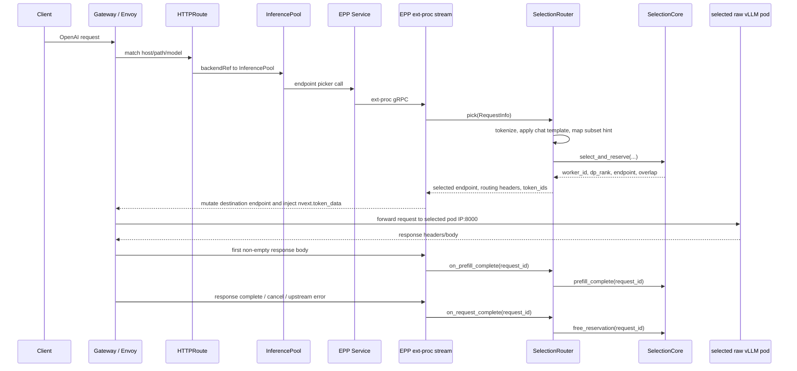
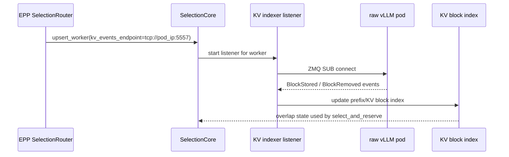

# Router-only EPP: embedded SelectionCore vs original PR train

Date: 2026-07-01

## Scope

This note compares two router-only EPP designs for raw `vllm serve` pods:

- **Embedded SelectionCore branch**: local branch `tmonty12/dyn-router-only-selection`, currently at `2c2e9775ce4`.
- **Original PR train**: PRs [10607](https://github.com/ai-dynamo/dynamo/pull/10607), [10606](https://github.com/ai-dynamo/dynamo/pull/10606), [10611](https://github.com/ai-dynamo/dynamo/pull/10611), [10614](https://github.com/ai-dynamo/dynamo/pull/10614), [10677](https://github.com/ai-dynamo/dynamo/pull/10677), [10679](https://github.com/ai-dynamo/dynamo/pull/10679), plus independent PR [10685](https://github.com/ai-dynamo/dynamo/pull/10685) for the decode-side P/D sidecar.

The original PR train was not fully linear. PR 10685 was stacked on PR 1 (`epp-raw-workers`) and independent of the EPP code stack in PRs 2-6.

## Executive summary

The embedded `SelectionCore` approach is the cleaner aggregated router-only design:

- fewer required env vars,
- no inert Dynamo runtime,
- no `DYN_DISCOVERY_BACKEND=mem` / `DYN_EVENT_PLANE=zmq`,
- no internal KV event republisher,
- atomic select-and-reserve instead of select then best-effort booking,
- worker metadata is explicit at registration time.

The original PR train has broader topology coverage:

- supports disaggregated prefill/decode role partitioning today. The embedded
  SelectionCore EPP should add this subsequently as an incremental feature, not
  a hard architectural addition.
- emits `x-prefiller-host-port`,
- includes a vLLM-specific decode-side sidecar to run NIXL `kv_transfer_params`,
- exposes configurable vLLM KV event topic via EPP env.

So the tradeoff is:

```text
embedded SelectionCore:
  better UX and correctness for aggregated router-only mode

original PR train:
  more complete raw-vLLM on-ramp topology, especially disagg
  more env/config burden and more moving parts
```

## Architecture comparison

| Area | Embedded SelectionCore EPP | Original PR train |
|---|---|---|
| Router implementation | Embeds `dynamo_kv_router::services::selection::SelectionCore` directly in the EPP. | Reuses existing `dynamo_llm::kv_router::{KvRouter, PrefillRouter}`. |
| Runtime dependency | No `Runtime`, no `DistributedRuntime`, no component discovery. | Creates an inert `DistributedRuntime` using `DYN_DISCOVERY_BACKEND=mem` and `DYN_EVENT_PLANE=zmq`. |
| KV event ingestion | Selection core registers per-worker `kv_events_endpoint` and the standalone indexer listener subscribes directly to vLLM ZMQ. | EPP subscribes to vLLM ZMQ, normalizes events, republishes them onto the embedded router's ZMQ event plane, then `KvRouter` consumes them normally. |
| Worker discovery | Kubernetes pod reflector over `POD_NAMESPACE` + `DYN_EPP_POD_SELECTOR`. Ready pods are upserted into `SelectionCore`. | Kubernetes pod reflector over `POD_NAMESPACE` + `DYN_EPP_POD_SELECTOR`. Ready pods are used as scheduler admission sets and as republisher listener targets. |
| Worker registration | EPP builds `WorkerRequest` with endpoint, KV endpoint, block size, optional capacity, `stable_routing_id`, DP rank fields, etc. | Raw workers do not publish `ModelRuntimeConfig`; EPP admits worker IDs into the existing router via `register_workers(...)`. |
| Selection/booking | Single `select_and_reserve(...)` call. Selection and booking are one operation. | Selects decode/prefill, then calls `add_request(...)` as a separate best-effort bookkeeping step. Existing PR comment calls out atomic admission as a TODO. |
| Request lifecycle | EPP calls `prefill_complete(...)` and `free_reservation(...)` on the selection core. | EPP calls existing router bookkeeping: `mark_prefill_complete(...)` and `free_request(...)`. |
| Output progress | `SelectionCore` has `add_output_block(...)`, but EPP does not call it today. | No output progress tracking wired in the train. |
| Disaggregated routing | Not supported today. Aggregated only. | Supported in PR 10679 via role label partitioning, separate prefill/decode routers, and `x-prefiller-host-port`. |
| vLLM P/D transfer | Not implemented. | PR 10685 adds `dynamo-pd-sidecar` to perform vLLM pull-based NIXL `kv_transfer_params`. |
| Multi-EPP coordination | Embedded single-process state; replica sync disabled in EPP config. | Each EPP has its own mem runtime/router/index. PR text calls out cross-EPP load sharing as a gap. |

## Router-only env UX

### Embedded SelectionCore EPP

Required:

| Env var | Meaning |
|---|---|
| `DYN_EPP_MODE=router-only` | Select router-only mode. Current parser also accepts `selection` / `selection-router-only` aliases. |
| `POD_NAMESPACE` | Kubernetes namespace to watch. Inject via Downward API. |
| `DYN_EPP_POD_SELECTOR` | Label selector for raw vLLM pods. |
| `DYN_MODEL_NAME` | Served model name. Also default tokenizer/model artifact source. |
| `DYN_KV_CACHE_BLOCK_SIZE` | Must match vLLM `--block-size`. |

Optional:

| Env var | Default | Meaning |
|---|---:|---|
| `DYN_MODEL_PATH` | `DYN_MODEL_NAME` | HF repo id or local model/tokenizer directory used to build the router-side preprocessor. |
| `DYN_EPP_TARGET_PORT` | `8000` | Raw vLLM OpenAI HTTP port. |
| `DYN_EPP_KV_EVENT_PORT` | `5557` | vLLM ZMQ KV event port. |
| `DYN_EPP_KV_EVENT_REPLAY_PORT` | unset | Proposed optional vLLM ZMQ replay port for gap recovery. Not implemented in current EPP branch. |
| `DYN_VLLM_KV_EVENT_PORT` | unset | Compatibility alias used if `DYN_EPP_KV_EVENT_PORT` is unset. |
| `DYN_USE_KV_EVENTS` | parsed by `KvRouterConfig` | Enables/disables KV events through the normal router config env path. |
| `DYN_ROUTER_USE_KV_EVENTS` | unset | Alias handled by EPP when `DYN_USE_KV_EVENTS` is absent. |
| `DYN_EPP_MAX_NUM_BATCHED_TOKENS` | unset | Worker capacity. Required if queueing/policy config is explicitly enabled. If unset and no explicit queue/policy env is present, EPP disables selection queueing. |
| `DYN_EPP_TOTAL_KV_BLOCKS` | unset | Optional KV capacity metadata for selection service worker record. |
| `DYN_EPP_IS_EAGLE` | `false` | Optional worker metadata for EAGLE-aware routing. |
| `DYN_EPP_SELECTION_INDEXER_THREADS` | `router_event_threads.max(1)` | Selection indexer thread count. |
| `DYN_EPP_RECONCILE_INTERVAL_MS` | `1000` | Pod reflector reconciliation interval. |
| `DYN_EPP_CHAT_TEMPLATE` | unset | Custom chat template file. |
| `DYN_ROUTER_*` | normal router defaults | Router scoring, queueing, policy, and KV-event config parsed by `kv_router_config_from_dynamo_env()`. |
| `DYN_SECURE_SERVING` | `true` | EPP gRPC serving TLS toggle. |

Intentionally not required:

| Env var | Reason |
|---|---|
| `DYN_DISCOVERY_BACKEND` | No Dynamo runtime/discovery is created. |
| `DYN_EVENT_PLANE` | No internal event-plane publisher/subscriber is used. |
| `DYN_EPP_TENANT_ID` | Inline embedded service uses tenant `default`. |
| `DYN_EPP_MODEL_SOURCE` | Replaced by `DYN_MODEL_PATH`. |

### Original PR train EPP

Required for the EPP router-only path:

| Env var | Meaning |
|---|---|
| `DYN_EPP_MODE=router-only` | Select router-only mode. |
| `POD_NAMESPACE` | Kubernetes namespace to watch. |
| `DYN_EPP_POD_SELECTOR` | Label selector for raw vLLM pods. |
| `DYN_MODEL_NAME` | Model id used to build offline preprocessor. |
| `DYN_KV_CACHE_BLOCK_SIZE` | Must match vLLM `--block-size`. |
| `DYN_DISCOVERY_BACKEND=mem` | Required for inert runtime and in-process component discovery. |
| `DYN_EVENT_PLANE=zmq` | Required so the KV republisher and embedded router communicate without NATS. |

Optional in original train:

| Env var | Default | Meaning |
|---|---:|---|
| `DYN_EPP_TARGET_PORT` | `8000` | Raw vLLM OpenAI HTTP port. |
| `DYN_EPP_KV_EVENTS` | `true` | Whether to subscribe to per-pod vLLM KV events. |
| `DYN_EPP_KV_EVENT_PORT` | `5557` | vLLM ZMQ KV event PUB port. |
| `DYN_EPP_KV_EVENT_TOPIC` | `""` | vLLM ZMQ topic. |
| `DYN_EPP_ROLE_LABEL` | unset | Disagg role label key. When set, pods are split by `prefill` / `decode`. |
| `DYN_ENFORCE_DISAGG` | `false` | Fail instead of falling back to aggregated routing when prefill routing fails. |
| `DYN_EPP_EMIT_PREFILLER_HOST_PORT` | `false` | Emit selected prefill endpoint as `x-prefiller-host-port`. |
| `DYN_OVERLAP_SCORE_WEIGHT` | example env | Legacy overlap tuning knob used in example manifests. |
| `DYN_SECURE_SERVING` | `true` | EPP gRPC serving TLS toggle. |

Additional PR 10685 decode-side sidecar env:

| Env var | Default | Meaning |
|---|---:|---|
| `DYN_PD_LISTEN_ADDR` | `0.0.0.0:8000` | Address the sidecar binds. |
| `DYN_PD_DECODE_URL` | `http://127.0.0.1:8001` | Local decode vLLM URL. |
| `DYN_PD_PREFILLER_HEADER` | `x-prefiller-host-port` | Header carrying selected prefiller `host:port`. |
| `DYN_PD_PREFILL_SCHEME` | `http` | Scheme for dialing prefiller. |
| `DYN_PD_TIMEOUT_SECS` | `300` | Upstream timeout. |

## Functionality matrix

| Functionality | Embedded SelectionCore EPP | Original PR train |
|---|---|---|
| Raw vLLM aggregated routing | Yes. Validated with Qwen3-0.6B e2e through gateway. | Yes by design in PRs 2-5. PR text did not include completed GPU e2e evidence. |
| Raw vLLM disaggregated routing | Not yet. This should be added subsequently on top of the same SelectionCore approach; it is not a hard architectural blocker. | Yes by design in PR 10679. |
| Decode-side vLLM NIXL transfer | No. | Yes via PR 10685 `dynamo-pd-sidecar`. |
| Kubernetes Ready filtering | Yes. | Yes. |
| Envoy/Gateway subset hint handling | Yes. Intersects candidate subset with reflected pod IDs. | Yes. Intersects candidate subset with reflected pod IDs and role-specific admission sets. |
| Bodyless requests such as `/v1/models` | Yes. Resolves any Ready reflected backend. | Yes. Resolves any Ready reflected backend. |
| Router-side tokenization | Yes. Uses HF/local artifacts from `DYN_MODEL_PATH` or `DYN_MODEL_NAME`. | Yes. Fetches tokenizer/config using `DYN_MODEL_NAME`. |
| Custom tokenizer/model path | Yes via `DYN_MODEL_PATH`. | Not in the original env contract; model source is `DYN_MODEL_NAME`. |
| Custom chat template | Yes via `DYN_EPP_CHAT_TEMPLATE`. | Not exposed in the original router-only config. |
| vLLM KV events | Yes, direct selection/indexer listener per worker. | Yes, per-pod listener plus KV republisher into embedded router event plane. |
| vLLM KV event topic | SelectionCore has the lower-level ZMQ socket helper needed for topic subscription, but its worker API and current EPP integration do not expose topic config; current listener subscribes with the empty topic. | Yes, exposed through `DYN_EPP_KV_EVENT_TOPIC`. |
| Replay endpoint / gap recovery | SelectionCore/indexer supports a separate `replay_endpoint`, but current EPP hardcodes `replay_endpoint: None`. Needs an optional replay port/env and worker registration plumbing. | Not handled; PR 10611 explicitly calls out dropped events/gaps/replay as a gap. |
| Initial cache recovery | No initial KV dump. Index warms from events observed after subscribe. | Same gap called out in PR 10611. |
| Data parallel workers | Worker API supports DP fields, but EPP hardcodes DP start `0`, size `1`. | Not supported; PR 10611 calls out DP>1 as mis-modeled. |
| Worker capacity metadata | Optional `DYN_EPP_MAX_NUM_BATCHED_TOKENS` and `DYN_EPP_TOTAL_KV_BLOCKS`. | Missing real MRC; scheduler uses defaults/defaulted worker config. |
| Queueing behavior without capacity | Disables default selection queueing unless queue/policy env is explicitly present. | Existing `KvRouterConfig` default queue threshold applies unless disabled; capacity is defaulted/approximate. |
| Atomic booking | Yes: `select_and_reserve`. | No: route selection followed by best-effort `add_request`. |
| Prefill complete tracking | Yes, via `SelectionCore::prefill_complete`. | Yes, via existing router bookkeeping. |
| Request completion/cancel/error freeing | Yes, via `SelectionCore::free_reservation` from common EPP lifecycle. | Yes, via existing router bookkeeping. |
| Decode output progress | Not wired. `SelectionCore::add_output_block` exists but EPP does not call it. | Not wired. |
| Priority hint | Yes: `priority_jump` and `strict_priority`. | Partial: `priority_jump` only in the PR 10679 implementation. |
| Stable routing identity | Partially. EPP sets `stable_routing_id` to pod name. This is stable for the live pod but not across replacement pods. | No stable routing identity; PR 10611 calls this out as a gap. |
| Topology domains / taints / KV transfer policy | Worker API supports fields, but EPP does not populate them. | Not supported; PR 10611 calls topology/taints a gap. |
| Multi-replica EPP shared load | Not solved; replica sync disabled in embedded config. | Not solved; PR 10611 calls out herd risk and need for shared load signaling. |
| Graceful signal cancellation | Not fully solved. Embedded token is cancelled on `SelectionRouter::drop`, but the EPP main loop does not wire SIGINT/SIGTERM into it. | Not clearly solved for EPP top-level shutdown either. Per-pod listeners have cancellation tokens for pod removal. |

## UX impact

### Embedded SelectionCore

The deployer/user mental model is:

```text
EPP watches these pods.
EPP tokenizes with this model/tokenizer source.
EPP routes to these Ready pods.
```

That maps to a small contract:

```text
DYN_EPP_MODE=router-only
POD_NAMESPACE=<downward API>
DYN_EPP_POD_SELECTOR=<raw vLLM selector>
DYN_MODEL_NAME=<served model>
DYN_MODEL_PATH=<optional tokenizer/model source>
DYN_KV_CACHE_BLOCK_SIZE=<vLLM block size>
```

No user needs to understand why an "inert runtime" exists. The EPP owns all internal selection state directly.

The sharp edges are:

- aggregated only today;
- capacity fields must still be user-supplied for accurate queue/load behavior;
- `DYN_ROUTER_QUEUE_THRESHOLD=None` semantics are still awkward because EPP peeks at raw env presence when deciding whether `DYN_EPP_MAX_NUM_BATCHED_TOKENS` is required;
- no EPP/worker-API surface for KV-event topic selection yet; SelectionCore has the lower-level socket helper needed to support it;
- no EPP surface for vLLM replay endpoints yet; SelectionCore has the field, but EPP does not populate it;
- shutdown token is not wired to process signals.

### Original PR train

The deployer/user mental model is more complex:

```text
EPP runs a fake/inert Dynamo runtime.
EPP republishes vLLM KV events onto that fake runtime's event plane.
The existing KvRouter subscribes as if workers were Dynamo workers.
For disagg, EPP emits a prefill header and a decode-side sidecar runs vLLM NIXL transfer.
```

That required users to set:

```text
DYN_DISCOVERY_BACKEND=mem
DYN_EVENT_PLANE=zmq
DYN_EPP_KV_EVENTS=true
DYN_EPP_KV_EVENT_PORT=5557
DYN_EPP_KV_EVENT_TOPIC=<topic or empty>
```

Those settings are implementation plumbing, not really user intent. The benefit is that the original train reuses the production `KvRouter`/`PrefillRouter` stack and gets disaggregated behavior sooner.

The sharp edges are:

- more moving pieces: EPP, mem runtime, ZMQ event plane, republisher, optional P/D sidecar;
- no atomic selection-plus-booking;
- missing real MRC means defaults for capacity, DP, stable routing identity, topology, and taints;
- raw ZMQ PUB/SUB gaps remain: no initial cache state, no durable replay, slow-joiner behavior;
- PR 10685 sidecar is vLLM-wire-shape-specific and must be pinned to compatible vLLM versions.

## SelectionCore EPP architecture

### Kubernetes resource model

| Resource | Required for runtime-free EPP | Purpose |
|---|---|---|
| `GatewayClass` | Usually pre-existing | Owns the Gateway controller implementation, for example `agentgateway`. |
| `Gateway` | Yes, often shared | Hosts the HTTP listener and accepts `HTTPRoute` attachments. The E2E used a pre-existing `agentgateway-system/inference-gateway`. |
| Workload namespace | Yes | Holds the EPP, raw workers, `InferencePool`, and `HTTPRoute`. The `Gateway` may live in another namespace if `allowedRoutes` permits it. |
| `HTTPRoute` | Yes | Matches host/path/model headers and forwards to an `InferencePool` backendRef. |
| `InferencePool` | Yes | Selects raw vLLM worker pods by label, defines target port 8000, and references the EPP Service as `endpointPickerRef`. |
| EPP `Service` | Yes | ClusterIP target for Gateway ext-proc calls; exposes EPP gRPC on 9002. |
| EPP `Deployment` | Yes | Runs the Rust ext-proc server in `DYN_EPP_MODE=router-only`; `SelectionRouter` wraps `SelectionCore` and connects Gateway requests, tokenization, pod discovery, and lifecycle updates to the router core. |
| EPP `ServiceAccount` | Yes | Identity used by the EPP pod. |
| EPP `Role` / `RoleBinding` | Yes | Grants `get/list/watch` on pods in the watched namespace. The E2E also granted `get/list/watch` on `InferencePool`. |
| vLLM `Deployment` | Yes | Runs raw `vllm serve` with OpenAI HTTP on 8000, prefix caching enabled, matching `--block-size`, and optional ZMQ KV events. |
| vLLM `Service` | Optional but useful | Declares HTTP/KV ports and gives admins a stable service handle; current EPP selection uses pod IPs from the reflector, not service load balancing. |
| Image pull secret / HF token secret | Environment-dependent | Needed only when images/models require private registry or Hugging Face auth. |


`SelectionRouter` is the EPP-side wrapper around `SelectionCore`. The ext-proc server deals with Envoy protocol details; `SelectionRouter` translates Gateway metadata, OpenAI request bodies, tokenization output, pod readiness, and lifecycle events into `SelectionCore` calls. `SelectionCore` owns the worker catalog, KV index, scheduling, and reservation accounting.


## Worker discovery flow



Discovery is reconciliation from the Kubernetes pod watch into the selection catalog.

Ready/add path:

1. A raw vLLM pod matching `DYN_EPP_POD_SELECTOR` becomes Ready with a pod IP.
2. EPP builds a worker record from pod name/IP plus router-only config: `worker_id`, HTTP endpoint, optional KV-event endpoint, model name, block size, capacity fields, and `stable_routing_id=pod_name`.
3. EPP calls `SelectionCore::upsert_worker`.
4. SelectionCore makes the worker schedulable and registers the KV-event listener when `kv_events_endpoint` is present.

Remove path:

1. A pod becomes NotReady, starts terminating, loses its pod IP, or disappears.
2. EPP no longer includes that worker in desired state.
3. EPP calls `SelectionCore::delete_worker`.
4. SelectionCore drains/removes scheduler state and cleans up the indexer registration.


## Request lifecycle



Request flow:

1. Gateway sends the request to the EPP ext-proc stream before forwarding to a backend.
2. `SelectionRouter` tokenizes the OpenAI body, applies the chat template, and turns any Gateway subset hint into allowed worker IDs.
3. `SelectionRouter` calls `SelectionCore::select_and_reserve`, which chooses a worker and books the reservation atomically.
4. EPP returns the selected endpoint to Gateway, adds Dynamo routing headers, and injects `nvext.token_data` into the request body.
5. On the first non-empty response body chunk, EPP calls `SelectionCore::prefill_complete`.
6. On response completion, client cancel, upstream error, or ext-proc stream teardown, EPP calls `SelectionCore::free_reservation`.

Decode output progress is not wired today. `SelectionCore::add_output_block` exists, but the EPP does not parse response token progress yet.

The ext-proc protocol must be configured as full-duplex streamed body mode because the EPP cannot choose a backend until it has the request body and token IDs. The validation and failure message are in `deploy/inference-gateway/ext-proc/src/server.rs:583`.


## KV-event indexing path



This is the main reason to prefer the SelectionCore path over a generic EPP load balancer:

- it reuses the Dynamo KV index and scheduler directly;
- it avoids an inert `Runtime` and internal event-plane republisher;
- it gives atomic select-and-reserve semantics;
- it keeps raw vLLM workers as ordinary Kubernetes pods, with readiness reflected into the worker catalog.

Current gaps:

| Gap | Why it matters | Likely next step |
|---|---|---|
| Disaggregated P/D topology | Needed for raw vLLM P/D deployments and `x-prefiller-host-port`. | Add role-aware worker records and prefill/decode selection on top of `SelectionCore`. |
| KV event topic config | Needed if vLLM deployments use non-empty ZMQ topics. | Add topic metadata to SelectionCore/indexer worker registration instead of EPP-only plumbing. |
| Replay endpoint | Needed for ZMQ gap recovery. | Add optional replay port/env and populate `WorkerRequest.replay_endpoint`; do not reuse the live KV event port. |
| Multi-EPP state sync | Multiple EPP replicas currently keep independent in-memory reservations and KV indexes. | Decide between single-replica EPP for correctness, replica sync, or shared external selection service. |
| Decode output progress | Better load accounting during long generations. | Parse response token progress and call `SelectionCore::add_output_block`. |
| Signal-driven shutdown | Current token is cancelled on router drop, but process signals are not wired directly into the selection token. | Wire SIGINT/SIGTERM into EPP shutdown path. |
