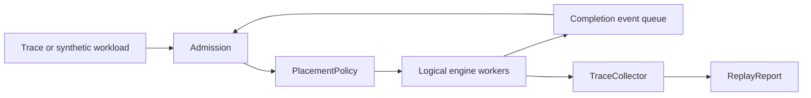

> [!WARNING]
> **Experimental.** AI Simulate replay APIs, schemas, and reports can change without a standard
> deprecation period.

The `aisimulate_core::replay` module runs a workload against one or more simulated engines without
starting worker processes or runtime services. `Replayer<C>` advances a logical clock, coordinates
logical workers, applies an injected composition, and records canonical request and token timing.

## Replay Flow

The Replayer does not sleep. It advances the logical clock to the next request arrival, engine-pass
completion, transfer completion, worker-ready event, or scaling tick. A monotonic sequence number
breaks ties between events at the same timestamp so repeated runs remain deterministic.

## Logical Workers

Each logical worker wraps one generalized engine and tracks whether a pass is active. Aggregated
replay uses one worker pool for single-worker, multi-worker, and attention-DP configurations.
Disaggregated replay uses separate prefill and decode pools with a modeled handoff between them.

Worker count refers to logical engine replicas. An attention-DP worker can contain multiple scheduler
ranks while retaining one worker identity for placement and scaling.

## Aggregated Runtime

The aggregated event loop repeats these operations:

1. Advance to the next meaningful timestamp.
2. Apply every completion event scheduled for that time.
3. Admit newly available requests or closed-loop concurrency backfill.
4. Ask the composition to place admitted requests.
5. Start passes on ready workers.
6. Push the resulting completion events into the queue.

Single-worker and multi-worker runs use this same path. Attention-DP passes become visible at the
slowest rank's completion boundary.

## Disaggregated Runtime

Disaggregated replay models distinct prefill and decode pools. A request moves through prefill,
modeled KV handoff, and decode while sharing one logical clock and event queue. The public report
attributes Time To First Token (TTFT) to the full path, including prefill queueing, prefill compute,
handoff, and decode admission.

Disaggregated attention-DP is rejected until the replay contract carries rank-aware handoff identity.
Rejecting the topology prevents an aggregate approximation from hiding unsupported behavior.

## Placement and Scaling

`ReplayComposition` supplies placement and optional scaling policies. AI Simulate includes synchronous
round-robin placement and no scaling. A composition can instead consume neutral engine observations,
queue admission, release placements, and add or remove logical workers at settled event boundaries.

The core contracts do not import Dynamo Router or Planner types. Dynamo implements those integrations
outside AI Simulate and injects them through the same composition boundary.

## Workload Admission

Replay supports two admission styles:

- Trace mode preserves request timestamps and dependency timing from the selected trace format.
- Closed-loop mode keeps up to `--replay-concurrency` requests active and admits replacement work when
  a request completes.

Synthetic workloads can use closed-loop concurrency, a fixed arrival interval, or a Poisson request
rate. Multi-turn sessions release the next turn only after the previous turn and configured tool or
inter-turn delay complete.

## Reports

`TraceCollector` records request arrival, first-token, subsequent-token, and terminal timing. The
canonical `ReplayReport` contains:

- request and token counts
- virtual duration and wall-clock execution time
- request and output-token throughput
- TTFT, Time To Second Token (TTST), Time Per Output Token (TPOT), Inter Token Latency (ITL), and
  end-to-end latency distributions
- prefix-cache reuse and optional service-level agreement (SLA) goodput
- optional per-request records and execution evidence

Use the [AI Simulate Replay CLI Reference](cli-reference.md) for workload, topology, SLA, and output
arguments.

## Dynamo Integration Boundary

Dynamo extends the Replayer without changing its deterministic loop. Dynamo-owned adapters provide KV
router placement, Planner scaling, Router-specific observations, and compatibility entrypoints.
Online replay and Live Mocker remain Dynamo runtime paths because they require worker registration,
transport, discovery, event publication, cancellation, or production metrics.
