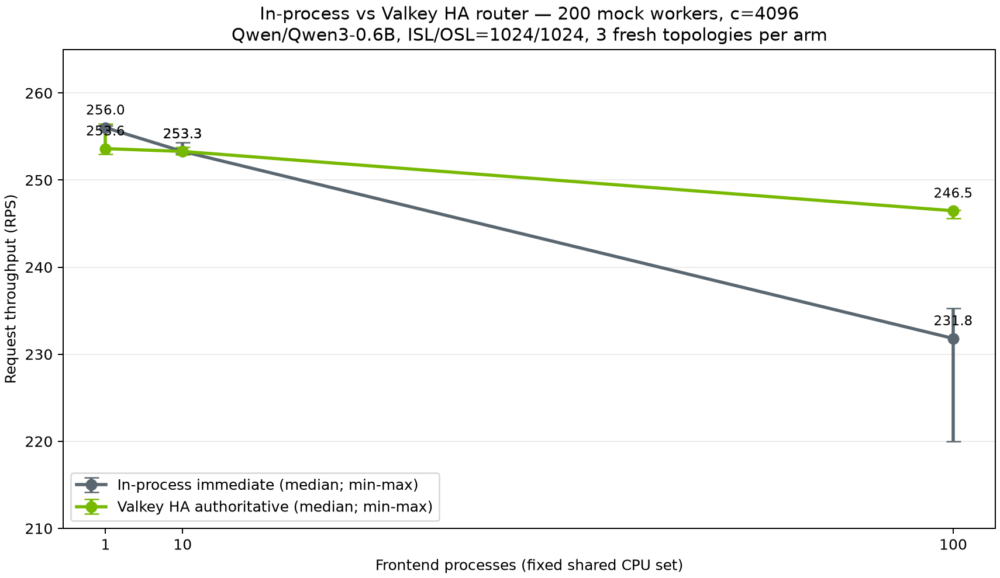

<!--
SPDX-FileCopyrightText: Copyright (c) 2026 NVIDIA CORPORATION & AFFILIATES. All rights reserved.
SPDX-License-Identifier: Apache-2.0
-->

# Exact-tip Valkey router A/B

This directory contains compact evidence for the policy-matched in-process
versus Valkey HA router comparison at revision
`c6f546b223cfc1ffe15e316948c06886b4839373`. Raw prompts, record exports, and
process logs are intentionally omitted.



## Results

Each value is the median of three fresh topologies per arm.

| Frontends | In-process RPS | Valkey HA RPS | Valkey delta | Peak Valkey primary clients |
| ---: | ---: | ---: | ---: | ---: |
| 1 | 256.02 | 253.61 | -0.94% | 1,209 / 10,000 |
| 10 | 253.29 | 253.29 | +0.00% | 1,142 / 10,000 |
| 100 | 231.81 | 246.48 | **+6.32%** | 2,001 / 10,000 |

At 100 frontends, Valkey improved output throughput by 6.33%, p50 TTFT by
7.86%, p95 TTFT by 6.73%, p50 request latency by 8.46%, p95 request latency by
10.91%, p50 ITL by 10.79%, and p95 ITL by 51.53%. Lower latency is better.
Average ISL was 1,024.001 tokens in both arms; average OSL was 1,049.612 for
in-process and 1,049.640 for Valkey.

Valkey retained more throughput as frontend fan-out increased. Its median RPS
fell 2.81% from one to 100 frontends, while the in-process baseline fell 9.45%.
This is fixed-host fan-out, not linear horizontal scaling: all frontends shared
eight CPU cores and the worker/client resources did not increase.

## Method

- Model and tokenizer: `Qwen/Qwen3-0.6B`.
- Topology: 200 logical mock workers in 20 processes, DP size 1, with 1, 10,
  or 100 frontend processes.
- Workload: 4,096 warmup plus 16,384 measured requests per sample, closed-loop
  concurrency 4,096, unlimited request rate, requested ISL/OSL 1,024/1,024.
- CPU sets: Valkey `0-1`, frontends `2-9`, mockers `10-19`, aiperf `20-23`.
- Baseline: immediate in-process routing, policy-matched to avoid comparing
  different admission policies.
- Candidate: authoritative Valkey admission, one module-loaded primary and one
  replica, `WAIT 1`, AOF `everysec`, and normal persistence maintenance.
- Scheduling: three repetitions per arm in alternating forward/reverse order.
  All samples used the same generated input SHA-256 in `evidence.json`.

All 18 samples completed 16,384/16,384 measured requests with zero request
errors or validation failures. Every one of the nine Valkey samples registered
200/200 logical workers, ended with zero active admissions, retained an online
replica, and reported no teardown integrity failures.

The harness recorded `git.dirty=true` because its untracked output directory
was already inside the worktree when provenance was sampled. Every campaign
records the same source revision and matching harness, extension, module,
Valkey, aiperf, and input hashes. `evidence.json` also records SHA-256 values for
the omitted raw manifests and summaries so retained raw copies can be audited.

## Startup hardening found by the campaign

An earlier excluded 100-frontend attempt exposed a burst-startup failure:
several workers exhausted the five-second primary-read timeout while acquiring
their registration generation. The implementation now keeps request-path
primary reads on the five-second fail-fast budget but gives the replay-safe
startup generation read a bounded 30-second retry budget. The corrected
campaign then registered 200/200 workers in all nine Valkey samples across the
three frontend counts.

## Reproduction

Run the benchmark once for each frontend count, changing `COUNT` and the output
directory. Use a release Dynamo Python extension.

```bash
DYN_LOG=warn DYNAMO_GPU_PARALLEL_DOWNLOADS_READY=1 \
python benchmarks/router/valkey_router_aiperf.py \
  --arm matched --runs 3 \
  --output-dir bench/results/valkey-exact-tip-ab-20260709/frontends-COUNT \
  --aiperf /home/biswaranjanp/dev/dynamo_main/dynamo/bin/aiperf \
  --model Qwen/Qwen3-0.6B --tokenizer Qwen/Qwen3-0.6B \
  --frontend-count COUNT --logical-mocker-workers 200 --mocker-processes 20 \
  --mocker-data-parallel-size 1 --requests 16384 --warmup-requests 4096 \
  --concurrency 4096 --isl 1024 --osl 1024 --event-plane nats \
  --etcd-endpoints http://127.0.0.1:2379 --nats-server nats://127.0.0.1:4222 \
  --valkey-server /home/biswaranjanp/dev/valkey/src/valkey-server \
  --dynkv-module "$PWD/lib/kv-router/valkey-module/dynkv.so" \
  --valkey-connection-pool-size 64 --valkey-event-batching-timeout-ms 1 \
  --valkey-authoritative-admission --frontend-cpus 2-9 --mocker-cpus 10-19 \
  --valkey-cpus 0-1 --aiperf-cpus 20-23 --aiperf-timeout-seconds 1800 \
  --aiperf-request-timeout-seconds 300 --tcp-request-timeout-seconds 300 \
  --ready-timeout 300 --replica-ready-timeout 60 --settle-seconds 2
```

Use `COUNT=1`, `10`, and `100`. These closed-loop achieved rates are not an
open-loop capacity ceiling and do not measure model compute, real GPU KV reuse,
Kubernetes networking, or NIXL transfer.
