# Cascade-3x — 3-setup comparison

Three paired runs against the same workload (mooncake-trace replay at concurrency 24), same engine config, same image. The variables are two orthogonal resilience features.

## Experiment

- **Cluster**: nv-prd-dgxc nscale, 3 × B200 (tep8x1 each)
- **Workload**: aiperf 0.7.0 mooncake-trace replay (~200K input tokens, multi-turn convos), `--concurrency 24 --benchmark-duration 1800`
- **Cascade pattern**: 3 workers killed 60 s apart at T+600/660/720 s (kill recipe: `kill -9` of MPI children → MPI_ABORT → container exit), then ~15 min recovery observation
- **Image**: `dynamoci.azurecr.io/ai-dynamo/dynamo:failover-v2-675ae24fe21-trtllm-runtime` (TRT-LLM rc11, gms-refactor)
- **Engine config**: chunked_prefill on, autotuner on, max_batch=128, fp8 KV, EAGLE3 spec decode, MoE backend=TRTLLM, `free_gpu_memory_fraction=0.75`

## Setups

| Setup | Failover | Migration | Per-setup README |
|---|---|---|---|
| [`baseline`](baseline/) | OFF | OFF | [README](baseline/README.md) |
| [`failover`](failover/) | ON (PR #8572) | OFF | [README](failover/README.md) |
| [`failover-mig`](failover-mig/) | ON (PR #8572) | ON (`--migration-limit 10`) | [README](failover-mig/README.md) |

## Headline metrics

| Setup | Total | Success | True fail | TTFT ms (avg / p50 / p90) | ITL ms (avg / p50 / p90) | Tok/s/user (avg / p50 / p90) |
|---|---|---|---|---|---|---|
| baseline | 2,439 | 1,806 | 633 | 1,549 / 961 / 2,890 | 12.45 / 10.90 / 18.31 | 96.5 / 91.8 / 142.3 |
| failover | 2,074 | 1,985 | 89 | 1,322 / 935 / 2,558 | 13.41 / 12.88 / 19.52 | 84.8 / 77.6 / 129.8 |
| failover-mig | 2,048 | 1,987 | 61 | 1,309 / 911 / 2,572 | 13.50 / 12.97 / 19.90 | 84.4 / 77.1 / 126.1 |

## Charts — baseline vs failover-mig

The two endpoints of the comparison. Each chart category, baseline first then failover-mig.

### Cumulative successes
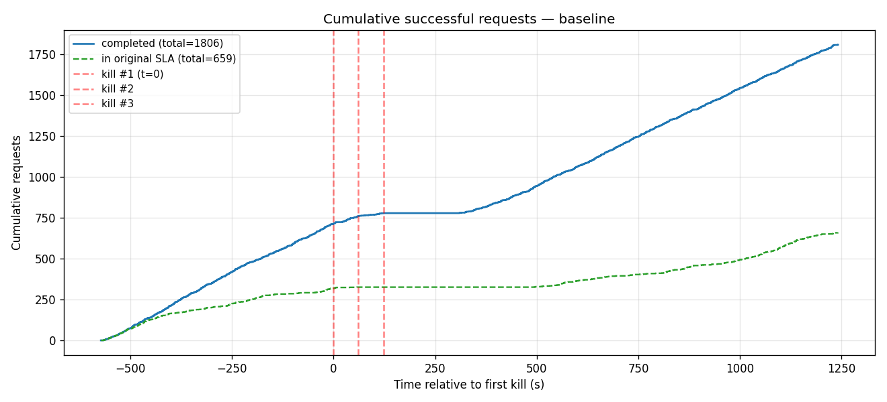
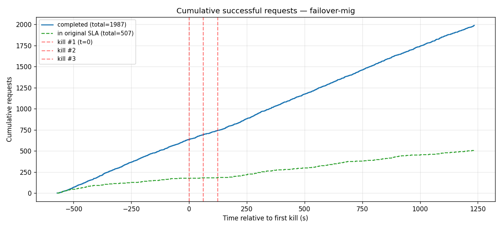

### Request outcome over time
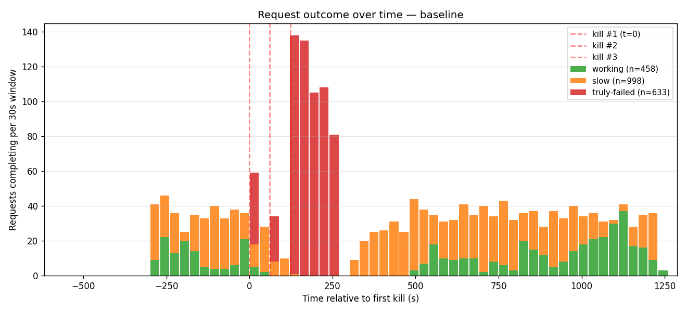
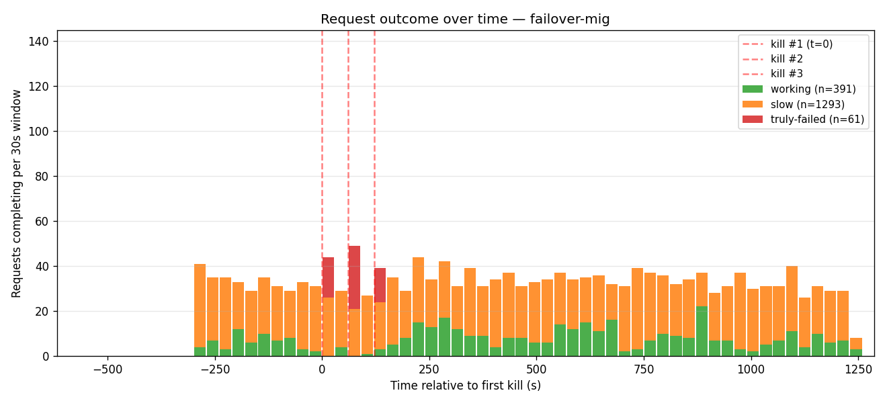

### Per-user decode rate
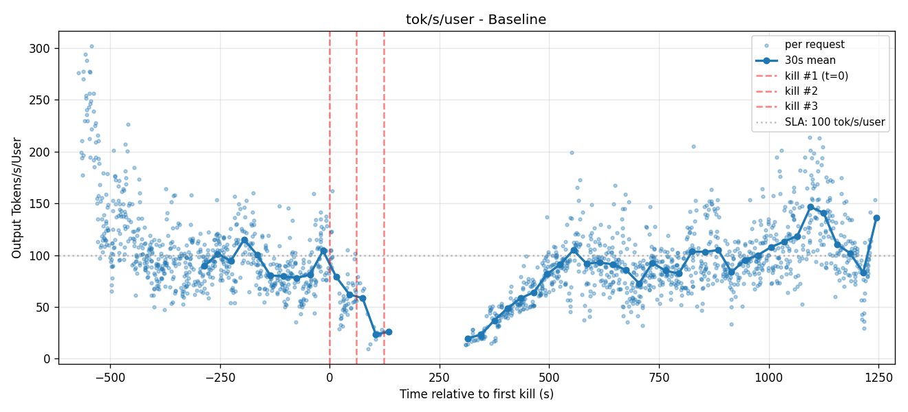
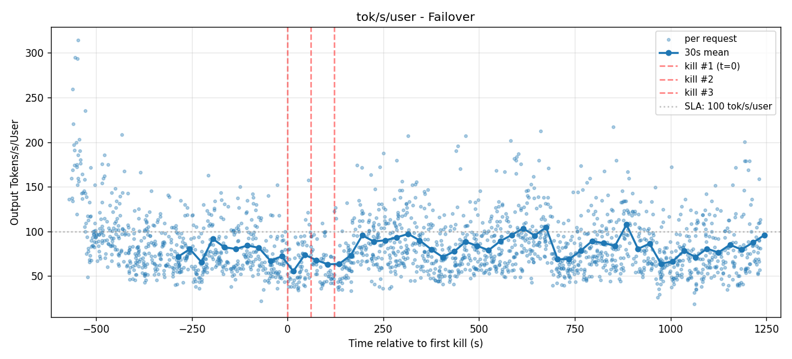

### TTFT — 30 s mean
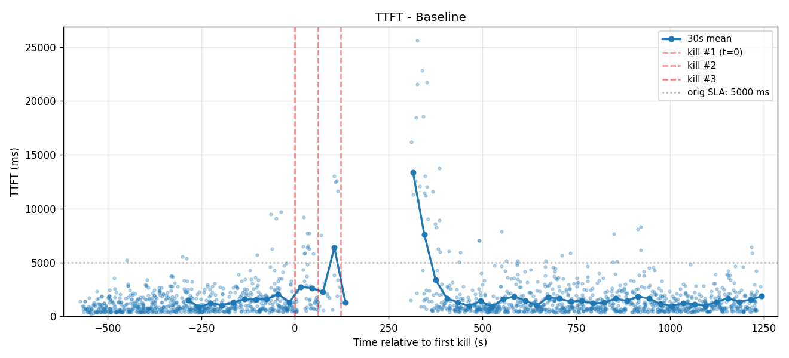
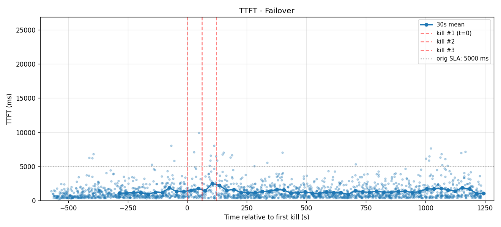

### TTFT scatter
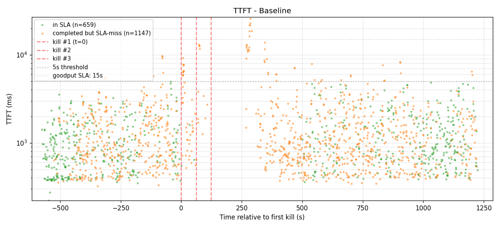
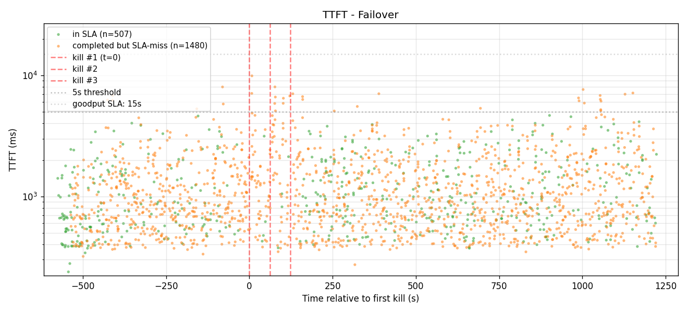

### ITL — 30 s mean
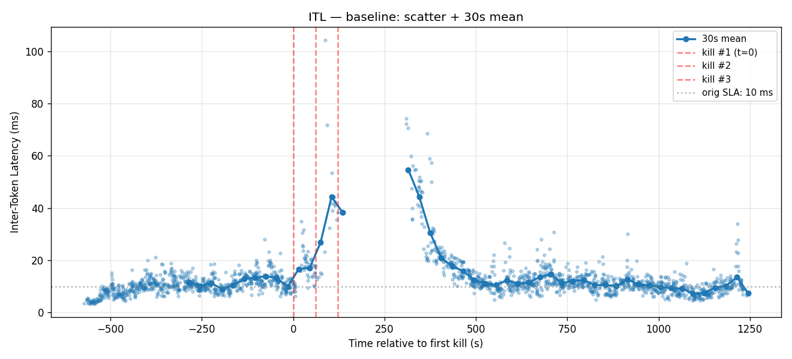
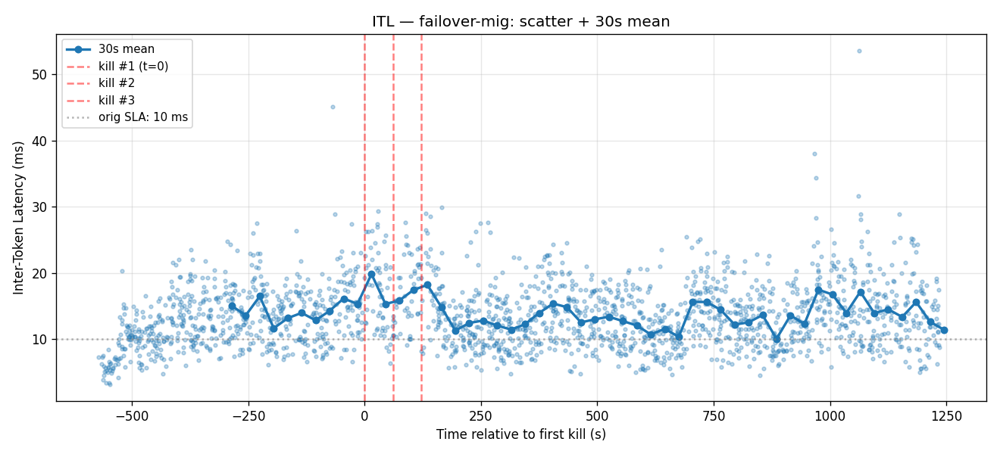

## Files

```
20260501T205312Z-cascade-3x/
├── README.md                      # this file
├── baseline/
│   ├── README.md                  # per-setup metrics + charts
│   └── charts/                    # 6 PNGs in the order shown above
├── failover/                      # same shape
└── failover-mig/                  # same shape
```

Raw aiperf data, kill plans, run logs, DGDs, and harness scripts are kept on the internal benchmark branch.

## Methodology

- **Workload**: aiperf 0.7.0 with `--custom-dataset-type mooncake_trace` against an internal long-context trace (50–200 K input tokens per request, multi-turn conversations).
- **Concurrency**: 24 (chosen so per-worker load matches earlier single-worker demos at c=8).
- **Kill mechanism**: `kubectl exec -- kill -9 $(pgrep -f "orted|mpi4py.futures.server")` against the worker pod's `main` (baseline) or `engine-0` (failover variants) container. MPI children dying cascades to parent python via `MPI_ABORT`.
- **True failure**: HTTP non-200, OR HTTP 200 with truncated stream (no `[DONE]`/no `output_sequence_length` AND chunks > 5), OR HTTP 200 with no completion at all.
- **Latency metrics** (TTFT, ITL, tok/s/user): aiperf's per-request aggregates over the full 30-min run including the cascade window.
