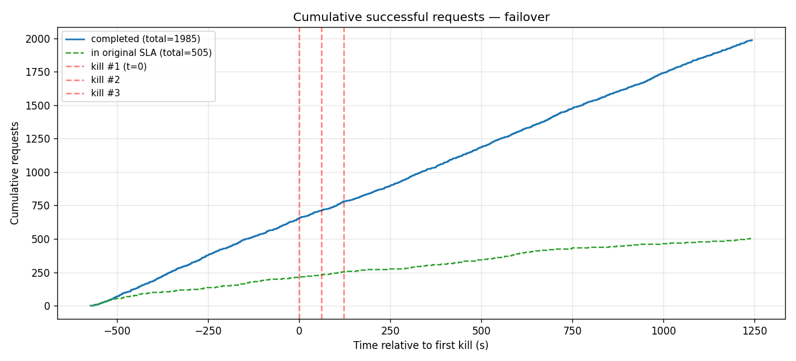
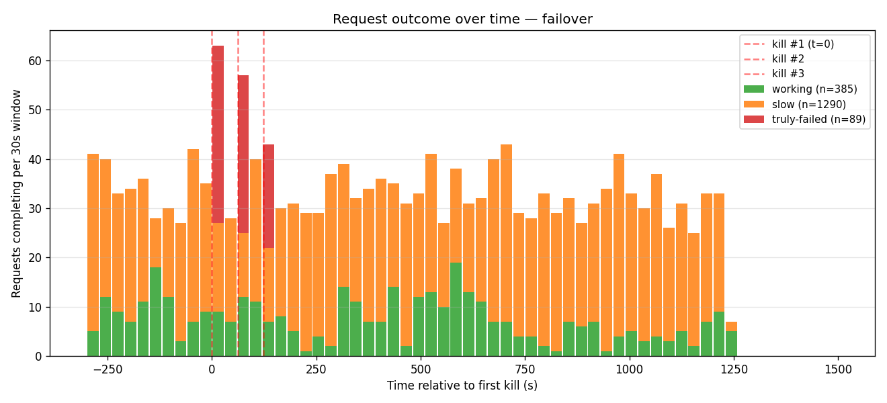
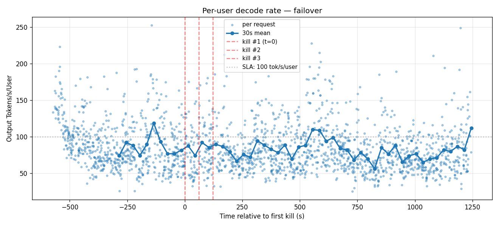
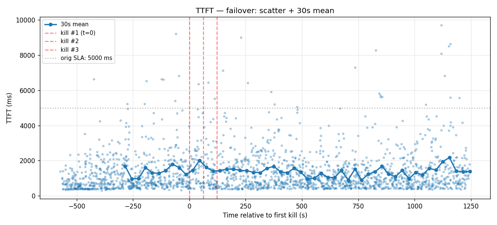
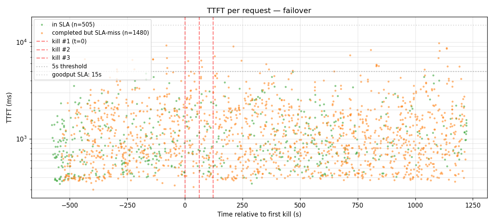
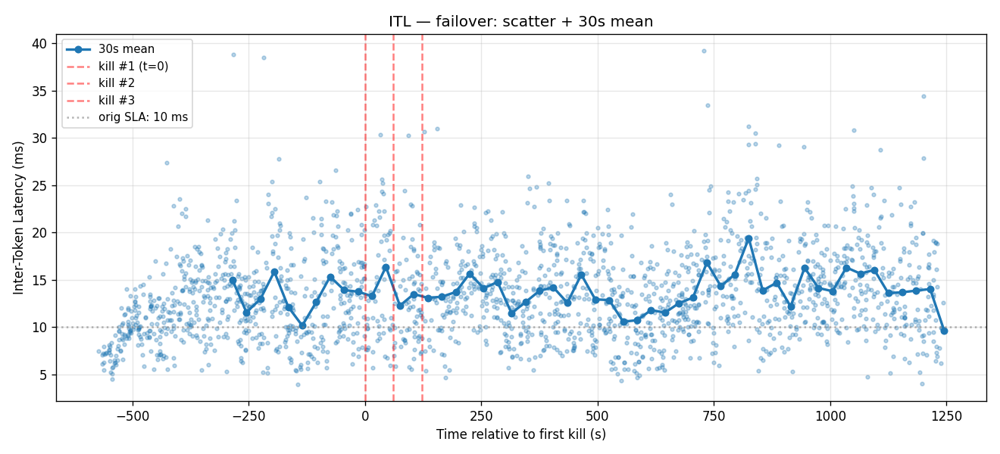

# failover

3-worker GMS shadow-failover (PR #8572). Each pod runs `engine-0` (active primary) + `engine-1` (prewarmed standby) sharing the same 8 GPUs via the GPU Memory Service. On primary death, engine-1 acquires the failover lock and promotes to active in seconds with prewarmed CUDA graphs and KV state.

## Configuration

- **Date**: 2026-05-01
- **Cluster**: nv-prd-dgxc nscale, 3 × B200 (tep8x1)
- **Workers**: 3 replicas across DRA nodes `tx5tk`, `d6dn5`, `l9nsv`
- **Image**: `dynamoci.azurecr.io/ai-dynamo/dynamo:failover-v2-675ae24fe21-trtllm-runtime`
- **Failover**: ON (`--gms-shadow-mode --load-format gms`) · **Migration**: OFF
- **Engine**: chunked_prefill on, autotuner on, max_batch=128, fp8 KV, EAGLE3 spec decode, MoE backend=TRTLLM (CUTLASS path crashes the standby's GMS materialize), `free_gpu_memory_fraction=0.75`
- **aiperf**: `--concurrency 24 --benchmark-duration 1800 --concurrency-ramp-duration 60`

## Cascade timeline

| Event | Wall-clock (UTC) | Pod | Node | Container |
|---|---|---|---|---|
| aiperf start | 22:45:20 | — | — | — |
| Kill #1 (T+600 s) | 22:55:20 | `kimi-failover-3x-0-trtllmworker-bxtmr` | tx5tk | `engine-0` |
| Kill #2 (T+660 s) | 22:56:21 | `kimi-failover-3x-0-trtllmworker-nh2zq` | d6dn5 | `engine-0` |
| Kill #3 (T+720 s) | 22:57:22 | `kimi-failover-3x-0-trtllmworker-w6crv` | l9nsv | `engine-0` |
| aiperf wraps | 23:15:40 | — | — | — |

Kill recipe: `kubectl exec -- kill -9 $(pgrep -f "orted|mpi4py.futures.server")` against the worker pod's `engine-0` container. MPI children dying cascades to parent python via `MPI_ABORT`, engine-0 exits → engine-1 promotes.

## Headline metrics

| Metric | Value |
|---|---|
| Total requests | 2,074 |
| Successes (HTTP 200) | 1,985 |
| True failures | 89 |
| TTFT (ms) — avg / p50 / p90 | 1,322 / 935 / 2,558 |
| ITL (ms) — avg / p50 / p90 | 13.41 / 12.88 / 19.52 |
| Tok/s/user — avg / p50 / p90 | 84.8 / 77.6 / 129.8 |

## Charts

### Cumulative successes

### Request outcome over time

### Per-user decode rate

### TTFT — 30 s mean

### TTFT scatter

### ITL — 30 s mean

Raw artifacts (per-request records, kill plans, run logs, DGDs, harness scripts) are kept on the internal benchmark branch.
