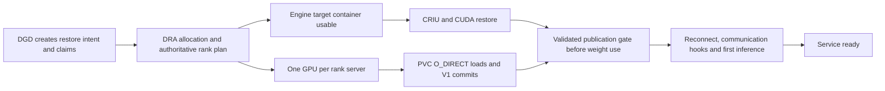

<!-- SPDX-FileCopyrightText: Copyright (c) 2026 NVIDIA CORPORATION & AFFILIATES. All rights reserved. -->
<!-- SPDX-License-Identifier: Apache-2.0 -->
# Minimizing DGD Snapshot + GMS restore overhead

The goal is to remove orchestration dependencies that do not protect correctness.
GMS V1 weights and the quiescent engine checkpoint can restore concurrently; the
engine must not import/use weights until every required rank's exact allocation
set is published and validated. This requires the captured wake-time gate and
quiescent external-import contract used by this prototype.

The approximate latency after allocation is the maximum of the engine branch and
GMS branch, plus the final reconnect/inference work. Making one branch earlier
may increase contention or merely move its wait to the join; only full readiness
measurements establish a win.

## What the current code already does

- [Restore admission](../../deploy/operator/internal/webhook/mutation/pod_checkpoint_restore_handler.go)
  resolves and pins the source snapshot and builds the Snapshot restore contract
  before the pod is created. A production DGD does not need the benchmark's late
  annotation patch after every container becomes Running.
- [Native GMS sidecar](../../deploy/operator/internal/gms/gms.go) deliberately has
  no startup probe. Kubelet starts clients once the sidecar process has started;
  clients retry socket connection. Loading weights must not become a blocking
  init container or sidecar startup-probe condition for the restore target.
- Snapshot's controller accepts Pending restore pods and polls the node runtime
  for the target container. The new prototype fix also consumes informer status
  updates during that poll, checking the pod UID before accepting a container ID.
- [Inter-pod GMS startup ordering](../../deploy/operator/internal/dynamo/graph.go)
  adds Grove StartsAfter edges. However,
  [current compatibility validation](../../deploy/operator/internal/checkpoint/compatibility.go)
  rejects Snapshot + InterPod GMS. Changes to those edges are future integration
  work, not a fix to an already-supported inter-pod snapshot deployment.

## Concrete integration sequence

1. **Keep restore intent on the creation request.** Include immutable snapshot
   UID/content identity and captured rank layout. Resolve source metadata before
   launch and preserve compatibility checks. Avoid a post-start controller or
   external kubectl round trip solely to authorize already-planned restoration.
2. **Resolve one rank plan after DRA allocation.** Join named requests to UUIDs,
   bind the plan to the claim UID/allocation and restore generation, and deliver
   the same plan to Snapshot and rank loaders. Use watched allocation state and
   node-local atomic publication; do not add ConfigMap projection polling to the
   critical path. CUDA remapping still waits for a validated destination plan.
3. **Start the engine target as soon as its prerequisites exist.** It needs its
   sandbox, IP, mounts and GPU assignment. It does not need every GMS process to
   report Running or Ready. The node agent should resolve the target via CRI and
   consume Kubernetes status updates as they arrive. Physical runtime identity
   matters in a vcluster; do not assume its virtual pod name matches CRI labels.
4. **Keep rank startup narrow.** Render one named GPU request per GMS container,
   local cuda:0, the captured socket identity, and the matching rank artifact.
   Retain the measured fused server/loader and NUMA settings as candidate knobs.
   Native sidecar versus regular-container lifecycle and ordering need an explicit
   design when expanding the current single GMS sidecar to multiple rank servers;
   eight serialized startup probes would reintroduce delay.
5. **Gate weight use, not the whole restore.** Distinguish process-started,
   socket-bound, allocation-published and inference-ready states. Validate UUIDs,
   manifest identity, allocation IDs/sizes and generation before releasing the
   captured engine. A socket or stale marker alone is insufficient.
6. **Prepare infrastructure, and account for it.** Reuse mounted PVC transports
   and cached images on a warm node where available. Keep GMS and PageBroker
   transport isolation as measured. No RAM staging of model weights. Publish
   separate warm/cold-node results, and include initial DRA allocation when
   reporting DGD-create-to-ready; this prototype's pod timer starts after claim
   allocation.

For future inter-pod support, first identify which Grove ordering edges establish
placement/shared-claim prerequisites and which merely wait for weight readiness.
Only the latter can move to the restore-time publication gate. Removing all
StartsAfter dependencies without replacing those contracts would be incorrect.

## Instrumentation required for the DGD path

Record DGD reconcile/admission, pod create request/acceptance, scheduling, DRA
allocation/preparation, sandbox/IP/mount readiness, target container start,
agent eligibility/dispatch, CRIU start/end, CUDA phases, per-rank GMS init/load/
commit, publication validation, engine reconnect and first correct inference.
Attach snapshot/claim/pod UIDs and rank-plan generation to the trace. Report each
wait's reason. Use watches/notifications for lifecycle events instead of periodic
remote polling; pod readiness probes should observe the final state, not order
otherwise-independent work.

This document is an integration plan. The implemented changes in this series are
the benchmark's creation-time request, pre-creation rank-map check, extra timing
records, and Snapshot's informer-progress fix. A full DGD deployment with this
rank-sharded loader contract has not yet been benchmarked.

## Remaining waits exposed by creation-time dispatch

The first fixed-agent early run started its main container around 2 s after
creation, but the restore operation began at 5.102 s. The vcluster's published container
status arrived after rank-container startup; direct runtime lookup uses different
pod identities on the virtual and host sides. A native DGD deployment should be
measured with its actual CRI identity rather than inheriting this test harness's
translation assumption. The informer fix removes the 30-second stale-status
failure mode, not all kubelet/vcluster status propagation.

The captured test app also polls Snapshot's completion sentinel every second.
Reducing that wait requires a new capture or a supported restore-notification
hook; changing the replacement container environment cannot rewrite the captured
loop. Production should prefer restore-completion notifications, retain the late
GMS publication gate, and measure first successful inference separately from
readiness-probe and observer latency. There is no benefit in relabeling the
measurement origin to hide these waits.

The three-pair follow-up reduced first-GMS-start→restore-operation-start from 4.487 to
2.629 s. Median pod readiness fell from 28.082 to 26.377 s, but mean readiness was
28.076 versus 28.619 s because a real pre-application startup outlier remains in
the sample. Thus dispatch work is measurable, while an end-to-end mean win is
not established. See RESULTS.md for all phase means and diagnostic limitations.

The Snapshot agent daemon and persistent PageBroker GPU engine are already Ready
before pod creation in these restore measurements. Historical `create_to_agent_s`
means pod creation to the per-request external restore operation, not daemon
startup. Container discovery polls every 50 ms with up to one second per CRI
lookup. General resync/reconciliation frequency is not an established cause of
the several-second dispatch interval. The nine-trial
[follow-up](TUNED-RESTORE.md) records dual API watches: running main status was
observed about 3.25–4.15 s after container start, with no comparable extra delay
between host and virtual status. Correcting virtual-to-host runtime identity
is the next targeted change; faster reconciliation alone would keep repeating
the mismatched lookup.

The [discovery follow-up](DISCOVERY-RESTORE.md) now implements that change and
deploys each workload through the Dynamo operator. It validates the generated
DGD→DCD→Deployment→ReplicaSet→Pod ownership chain and measures child-Pod
observation separately. The existing captured Engine API uses an explicit
podTemplate, probes and experimental Snapshot/GMS wiring; native checkpointRef
and Dynamo runtime/frontend restoration require a new compatible capture.
