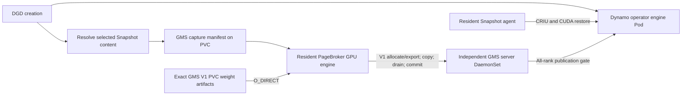

<!-- SPDX-FileCopyrightText: Copyright (c) 2026 NVIDIA CORPORATION & AFFILIATES. All rights reserved. -->
<!-- SPDX-License-Identifier: Apache-2.0 -->
# PageBroker as the GMS V1 weight-loading client

The native prototype is now implemented on
`schwinns/gms-pagebroker-restore-20260929`; four default-config GPU restores passed.
See [PAGEBROKER-RESTORE.md](PAGEBROKER-RESTORE.md) for the measured results.
Snapshot commit `7e347afb62690103d53ea867265167ba9d2b886d` adds the trusted-node
`LoadGmsWeights` operation, a native V1 client, and fair per-GPU buffer scheduling.
[pagebroker-gms-native.patch](pagebroker-gms-native.patch) records that exact
source change against qualified PageBroker base `ca369464`.

The earlier equal-payload probe did not exercise live GMS ownership or the broker
daemon. Likewise, the earlier resident Python-loader trials selected their capture
before DGD creation and dispatched loads concurrently with the creation request.
Those are optimistic controls, not measurements of artifact discovery after a
DGD exists. The new native measurement includes DGD creation, Snapshot content
lookup, and fresh GMS manifest discovery before any weight-transfer submission.

GMS servers start with only their service lifetime and named DRA GPU identity.
They have no selected capture and no weight-PVC mount. A CPU coordinator reads
the matching capture descriptor only after receiving the created DGD UID and its
Snapshot content UID. The descriptor is adjacent to the retained Snapshot
artifacts; it references the exact existing V1 payloads on that same PVC. No
weight payload was copied or staged in host RAM for this integration.

Each server remains an ordinary V1 allocation service. This first qualification
uses one load per coordinator/server incarnation, rejects retries that could
reopen a destructive RW epoch, and recreates the control generation between
trials. General multi-DGD lease retirement and operator lifecycle integration
remain prototype limitations; this is not a production DGD API.

## Original design requirements

The sections below record the design that guided the prototype. The measured
implementation, scheduling behavior, resource savings, and remaining lifecycle
limits are documented in [PAGEBROKER-RESTORE.md](PAGEBROKER-RESTORE.md).

### Resource ownership and container count

Keep one GMS server per logical rank with one DRA GPU and local `cuda:0`. Keep
allocation identity and publication in those servers. Let the existing persistent
node PageBroker GPU engine own CUDA contexts, pinned transfer rings and NFS I/O
concurrency for all assigned GPUs. It can import GMS allocations and fill them
before the engine's native restore calls return their own writable regions.

The conventional separate CLI arrangement can remove its loader processes or
containers this way. The current fused benchmark already runs server and loader
inside each of eight GMS processes; it has no separate eight loader containers to
remove. Centralizing transfers would remove duplicate loader machinery and
buffer setup from these rank processes. It does not automatically eliminate the
eight GMS servers or the main engine container.

A persistent multi-GPU PageBroker pays initialization before accepting work and
reuses it across restores. A fresh per-DGD multi-GPU process pays that cost on the
critical path. Report both cold initialization and warm service latency; a single
large process by itself does not guarantee faster startup.

### Proposed operation

`LoadGmsWeights(restore_generation, immutable_rank_plan, artifact_directory)`
would be a new PageBroker control operation. Each rank entry contains the source
snapshot/manifest identity, logical rank, destination UUID, exact allocation IDs
and sizes, artifact paths/offsets, and stable GMS socket identity. The plan is the
same one consumed by CUDA UUID remapping and the engine publication gate.

The node daemon must also reach the correct pod's Unix sockets: a captured
`/gms/...` path is not a global host path. The agent should resolve endpoints
against the destination Pod UID/mount namespace, or pass verified connected
socket descriptors. Preserve the engine-visible socket identities while binding
broker access to the authorized claim allocation and restore generation.

For each rank, the broker would:

1. Connect to its GMS V1 socket, acquire an RW session, and check the expected
   server UUID. Select the broker's local CUDA device by UUID, not logical rank.
2. Validate the matching manifest and allocate its exact captured IDs and sizes.
3. Export/import and map the allocations into the broker context with write
   access. GMS V1 already exposes these operations; a new tensor-loading RPC in
   the GMS server is not required for this design.
4. Read the PVC with `O_DIRECT` into the persistent ring and copy to those GPU
   mappings. Support file offsets and independently mapped destination extents:
   today's PageBroker transfer API accepts a whole file and one contiguous GPU
   extent, whereas GMS shards contain multiple named allocations.
5. Drain all storage and DMA, release imported mappings/handles, and commit the
   V1 write session. Report publication keyed by rank and restore generation.
   On failure, drain work before releasing memory and abort the uncommitted
   session. Already committed ranks must remain identifiable for retry/cleanup.
6. Release the captured engine only after the existing exact-artifact,
   UUID/ID/size and all-rank publication checks succeed.

This reuses the semantics of `v1/snapshot/weight_artifact.py::load_weights` while
moving its transfer client into the persistent broker. It does not require
checkpointing GMS servers or recovering their broken experimental export path.

### Scheduling and DGD lifecycle

The current PageBroker engine leases one ring per GPU for an entire native extent.
Sharing that ring with GMS therefore needs explicit arbitration. Bound transfer
batches or separate bounded queues should allow residual engine transfers to
progress; do not hold a per-GPU lock across the whole 56 GiB rank load. Also bound
node-wide storage concurrency and pinned memory. Sharing a process does not
remove NFS, memory-bandwidth, CPU or PCIe contention.

An engine target and rank containers in one Pod do not begin simultaneously.
For `dispatch-fixed-early-2`, Kubernetes recorded main-container start at
+1.520 s; GMS script starts ranged +2.218 to +4.013 s, a 1.795 s spread. The main
container at that point is the restore placeholder; Snapshot agent dispatch was
+4.875 s. Production should act on each usable target/server, rather than wait
for all containers Running. A shared transfer-start barrier is useful for the
microbenchmark only; introducing it into deployment would add a dependency.

### CPU resources

The restore benchmark requested 1 CPU and limited 8 CPUs for each GMS container;
main requested 32 and limited 96. A CPU request affects scheduling and relative
CPU share under contention. A quota limit can throttle runnable work. Sixteen
loader lanes do not imply sixteen busy cores: these lanes wait for storage and
DMA. Use per-container CPU usage, quota throttling and CPU pressure deltas during
actual transfer, together with node/parent-cgroup telemetry. Isolated transfer
results cannot exclude competition with the main engine during full restoration.

Record DGD creation, DRA preparation, main/rank starts, broker initialization,
per-rank allocation/import, transfer, commit, CRIU/CUDA and first coherent
inference. Preserve PVC/O_DIRECT semantics and distinguish server-side caching
from client page-cache staging.
