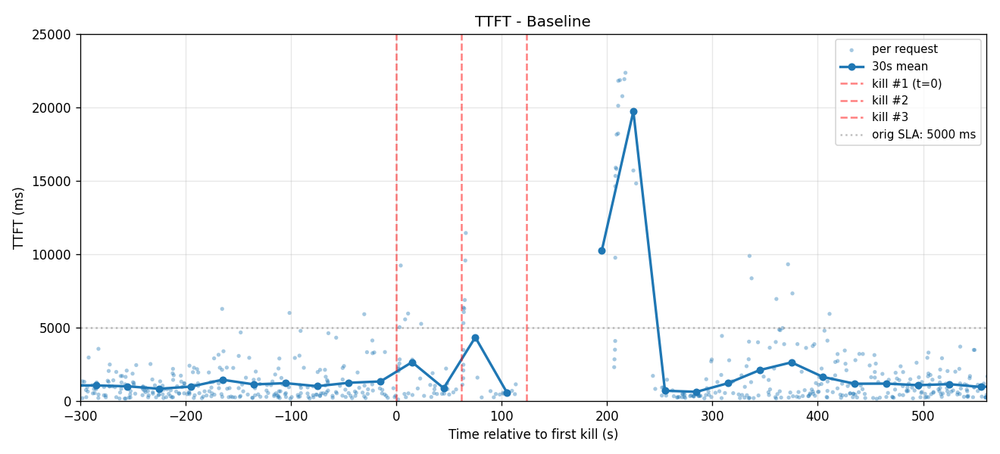
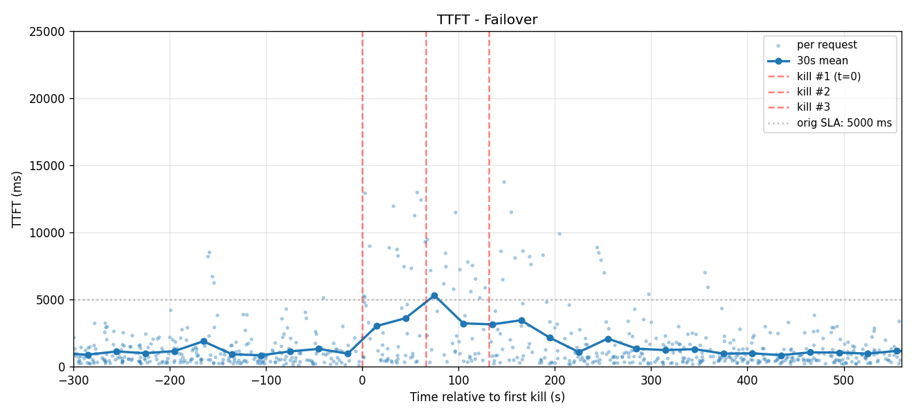
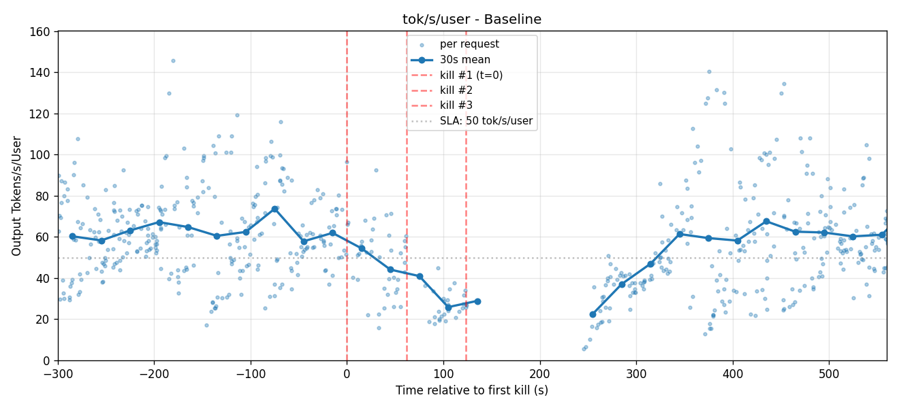
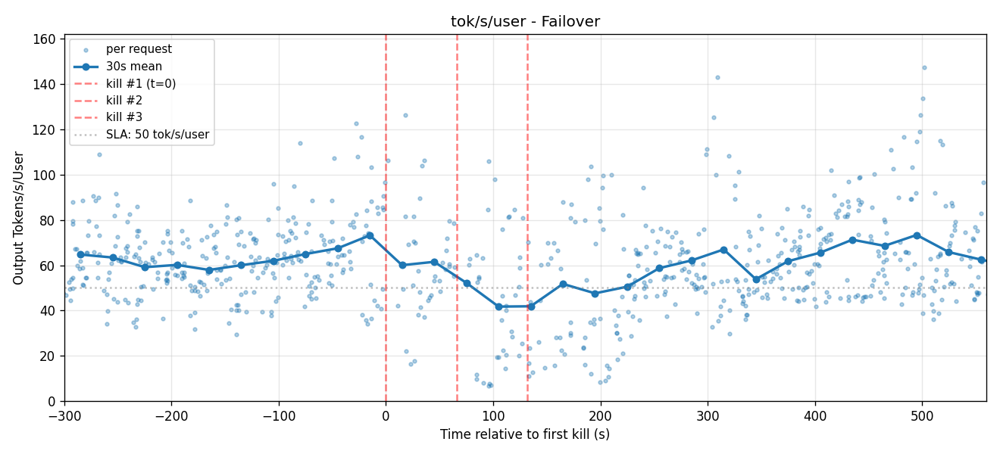
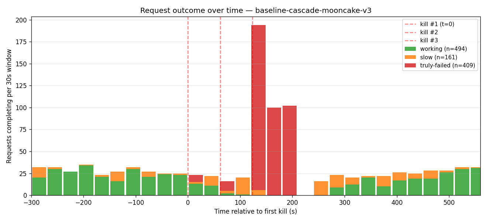
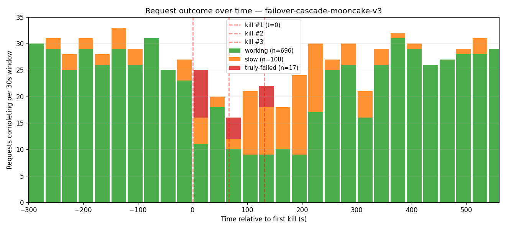
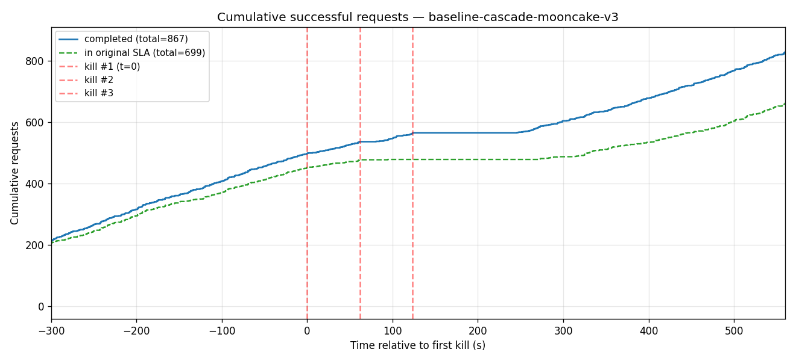
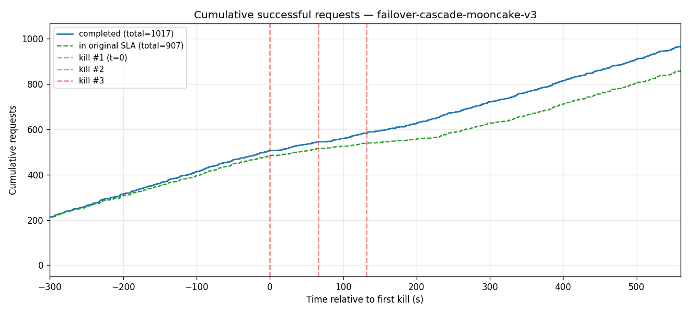

# Dynamo resiliency with shadow failover — 3-node cascade

**Kimi-K2.6 (NVFP4) · Code Agent Traffic (100k/1k ISL/OSL) · 3× B200 nodes**

A 3-worker deployment is driven under a staggered cascade of 3 engine kills (one per worker, 60 s
apart), comparing a **baseline** (no failover) against **GMS shadow-failover**. Both arms run the
identical engine build and configuration, so the only difference is the failover feature. The cascade
is fired only after the workload reaches its steady-state operating point, so the pre-kill baseline is
flat and the cascade is the only perturbation.

## Setup

| | |
|---|---|
| **Model** | Kimi-K2.6, NVFP4 quantization |
| **Serving** | vLLM via Dynamo, TP8 per worker, 256K max context, prefix caching, MLA prefill on FlashInfer |
| **Hardware** | 3× B200 nodes (8 GPUs each, 24 GPUs total); one worker per node |
| **Failover** | GMS intra-pod shadow — each worker runs an active engine plus a shadow engine sharing the node's 8 GPUs via the GPU Memory Service; on kill, the shadow promotes and keeps serving |
| **Load** | Code Agent Traffic — session-based KV-reuse trace, 100k/1k ISL/OSL, concurrency 24 |
| **Fault injection** | staggered cascade of 3 engine kills (60 s apart), one per worker, fired after the workload reaches steady state |

## Headline

| | **baseline** (no failover) | **failover** (GMS shadow) |
|---|---|---|
| serving through the cascade | **blackout** (~150 s, all 3 cold-restart) | **continuous** |
| truly-failed requests | **409** | **17** |
| decode — pre-kill / post | 67 / 71 tok/s/user (flat) | 70 / 67 tok/s/user (flat) |
| TTFT p50 / max | 767 / **22,353 ms** (recovery spike) | 775 / **13,747 ms** |

Steady-state matches on both arms (decode ~64 tok/s/user, TTFT p50 ~770 ms) — the contrast is entirely
the failover feature.

## TTFT

Both arms are flat ~1.2 s before the kills. Baseline breaks across the blackout, then spikes to ~20 s
on the recovery backlog before returning to ~1.2 s; failover stays continuous with a ~5 s bump at the
kills and returns to ~1 s. Per-request scatter with a 30 s mean on a shared 0–25 k ms y-axis; 5 s SLA
shown.

| BASELINE | FAILOVER |
|:---:|:---:|
|  |  |

## Per-user decode rate

The pre-kill window is a flat stationary cloud on both arms (~65–70 tok/s/user). Baseline breaks
across the ~150 s blackout then recovers to the same level; failover dips briefly at the cascade and
stays continuous. 50 tok/s/user reference.

| BASELINE | FAILOVER |
|:---:|:---:|
|  |  |

## Request outcome + cumulative

Baseline loses 409 requests during the blackout; failover loses 17. Cumulative successful requests
flat-line through the baseline outage, while failover climbs steadily throughout.

| BASELINE | FAILOVER |
|:---:|:---:|
|  |  |
|  |  |
