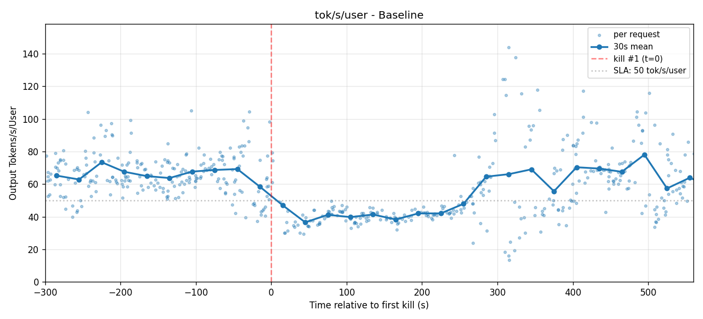
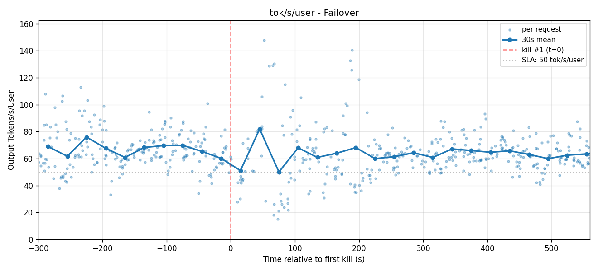
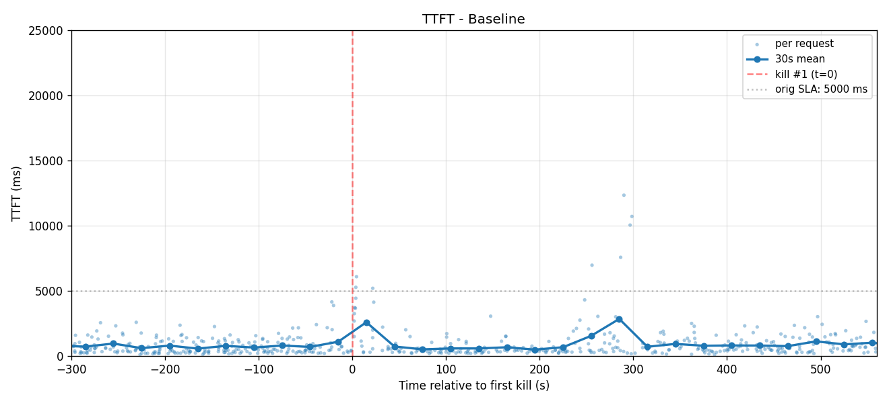
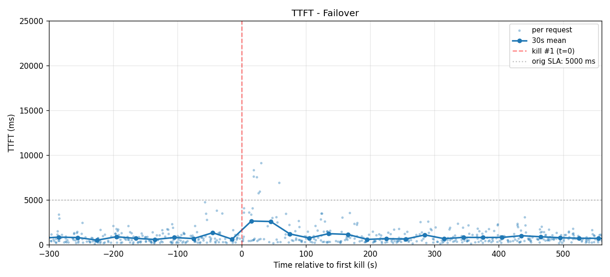
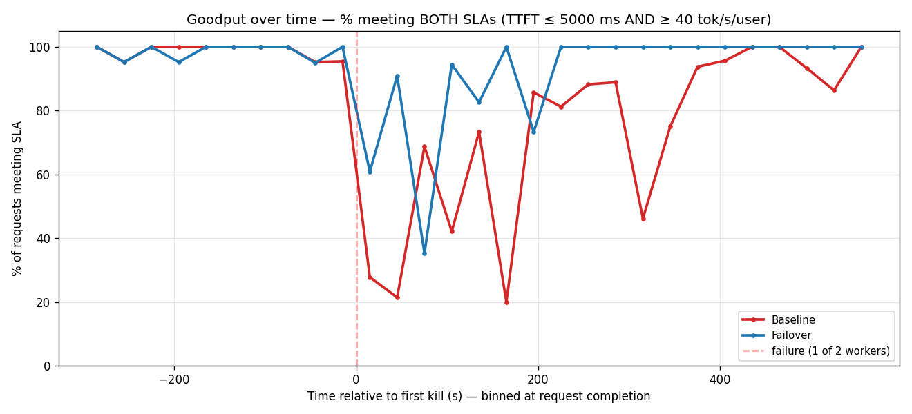
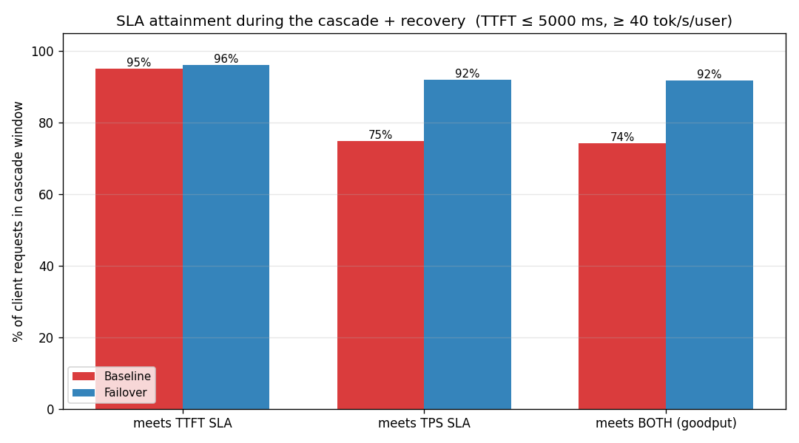
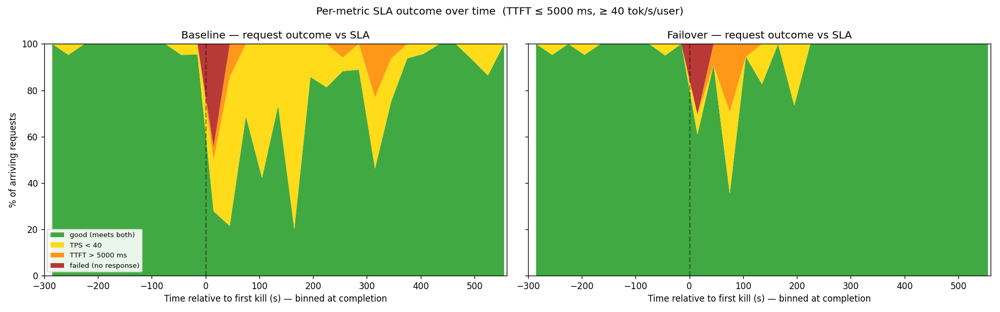
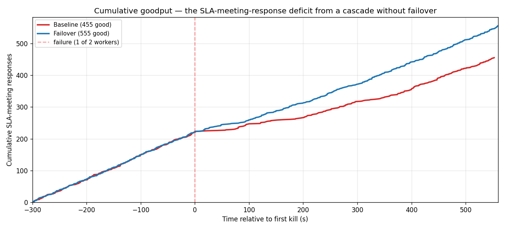

# Single failure on a 2-node fleet — losing half the capacity

**Kimi-K2.6 (NVFP4) · Code Agent Traffic (100k/1k ISL/OSL) · 2× B200 nodes**

A companion to the [3-node cascade](../kimi-cascade-failover/README.md): a **2-worker** fleet with a
**single** engine failure (lose 1 of 2 = **50% capacity**), comparing a **baseline** (no failover)
against **GMS shadow-failover**. Both arms run the identical engine build and configuration, so the only
difference is the failover feature. Load is scaled to the fleet so the per-worker operating point is the
same as the cascade run.

## Setup

| | |
|---|---|
| **Model** | Kimi-K2.6, NVFP4 quantization |
| **Serving** | vLLM via Dynamo, TP8 per worker, 256K max context, prefix caching, MLA prefill on FlashInfer |
| **Hardware** | 2× B200 nodes (8 GPUs each); one worker per node |
| **Failover** | GMS intra-pod shadow — each worker runs an active engine plus a shadow engine sharing the node's 8 GPUs via the GPU Memory Service; on kill, the shadow promotes and keeps serving |
| **Load** | Code Agent Traffic — session-based KV-reuse trace, 100k/1k ISL/OSL, concurrency 16 (8 concurrent/worker, matched to the 3-node cascade) |
| **Fault injection** | a single engine kill, fired after the workload reaches steady state |

## The result — degradation, not blackout

With a survivor still serving, a single loss **degrades rather than blacks out**: the baseline's lone
worker runs at 2× its batch, so per-user decode **halves to ~42 tok/s/user for ~250 s** (until the
killed worker cold-restarts and rejoins). Failover promotes the shadow and restores full capacity in
seconds — decode stays flat. The cost of *no* failover is ~4 minutes at half the decode rate.

| | **baseline** (no failover) | **failover** (GMS shadow) |
|---|---|---|
| after the kill | survivor overloaded — **decode ½ for ~250 s** | shadow promotes — **full capacity in seconds** |
| decode — pre-kill / incident | 65 → **~42** tok/s/user | 65 → **~65** (flat) |
| truly-failed requests | 8 | 7 |
| slow requests (SLA-missing) | **77** | 27 |

Because a survivor keeps serving, **TTFT stays fine on both arms** and few requests outright fail — the
entire penalty lands on **decode rate**.

## Per-user decode rate

Baseline drops to a ~42 tok/s/user band for ~250 s (continuous — no blackout gap), then recovers when
the killed worker rejoins; failover stays flat ~65 with only a brief promotion wobble.

| BASELINE | FAILOVER |
|:---:|:---:|
|  |  |

## TTFT — not the differentiator here

The survivor keeps first-token latency low, so TTFT is comparable on both arms (a useful negative
result: at 50% capacity loss the pain is decode, not TTFT).

| BASELINE | FAILOVER |
|:---:|:---:|
|  |  |

## Goodput — % of requests meeting SLA

SLA = TTFT ≤ 5 s **and** decode ≥ 40 tok/s/user. Pre-kill the two arms are identical (0.0 pp gap); the
drop begins exactly at the fault, and through the survivor-overload window the baseline dips repeatedly
to 30–50% while failover recovers to ~90–100% within ~60 s. Charts are binned at each request's
**completion** time (a request's SLA outcome is realized when it finishes, not when it starts).

### SLA attainment during the incident window

Measured from the kill through recovery. TPS (decode) is the differentiator — TTFT is fine on both.

| scoreboard | per-metric breakdown over time |
|:---:|:---:|
|  |  |

| | meets TTFT SLA | meets TPS SLA | **meets both (goodput)** |
|---|---|---|---|
| **failover** | 96.1% | 92.0% | **91.7%** |
| **baseline** | 95.0% | 74.8% | **74.1%** |

The breakdown shows the baseline's window filling with **"TPS < 40"** (slow decode), not failures —
without failover, ~1 in 4 requests misses the SLA during the incident, vs ~1 in 12 with failover.

## Cumulative goodput

---

_Note: full-run **aggregate** decode is close on both arms (~64–68 tok/s/user) because the incident is a
bounded ~4-minute window; the incident-windowed goodput view above is what surfaces the difference. For
the harsher case where **all** workers fail (a true blackout), see the
[3-node cascade](../kimi-cascade-failover/README.md)._
