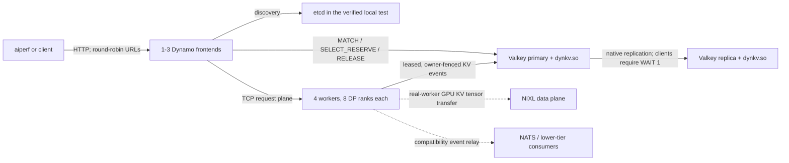

<!--
SPDX-FileCopyrightText: Copyright (c) 2026 NVIDIA CORPORATION & AFFILIATES. All rights reserved.
SPDX-License-Identifier: Apache-2.0
-->

# Valkey router experiment handoff

This document records what exists, what was actually run, and what remains to
make the Valkey-backed router a reproducible Kubernetes deployment. The state
described here was last audited on July 9, 2026.

## Current state

- `bis-valkey-router-002` preserves the aggregate experiment history. The
  dependency-ordered review stack below is based on `origin/main` commit
  `41ab3a71c8` and carries the integrated implementation as DCO-signed local
  commits. No remote publication is implied by this handoff.
- All Valkey, mocker, frontend, and aiperf runs so far were host-local
  processes. The benchmark harness started a fresh topology for each sample and
  tore it down afterward.
- No Valkey router workload or image is currently deployed to Kubernetes. The
  former scratch namespace `bis-valkey-router-001` was deleted after confirming
  that it held no uncaptured experiment artifacts.
- There is no checked-in Kubernetes manifest, Helm values file, or published
  container image for this experiment yet. The Kubernetes section below is a
  handoff contract, not a claim that cluster bring-up has been validated.

### Dependency-ordered review stack

Each branch is cumulative and based on the branch above it. Review the range
from the previous branch to the named branch; the final branch is the complete
latest-`main` integration.

| Order | Branch | Tip before final docs | Review surface |
| --- | --- | --- | --- |
| 1 | `bis/valkey-router-stack-01-module-core` | `a9cc7efdc1` | Module state, index, mutation, persistence, wire helpers, and core tests |
| 2 | `bis/valkey-router-stack-02-module-lifecycle` | `91de6e932d` | Loadable command surface, worker leases, bounded GC, admission, replication tests, and CI |
| 3 | `bis/valkey-router-review-03-transport` | `e828ff39a1` | Bounded Valkey transport and Sentinel routing |
| 4 | `bis/valkey-router-review-04-cache-contract` | `922623bd1d` | Typed shared tokenizer-cache contract |
| 5 | `bis/valkey-router-review-05-indexer-admission` | `02d6b3f471` | Valkey indexer, selection, and admission |
| 6 | `bis/valkey-router-review-06-publisher-lifecycle` | `a84ffa3fb4` | Direct publisher and worker lifecycle |
| 7 | `bis/valkey-router-review-07-frontend-config` | `5024a1bc67` | Canonical frontend JSON configuration and bindings |
| 8 | `bis/valkey-router-review-08-tokenizer-wiring` | `53eafe4349` | In-process L1 and shared Valkey L2 tokenizer cache |
| 9 | `bis/valkey-router-review-09-mocker-e2e` | `59438a3431` | Transactional mocker startup and E2E topology |
| 10 | `bis/valkey-router-review-10-ci` | `f58ff71ebf` | CI coverage for integration surfaces |
| 11 | `bis/valkey-router-review-11-benchmark-harness` | `87e8d983f3` | Reproducible policy-matched benchmark harness |
| 12 | `bis/valkey-router-review-12-startup-retry` | `c6f546b223` | Bounded retry for bursty worker registration reads |
| 13 | `bis/valkey-router-review-13-evidence-docs` | this branch | Exact-tip evidence, architecture, and operational handoff |

The module becomes buildable at layer 2. Every later branch is cumulative, so
reviewers can inspect one focused surface at a time or diff the final branch
against `origin/main` for the complete implementation.

### Kubernetes namespace state

The July 8 audit returned `NotFound` for `bis-valkey-router-001`. Choose a new
scratch namespace before implementing the unvalidated bring-up contract below,
and always pass it explicitly rather than relying on the kubeconfig default.
Inspect a candidate namespace without exposing credential values:

```bash
export NAMESPACE=<new-scratch-namespace>

kubectl get namespace "$NAMESPACE" -o json \
  | jq '{metadata: {name: .metadata.name,
                     creationTimestamp: .metadata.creationTimestamp,
                     labels: .metadata.labels}, status: .status}'
kubectl get pod,deploy,statefulset,daemonset,job,cronjob,service,ingress,pvc,\
configmap,serviceaccount,role,rolebinding,networkpolicy -n "$NAMESPACE" -o wide
kubectl get secret -n "$NAMESPACE" \
  -o custom-columns='NAME:.metadata.name,TYPE:.type,CREATED:.metadata.creationTimestamp'
helm list -n "$NAMESPACE"
kubectl get events -n "$NAMESPACE" --sort-by=.lastTimestamp
```

## System architecture



Valkey stores routing **metadata**, not model data or GPU KV tensors. The
module owns the device-tier prefix index, worker/rank membership, worker
incarnation and lease fences, event ordering, admission capacity, and active
reservation leases. RDB, AOF, and native Valkey replication preserve that
state.

The frontend is therefore stateless for the authoritative device-tier index
and cross-frontend admission decision, but it is not fully stateless. Each
frontend still owns active HTTP streams, request preprocessing and
tokenization, its discovery view, a bounded one-second match cache, and local
request handles. Host-pinned and disk-tier metadata still use the compatibility
event path. In-flight requests do not migrate when a frontend exits.

NIXL is orthogonal to Valkey. Valkey answers *where metadata says a reusable
prefix lives*; NIXL moves the actual GPU KV tensors between real workers when
the serving topology requires a transfer. The mocker benchmark generated KV
events and requests but did not exercise NIXL or GPU data movement.

The design follows the platform-neutral worker boundary in
[DEP issue 10321](https://github.com/ai-dynamo/dynamo/issues/10321#worker-topology-and-platform-boundary),
but adds an authoritative consistency service for state that otherwise remains
replica-local or best effort.

## Important source locations

| Area | Path |
| --- | --- |
| Valkey module and black-box tests | `lib/kv-router/valkey-module/` |
| Rust Valkey index client | `lib/llm/src/kv_router/indexer/valkey/` |
| Direct worker event publisher | `lib/llm/src/kv_router/publisher/` |
| Selection and reservation integration | `lib/llm/src/kv_router/push_router/` |
| Python frontend flags | `components/src/dynamo/common/configuration/groups/kv_router_args.py` |
| Single-topology aiperf harness | `benchmarks/router/valkey_router_aiperf.py` |
| Multi-frontend sweep driver | `benchmarks/router/valkey_frontend_scale.py` |
| Raw module saturation harness | `benchmarks/router/valkey_module_saturation.py` |
| Harness tests | `benchmarks/router/test_valkey_router_aiperf.py` and `test_valkey_module_saturation.py` |

## Reproduce the verified local topology

### 1. Prepare the source and tools

The recorded run used Python 3.12.13 and a Valkey checkout at commit
`5b690cefd6cad707a748879c2bab6b72e18efcb7` (`8.0.8-104-g5b690cefd`).

```bash
export DYNAMO_REPO=/home/biswaranjanp/dev/dynamo_main
export VALKEY_REPO="${VALKEY_REPO:-$HOME/src/valkey}"
cd "$DYNAMO_REPO"

git switch bis/valkey-router-review-13-evidence-docs
git rev-parse HEAD
git status --short
```

For a new development environment, install the Dynamo system prerequisites,
then create the virtual environment:

```bash
cd "$DYNAMO_REPO"
uv venv .venv
source .venv/bin/activate
uv pip install pip 'maturin[patchelf]'
uv pip install -e lib/gpu_memory_service
uv pip install -e .
```

The benchmark imports `aiohttp`, Transformers, and the mocker dependencies. If
they are not already present, install the repository's normal development and
mocker dependencies before running the harness.

### 2. Build Valkey and the module

```bash
make -C "$VALKEY_REPO" -j"$(nproc)"
make -C "$DYNAMO_REPO/lib/kv-router/valkey-module" clean all test \
  VALKEY_SRC="$VALKEY_REPO/src"
```

Expected local artifacts:

- `$VALKEY_REPO/src/valkey-server`
- `$VALKEY_REPO/src/valkey-cli`
- `$DYNAMO_REPO/lib/kv-router/valkey-module/dynkv.so`

The module used by the exact-tip sweep had SHA-256
`da3751ecbb315ba8c05a509edf7049408c4694b704c558c0c038088127fcb26a`.
A different hash after a source change is expected, but record it in the run
artifacts.

### 3. Build the release Python extension

Use a release build for performance results:

```bash
cd "$DYNAMO_REPO"
VIRTUAL_ENV="$DYNAMO_REPO/.venv" \
  .venv/bin/maturin develop --release --uv \
  -m lib/bindings/python/Cargo.toml

.venv/bin/python -c 'import dynamo._core; print(dynamo._core.__file__)'
```

The exact-tip run's loaded release extension had SHA-256
`28bec564134ed7f88d02055e66a371b05fd6dd5655631e8cd0406c6adafd303f`.

### 4. Run focused validation

```bash
cd "$DYNAMO_REPO"
cargo fmt --check --all
cargo test -p dynamo-llm kv_router::publisher --lib
.venv/bin/python -m pytest -q \
  benchmarks/router/test_valkey_router_aiperf.py \
  benchmarks/router/test_valkey_module_saturation.py
git diff --check
```

The focused publisher run passed 96 tests. Run the complete validation set in
the final section before publishing or reviewing a later descendant.

### 5. Start discovery and event services

The verified harness expects etcd on port 2379 and NATS on port 4222. Run each
service under a process supervisor or in a separate terminal:

```bash
etcd \
  --listen-client-urls http://0.0.0.0:2379 \
  --advertise-client-urls http://127.0.0.1:2379 \
  --data-dir /tmp/dynamo-valkey-etcd

nats-server -js
```

Check readiness:

```bash
curl -fsS http://127.0.0.1:2379/health
ss -ltn | rg ':(2379|4222) '
```

Do not start another copy when these ports are already owned by healthy shared
development services.

As an alternative, the repository service bundle can start both dependencies:

```bash
docker compose -f dev/docker-compose.yml up -d
curl -fsS http://127.0.0.1:2379/health
curl -fsS http://127.0.0.1:8222/healthz
```

### 6. Run the exact-shape preflight

The harness creates two module-loaded Valkey processes, four mocker OS
processes with one logical worker each, 32 total DP ranks, and one frontend.
It also validates replication, registration, request counts, errors, and
teardown logs.

```bash
cd "$DYNAMO_REPO"
OUT=/tmp/valkey-preflight-$(date +%Y%m%d-%H%M%S)

DYNAMO_GPU_PARALLEL_DOWNLOADS_READY=1 \
.venv/bin/python benchmarks/router/valkey_router_aiperf.py \
  --arm valkey_ha \
  --valkey-authoritative-admission \
  --runs 1 \
  --frontend-count 1 \
  --mocker-processes 4 \
  --requests 16384 \
  --warmup-requests 2048 \
  --concurrency 4096 \
  --isl 1024 \
  --osl 1024 \
  --event-plane nats \
  --valkey-admission-lease-ms 120000 \
  --valkey-gc-interval-ms 60000 \
  --valkey-gc-inspection-budget 256 \
  --frontend-cpus 0-3 \
  --valkey-cpus 4-5 \
  --mocker-cpus 6-11 \
  --aiperf-cpus 12-23 \
  --aiperf-timeout-seconds 3600 \
  --aiperf-request-timeout-seconds 300 \
  --tcp-request-timeout-seconds 300 \
  --ready-timeout 180 \
  --replica-ready-timeout 60 \
  --settle-seconds 2 \
  --block-size 16 \
  --mocker-data-parallel-size 8 \
  --num-gpu-blocks 131072 \
  --mocker-max-num-seqs 16384 \
  --mocker-max-num-batched-tokens 16384 \
  --speedup-ratio 100000 \
  --kv-bytes-per-token 128 \
  --valkey-connection-pool-size 64 \
  --valkey-event-batching-timeout-ms 1 \
  --output-dir "$OUT"
```

The CPU lists assume at least 24 allowed CPUs. Change them only when recording
the new affinity in the comparison; otherwise results are not directly
comparable.

### 7. Run the long frontend sweep

Each of the 18 samples below starts and stops a completely fresh topology. The
cyclic schedule counterbalances frontend count against run order.

```bash
cd "$DYNAMO_REPO"
OUT=/tmp/valkey-frontend-scale-$(date +%Y%m%d-%H%M%S)

DYNAMO_GPU_PARALLEL_DOWNLOADS_READY=1 \
.venv/bin/python benchmarks/router/valkey_frontend_scale.py \
  --frontend-counts 1,2,3 \
  --repetitions 6 \
  --mocker-processes 4 \
  --requests 16384 \
  --warmup-requests 2048 \
  --concurrency 4096 \
  --isl 1024 \
  --osl 1024 \
  --event-plane nats \
  --valkey-admission-lease-ms 120000 \
  --valkey-gc-interval-ms 60000 \
  --valkey-gc-inspection-budget 256 \
  --frontend-cpus 0-3 \
  --valkey-cpus 4-5 \
  --mocker-cpus 6-11 \
  --aiperf-cpus 12-23 \
  --aiperf-timeout-seconds 3600 \
  --aiperf-request-timeout-seconds 300 \
  --tcp-request-timeout-seconds 300 \
  --ready-timeout 180 \
  --replica-ready-timeout 60 \
  --settle-seconds 2 \
  --harness-extra-arg=--block-size=16 \
  --harness-extra-arg=--mocker-data-parallel-size=8 \
  --harness-extra-arg=--num-gpu-blocks=131072 \
  --harness-extra-arg=--mocker-max-num-seqs=16384 \
  --harness-extra-arg=--mocker-max-num-batched-tokens=16384 \
  --harness-extra-arg=--speedup-ratio=100000 \
  --harness-extra-arg=--kv-bytes-per-token=128 \
  --harness-extra-arg=--valkey-connection-pool-size=64 \
  --harness-extra-arg=--valkey-event-batching-timeout-ms=1 \
  --output-dir "$OUT"
```

Verify rather than trusting the presence of a plot:

```bash
jq '{valid, planned_samples, started_samples, valid_samples,
     input_dataset_consistent, plot}' "$OUT/summary.json"
column -s, -t < "$OUT/summary.csv"
```

Require `valid=true`, 18/18 valid samples, identical input data, zero request
errors, 32/32 registered ranks, no leaked reservations, an online replica, and
matching final replication offsets in every child result.

For a higher-confidence production comparison, keep the same workload and
affinity flags but use `--arm matched --valkey-authoritative-admission --runs 6`
with `valkey_router_aiperf.py`. The harness interleaves the policy-matched
immediate in-process and Valkey arms. The exact-tip scale comparison below uses
three runs per arm at each frontend count.

## Current exact-tip A/B

Revision `c6f546b223cfc1ffe15e316948c06886b4839373` completed 18/18 accepted
arm samples with 200 logical mock workers, concurrency 4,096, requested ISL/OSL
1,024/1,024, and 1, 10, or 100 frontends. All accepted samples completed
16,384/16,384 measured requests without request errors, cancellations,
malformed records, admission leaks, failed module calls, or replication lag.

| Frontends | In-process RPS | Valkey HA RPS | Valkey change | Peak primary clients |
| ---: | ---: | ---: | ---: | ---: |
| 1 | 256.02 | 253.61 | -0.94% | 1,209 / 10,000 |
| 10 | 253.29 | 253.29 | +0.00% | 1,142 / 10,000 |
| 100 | 231.81 | 246.48 | **+6.32%** | 2,001 / 10,000 |

At 100 frontends, Valkey improved output throughput 6.33%, p50/p95 TTFT
7.86%/6.73%, p50/p95 request latency 8.46%/10.91%, and p50/p95 ITL
10.79%/51.53%. Valkey RPS declined only 2.81% from one to 100 frontends;
in-process RPS declined 9.45%. This is fixed-host fan-out, not added-CPU
horizontal scaling:
all frontend processes shared CPUs 2-9 and all mock workers shared CPUs 10-19.

The checked-in [compact evidence and plot](../../bench/results/valkey-exact-tip-ab-20260709/README.md)
contain exact binary/input hashes, all RPS samples, latency medians, connection
peaks, caveats, and the reproduction command. An excluded 100-frontend attempt
exposed registration-generation reads exhausting the five-second primary-read
budget during burst startup. The replay-safe generation read now retries within
a separate 30-second bound while request-path reads retain the fail-fast budget.
All nine corrected Valkey samples registered 200/200 workers.

## Historical recorded performance

The final exact-shape preflight completed 16,384/16,384 profiling requests with
no errors, cancellations, malformed records, admission leaks, or replication
lag:

| Metric | Result |
| --- | ---: |
| Request throughput | 551.37 RPS |
| ISL average | 1,024.00 tokens |
| OSL average | 1,049.56 tokens |
| TTFT p50 / p95 | 5,676.90 / 7,140.83 ms |
| ITL p50 / p95 | 0.257 / 2.864 ms |
| Request latency p50 / p95 | 6,325.89 / 8,227.98 ms |
| Output throughput | 578,697.58 tokens/s |

The long sweep completed 294,912 measured requests plus 36,864 warmup
requests. All 18 samples were valid:

| Frontends | Median RPS | IQR | Maximum observed RPS | Change from one frontend |
| ---: | ---: | ---: | ---: | ---: |
| 1 | 570.13 | 548.32-582.78 | 615.25 | baseline |
| 2 | 549.93 | 541.00-557.23 | 592.35 | -3.54% |
| 3 | 565.04 | 543.82-573.24 | 609.44 | -0.89% |

Median latency and sequence-length metrics from the same sweep were:

| Frontends | TTFT p50 / p95 (ms) | ITL p50 / p95 (ms) | Request latency p50 / p95 (ms) | ISL / OSL average |
| ---: | ---: | ---: | ---: | ---: |
| 1 | 5,509.8 / 7,248.0 | 0.262 / 2.289 | 6,129.3 / 8,335.5 | 1,024.001 / 1,049.623 |
| 2 | 5,002.9 / 7,578.1 | 0.392 / 3.533 | 6,067.7 / 9,039.3 | 1,024.001 / 1,049.578 |
| 3 | 4,724.7 / 7,030.0 | 0.423 / 2.942 | 5,656.9 / 8,693.7 | 1,024.001 / 1,049.628 |

This is a correctness and shared-state result, not horizontal throughput
scaling. Total closed-loop concurrency stayed at 4,096, all frontends shared
CPUs 0-3, and worker, Valkey, and client resources stayed fixed. The bottleneck
was not removed by adding frontend processes. A future capacity test must add
frontend CPU with each replica and use open-loop offered load or a saturation
sweep.

The historical policy-matched A/B used the same three frontends, four mocker
processes, 4,096 concurrency, 1,024-token input/output workload, release
binary, and CPU isolation for three fresh-topology runs per arm. It recorded a
dirty checkout at `4f63c9686b39e5777df67f075bb592749272b9b2`, before the later
HA and safety fixes. Median Valkey HA throughput was 568.52 RPS versus 527.99
RPS for immediate in-process admission (+7.68%). Median p50 TTFT improved from
4,901 ms to 3,702 ms and p50 request latency from 6,125 ms to 5,188 ms. The
[sanitized provenance](../../bench/results/valkey-ha-ab-historical-20260701/provenance.json)
records the binary hashes and medians. Treat this only as pre-hardening
historical evidence; rerun a clean current commit before making a current
performance claim.

The final sweep also logged 499 first-drop warnings from the post-commit legacy
event relay (the actual number of dropped compatibility events is not counted),
plus 26 in the preflight. The authoritative GPU-tier Valkey path stayed valid,
but NATS/lower-tier consumers are not lossless at this event rate. Resolve or
explicitly disable that relay before calling the whole frontend stateless.

The preflight primary accepted 994,605 `DYNKV.APPLY_OWNED` commands and 50,953
replication barriers over the complete 93-second topology lifetime. That is
about 10.7 thousand apply commands/s averaged across startup, warmup, load, and
teardown, with an inferred 70.9 normalized events per event-path barrier after
accounting for lifecycle and request commands. This is achieved volume, not a
single-server maximum. Measure the module-only ceiling separately:

```bash
.venv/bin/python benchmarks/router/valkey_module_saturation.py \
  --server "$VALKEY_REPO/src/valkey-server" \
  --module lib/kv-router/valkey-module/dynkv.so \
  --preset dynamo \
  --mode apply_owned \
  --duration-seconds 30 \
  --warmup-seconds 5 \
  --repetitions 3 \
  --connections-sweep 1,2,4,8,16,32,64 \
  --pipeline-sweep 1,8,32,128 \
  --appendonly \
  --appendfsync everysec \
  --artifact-dir /tmp/dynkv-saturation \
  --output /tmp/dynkv-saturation.json
```

That tool excludes replica `WAIT`, frontends, tokenization, workers, GPUs, and
NIXL. Report its ceiling as module command/event throughput, never as end-to-end
request RPS.

Current host artifact paths:

- `/tmp/valkey-batch128-buffer16-preflight-16384/`
- `/tmp/valkey-frontend-scale-c4096-4mocker-batch128-buffer16-6rep/summary.json`
- `/tmp/valkey-frontend-scale-c4096-4mocker-batch128-buffer16-6rep/summary.csv`
- `/tmp/valkey-frontend-scale-c4096-4mocker-batch128-buffer16-6rep/samples.csv`
- `/tmp/valkey-frontend-scale-c4096-4mocker-batch128-buffer16-6rep/rps-vs-frontends.png`

These are temporary host paths. Copy the machine-readable results to durable
artifact storage before deleting `/tmp` or handing the work to another host.

## Kubernetes bring-up contract

No tested Kubernetes bundle exists yet. The next agent should implement and
review the following resources, run `kubectl diff`, and only then deploy them.

### 1. Confirm the platform boundary

```bash
export NAMESPACE=<new-scratch-namespace>
kubectl config current-context
kubectl auth can-i create statefulsets -n "$NAMESPACE"
kubectl auth can-i create deployments -n "$NAMESPACE"
kubectl get crd dynamographdeployments.nvidia.com
kubectl get clusterrolebinding -o json \
  | jq -r '.items[]
      | select(.metadata.name | contains("dynamo-operator-manager"))
      | [.metadata.name, .subjects[0].namespace] | @tsv'
```

Use an existing cluster-wide Dynamo operator when present. Do not install a
second cluster-wide operator. Exact benchmark parity also requires etcd and
NATS endpoints reachable from the namespace; Kubernetes-native discovery is a
separate behavior that needs its own validation.

### 2. Build and publish two immutable images

1. Build a Valkey image from the recorded Valkey revision. Copy `dynkv.so` into
   the image and load it from a fixed path. Do not distribute the module through
   an ad hoc ConfigMap.
2. Build a Dynamo planner/runtime image from the reviewed Valkey-router branch.
   It must contain the release Rust extension, the frontend, the mocker, and the
   aiperf executable or use a separate aiperf image.
3. Push both images by digest to an approved registry after verifying that the
   new namespace has scoped pull credentials. Record image digests and source
   revisions in the manifests. No image from the current experiment has been
   pushed yet.

### 3. Deploy two Valkey data groups and Sentinel

Create independent primary/replica groups for authoritative router state and
reconstructible tokenizer-cache state. The routing group uses persistent AOF,
`noeviction`, and the same module binary on both data nodes. Its primary command
must include:

```text
valkey-server --port 6379 --bind 0.0.0.0 --protected-mode no
  --dir /data --appendonly yes --appendfsync everysec
  --maxmemory-policy noeviction
  --repl-diskless-sync-delay 0
  --min-replicas-to-write 1 --min-replicas-max-lag 5
  --loadmodule /usr/lib/valkey/modules/dynkv.so
```

The routing replica adds:

```text
--replicaof <primary-service> 6379
--replica-read-only yes --replica-serve-stale-data no
```

Configure the tokenizer group with an explicit memory limit and `allkeys-lru`.
It does not load `dynkv.so`, require `WAIT`, or need AOF because every entry can
be reconstructed from the prompt. This separate eviction domain prevents token
traffic from displacing routing metadata.

Run three independent Sentinel witnesses. Each Sentinel monitors both groups
under distinct names, `dynamo-router` and `dynamo-tokenizer`, with quorum two.
The host-local E2E test promoted each replica in turn and verified routing
continuity plus a cross-frontend tokenizer L2 hit. That does not substitute for
a Kubernetes promotion test in the target failure domains.

Validate before starting Dynamo:

```bash
valkey-cli -h <primary-service> MODULE LIST
valkey-cli -h <primary-service> INFO replication
valkey-cli -h <replica-service> INFO replication
valkey-cli -h <primary-service> WAIT 1 3000
valkey-cli -h <sentinel-0> -p 26379 SENTINEL get-master-addr-by-name dynamo-router
valkey-cli -h <sentinel-0> -p 26379 SENTINEL get-master-addr-by-name dynamo-tokenizer
```

Require the module on both routing nodes, both replica links online, a
successful routing acknowledgement, and strict-majority Sentinel agreement for
both master names.

### 4. Deploy four mocker workers

Use four Pods so the Kubernetes topology matches the final host run. Each Pod
hosts one logical worker with eight DP ranks:

```bash
python3 -m dynamo.mocker \
  --model-path Qwen/Qwen3-0.6B \
  --num-gpu-blocks-override 131072 \
  --max-num-seqs 16384 \
  --max-num-batched-tokens 16384 \
  --speedup-ratio 100000 \
  --data-parallel-size 8 \
  --request-plane tcp
```

Mount one JSON document in every worker and frontend. Workers consume the
routing fields and ignore the tokenizer-only fields:

```json
{
  "allow_insecure_plaintext": true,
  "urls": [
    "valkey://router-primary:6379",
    "valkey://router-replica:6379"
  ],
  "index_scope": "one-shared-scope",
  "connection_pool_size": 64,
  "required_replica_acks": 1,
  "sentinel": {
    "urls": [
      "valkey://sentinel-0:26379",
      "valkey://sentinel-1:26379",
      "valkey://sentinel-2:26379"
    ],
    "master_name": "dynamo-router",
    "quorum": 2
  },
  "worker_events": true,
  "authoritative_admission": true,
  "admission_lease_ms": 120000,
  "worker_lease_ms": 30000,
  "gc_interval_ms": 60000,
  "gc_inspection_budget": 256,
  "tokenizer_cache": {
    "enabled": true,
    "sentinel_master_name": "dynamo-tokenizer",
    "scope": "one-tokenizer-scope",
    "ttl_seconds": 3600,
    "timeout_ms": 20,
    "connection_pool_size": 8,
    "max_pending_writes": 128,
    "l1_bytes": 67108864
  }
}
```

Set `DYN_ROUTER_VALKEY_CONFIG` to the compact contents of this document. Keep
`DYN_EVENT_PLANE=nats`, `DYN_REQUEST_PLANE=tcp`, and the one-millisecond event
batching override as separate worker settings when reproducing the recorded
benchmark.

The scope must be identical in every worker and frontend. Wait for all 32 ranks
to register in Valkey before marking the serving graph ready. The measured
worker direct publisher used its default pool size of four; the value 64 in the
benchmark command configures frontend MATCH readers only. Each frontend also
has one general writer, four admission-select lanes, and four
admission-lifecycle lanes. Each worker has one lifecycle writer, one generation
reader, and four direct-event lanes. At 100 frontends and 200 workers the
maximum router-data budget is therefore `100 * (64 + 9) + 200 * 6 = 8,500`
connections. Size Valkey `maxclients` for that total plus Sentinel,
tokenizer-cache, administrative, and transient connections, and monitor
`connected_clients`; stock `maxclients=10000` leaves only 1,500 connections of
headroom. The measured worker lease was the 30-second default; setting it
explicitly in Kubernetes makes that dependency visible.

### 5. Deploy one to three frontends

Each frontend uses the identical JSON document:

```bash
ROUTER_VALKEY_CONFIG="$(cat /etc/dynamo/router-valkey.json)"
python3 -m dynamo.frontend \
  --router-mode kv \
  --request-plane tcp \
  --kv-cache-block-size 16 \
  --router-valkey-config "$ROUTER_VALKEY_CONFIG"
```

Also configure the discovery namespace/backend and HTTP port according to the
deployment mechanism. For an exact frontend-scaling test, expose a stable URL
for each frontend Pod and pass every URL to aiperf. A single load-balanced
Service can hide connection stickiness and is not equivalent to the local
round-robin URL list.

### 6. Run aiperf as a Job

Use the same immutable input and one global concurrency value across all
frontend URLs:

```bash
aiperf profile \
  --model Qwen/Qwen3-0.6B \
  --tokenizer Qwen/Qwen3-0.6B \
  --endpoint-type chat \
  --streaming \
  --url-strategy round_robin \
  --url http://<frontend-0>:8000 \
  --synthetic-input-tokens-mean 1024 \
  --synthetic-input-tokens-stddev 0 \
  --output-tokens-mean 1024 \
  --output-tokens-stddev 0 \
  --extra-inputs max_tokens:1024 \
  --extra-inputs min_tokens:1024 \
  --extra-inputs ignore_eos:true \
  --concurrency 4096 \
  --request-count 16384 \
  --request-timeout-seconds 300 \
  --warmup-request-count 2048 \
  --export-level records \
  --ui simple
```

Add one `--url` per frontend. Persist the Job artifacts outside the Pod. To
compare replica counts, restart the full topology or clear the Valkey index and
worker epochs between samples, interleave the run order, and keep total versus
per-frontend CPU explicit.

### 7. Kubernetes acceptance gates

Do not call the deployment complete until all of these hold:

- Four logical workers and all 32 ranks are registered under one index key.
- Every frontend can route requests after another frontend is restarted.
- All requested aiperf records complete with zero errors, cancellations, or
  malformed records.
- Primary and replica offsets converge, command stats show no failed calls, and
  admission statistics return to zero after the run.
- AOF restart and replica full-sync preserve prefix ownership and lifecycle
  fences.
- A controlled promotion test proves the chosen Sentinel/operator/VIP path;
  killing a primary without promotion is expected to stop writes.
- The compatibility relay has no drops, or lower-tier routing is explicitly
  disabled and documented.
- Real-worker testing separately validates NIXL connectivity and GPU KV
  transfer. The mocker result cannot satisfy this gate.
- CPU requests/limits and node placement are recorded. Horizontal scaling must
  add CPU per frontend rather than divide one fixed CPU set among more Pods.

## Known follow-up work

1. Publish the local DCO-signed branch when external review is authorized so a
   fresh clone can check out the work.
2. Add reviewed Valkey and Dynamo container builds plus Kubernetes manifests.
3. Reproduce the existing Sentinel promotion benchmark in Kubernetes failure
   domains and retain its machine-readable artifacts.
4. Make the compatibility relay lossless at the tested event rate, count all
   dropped events, or remove it from the supported authoritative mode.
5. Repeat the clean policy-matched comparison with six runs per arm and
   per-frontend CPU allocation before making a production capacity claim.
6. Run open-loop saturation tests to establish maximum request RPS and module
   event volume; the closed-loop results above are achieved load, not a server
   maximum.
7. Validate real vLLM workers, GPU KV reuse, and NIXL separately from the
   accelerated mocker path.
