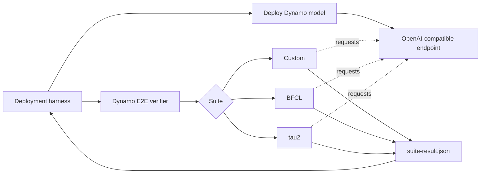
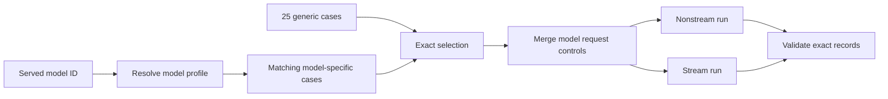
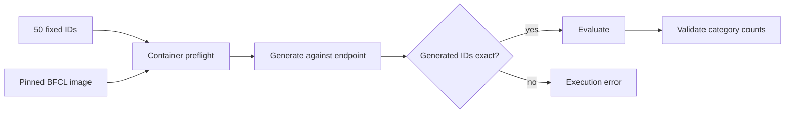
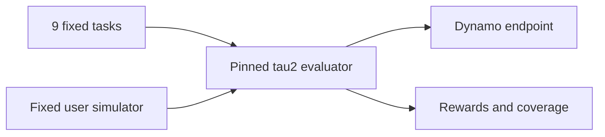
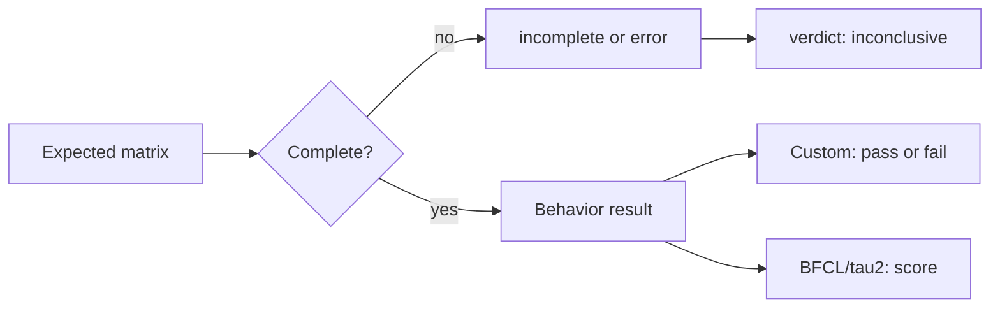

# E2E Tool-Calling Qualification

This package is Dynamo's public correctness boundary for bounded tool-calling
qualification. An external harness deploys a model endpoint; this package
selects tests, runs them, validates coverage, and emits one normalized result.



The ownership split is deliberate:

- Dynamo owns case selection, validators, evaluator versions, scoring, and the
  `suite-result.json` contract.
- The external harness owns image resolution, Kubernetes deployment, endpoint
  readiness, artifact retention, dashboards, cleanup, and notifications.

## Qualification profile

Manual, PR, and nightly runs currently extend the same bounded
`qualification` profile. These are qualification subsets, not official full
benchmark scores.

| Suite | Fixed coverage | Target |
|---|---:|---:|
| Custom | 25 generic cases in streaming and nonstreaming modes, plus matching model-specific cases | 5–7 min |
| BFCL | 50 BFCL v3 cases across 8 categories | 3–5 min |
| tau2 | 9 tasks: 3 each from airline, retail, and telecom | 10–12 min |

The exact selections, budgets, concurrency, and evaluator image digests live in
`e2e_verifier/profiles.json`.

## Custom flow

Custom tests exercise OpenAI Chat Completions request and response contracts,
including tool choice, schemas, parallel calls, streaming finish reasons,
reasoning separation, parser-marker leakage, truncation, history, and
multi-turn tool execution.



Applicability and provenance are separate:

- **Generic** cases run for every model.
- **Model-specific** cases run only for the resolved model profile. Kimi K2
  currently adds two multi-turn cases.
- A `customer_` prefix identifies a customer regression. A customer case can
  be generic or model-specific.

Model-specific request fields such as thinking controls are supplied through
`--request-contract-json` and merged by `custom_runner.py`. They do not require
copies of the generic cases.

## BFCL flow

BFCL uses the NeMo Evaluator `26.03` image pinned by OCI digest. The image runs
as short-lived Docker containers on the verifier host, not in the model's
Kubernetes pod.



The container uses host networking to reach the harness port-forward and
mounts the suite output directory at `/results`. Live, executable, and
long-context categories are intentionally outside this bounded selection.

## tau2 flow



tau2 requires `TAU2_SIMULATOR_MODEL`, `TAU2_SIMULATOR_BASE_URL`, and
`TAU2_SIMULATOR_API_KEY`.

## Run the verifier

The model endpoint must already be running.

```bash
python3 -m benchmarks.tool_calling.e2e_verifier \
  --suite custom \
  --profile qualification \
  --base-url http://127.0.0.1:8000/v1 \
  --model google/gemma-4-31B-it \
  --runtime dynamo-vllm \
  --request-contract-json '{"enabled":{"thinking":true},"disabled":{"thinking":false}}' \
  --output-dir /tmp/dynamo-e2e/custom
```

Use `--dry-run` to resolve selections and commands without sending model
requests.

## Result contract

Every invocation writes `suite-result.json`.



- `execution_status` reports whether the expected matrix executed and produced
  valid artifacts.
- `verdict` reports behavioral interpretation. Custom has pass/fail assertions;
  BFCL and tau2 currently report scores with `verdict=inconclusive` because the
  qualification profile defines no pass threshold.
- `coverage` records the resolved selection and counts.
- `provenance` records profile hashes, selection hashes, and evaluator images.

## Code map

| Path | Responsibility |
|---|---|
| `custom/tool_calling_probe.py` | Custom cases, requests, streaming assembly, and assertions |
| `custom/model_profiles.py` | Served-model name to Custom profile mapping |
| `custom/tool_calling_static_report.py` | Detailed Custom JSON, JSONL, and static HTML artifacts |
| `custom_runner.py` | Per-model request-contract adapter |
| `e2e_verifier/profiles.json` | Fixed qualification selections and evaluator images |
| `e2e_verifier/cli.py` | Suite orchestration, coverage checks, and normalized result |
| `e2e_verifier/test_cli.py` | Verifier contract regression tests |
| `custom/tests/test_probe_reliability.py` | Custom catalog and selection regression tests |

## Extend coverage

1. Add a reusable Custom case and assertion in `tool_calling_probe.py`.
2. Add universal cases to `generic_cases`, or profile-only cases to
   `model_specific_cases`, in `profiles.json`.
3. Add a `customer_` prefix when preserving a customer regression.
4. Update the focused tests and verify the exact selection and record counts.

Run the focused unit tests with:

```bash
pytest -q \
  benchmarks/tool_calling/custom/tests/test_probe_reliability.py \
  benchmarks/tool_calling/e2e_verifier/test_cli.py
```
