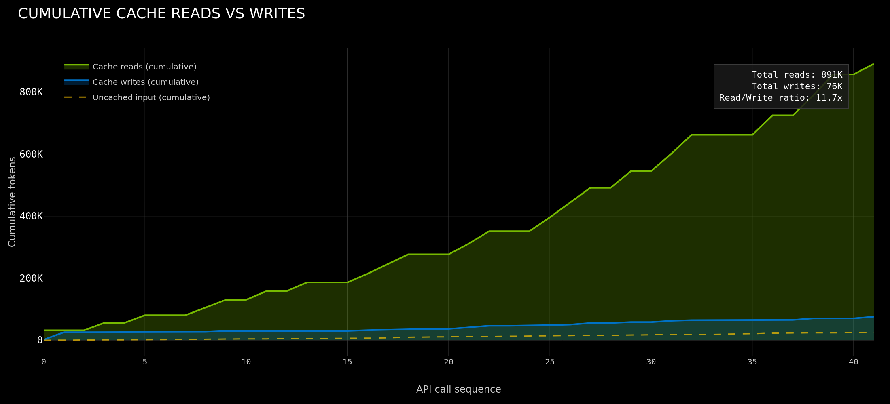
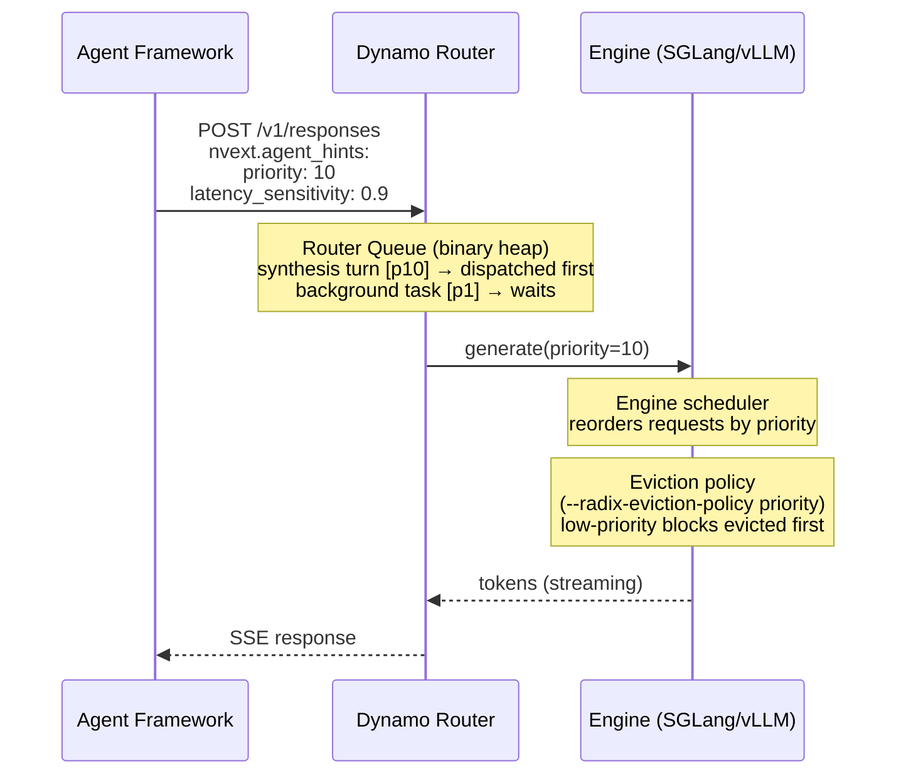

# Full Stack Optimizations for Agentic Inference with Dynamo

Agentic systems are the most cache-intensive workloads in production LLM inference today. Agentic coding tools like Claude Code and Codex make hundreds of API calls per coding session, each carrying the full conversation history. After one cold call that writes the prefix to cache, every subsequent call hits 85-97% cache. Agent teams push this further: 97.2% aggregate cache rate across 4 Opus teammates. An 11.7x read/write ratio means the system reads from cache nearly 12 times for every token it writes.

<!-- TODO: regenerate cumulative-reads-writes.png to align with Flash Indexer visual color scheme -->


These numbers come from managed API infrastructure where the provider controls prefix matching, cache placement, and eviction. For teams running open-source models on their own GPUs, none of this exists out of the box. Dynamo is NVIDIA's open-source inference stack built to close that gap. This post walks through how we are making Dynamo agent-native at three layers: the frontend API, the router, and KV cache management.

Throughout this post, we use three terms consistently:
- **Harness**: the agent framework that drives the workflow (Claude Code, Codex, OpenClaw, LangChain, etc.)
- **Orchestrator**: Dynamo's routing, scheduling, and cache management layer
- **Runtime**: the inference engine that executes model forward passes (SGLang, vLLM, TRT-LLM)

## Layer 1: The Frontend

### Multi-Protocol Support

Over the last few months, we have seen teams start moving from a "stateless" `v1/chat/completions` API to "stateful" APIs like `v1/responses` and `v1/messages` to cleanly handle new patterns including interleaved thinking and tool calls. Dynamo now supports both APIs and we are actively developing a reference architecture for a stateful server-side backend for `v1/responses`. Dynamo serves all three through a common internal representation, so a single deployment can act as the inference backend for Claude Code, Codex, or any OpenAI-compatible agent. Our team has internally been running a Dynamo deployment of GLM-5 and Minimax2.5 and optimizing our backend to match closed-source inference performance. We'll be sharing a full write-up and some optimized recipes for deploying both models in the upcoming weeks.  

<todo - add video emebds showing dynamo serving CC and codex>

We have also invested in day-0 tool call and reasoning parsing support for various open-source models. If you find that a model is not supported, please [open an issue](https://github.com/ai-dynamo/dynamo/issues) or use our [tool-parser-generator skill](https://github.com/ai-dynamo/dynamo/tree/main/lib/parsers) to have your harness of choice implement it.

### Agent Hints: The Harness-Orchestrator Interface

Background coding agents have crossed from experiment to production infrastructure. [Stripe’s agents generate 1,300+ PRs per week](https://stripe.dev/blog/minions-stripes-one-shot-end-to-end-coding-agents). [Ramp attributes 30% of merged PRs to agents](https://www.infoq.com/news/2026/01/ramp-coding-agent-platform/). [Spotify reports 650+ agent-generated PRs per month](https://engineering.atspotify.com/2025/11/spotifys-background-coding-agent-part-1). These workloads are fundamentally different from interactive chat as no human is watching tokens stream, so requests can be reordered, batched, or delayed without degrading the overall experience. Sessions run for minutes to hours with long tool-call pauses, and the harness has global context: which agents are mid-task and waiting on tool calls, which just spawned, how many turns remain in a session, and whether the current call is a quick lookup or a long synthesis. This is enough to optimize inference scheduling in ways that traditional serving cannot.

Today, inference servers see anonymous tokenized requests. They don’t have the global context about which agent is blocked on a tool call, which one is about to resume, or which work is urgent. That context lives only in the harness.

Dynamo’s new `nvext.agent_hints` extension bridges this gap. It attaches structured hints to each request across all three API endpoints, giving the router and engine the context they need to make agent aware scheduling and caching decisions. This is a v1 API that we are actively co-designing with the community and would love feedback from teams building agent harnesses on what signals are most useful. 

```json
{
  "model": "MiniMaxAI/MiniMax-M2.5",
  "messages": [...],
  "tools": [...],
  "nvext": {
    "agent_hints": {
      "latency_sensitivity": 0.9,
      "osl": 256,
      "speculative_prefill": true,
      "priority": 10
    },
    "cache_control": {
      "type": "ephemeral",
      "ttl": "1h"
    }
  }
}
```

The `agent_hints` field carries per-request metadata: scheduling priority, latency sensitivity, expected output length, and a flag for speculative cache warming. These flow downstream to the router and engine. The `cache_control` field will look familiar to anyone who has used Anthropic's prompt caching API. It tells the orchestrator to pin the computed prefix on the worker for the specified TTL. We discuss how this works in the cache retention section below.

## Layer 2: The Router

### KV-Aware Placement

Without cache-aware routing, turn 2 of a conversation has a ~1/N chance of landing on the same worker as turn 1. Every miss is a full prefix recomputation. Dynamo's router maintains a global index of which KV cache blocks exist on which workers. The [Flash Indexer post](https://developer.nvidia.com/blog/building-a-high-performance-kv-cache-index-for-llm-inference-with-nvidia-dynamo/) covers the six iterations that got this indexer to 170M ops/s. On every request, the router queries it for per-worker overlap scores and selects the worker that minimizes the combined cost of cache miss and current decode load. This cost function is tunable, and we show below how teams can build custom routing strategies on top of it.

### Priority Scheduling

Agent hints flow from the frontend into the router's scheduling queue: a `BinaryHeap<QueueEntry>` ordered by effective arrival time. When a request arrives, the queue computes `effective_offset = arrival_offset.saturating_sub(priority_jump)`, where `priority_jump` is the `latency_sensitivity` value from `agent_hints`, interpreted as seconds. A request with `latency_sensitivity: 5.0` is treated as if it arrived 5 seconds earlier than it actually did. The heap uses reversed `Ord` to implement min-heap semantics, so lower effective offsets (higher priority) are dequeued first.

Requests only enter the queue when all workers exceed a configurable load threshold. Below that threshold, they bypass the queue entirely and go straight to worker selection. When capacity frees up (prefill completes or a request finishes), the queue drains highest-priority entries first.

The `priority` value does not stop at the router. SGLang, vLLM, and TRT-LLM already support priority-based request scheduling. Dynamo passes priority through to the engine, where it influences both request scheduling order and KV cache eviction.



### Agentic Workload Routing Strategies

A coding agent follows a sequential pattern: long prefill, tool call, extend prefix, repeat. A multi-agent harness fans out work across parallel subagents with short, independent contexts. A research agent with a 200K context window needs workers with enough free KV capacity to hold its full state. The router's default cost function (overlap score + decode load) handles the common case, but teams with domain-specific workloads can easily leverage the router's Python bindings to implement custom routing strategies. The core `KvRouter` class provides `best_worker()` for querying routing decisions, `get_potential_loads()` for per-worker load inspection, and `generate()` for routing + dispatch in one call. Custom routers register on the same service mesh as the default components and can override routing config per-request:

```python
# Query per-worker load and overlap for custom routing logic
loads = await router.get_potential_loads(token_ids)
worker_id, dp_rank, overlap = await router.best_worker(
    token_ids,
    request_id="req-123",
    router_config_override={"overlap_score_weight": 2.0}
)

# Or bypass the default selector entirely
stream = await router.generate(
    token_ids, model=model, worker_id=chosen_worker
)
```

Using type hints from the NeMo Agent Toolkit (NAT), the NAT team built a custom online-learning router that achieved 4x reduction in p50 TTFT and 1.5x increase in p50 tokens-per-second compared to default routing. Their custom processor extracts per-request session metadata (`prefix_id`, `reuse_budget`, inter-arrival time) from `nvext` annotations and feeds them to a Thompson Sampling bandit that combines KV overlap scores from the Flash Indexer with worker load signals (GPU utilization, queue depth, outstanding work) to select the best worker for each request. After each request completes, a feedback signal (latency, token counts) updates the bandit parameters, so the router learns which workers perform best for which prefix patterns under load rather than relying on static heuristics. Priority tagging of latency-sensitive requests achieved up to 63% latency reduction under moderate memory pressure. We will be making this available as a routing strategy in Dynamo soon.


## Layer 3: KV Cache Management

### The Problem with Uniform Eviction

Agentic workloads produce blocks with vastly different reuse value but default LRU eviction policies treat all KV blocks identically.

| Block Type | Reuse Pattern | Value |
|------------|---------------|-------|
| System prompt + tool definitions | Every turn, 8-20K tokens | Highest |
| Conversation history | Subsequent turns, growing monotonically | High |
| Thinking/reasoning tokens | Zero reuse after reasoning loop closes (~40% of output) | Near-zero |
| Subagent KV | 1-3 turns then agent dies. No need to retain | Near-zero |

LRU sees only recency. In a high traffic environment, a tool-call pause (2-30 seconds while the agent waits for an external API) might cause the agent's blocks to age out and when the agent resumes, the entire prefix must be recomputed. To solve this, we need to provide the harness a granular API to control which blocks should be retained, where they should live, and for how long.

### Distributed KV Cache with Multi-Tier Storage

Today, KV cache is treated as a local, ephemeral resource on each worker. An agent's 20K-token system prompt is computed independently on every worker that serves one of its requests. When a lead agent spawns 4 subagents, each with overlapping tool definitions, that shared prefix is recomputed 4 times if the subagents land on different workers. In our analysis of Claude Code team sessions, we measured this directly: teammates averaged 79.4% cache rate vs. 91.3% for the lead agent's explore subagents (5.0x vs. 11.7x read/write ratio), with the gap driven almost entirely by cold-start writes on each teammate's first call. The goal is to make high value KV cache blocks available to all workers in the cluster. Essentially, they are written once during cold start and then read by any worker at all times. 

Solutions like SGLang's HiCache and Dynamo's KV Block Manager (KVBM) implement a 4-tier memory hierarchy to make this possible:

```
GPU (HBM)  ->  CPU (pinned DRAM)  ->  Local NVMe  ->  Remote Storage (NIXL)
   ~ns              ~us                  ~ms               ~ms (RDMA)
```

Blocks follow a write-through path: when a worker computes KV for a prefix, the blocks flow from GPU to CPU to disk automatically. Each block is deduplicated by sequence hash in a global registry. Once a block is registered, it is immutable and addressable by any worker that can reach the storage tier. The KVBM uses a frequency-based offload filter (double on hit, decay by 1 per time step) to protect SSD lifespan by only offloading blocks with demonstrated reuse.

This directly solves the subagent cold-start problem. When the lead agent computes tool definitions and system prompt, those blocks write through to shared storage. When subagent 1 spawns on a different worker, the router queries the Flash Indexer, finds the blocks in shared storage, and the worker loads them via NIXL (RDMA read) instead of recomputing from scratch. Subagent 2 does the same. Four redundant prefill computations become one compute and three loads. The same mechanism addresses cache coherence in disaggregated prefill-decode serving. In disagg mode, the prefill worker computes KV and transfers it to the decode worker via NIXL. The decode worker generates tokens, producing new KV state. On the next turn, a prefill worker needs both the original prefix and the generated tokens from turn 1, but those live only on the decode worker. With shared storage, the decode worker writes its new blocks to the common tier and any prefill worker can fetch them on the next turn. 

The missing piece is prefetch: the harness knows when an agent's tool call is about to return, which means it knows which blocks will be needed and when. We are building prefetch hooks so the harness can signal "bring these blocks from storage to GPU ahead of the next request." Combined with the retention APIs (below), this gives the harness full lifecycle control: pin blocks to prevent eviction, set priority to control eviction ordering, and prefetch blocks proactively before they are needed.

Looking further out, NVIDIA's CMX (Context Memory Storage) platform extends this hierarchy to datacenter scale. Built on BlueField-4 DPUs and NIXL, CMX provides RDMA-speed access to networked KV storage. At [VAST Forward 2026](https://www.hpcwire.com/2026/03/02/blasting-through-the-gpu-memory-wall-with-nvidias-new-cmx-platform/), NVIDIA and VAST demonstrated 20x TTFT improvement by fetching KV cache from VAST storage via CMX instead of recomputing. For agentic workloads where context persists across sessions and spans hundreds of workers, treating storage as a first-class cache tier changes the economics entirely. The KVBM already achieves 2.2x-12x TTFT improvement depending on the tier hit. CMX will extend this to shared storage with hardware-accelerated data movement.

### Cache Retention

Making blocks globally available solves the sharing problem, but does not solve eviction. SGLang and vLLM both support priority-based eviction via a priority heap where the harness assigns a numeric priority per request and lower-priority blocks are evicted first. TensorRT-LLM takes this further with `TokenRangeRetentionConfig` (designed and implemented by [@jthomson04](https://github.com/jthomson04)) which allows per-region control within a single request:

```
RetentionDirective:
    start: int        # token index (inclusive)
    end: int | null   # token index (exclusive); null = end of sequence
    priority: int     # 0 (evict first) to 100 (evict last)
    duration: float   # seconds; null = persist until explicit release
```

A request carries zero or more directives. Blocks without directives follow the default LRU path with zero overhead. The evictor becomes a two-structure system: an LRU free list for unprioritized blocks (O(1), unchanged) and a priority queue for annotated blocks. The harness can express "system prompt blocks are evicted last; conversation context survives a 30-second tool call; decode tokens are first to go" without the engine needing to understand why.

When we studied how Anthropic's prompt caching works in practice, we wanted to bring the same semantics to open-source inference. In Claude Code, the caching hierarchy has a specific structure: base system instructions and tool definitions are marked with `scope: "global"` and cached across all users, CLAUDE.md files and memory are cached per-project, and conversation history is cached per-session. The prefix is always the highest-value region, reused on every turn. Dynamo's `cache_control` API applies this to self-hosted inference. When a request includes `cache_control: { type: "ephemeral", ttl: "1h" }`, the router fires a `pin_prefix` RPC to the worker after generation completes. The worker walks its radix tree and sets a `pin_expiry` TTL on matching nodes.

The next step is connecting retention with the distributed cache. Today, retention directives apply to a single worker's local cache. When a block is pinned on worker A but the next request routes to worker B, the pin does not follow. Extending retention semantics across the KVBM's shared storage tier means the harness can pin a block once and have it survive across workers: the priority and TTL metadata travel with the block through the write-through path, and any worker that loads the block from shared storage inherits the retention policy. Combined with the prefetch hooks described above, this gives the harness end-to-end lifecycle control across the full memory hierarchy.

### Agent Lifecycle Awareness

Consider a typical Claude Code session. The lead agent runs for 20+ turns, accumulating a growing conversation prefix. Along the way it spawns explore subagents that each run 1-3 turns and terminate. It might spawn a team of 4 specialists that work in parallel on different subtasks and then terminate. Midway through, the agent hits a context limit and summarizes its history, compressing 80K tokens down to 10K. Each of these events has direct implications for the cache: subagent termination means its KV will never be referenced again, summarization means the old conversation history is dead weight, and the lead agent's prefix should survive across all of it. Reasoning models add another dimension: `<think>...</think>` blocks account for ~40% of generated tokens but have zero reuse after the reasoning loop closes. None of this lifecycle information is visible to the cache layer today.

We have been experimenting with two complementary approaches.
1. Harness-driven: the harness provides session lifecycle hooks (`semantic_event: "start"`, `"reset"`, `"end"`) that let the engine track which radix tree nodes belong to which session. When a subagent terminates, the harness signals `"end"` and the engine prunes that session's entire subtree in one operation. When the lead agent summarizes context, it signals `"reset"` and the old history nodes are released. 
2. Engine-native: the engine itself classifies blocks by lifecycle at generation time without needing external signals. We have been experimenting with volatile-aware eviction in SGLang's cache layer, where we can leverage the native grammar-aware hooks to assign semantic awareness to KV blocks by their type (reasoning chain, tool call, new message, etc.) and selectively skip storage and write-back bandwidth. 

## Active Research Directions

This post covers where Dynamo is today and the directions we are actively building toward. Here is what is next on the roadmap:

**Distributed KV cache in KVBM** The write-through multi-tier hierarchy exists, but retention metadata (priority, TTL) does not yet travel with blocks across workers. The next milestone is extending retention semantics across the shared storage tier so the harness can pin a block once and have it survive across the cluster.

**Prefetch hooks** The harness knows when a tool call is about to return and which blocks the next request will need. We are building APIs for the harness to signal prefetch intent so the orchestrator can move blocks from storage to GPU ahead of time, eliminating the load latency on cache-hit paths.

**Semantic KV cache awareness** Today, blocks are identified by sequence hash. They have no type information. We want to associate semantic metadata with blocks: is this a system prompt, a tool definition, a reasoning chain, a conversation turn? This enables policies like "always replicate tool definitions across workers" or "never offload checkpoints to cold storage," and gives the orchestrator vocabulary to reason about cache contents by role rather than token range.

**Engine-level optimizations** Dynamo integrates with SGLang, vLLM, and TRT-LLM, and we are working with all three teams on runtime-level improvements for agentic workloads. One example: we prototyped a decode-side radix cache in SGLang ([PR #19746](https://github.com/sgl-project/sglang/pull/19746)) that matches cached prefixes on the decode worker and transfers only delta KV in disaggregated serving. With ~91% prefix reuse on Qwen3-32B (3P1D on B200), this achieved 8.1x p50 TTFT improvement and 1.32x throughput.

**`nvext` API co-design.** The `agent_hints` and `cache_control` fields are a v1 API. We want input from teams building agent harnesses on what signals matter most. If you are building on top of Dynamo or thinking about cache-aware inference for your workloads, we would love to collaborate. Reach out on [GitHub](https://github.com/ai-dynamo/dynamo) or join the conversation in our community channels.

---

The code is at [github.com/ai-dynamo/dynamo](https://github.com/ai-dynamo/dynamo).