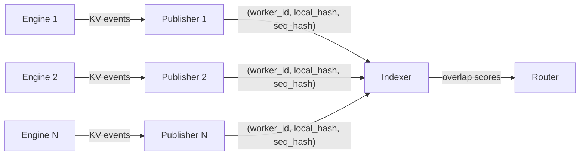
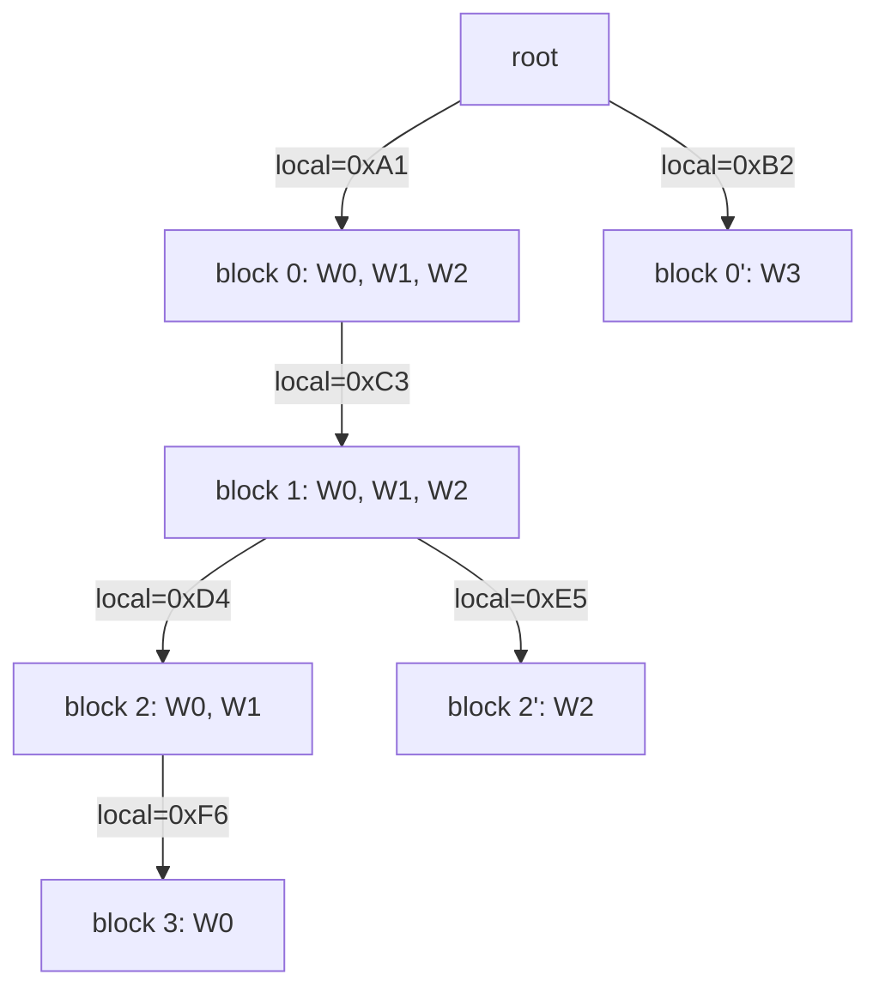
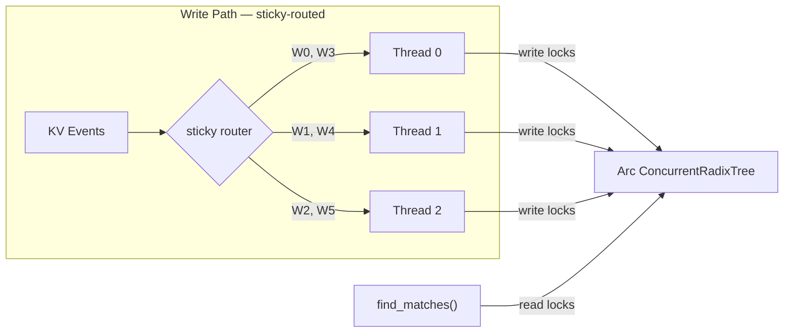
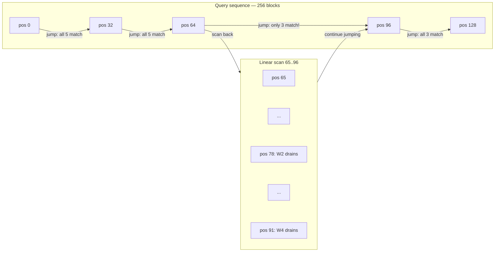

# Flash Indexer: A Story of Inter-Galactic KV Routing

Modern LLM inference doesn't happen on a single GPU anymore. A production deployment might have dozens---sometimes hundreds---of inference workers, each holding a pool of cached key-value (KV) tensors in GPU memory. When a new request arrives whose prompt shares a prefix with a previously seen request, re-using that cached KV data can skip an enormous amount of redundant computation. This is *KV cache reuse*, and at scale it is the single largest lever for inference throughput.

But here's the problem: which worker has the blocks you need?

Each worker knows about its own cache. Nobody has the global picture. To route a request to the worker with the best prefix overlap, or to orchestrate block transfers between workers, or to schedule distributed prefills---you need a **global index** of every cached block across every worker. And you need it to be *fast*: every microsecond spent in the index is a microsecond not spent generating tokens.

This is the story of how we built that index---the **Flash Indexer**---evolving through six iterations from a Python dictionary to a concurrent, jump-optimized spatial index clocking in at over 10 million operations per second with p99 latency under 1 microsecond.

---

## Background

### The Anatomy of a KV Block

Every block in the system carries a few pieces of identity:

- **Local block hash** (`u64`): A hash of the tokens *within* a single block (e.g., 64 tokens). Content-addressable---two blocks with the same tokens have the same local hash, regardless of where they appear in a sequence. Crucially, this is also what the frontend computes on the query side: the Dynamo frontend controls the local hashing algorithm directly, so both the event write path and the query read path produce the same local hashes for the same tokens.

- **External sequence block hash** (`u64`): A cumulative rolling hash of the entire sequence up to and including this block. This is what makes a block's identity *positional*: two blocks with identical tokens but different prefixes produce different sequence hashes. Unlike local hashes, sequence hashes are typically produced by the inference engine itself, and we generally cannot control the engine's hashing algorithm---unless a contract is enforced (more on this shortly).

  ```
  seq_hash[0] = local_hash[0]
  seq_hash[i] = hash(seq_hash[i-1] || local_hash[i])
  ```

- **Locale info**: Where the block physically lives. This includes the worker instance, data-parallel rank, LoRA adapter, storage medium, and more. For simplicity, we'll just consider *worker identity* throughout this post.

#### Why Chunk Hashes?

There is a deliberate asymmetry here. Local hashes are *chunk hashes*---they depend only on the tokens inside a single block, with no rolling context from the prefix. This is a conscious design choice driven by the read path.

When a `find_matches` request arrives, the router frontend needs to hash the query's tokens to produce the local hashes it will probe the index with. There are *many* frontends serving a high volume of requests, and each request may span hundreds or thousands of blocks. If local hashes required rolling context (knowing the full prefix to compute each block's hash), the frontend would need to compute a sequential rolling hash for every position. With chunk hashes, each block's hash is independent: the frontend can hash them cheaply and in parallel.

The engine-side publisher, by contrast, only needs to compute the rolling sequence hash for its own KV events, and there's one publisher per engine processing events sequentially. The asymmetry in workload---many frontends doing reads vs. one publisher per engine doing writes---is what makes chunk hashes the right default for local hashes.

But this comes at a cost. Chunk hashes do not uniquely identify a block's position in a sequence. This isn't a hash collision in the classical sense---it's a fundamental property. Consider the sequence: *"Predict the next token. Learn from the error. Predict the next token."* Blocks 0 and 2 contain identical tokens, so they produce the same chunk hash. Yet they occupy entirely different positions in the sequence with entirely different histories. A rolling sequence hash would distinguish them; a chunk hash cannot. The same phenomenon arises constantly in practice: shared system prompts, common preambles, and repeated phrases all produce identical chunk hashes at different positions across different sequences. This collision problem will shape every data structure decision that follows.

> **A note on the contract.** If the inference engine follows the hashing contract we expect---using the same rolling hash algorithm as the indexer---then the external sequence hash is simply the deterministic composition of local hashes. We can recompute it on the indexer side and never need the engine to send it explicitly. In practice, engines may use their own internal hashing, so the system handles both cases.

### The Workload

The indexer handles two kinds of traffic: **events** (writes) and **requests** (reads).

**KV Events** are produced by the **publisher**---a wrapper around each inference engine that acts as the bridge between the engine's internal world and the indexer's. In the Dynamo design, the publisher subscribes to raw KV events from the engine (containing the engine's external sequence hashes and the token IDs of each block), computes the local block hash from the token content (using the same hashing algorithm as the frontend router, so the two sides always agree), and tags each event with metadata: the `worker_id` (extracted from Dynamo's discovery mechanism), a monotonically increasing `event_id` (for gap detection and ordering), and extra identifiers we can extract from the engine like `dp_rank`. It then publishes these enriched events over pub/sub to every KV indexer instance. There are two event types that matter:

- **Store**: A worker has computed and cached a new block. The event carries `(worker_id, local_hash, seq_hash)`. This happens when a request triggers a prefill or decode that extends the KV cache with new blocks. The indexer must record that this worker now holds this block.
- **Remove**: A worker has evicted a block from its cache (to make room for new ones). The event carries `(worker_id, seq_hash)`. The indexer must delete the corresponding entry.

Why can't we just infer the cache state from the request-response cycle? Because engines cache KV blocks beyond the lifetime of a single request, and we have no way of knowing when a block gets evicted unless we can perfectly simulate the engine's eviction policy. The engine's internal cache management---LRU sweeps, memory pressure, preemption---is opaque to the outside world. KV events are the engine's way of telling us what actually happened, and the pub/sub pattern naturally fits horizontal scaling: adding more indexer instances just means more subscribers, no protocol changes.

That said, there are strategies to reduce or eliminate reliance on KV events. We can use a TTL-based heuristic that expires blocks after a period of inactivity, approximating eviction without explicit remove events. Or we can run a mock engine that mirrors the real engine's scheduling and eviction logic to predict cache state. But both are approximations with different tradeoff profiles, and are out of scope for this post.

In practice, the event stream is bursty: a single prefill can produce dozens of store events at once (one per new block), and eviction sweeps can produce a burst of removes. The indexer must absorb these at the rate the engines produce them---falling behind means the index goes stale and routing decisions degrade.



**Requests** are prefix match queries issued by the router frontend on every incoming inference request. The frontend tokenizes the prompt, chunks the tokens into blocks, computes the chunk hashes, and hands the indexer a sequence of local hashes: `[local_hash_0, local_hash_1, ..., local_hash_D]`. The indexer's job: walk the sequence and, for each worker, determine how deep the prefix overlap goes. The result is a set of `(worker_id, match_depth)` scores that the router uses to pick the best worker---the one with the deepest cached prefix, minimizing redundant computation.

Both events and requests are on the hot path, and the design goal is to make them fast *without contending with each other*. If events are slow, the index goes stale and routing decisions are based on outdated cache state. If requests are slow, user-facing latency suffers. And if the two compete for the same locks or threads, improving one degrades the other. The challenge is to keep both fast and non-interfering---quick routing decisions on up-to-date data.

#### Serving at planetary scale

So far, the indexer has been a core component of our KV router, battle-tested by many teams in production and shown to deliver significant latency and throughput improvements. As we see prefix-aware routing becoming the new default standard for LLM serving, we take great care in making sure the indexer itself is never the bottleneck---even at planetary scale. And in fact, as we walk through this story, it won't be. Far from it. By the end, network latency, tokenization, and hashing will be the real bottlenecks, not indexing. This is why we plan to make the indexer a standalone microservice: a handful of indexer instances (more for high availability and network locality than for performance) serving thousands of stateless frontends that handle preprocessing, tokenization, and hashing, and millions of backend workers at planetary scale.

---

## 1. Your Leetcode DSA

The simplest possible index is a nested dictionary. For each worker, store a mapping from local block hash to the set of external sequence hashes that share that chunk hash. Since local hashes are chunk hashes---the same tokens can appear at different positions in different sequences---a single local hash can map to multiple sequence hashes on the same worker. To find matches, iterate every worker and walk through the query sequence, checking for hits.

```python
class KvIndex:
    # worker_id -> { local_hash -> set of seq_hashes }
    index: dict[int, dict[int, set[int]]] = {}

    def store(self, worker_id: int, blocks: list[tuple[int, int]]):
        if worker_id not in self.index:
            self.index[worker_id] = {}
        for local_hash, seq_hash in blocks:
            if local_hash not in self.index[worker_id]:
                self.index[worker_id][local_hash] = set()
            self.index[worker_id][local_hash].add(seq_hash)

    def remove(self, worker_id: int, seq_hashes: list[int]):
        if worker_id not in self.index:
            return
        for seq_hash in seq_hashes:
            for local_hash, hashes in self.index[worker_id].items():
                hashes.discard(seq_hash)

    def find_matches(self, query: list[int]) -> dict[int, int]:
        """Returns { worker_id: match_depth }"""
        scores = {}
        for worker_id, blocks in self.index.items():
            depth = 0
            for local_hash in query:
                if local_hash in blocks and blocks[local_hash]:
                    depth += 1
                else:
                    break
            if depth > 0:
                scores[worker_id] = depth
        return scores
```

This works. It's also `O(W × D)` for every `find_matches` call, where `W` is the number of workers and `D` is the query depth. With hundreds of workers and sequences thousands of blocks long, this is a non-starter for a hot-path that runs on every incoming request.

There's also a correctness issue already present. The `find_matches` check `local_hash in blocks` tells us the worker has *some* block with those tokens, but it can't tell us *which* one---different sequences with the same chunk at the same position are conflated. If there's an overlap, we'd need some secondary resolution (potentially an RPC call back to the engine to verify), which is expensive and defeats the purpose of a fast local index. We'll accept this for now and deal with it properly soon.

But first, let's bring this to a language that takes performance seriously.

---

## 2. Into Rust Land

Rust gives us zero-cost abstractions, fine-grained control over memory layout, and---crucially---a type system that makes data races a compile-time error rather than a 3 AM production incident. No garbage collector, no stop-the-world pauses, no reference counting overhead on the hot path unless we explicitly opt in. For a data structure that needs to handle millions of operations per second, this matters.

The Python dict translates directly to Rust's `HashMap`:

```rust
struct KvIndex {
    // worker -> (local_hash -> set of seq_hashes)
    index: HashMap<WorkerId, HashMap<LocalHash, HashSet<ExternalHash>>>,
}
```

But there's an immediate problem. This indexer doesn't live in isolation---it sits inside a router that is receiving KV events from many workers *while simultaneously* serving `find_matches` requests from incoming inference traffic. Multiple threads need to read and write this structure concurrently. Rust's ownership model won't let you hand out `&mut self` to multiple threads, and it shouldn't---that would be a data race waiting to happen.

### The Actor Pattern

The straightforward solution is to not share the data structure at all. Instead, put it behind a **single-threaded actor**: one dedicated OS thread that owns the index exclusively, communicating with the outside world through message channels.

```rust
// Channels for communication
let (event_tx, event_rx) = mpsc::channel::<RouterEvent>(2048);
let (match_tx, match_rx) = mpsc::channel::<MatchRequest>(128);

std::thread::spawn(move || {
    let runtime = tokio::runtime::Builder::new_current_thread()
        .enable_all()
        .build()
        .unwrap();

    runtime.block_on(async move {
        let mut index = KvIndex::new();

        loop {
            tokio::select! {
                Some(event) = event_rx.recv() => {
                    index.apply_event(event);
                }
                Some(req) = match_rx.recv() => {
                    let scores = index.find_matches(&req.sequence);
                    let _ = req.reply.send(scores);
                }
            }
        }
    });
});
```

The actor serializes all access---both reads and writes---through a single thread. No locks, no contention, no data races by construction. The index can remain a plain, non-thread-safe `HashMap` because only one thread ever touches it.

This is clean, correct, and simple. But it has an inherent throughput ceiling: every `find_matches` call must queue behind every pending write, and vice versa. The single thread is the bottleneck. We'll revisit this.

---

## 3. The Inversion

The nested dictionary `worker -> { hash -> ... }` forces `find_matches` to iterate over every worker. If you have 100 workers, you're doing 100 traversals of the query sequence. But think about what we're actually asking: "which workers have this block?" That's a question about a *block*, not a worker.

Invert the index. Instead of iterating workers and checking blocks, build a forward index keyed by `LocalHash` that maps to the sequence hashes and their worker sets. Since multiple sequence hashes can share the same chunk hash, we nest them: `local_hash -> { seq_hash -> set of workers }`.

```rust
struct KvIndex {
    // Forward index: local_hash -> (seq_hash -> set of workers)
    index: HashMap<LocalHash, HashMap<ExternalHash, HashSet<WorkerId>>>,
}
```

On a store event, insert the worker into `index[local_hash][seq_hash]`. On removal, we need to find and remove the worker's entry---but without a reverse lookup, we'd have to scan the entire index to find which `(local_hash, seq_hash)` pair corresponds to the removed block. Not great, but let's set that aside for now.

Now `find_matches` traverses the query sequence once. At each position, we look up `index[local_hash]`---which returns all seq hashes (and their worker sets) that share this chunk hash. For the purpose of traversal, we take the **union** of all worker sets across seq hashes at that position. Workers can only *drop out* as you go deeper (if a worker doesn't have a block at position `i`, it certainly doesn't have the continuation at position `i+1`). The total set-intersection work across all levels is bounded by `W`---each worker is "drained" from the active set at most once---giving us `O(D + W)` instead of `O(W × D)`.

```rust
fn find_matches(&self, query: &[LocalHash]) -> HashMap<WorkerId, u32> {
    let mut scores = HashMap::new();
    let Some(entry) = self.index.get(&query[0]) else {
        return scores;
    };
    // Union all workers across seq hashes at this local hash
    let mut active: HashSet<WorkerId> = entry.values().flatten().copied().collect();

    for (depth, local_hash) in query.iter().enumerate() {
        let workers_here: HashSet<WorkerId> = self.index
            .get(local_hash)
            .map(|e| e.values().flatten().copied().collect())
            .unwrap_or_default();

        let drained: Vec<_> = active.iter()
            .filter(|w| !workers_here.contains(w))
            .copied()
            .collect();
        for w in drained {
            active.remove(&w);
            scores.insert(w, depth as u32);
        }
        if active.is_empty() { break; }
    }
    for w in active {
        scores.insert(w, query.len() as u32);
    }
    scores
}
```

This is a big win for read performance. But two problems remain.

First, the collision issue from Section 1 is still here---just in a different shape. When we union worker sets across all seq hashes at a given local hash, we're conflating workers that cached *different sequences* that happen to share the same chunk. A worker whose block 0 came from "Summarize this document" will appear as a match for any query starting with those same tokens, even if the full sequences diverge. The seq hash data is *in* the index, but `find_matches` can't use it without knowing the query's own seq hashes---which brings us back to rolling hash computation on the read path, exactly what chunk hashes were meant to avoid.

Second, removes are expensive. Without a per-worker reverse lookup, removing a block by seq hash requires scanning the entire index. We could add a reverse lookup table, but that's more bookkeeping on the write path.

We need a data structure that resolves both: collision safety during traversal *and* efficient per-worker event processing. That's where the tree comes in.

---

## 4. Branching Out

Section 3 left us with two frustrations: chunk hash collisions produce false positives during traversal, and removes require scanning the entire index without a reverse lookup. We also have a scaling problem---the flat `HashMap` grows into a massive table where every `find_matches` call does `D` independent lookups into one giant map. At millions of entries, these are not the theoretical O(1) we learned in school: cache line misses dominate, and probe sequences get longer as the load factor climbs.

What if we could solve all three problems at once---collision safety, efficient event processing, *and* cache-friendly traversal---by walking a path through a tree?

### The Radix Tree

A radix tree (prefix tree) encodes parent-child relationships explicitly. Each node has a small `HashMap` of children keyed by `LocalHash`, plus a set of workers that have this block cached. To process a `find_matches` query, you start at the root and follow child pointers---each lookup is into a tiny per-node children map, not one global table.

Crucially, the tree structure *scopes* the collision risk. Two blocks with the same `LocalHash` (chunk hash collision) can only collide if they are children of the *same parent*. Different prefixes lead to different parents, so they're naturally separated in the tree. And each node carries an `ExternalHash`---the rolling hash of the entire prefix---so even in the rare case of a true collision under the same parent, the per-worker lookup table can disambiguate.

This requires one new piece of information in KV events: the **parent hash**. Without it, we can't link child to parent. With it, the tree builds itself naturally as events arrive.



Each node stores an `ExternalHash` alongside the worker set. The per-worker **lookup table**---`HashMap<Worker, HashMap<SeqHash, SharedBlock>>`---provides collision-free O(1) access for event processing. When a `Stored` event arrives, we find the parent node via `lookup[worker][parent_seq_hash]` and attach the new child. When a `Removed` event arrives, we find the node by `lookup[worker][seq_hash]` and remove the worker from it.

Even if two nodes share the same `LocalHash` (chunk hash collision), the `ExternalHash` in the lookup table disambiguates them. Two complementary keys for two access patterns: tree traversal by local hash for reads, lookup table by sequence hash for writes.

### Rc and RefCell

Both the tree and the lookup table need to point to the same node. In Rust, you can't just hand out multiple mutable references to the same allocation---the borrow checker won't let you. For a single-threaded context (we're still inside the actor), the standard solution is `Rc<RefCell<T>>`:

- `Rc` (reference-counted pointer): multiple owners of the same allocation, with a runtime reference count. Cheap---no atomic operations needed because it's single-threaded.
- `RefCell` (interior mutability): lets you borrow the contents mutably at runtime, with a panic if you violate the borrowing rules. The borrow check moves from compile time to runtime.

```rust
type SharedRadixBlock = Rc<RefCell<RadixBlock>>;

struct RadixBlock {
    children: HashMap<LocalHash, SharedRadixBlock>,
    workers: HashSet<WorkerWithDpRank>,
    block_hash: Option<ExternalHash>,
}

struct RadixTree {
    root: SharedRadixBlock,
    // Per-worker lookup: worker -> (seq_hash -> node)
    lookup: HashMap<WorkerWithDpRank, HashMap<ExternalHash, SharedRadixBlock>>,
}
```

The tree now lives happily behind the actor. `find_matches` walks the tree from root to leaf, intersecting worker sets at each level. Event processing uses the lookup table for O(1) parent/block access. The children maps at each node are small---bounded by the branching factor at that position, not the total number of blocks in the system.

---

## 5. Breaking the Bottleneck

The actor pattern gave us correctness, but at a cost: every operation---reads *and* writes---is serialized through a single thread. `find_matches` is the hot path (called on every incoming request), and it's now stuck behind a channel `recv()` in a queue with all the KV events. Under heavy load, this is the bottleneck.

The insight: reads don't conflict with each other. If we can make the tree thread-safe for concurrent reads, we can execute `find_matches` *inline* on the caller's thread and skip the channel entirely.

### From Rc to Arc, from RefCell to RwLock

The upgrade is mechanical:

- `Rc<RefCell<T>>` → `Arc<RwLock<T>>`: atomic reference counting + reader-writer lock. Multiple threads can hold read locks simultaneously; writes take an exclusive lock.
- `HashMap` lookup → `DashMap`: a sharded concurrent hash map. Each shard has its own lock, distributing contention.

```rust
type SharedBlock = Arc<RwLock<Block>>;

struct ConcurrentRadixTree {
    root: SharedBlock,
    lookup: DashMap<WorkerWithDpRank, RwLock<HashMap<ExternalHash, SharedBlock>>>,
}
```

Now `find_matches` acquires only read locks as it walks the tree. Multiple requests can traverse concurrently without blocking each other.

But writes are trickier. KV events for a given worker must be applied *sequentially*---a `Stored` event that references a parent block must see that parent already in the tree. We can't just throw events at the tree from arbitrary threads.

### Sticky Routing

Enter the `ThreadPoolIndexer`: a pool of OS threads, each running a blocking receive loop. The key trick is **sticky routing**---each `WorkerId` is deterministically assigned to one thread via a `DashMap<WorkerId, usize>` mapping. Events for the same worker always land on the same thread.



```rust
async fn apply_event(&self, event: RouterEvent) {
    let worker_id = event.worker_id;

    // Sticky assignment: same worker always goes to same thread
    let thread_idx = *self.worker_assignments
        .entry(worker_id)
        .or_insert_with(|| {
            let idx = self.counter.fetch_add(1, Ordering::Relaxed);
            idx % self.num_workers
        });

    self.channels[thread_idx].send(Some(event));
}
```

Since events for a given worker are serialized on one thread, there is no write-write contention on that worker's subtree. This means the inner `RwLock<HashMap<...>>` per worker in the lookup table almost never contends on writes---we chose `RwLock` over `Mutex` precisely because the access pattern, by construction, has no write contention. Reads (from `find_matches`) can proceed in parallel with writes to different workers.

The actor pattern is gone for reads. `find_matches` touches the shared `Arc<ConcurrentRadixTree>` directly, on the caller's thread, with zero channel overhead.

### The Read-Write Tension

There is a fundamental tension here worth calling out. Events and requests are competing for the same data structure, and optimizing for one can hurt the other. A data structure that is maximally efficient for reads (flat, cache-friendly, minimal indirection) may be expensive to update; one that is easy to mutate (tree-structured, with localized writes) may be slow to traverse.

The `RwLock` itself embodies this tension. A reader-biased `RwLock` (like Rust's standard `std::sync::RwLock`) can starve writers under heavy read load---`find_matches` calls pile up and event processing falls behind, making the index go stale. A writer-biased lock risks the opposite: events get priority but request latency spikes. A fair lock avoids starvation but adds overhead to every acquisition. The right choice depends on the workload mix, and in practice we lean toward reader-biased semantics because request latency is user-facing while events can tolerate a small amount of queuing---but only up to a point, beyond which staleness degrades routing quality. This balancing act is something we revisit with each new indexer design.

---

## 6. The Leap

The concurrent radix tree eliminated the actor bottleneck. But `find_matches` still walks the tree node by node, following pointers from parent to child. Each step is a pointer dereference into a different heap allocation---cache-hostile, and fundamentally sequential. You can't skip ahead to position 128 without first visiting positions 0 through 127.

Unless you rethink the data structure entirely.

### Position as a First-Class Dimension

What if, instead of encoding parent-child relationships in a tree, we used a flat map with a compound key: `(position, local_hash)`, where `position` is the block's depth from the root---i.e., its index in the sequence (0 for the first block, 1 for the second, and so on)?

```rust
struct PositionalIndexer {
    // (position, local_hash) -> SeqEntry
    index: DashMap<(usize, LocalHash), SeqEntry>,
    // Per-worker reverse lookup for event processing
    worker_blocks: DashMap<WorkerWithDpRank, RwLock<HashMap<SeqHash, (usize, LocalHash)>>>,
    jump_size: usize,
}
```

With position in the key, you can look up *any* position in O(1)---no traversal required. Position 0, position 64, position 128: all equally cheap. This is **spatial indexing**: treating the block sequence as a coordinate space rather than a linked structure.

The `SeqEntry` enum handles the collision story from earlier. In the common case, a given `(position, local_hash)` pair has exactly one sequence hash---so we store it inline without allocating a `HashMap`. Only when multiple prefixes produce the same chunk hash at the same position do we upgrade to a multi-entry map.

```rust
enum SeqEntry {
    // Common case: one seq_hash, no HashMap allocation
    Single(ExternalHash, HashSet<WorkerWithDpRank>),
    // Rare case: multiple prefixes share the same chunk hash at this position
    Multi(HashMap<ExternalHash, HashSet<WorkerWithDpRank>>),
}
```

### Jump Search

Random-position access unlocks the signature optimization: **jump search**. Instead of checking every position sequentially, jump ahead by `jump_size` positions (e.g., 32) and check if all active workers still match at the destination.



The algorithm:

1. Initialize the active worker set from position 0.
2. Jump ahead by `jump_size` positions.
3. At the jump destination, count how many active workers still match (cardinality check---no need to clone the set).
4. If all workers match: keep jumping. Skip all intermediate positions.
5. If some workers dropped: linear scan the skipped range to find the exact drain points.
6. Repeat until the sequence is exhausted.

```rust
while current_pos < len - 1 && !active.is_empty() {
    let next_pos = (current_pos + self.jump_size).min(len - 1);

    let num_workers_at_next = self
        .count_workers_at(next_pos, local_hashes[next_pos], &mut seq_hashes, local_hashes)
        .unwrap_or(0);

    if num_workers_at_next == active.len() {
        // All active workers match at the jump destination -- skip ahead
        current_pos = next_pos;
    } else {
        // Some workers dropped -- scan the range to find exact drain points
        self.linear_scan_drain(
            local_hashes, &mut seq_hashes, &mut active, &mut scores,
            current_pos + 1, next_pos + 1, false,
        );
        current_pos = next_pos;
    }
}
```

In the best case (all workers share the full prefix), `find_matches` does `D / J` lookups instead of `D`. In the worst case (workers drop at every jump), it degrades to a linear scan with extra overhead from overshooting---slightly worse than the tree, since each failed jump wastes a probe before scanning back.

### Lazy Hash Computation

One more trick. Most `(position, local_hash)` entries are `SeqEntry::Single`---only one sequence hash at that slot. When we look up a position and find a `Single` entry, we *know* it's the right one (or it's a miss). We can skip computing the query's sequence hash for that position entirely. The sequence hash only needs to be computed---lazily, on demand---when we encounter a `Multi` entry and need to disambiguate.

Since `Multi` entries are rare (they require chunk hash collisions at the same position with different prefixes), this saves hash computation on nearly every position check.

The complexity drops from `O(D × W)` to `O(D/J + W)`, where `J` is the jump size and `W` accounts for the drain bookkeeping. For typical workloads with high prefix sharing, the jump optimization skips the vast majority of positions.

---

## Benchmarking

Claims are cheap; numbers aren't. We maintain a benchmark harness (`mooncake_bench`) that replays real production trace data against each indexer backend, so every design change is validated under realistic conditions. The trace data comes from Mooncake and is publicly available, so you can reproduce these results yourself.

### Setup

The benchmark works in two phases:

1. **Event generation.** The trace is a JSONL file of timestamped requests, each carrying a sequence of block-level hash IDs. We randomly partition these requests across `N` simulated workers, then replay each worker's partition through a mock engine (with configurable GPU block count, block size, and prefix caching enabled). The mock engine processes requests in real-time and emits the same KV cache events (store, remove, clear) that a real engine would produce---complete with eviction pressure and prefix reuse patterns. These events are collected and timestamped.

2. **Benchmark replay.** Each worker's request trace and event trace are merged into a single time-ordered sequence and rescaled to fit the benchmark duration. Workers are spawned as concurrent tasks, each replaying its merged trace at the original inter-entry timing. Every `find_matches` call is timed (via `minstant` for nanosecond-precision monotonic timestamps), and every KV event is applied to the indexer under test. After all workers finish, the event queue is flushed and we verify that the indexer kept up (if more than 5% of events remain in the queue at the end, the run is invalid).

The harness supports all indexer backends (`RadixTree`, `RadixTreeSharded`, `ConcurrentRadixTree`, `NestedMap`) and allows tuning worker count, duplication factor, jump size, and event worker threads from the CLI.

### What We Measure

The metric we care about most is the **throughput-latency curve**: as we scale up the combined rate of KV events and `find_matches` requests, at what point does the p99 latency jump? That inflection point---the **phase transition** where queueing kicks in---defines the **threshold throughput**: the maximum sustained load the indexer can reliably handle without latency degradation.

Below the threshold, the indexer is invisible: sub-microsecond p99 latency, and the real bottlenecks are network, tokenization, and hashing. Above it, events start backing up in the channel, latencies spike, and the indexer becomes the constraint. Every optimization in this post was motivated by pushing that threshold higher.

---

## Future Optimizations

The Flash Indexer is already far from being the bottleneck---even a single instance comfortably handles the event and request rates of large deployments. But we're always looking ahead to a future where thousands of frontends serve billions of workers, and these optimizations would start to matter:

1. **Binary search within jumps.** The positional indexer's flat structure supports random access by position, which means we can replace the linear scan-back after a failed jump with a binary search over the skipped range. This would tighten the worst case from `O(J)` per failed jump to `O(log J)`.

2. **Hierarchical routing.** A sparse indexer at the top level that tracks coarse-grained prefix coverage across groups of deployments, with full indexers at the bottom each serving a subset. Queries hit the sparse layer first to narrow down which group to probe, avoiding a broadcast to every indexer.

3. **Stack-allocated position arrays.** The `DashMap<(usize, LocalHash), SeqEntry>` uses heap-allocated hash map entries. If we know the maximum sequence depth up front---which we can derive from the block size and the model's maximum sequence length---we can replace the hash map with a fixed-size array on the stack, eliminating hashing and allocation overhead entirely for the position dimension.

For now, network latency, tokenization, and hashing dominate the end-to-end cost. But when deployments grow large enough that those stop being the bottleneck, these are the levers we'll pull.

---

## Conclusion

The journey from a Python dictionary to the Flash Indexer spans six iterations, each motivated by a concrete bottleneck in the previous design:

1. **Naive nested dict** --- simple but O(W × D) per query.
2. **Rust + actor pattern** --- fast language, correct concurrency, but single-threaded bottleneck.
3. **Inverted index** --- O(D + W) per query by flipping the key structure; secondary seq_hash layer for chunk-hash collision safety.
4. **Radix tree** --- tree structure replaces giant flat map; per-node children maps stay small; dual-key design (local hash for traversal, seq hash for event processing); `Rc<RefCell<>>` for single-threaded shared ownership.
5. **Concurrent radix tree** --- `Arc<RwLock<>>` + `DashMap`; reads bypass the actor entirely; sticky routing serializes writes per worker with zero contention.
6. **Positional indexer with jump search** --- spatial indexing with `(position, local_hash)` compound keys; O(1) random-position access enables jump optimization; lazy hash computation skips work in the common case.

The result: a combined throughput of over **10 million events + requests per second** with **p99 latency under 1 microsecond**.

And this is just the indexer. Block transfer orchestration, distributed scheduling, and cross-worker cache coordination are next. Stay tuned.
