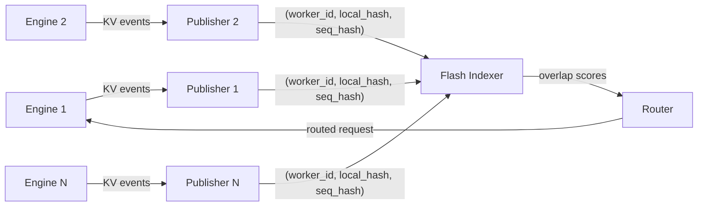
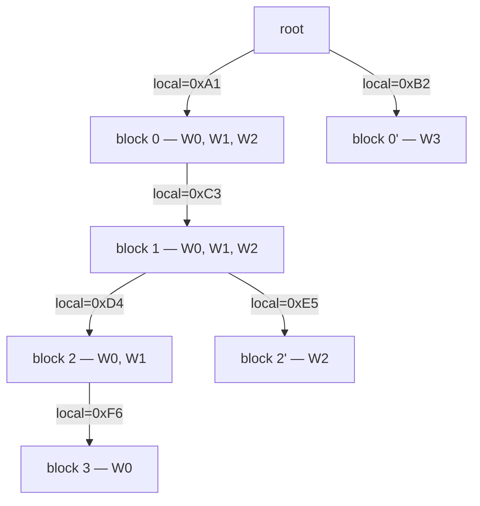
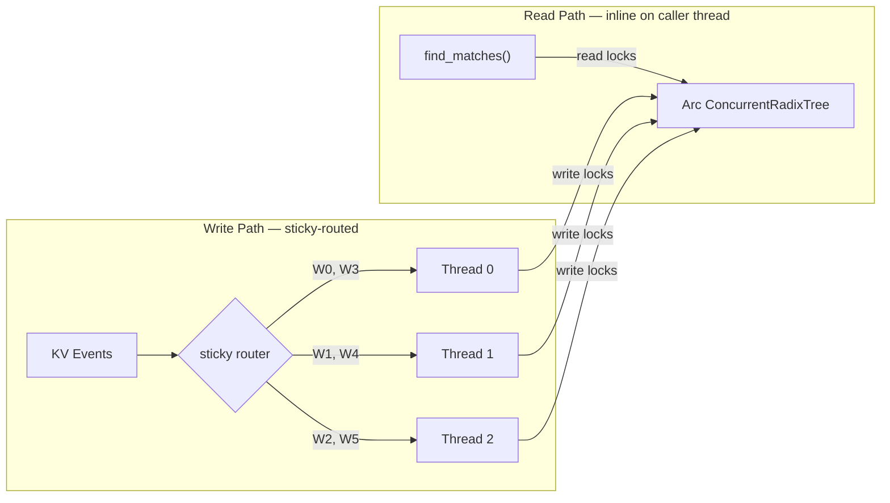
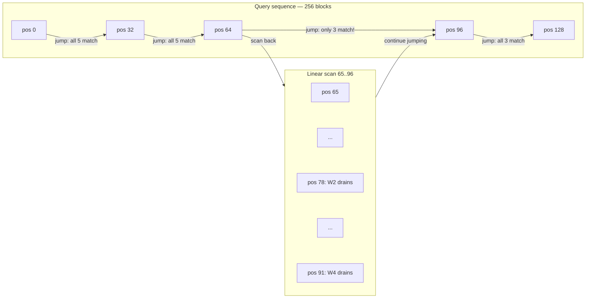

# Flash Indexer: A Story of Inter-Galactic KV Routing

Modern LLM inference doesn't happen on a single GPU anymore. A production deployment might have dozens---sometimes hundreds---of inference workers, each holding a pool of cached key-value (KV) tensors in GPU memory. When a new request arrives whose prompt shares a prefix with a previously seen request, re-using that cached KV data can skip an enormous amount of redundant computation. This is *KV cache reuse*, and at scale it is the single largest lever for inference throughput.

But here's the problem: which worker has the blocks you need?

Each worker knows about its own cache. Nobody has the global picture. To route a request to the worker with the best prefix overlap, or to orchestrate block transfers between workers, or to schedule distributed prefills---you need a **global index** of every cached block across every worker. And you need it to be *fast*: every microsecond spent in the index is a microsecond not spent generating tokens.

This is the story of how we built that index---the **Flash Indexer**---evolving through six iterations from a Python dictionary to a concurrent, jump-optimized spatial index clocking in at over 10 million operations per second with p99 latency under 1 microsecond.

---

## Background

### The Anatomy of a KV Block

Every block in the system carries a few pieces of identity:

- **Local block hash** (`u64`): A hash of the tokens *within* a single block (e.g., 64 tokens). Content-addressable---two blocks with the same tokens have the same local hash, regardless of where they appear in a sequence.

- **External sequence block hash** (`u64`): A cumulative rolling hash of the entire sequence up to and including this block. This is what makes a block's identity *positional*: two blocks with identical tokens but different prefixes produce different sequence hashes.

  ```
  seq_hash[0] = local_hash[0]
  seq_hash[i] = hash(seq_hash[i-1] || local_hash[i])
  ```

- **Locale info**: Where the block physically lives. This includes the worker instance, data-parallel rank, LoRA adapter, storage medium, and more. For simplicity, we'll just consider *worker identity* throughout this post.

> **A note on the contract.** If the inference engine follows the hashing contract we expect---using the same rolling hash algorithm as the indexer---then the external sequence hash is simply the deterministic composition of local hashes. We can recompute it on the indexer side and never need the engine to send it explicitly. In practice, engines may use their own internal hashing, so the system handles both cases.

An external component---the **publisher**---coordinates with the inference engine to relay KV events to the indexer. Each event contains, at minimum, a worker ID, the local block hash, and the external sequence block hash.



The indexer's job: ingest these events as fast as they arrive, and answer **prefix match queries**---given a sequence of local hashes representing an incoming request, which workers have a matching prefix, and how deep does the match go?

---

## 1. Your Leetcode DSA

The simplest possible index is a nested dictionary. For each worker, store a mapping from local block hash to external sequence hash. To find matches, iterate every worker and walk through the query sequence, checking for hits.

```python
class KvIndex:
    # worker_id -> { local_hash -> external_seq_hash }
    index: dict[int, dict[int, int]] = {}

    def store(self, worker_id: int, blocks: list[tuple[int, int]]):
        if worker_id not in self.index:
            self.index[worker_id] = {}
        for local_hash, seq_hash in blocks:
            self.index[worker_id][local_hash] = seq_hash

    def remove(self, worker_id: int, seq_hashes: list[int]):
        if worker_id not in self.index:
            return
        for seq_hash in seq_hashes:
            # linear scan to find by value... not great
            self.index[worker_id] = {
                k: v for k, v in self.index[worker_id].items()
                if v != seq_hash
            }

    def find_matches(self, query: list[int]) -> dict[int, int]:
        """Returns { worker_id: match_depth }"""
        scores = {}
        for worker_id, blocks in self.index.items():
            depth = 0
            for local_hash in query:
                if local_hash in blocks:
                    depth += 1
                else:
                    break
            if depth > 0:
                scores[worker_id] = depth
        return scores
```

This works. It's also `O(W × D)` for every `find_matches` call, where `W` is the number of workers and `D` is the query depth. With hundreds of workers and sequences thousands of blocks long, this is a non-starter for a hot-path that runs on every incoming request.

But it's a good starting point. Let's bring it to a language that takes performance seriously.

---

## 2. Into Rust Land

Rust gives us zero-cost abstractions, fine-grained control over memory layout, and---crucially---a type system that makes data races a compile-time error rather than a 3 AM production incident. No garbage collector, no stop-the-world pauses, no reference counting overhead on the hot path unless we explicitly opt in. For a data structure that needs to handle millions of operations per second, this matters.

The Python dict translates directly to Rust's `HashMap`:

```rust
struct KvIndex {
    // worker -> (local_hash -> seq_hash)
    index: HashMap<WorkerId, HashMap<LocalHash, ExternalHash>>,
}
```

But there's an immediate problem. This indexer doesn't live in isolation---it sits inside a router that is receiving KV events from many workers *while simultaneously* serving `find_matches` requests from incoming inference traffic. Multiple threads need to read and write this structure concurrently. Rust's ownership model won't let you hand out `&mut self` to multiple threads, and it shouldn't---that would be a data race waiting to happen.

### The Actor Pattern

The straightforward solution is to not share the data structure at all. Instead, put it behind a **single-threaded actor**: one dedicated OS thread that owns the index exclusively, communicating with the outside world through message channels.

```rust
// Channels for communication
let (event_tx, event_rx) = mpsc::channel::<RouterEvent>(2048);
let (match_tx, match_rx) = mpsc::channel::<MatchRequest>(128);

std::thread::spawn(move || {
    let runtime = tokio::runtime::Builder::new_current_thread()
        .enable_all()
        .build()
        .unwrap();

    runtime.block_on(async move {
        let mut index = KvIndex::new();

        loop {
            tokio::select! {
                Some(event) = event_rx.recv() => {
                    index.apply_event(event);
                }
                Some(req) = match_rx.recv() => {
                    let scores = index.find_matches(&req.sequence);
                    let _ = req.reply.send(scores);
                }
            }
        }
    });
});
```

The actor serializes all access---both reads and writes---through a single thread. No locks, no contention, no data races by construction. The index can remain a plain, non-thread-safe `HashMap` because only one thread ever touches it.

This is clean, correct, and simple. But it has an inherent throughput ceiling: every `find_matches` call must queue behind every pending write, and vice versa. The single thread is the bottleneck. We'll revisit this.

---

## 3. The Inversion

The nested dictionary `worker -> { hash -> ... }` forces `find_matches` to iterate over every worker. If you have 100 workers, you're doing 100 traversals of the query sequence. But think about what we're actually asking: "which workers have this block?" That's a question about a *block*, not a worker.

Invert the index. Instead of iterating workers and checking blocks, we build a forward index keyed by `LocalHash` that maps directly to the set of workers holding that block. We also keep the per-worker `lookup` table as the authoritative record for event processing---adds and removes go through `lookup`, and the forward `index` is updated alongside it.

```rust
struct KvIndex {
    // Forward index: local_hash -> set of workers (fast reads)
    index: HashMap<LocalHash, HashSet<WorkerId>>,
    // Reverse lookup: worker -> (seq_hash -> local_hash) (authoritative for writes)
    lookup: HashMap<WorkerId, HashMap<ExternalHash, LocalHash>>,
}
```

On a KV event, we update both structures: insert into `lookup[worker][seq_hash]` and add the worker to `index[local_hash]`. On removal, reverse the process.

Now `find_matches` traverses the query sequence once, looking up the worker set at each position via the forward `index`. Workers can only *drop out* as you go deeper (if a worker doesn't have a block at position `i`, it certainly doesn't have the continuation at position `i+1`). The total set-intersection work across all levels is bounded by `W`---each worker is "drained" from the active set at most once---giving us `O(D + W)` instead of `O(W × D)`.

```rust
fn find_matches(&self, query: &[LocalHash]) -> HashMap<WorkerId, u32> {
    let mut scores = HashMap::new();
    let Some(active) = self.index.get(&query[0]) else {
        return scores;
    };
    let mut active = active.clone();

    for (depth, local_hash) in query.iter().enumerate() {
        let Some(workers_here) = self.index.get(local_hash) else {
            break; // no workers have this block -- everyone drains
        };
        let drained: Vec<_> = active.iter()
            .filter(|w| !workers_here.contains(w))
            .copied()
            .collect();
        for w in drained {
            active.remove(&w);
            scores.insert(w, depth as u32);
        }
    }
    for w in active {
        scores.insert(w, query.len() as u32);
    }
    scores
}
```

This is a big win. But there's a collision problem hiding in the forward index.

Local hashes can be **chunk hashes**: hashes of just the tokens within one block, with no rolling context from the prefix. This is attractive because it means the relay publisher---the component that sits between the engine and the indexer, and shares the indexer's hashing contract---doesn't need to compute a rolling hash at all. Less work on the relay side, simpler integration.

The problem: chunk hashes are collision-prone. Two completely different sequences can share identical blocks at the same position (think common system prompts, shared preambles, etc.). The forward `index` keyed on `LocalHash` conflates them---a worker that cached "Hello, how can I help you?" as block 0 in one conversation will appear as a match for *every* conversation that starts with the same tokens, even if the continuations diverge entirely.

The `lookup` table, keyed by `ExternalHash` (rolling hash of the entire prefix), doesn't have this problem---it's collision-free by construction. But the `lookup` is per-worker, so we can't query it without iterating workers, which is exactly what we're trying to avoid. The fast path (`index`) is imprecise; the precise path (`lookup`) is slow.

We're stuck. The forward index gives us speed but risks false matches. We need a data structure that can give us both: fast traversal *and* collision safety. That's where the tree comes in.

---

## 4. Branching Out

Section 3 left us with a tension: the forward index gives fast traversal but suffers from chunk hash collisions, while the per-worker lookup is precise but per-worker. We also have a scaling problem---the flat `HashMap` grows into a massive table where every `find_matches` call does `D` independent lookups. At millions of entries, these are not the theoretical O(1) we learned in school: cache line misses dominate, and probe sequences get longer as the load factor climbs.

What if we could solve both problems at once---collision safety *and* cache-friendly traversal---by walking a path through a tree?

### The Radix Tree

A radix tree (prefix tree) encodes parent-child relationships explicitly. Each node has a small `HashMap` of children keyed by `LocalHash`, plus a set of workers that have this block cached. To process a `find_matches` query, you start at the root and follow child pointers---each lookup is into a tiny per-node children map, not one global table.

Crucially, the tree structure *scopes* the collision risk. Two blocks with the same `LocalHash` (chunk hash collision) can only collide if they are children of the *same parent*. Different prefixes lead to different parents, so they're naturally separated in the tree. And each node carries an `ExternalHash`---the rolling hash of the entire prefix---so even in the rare case of a true collision under the same parent, the per-worker lookup table can disambiguate.

This requires one new piece of information in KV events: the **parent hash**. Without it, we can't link child to parent. With it, the tree builds itself naturally as events arrive.



Each node stores an `ExternalHash` alongside the worker set. The per-worker **lookup table**---`HashMap<Worker, HashMap<SeqHash, SharedBlock>>`---provides collision-free O(1) access for event processing. When a `Stored` event arrives, we find the parent node via `lookup[worker][parent_seq_hash]` and attach the new child. When a `Removed` event arrives, we find the node by `lookup[worker][seq_hash]` and remove the worker from it.

Even if two nodes share the same `LocalHash` (chunk hash collision), the `ExternalHash` in the lookup table disambiguates them. Two complementary keys for two access patterns: tree traversal by local hash for reads, lookup table by sequence hash for writes.

### Rc and RefCell

Both the tree and the lookup table need to point to the same node. In Rust, you can't just hand out multiple mutable references to the same allocation---the borrow checker won't let you. For a single-threaded context (we're still inside the actor), the standard solution is `Rc<RefCell<T>>`:

- `Rc` (reference-counted pointer): multiple owners of the same allocation, with a runtime reference count. Cheap---no atomic operations needed because it's single-threaded.
- `RefCell` (interior mutability): lets you borrow the contents mutably at runtime, with a panic if you violate the borrowing rules. The borrow check moves from compile time to runtime.

```rust
type SharedRadixBlock = Rc<RefCell<RadixBlock>>;

struct RadixBlock {
    children: HashMap<LocalHash, SharedRadixBlock>,
    workers: HashSet<WorkerWithDpRank>,
    block_hash: Option<ExternalHash>,
}

struct RadixTree {
    root: SharedRadixBlock,
    // Per-worker lookup: worker -> (seq_hash -> node)
    lookup: HashMap<WorkerWithDpRank, HashMap<ExternalHash, SharedRadixBlock>>,
}
```

The tree now lives happily behind the actor. `find_matches` walks the tree from root to leaf, intersecting worker sets at each level. Event processing uses the lookup table for O(1) parent/block access. The children maps at each node are small---bounded by the branching factor at that position, not the total number of blocks in the system.

---

## 5. Breaking the Bottleneck

The actor pattern gave us correctness, but at a cost: every operation---reads *and* writes---is serialized through a single thread. `find_matches` is the hot path (called on every incoming request), and it's now stuck behind a channel `recv()` in a queue with all the KV events. Under heavy load, this is the bottleneck.

The insight: reads don't conflict with each other. If we can make the tree thread-safe for concurrent reads, we can execute `find_matches` *inline* on the caller's thread and skip the channel entirely.

### From Rc to Arc, from RefCell to RwLock

The upgrade is mechanical:

- `Rc<RefCell<T>>` → `Arc<RwLock<T>>`: atomic reference counting + reader-writer lock. Multiple threads can hold read locks simultaneously; writes take an exclusive lock.
- `HashMap` lookup → `DashMap`: a sharded concurrent hash map. Each shard has its own lock, distributing contention.

```rust
type SharedBlock = Arc<RwLock<Block>>;

struct ConcurrentRadixTree {
    root: SharedBlock,
    lookup: DashMap<WorkerWithDpRank, RwLock<HashMap<ExternalHash, SharedBlock>>>,
}
```

Now `find_matches` acquires only read locks as it walks the tree. Multiple requests can traverse concurrently without blocking each other.

But writes are trickier. KV events for a given worker must be applied *sequentially*---a `Stored` event that references a parent block must see that parent already in the tree. We can't just throw events at the tree from arbitrary threads.

### Sticky Routing

Enter the `ThreadPoolIndexer`: a pool of OS threads, each running a blocking receive loop. The key trick is **sticky routing**---each `WorkerId` is deterministically assigned to one thread via a `DashMap<WorkerId, usize>` mapping. Events for the same worker always land on the same thread.



```rust
async fn apply_event(&self, event: RouterEvent) {
    let worker_id = event.worker_id;

    // Sticky assignment: same worker always goes to same thread
    let thread_idx = *self.worker_assignments
        .entry(worker_id)
        .or_insert_with(|| {
            let idx = self.counter.fetch_add(1, Ordering::Relaxed);
            idx % self.num_workers
        });

    self.channels[thread_idx].send(Some(event));
}
```

Since events for a given worker are serialized on one thread, there is no write-write contention on that worker's subtree. This means the inner `RwLock<HashMap<...>>` per worker in the lookup table almost never contends on writes---we chose `RwLock` over `Mutex` precisely because the access pattern, by construction, has no write contention. Reads (from `find_matches`) can proceed in parallel with writes to different workers.

The actor pattern is gone for reads. `find_matches` touches the shared `Arc<ConcurrentRadixTree>` directly, on the caller's thread, with zero channel overhead.

---

## 6. The Leap

The concurrent radix tree eliminated the actor bottleneck. But `find_matches` still walks the tree node by node, following pointers from parent to child. Each step is a pointer dereference into a different heap allocation---cache-hostile, and fundamentally sequential. You can't skip ahead to position 128 without first visiting positions 0 through 127.

Unless you rethink the data structure entirely.

### Position as a First-Class Dimension

What if, instead of encoding parent-child relationships in a tree, we used a flat map with a compound key: `(position, local_hash)`?

```rust
struct PositionalIndexer {
    // (position, local_hash) -> SeqEntry
    index: DashMap<(usize, LocalHash), SeqEntry>,
    // Per-worker reverse lookup for event processing
    worker_blocks: DashMap<WorkerWithDpRank, RwLock<HashMap<SeqHash, (usize, LocalHash)>>>,
    jump_size: usize,
}
```

With position in the key, you can look up *any* position in O(1)---no traversal required. Position 0, position 64, position 128: all equally cheap. This is **spatial indexing**: treating the block sequence as a coordinate space rather than a linked structure.

The `SeqEntry` enum handles the collision story from earlier. In the common case, a given `(position, local_hash)` pair has exactly one sequence hash---so we store it inline without allocating a `HashMap`. Only when multiple prefixes produce the same chunk hash at the same position do we upgrade to a multi-entry map.

```rust
enum SeqEntry {
    // Common case: one seq_hash, no HashMap allocation
    Single(ExternalHash, HashSet<WorkerWithDpRank>),
    // Rare case: multiple prefixes share the same chunk hash at this position
    Multi(HashMap<ExternalHash, HashSet<WorkerWithDpRank>>),
}
```

### Jump Search

Random-position access unlocks the signature optimization: **jump search**. Instead of checking every position sequentially, jump ahead by `jump_size` positions (e.g., 32) and check if all active workers still match at the destination.



The algorithm:

1. Initialize the active worker set from position 0.
2. Jump ahead by `jump_size` positions.
3. At the jump destination, count how many active workers still match (cardinality check---no need to clone the set).
4. If all workers match: keep jumping. Skip all intermediate positions.
5. If some workers dropped: linear scan the skipped range to find the exact drain points.
6. Repeat until the sequence is exhausted.

```rust
while current_pos < len - 1 && !active.is_empty() {
    let next_pos = (current_pos + self.jump_size).min(len - 1);

    let num_workers_at_next = self
        .count_workers_at(next_pos, local_hashes[next_pos], &mut seq_hashes, local_hashes)
        .unwrap_or(0);

    if num_workers_at_next == active.len() {
        // All active workers match at the jump destination -- skip ahead
        current_pos = next_pos;
    } else {
        // Some workers dropped -- scan the range to find exact drain points
        self.linear_scan_drain(
            local_hashes, &mut seq_hashes, &mut active, &mut scores,
            current_pos + 1, next_pos + 1, false,
        );
        current_pos = next_pos;
    }
}
```

In the best case (all workers share the full prefix), `find_matches` does `D / J` lookups instead of `D`. In the worst case (workers drop at every jump), it degrades to a linear scan---but no worse than the tree.

### Lazy Hash Computation

One more trick. Most `(position, local_hash)` entries are `SeqEntry::Single`---only one sequence hash at that slot. When we look up a position and find a `Single` entry, we *know* it's the right one (or it's a miss). We can skip computing the query's sequence hash for that position entirely. The sequence hash only needs to be computed---lazily, on demand---when we encounter a `Multi` entry and need to disambiguate.

Since `Multi` entries are rare (they require chunk hash collisions at the same position with different prefixes), this saves hash computation on nearly every position check.

The complexity drops from `O(D × W)` to `O(D/J + W)`, where `J` is the jump size and `W` accounts for the drain bookkeeping. For typical workloads with high prefix sharing, the jump optimization skips the vast majority of positions.

---

## Conclusion

The journey from a Python dictionary to the Flash Indexer spans six iterations, each motivated by a concrete bottleneck in the previous design:

1. **Naive nested dict** --- simple but O(W × D) per query.
2. **Rust + actor pattern** --- fast language, correct concurrency, but single-threaded bottleneck.
3. **Inverted index** --- O(D + W) per query by flipping the key structure; secondary seq_hash layer for chunk-hash collision safety.
4. **Radix tree** --- tree structure replaces giant flat map; per-node children maps stay small; dual-key design (local hash for traversal, seq hash for event processing); `Rc<RefCell<>>` for single-threaded shared ownership.
5. **Concurrent radix tree** --- `Arc<RwLock<>>` + `DashMap`; reads bypass the actor entirely; sticky routing serializes writes per worker with zero contention.
6. **Positional indexer with jump search** --- spatial indexing with `(position, local_hash)` compound keys; O(1) random-position access enables jump optimization; lazy hash computation skips work in the common case.

The result: a combined throughput of over **10 million events + requests per second** with **p99 latency under 1 microsecond**.

And this is just the indexer. Block transfer orchestration, distributed scheduling, and cross-worker cache coordination are next. Stay tuned.
