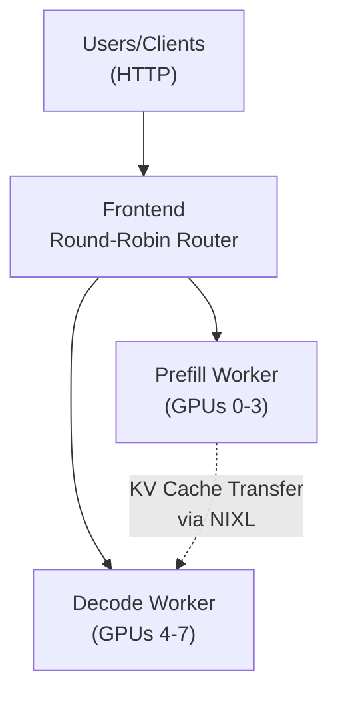

<!--
SPDX-FileCopyrightText: Copyright (c) 2025 NVIDIA CORPORATION & AFFILIATES. All rights reserved.
SPDX-License-Identifier: Apache-2.0
-->

# Running gpt-oss-120b Disaggregated with TensorRT-LLM

Dynamo supports disaggregated serving of gpt-oss-120b with TensorRT-LLM. This guide demonstrates how to deploy gpt-oss-120b using disaggregated prefill/decode serving on a single B200 node with 8 GPUs. In this example, we will run 1 prefill worker on 4 GPUs and 1 decode worker on 4 GPUs.

## Overview

This deployment uses disaggregated serving in TensorRT-LLM where:
- **Prefill Worker**: Processes input prompts efficiently using 4 GPUs with tensor parallelism
- **Decode Worker**: Generates output tokens using 4 GPUs, optimized for token generation throughput
- **Frontend**: Provides OpenAI-compatible API endpoint with round-robin routing

The disaggregated approach optimizes for both low-latency (maximizing tokens per second per user) and high-throughput (maximizing total tokens per GPU per second) use cases by separating the compute-intensive prefill phase from the memory-bound decode phase.

## Prerequisites

- 1x NVIDIA B200 node with 8 GPUs (this guide focuses on single-node B200 deployment)
- CUDA Toolkit 12.8 or later
- Docker with [NVIDIA Container Toolkit](https://docs.nvidia.com/datacenter/cloud-native/container-toolkit/latest/install-guide.html) installed
- Fast SSD storage for model weights (~240GB required)
- HuggingFace account and [access token](https://huggingface.co/settings/tokens)
- [HuggingFace CLI](https://huggingface.co/docs/huggingface_hub/en/guides/cli)

## Instructions

### 1. Pull the gpt-oss Container

> [!IMPORTANT]
> **PLACEHOLDER**: The official gpt-oss-120b container URL will be provided upon release.

```bash
# PLACEHOLDER: Replace with actual container URL when available
export $DYNAMO_CONTAINER_IMAGE="gitlab-master.nvidia.com/dl/ai-dynamo/dynamo-ci/jothomson:orangina-dynamo-release-aarch64"
docker pull $DYNAMO_CONTAINER_IMAGE
```

### 2. (Alternative) Build the Dynamo TensorRT-LLM Container from Source

If you prefer to build from source or need custom modifications, use the provided build scripts:

> [!IMPORTANT]
> **PLACEHOLDER**: Update to public commit hash and remove URL for release.


#### 2a. ARM
```bash
cd $DYNAMO_ROOT

# Build the container with a specific TensorRT-LLM commit
docker build --platform linux/arm64 -f container/Dockerfile.tensorrt_llm_prebuilt . \
  --build-arg BASE_IMAGE=urm.nvidia.com/sw-tensorrt-docker/tensorrt-llm-staging/release \
  --build-arg BASE_IMAGE_TAG=sbsa-ngc-release-torch_skip-5c7cb1d-user_zhanruis_create_ngc_image-590 \
  --build-arg ARCH=arm64 \
  --build-arg ARCH_ALT=aarch64 \
  -t gitlab-master.nvidia.com:5005/dl/ai-dynamo/dynamo-ci/jothomson:orangina-dynamo-release-aarch64

export DYNAMO_CONTAINER_IMAGE=gitlab-master.nvidia.com:5005/dl/ai-dynamo/dynamo-ci/jothomson:orangina-dynamo-release-aarch64
```

#### 2b. x86

```bash
docker build -f container/Dockerfile.tensorrt_llm_prebuilt . --build-arg BASE_IMAGE <base_image> --build-arg BASE_IMAGE_TAG <image_tag> -t orangina-dynamo

export DYNAMO_CONTAINER_IMAGE=orangina-dynamo
```


### 3. Download the Model

#### Step 3a: Requesting Access to Model

> [!IMPORTANT]
> **PLACEHOLDER**: Model access details will be updated upon release.

Access to gpt-oss-120b model checkpoints must be requested through the [HuggingFace Model page](https://huggingface.co/<PLACEHOLDER_HUGGINGFACE_GPT_OSS_120B_PATH>). The approval process is not automatic and could take a day or more.

A HuggingFace account is required to accept the license agreement, and you will need to [create a HuggingFace access token](https://huggingface.co/settings/tokens) to download the model weights.

#### Step 3b: Setting your HuggingFace Token

Set your HuggingFace token as an environment variable:

```bash
export HF_TOKEN="hf_YOUR_ACTUAL_TOKEN_HERE"
```

#### Step 3c: Download the Model

```bash
# PLACEHOLDER: Replace with actual HuggingFace model path
export MODEL_PATH=<PLACEHOLDER_HUGGINGFACE_GPT_OSS_120B_PATH>

# Download the model (ensure you have sufficient disk space ~240GB)
huggingface-cli download $MODEL_PATH --local-dir /path/to/gpt-oss-120b
```

```bash
# /tmp/ngc-cli/ngc registry model download-version "lhjt5vgezcyq/openai/orangina-open-weight-model-pre-release-random-weight:v3"
export MODEL_PATH=/home/scratch.nealv_sw/models/omodel/orangina-120b-final-weights_vv1
```

### 4. Run the Container

Launch the Dynamo TensorRT-LLM container with the necessary configurations:

```bash
docker run \
    --gpus all \
    -it \
    --rm \
    --network host \
    --volume $MODEL_PATH:/model \
    --shm-size=10G \
    --ulimit memlock=-1 \
    --ulimit stack=67108864 \
    --ulimit nofile=65536:65536 \
    --cap-add CAP_SYS_PTRACE \
    --ipc host \
    -e HF_TOKEN=$HF_TOKEN \
    -e TRTLLM_ENABLE_PDL=1 \
    -e TRT_LLM_DISABLE_LOAD_WEIGHTS_IN_PARALLEL=True \
    $DYNAMO_CONTAINER_IMAGE
```

This command:
- Automatically removes the container when stopped (`--rm`)
- Allows container to interact with host's IPC resources for optimal performance (`--ipc=host`)
- Runs the container in interactive mode (`-it`)
- Sets up shared memory and stack limits for optimal performance
- Mounts your model directory and cache directory to avoid re-downloading
- Enables [PDL](https://docs.nvidia.com/cuda/cuda-c-programming-guide/index.html#programmatic-dependent-launch-and-synchronization) and disables parallel weight loading
- Sets HuggingFace token as environment variable in the container

Inside the container, navigate to the TensorRT-LLM backend directory:
```bash
cd components/backends/trtllm
```

### 5. Understanding the Configuration Files

The deployment uses two configuration files for prefill and decode workers:

#### Prefill Configuration (`engine_configs/gpt_oss/prefill.yaml`)
- `tensor_parallel_size: 4` - Uses 4 GPUs for tensor parallelism
- `moe_expert_parallel_size: 4` - Expert parallelism across 4 GPUs
- `enable_attention_dp: false` - Attention data parallelism disabled
- `max_num_tokens: 16384` - Maximum tokens for prefill processing
- `enable_chunked_prefill: true` - Enables efficient chunked prefill
- `disable_overlap_scheduler: true` - Disables overlapping for prefill worker
- `backend: pytorch` - Uses PyTorch backend for model execution
- `trust_remote_code: true` - Allows loading custom model code
- `free_gpu_memory_fraction: 0.8` - Allocates 80% of GPU memory for KV cache
- `moe_config.backend: CUTLASS` - Uses optimized CUTLASS kernels for MoE
- `cache_transceiver_config.backend: ucx` - Uses UCX for efficient KV cache transfer
- `cuda_graph_config.max_batch_size: 32` - Maximum batch size for CUDA graphs

#### Decode Configuration (`engine_configs/gpt_oss/decode.yaml`)
- `tensor_parallel_size: 4` - Decode worker uses 4 GPUs
- `moe_expert_parallel_size: 4` - Expert parallelism across 4 GPUs
- `enable_attention_dp: true` - Attention data parallelism enabled
- `disable_overlap_scheduler: false` - Enables overlapping for decode efficiency
- `backend: pytorch` - Uses PyTorch backend for model execution
- `trust_remote_code: true` - Allows loading custom model code
- `free_gpu_memory_fraction: 0.8` - Allocates 80% of GPU memory for KV cache
- `moe_config.backend: CUTLASS` - Uses optimized CUTLASS kernels for MoE
- `cache_transceiver_config.backend: ucx` - Uses UCX for efficient KV cache transfer
- `cuda_graph_config.max_batch_size: 128` - Maximum batch size for CUDA graphs
- `max_num_tokens: 16384` - Maximum tokens for decode processing

### 6. Launch the Deployment

You can use the provided launch script or run the components manually:

#### Option A: Using the Launch Script

```bash
./launch/gpt_oss_disagg.sh
```

#### Option B: Manual Launch

1. **Clear namespace and start frontend**:
```bash
# Clear any existing deployments
python3 utils/clear_namespace.py --namespace dynamo

# Start frontend with round-robin routing
python3 -m dynamo.frontend --router-mode round-robin --http-port 8000 &
```

2. **Launch prefill worker**:
```bash
CUDA_VISIBLE_DEVICES=0,1,2,3 python3 -m dynamo.trtllm \
  --model-path /model \
  --served-model-name gpt-oss-120b \
  --extra-engine-args engine_configs/gpt_oss/prefill.yaml \
  --disaggregation-mode prefill \
  --disaggregation-strategy prefill_first \
  --max-num-tokens 20000 \
  --max-batch-size 32 \
  --free-gpu-memory-fraction 0.9 \
  --tensor-parallel-size 4 \
  --expert-parallel-size 4 &
```

3. **Launch decode worker**:
```bash
CUDA_VISIBLE_DEVICES=4,5,6,7 python3 -m dynamo.trtllm \
  --model-path /model \
  --served-model-name gpt-oss-120b \
  --extra-engine-args engine_configs/gpt_oss/decode.yaml \
  --disaggregation-mode decode \
  --disaggregation-strategy prefill_first \
  --max-num-tokens 16384 \
  --max-batch-size 128 \
  --free-gpu-memory-fraction 0.9 \
  --tensor-parallel-size 4 \
  --expert-parallel-size 4
```

### 7. Test the Deployment

Send a test request to verify the deployment:

```bash
curl -X POST http://localhost:8000/v1/chat/completions \
  -H 'Content-Type: application/json' \
  -d '{
    "model": "gpt-oss-120b",
    "messages": [
      {"role": "system", "content": "You are a helpful assistant."},
      {"role": "user", "content": "Explain the concept of disaggregated serving in LLM inference."}
    ],
    "stream": false,
    "max_tokens": 200
  }'
```

The server exposes a standard OpenAI-compatible API endpoint that accepts JSON requests. You can adjust parameters like `max_tokens`, `temperature`, and others according to your needs.

## Benchmarking

```bash
genai-perf profile \
    --model orangina \
    --tokenizer /scratch/omodel/orangina-120b-final-weights_vv1  \
    --endpoint-type chat \
    --endpoint /v1/chat/completions \
    --streaming \
    --url localhost:8000 \
    --synthetic-input-tokens-mean 1000 \
    --synthetic-input-tokens-stddev 0 \
    --output-tokens-mean 2000 \
    --output-tokens-stddev 0 \
    --extra-inputs max_tokens:2000 \
    --extra-inputs min_tokens:2000 \
    --extra-inputs ignore_eos:true \
    --extra-inputs "{\"nvext\":{\"ignore_eos\":true}}" \
    --concurrency 2048 \
    --request-count 6144 \
    --warmup-request-count 1000 \
    --num-dataset-entries 8000 \
    --random-seed 100 \
    --artifact-dir /scratch/orangina/genai/artifacts/trtllm-base-1k-2k \
    -- \
    -v \
    --max-threads 500 \
    -H 'Authorization: Bearer NOT USED' \
    -H 'Accept: text/event-stream'
```

## Architecture Overview

The disaggregated architecture separates prefill and decode phases:



## Key Features

1. **Disaggregated Serving**: Separates compute-intensive prefill from memory-bound decode operations
2. **Optimized Resource Usage**: Different parallelism strategies for prefill vs decode
3. **Scalable Architecture**: Easy to adjust worker counts based on workload
4. **TensorRT-LLM Optimizations**: Leverages TensorRT-LLM's efficient kernels and memory management

## Troubleshooting

### Common Issues

1. **CUDA Out-of-Memory Errors**
   - Reduce `max_num_tokens` in configuration files (currently set to 16384)
   - Adjust `free_gpu_memory_fraction` in kv_cache_config to a lower value (e.g., 0.7, currently 0.8)
   - Ensure model checkpoints are compatible with the expected format

2. **Workers Not Connecting**
   - Ensure etcd and NATS services are running: `docker ps | grep -E "(etcd|nats)"`
   - Check network connectivity between containers
   - Verify CUDA_VISIBLE_DEVICES settings match your GPU configuration
   - Check that no other processes are using the assigned GPUs

3. **Performance Issues**
   - Monitor GPU utilization with `nvidia-smi` while the server is running
   - Check worker logs for bottlenecks or errors
   - Adjust chunked prefill settings based on your workload
   - For connection issues, ensure port 8000 is not being used by another application

4. **Container Startup Issues**
   - Verify that the NVIDIA Container Toolkit is properly installed
   - Check Docker daemon is running with GPU support
   - Ensure sufficient disk space for model weights and container images

## Next Steps

- **Production Deployment**: For multi-node deployments, see the [Multi-node Guide](../../examples/basics/multinode/README.md)
- **Advanced Configuration**: Explore TensorRT-LLM engine building options for further optimization
- **Monitoring**: Set up Prometheus and Grafana for production monitoring
- **Performance Benchmarking**: Use the provided benchmarking scripts to measure and optimize your deployment
