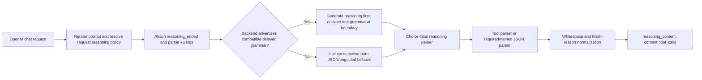

# Guided tool decoding with reasoning: final report

**Date:** 2026-07-01
**Status:** Fixed; automated validation and all four post-review deployment matrices complete.
**Dynamo branch:** `rmccormick/fix-guided-force-reasoning`
**frontend-crates branch:** `rmccormick/fix-minimax-append-reasoning`
**PR/push:** None

## Executive summary

Dynamo dropped `reasoning_content` for `tool_choice=required` and named tools when a force-start reasoning parser was configured. The defect was reproduced on clean Dynamo `main` with the exact requested model:

`nvidia/NVIDIA-Nemotron-3-Nano-30B-A3B-NVFP4`

The corresponding native `vllm serve` deployment, in the same vLLM environment and on the same GPU, preserved reasoning before applying the required-tool grammar. This proved that reasoning and guided decoding are compatible; Dynamo was incorrectly treating them as mutually exclusive.

The long-term fix makes grammar/reasoning coordination an explicit backend capability instead of inferring it from a frontend parser name. Compatible vLLM and SGLang workers publish `reasoning_aware_guided_decoding`; the frontend sends request-local reasoning state and parser kwargs; the backend delays tool grammar until reasoning ends; and the response path independently parses reasoning, content, and tools. Unsupported, incompatible, or unverifiable combinations fail closed.

The work also closes adjacent correctness gaps found during strict review: `tool_choice=auto` separator leakage, optional-reasoner state, MiniMax append-think classification, Nemotron `force_nonempty_content`, special-token preservation, parser alias compatibility, finish reasons, malformed/truncated tool JSON, and structural-tag ownership.

## Reproduction and native references

### Clean-main Dynamo+vLLM reproduction

The clean worktree was based on `3ee35fc8c3260208ee6afb8c5e14279a51174740`. The exact model was deployed with:

- `--dyn-tool-call-parser nemotron_nano`
- `--dyn-reasoning-parser nemotron_v3`
- vLLM `--reasoning-parser nemotron_v3`

Observed before the fix:

| Scenario | Clean-main Dynamo result |
|---|---|
| Required, non-streaming | Correct `get_weather` tool call and `finish_reason=tool_calls`; `reasoning_content=null` after about 185 completion tokens |
| Required, streaming | Correct tool call but no reasoning/content deltas; only the terminal tool response events |
| Auto, tool path | Reasoning and tool call present, but separator-only `content="\n\n"` leaked |
| Auto, direct path | Reasoning and direct answer were present |

No reasoning or tool tags leaked in those baseline Dynamo responses. Merely setting both Dynamo and native reasoning parser arguments did **not** fix the required-tool response: the backend generated reasoning, but Dynamo deliberately bypassed its force parser on that path.

### Native vLLM reference

Native `vllm serve` used the same venv, model, GPU, and decoding settings with:

- `--tool-call-parser qwen3_coder`
- `--reasoning-parser nemotron_v3`

Native vLLM returned non-empty `message.reasoning` before the required `get_weather` call. Its structured-output configuration reported `reasoning_parser='nemotron_v3'` and `enable_in_reasoning=False`, meaning grammar masking starts after the reasoner reaches its end boundary.

Two native-reference caveats were separated from the Dynamo bug:

- Native vLLM streaming emitted one `<tool_call>` content delta; Dynamo's tool parser/jail must suppress that delimiter.
- With the parallel-tool grammar enabled, deterministic generation could repeat valid calls to `max_tokens`; `parallel_tool_calls=false` produced one deterministic call for the comparison.

### Native SGLang reference

Native SGLang was run from the separate SGLang venv with native reasoning parser `nemotron_3` and tool parser `qwen3_coder`. It demonstrated that SGLang can also delay guided decoding for Nemotron reasoning. Native SGLang's auto-tool response retained separator-only content; Dynamo's response contract intentionally removes that separator while preserving real narration/direct content.

Final post-review native values are left in the E2E section for the final rerun.

## Root cause

The primary flaw was in the Rust preprocessor's required/named-tool policy:

1. Dynamo saw a force-start parser such as `nemotron_v3`.
2. It assumed guided decoding emitted bare JSON from token zero.
3. It disabled reasoning parsing unconditionally to keep that JSON from being swallowed as reasoning.
4. vLLM had actually delayed the grammar until `</think>`, so valid pre-grammar reasoning was generated and then discarded by Dynamo.

That rule conflated two independent facts:

- how the **response parser** initializes its state; and
- whether the **backend grammar engine** can defer constraints until reasoning ends.

Deleting the skip was not sufficient. Older backends and unsupported parser combinations can still apply JSON grammar at token zero. A force parser would then classify the guided JSON as reasoning. The correct discriminator is an authoritative backend capability plus request-local reasoning state.

Several secondary defects shared the same underlying problem: parser format, request activation, grammar phase, and response ownership were represented in separate ad hoc conditionals. This caused optional Qwen-style parsers to inherit force defaults, auto structural tags to suppress possible reasoning, and native aliases such as MiniMax append-think to select the wrong response adapter.

## Final architecture

### Fail-closed backend capability

The runtime key is `reasoning_aware_guided_decoding`.

vLLM advertises it only when:

- a native structured-output reasoner is configured;
- the native and Dynamo parser aliases describe the same wire format;
- `enable_in_reasoning` is false; and
- the native parser can actually signal a reasoning boundary. Granite is rejected because the installed vLLM parser cannot drive delayed grammar.

SGLang advertises it only when:

- native and Dynamo parser aliases are compatible;
- the grammar backend is a supported built-in implementation;
- the native reasoning end marker is a single token;
- tokenizer/grammar prerequisites pass, including xgrammar compatibility;
- `async_generate` supports request-local `require_reasoning`; and
- the execution path actually applies grammar masks. Diffusion/dLLM and unverified multimodal encode-only paths fail closed.

Missing metadata, unsupported installed parsers, incompatible frontend overrides, text/tokenizer modes that bypass Dynamo parsing, and explicit special-token stripping all fail closed rather than returning silently corrupted fields.

### Request-local reasoning policy

The frontend now carries two ordered fields to every applicable worker path:

- `reasoning_ended`: whether grammar may begin immediately;
- `reasoning_parser_kwargs.chat_template_kwargs`: the effective request controls used by the native reasoner.

This metadata is forwarded through aggregated, unified, prefill/decode, LoRA, multimodal, and legacy generation paths. Policies cover default-on, explicit opt-in, optional generated-start, always-on, effort-gated, disabled, and post-tool continuation families. Top-level `thinking` and `reasoning_effort` are normalized without overriding explicit template controls.

Required/named structural tags own reasoning only when their grammar actually contains that phase. Auto structural tags do not; when an active reasoner cannot be safely delayed, auto guidance is disabled and the native model format plus response parser are used instead.

### Response parsing

- Rust uses choice-local reasoning parser state and finalizes each choice independently.
- vLLM's Python processor composes upstream unified parser engines, with custom adapters only where Dynamo semantics differ: optional `<think>` starts and MiniMax implicit-start reasoning.
- SGLang uses native reasoner/tool detectors where their structural contract is sufficient and a generic JSON-array parser for required/named fallback.
- Required/named bare JSON is incrementally decoded without leaking partial or malformed JSON into `content`; nested arguments and multiple calls are supported.
- Separator-only text is deferred until the next semantic event: discarded for tool-only output, retained for direct answers and narration.
- Finish reasons become `tool_calls` only after a tool is emitted; backend errors and truncation remain distinguishable.
- Parser-dependent special tokens remain visible to parsers but are removed from OpenAI response fields.

## Parser/backend coverage

### Reasoning parser families

| Dynamo parser aliases | Request policy / format | vLLM native | SGLang native |
|---|---|---|---|
| `basic` | Optional generated/prompt `<think>` | `qwen3` with Dynamo optional adapter | `qwen3` with rendered-prompt state |
| `deepseek_r1` | Force-start; request-disable supported | `deepseek_r1` | `deepseek-r1` |
| `deepseek_v3`, `_v3_1`, `_v3_2` | Explicit opt-in; force-start when enabled | `deepseek_v3` | `deepseek-v3` |
| `deepseek_v4`, `deepseek-v4`, `deepseekv4` | Default-on, prompt-delimited; request-disable supported | `deepseek_v4` | `deepseek-v4` |
| `gemma4`, `gemma-4` | Explicit opt-in; channel markers | `gemma4` | `gemma4` |
| `glm45` | Default-on `<think>` format | `glm45` | `glm45` |
| `gpt_oss` | Harmony analysis/final channels | `openai_gptoss` | `gpt-oss` |
| `granite` | Textual reasoning/response boundaries | Response parsing only; delayed grammar fails closed | Unsupported in tested SGLang |
| `kimi` | Unicode `◁think▷` boundaries | Unsupported; rejected | `kimi` |
| `kimi_k25` | Force-start `<think>`; post-tool reasoning suppressed | `kimi_k2` | `kimi_k2` |
| `minimax_append_think` | Implicit opening, force-start, generated `</think>` | `minimax_m2_append_think` backend plus Dynamo response adapter | `minimax-append-think` backend plus `deepseek-r1` response detector |
| `minimax_m3`, `minimax-m3` | `<mm:think>`; adaptive/default-on unless disabled | `minimax_m3` | Fails startup on tested SGLang 0.5.14, which lacks the detector |
| `mistral` | `[THINK]`; gated by `reasoning_effort` | `mistral` | `mistral` |
| `nemotron_deci` | Optional `<think>` | `qwen3` with Dynamo optional adapter | `qwen3` with rendered-prompt state |
| `nemotron_nano`, `nemotron3`, `nemotron_v3` | Force-start; `enable_thinking` and `force_nonempty_content` supported | `nemotron_v3` | `nemotron_3` |
| `qwen3` | Default-on; explicit/prompt reasoning boundary | `qwen3` | `qwen3` |
| `step3` | Force-start, generated `</think>` | `step3` | `step3` |

### Tool/reasoning pairings exercised or covered by policy tests

| Family | Dynamo tool parser | Backend tool format | Reasoning parser |
|---|---|---|---|
| Nemotron Nano | `nemotron_nano` | Qwen3-Coder (`qwen3_coder`) | `nemotron_v3` / SGLang `nemotron_3` |
| Qwen3 / Qwen3.5 | `qwen3_coder` | Qwen3-Coder XML | `qwen3` |
| GPT-OSS | `harmony` | vLLM `openai`, SGLang `gpt-oss` | `gpt_oss` |
| DeepSeek V3.x/V4 | Matching `deepseek_*` parser | Backend-specific DeepSeek format | Matching `deepseek_*` reasoner |
| Kimi K2.5 | `kimi_k2` | Kimi tool sections | `kimi_k25` |
| MiniMax M2/M3 | `minimax_m2` / `minimax_m3` | MiniMax XML/namespace format | `minimax_append_think` / `minimax_m3` |
| Gemma 4 | `gemma4` | Gemma structural tokens | `gemma4` |
| Mistral/Magistral | `mistral` | `[TOOL_CALLS]` | `mistral` |

Unsupported Dynamo-only formats remain available on the Rust frontend where safe; Python chat processors reject them at startup if the installed backend has no compatible native detector.

## frontend-crates companion fix

MiniMax append-think required a parser-crate correction. The isolated frontend-crates branch contains:

- Commit `1da1b02` — `fix(parsers): split MiniMax append-think reasoning`
- Branch `rmccormick/fix-minimax-append-reasoning`

`MiniMaxAppendThinkParser` now delegates to the basic `<think>...</think>` parser in force-start mode. It classifies the implicit prefix as reasoning, strips both markers, separates post-boundary content, and delegates batch, streaming, finish, and explicit state changes consistently. Unit tests cover implicit reasoning, boundary splits, content after `</think>`, and tag non-leakage.

Dynamo was validated against this commit through a temporary local `[patch.crates-io]` entry. The local path patch is a validation mechanism only and is not intended to remain in the final Dynamo commit.

## Before/after behavior

| Case | Before | After |
|---|---|---|
| Required/named + force reasoner | Tool call present; reasoning empty | Non-empty reasoning precedes one parsed tool call |
| Auto tool | Separator-only `content` leaked | Tool-only content is null/empty |
| Auto direct answer | Leading whitespace handling depended on chunking | Separate reasoning and real direct content are preserved |
| Optional `basic`/`nemotron_deci` direct output | Static Qwen default could classify direct text as reasoning | Rendered prompt determines initial state |
| MiniMax append-think | Upstream adapters could prepend/leak `<think>` into content | Implicit prefix becomes reasoning; no tags leak |
| Nemotron `force_nonempty_content` | Dynamo+SGLang left terminal text in reasoning | Terminal reasoning moves to content only when no answer/tool exists |
| Unsupported parser/backend | Broken constrained mode could remain reachable | Capability/startup validation fails closed |
| Explicit reasoning disable | Parser/backend state could disagree | Prompt, backend grammar, and response parser all disable together |

## Automated validation

| Suite | Verified result |
|---|---|
| SGLang frontend/backend changed suites | **367 passed** |
| vLLM frontend/backend changed suites | **340 passed, 9 pre-existing skips** |
| Rust postprocessor stream suite | **51 passed** |
| Rust full test compile plus latest reasoning-effort units | **`cargo check --tests` passed; 2 passed** |
| frontend-crates parser suite for commit `1da1b02` | **633 passed, 4 ignored; doctest ignored** |
| Static validation | **Ruff lint/format, Python compileall, Cargo fmt, and `git diff --check` passed** |

Focused regressions cover required, named, auto-tool, auto-direct, stream/non-stream, prompt-injected and generated-start reasoning, disabled reasoning, post-tool continuation, special-token decoding, nested/multiple JSON calls, malformed/truncated output, terminal flushing, multi-choice state, finish reasons, and no-tag-leak assertions.

## Strict review loop

The user-requested review loop was run iteratively across Rust, vLLM Python, SGLang Python, backend capability publication, and the frontend-crates companion patch. Findings were fixed and re-reviewed rather than deferred. The hardening rounds caught:

- root `thinking`/`reasoning_effort` normalization and precedence mismatches;
- optional-parser prompt state versus force-parser defaults;
- auto structural guidance incorrectly owning a possible reasoning prefix;
- incompatible/native alias handling and startup rejection;
- MiniMax append-think response adapters in both Python processors;
- Granite's inability to signal a vLLM structured-output reasoning boundary;
- Nemotron `force_nonempty_content` on SGLang;
- Harmony/Mistral special parser lifecycle and reasoning-disable behavior;
- special-token stripping, finish ordering, whitespace leakage, and truncated JSON recovery.

The final review criterion is behavioral, not just test cleanliness: every live matrix below must show correct field ownership and no reasoning/tool syntax in any OpenAI output field.

## Final E2E matrices

All four final deployments must use isolated backend environments. Dynamo+vLLM and native vLLM must share the vLLM venv; Dynamo+SGLang and native SGLang must share the separate SGLang venv. Use the exact Nemotron model and `parallel_tool_calls=false` for deterministic required-tool comparison.

For every tool case verify non-empty reasoning, exactly one `get_weather` call, null/empty content unless there is real narration, `finish_reason=tool_calls`, and no tags. For direct cases verify non-empty reasoning, visible answer content, no tool calls, `finish_reason=stop`, and no tags.

Final deployments used GPU 1 (`NVIDIA RTX 5880 Ada Generation`). Native and Dynamo vLLM shared the isolated vLLM 0.24.0 venv; native and Dynamo SGLang shared the separate SGLang 0.5.14 venv. The Dynamo+vLLM deployment remains live at `127.0.0.1:28000`.

### Native SGLang final matrix

| Scenario | Final observation |
|---|---|
| Required, non-streaming | Reasoning 1,316 chars; one `get_weather`; empty content; `tool_calls`; no tags |
| Required, streaming | Reasoning 724 chars; one `get_weather`; empty content; `tool_calls`; no tags |
| Auto tool, non-streaming | Reasoning 699 chars; one call; native separator `content="\n"`; `tool_calls`; no tags |
| Auto tool, streaming | Reasoning 699 chars; one call; native separator `content="\n\n"`; `tool_calls`; no tags |
| Auto direct, non-streaming | Reasoning 255 chars; visible answer content; no tools; `stop`; no tags |
| Auto direct, streaming | Reasoning 255 chars; visible answer content; no tools; `stop`; no tags |

### Dynamo+SGLang final matrix

| Scenario | Final observation |
|---|---|
| Required, non-streaming | Reasoning 1,189 chars; one `get_weather`; empty content; `tool_calls`; no tags |
| Required, streaming | Reasoning 1,674 chars; one `get_weather`; empty content; `tool_calls`; no tags |
| Auto tool, non-streaming | Reasoning 1,074 chars; one call; empty content; `tool_calls`; no tags |
| Auto tool, streaming | Reasoning 754 chars; one call; empty content; `tool_calls`; no tags |
| Auto direct, non-streaming | Reasoning 543 chars; visible answer content; no tools; `stop`; no tags |
| Auto direct, streaming | Reasoning 261 chars; visible answer content; no tools; `stop`; no tags |

### Native vLLM final matrix

| Scenario | Final observation |
|---|---|
| Required, non-streaming | Reasoning 647 chars; one `get_weather`; empty content; native `length` finish after valid call; no tags |
| Required, streaming | Reasoning 647 chars; one call; `tool_calls`; native `<tool_call>` content-delta leak |
| Auto tool, non-streaming | Reasoning 628 chars; one call; empty content; `tool_calls`; no tags |
| Auto tool, streaming | Reasoning 628 chars; one call; empty content; `tool_calls`; no tags |
| Auto direct, non-streaming | Reasoning 541 chars; visible answer content; no tools; `stop`; no tags |
| Auto direct, streaming | Reasoning 500 chars; visible answer content; no tools; `stop`; no tags |

The two required-path observations are native vLLM server quirks, not failures of delayed reasoning: both responses contained the complete reasoning and valid call. Dynamo's tool jail removes the streaming delimiter and normalizes its own finish reason.

### Dynamo+vLLM final matrix

| Scenario | Final observation |
|---|---|
| Required, non-streaming | Reasoning 570 chars; one `get_weather`; empty content; `tool_calls`; no tags |
| Required, streaming | Reasoning 1,608 chars; one `get_weather`; empty content; `tool_calls`; no tags |
| Auto tool, non-streaming | Reasoning 630 chars; one call; empty content; `tool_calls`; no tags |
| Auto tool, streaming | Reasoning 630 chars; one call; empty content; `tool_calls`; no tags |
| Auto direct, non-streaming | Reasoning 542 chars; visible answer content; no tools; `stop`; no tags |
| Auto direct, streaming | Reasoning 542 chars; visible answer content; no tools; `stop`; no tags |

Both Dynamo backends pass the strict 6/6 response contract. Across all 12 Dynamo responses, reasoning/content/tools are assigned to the correct fields, tool-only content is empty, finish reasons are correct, and no reasoning or tool syntax leaks.

## Handoff

- Final Dynamo+vLLM deployment: `127.0.0.1:28000`.
- Dynamo and frontend-crates changes are kept on separate local DCO-signed branches; no PR or project-repository push was created.
- The temporary Dynamo Cargo path patch was used for builds/tests only and removed before the Dynamo commit.
