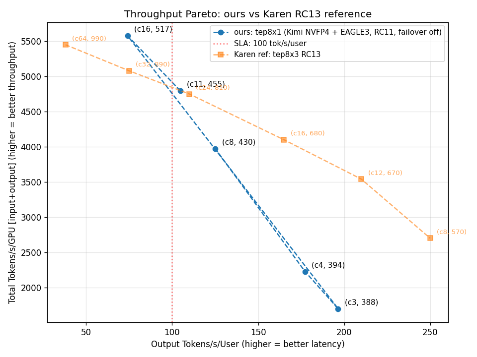
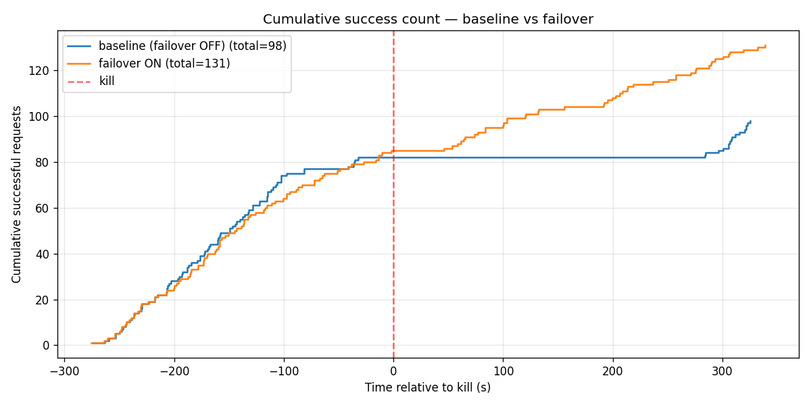
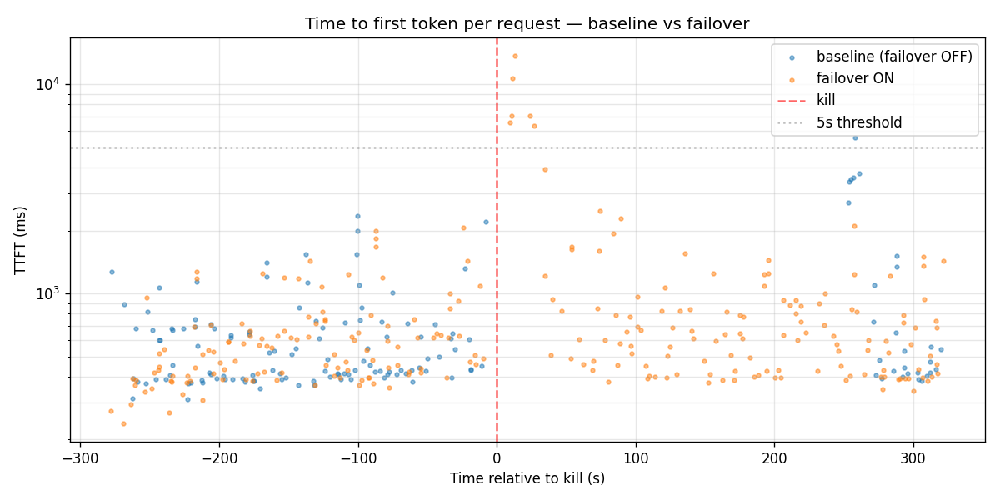
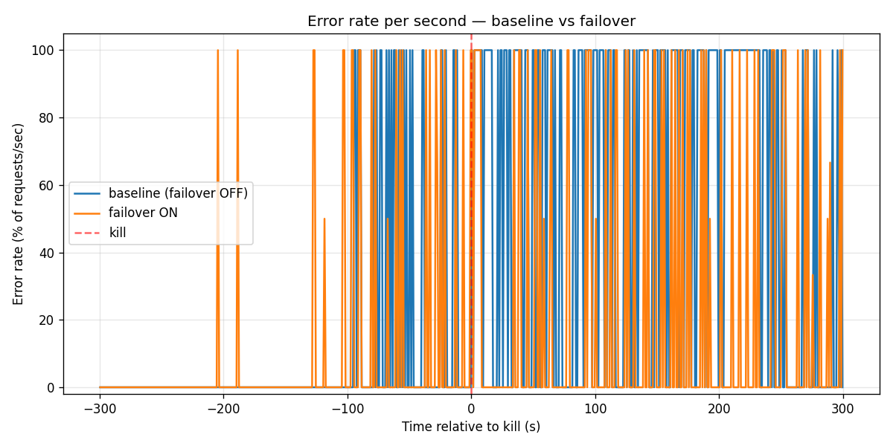
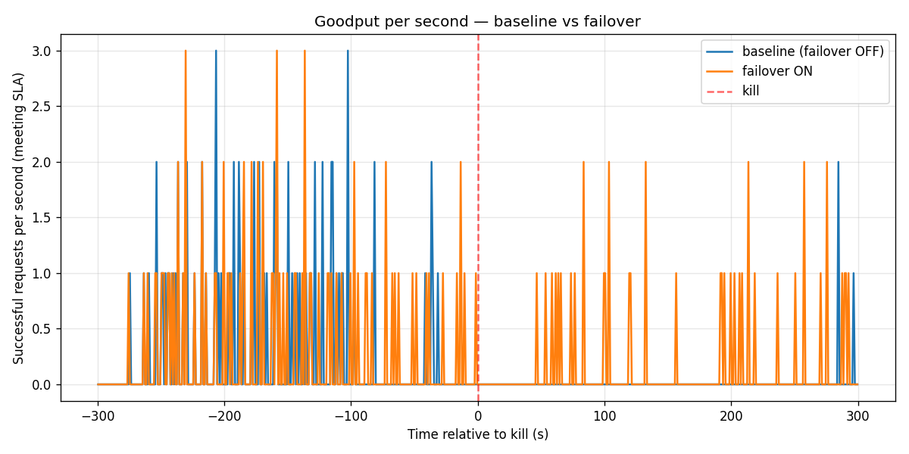

# Failover demo & baseline pareto — chart artifacts

Snapshots of the perf and failover demo runs, captured 2026-04-30 on `nv-prd-dgxc nscale` cluster (B200, 1 worker × 8 GPU = tep8x1).

- **Model**: `nvidia/Kimi-K2.5-NVFP4` + `nvidia/Kimi-K2.5-Thinking-Eagle3`
- **Stack**: dynamo branch `mabdulwahhab/trtllm-failover-build-20260429` (TRT-LLM rc11 fork at SHA `9ba5ee40`, gms-refactor)
- **Workload**: `kv-reuse-difficult_200k-fixed/dataset.jsonl` mooncake-trace replay via aiperf 0.7.0
- **Engine config**: graphs `[1,2,4,8,16,32,64,128]+padding`, autotuner on, chunked_prefill on, overlap on, CUTLASS NVFP4 GEMM, max_batch=128, fp8 KV, `free_gpu_memory_fraction=0.75`, Eagle3 spec decode

---

## Pareto — baseline (failover OFF) vs Karen RC13 reference

5 concurrency points (c3, c4, c8, c11, c16) on our tep8x1 setup, overlaid against Karen's RC13 tep8x3 reference points she shared.

- X axis: `output_token_throughput_per_user` (decode tok/s/user, the SLA metric)
- Y axis: `total_token_throughput / 8 GPUs` (input + output tokens through engine, per GPU — matches Karen's chart axis)
- Red dotted line: 100 tok/s/user SLA threshold

Raw numbers in [pareto/pareto.csv](pareto/pareto.csv).

---

## Failover demo — baseline vs failover, kill at t=0

Two 10-min runs at concurrency 8 against single-worker deployments. Primary worker process killed at t=5:00. Same client load on both, same trace, same SLA.

| | Baseline (failover OFF) | Failover ON |
|---|---|---|
| Total requests | 486 | 271 |
| **Successful requests** | **98** | **131 (+34%)** |
| Errors | 388 | 140 |
| **Time from kill → first successful response** | **284 s** (4m44s) | **46 s** |
| TTFT p50 pre-kill | 456 ms | 519 ms |
| TTFT p50 post-kill | 532 ms | 627 ms |

### Cumulative successful requests

The cleanest view: both lines climb in lockstep pre-kill; baseline flatlines for ~4 minutes; failover dips briefly and resumes within ~50 s.

### TTFT scatter

Each dot is one request's TTFT. Both lines look similar pre-kill. Post-kill: failover scatters resume after a brief gap; baseline shows a long blackout.

### Error rate per second

Baseline pegs to 100% errors during the cold-restart window. Failover briefly spikes for the requests that were in-flight at kill, then drops back to ~0%.

### Goodput per second

Noisy at 1-second bins because Kimi 50K-token completions are sparse (~one every 5-10 s). Cumulative chart above is the better visualization at this completion cadence.

Raw aggregates in [demo-failover/summary.csv](demo-failover/summary.csv).

---

## Methodology

- aiperf args: `--streaming --extra-inputs ignore_eos:true --concurrency 8 --benchmark-duration 600 --benchmark-grace-period 60 --concurrency-ramp-duration 60 --goodput "time_to_first_token:5000 inter_token_latency:10" --workers-max 200 --record-processors 8`
- Kill recipe: `kubectl exec -- kill -9 $(pgrep -f "orted|mpi4py.futures.server")` — destroys MPI worker tree, cascades to parent python via MPI_ABORT, terminates container, K8s restarts (baseline) / failover lock releases (failover)
- "Successful" = `aiperf.metrics.good_request_count >= 1`, i.e. request met both `TTFT ≤ 5000ms` and `ITL ≤ 10ms`
- "First successful response after kill" = smallest `request_end_ns - kill_ns` across all good requests
