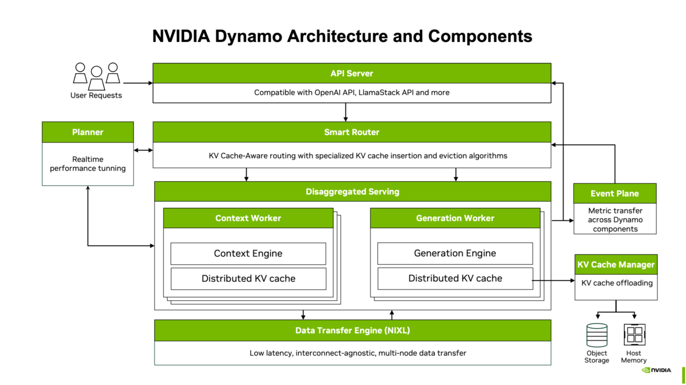

# DEP: Documentation Structure Overhaul

**Status:** Draft
**Area:** docs
**Related:** [#8658 — docs: refactor Kubernetes and update to include v1beta1 DGDR](https://github.com/ai-dynamo/dynamo/issues/8658)

---

## Summary

Restructure the Dynamo documentation site to address a long-standing problem flagged by NVIDIA QA: the docs mix high-level guides with component-specific implementation details and offer no defined path from Concepts to Quick Start to Reference. This DEP proposes a new top-level information architecture that cleanly separates **tutorial** content (how to do things) from **knowledge bank** content (architecture, concepts, components, features), with two parallel tutorial tracks for CLI and Kubernetes usage. The K8s-specific walkthrough rewrite is covered by issue #8658 and slots into the new "Kubernetes Usage" section defined here.

## Motivation

QA feedback: the `docs/` directory mixes high-level guides with component-specific implementation details, with no defined path from Concepts → Quick Start → Reference. Critical configuration options are explained in prose across multiple pages rather than consolidated in reference tables. Users cannot tell whether a given page is meant to teach them how to use Dynamo, explain how it works internally, or serve as a reference they look up later.

Concretely, the current sidebar has several structural problems:

1. **Local and K8s deployment paths are not clearly separated.** It is not obvious that Dynamo can be run either locally or on a Kubernetes cluster, nor which pages are relevant to each path. Kubernetes deployment has its own section, but local deployment content is not elevated to the same level — it is scattered across Getting Started, User Guides, and Backends.

2. **No navigation overview within sections.** Large sections like "Kubernetes Deployment" present a flat list of pages with no landing page explaining which ones to read, in what order, or what each covers. A new user landing on the section sees, for example:

   Quickstart · Installation Guide · Model Deployment Guide · DGDR Reference · Dynamo Operator · Service Discovery · Webhooks · Minikube Setup · Managing Models with DynamoModel · Autoscaling · Rolling Update · Developing with Tilt · Inference Gateway (GAIE) · Snapshot · Shadow Engine Failover · Disagg Communication

   There is no indication of which pages are part of the happy path and which are advanced or optional.

3. **No separation between "do" and "understand".** Tutorials and reference/explanation content are interleaved. A user looking for "how do I deploy on K8s?" lands next to "how does the request plane work internally?".

4. **No distinction between required and optional content.** Tutorials do not signal what is basic/required versus advanced/optional. The K8s section, for example, includes content on optional components (Grove, model caching) and prerequisites (GPU Operator, RDMA) that are never surfaced at the point in the deployment flow where the user needs them.

5. **No top-down conceptual path.** There is no high-level overview that explains how the pieces fit together without requiring the reader to work through all the component and backend documentation. It is not obvious, for instance, that backends are modular or that the profiler and planner are part of the operator. "Design Docs" exists but mixes a big-picture architecture page with deep dives into individual planes and component internals.

6. **"User Guides" is a dumping ground.** It mixes backend tutorials (SGLang/TRT-LLM/vLLM examples), feature explanations (fault tolerance, tool calling, reasoning, LoRA), use-case content (multimodal, diffusion, agents), developer content (writing Python workers, mocker), and observability — none of which belong together.

7. **Cross-cutting features are scattered.** Observability, fault tolerance, benchmarking, tool calling, etc. each have their own ad-hoc home, with no single section a user can scan to see what Dynamo can do.

8. **K8s docs read like an encyclopedia, not a walkthrough.** This is the specific problem covered by #8658: prerequisites (GPU Operator, RDMA, Grove, model caching) are documented somewhere but never surfaced at the point in the deployment flow where the user needs them. The structural changes in this DEP are a precondition for the #8658 rewrite to have a coherent home.

## Proposal

Adopt a new top-level information architecture organized around two tutorial tracks (CLI Usage, Kubernetes Usage) plus a knowledge bank that flows from a high-level overview down through concepts, components, backends, and features.

### Design principles

1. **Tutorials and knowledge bank are clearly separated.** Every page has an obvious type: basic tutorial, advanced tutorial/use case, concept/explanation, or reference. This gives structure to where new pages belong and lets us surface the most important content at the top of the site.

2. **Two tutorial tracks, both first-class.** It should be immediately clear that Dynamo can be run either locally or on a Kubernetes cluster, and that both are supported deployment paths. "CLI Usage" (run processes directly) and "Kubernetes Usage" (apply manifests on a cluster) are top-level peers. Each is slim — get the user to a working deployment, then link out to knowledge content for depth.

3. **Tutorial pages are copy-paste friendly.** Commands should work without modification; user-configurable values (names, namespaces, model IDs) should be set as environment variables at the top of the page. Tutorials explain only what you need to know to complete the task and link out to reference pages for depth.

4. **Knowledge bank follows a "giving a talk" flow.** Architecture Overview (what Dynamo is and what it's made of) → Concepts (what you need to understand first) → Components (the actual pieces of the system) → Backends (engine-specific reference). The diagram below illustrates the intended flow — each concept or component is introduced at a high level, then covered in detail in its own section.

   

5. **Advanced content is organized, not dumped.** "User Guides" currently holds anything that isn't a basic tutorial or reference. This DEP splits that content into: Features (tool calling, fault tolerance, observability reference, benchmarking, LoRA, perf tuning), Applications (multimodal, diffusion, agents), and Integrations (LMCache, FlexKV, custom KV events).

6. **Developer content is segregated.** Contributing, building from source, writing Python workers, mocker, and local K8s dev tooling (Minikube, Tilt) live in a "Developer's Guide" section, not mixed into user-facing tutorials.

### New top-level sections

At a high level, the new structure groups content into four bands:

```
Getting Started
Usage
  ├── CLI Usage
  └── Kubernetes Usage
Architecture Overview          ← section header for the knowledge bank
  ├── Overview                 ← landing page
  ├── Concepts
  ├── Components
  └── Backends
Advanced
  ├── Features
  ├── Applications
  └── Integrations
Developer's Guide
Resources
```

The full page-by-page tree is in the [Proposed navigation tree](#proposed-navigation-tree) below. The table summarizes the purpose and content type of each top-level section:

| Section | Purpose | Content type |
|---|---|---|
| **Getting Started** | Intro + 2 quickstarts (CLI and K8s) | Tutorial |
| **Usage** | Wrapper for the two deployment tutorial tracks | — |
| ↳ CLI Usage | Deploy and run Dynamo locally | Tutorial (slim) |
| ↳ Kubernetes Usage | Deploy on a cluster (this is where #8658 lands) | Tutorial |
| **Architecture Overview** | Section header for the knowledge bank | — |
| ↳ Overview | Landing page: what Dynamo is made of and how the pieces relate | Explanation |
| ↳ Concepts | Deep dives into theory (disagg, distributed runtime, comm planes) | Explanation |
| ↳ Components | How each piece (operator, frontend, router, planner, profiler, KVBM) works | Reference + Explanation |
| ↳ Backends | Engine-specific reference (SGLang, TRT-LLM, vLLM) | Reference + Explanation |
| **Advanced** | Wrapper for features, use cases, and integrations | — |
| ↳ Features | Cross-cutting capabilities (agents, fault tolerance, observability ref, benchmarking, LoRA, perf tuning) | Reference + Explanation |
| ↳ Applications | Use-case domains (multimodal, diffusion, agents) | Explanation |
| ↳ Integrations | Third-party integrations (LMCache, FlexKV, custom KV events) | Reference |
| **Developer's Guide** | Contributing, building, writing workers, mocker, local K8s dev | Tutorial + Reference |
| **Resources** | Support matrix, feature matrix, release artifacts, examples, glossary | Reference |
| **Blog** | Unchanged | Misc |
| **Documentation** | Docs-about-docs | Misc |

### Proposed navigation tree

```
Getting Started
  ├── Introduction                        ← getting-started/introduction.md
  ├── CLI Quickstart                      ← getting-started/quickstart.md
  └── K8s Quickstart                      ← kubernetes/README.md

Usage
  ├── CLI Usage                           ← "do stuff locally" (run processes directly)
  │   ├── Installation                    ← getting-started/local-installation.md
  │   ├── SGLang Deployments              ← backends/sglang/sglang-examples.md
  │   ├── TRT-LLM Deployments            ← backends/trtllm/trtllm-examples.md
  │   ├── vLLM Deployments               ← backends/vllm/vllm-examples.md
  │   └── Observability Setup
  │       ├── Getting Started             ← observability/README.md
  │       └── Prometheus + Grafana        ← observability/prometheus-grafana.md
  └── Kubernetes Usage                    ← "do stuff on a cluster" (kubectl apply, helm install)
      ├── Installation Guide              ← kubernetes/installation-guide.md
      ├── Model Deployment Guide          ← kubernetes/model-deployment-guide.md
      ├── DGDR Reference                  ← kubernetes/dgdr.md
      ├── Observability
      │   ├── Metrics                     ← kubernetes/observability/metrics.md
      │   ├── Logging                     ← kubernetes/observability/logging.md
      │   └── Operator Metrics            ← kubernetes/observability/operator-metrics.md
      ├── Multinode
      │   ├── Multinode Deployments       ← kubernetes/deployment/multinode-deployment.md
      │   ├── Grove                       ← kubernetes/grove.md
      │   └── Topology Aware Scheduling   ← kubernetes/topology-aware-scheduling.md
      └── Cloud Providers
          ├── AWS
          │   ├── EKS Setup               ← kubernetes/cloud-providers/eks/eks.md
          │   ├── EFS                     ← kubernetes/cloud-providers/eks/efs.md
          │   └── ECS                     ← kubernetes/cloud-providers/ecs/ecs.md
          ├── Azure
          │   ├── AKS Setup               ← kubernetes/cloud-providers/aks/aks.md
          │   ├── RDMA / InfiniBand       ← kubernetes/cloud-providers/aks/rdma-infiniband.md
          │   ├── AKS Storage             ← kubernetes/cloud-providers/aks/storage.md
          │   ├── Azure Lustre CSI        ← kubernetes/cloud-providers/aks/azure-lustre-csi.md
          │   └── Spot VMs               ← kubernetes/cloud-providers/aks/spot-vms.md
          └── GCP
              └── GKE Setup               ← kubernetes/cloud-providers/gke/gke.md

Architecture                              ← section header for the knowledge bank
  ├── Overview                            ← landing page (new): what Dynamo is, what it's made of, how the pieces relate
  ├── Concepts                            ← deep dives into the ideas/theory
  │   ├── Architecture Flow               ← design-docs/dynamo-flow.md
  │   ├── Disaggregated Serving           ← design-docs/disagg-serving.md
  │   ├── Distributed Runtime             ← design-docs/distributed-runtime.md
  │   └── Communication Planes
  │       ├── Discovery Plane             ← design-docs/discovery-plane.md
  │       ├── Request Plane               ← design-docs/request-plane.md
  │       └── Event Plane                 ← design-docs/event-plane.md
  ├── Components                          ← how each piece works
  │   ├── Operator
  │   │   ├── Dynamo Operator             ← kubernetes/dynamo-operator.md
  │   │   ├── Service Discovery           ← kubernetes/service-discovery.md
  │   │   ├── Webhooks                    ← kubernetes/webhooks.md
  │   │   ├── Managing Models (DynamoModel) ← kubernetes/deployment/dynamomodel-guide.md
  │   │   ├── Autoscaling                 ← kubernetes/autoscaling.md
  │   │   ├── Rolling Update              ← kubernetes/rolling-update.md
  │   │   ├── Inference Gateway (GAIE)    ← kubernetes/inference-gateway.md
  │   │   ├── Snapshot                    ← kubernetes/snapshot.md
  │   │   └── Disagg Communication        ← kubernetes/disagg-communication-guide.md
  │   ├── Frontend
  │   │   ├── (landing)                   ← components/frontend/README.md
  │   │   ├── Frontend Guide              ← components/frontend/frontend-guide.md
  │   │   └── Tokenizer                   ← components/frontend/Tokenizer.md
  │   ├── Router
  │   │   ├── (landing)                   ← components/router/README.md
  │   │   ├── Router Guide                ← components/router/router-guide.md
  │   │   ├── Routing Concepts            ← components/router/router-concepts.md
  │   │   ├── Configuration and Tuning    ← components/router/router-configuration.md
  │   │   ├── Disaggregated Serving       ← components/router/router-disaggregated-serving.md
  │   │   ├── Router Operations           ← components/router/router-operations.md
  │   │   ├── Router Examples             ← components/router/router-examples.md
  │   │   ├── Standalone Indexer          ← components/router/standalone-indexer.md
  │   │   ├── KV Event Replay Comparison  ← components/router/kv-event-replay-comparison.md
  │   │   └── Router Design               ← design-docs/router-design.md
  │   ├── Planner
  │   │   ├── (landing)                   ← components/planner/README.md
  │   │   ├── Planner Guide               ← components/planner/planner-guide.md
  │   │   ├── Planner Examples            ← components/planner/planner-examples.md
  │   │   └── Planner Design              ← design-docs/planner-design.md
  │   ├── Profiler
  │   │   ├── (landing)                   ← components/profiler/README.md
  │   │   ├── Profiler Guide              ← components/profiler/profiler-guide.md
  │   │   └── Profiler Examples           ← components/profiler/profiler-examples.md
  │   └── KVBM
  │       ├── (landing)                   ← components/kvbm/README.md
  │       ├── KVBM Guide                  ← components/kvbm/kvbm-guide.md
  │       └── KVBM Design                 ← design-docs/kvbm-design.md
  └── Backends                            ← backend-specific reference & explanation
      ├── SGLang
      │   ├── (landing)                   ← backends/sglang/README.md
      │   ├── Reference Guide             ← backends/sglang/sglang-reference-guide.md
      │   ├── Chat Processor              ← backends/sglang/sglang-chat-processor.md
      │   ├── Disaggregation              ← backends/sglang/sglang-disaggregation.md
      │   ├── HiCache                     ← backends/sglang/sglang-hicache.md
      │   └── Observability               ← backends/sglang/sglang-observability.md
      ├── TensorRT-LLM
      │   ├── (landing)                   ← backends/trtllm/README.md
      │   ├── Reference Guide             ← backends/trtllm/trtllm-reference-guide.md
      │   ├── Observability               ← backends/trtllm/trtllm-observability.md
      │   └── Known Issues                ← backends/trtllm/trtllm-known-issues.md
      └── vLLM
          ├── (landing)                   ← backends/vllm/README.md
          ├── Reference Guide             ← backends/vllm/vllm-reference-guide.md
          ├── KV Cache Offloading         ← backends/vllm/vllm-kv-offloading.md
          └── Observability               ← backends/vllm/vllm-observability.md

Advanced
  ├── Features                            ← cross-cutting capabilities (reference/explanation, not tutorial)
  │   ├── Disaggregated Serving           ← features/disaggregated-serving/README.md
  │   ├── Agents
  │   │   ├── Chat Processor Options      ← agents/chat-processor-options.md
  │   │   ├── Tool Calling                ← agents/tool-calling.md
  │   │   ├── Reasoning                   ← agents/reasoning.md
  │   │   └── Agent Context and Tracing   ← agents/agent-context.md
  │   ├── LoRA Adapters                   ← features/lora/README.md
  │   ├── Performance Tuning              ← performance/tuning.md
  │   ├── Fault Tolerance
  │   │   ├── (landing)                   ← fault-tolerance/README.md
  │   │   ├── Request Migration           ← fault-tolerance/request-migration.md
  │   │   ├── Request Cancellation        ← fault-tolerance/request-cancellation.md
  │   │   ├── Request Rejection           ← fault-tolerance/request-rejection.md
  │   │   ├── Graceful Shutdown           ← fault-tolerance/graceful-shutdown.md
  │   │   └── Testing                     ← fault-tolerance/testing.md
  │   ├── Observability Reference
  │   │   ├── Metrics                     ← observability/metrics.md
  │   │   ├── Health Checks               ← observability/health-checks.md
  │   │   ├── Tracing                     ← observability/tracing.md
  │   │   └── Logging                     ← observability/logging.md
  │   └── Benchmarking
  │       ├── Dynamo Benchmarking         ← benchmarks/benchmarking.md
  │       ├── Mocker Trace Replay         ← benchmarks/mocker-trace-replay.md
  │       └── Planner Replay Benchmarking ← benchmarks/planner-replay-benchmarking.md
  ├── Applications                        ← use-case-oriented content
  │   ├── Multimodal
  │   │   ├── (landing)                   ← features/multimodal/README.md
  │   │   ├── Embedding Cache             ← features/multimodal/embedding-cache.md
  │   │   ├── Encoder Disaggregation      ← features/multimodal/encoder-disaggregation.md
  │   │   └── Multimodal KV Routing       ← features/multimodal/multimodal-kv-routing.md
  │   ├── Diffusion (Preview)
  │   │   ├── (landing)                   ← features/diffusion/README.md
  │   │   ├── FastVideo                   ← features/diffusion/fastvideo.md
  │   │   ├── vLLM-Omni                   ← backends/vllm/vllm-omni.md
  │   │   ├── SGLang Diffusion            ← backends/sglang/sglang-diffusion.md
  │   │   └── TRT-LLM Diffusion          ← backends/trtllm/trtllm-diffusion.md
  │   └── Agents
  │       ├── (landing)                   ← features/agentic_workloads.md
  │       └── SGLang for Agentic Workloads ← backends/sglang/agents.md
  └── Integrations
      ├── LMCache                         ← integrations/lmcache-integration.md
      ├── FlexKV                          ← integrations/flexkv-integration.md
      └── KV Events for Custom Engines    ← integrations/kv-events-custom-engines.md

Developer's Guide
  ├── Contributing                        ← contribution-guide.md
  ├── Building from Source                ← getting-started/building-from-source.md
  ├── Writing Python Workers              ← development/backend-guide.md
  ├── Metrics Developer Guide             ← observability/metrics-developer-guide.md
  ├── Mocker                              ← mocker/mocker.md
  ├── Minikube Setup                      ← kubernetes/deployment/minikube.md
  └── Developing with Tilt                ← kubernetes/tilt-dev-setup.md

Resources
  ├── Support Matrix                      ← reference/support-matrix.md
  ├── Feature Matrix                      ← reference/feature-matrix.md
  ├── Release Artifacts                   ← reference/release-artifacts.md
  ├── Examples                            ← getting-started/examples.md
  └── Glossary                            ← reference/glossary.md

Blog (collapsed)
  ├── (landing)                           ← blogs/index.mdx
  ├── Full-Stack Optimizations...         ← blogs/agentic-inference/agentic-inference.md
  └── Flash Indexer...                    ← blogs/flash-indexer/flash-indexer.md

Documentation
  └── Dynamo Docs Guide                   ← README.md

Hidden Pages                              ← accessible by URL, not in sidebar
  (same as current index.yml hidden section)
```

### Where current content moves

| Current section | What happens |
|---|---|
| **Getting Started** | Slimmed to intro + CLI quickstart + K8s quickstart. Local Installation → CLI Usage. Building from Source → Developer's Guide. Contribution Guide → Developer's Guide. |
| **Kubernetes Deployment** | Renamed to "Kubernetes Usage". Dev tools (Minikube/Tilt) → Developer's Guide. Content rewrite covered by #8658. |
| **User Guides** | **Eliminated.** Backend examples → CLI Usage. Feature content → Features. Multimodal/Diffusion/Agents → Applications. Writing Python Workers → Developer's Guide. Benchmarking → Features. Mocker → Developer's Guide. Observability (Local) split across CLI Usage + Features. |
| **Backends** | Examples pages move to CLI Usage. Reference guides, deep-dives (disaggregation, HiCache, KV offloading, chat processor), and observability stay as knowledge-bank Backends (vLLM gains parity with SGLang/TRT-LLM). |
| **Components** | Unchanged structurally. Component design docs move here from Design Docs (e.g., `router-design.md` joins Components > Router). |
| **Integrations** | Unchanged. |
| **Design Docs** | **Eliminated.** `architecture.md` → Architecture Overview landing page (new or rewritten). Conceptual docs (`dynamo-flow`, `disagg-serving`, `distributed-runtime`, communication planes) → Concepts. Component design docs → their respective Components sections. |
| **Resources** | Unchanged. |
| **Blog / Documentation** | Unchanged. |

### Relationship to #8658

Issue [#8658](https://github.com/ai-dynamo/dynamo/issues/8658) covers the **content rewrite** of the K8s docs into a single linear walkthrough (modeled on Cluster API's quickstart), with prerequisites and optional components surfaced at the point in the flow where they become relevant, and DGDR as the primary deployment entrypoint. The draft of that content lives in [`k8s-docs-refactor-draft.md`](./k8s-docs-refactor-draft.md).

This DEP is the **structural container** for that work: it defines the "Kubernetes Usage" section the rewrite lives in, and the parallel sections (CLI Usage, Concepts, Components, Features, etc.) that the K8s walkthrough links out to instead of duplicating. The two efforts should land together — restructuring without rewriting K8s leaves the walkthrough problem; rewriting K8s without restructuring leaves the new walkthrough in a section that still neighbors "Design Docs" and "User Guides".

## Alternate Solutions

1. **Incremental cleanup of "User Guides" only.** Split User Guides into per-topic top-level sections without touching the rest of the sidebar. Rejected: leaves the tutorial/knowledge-bank confusion intact, doesn't address the missing CLI Usage track, and doesn't give the K8s rewrite a coherent peer section.

2. **Rewrite K8s docs only (just #8658).** Land the K8s walkthrough in the current sidebar. Rejected: the walkthrough has to link out for concepts, components, and features, and those targets are currently scattered or duplicated. The reader experience would regress as soon as they followed any link.

3. **Adopt Diátaxis (tutorials / how-to / reference / explanation) as the top-level structure.** Rejected for now: pure Diátaxis would force four parallel sections per topic, which is a heavier lift and tends to fragment content. The proposed structure is Diátaxis-flavored (tutorial tracks vs. knowledge bank) without the full taxonomy.

4. **Defer the restructure and ship K8s rewrite into current sidebar.** Rejected: the QA feedback explicitly cites structure as the problem, not just K8s content. Shipping the K8s rewrite alone would leave that critique unaddressed.

## Requirements

- The new `index.yml` MUST map every existing page to a location in the new tree with no orphans and no broken internal links.
- URL changes MUST have redirects so that external bookmarks and search results continue to resolve.
- Newly introduced collapsible sections (CLI Usage, Concepts, Components, Features, Applications, Developer's Guide) MUST each have a landing page.
- The Architecture Overview section MUST have a landing page that gives a big-picture overview of what Dynamo is made of and how the pieces relate; the current `design-docs/architecture.md` SHOULD be used as the basis but will likely need a rewrite.
- Pages that currently appear in multiple sections MUST be deduplicated to a single canonical location, with the other references converted to links.
- The K8s content rewrite from #8658 MUST land inside the new Kubernetes Usage section.

## References

- [#8658 — docs: refactor Kubernetes and update to include v1beta1 DGDR](https://github.com/ai-dynamo/dynamo/issues/8658)
- [`sidebar-restructure-proposal-v3.md`](./sidebar-restructure-proposal-v3.md) — full proposed navigation tree
- [`sidebar-restructure-proposal.md`](./sidebar-restructure-proposal.md), [`sidebar-restructure-proposal-v2.md`](./sidebar-restructure-proposal-v2.md) — earlier iterations, retained for design history
- [`k8s-docs-refactor-draft.md`](./k8s-docs-refactor-draft.md) — draft of the K8s walkthrough content (#8658)
- Branch `dynamo-full-docs-refactor` — first-pass implementation of the new sidebar
- [Cluster API quickstart](https://cluster-api.sigs.k8s.io/user/quick-start) — model for walkthrough-style K8s docs (used in #8658)
- [Diátaxis framework](https://diataxis.fr/) — influence on the tutorial vs. knowledge-bank split
