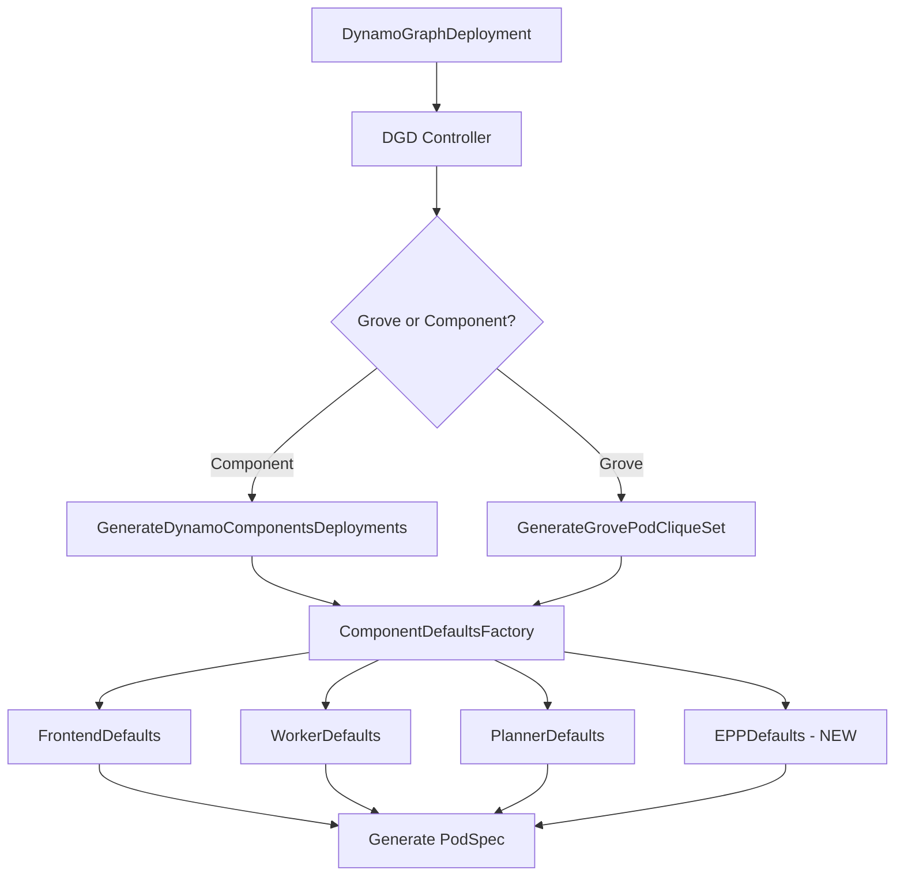

# Add EPP Component Type to DGD Operator

## Overview

Implement EPP as a first-class component type in the Dynamo operator, similar to frontend/worker/planner. Users will deploy EPP by adding it as a service in their DGD `spec.services` map.

## Architecture

The operator currently supports multiple component types (frontend, worker, planner, etc.) through a factory pattern. Each component type has its own defaults file that provides base container and pod specifications. The reconciliation flow works as follows:



## Implementation Steps

### 1. Add EPP Component Type Constant

**File:** [`deploy/operator/internal/consts/consts.go`](deploy/operator/internal/consts/consts.go)

Add the EPP component type constant alongside existing types:

```go
ComponentTypeEPP = "epp"
```

This will be added after line 69 where other component types are defined.

### 2. Create EPP Component Defaults

**File:** [`deploy/operator/internal/dynamo/component_epp.go`](deploy/operator/internal/dynamo/component_epp.go) (NEW)

Create a new file implementing `ComponentDefaults` interface for EPP. Based on the Helm template analysis, EPP needs:

- **Container ports:** 9002 (gRPC), 9003 (gRPC health), 9090 (metrics)
- **Probes:** gRPC-based liveness/readiness on port 9003
- **Args:** Pool configuration (pool-name, pool-namespace, pool-group, config-file, ports)
  - **Note (PR #5592):** pool-group should be `inference.networking.k8s.io` (stable API)
- **Environment variables:**
  - Standard pod metadata (POD_NAMESPACE, POD_NAME, POD_UID)
  - Dynamo configuration (DYNAMO_NAMESPACE, DYN_DISCOVERY_BACKEND)
  - Platform services:
    - NATS_SERVER (always required)
    - ETCD_ENDPOINTS (only when using ETCD for discovery, conditional on useEtcd flag)
  - EPP-specific (DYNAMO_KV_BLOCK_SIZE, USE_STREAMING)
  - **Note (PR #5592):** DYNAMO_ROUTER_REPLICA_SYNC removed
  - HF_TOKEN (optional, from secret)
  - RUST_LOG for debugging
- **Volumes:**
  - hf-cache (emptyDir)
  - epp-config (ConfigMap mount at /etc/epp)

Key differences from frontend/worker:
- Uses gRPC probes instead of HTTP
- Requires ConfigMap for EPP configuration
- Needs access to Dynamo platform services (NATS always, ETCD conditionally)

### 3. Update Component Factory

**File:** [`deploy/operator/internal/dynamo/component_common.go`](deploy/operator/internal/dynamo/component_common.go)

Update `ComponentDefaultsFactory` function (lines 26-37) to include EPP case:

```go
case commonconsts.ComponentTypeEPP:
    return NewEPPDefaults()
```

### 4. Create EPP Service Generator

**File:** [`deploy/operator/internal/dynamo/epp_service.go`](deploy/operator/internal/dynamo/epp_service.go) (NEW)

Create a function to generate the EPP Service. Based on the Helm template:

- **Service Name:** `{dgd-name}-epp` (e.g., "vllm-agg-epp")
- **Selector:** `app: {dgd-name}-epp`
- **Ports:**
  - Port 9002 (gRPC, appProtocol: http2) - used by InferencePool
  - Optional: Port 9003 (health), Port 9090 (metrics)
- **Type:** ClusterIP

### 5. Setup EPP RBAC (Follow Planner Pattern)

EPP needs a **global ServiceAccount** (similar to planner) with ClusterRole permissions to:

- Read InferencePools (`inference.networking.k8s.io` stable API only - per PR #5592)
  - **Note:** No longer needs `inference.networking.x-k8s.io` experimental API permissions
- Read Pods (for backend discovery)
- Read/Write EndpointSlices (for Dynamo k8s service discovery)
- Create/manage DynamoWorkerMetadata CRs
- TokenReviews and SubjectAccessReviews (for auth)

**Implementation approach:** Follow the planner RBAC pattern exactly:

1. Add to `consts.go`:
```go
EPPServiceAccountName = "epp-serviceaccount"
EPPClusterRoleName = "epp-cluster-role"
```

2. The operator's existing RBAC manager will handle creation (same as planner)
   - No need for separate `epp_rbac.go` file
   - RBAC resources defined in Helm charts under `deploy/helm/charts/platform/components/operator/templates/`
   - Add `epp-clusterrole.yaml` and `epp-clusterrolebinding.yaml` similar to `planner.yaml`

3. The DGD controller calls `RBACManager.EnsureServiceAccountWithRBAC()` for EPP (see section 9)

All EPP pods across all DGDs will reference this shared ServiceAccount.

### 6. Import EndpointPickerConfig Types

**Files:**
- Update `go.mod` to import Gateway API Inference Extension types
- No need for separate `epp_types.go` - we'll import directly

Add dependency:
```go
require (
    sigs.k8s.io/gateway-api-inference-extension v0.x.x
)
```

Import the [EndpointPickerConfig struct](https://github.com/kubernetes-sigs/gateway-api-inference-extension/blob/main/apix/config/v1alpha1/endpointpickerconfig_types.go) from `inference.networking.x-k8s.io/v1alpha1` package.

This provides proper type-safe configuration with validation.

### 7. Create EPP ConfigMap Generator

**File:** [`deploy/operator/internal/dynamo/epp_config.go`](deploy/operator/internal/dynamo/epp_config.go) (NEW)

Create a function to generate the EPP ConfigMap. Three approaches supported:

**Option 1: ConfigMap Reference** (User manages ConfigMap)
- User creates their own ConfigMap with EPP configuration
- EPP service spec references it: `eppConfig.configMapRef`
- Operator mounts the referenced ConfigMap

**Option 2: Inline Configuration** (Operator generates ConfigMap from Go struct)
- User provides EndpointPickerConfig as a **Go struct** in DGD spec: `eppConfig.config`
- Uses imported type from [gateway-api-inference-extension](https://github.com/kubernetes-sigs/gateway-api-inference-extension/blob/main/apix/config/v1alpha1/endpointpickerconfig_types.go)
- Operator marshals the struct to YAML and creates ConfigMap
- ConfigMap name: `{dgd-name}-epp-config`
- ConfigMap key: `epp-config-dynamo.yaml`
- Set DGD as owner for automatic cleanup

**Option 3: Default** (Operator uses embedded default)
- Neither configMapRef nor config is set
- Operator creates ConfigMap with embedded default configuration

**Implementation:**
1. Check if `EPPConfig.ConfigMapRef` is set → mount existing ConfigMap
2. Else check if `EPPConfig.Config` is set → marshal struct to YAML, create ConfigMap
3. Else → create ConfigMap with default embedded config (as Go struct, then marshaled)

Default configuration (as Go struct):
```go
import apixv1alpha1 "sigs.k8s.io/gateway-api-inference-extension/apix/config/v1alpha1"

defaultConfig := &apixv1alpha1.EndpointPickerConfig{
    TypeMeta: metav1.TypeMeta{
        APIVersion: "inference.networking.x-k8s.io/v1alpha1",
        Kind: "EndpointPickerConfig",
    },
    Plugins: []apixv1alpha1.PluginSpec{
        {Type: "single-profile-handler"},
        {Name: "picker", Type: "max-score-picker"},
        {Name: "dyn-kv", Type: "kv-aware-scorer"},
    },
    SchedulingProfiles: []apixv1alpha1.SchedulingProfile{
        {
            Name: "default",
            Plugins: []apixv1alpha1.SchedulingPlugin{
                {PluginRef: "dyn-kv", Weight: ptr.To(1)},
                {PluginRef: "picker"},
            },
        },
    },
}
```

### 8. Create InferencePool Generator

**File:** [`deploy/operator/internal/dynamo/epp_inference_pool.go`](deploy/operator/internal/dynamo/epp_inference_pool.go) (NEW)

The operator must create InferencePool resource to solve the chicken-and-egg problem:
- EPP references the InferencePool in its args
- InferencePool references the EPP Service

**IMPORTANT - API Migration (PR #5592):**
The Gateway API Inference is consolidating to use **only** the stable `inference.networking.k8s.io/v1` API. The experimental `inference.networking.x-k8s.io/v1alpha2` API is being deprecated.

Generate **one** InferencePool resource per EPP using the stable API:

**InferencePool** (`inference.networking.k8s.io/v1`):
```yaml
apiVersion: inference.networking.k8s.io/v1
kind: InferencePool
metadata:
  name: {dgd-name}-pool
spec:
  targetPorts:
    - number: 8000  # Frontend port
  selector:
    matchLabels:
      nvidia.com/dynamo-component: Frontend
      nvidia.com/dynamo-namespace: {dynamo-namespace}
  endpointPickerRef:
    group: ""
    kind: Service
    name: {dgd-name}-epp-service
    port:
      number: 9002
```

This single InferencePool serves both purposes:
- Used by kGateway to resolve HTTPRoute backends
- Used by EPP to discover and route to backend pods

The InferencePool should be owned by the DGD for automatic cleanup.

### 9. Update DGD Controller Reconciliation

**File:** [`deploy/operator/internal/controller/dynamographdeployment_controller.go`](deploy/operator/internal/controller/dynamographdeployment_controller.go)

Add logic to reconcile EPP resources in the `reconcileResources` method (around line 222). This should happen before component/Grove reconciliation:

```go
// Ensure EPP RBAC exists in cluster-wide mode (similar to planner RBAC)
if r.Config.RestrictedNamespace == "" && hasEPPService(dynamoDeployment) {
    if r.RBACManager == nil {
        return ReconcileResult{}, fmt.Errorf("RBAC manager not initialized in cluster-wide mode")
    }
    if err := r.RBACManager.EnsureServiceAccountWithRBAC(
        ctx,
        dynamoDeployment.Namespace,
        consts.EPPServiceAccountName,
        consts.EPPClusterRoleName,
    ); err != nil {
        logger.Error(err, "Failed to ensure EPP RBAC")
        return ReconcileResult{}, fmt.Errorf("failed to ensure EPP RBAC: %w", err)
    }
}

// Reconcile EPP resources (ConfigMaps, Services, InferencePools) if EPP service exists
err = r.reconcileEPPResources(ctx, dynamoDeployment)
if err != nil {
    logger.Error(err, "Failed to reconcile EPP resources")
    return ReconcileResult{}, fmt.Errorf("failed to reconcile EPP resources: %w", err)
}
```

Implement `reconcileEPPResources` method to:
1. Create/update ConfigMaps for EPP configuration (from EndpointPickerConfig spec)
2. Create/update Services for EPP (port 9002 gRPC)
3. Create/update InferencePool (stable v1 API only - per PR #5592)
4. Handle cleanup when EPP service is removed

### 10. Handle EPP in Reconciliation Loops

**File:** [`deploy/operator/internal/dynamo/graph.go`](deploy/operator/internal/dynamo/graph.go)

EPP pods need proper labels for service discovery. Ensure the component generation adds:

- Standard Dynamo labels (dynamo-component, dynamo-namespace, etc.)
- EPP-specific labels (componentType: epp)
- App label for Service selector

The existing component iteration logic in both Grove and Component pathways will automatically handle EPP, but we need to ensure Services are created. Currently, services are only created for:

- Frontend components (always)
- Other components when K8s discovery is enabled

Update the service creation logic to also include EPP components regardless of K8s discovery mode.

### 11. Add EPP Spec Fields to API Types

**File:** [`deploy/operator/api/v1alpha1/dynamocomponentdeployment_types.go`](deploy/operator/api/v1alpha1/dynamocomponentdeployment_types.go)

Add EPP-specific configuration fields to `DynamoComponentDeploymentSharedSpec`:

```go
// EPPConfig defines EPP-specific configuration options
// +optional
EPPConfig *EPPConfig `json:"eppConfig,omitempty"`
```

Create new type:

```go
import apixv1alpha1 "sigs.k8s.io/gateway-api-inference-extension/apix/config/v1alpha1"

// EPPConfig contains configuration for EPP components
type EPPConfig struct {
    // ConfigMapRef references a user-provided ConfigMap containing EPP configuration
    // The ConfigMap should have a key with the EPP config YAML
    // Mutually exclusive with Config
    // +optional
    ConfigMapRef *ConfigMapKeySelector `json:"configMapRef,omitempty"`
    
    // Config allows specifying EPP EndpointPickerConfig directly as a Go struct
    // The operator will marshal this to YAML and create a ConfigMap
    // Mutually exclusive with ConfigMapRef
    // +optional
    Config *apixv1alpha1.EndpointPickerConfig `json:"config,omitempty"`
    
    // PoolName is the name of the InferencePool to create and watch
    // Defaults to {dgd-name}-pool
    // +optional
    PoolName *string `json:"poolName,omitempty"`
    
    // PoolNamespace is the namespace of the InferencePool
    // Defaults to DGD namespace
    // +optional
    PoolNamespace *string `json:"poolNamespace,omitempty"`
    
    // KVBlockSize for Dynamo KV-aware routing
    // +optional
    // +kubebuilder:default="16"
    KVBlockSize *string `json:"kvBlockSize,omitempty"`
    
    // UseEtcd when true, EPP uses ETCD for discovery instead of Kubernetes
    // +optional
    UseEtcd *bool `json:"useEtcd,omitempty"`
}
```

The `Config` field uses the actual [EndpointPickerConfig type](https://github.com/kubernetes-sigs/gateway-api-inference-extension/blob/main/apix/config/v1alpha1/endpointpickerconfig_types.go) imported from Gateway API Inference Extension.

### 12. Update Component Validation

**File:** [`deploy/operator/internal/webhook/validation/dynamographdeployment.go`](deploy/operator/internal/webhook/validation/dynamographdeployment.go)

Add validation rules for EPP components:
- EPP should be single-node only (no multinode support)
- EPP typically has 1 replica (validate if replicas > 1, warn but allow)
- Validate EPPConfig if present:
  - Only one of `configMapRef` or `config` can be set (mutually exclusive)
  - If `configMapRef` is set, ensure the referenced ConfigMap exists
  - If `config` is set, validate required fields (plugins, schedulingProfiles)
- Ensure EPP service has proper pool configuration

### 13. Integration Points

#### Both Pathways (Grove and Component)
- The factory pattern automatically handles EPP through `ComponentDefaultsFactory`
- No special-casing needed in `GenerateDynamoComponentsDeployments` or `GenerateGrovePodCliqueSet`
- The existing component iteration logic will process EPP like any other service

#### Service Discovery
- EPP Service created by operator is referenced by InferencePool
- InferencePool selects Frontend pods via labels
- EPP discovers backends through InferencePool watch

### 14. Environment Variable Handling

EPP requires platform service connectivity:

- **NATS_SERVER:** Always required, constructed from platformReleaseName and platformNamespace
- **ETCD_ENDPOINTS:** Only set when `useEtcd: true` in EPPConfig
- **DYN_DISCOVERY_BACKEND:** 
  - Set to "etcd" when `useEtcd: true`
  - Set to "kubernetes" when `useEtcd: false` (default)
- **DYNAMO_KV_BLOCK_SIZE:** Default "16", configurable via EPPConfig.kvBlockSize
- **USE_STREAMING:** Set to "true" for streaming support
- **DYNAMO_ROUTER_REPLICA_SYNC:** ~~Removed in PR #5592~~ (no longer needed)

These should be configurable via DGD spec or operator config.

### 15. PR #5592 Integration Notes

**Important API Migration:** The upcoming PR #5592 consolidates Gateway API Inference to use only the stable `inference.networking.k8s.io/v1` API, deprecating the experimental `inference.networking.x-k8s.io/v1alpha2` API.

**Changes to implement:**

1. **InferencePool API:**
   - Use ONLY `inference.networking.k8s.io/v1`
   - Remove v1alpha2 InferencePool generation
   - Single InferencePool serves both kGateway and EPP

2. **EPP Container Args:**
   - `-pool-group` value: `inference.networking.k8s.io` (not `x-k8s.io`)

3. **Environment Variables:**
   - Remove `DYNAMO_ROUTER_REPLICA_SYNC` (no longer needed)
   - Keep `USE_STREAMING=true`

4. **ClusterRole Permissions:**
   - Remove experimental API groups: `inference.networking.x-k8s.io`
   - Keep only stable: `inference.networking.k8s.io`

5. **Go Module Dependency:**
   - Import from stable API package path
   - Ensure compatibility with v1 InferencePool spec

## Testing Strategy

1. **Unit Tests:**
   - Add tests in `component_epp_test.go` for EPP defaults generation
   - Test ConfigMap generation from EndpointPickerConfig struct
   - Test marshaling EndpointPickerConfig to YAML
   - Test InferencePool generation

2. **Integration Tests:**
   - Add test cases in `graph_test.go` for DGD with EPP service
   - Test with custom EndpointPickerConfig (Go struct)
   - Test with ConfigMapRef
   - Test with default config
   - Test RBAC creation

3. **E2E Tests:** Deploy a DGD with EPP and verify:
   - EPP deployment is created
   - EPP Service is exposed
   - EPP ConfigMap is mounted
   - EPP pods are running and healthy

## Example DGD with EPP

```yaml
apiVersion: nvidia.com/v1alpha1
kind: DynamoGraphDeployment
metadata:
  name: vllm-with-epp
  namespace: my-model
spec:
  services:
    Frontend:
      componentType: frontend
      replicas: 2
      # ... frontend config
    
    EPP:
      componentType: epp
      replicas: 1
      extraPodSpec:
        mainContainer:
          image: gitlab-master.nvidia.com:5005/.../epp-inference-extension-dynamo:latest
      eppConfig:
        kvBlockSize: "16"
        useEtcd: false  # Use Kubernetes for discovery (default)
        # Option 1: Reference existing ConfigMap
        configMapRef:
          name: my-epp-config
          key: config.yaml
        # Option 2: Inline configuration as Go struct (mutually exclusive with configMapRef)
        # config:
        #   plugins:
        #     - type: single-profile-handler
        #     - name: picker
        #       type: max-score-picker
        #     - name: dyn-kv
        #       type: kv-aware-scorer
        #   schedulingProfiles:
        #     - name: default
        #       plugins:
        #         - pluginRef: dyn-kv
        #           weight: 1
        #         - pluginRef: picker
```

## Files to Modify/Create

**New Files:**
1. `deploy/operator/internal/dynamo/component_epp.go` - EPP defaults implementation
2. `deploy/operator/internal/dynamo/epp_config.go` - ConfigMap generator
3. `deploy/operator/internal/dynamo/epp_service.go` - Service generator
4. `deploy/operator/internal/dynamo/epp_inference_pool.go` - InferencePool generator
5. `deploy/operator/internal/dynamo/component_epp_test.go` - Unit tests
6. `deploy/helm/charts/platform/components/operator/templates/epp-clusterrole.yaml` - EPP RBAC ClusterRole
7. `deploy/helm/charts/platform/components/operator/templates/epp-clusterrolebinding.yaml` - EPP RBAC binding

**Modified Files:**
1. `deploy/operator/internal/consts/consts.go` - Add ComponentTypeEPP, EPPServiceAccountName constants
2. `deploy/operator/internal/dynamo/component_common.go` - Update factory
3. `deploy/operator/internal/controller/dynamographdeployment_controller.go` - Add EPP resource reconciliation
4. `deploy/operator/api/v1alpha1/dynamocomponentdeployment_types.go` - Add EPPConfig field
5. `deploy/operator/internal/dynamo/graph.go` - Ensure service creation for EPP
6. `deploy/operator/internal/dynamo/graph_test.go` - Add integration tests
7. `deploy/operator/internal/webhook/validation/dynamographdeployment.go` - Add EPP validation
8. `go.mod` - Add Gateway API Inference dependency (stable v1 API)

**Notes on PR #5592:**
- Use `inference.networking.k8s.io/v1` API group (stable) instead of experimental `x-k8s.io`
- Pool group in EPP args should be `inference.networking.k8s.io`
- Only one InferencePool needed (stable API serves both kGateway and EPP)
- DYNAMO_ROUTER_REPLICA_SYNC env var removed (no longer needed)
- ClusterRole no longer needs experimental API groups

## Key Design Decisions

1. **One EPP per DGD:** Simplifies management, aligns with typical usage pattern
2. **Operator creates InferencePool:** Solves chicken-and-egg dependency between EPP and InferencePool
3. **Service-based enablement:** Natural fit with existing DGD services pattern
4. **Standard component pathway:** Reuses all existing reconciliation logic
5. **Type-safe configuration:** EndpointPickerConfig as proper Go struct from upstream, not YAML string
6. **Global EPP ServiceAccount:** One RBAC setup per cluster/namespace, shared by all EPP pods
7. **ConfigMap auto-generation:** Operator marshals EndpointPickerConfig to YAML automatically
8. **Stable API only (PR #5592):** Use `inference.networking.k8s.io/v1`, not experimental `x-k8s.io` API
9. **Single InferencePool:** One pool serves both kGateway and EPP use cases

## Dependencies

- HuggingFace token secret (optional, for model config downloads)
- Dynamo platform components:
  - NATS (always required)
  - ETCD (only when using ETCD for discovery, configured via `useEtcd: true`)
- Gateway API Inference CRDs and types:
  - InferencePool v1 stable API: `sigs.k8s.io/gateway-api-inference` 
  - EndpointPickerConfig types: `sigs.k8s.io/gateway-api-inference-extension/apix/config/v1alpha1`
  - **Important:** Use `inference.networking.k8s.io/v1` for InferencePool (per PR #5592)
  - **Important:** EndpointPickerConfig is `inference.networking.x-k8s.io/v1alpha1` (config API, not resource API)
- DynamoWorkerMetadata CRD (for k8s discovery)

## Migration Path

For existing EPP Helm deployments:
1. Convert Helm values to DGD service configuration
2. EPP configuration options:
   - **Option A:** Keep existing ConfigMap and reference it via `eppConfig.configMapRef`
   - **Option B:** Convert YAML config to Go struct and use `eppConfig.config` (recommended)
   - **Option C:** Remove config entirely to use operator's embedded default
3. Image set via `extraPodSpec.mainContainer.image`
4. RBAC now managed by operator Helm chart (remove manual ClusterRole/Binding from app Helm chart)
5. InferencePool now managed by operator (remove manual creation)
6. Platform namespace/release name configured via DGD annotations or operator config
7. Set `useEtcd: true` in EPPConfig if using ETCD for discovery (otherwise defaults to Kubernetes)

## Summary of Changes from Original Helm Chart

| Resource | Helm Chart | Operator | Notes (PR #5592) |
|----------|-----------|----------|------------------|
| Deployment | Manual template | Generated via component_epp.go | Args use stable API group |
| Service | Manual template | Generated via epp_service.go | Same |
| ConfigMap | Files.Get template | Generated from Go struct OR referenced | Type-safe config |
| ServiceAccount | Uses "default" | Global EPP SA via operator Helm chart | Same |
| ClusterRole | Manual template | Global EPP role via operator Helm chart | Only stable API permissions |
| InferencePool | 2 pools (v1 + v1alpha2) | 1 pool (v1 only) via epp_inference_pool.go | **Breaking: Use stable API only** |
| Configuration | Helm values | Structured EPPConfig in DGD spec | Same |
| Env Vars | DYNAMO_ROUTER_REPLICA_SYNC | Not included | **Removed in PR #5592** |
