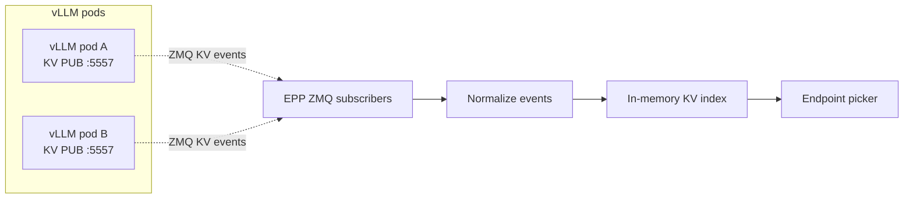

<!--
SPDX-FileCopyrightText: Copyright (c) 2025-2026 NVIDIA CORPORATION & AFFILIATES. All rights reserved.
SPDX-License-Identifier: Apache-2.0
-->

# Dynamo EPP on-ramp for vanilla vLLM

This directory contains raw Kubernetes manifests for an experimental on-ramp that runs Dynamo's
Endpoint Picker Plugin (EPP) behind Gateway API Inference Extension (GAIE) with stock `vLLM serve`
pods. It does not install the Dynamo operator, create a `DynamoGraphDeployment`, or run Dynamo's
NATS/JetStream event plane.

For the user-facing walkthrough, start with
[Vanilla vLLM GAIE On-ramp](../../../../../docs/kubernetes/gateway-api/vanilla-vllm-onramp.mdx).
That page shows the Gateway API, GAIE, agentgateway, Istio, credentials, deployment, verification,
and cleanup steps in order.

## Status

This on-ramp is experimental. Use it with an EPP image that includes router-only on-ramp support.
For the supported operator-managed GAIE path, use the
[GAIE Quickstart](../../../../../docs/kubernetes/gateway-api/quickstart.mdx).

## Examples

| Manifest | Topology | Notes |
|---|---|---|
| `agg.yaml` | Aggregated | Stock vLLM pods plus a Dynamo EPP that selects a decode endpoint. |
| `disagg.yaml` | Disaggregated | Experimental. Requires a decode-side P/D routing sidecar image before applying. |

Both manifests are namespace-neutral. Apply them with `kubectl apply -n <namespace> -f ...` after
creating the namespace, Gateway API resources, GAIE CRDs, a Gateway, and any model credentials.

## Images and versions

The examples use the Dynamo release-line image convention:

```text
nvcr.io/nvidia/ai-dynamo/dynamo-frontend:1.3.0
```

While router-only on-ramp support is under development, replace that tag if your test branch
publishes the EPP under a different image. Keep the EPP image, any Dynamo runtime images, and the
documentation branch on the same release line when possible.

The aggregated on-ramp uses the public `vllm/vllm-openai:latest` image. Replace it with the vLLM
image your platform standardizes on if you need a pinned or internally mirrored image.

The disaggregated on-ramp also needs a decode-side P/D routing sidecar image. The manifest keeps
that as an explicit placeholder:

```yaml
image: "<your-registry>/dynamo-pd-sidecar:dev"
```

## How the on-ramp works

In the operator-managed GAIE path, Dynamo creates the worker graph, runtime discovery, EPP Service,
and `InferencePool` together. In this on-ramp, an existing GAIE stack keeps stock vLLM pods and uses
a Dynamo EPP image as the Endpoint Picker. The EPP embeds Dynamo routing logic so the Gateway API
implementation can ask it to choose an endpoint.

The example manifests express the experimental router-only contract on the EPP container:

```yaml
- name: DYN_EPP_MODE
  value: "router-only"
```

The EPP watches ready vLLM pods with `DYN_EPP_POD_SELECTOR`, subscribes to native vLLM KV cache
events when `DYN_EPP_KV_EVENTS=true`, tokenizes prompts for routing, and returns the selected
endpoint to the gateway.



## What Dynamo-managed GAIE adds

Router-only mode starts with an empty KV index. It does not know which prefixes are already cached on
existing vLLM pods, so early requests route with little or no cache-awareness until fresh KV events
arrive and the index warms.

The operator-managed GAIE path adds the Dynamo runtime around the same Gateway API integration goal:

- NATS/JetStream-backed event delivery for routing state.
- Replay after EPP restart or temporary disconnects.
- Gap detection and recovery when events are missed.
- Initial worker cache-state synchronization instead of rebuilding the index only from live traffic.
- Operator-managed lifecycle for workers, Services, `InferencePool`, and EPP resources.
